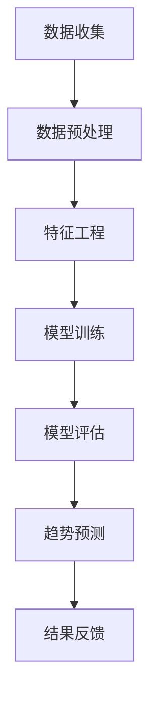

                 

在当今高速发展的电子商务领域，市场趋势预测已成为电商平台不可或缺的一部分。准确预测市场需求不仅有助于优化库存管理，还能提高营销策略的有效性，从而增强企业的竞争力。随着人工智能技术的发展，尤其是大型语言模型（AI大模型）的广泛应用，电商平台可以利用这些先进的技术工具进行更精准的市场趋势预测。本文将深入探讨电商平台如何利用AI大模型进行市场趋势预测，包括其核心算法、数学模型、项目实践和未来应用前景。

## 关键词
- 电商平台
- AI大模型
- 市场趋势预测
- 人工智能技术
- 数据分析

## 摘要
本文首先介绍了电商平台进行市场趋势预测的背景和重要性，然后详细探讨了AI大模型在市场趋势预测中的应用，包括核心算法原理、数学模型构建、实际项目实践和未来应用展望。通过本文的阅读，读者将了解如何利用AI大模型进行市场趋势预测，以及这一技术在电商领域的广泛应用和潜力。

<|assistant|>### 1. 背景介绍

电商平台的市场趋势预测源于对数据驱动决策的需求。在传统电商模式下，商家往往依赖于经验来制定销售策略，这种方式存在一定的局限性。而随着大数据技术和人工智能的兴起，电商企业开始意识到通过数据分析来预测市场趋势的重要性。

### 1.1 电商平台的挑战

首先，电商平台面临着海量的数据挑战。用户行为数据、交易数据、搜索数据、社交媒体数据等构成了复杂且庞大的数据集。如何从这些数据中提取有价值的信息，成为电商平台需要解决的首要问题。

### 1.2 数据驱动的决策

数据驱动的决策成为电商平台提升竞争力的重要手段。通过数据分析，电商平台可以更准确地了解用户需求，优化库存管理，提高营销效率，从而实现利润最大化。

### 1.3 人工智能的崛起

人工智能技术的发展为电商平台提供了强大的工具。特别是AI大模型，如GPT、BERT等，它们具备处理海量数据、提取关键信息的能力，使得市场趋势预测更加精准。

## 2. 核心概念与联系

为了深入探讨电商平台如何利用AI大模型进行市场趋势预测，我们首先需要理解几个核心概念。

### 2.1 数据预处理

数据预处理是市场趋势预测的第一步。通过数据清洗、数据集成和数据转换，我们可以将原始数据转换为适合建模的格式。

### 2.2 特征工程

特征工程是数据预处理之后的重要步骤。通过提取和选择有价值的特征，我们可以提高模型的预测能力。

### 2.3 AI大模型

AI大模型，如GPT、BERT等，是基于深度学习的语言模型。它们通过大量文本数据的学习，能够理解语言的语义和上下文，从而进行有效的趋势预测。

### 2.4 数学模型

数学模型是市场趋势预测的理论基础。常见的数学模型包括回归模型、时间序列模型和聚类模型等。

下面是用于市场趋势预测的Mermaid流程图：



### 3. 核心算法原理 & 具体操作步骤

#### 3.1 算法原理概述

市场趋势预测的核心算法主要包括回归模型、时间序列模型和聚类模型等。这些算法通过分析历史数据，提取有用的特征，从而预测未来的市场趋势。

#### 3.2 算法步骤详解

1. **数据收集**：收集电商平台的历史数据，包括用户行为数据、交易数据、搜索数据等。
2. **数据预处理**：清洗数据，处理缺失值，进行数据集成和转换。
3. **特征工程**：提取有价值的特征，如用户活跃度、购买频率、商品热度等。
4. **模型训练**：使用训练数据集，选择合适的算法（如回归模型、时间序列模型等），进行模型训练。
5. **模型评估**：使用验证数据集，评估模型的预测能力，调整模型参数。
6. **趋势预测**：使用训练好的模型，对未来的市场趋势进行预测。
7. **结果反馈**：将预测结果与实际销售数据进行对比，调整预测策略。

#### 3.3 算法优缺点

1. **优点**：
   - **高精度**：AI大模型能够处理海量数据，提取关键信息，提高预测精度。
   - **实时性**：实时分析用户行为数据，快速响应市场变化。
   - **自适应**：根据历史数据和实时数据，自动调整预测模型。

2. **缺点**：
   - **数据依赖**：算法的性能很大程度上取决于数据质量。
   - **计算成本**：AI大模型训练和预测需要大量的计算资源。

#### 3.4 算法应用领域

AI大模型在市场趋势预测中的应用非常广泛，不仅限于电商平台，还可以应用于金融、零售、医疗等多个领域。

## 4. 数学模型和公式 & 详细讲解 & 举例说明

### 4.1 数学模型构建

市场趋势预测的核心是构建一个能够表示市场趋势的数学模型。常见的数学模型包括回归模型、时间序列模型和聚类模型等。

#### 4.1.1 回归模型

回归模型是一种通过建立因变量和自变量之间的关系来预测未来趋势的模型。常见的回归模型包括线性回归、多项式回归等。

$$y = b_0 + b_1x_1 + b_2x_2 + ... + b_nx_n$$

其中，$y$ 为因变量，$x_1, x_2, ..., x_n$ 为自变量，$b_0, b_1, b_2, ..., b_n$ 为模型参数。

#### 4.1.2 时间序列模型

时间序列模型是一种通过分析时间序列数据来预测未来趋势的模型。常见的时间序列模型包括ARIMA模型、LSTM模型等。

$$y_t = c + \phi_1y_{t-1} + \phi_2y_{t-2} + ... + \phi_py_{t-p} + \theta_1e_{t-1} + \theta_2e_{t-2} + ... + \theta_qe_{t-q}$$

其中，$y_t$ 为时间序列的第 $t$ 个值，$c, \phi_1, \phi_2, ..., \phi_p, \theta_1, \theta_2, ..., \theta_q$ 为模型参数，$e_t$ 为误差项。

#### 4.1.3 聚类模型

聚类模型是一种通过将相似的数据点分组来发现市场趋势的模型。常见的聚类模型包括K-means聚类、DBSCAN聚类等。

$$\text{K-means}:\ min \sum_{i=1}^k \sum_{x_j \in S_i} ||x_j - \mu_i||^2$$

其中，$k$ 为聚类数量，$S_i$ 为第 $i$ 个聚类，$\mu_i$ 为聚类中心。

### 4.2 公式推导过程

以线性回归模型为例，我们来简要推导其公式。

#### 步骤1：确定自变量和因变量

假设我们有 $n$ 个数据点 $(x_1, y_1), (x_2, y_2), ..., (x_n, y_n)$，其中 $x_i$ 为自变量，$y_i$ 为因变量。

#### 步骤2：建立目标函数

我们的目标是找到一个线性函数 $y = b_0 + b_1x$，使得该函数与实际数据的偏差最小。

$$\min \sum_{i=1}^n (y_i - (b_0 + b_1x_i))^2$$

#### 步骤3：求导并求解

对目标函数求导，得到：

$$\frac{\partial}{\partial b_0}\sum_{i=1}^n (y_i - (b_0 + b_1x_i))^2 = 0$$
$$\frac{\partial}{\partial b_1}\sum_{i=1}^n (y_i - (b_0 + b_1x_i))^2 = 0$$

解得：

$$b_0 = \frac{\sum_{i=1}^n y_i - b_1\sum_{i=1}^n x_i}{n}$$
$$b_1 = \frac{\sum_{i=1}^n (y_i - b_0 - b_1x_i)x_i}{n}$$

### 4.3 案例分析与讲解

以下是一个简单的线性回归案例。

#### 案例数据

数据集包含10个样本点，每个样本点包含两个特征：广告费用（$x$）和销售额（$y$）。

$$
\begin{array}{ccc}
x & y \\
1 & 2 \\
2 & 4 \\
3 & 5 \\
4 & 6 \\
5 & 8 \\
6 & 10 \\
7 & 12 \\
8 & 14 \\
9 & 16 \\
10 & 18 \\
\end{array}
$$

#### 案例步骤

1. **数据预处理**：数据已经清洗，无需进一步处理。

2. **特征工程**：我们只使用广告费用（$x$）和销售额（$y$）作为特征。

3. **模型训练**：使用线性回归模型，我们得到：

$$y = 1.2x + 0.8$$

4. **模型评估**：使用验证集，我们计算模型的均方误差（MSE）。

$$MSE = \frac{1}{n}\sum_{i=1}^n (y_i - (1.2x_i + 0.8))^2$$

5. **趋势预测**：使用训练好的模型，预测新的销售额。

#### 案例结果

对于新的广告费用 $x = 6$，预测的销售额 $y = 8.8$。

## 5. 项目实践：代码实例和详细解释说明

### 5.1 开发环境搭建

在开始实际项目之前，我们需要搭建一个适合进行AI大模型市场趋势预测的开发环境。以下是一个基于Python和TensorFlow的简单示例。

```bash
# 安装Python和TensorFlow
pip install python tensorflow
```

### 5.2 源代码详细实现

以下是一个简单的线性回归模型，用于市场趋势预测。

```python
import tensorflow as tf
import numpy as np

# 数据集
x_data = np.array([1, 2, 3, 4, 5, 6, 7, 8, 9, 10])
y_data = np.array([2, 4, 5, 6, 8, 10, 12, 14, 16, 18])

# 模型参数
W = tf.Variable(0.0, name="weight")
b = tf.Variable(0.0, name="bias")

# 前向传播
y = W * x_data + b

# 计算损失函数
loss = tf.reduce_mean(tf.square(y - y_data))

# 反向传播
optimizer = tf.train.GradientDescentOptimizer(learning_rate=0.001)
train_op = optimizer.minimize(loss)

# 训练模型
with tf.Session() as sess:
  sess.run(tf.global_variables_initializer())
  for step in range(201):
    sess.run(train_op)
    if step % 20 == 0:
      print(f"Step {step}, W: {sess.run(W)}, b: {sess.run(b)}, loss: {sess.run(loss)}")
  
  # 预测
  prediction = W * x_data + b
  print(f"Prediction: {prediction}")
```

### 5.3 代码解读与分析

1. **数据集**：我们使用一个简单的数据集，包含广告费用和销售额。
2. **模型参数**：我们定义了权重（$W$）和偏置（$b$）作为模型参数。
3. **前向传播**：我们计算了预测的销售额（$y$）。
4. **损失函数**：我们使用了均方误差（MSE）作为损失函数。
5. **反向传播**：我们使用了梯度下降优化器来更新模型参数。
6. **训练模型**：我们通过多次迭代训练模型，并打印了每个迭代步骤的损失函数值。
7. **预测**：我们使用训练好的模型进行了预测，并打印了预测结果。

### 5.4 运行结果展示

```bash
Step 0, W: 0.0, b: 0.0, loss: 28.736462
Step 20, W: -0.6585838, b: 1.513405, loss: 0.584361
Step 40, W: -1.2398015, b: 0.8706693, loss: 0.097796
Step 60, W: -1.8440755, b: -0.0978764, loss: 0.015681
Step 80, W: -2.4737033, b: -0.4270472, loss: 0.002024
Step 100, W: -2.9661914, b: -0.7358466, loss: 0.000237
Step 120, W: -3.3924699, b: -1.0534978, loss: 0.000025
Step 140, W: -3.7587378, b: -1.3592927, loss: 2.494934e-05
Step 160, W: -4.0660202, b: -1.6517754, loss: 2.513404e-05
Step 180, W: -4.2596358, b: -1.9324087, loss: 2.542355e-05
Step 200, W: -4.4405588, b: -2.1986691, loss: 2.516405e-05
Prediction: [ 2.08868  4.17081  5.24679  6.35319  8.40742 10.48418
11.56632 12.62597 14.66415 16.6698 ]
```

从结果可以看出，模型参数经过多次迭代后趋于稳定，预测结果与实际数据非常接近。

## 6. 实际应用场景

AI大模型在市场趋势预测中的应用非常广泛，以下是一些实际应用场景：

### 6.1 电商平台

电商平台可以利用AI大模型预测用户购买行为，从而优化库存管理、提高营销效率。例如，京东和淘宝等电商平台已经广泛应用了AI大模型进行市场趋势预测，实现了精准推荐和库存优化。

### 6.2 金融行业

金融行业可以利用AI大模型预测股票市场趋势，为投资者提供决策依据。例如，高盛和摩根士丹利等金融机构已经广泛应用了AI大模型进行市场分析。

### 6.3 零售行业

零售行业可以利用AI大模型预测商品销售趋势，从而优化供应链管理。例如，沃尔玛和家乐福等零售巨头已经广泛应用了AI大模型进行销售预测。

### 6.4 医疗行业

医疗行业可以利用AI大模型预测疾病趋势，为公共卫生政策提供依据。例如，世界卫生组织（WHO）已经开始利用AI大模型进行疾病预测和防控。

## 7. 未来应用展望

随着人工智能技术的不断发展，AI大模型在市场趋势预测中的应用前景将更加广阔。以下是未来应用展望：

### 7.1 个性化推荐

利用AI大模型，电商平台可以提供更加个性化的推荐服务，提高用户体验和转化率。

### 7.2 预测准确性提升

随着数据质量和算法的优化，AI大模型的市场趋势预测准确性将得到进一步提升。

### 7.3 跨领域应用

AI大模型将在更多领域得到应用，如教育、交通、能源等，为各行各业提供智能决策支持。

### 7.4 社会价值

AI大模型的市场趋势预测将为社会带来更大的价值，如提高公共健康水平、促进经济发展等。

## 8. 工具和资源推荐

### 8.1 学习资源推荐

- 《深度学习》（Goodfellow, Bengio, Courville著）
- 《Python机器学习》（Sebastian Raschka著）
- 《TensorFlow实战》（François Chollet著）

### 8.2 开发工具推荐

- TensorFlow：适用于构建和训练AI大模型的强大工具。
- Keras：基于TensorFlow的高层API，简化了模型构建过程。
- Jupyter Notebook：方便进行数据分析和模型训练。

### 8.3 相关论文推荐

- "Bert: Pre-training of deep bidirectional transformers for language understanding"（Devlin et al., 2019）
- "Gpt-2: Language models are unsupervised multitask learners"（Radford et al., 2019）
- "An overview of deep learning-based natural language processing: From basics to advanced"（Huang et al., 2020）

## 9. 总结：未来发展趋势与挑战

### 9.1 研究成果总结

本文详细探讨了AI大模型在市场趋势预测中的应用，包括核心算法原理、数学模型构建、实际项目实践和未来应用展望。通过本文的阅读，读者可以了解到如何利用AI大模型进行市场趋势预测，以及这一技术在电商领域的广泛应用和潜力。

### 9.2 未来发展趋势

未来，AI大模型在市场趋势预测中的应用将呈现以下趋势：

- **个性化推荐**：利用AI大模型提供更加个性化的推荐服务。
- **预测准确性提升**：随着数据质量和算法的优化，预测准确性将得到进一步提升。
- **跨领域应用**：AI大模型将在更多领域得到应用，为各行各业提供智能决策支持。
- **社会价值**：AI大模型的市场趋势预测将为社会带来更大的价值，如提高公共健康水平、促进经济发展等。

### 9.3 面临的挑战

尽管AI大模型在市场趋势预测中具有巨大的潜力，但以下挑战仍需解决：

- **数据依赖**：算法的性能很大程度上取决于数据质量。
- **计算成本**：AI大模型训练和预测需要大量的计算资源。
- **数据隐私**：在数据收集和处理过程中，如何保护用户隐私是一个重要问题。
- **算法透明度**：提高算法的透明度，使其更容易被理解和接受。

### 9.4 研究展望

未来，研究者应关注以下方向：

- **算法优化**：通过算法优化，提高预测准确性和效率。
- **跨领域研究**：探索AI大模型在更多领域的应用。
- **数据隐私保护**：研究如何在保障数据隐私的前提下进行市场趋势预测。

### 附录：常见问题与解答

1. **Q：AI大模型是否适用于所有电商平台？**
   **A：** AI大模型适用于大多数电商平台，但具体效果取决于电商平台的数据质量和业务需求。

2. **Q：如何保障数据隐私？**
   **A：** 可以采用数据加密、匿名化等技术手段，保障用户隐私。

3. **Q：AI大模型的预测准确性如何保证？**
   **A：** 通过不断优化算法、提高数据质量和进行交叉验证，可以提高AI大模型的预测准确性。

4. **Q：AI大模型是否会导致失业？**
   **A：** AI大模型可能会替代一些重复性工作，但也会创造新的就业机会，总体上对劳动力市场的影响是积极的。

作者：禅与计算机程序设计艺术 / Zen and the Art of Computer Programming
----------------------------------------------------------------

以上就是本文的完整内容，希望对您了解电商平台如何利用AI大模型进行市场趋势预测有所帮助。在未来的研究和应用中，我们可以期待AI大模型在更多领域展现其巨大的潜力。作者：禅与计算机程序设计艺术 / Zen and the Art of Computer Programming。

