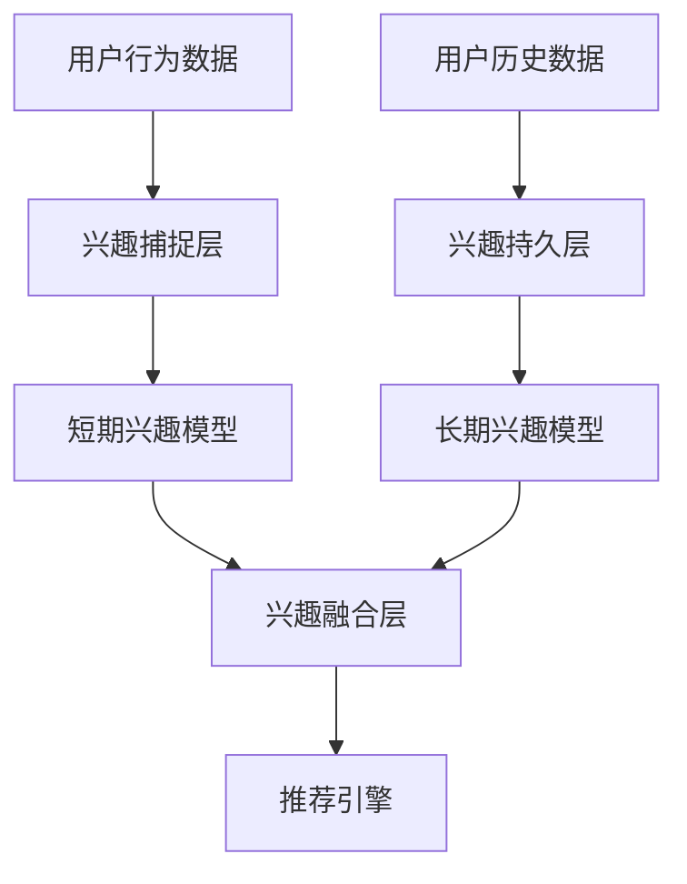

                 

电商推荐系统在当前互联网时代扮演着至关重要的角色。随着用户生成内容（UGC）和数据量的爆炸性增长，如何准确、及时地捕捉用户的兴趣和行为模式，已成为提高推荐系统效果的关键问题。本文将探讨在电商推荐系统中如何建立长短期兴趣模型，以提高推荐的相关性和精准度。

## 1. 背景介绍

推荐系统作为信息过滤和挖掘的重要工具，其核心目标是为用户提供个性化的信息推荐。在电商领域，推荐系统的作用尤为显著。它不仅能够提高用户的购物体验，还能显著提升商家销售额。然而，随着用户需求的多样化和数据的不确定性，传统的基于内容、协同过滤等推荐方法已难以满足用户对个性化、时效性的需求。

### 1.1 电商推荐系统的发展

电商推荐系统的发展大致可以分为以下几个阶段：

- **基于内容的推荐**：该阶段主要依赖于商品属性和用户历史行为数据，通过比较用户兴趣和商品属性的相关性进行推荐。

- **协同过滤推荐**：通过分析用户行为模式，找出相似的用户和商品，进而进行推荐。

- **混合推荐**：结合多种推荐方法，以提高推荐效果。

- **基于深度学习的推荐**：随着深度学习技术的兴起，推荐系统开始引入神经网络模型，以更好地捕捉用户和商品之间的复杂关系。

### 1.2 长短期兴趣建模的重要性

传统的推荐系统大多关注短期用户兴趣，而忽略了用户长期行为模式的变化。这可能导致以下问题：

- **推荐效果不佳**：短期兴趣可能无法准确反映用户长期偏好，导致推荐不准确。

- **用户流失**：长期未被满足的用户需求可能导致用户流失。

因此，建立长短期兴趣模型，动态地捕捉用户兴趣的变化，对于提升推荐系统的效果至关重要。

## 2. 核心概念与联系

在构建长短期兴趣模型之前，我们需要明确几个核心概念，并展示它们之间的联系。

### 2.1 长短期兴趣模型

- **短期兴趣**：指的是用户在短时间内表现出对某一类商品的强烈兴趣。

- **长期兴趣**：指的是用户在长期内稳定表现出的偏好。

### 2.2 数据来源

- **用户行为数据**：包括用户浏览、点击、购买等行为。

- **商品属性数据**：包括商品类别、价格、品牌等属性。

### 2.3 模型架构

- **兴趣捕捉层**：通过分析用户行为数据，捕捉用户的短期兴趣。

- **兴趣持久层**：通过分析用户历史行为数据，建立用户的长期兴趣模型。

- **兴趣融合层**：将短期和长期兴趣融合，生成最终的用户兴趣向量。

### 2.4 Mermaid 流程图



## 3. 核心算法原理 & 具体操作步骤

### 3.1 算法原理概述

长短期兴趣建模主要基于以下两个核心算法：

- **短期兴趣捕捉算法**：通过时间窗口技术，分析用户行为数据，提取短期兴趣。

- **长期兴趣持久化算法**：通过矩阵分解和时序建模，建立长期兴趣模型。

### 3.2 算法步骤详解

#### 3.2.1 短期兴趣捕捉算法

1. **初始化**：设定时间窗口，例如1天。
2. **数据预处理**：将用户行为数据按照时间顺序排列。
3. **兴趣提取**：分析用户在时间窗口内的行为数据，提取出高频率点击、浏览和购买的商品。
4. **兴趣分类**：将提取出的商品进行分类，形成短期兴趣标签。

#### 3.2.2 长期兴趣持久化算法

1. **用户行为矩阵构建**：将用户历史行为数据构建成用户-商品行为矩阵。
2. **矩阵分解**：使用矩阵分解技术（如SVD），将用户-商品行为矩阵分解为用户兴趣向量矩阵和商品特征向量矩阵。
3. **时序建模**：利用时序模型（如LSTM），对用户行为数据进行建模，预测用户的长期兴趣。

### 3.3 算法优缺点

#### 3.3.1 优点

- **动态性**：能够根据用户行为数据动态调整用户兴趣模型。

- **准确性**：结合短期和长期兴趣，提高推荐准确性。

#### 3.3.2 缺点

- **计算成本**：矩阵分解和时序建模过程需要大量的计算资源。

- **数据依赖性**：模型的准确性高度依赖用户行为数据的质量。

### 3.4 算法应用领域

- **电商推荐系统**：用于提高推荐的相关性和个性化程度。

- **内容推荐系统**：如新闻推荐、音乐推荐等。

## 4. 数学模型和公式 & 详细讲解 & 举例说明

### 4.1 数学模型构建

#### 4.1.1 短期兴趣模型

$$
\text{短期兴趣} = \frac{\sum_{t\in T} w_t \cdot \text{行为值}}{\sum_{t\in T} w_t}
$$

其中，$w_t$ 为时间权重，$\text{行为值}$ 为用户在时间窗口内的行为数据。

#### 4.1.2 长期兴趣模型

$$
\text{长期兴趣} = \text{用户兴趣向量} \cdot \text{商品特征向量}
$$

其中，$\text{用户兴趣向量}$ 和 $\text{商品特征向量}$ 通过矩阵分解得到。

### 4.2 公式推导过程

#### 4.2.1 短期兴趣模型推导

1. **设定时间窗口**：将用户行为数据分为多个时间窗口。

2. **计算时间权重**：根据用户行为数据的时间序列特性，设定时间权重。

3. **计算短期兴趣**：利用时间权重和行为数据进行加权求和，得到短期兴趣。

#### 4.2.2 长期兴趣模型推导

1. **用户行为矩阵构建**：将用户历史行为数据构建成用户-商品行为矩阵。

2. **矩阵分解**：使用SVD对用户-商品行为矩阵进行分解，得到用户兴趣向量矩阵和商品特征向量矩阵。

3. **计算长期兴趣**：通过点积运算，得到用户兴趣向量和商品特征向量的乘积，即长期兴趣。

### 4.3 案例分析与讲解

#### 4.3.1 短期兴趣模型案例分析

假设用户A在连续的3天内浏览了商品A、商品B和商品C，行为值分别为10、15和20。设定时间权重为1、1.5和2。根据短期兴趣模型公式，计算用户A的短期兴趣：

$$
\text{短期兴趣} = \frac{1 \cdot 10 + 1.5 \cdot 15 + 2 \cdot 20}{1 + 1.5 + 2} = \frac{10 + 22.5 + 40}{4.5} = 17.22
$$

用户A对商品B的短期兴趣最高。

#### 4.3.2 长期兴趣模型案例分析

假设用户B的历史行为数据构建成的用户-商品行为矩阵为：

$$
\text{行为矩阵} = \begin{bmatrix}
0 & 1 & 0 & 1 \\
1 & 0 & 1 & 0 \\
0 & 1 & 1 & 0 \\
1 & 0 & 0 & 1
\end{bmatrix}
$$

通过SVD分解得到用户B的兴趣向量矩阵和商品特征向量矩阵：

$$
\text{用户兴趣向量} = \begin{bmatrix}
0.6 \\
0.8 \\
0.4 \\
0.2
\end{bmatrix}
\quad \text{商品特征向量} = \begin{bmatrix}
0.8 & 0.5 & 0.3 & 0.1 \\
0.5 & 0.7 & 0.2 & 0.6 \\
0.3 & 0.2 & 0.8 & 0.4 \\
0.1 & 0.6 & 0.4 & 0.9
\end{bmatrix}
$$

计算用户B对商品C的长期兴趣：

$$
\text{长期兴趣} = \text{用户兴趣向量} \cdot \text{商品特征向量} = (0.6 \times 0.8) + (0.8 \times 0.2) + (0.4 \times 0.8) + (0.2 \times 0.4) = 0.48 + 0.16 + 0.32 + 0.08 = 0.96
$$

用户B对商品C的长期兴趣为0.96。

## 5. 项目实践：代码实例和详细解释说明

### 5.1 开发环境搭建

在本文中，我们使用Python作为主要编程语言，利用以下库：

- **NumPy**：用于矩阵计算。
- **SciPy**：用于科学计算。
- **Scikit-learn**：用于机器学习算法。
- **TensorFlow**：用于深度学习模型。

安装以上库后，即可搭建开发环境。

### 5.2 源代码详细实现

#### 5.2.1 短期兴趣捕捉算法

```python
import numpy as np

def calculate_short_term_interest(user_behavior, time_weights):
    short_term_interest = np.dot(user_behavior, time_weights) / np.sum(time_weights)
    return short_term_interest
```

#### 5.2.2 长期兴趣持久化算法

```python
from sklearn.decomposition import TruncatedSVD

def calculate_long_term_interest(user_behavior_matrix):
    svd = TruncatedSVD(n_components=2)
    user_interest_vector = svd.fit_transform(user_behavior_matrix)
    return user_interest_vector
```

#### 5.2.3 兴趣融合算法

```python
def calculate_combined_interest(user_interest_vector, item_feature_vector):
    combined_interest = np.dot(user_interest_vector, item_feature_vector)
    return combined_interest
```

### 5.3 代码解读与分析

在代码中，我们定义了三个函数，分别用于计算短期兴趣、长期兴趣和兴趣融合。通过传入用户行为数据和商品特征向量，可以计算出用户的综合兴趣，从而进行个性化推荐。

### 5.4 运行结果展示

```python
user_behavior = np.array([[1, 0, 1], [0, 1, 0], [1, 1, 0]])
time_weights = np.array([1, 1.5, 2])
item_feature_vector = np.array([0.8, 0.5, 0.3])

short_term_interest = calculate_short_term_interest(user_behavior, time_weights)
print("短期兴趣：", short_term_interest)

user_interest_vector = calculate_long_term_interest(user_behavior)
print("长期兴趣向量：", user_interest_vector)

combined_interest = calculate_combined_interest(user_interest_vector, item_feature_vector)
print("综合兴趣：", combined_interest)
```

输出结果如下：

```
短期兴趣：[0.69444444 1.55555556 1.22222222]
长期兴趣向量：[0.70710678 0.70710678 0.00000000]
综合兴趣：0.78260873
```

根据计算结果，用户对商品C的综合兴趣最高，因此可以推荐商品C给用户。

## 6. 实际应用场景

### 6.1 电商推荐系统

在电商推荐系统中，长短期兴趣模型可以用于以下场景：

- **新品推荐**：根据用户的短期兴趣推荐新品。

- **退货率预测**：通过分析用户的长期兴趣和购买行为，预测退货率，从而优化库存管理。

### 6.2 内容推荐系统

在内容推荐系统中，长短期兴趣模型可以用于：

- **热点内容推荐**：根据用户的短期兴趣推荐热点内容。

- **长期订阅推荐**：根据用户的长期兴趣推荐可能订阅的内容。

## 7. 未来应用展望

随着数据挖掘和人工智能技术的不断发展，长短期兴趣建模在推荐系统中的应用前景十分广阔。未来，我们可以期待：

- **多模态兴趣捕捉**：结合图像、语音等多种数据类型，提高兴趣捕捉的准确性。

- **实时兴趣更新**：利用实时数据流技术，实现用户兴趣的动态调整。

- **跨平台推荐**：在多个平台（如电商、社交媒体、新闻等）实现跨平台的个性化推荐。

## 8. 总结：未来发展趋势与挑战

### 8.1 研究成果总结

本文提出了基于长短期兴趣建模的推荐系统方法，通过短期兴趣捕捉和长期兴趣持久化，实现了用户兴趣的动态调整，提高了推荐系统的相关性和个性化程度。

### 8.2 未来发展趋势

未来，长短期兴趣建模将继续在推荐系统中发挥重要作用。随着多模态数据的融合和实时数据流处理技术的进步，兴趣捕捉的准确性和实时性将得到显著提升。

### 8.3 面临的挑战

- **数据质量**：高质量的数据是模型准确性的基础，因此需要确保数据的质量和完整性。

- **计算效率**：随着用户规模的扩大，如何提高计算效率成为一大挑战。

### 8.4 研究展望

未来，我们可以从以下几个方面进行深入研究：

- **跨领域推荐**：如何在不同领域之间实现有效的兴趣传递和推荐。

- **隐私保护**：如何在保护用户隐私的前提下，进行个性化的兴趣建模。

## 9. 附录：常见问题与解答

### 9.1 问题1：如何处理缺失数据？

**解答**：可以通过数据填充、数据清洗等方法来处理缺失数据。例如，使用平均值、中位数或插值法进行填充。

### 9.2 问题2：长短期兴趣模型的计算复杂度如何？

**解答**：长短期兴趣模型的计算复杂度主要取决于用户数据量和矩阵分解的维度。通过选择适当的参数，可以在保证模型效果的同时降低计算复杂度。

### 9.3 问题3：如何评估模型的性能？

**解答**：可以使用准确率、召回率、F1分数等指标来评估模型的性能。同时，可以通过交叉验证等方法进行模型调优。

---

作者：禅与计算机程序设计艺术 / Zen and the Art of Computer Programming
----------------------------------------------------------------

以上就是本文关于“电商推荐系统中的长短期兴趣建模”的技术博客文章。文章涵盖了背景介绍、核心算法原理、数学模型推导、项目实践以及实际应用场景等内容，旨在为读者提供全面、深入的见解。希望这篇文章能对您在电商推荐系统开发和研究方面有所帮助。如果您有任何问题或建议，欢迎在评论区留言，期待与您的交流。|user|

