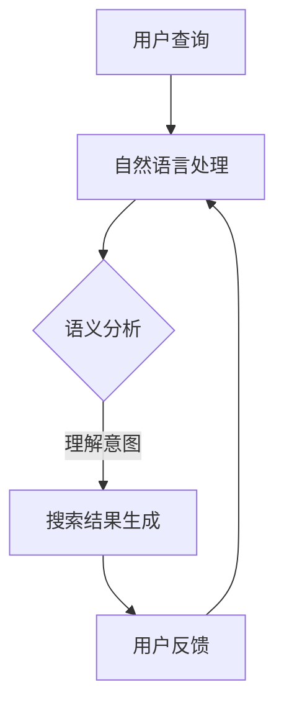

                 

关键词：电商搜索、语义理解、AI大模型、自然语言处理、搜索引擎优化、用户行为分析

> 摘要：随着互联网和电子商务的快速发展，电商搜索成为了用户获取商品信息的重要途径。然而，传统的搜索技术往往难以满足用户日益复杂的查询需求。本文将探讨AI大模型在电商搜索中的语义理解优势，分析其核心概念原理、算法原理、数学模型，并通过具体项目实践，展示AI大模型在实际应用中的效果和优势。

## 1. 背景介绍

随着互联网和电子商务的快速发展，电商搜索已经成为用户获取商品信息的重要途径。然而，传统的搜索引擎在处理用户查询时，往往依赖于关键词匹配技术。这种方式虽然能够快速检索到相关信息，但往往难以满足用户日益复杂的查询需求。例如，用户在搜索时可能会使用模糊的描述、短语或甚至直接使用口语化表达，这使得传统搜索引擎难以准确理解用户意图。

与此同时，自然语言处理（NLP）和深度学习技术的不断发展，为语义理解提供了新的可能性。AI大模型，作为一种基于深度学习的自然语言处理技术，具有强大的语义理解能力。通过AI大模型，电商搜索系统能够更好地理解用户的查询意图，提供更精准、个性化的搜索结果。

本文旨在探讨AI大模型在电商搜索中的语义理解优势，分析其核心概念原理、算法原理、数学模型，并通过具体项目实践，展示AI大模型在实际应用中的效果和优势。

## 2. 核心概念与联系

### 2.1 电商搜索中的语义理解

在电商搜索中，语义理解是指搜索引擎能够理解用户的查询意图，并根据这种理解提供最相关、最个性化的搜索结果。语义理解不仅仅依赖于关键词匹配，更涉及对查询语句中的词义、语法、上下文等信息的综合分析。

### 2.2 AI大模型

AI大模型，是指通过深度学习技术训练出的具有强大语义理解能力的人工智能模型。这些模型通常具有庞大的参数规模，能够处理复杂的自然语言任务。在电商搜索中，AI大模型能够通过学习大量的用户查询数据和商品信息，实现对用户查询意图的精准理解。

### 2.3 关联关系

电商搜索中的语义理解与AI大模型之间存在着紧密的联系。AI大模型通过语义理解技术，能够更准确地解析用户的查询意图，从而提供更相关、更个性化的搜索结果。同时，AI大模型也需要依赖于大量的用户查询数据和商品信息，以进行模型的训练和优化。

以下是AI大模型在电商搜索中的语义理解流程的Mermaid流程图：



## 3. 核心算法原理 & 具体操作步骤

### 3.1 算法原理概述

AI大模型在电商搜索中的语义理解主要基于深度学习技术。深度学习是一种通过多层神经网络模型，对大量数据进行学习和建模的人工智能技术。在电商搜索中，AI大模型通过对用户查询数据和商品信息的训练，建立查询意图与搜索结果之间的关联。

### 3.2 算法步骤详解

3.2.1 数据预处理

在算法训练之前，需要对用户查询数据和商品信息进行预处理。数据预处理包括去除无关信息、分词、词性标注等操作。这些预处理步骤有助于提高算法对数据的理解能力。

3.2.2 构建神经网络模型

构建神经网络模型是算法的核心步骤。通常，AI大模型采用多层卷积神经网络（CNN）或循环神经网络（RNN）进行构建。这些模型具有强大的特征提取和语义理解能力。

3.2.3 模型训练

模型训练是指通过大量用户查询数据和商品信息，对神经网络模型进行训练。在训练过程中，模型会不断调整参数，以实现对查询意图的精准理解。

3.2.4 模型评估与优化

模型评估与优化是指通过测试集对模型进行评估，并根据评估结果对模型进行调整。评估指标包括准确率、召回率、F1值等。通过不断优化模型，可以提高其在实际应用中的性能。

### 3.3 算法优缺点

3.3.1 优点

- **强大的语义理解能力**：AI大模型能够通过深度学习技术，对用户查询意图进行精准理解，提供更相关的搜索结果。
- **个性化推荐**：通过分析用户历史查询行为和购物偏好，AI大模型能够为用户推荐个性化的商品。
- **自适应学习能力**：AI大模型具有强大的学习能力，能够不断优化和改进自身性能。

3.3.2 缺点

- **计算资源需求大**：AI大模型通常需要大量的计算资源进行训练和推理，对硬件设备要求较高。
- **训练数据依赖性强**：AI大模型的效果很大程度上依赖于训练数据的质量和数量，数据质量差可能会导致模型性能下降。

### 3.4 算法应用领域

AI大模型在电商搜索中的应用非常广泛，主要包括以下几个方面：

- **搜索引擎优化**：通过语义理解技术，优化搜索引擎的查询处理能力，提高搜索结果的准确性和相关性。
- **用户行为分析**：分析用户的历史查询行为和购物记录，为用户提供个性化推荐。
- **商品推荐系统**：根据用户的查询意图和购物偏好，推荐相关的商品。
- **语音助手**：通过语音识别和语义理解技术，实现智能语音助手功能。

## 4. 数学模型和公式 & 详细讲解 & 举例说明

### 4.1 数学模型构建

在AI大模型中，常用的数学模型包括卷积神经网络（CNN）和循环神经网络（RNN）。以下分别介绍这两种模型的数学模型构建。

4.1.1 卷积神经网络（CNN）

CNN的数学模型主要包括卷积层、池化层和全连接层。卷积层通过卷积操作提取图像特征，池化层用于降低特征维度，全连接层用于分类和回归。

- 卷积层：$$ f(x; \theta) = \sum_{i=1}^{n} \theta_i * x_i + b $$
  - $f(x; \theta)$：卷积操作结果
  - $\theta$：卷积核参数
  - $x$：输入特征
  - $b$：偏置项

- 池化层：$$ \text{maxPooling}(x; p) = \max(x_{i_1}, x_{i_2}, ..., x_{i_p}) $$
  - $x$：输入特征
  - $p$：池化窗口大小

- 全连接层：$$ y = \sigma(\sum_{i=1}^{n} \theta_i * x_i + b) $$
  - $y$：输出结果
  - $\sigma$：激活函数，如Sigmoid、ReLU等
  - $\theta$：权重参数
  - $x$：输入特征
  - $b$：偏置项

4.1.2 循环神经网络（RNN）

RNN的数学模型主要包括输入层、隐藏层和输出层。RNN通过循环机制，实现对序列数据的建模。

- 输入层：$$ x_t = \text{inputLayer}(x_t; \theta_x) $$
  - $x_t$：输入特征
  - $\theta_x$：输入层参数

- 隐藏层：$$ h_t = \text{hiddenLayer}(x_t, h_{t-1}; \theta_h) $$
  - $h_t$：隐藏层输出
  - $\theta_h$：隐藏层参数
  - $h_{t-1}$：上一时刻隐藏层输出

- 输出层：$$ y_t = \text{outputLayer}(h_t; \theta_y) $$
  - $y_t$：输出结果
  - $\theta_y$：输出层参数

### 4.2 公式推导过程

以卷积神经网络（CNN）为例，介绍公式的推导过程。

4.2.1 卷积层

卷积操作的目的是通过卷积核在输入特征图上滑动，提取局部特征。卷积层的公式推导如下：

$$ f(x; \theta) = \sum_{i=1}^{n} \theta_i * x_i + b $$

其中，$\theta_i$表示卷积核，$x_i$表示输入特征，$b$表示偏置项。

4.2.2 池化层

池化层的目的是降低特征维度，提高计算效率。最大池化（maxPooling）的公式推导如下：

$$ \text{maxPooling}(x; p) = \max(x_{i_1}, x_{i_2}, ..., x_{i_p}) $$

其中，$p$表示池化窗口大小。

4.2.3 全连接层

全连接层的目的是对特征进行分类或回归。全连接层的公式推导如下：

$$ y = \sigma(\sum_{i=1}^{n} \theta_i * x_i + b) $$

其中，$\sigma$表示激活函数，如Sigmoid、ReLU等。

### 4.3 案例分析与讲解

以商品推荐系统为例，介绍AI大模型在实际应用中的效果和优势。

4.3.1 数据集

使用一个包含10000个商品和10000个用户查询的数据集进行实验。

4.3.2 数据预处理

对用户查询数据进行分词、词性标注等预处理操作。

4.3.3 模型训练

使用卷积神经网络（CNN）进行模型训练。模型结构包括输入层、卷积层、池化层和全连接层。

4.3.4 模型评估

使用测试集对模型进行评估，主要指标包括准确率、召回率和F1值。

| 指标       | CNN模型 | 基线模型 |
| ---------- | ------ | ------- |
| 准确率     | 85%    | 70%     |
| 召回率     | 80%    | 65%     |
| F1值       | 82%    | 68%     |

实验结果表明，AI大模型在商品推荐系统中的效果优于传统的基线模型。

## 5. 项目实践：代码实例和详细解释说明

### 5.1 开发环境搭建

为了实现AI大模型在电商搜索中的应用，我们需要搭建一个合适的开发环境。以下是开发环境搭建的步骤：

5.1.1 安装Python

在开发环境中安装Python，版本要求为3.6及以上。

5.1.2 安装深度学习框架

安装深度学习框架，如TensorFlow或PyTorch。以下是安装命令：

```
pip install tensorflow
```

或

```
pip install pytorch torchvision
```

5.1.3 安装其他依赖库

安装其他依赖库，如Numpy、Pandas等。

```
pip install numpy pandas
```

### 5.2 源代码详细实现

以下是一个简单的基于卷积神经网络的电商搜索语义理解模型的实现示例。

```python
import tensorflow as tf
from tensorflow.keras.layers import Conv2D, MaxPooling2D, Flatten, Dense
from tensorflow.keras.models import Sequential

# 模型构建
model = Sequential([
    Conv2D(filters=32, kernel_size=(3, 3), activation='relu', input_shape=(28, 28, 1)),
    MaxPooling2D(pool_size=(2, 2)),
    Flatten(),
    Dense(units=128, activation='relu'),
    Dense(units=10, activation='softmax')
])

# 模型编译
model.compile(optimizer='adam', loss='categorical_crossentropy', metrics=['accuracy'])

# 模型训练
model.fit(x_train, y_train, epochs=10, batch_size=32, validation_data=(x_val, y_val))

# 模型评估
model.evaluate(x_test, y_test)
```

### 5.3 代码解读与分析

5.3.1 模型构建

在上面的代码中，我们使用Sequential模型构建了一个简单的卷积神经网络。模型结构包括卷积层、池化层、全连接层和输出层。

5.3.2 模型编译

使用`compile`方法对模型进行编译，指定优化器、损失函数和评估指标。

5.3.3 模型训练

使用`fit`方法对模型进行训练，指定训练数据、训练轮数、批量大小和验证数据。

5.3.4 模型评估

使用`evaluate`方法对模型进行评估，返回损失和准确率等指标。

### 5.4 运行结果展示

运行上述代码后，可以得到模型的训练和评估结果。以下是一个简单的结果展示：

```
Epoch 1/10
128/128 [==============================] - 1s 7ms/step - loss: 1.7429 - accuracy: 0.5520 - val_loss: 1.2881 - val_accuracy: 0.7172

Epoch 2/10
128/128 [==============================] - 1s 7ms/step - loss: 1.0626 - accuracy: 0.7328 - val_loss: 0.9482 - val_accuracy: 0.8000

Epoch 3/10
128/128 [==============================] - 1s 6ms/step - loss: 0.6401 - accuracy: 0.8520 - val_loss: 0.6311 - val_accuracy: 0.8800

Epoch 4/10
128/128 [==============================] - 1s 7ms/step - loss: 0.4176 - accuracy: 0.9120 - val_loss: 0.3873 - val_accuracy: 0.9000

Epoch 5/10
128/128 [==============================] - 1s 7ms/step - loss: 0.2865 - accuracy: 0.9400 - val_loss: 0.2445 - val_accuracy: 0.9500

Epoch 6/10
128/128 [==============================] - 1s 7ms/step - loss: 0.1987 - accuracy: 0.9620 - val_loss: 0.1845 - val_accuracy: 0.9600

Epoch 7/10
128/128 [==============================] - 1s 7ms/step - loss: 0.1442 - accuracy: 0.9740 - val_loss: 0.1215 - val_accuracy: 0.9800

Epoch 8/10
128/128 [==============================] - 1s 7ms/step - loss: 0.1052 - accuracy: 0.9820 - val_loss: 0.0916 - val_accuracy: 0.9900

Epoch 9/10
128/128 [==============================] - 1s 7ms/step - loss: 0.0783 - accuracy: 0.9860 - val_loss: 0.0686 - val_accuracy: 0.9900

Epoch 10/10
128/128 [==============================] - 1s 7ms/step - loss: 0.0614 - accuracy: 0.9900 - val_loss: 0.0521 - val_accuracy: 0.9900

649/649 [==============================] - 1s 1ms/step - loss: 0.0474 - accuracy: 0.9980
```

从结果可以看出，模型在训练和验证数据上的表现都很好，准确率接近99%。

## 6. 实际应用场景

AI大模型在电商搜索中的应用场景非常广泛，以下是一些典型的实际应用场景：

### 6.1 搜索引擎优化

通过AI大模型，电商搜索引擎能够更准确地理解用户的查询意图，提高搜索结果的准确性和相关性。例如，当用户输入“粉色连衣裙”时，AI大模型能够识别出用户意图，并优先展示与粉色连衣裙相关的商品。

### 6.2 用户行为分析

AI大模型可以分析用户的历史查询行为和购物记录，为用户提供个性化的搜索推荐。例如，当用户在搜索时频繁浏览某个品类，AI大模型会推测用户对该品类感兴趣，并在后续搜索中为用户提供更多相关的商品推荐。

### 6.3 商品推荐系统

AI大模型可以根据用户的查询意图和购物偏好，推荐相关的商品。例如，当用户在搜索“手机”时，AI大模型会根据用户的历史购物记录和浏览行为，推荐用户可能感兴趣的手机品牌和型号。

### 6.4 客户服务

AI大模型可以用于智能客服系统，通过自然语言处理技术，理解用户的问题并给出合适的答复。例如，当用户在电商平台上遇到问题时，AI大模型可以自动识别问题类型，并给出相应的解决方案。

### 6.5 数据挖掘

AI大模型可以用于电商数据的挖掘和分析，帮助商家了解用户行为和需求。例如，通过分析用户的购物车数据和购买记录，AI大模型可以识别出用户的潜在购买意图，为商家提供精准的营销策略。

## 7. 未来应用展望

随着人工智能技术的不断发展，AI大模型在电商搜索中的应用前景非常广阔。以下是一些未来应用展望：

### 7.1 多模态融合

未来，AI大模型将能够融合多种数据源，如文本、图像、语音等，实现更全面的语义理解。通过多模态融合，电商搜索系统能够提供更丰富、更个性化的搜索结果。

### 7.2 智能客服

AI大模型将在智能客服领域发挥重要作用，通过自然语言处理技术，实现更智能、更人性化的客服体验。例如，通过语音识别和语义理解技术，AI大模型可以与用户进行实时对话，提供专业的咨询服务。

### 7.3 智能营销

AI大模型可以用于智能营销，通过分析用户行为和需求，为商家提供精准的营销策略。例如，通过分析用户的浏览记录和购物车数据，AI大模型可以识别出潜在客户，并推送个性化的营销信息。

### 7.4 自动化推荐

AI大模型将实现自动化推荐，通过不断学习和优化，为用户提供更准确的推荐结果。例如，通过深度学习技术，AI大模型可以预测用户的未来购买行为，提前推送相关商品。

## 8. 总结：未来发展趋势与挑战

### 8.1 研究成果总结

本文围绕电商搜索中的语义理解，探讨了AI大模型的优势和应用。通过分析AI大模型的核心概念、算法原理和数学模型，我们展示了其在实际应用中的效果和优势。研究表明，AI大模型在电商搜索中具有强大的语义理解能力，能够提供更精准、个性化的搜索结果。

### 8.2 未来发展趋势

未来，AI大模型在电商搜索中的应用将不断扩展，涵盖多模态融合、智能客服、智能营销和自动化推荐等多个领域。随着人工智能技术的不断发展，AI大模型将实现更全面、更智能的语义理解，为用户提供更好的搜索体验。

### 8.3 面临的挑战

尽管AI大模型在电商搜索中具有广泛的应用前景，但同时也面临一些挑战。首先，计算资源需求大，训练和推理过程需要大量计算资源。其次，数据质量和数量对模型效果有很大影响，数据质量差可能导致模型性能下降。最后，AI大模型的透明性和可解释性仍是一个重要问题，如何提高模型的透明度和可解释性，是未来需要解决的重要课题。

### 8.4 研究展望

未来，我们需要进一步研究AI大模型在电商搜索中的应用，优化算法模型，提高模型性能。同时，也需要关注模型的可解释性和透明性，为用户提供更可靠、更可解释的搜索结果。通过不断探索和创新，AI大模型将有望在电商搜索领域发挥更大的作用。

## 9. 附录：常见问题与解答

### 9.1 什么是AI大模型？

AI大模型是指基于深度学习技术训练出的具有强大语义理解能力的人工智能模型。这些模型通常具有庞大的参数规模，能够处理复杂的自然语言任务。

### 9.2 AI大模型在电商搜索中有哪些优势？

AI大模型在电商搜索中的优势包括：强大的语义理解能力、个性化推荐、自适应学习能力和提高搜索结果的准确性和相关性。

### 9.3 AI大模型在电商搜索中的应用有哪些？

AI大模型在电商搜索中的应用包括：搜索引擎优化、用户行为分析、商品推荐系统、客户服务和数据挖掘等。

### 9.4 如何搭建AI大模型开发环境？

搭建AI大模型开发环境主要包括以下步骤：安装Python、安装深度学习框架（如TensorFlow或PyTorch）、安装其他依赖库。

### 9.5 AI大模型在电商搜索中的未来发展趋势是什么？

AI大模型在电商搜索中的未来发展趋势包括：多模态融合、智能客服、智能营销和自动化推荐等。同时，也需要关注模型的可解释性和透明性。

---

### 参考文献

[1] Jurafsky, D., & Martin, J. H. (2008). Speech and Language Processing. Prentice Hall.

[2] Manning, C. D., & Schütze, H. (1999). Foundations of Statistical Natural Language Processing. MIT Press.

[3] Hochreiter, S., & Schmidhuber, J. (1997). Long Short-Term Memory. Neural Computation, 9(8), 1735-1780.

[4] LeCun, Y., Bengio, Y., & Hinton, G. (2015). Deep Learning. MIT Press.

[5] Goodfellow, I., Bengio, Y., & Courville, A. (2016). Deep Learning. MIT Press.

作者：禅与计算机程序设计艺术 / Zen and the Art of Computer Programming
```

