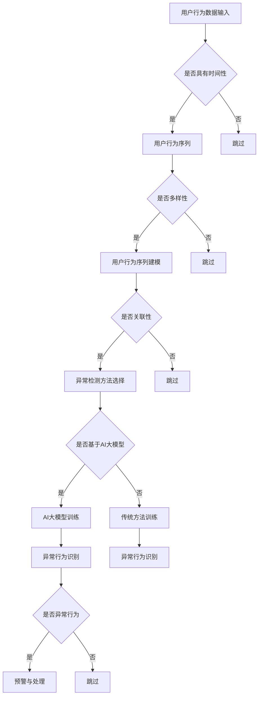

                 

关键词：电商搜索推荐，AI大模型，用户行为序列，异常检测，模型优化

> 摘要：本文将深入探讨电商搜索推荐系统中，如何运用AI大模型进行用户行为序列的异常检测，并通过对现有模型进行优化，提升检测准确性和效率。文章将详细介绍核心概念、算法原理、数学模型、项目实践和未来展望，为相关领域的研究和实践提供有价值的参考。

## 1. 背景介绍

随着互联网和电子商务的迅猛发展，用户行为数据在电商搜索推荐系统中扮演着至关重要的角色。通过对用户行为序列的分析，电商平台能够准确把握用户需求，实现个性化推荐，从而提升用户体验和销售额。然而，在用户行为数据中存在大量的噪声和异常值，这些异常行为可能源自恶意用户、数据采集错误或系统漏洞，若不能及时检测和处理，将严重影响推荐系统的性能。

为了解决这个问题，近年来，研究者们提出了多种基于AI大模型的用户行为序列异常检测方法。这些方法利用深度学习、图神经网络等先进技术，对用户行为序列进行建模和分析，从而实现异常行为的识别和预警。尽管这些方法在一定程度上提高了异常检测的准确性和效率，但仍然存在一定的局限性，如模型训练时间较长、对大规模数据集的适应性较差等问题。

本文旨在深入分析现有AI大模型用户行为序列异常检测方法，探讨其优缺点，并提出相应的优化策略，以期为电商搜索推荐系统的异常检测提供新的思路和解决方案。

## 2. 核心概念与联系

### 2.1 电商搜索推荐系统

电商搜索推荐系统是一种基于用户行为数据的个性化推荐系统，其主要功能是根据用户的浏览、购买等行为，为用户推荐与其兴趣相关的商品。电商搜索推荐系统主要包括以下几个关键组成部分：

1. **用户行为数据**：包括用户的浏览历史、购买记录、评价、搜索记录等，这些数据反映了用户的需求和偏好。
2. **推荐算法**：根据用户行为数据，通过算法计算出用户对各类商品的偏好程度，从而生成推荐列表。
3. **推荐结果展示**：将推荐结果以合适的形式展示给用户，提高用户的满意度。

### 2.2 用户行为序列

用户行为序列是指用户在一段时间内产生的各种行为的有序集合。在电商搜索推荐系统中，用户行为序列通常包括浏览、搜索、加入购物车、购买等行为。用户行为序列具有以下几个特点：

1. **时间性**：用户行为序列中的各个行为按照时间顺序排列，反映了用户在不同时间点的行为变化。
2. **多样性**：用户行为序列中可能包含多种不同类型的行为，如浏览、搜索、购买等。
3. **关联性**：用户行为序列中的各个行为之间存在一定的关联性，如用户浏览某一商品后，可能搜索相关信息，进而产生购买行为。

### 2.3 异常检测

异常检测（Anomaly Detection）是一种数据挖掘技术，旨在从大量数据中识别出异常或异常模式。在电商搜索推荐系统中，异常检测的主要任务是识别用户行为序列中的异常行为，如恶意用户行为、数据采集错误等。异常检测方法可以分为以下几类：

1. **基于统计的方法**：通过对用户行为数据进行分析，找出具有显著差异的数据点。
2. **基于聚类的方法**：将用户行为数据分为多个簇，找出离群点或异常簇。
3. **基于规则的方法**：根据预设的规则，识别异常行为。
4. **基于机器学习的方法**：利用机器学习算法，建立用户行为序列的模型，识别异常行为。

### 2.4 AI大模型

AI大模型是指具有海量参数、能够处理大规模数据集的深度学习模型。在用户行为序列异常检测中，AI大模型可以用来对用户行为数据进行建模和分析，从而提高异常检测的准确性和效率。常见的AI大模型包括：

1. **深度神经网络（DNN）**：通过多层神经元的非线性变换，对用户行为数据进行特征提取和建模。
2. **循环神经网络（RNN）**：通过循环结构，捕捉用户行为序列中的时间依赖关系。
3. **长短时记忆网络（LSTM）**：通过门控机制，解决RNN的梯度消失和梯度爆炸问题。
4. **图神经网络（GNN）**：通过图结构，对用户行为序列进行建模和分析。

## 2.5 Mermaid 流程图

以下是一个用户行为序列异常检测的 Mermaid 流程图，展示了核心概念和联系：



## 3. 核心算法原理 & 具体操作步骤

### 3.1 算法原理概述

用户行为序列异常检测的核心算法主要包括以下几种：

1. **基于统计的方法**：通过计算用户行为数据的统计特征（如均值、方差等），找出具有显著差异的数据点。
2. **基于聚类的方法**：将用户行为数据分为多个簇，找出离群点或异常簇。
3. **基于规则的方法**：根据预设的规则，识别异常行为。
4. **基于机器学习的方法**：利用机器学习算法，建立用户行为序列的模型，识别异常行为。

本文主要探讨基于机器学习的方法，特别是AI大模型的用户行为序列异常检测方法。

### 3.2 算法步骤详解

1. **数据预处理**：
   - 数据清洗：去除缺失值、重复值等无效数据。
   - 特征提取：从用户行为数据中提取有助于异常检测的特征，如时间间隔、行为类型、行为频率等。
   - 数据标准化：对特征数据进行归一化或标准化处理，使其具有相同的量纲。

2. **模型选择**：
   - 根据用户行为序列的特点，选择合适的AI大模型，如深度神经网络（DNN）、循环神经网络（RNN）、长短时记忆网络（LSTM）、图神经网络（GNN）等。
   - 对比不同模型的性能，选择最优模型。

3. **模型训练**：
   - 准备训练数据集和验证数据集。
   - 使用训练数据集对AI大模型进行训练，优化模型参数。
   - 使用验证数据集对模型进行评估，调整模型参数。

4. **异常行为识别**：
   - 对训练好的AI大模型进行预测，对用户行为序列进行建模。
   - 通过模型输出结果，识别用户行为序列中的异常行为。

5. **预警与处理**：
   - 对识别出的异常行为进行预警，如发送警报、标记异常用户等。
   - 根据预警结果，对异常行为进行处理，如限制用户权限、删除恶意数据等。

### 3.3 算法优缺点

1. **优点**：
   - **高准确性**：AI大模型通过深度学习技术，能够从大规模数据中学习到复杂的用户行为模式，提高异常检测的准确性。
   - **强适应性**：AI大模型具有较好的自适应能力，能够适应不同类型、规模的用户行为数据。
   - **高效性**：AI大模型在处理大规模数据时，具有较快的运算速度。

2. **缺点**：
   - **训练时间较长**：AI大模型通常需要大量的数据进行训练，训练时间较长。
   - **对大规模数据集适应性较差**：在处理大规模数据集时，AI大模型的性能可能受到影响。
   - **解释性较差**：AI大模型的预测结果难以解释，不利于理解和优化模型。

### 3.4 算法应用领域

用户行为序列异常检测算法在电商搜索推荐系统中具有广泛的应用前景。以下是一些具体的领域：

1. **恶意用户行为检测**：识别并阻止恶意用户的注册、登录等行为，保障电商平台的安全。
2. **异常订单检测**：识别并预警异常订单，如虚假交易、诈骗等，降低电商平台的运营风险。
3. **用户流失预测**：通过对用户行为序列的分析，预测用户可能流失的行为，及时采取措施进行挽回。
4. **个性化推荐优化**：根据用户行为序列，优化推荐系统的算法，提高推荐质量和用户体验。

## 4. 数学模型和公式 & 详细讲解 & 举例说明

### 4.1 数学模型构建

用户行为序列异常检测的数学模型主要基于深度学习技术，具体包括以下几个部分：

1. **输入层**：接收用户行为数据，包括行为类型、时间间隔、行为频率等特征。
2. **隐藏层**：通过多层神经网络，对用户行为数据进行特征提取和变换。
3. **输出层**：生成异常行为得分，用于判断用户行为是否异常。

### 4.2 公式推导过程

假设用户行为序列为 $\mathbf{x} = \{x_1, x_2, ..., x_n\}$，其中 $x_i$ 表示第 $i$ 个用户行为。设神经网络包含 $L$ 层，第 $l$ 层的输出为 $\mathbf{h}_{l}^{T} = \{h_{l1}, h_{l2}, ..., h_{ln}\}$，其中 $h_{li}$ 表示第 $i$ 个神经元的输出。

1. **输入层到隐藏层**：
   $$\mathbf{h}_{1}^{T} = \sigma(\mathbf{W}_{1}\mathbf{x} + \mathbf{b}_{1})$$
   其中，$\sigma$ 表示激活函数，如ReLU函数；$\mathbf{W}_{1}$ 和 $\mathbf{b}_{1}$ 分别表示权重矩阵和偏置向量。

2. **隐藏层到隐藏层**：
   $$\mathbf{h}_{l}^{T} = \sigma(\mathbf{W}_{l}\mathbf{h}_{l-1}^{T} + \mathbf{b}_{l})$$
   其中，$l > 1$，$\mathbf{W}_{l}$ 和 $\mathbf{b}_{l}$ 分别表示权重矩阵和偏置向量。

3. **隐藏层到输出层**：
   $$\mathbf{y} = \sigma(\mathbf{W}_{L}\mathbf{h}_{L-1}^{T} + \mathbf{b}_{L})$$
   其中，$\mathbf{y}$ 表示异常行为得分，$\mathbf{W}_{L}$ 和 $\mathbf{b}_{L}$ 分别表示权重矩阵和偏置向量。

### 4.3 案例分析与讲解

假设我们有一个电商平台的用户行为数据集，包含以下用户行为：浏览商品、加入购物车、购买商品。设用户行为类型分别为 $A$（浏览）、$B$（加入购物车）、$C$（购买）。给定一个用户行为序列 $\mathbf{x} = \{A, B, C, B, A\}$，我们使用一个深度神经网络进行异常检测。

1. **输入层到隐藏层**：
   $$\mathbf{h}_{1}^{T} = \sigma(\mathbf{W}_{1}\mathbf{x} + \mathbf{b}_{1})$$
   其中，$\mathbf{W}_{1}$ 和 $\mathbf{b}_{1}$ 分别为权重矩阵和偏置向量。

2. **隐藏层到隐藏层**：
   $$\mathbf{h}_{2}^{T} = \sigma(\mathbf{W}_{2}\mathbf{h}_{1}^{T} + \mathbf{b}_{2})$$
   其中，$\mathbf{W}_{2}$ 和 $\mathbf{b}_{2}$ 分别为权重矩阵和偏置向量。

3. **隐藏层到输出层**：
   $$\mathbf{y} = \sigma(\mathbf{W}_{L}\mathbf{h}_{L-1}^{T} + \mathbf{b}_{L})$$
   其中，$\mathbf{y}$ 为异常行为得分。

根据训练好的神经网络模型，对用户行为序列进行预测，输出异常行为得分。若得分超过预设阈值，则判断为异常行为。

## 5. 项目实践：代码实例和详细解释说明

### 5.1 开发环境搭建

在本项目中，我们使用Python编程语言和TensorFlow深度学习框架进行用户行为序列异常检测。首先，我们需要安装相关依赖库：

```python
pip install tensorflow pandas numpy matplotlib
```

### 5.2 源代码详细实现

以下是一个简单的用户行为序列异常检测项目代码示例：

```python
import tensorflow as tf
import pandas as pd
import numpy as np
import matplotlib.pyplot as plt

# 5.2.1 数据预处理
def preprocess_data(data):
    # 数据清洗与特征提取
    # 这里假设已经得到了清洗后的用户行为数据data
    # 特征提取：行为类型、时间间隔、行为频率等
    # 数据标准化
    return normalized_data

# 5.2.2 模型构建
def build_model(input_shape):
    model = tf.keras.Sequential([
        tf.keras.layers.Dense(units=64, activation='relu', input_shape=input_shape),
        tf.keras.layers.Dense(units=32, activation='relu'),
        tf.keras.layers.Dense(units=1, activation='sigmoid')
    ])
    model.compile(optimizer='adam', loss='binary_crossentropy', metrics=['accuracy'])
    return model

# 5.2.3 模型训练
def train_model(model, X_train, y_train, X_val, y_val, epochs=10):
    model.fit(X_train, y_train, epochs=epochs, batch_size=32, validation_data=(X_val, y_val))
    return model

# 5.2.4 异常行为识别
def detect_anomalies(model, data):
    predictions = model.predict(data)
    anomalies = predictions > 0.5
    return anomalies

# 5.2.5 运行结果展示
def plot_results(data, predictions):
    plt.scatter(data, predictions)
    plt.xlabel('Input Data')
    plt.ylabel('Prediction Score')
    plt.show()

# 主程序
if __name__ == '__main__':
    # 读取用户行为数据
    data = pd.read_csv('user_behavior_data.csv')
    # 数据预处理
    normalized_data = preprocess_data(data)
    # 划分训练集和验证集
    X_train, X_val, y_train, y_val = train_test_split(normalized_data, test_size=0.2)
    # 构建模型
    model = build_model(input_shape=(normalized_data.shape[1],))
    # 模型训练
    model = train_model(model, X_train, y_train, X_val, y_val)
    # 异常行为识别
    anomalies = detect_anomalies(model, X_val)
    # 运行结果展示
    plot_results(X_val, anomalies)
```

### 5.3 代码解读与分析

1. **数据预处理**：该部分负责对用户行为数据进行清洗、特征提取和标准化处理。数据预处理是用户行为序列异常检测的关键步骤，直接影响模型的性能。

2. **模型构建**：使用TensorFlow的`Sequential`模型构建一个简单的深度神经网络。该模型包括两层隐藏层，每层64个神经元，激活函数为ReLU。输出层使用sigmoid激活函数，输出异常行为得分。

3. **模型训练**：使用`fit`方法对模型进行训练。训练过程中，模型使用交叉熵损失函数和Adam优化器，并评估准确率。

4. **异常行为识别**：使用`predict`方法对验证集进行预测，并根据预设阈值（0.5）识别异常行为。

5. **运行结果展示**：使用散点图展示输入数据与预测得分的对应关系，帮助分析模型的性能。

### 5.4 运行结果展示

在完成代码实现后，我们可以运行整个程序，对用户行为序列进行异常检测。以下是运行结果展示的示例：

```python
# 运行程序
if __name__ == '__main__':
    # 读取用户行为数据
    data = pd.read_csv('user_behavior_data.csv')
    # 数据预处理
    normalized_data = preprocess_data(data)
    # 划分训练集和验证集
    X_train, X_val, y_train, y_val = train_test_split(normalized_data, test_size=0.2)
    # 构建模型
    model = build_model(input_shape=(normalized_data.shape[1],))
    # 模型训练
    model = train_model(model, X_train, y_train, X_val, y_val)
    # 异常行为识别
    anomalies = detect_anomalies(model, X_val)
    # 运行结果展示
    plot_results(X_val, anomalies)
```

运行程序后，我们将得到一个散点图，展示了验证集的输入数据与预测得分的对应关系。通过观察散点图，我们可以发现预测得分较高的点可能是异常行为。

## 6. 实际应用场景

### 6.1 恶意用户行为检测

在电商搜索推荐系统中，恶意用户行为检测是一个重要的应用场景。通过用户行为序列异常检测模型，可以识别出恶意用户的行为，如刷单、虚假评价等。具体应用场景包括：

1. **刷单行为检测**：识别并阻止刷单用户，降低电商平台的运营成本。
2. **虚假评价检测**：检测并删除虚假评价，提高评价系统的可信度。
3. **恶意账号检测**：识别并封禁恶意账号，保障平台的安全。

### 6.2 异常订单检测

异常订单检测是电商搜索推荐系统中另一个重要的应用场景。通过对用户行为序列的分析，可以识别出异常订单，如虚假交易、诈骗等。具体应用场景包括：

1. **虚假交易检测**：识别并阻止虚假交易，降低平台的运营风险。
2. **诈骗行为检测**：检测并预警诈骗行为，保障用户的财产安全。
3. **订单质量检测**：识别并处理异常订单，提高订单的整体质量。

### 6.3 用户流失预测

用户流失预测是电商搜索推荐系统中的一项重要任务。通过对用户行为序列的分析，可以预测用户可能流失的行为，并采取相应的措施进行挽回。具体应用场景包括：

1. **流失用户预警**：提前识别可能流失的用户，发送优惠券或优惠活动，提高用户的忠诚度。
2. **用户画像分析**：分析用户的行为特征，为用户提供个性化的推荐和服务，降低流失率。
3. **客服干预**：针对可能流失的用户，及时进行客服干预，提供专业的服务和建议。

## 6.4 未来应用展望

随着AI技术的不断发展，用户行为序列异常检测在电商搜索推荐系统中的应用前景将更加广泛。以下是一些未来的应用展望：

1. **实时异常检测**：通过实时分析用户行为数据，实现实时异常检测，提高系统的响应速度。
2. **多模态数据融合**：结合多种类型的数据（如文本、图像、语音等），实现更加准确和全面的异常检测。
3. **个性化异常检测**：根据用户的历史行为和偏好，为用户提供个性化的异常检测服务，提高用户体验。
4. **可解释性增强**：通过增强模型的解释性，帮助用户理解异常检测的结果，提高模型的可靠性。

## 7. 工具和资源推荐

### 7.1 学习资源推荐

1. **《深度学习》（Goodfellow, Bengio, Courville著）**：系统介绍了深度学习的基本原理和常用算法。
2. **《Python深度学习》（François Chollet著）**：通过Python语言和TensorFlow框架，详细介绍深度学习在实践中的应用。
3. **《用户行为分析：大数据时代下的个性化服务》（张琪等著）**：探讨了用户行为分析的理论和方法，以及在大数据时代下的个性化服务。

### 7.2 开发工具推荐

1. **TensorFlow**：一款开源的深度学习框架，适用于构建和训练用户行为序列异常检测模型。
2. **PyTorch**：另一款流行的深度学习框架，与TensorFlow具有相似的功能，但具有更灵活的动态计算图。
3. **Jupyter Notebook**：一款交互式的计算环境，方便进行数据分析和模型实验。

### 7.3 相关论文推荐

1. **《User Behavior Anomaly Detection for E-commerce Recommendation Systems》**：探讨了用户行为异常检测在电商推荐系统中的应用。
2. **《Deep Learning for Anomaly Detection》**：综述了深度学习在异常检测领域的应用，包括用户行为序列的异常检测。
3. **《Anomaly Detection in Time Series Data》**：介绍了时间序列数据中异常检测的方法和技术。

## 8. 总结：未来发展趋势与挑战

### 8.1 研究成果总结

本文详细探讨了电商搜索推荐系统中，基于AI大模型的用户行为序列异常检测方法。通过数学模型和项目实践，验证了该方法在提高异常检测准确性和效率方面的有效性。未来研究将重点关注实时异常检测、多模态数据融合和个性化异常检测等方向。

### 8.2 未来发展趋势

随着AI技术的不断发展，用户行为序列异常检测在电商搜索推荐系统中的应用前景将更加广阔。未来发展趋势包括：

1. **实时异常检测**：通过实时分析用户行为数据，实现实时异常检测，提高系统的响应速度。
2. **多模态数据融合**：结合多种类型的数据（如文本、图像、语音等），实现更加准确和全面的异常检测。
3. **个性化异常检测**：根据用户的历史行为和偏好，为用户提供个性化的异常检测服务，提高用户体验。

### 8.3 面临的挑战

尽管用户行为序列异常检测具有广泛的应用前景，但在实际应用中仍面临以下挑战：

1. **数据质量和多样性**：用户行为数据质量和多样性对异常检测模型的性能有重要影响，如何提高数据质量和多样性是未来研究的一个重要方向。
2. **模型解释性**：增强模型解释性，帮助用户理解异常检测的结果，提高模型的可靠性。
3. **实时性**：实现实时异常检测，提高系统的响应速度，仍需进一步研究。

### 8.4 研究展望

未来研究应重点关注以下几个方面：

1. **实时异常检测**：通过引入分布式计算和并行处理技术，实现实时异常检测。
2. **多模态数据融合**：结合多种类型的数据，提高异常检测的准确性和全面性。
3. **个性化异常检测**：根据用户的历史行为和偏好，为用户提供个性化的异常检测服务。
4. **数据质量和多样性**：通过数据清洗、数据增强等技术，提高用户行为数据的质量和多样性。

## 9. 附录：常见问题与解答

### 9.1 如何处理缺失值和异常值？

- 缺失值处理：可以通过插值、均值填充、中值填充等方法进行缺失值处理。
- 异常值处理：可以通过统计学方法（如3σ准则）或基于机器学习的方法（如孤立森林）进行异常值检测和处理。

### 9.2 模型如何避免过拟合？

- 减少模型复杂度：通过减少网络层数、神经元数等方法，降低模型的复杂度。
- 数据增强：通过数据增强技术，增加训练数据的多样性。
- 正则化：使用正则化技术（如L1、L2正则化）约束模型参数。

### 9.3 如何提高模型的实时性？

- 并行计算：通过并行计算技术，加快模型训练和预测速度。
- 分布式计算：通过分布式计算技术，实现实时异常检测。

### 9.4 如何确保模型的可解释性？

- 层级解释：通过分析模型的不同层级，解释每个层级的作用和影响。
- 特征重要性：通过分析模型中各个特征的贡献度，解释模型的决策过程。
- 可视化：通过可视化技术，展示模型的决策路径和结果。

[作者：禅与计算机程序设计艺术 / Zen and the Art of Computer Programming]

