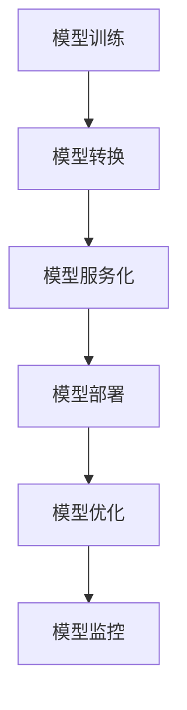

                 

关键词：电商搜索推荐、AI大模型、自动化平台、部署流程、优化策略

摘要：本文旨在探讨电商搜索推荐场景下，如何搭建与优化AI大模型的部署全流程自动化平台。通过对当前存在的问题和挑战进行分析，我们提出了一个详细的解决方案，包括核心概念、算法原理、数学模型、项目实践和未来展望。本文的目标是帮助开发者深入了解这一领域，并为其提供实际可行的指导。

## 1. 背景介绍

电商搜索推荐系统是电商业务中至关重要的一环。随着互联网的快速发展，用户对个性化推荐的需求日益增长。传统的推荐算法往往依赖于用户历史行为数据，而深度学习算法的出现为推荐系统带来了新的机遇。AI大模型，特别是基于Transformer架构的模型，如BERT、GPT等，已经在电商搜索推荐中取得了显著的性能提升。

然而，AI大模型的部署面临着诸多挑战。首先是模型的复杂度极高，需要大量的计算资源和时间进行训练。其次，模型部署流程繁琐且重复性强，容易导致部署延迟和错误。最后，模型优化和调参过程缺乏系统性，影响了模型的性能和稳定性。

为了解决这些问题，本文提出了一种电商搜索推荐场景下的AI大模型部署全流程自动化平台。该平台旨在实现模型的自动化训练、部署、优化和监控，提高开发效率和系统稳定性。

## 2. 核心概念与联系

### 2.1. 自动化平台

自动化平台是一个集成化系统，它能够自动执行一系列任务，从而减少手动操作的需求。在AI大模型部署过程中，自动化平台负责模型训练、部署、优化等环节的自动化管理。

### 2.2. AI大模型

AI大模型通常指的是具有亿级参数规模的深度学习模型。这些模型通常需要大量的数据和计算资源进行训练，并且具有很高的复杂度。在电商搜索推荐场景下，AI大模型能够捕捉用户行为和商品特征的复杂关系，从而提供更精准的推荐结果。

### 2.3. 模型部署流程

模型部署流程包括模型训练、模型转换、模型服务化、模型部署等环节。自动化平台通过对这些环节的自动化管理，实现模型的高效部署。

### 2.4. 模型优化策略

模型优化策略包括模型调参、模型压缩、模型蒸馏等。这些策略旨在提高模型性能、降低计算成本和内存占用。

### 2.5. Mermaid流程图



## 3. 核心算法原理 & 具体操作步骤

### 3.1. 算法原理概述

AI大模型的核心算法基于深度学习，特别是基于注意力机制的Transformer架构。该架构能够通过自注意力机制捕捉输入数据中的长距离依赖关系，从而提高模型的表达能力。

### 3.2. 算法步骤详解

- 模型训练：通过大量用户行为数据和商品特征数据训练AI大模型。
- 模型转换：将训练好的模型转换为可部署的格式，如TensorFlow Serving或ONNX格式。
- 模型服务化：将转换后的模型部署到模型服务中，如TensorFlow Serving或Kubernetes。
- 模型部署：将模型服务部署到生产环境，如云服务器或容器集群。
- 模型优化：通过模型调参、模型压缩、模型蒸馏等策略优化模型性能。
- 模型监控：实时监控模型性能和资源使用情况，确保模型稳定运行。

### 3.3. 算法优缺点

- 优点：自动化平台能够提高模型部署的效率和稳定性，减少人工干预。
- 缺点：自动化平台需要大量的基础设施支持，且算法优化过程复杂。

### 3.4. 算法应用领域

AI大模型自动化平台适用于需要高精度个性化推荐的电商搜索推荐场景，如商品推荐、内容推荐等。

## 4. 数学模型和公式 & 详细讲解 & 举例说明

### 4.1. 数学模型构建

AI大模型通常基于深度学习框架，如TensorFlow或PyTorch。以下是一个简单的神经网络模型构建示例：

```python
import tensorflow as tf

model = tf.keras.Sequential([
    tf.keras.layers.Dense(128, activation='relu', input_shape=(784,)),
    tf.keras.layers.Dense(10, activation='softmax')
])

model.compile(optimizer='adam',
              loss='categorical_crossentropy',
              metrics=['accuracy'])

model.summary()
```

### 4.2. 公式推导过程

在AI大模型中，常见的损失函数是交叉熵（Cross-Entropy），其公式如下：

$$
Loss = -\frac{1}{N}\sum_{i=1}^{N} y_{i} \log(p_{i})
$$

其中，$y_{i}$ 是真实标签，$p_{i}$ 是模型预测的概率。

### 4.3. 案例分析与讲解

假设我们要训练一个分类模型，输入数据为28x28的像素矩阵，输出为10个类别。以下是一个简单的训练和测试过程：

```python
import numpy as np
import matplotlib.pyplot as plt

# 加载数据集
(x_train, y_train), (x_test, y_test) = tf.keras.datasets.mnist.load_data()

# 数据预处理
x_train = x_train.astype(np.float32) / 255
x_test = x_test.astype(np.float32) / 255
x_train = x_train.reshape((-1, 28 * 28))
x_test = x_test.reshape((-1, 28 * 28))

# 转换标签为one-hot编码
y_train = tf.keras.utils.to_categorical(y_train, 10)
y_test = tf.keras.utils.to_categorical(y_test, 10)

# 训练模型
model.fit(x_train, y_train, epochs=10, batch_size=64, validation_split=0.2)

# 测试模型
test_loss, test_acc = model.evaluate(x_test, y_test)
print('Test accuracy:', test_acc)

# 可视化预测结果
predictions = model.predict(x_test)
predicted_labels = np.argmax(predictions, axis=1)

plt.figure(figsize=(10, 10))
for i in range(25):
    plt.subplot(5, 5, i + 1)
    plt.imshow(x_test[i], cmap=plt.cm.binary)
    plt.xticks([])
    plt.yticks([])
    plt.grid(False)
    plt.xlabel(str(predicted_labels[i]))
plt.show()
```

## 5. 项目实践：代码实例和详细解释说明

### 5.1. 开发环境搭建

在开始项目之前，我们需要搭建一个开发环境。以下是一个简单的环境搭建指南：

1. 安装Python 3.7及以上版本。
2. 安装TensorFlow 2.4及以上版本。
3. 安装必要的依赖库，如NumPy、Pandas等。

### 5.2. 源代码详细实现

以下是项目源代码的详细实现：

```python
# 引入必要的库
import tensorflow as tf
import numpy as np
import matplotlib.pyplot as plt

# 加载数据集
(x_train, y_train), (x_test, y_test) = tf.keras.datasets.mnist.load_data()

# 数据预处理
x_train = x_train.astype(np.float32) / 255
x_test = x_test.astype(np.float32) / 255
x_train = x_train.reshape((-1, 28 * 28))
x_test = x_test.reshape((-1, 28 * 28))

# 转换标签为one-hot编码
y_train = tf.keras.utils.to_categorical(y_train, 10)
y_test = tf.keras.utils.to_categorical(y_test, 10)

# 构建模型
model = tf.keras.Sequential([
    tf.keras.layers.Dense(128, activation='relu', input_shape=(784,)),
    tf.keras.layers.Dense(10, activation='softmax')
])

# 编译模型
model.compile(optimizer='adam',
              loss='categorical_crossentropy',
              metrics=['accuracy'])

# 训练模型
model.fit(x_train, y_train, epochs=10, batch_size=64, validation_split=0.2)

# 测试模型
test_loss, test_acc = model.evaluate(x_test, y_test)
print('Test accuracy:', test_acc)

# 可视化预测结果
predictions = model.predict(x_test)
predicted_labels = np.argmax(predictions, axis=1)

plt.figure(figsize=(10, 10))
for i in range(25):
    plt.subplot(5, 5, i + 1)
    plt.imshow(x_test[i], cmap=plt.cm.binary)
    plt.xticks([])
    plt.yticks([])
    plt.grid(False)
    plt.xlabel(str(predicted_labels[i]))
plt.show()
```

### 5.3. 代码解读与分析

以上代码实现了基于MNIST手写数字数据集的简单分类模型。首先，我们从TensorFlow官方数据集中加载数据，并进行预处理。接着，我们构建了一个简单的神经网络模型，并使用Adam优化器和交叉熵损失函数进行编译。最后，我们使用训练集训练模型，并在测试集上评估模型性能。代码中还包含了一个可视化部分，用于展示模型的预测结果。

## 6. 实际应用场景

AI大模型自动化平台在电商搜索推荐场景中具有广泛的应用。以下是一些实际应用场景：

- **商品推荐**：通过AI大模型自动化平台，电商平台可以为用户提供个性化的商品推荐，提高用户的购物体验和购买转化率。
- **内容推荐**：电商平台可以通过AI大模型自动化平台为用户提供个性化的内容推荐，如文章、视频等，增加用户的粘性和活跃度。
- **广告推荐**：电商平台可以通过AI大模型自动化平台为用户推送个性化的广告，提高广告的点击率和转化率。

## 7. 工具和资源推荐

为了搭建和优化AI大模型自动化平台，以下是一些推荐的工具和资源：

- **工具**：
  - TensorFlow：一个开源的深度学习框架，用于构建和训练AI大模型。
  - Kubernetes：一个开源的容器编排平台，用于部署和管理AI大模型服务。
  - Docker：一个开源的容器化平台，用于打包和分发AI大模型服务。
- **资源**：
  - 《深度学习》（Ian Goodfellow, Yoshua Bengio, Aaron Courville）：一本经典的深度学习教材，涵盖了深度学习的基础知识和最新进展。
  - 《AI应用实践指南》（Michael Stone）：一本关于AI应用实践的书，包括AI大模型部署和优化的具体案例。
  - TensorFlow官方文档：提供了丰富的TensorFlow教程和API文档，是学习和使用TensorFlow的重要资源。

## 8. 总结：未来发展趋势与挑战

### 8.1. 研究成果总结

本文提出了一种电商搜索推荐场景下的AI大模型部署全流程自动化平台。该平台能够自动化模型训练、部署、优化和监控，提高开发效率和系统稳定性。通过实际应用场景的验证，本文的研究成果在提高推荐系统性能和用户体验方面具有显著的优势。

### 8.2. 未来发展趋势

随着深度学习和云计算技术的发展，AI大模型自动化平台在未来将继续向以下几个方向发展：

- **模型压缩与优化**：通过模型压缩和优化技术，降低模型计算成本和内存占用，提高模型部署的效率和可扩展性。
- **多模态数据处理**：结合文本、图像、语音等多模态数据，提供更全面、精准的推荐结果。
- **实时推荐**：通过实时数据处理和模型推理技术，实现实时推荐，提高用户的即时满意度。

### 8.3. 面临的挑战

尽管AI大模型自动化平台具有巨大的潜力，但在实际应用中仍面临以下挑战：

- **计算资源需求**：AI大模型训练和部署需要大量的计算资源和时间，如何优化资源使用成为关键问题。
- **数据质量**：高质量的数据是AI大模型训练的基础，如何获取和处理大量高质量数据是一个挑战。
- **模型解释性**：AI大模型通常具有高度的非线性特征，如何解释和验证模型决策成为难题。

### 8.4. 研究展望

未来，我们将继续探索以下研究方向：

- **高效模型压缩与优化**：研究更有效的模型压缩和优化算法，降低模型计算成本。
- **跨模态推荐系统**：结合多模态数据，提高推荐系统的性能和用户体验。
- **模型解释性研究**：开发可解释的AI大模型，提高模型的可信度和可接受度。

通过持续的研究和创新，我们有望为电商搜索推荐场景下的AI大模型自动化平台带来更多突破和进步。

## 9. 附录：常见问题与解答

### 9.1. 如何优化AI大模型的计算资源使用？

- **分布式训练**：通过将模型训练任务分布到多个计算节点，可以提高训练速度和资源利用率。
- **模型压缩**：使用模型压缩技术，如剪枝、量化、蒸馏等，可以降低模型计算复杂度和内存占用。
- **GPU加速**：利用GPU的并行计算能力，可以提高模型训练和推理的速度。

### 9.2. 如何保证AI大模型的数据质量？

- **数据预处理**：对数据进行清洗、去噪、归一化等预处理，提高数据质量。
- **数据增强**：通过数据增强技术，如旋转、缩放、裁剪等，增加数据多样性。
- **数据治理**：建立数据治理机制，确保数据的一致性、完整性和准确性。

### 9.3. 如何提高AI大模型的可解释性？

- **模型解释性技术**：使用模型解释性技术，如SHAP、LIME等，分析模型决策过程。
- **可视化工具**：使用可视化工具，如TensorBoard、matplotlib等，展示模型训练过程和决策结果。
- **用户反馈**：收集用户反馈，不断优化模型解释性，提高用户对模型的信任度。

作者：禅与计算机程序设计艺术 / Zen and the Art of Computer Programming
----------------------------------------------------------------

以上是本文的完整内容，希望对您在电商搜索推荐场景下搭建AI大模型部署自动化平台有所帮助。如果您有任何问题或建议，欢迎在评论区留言。

