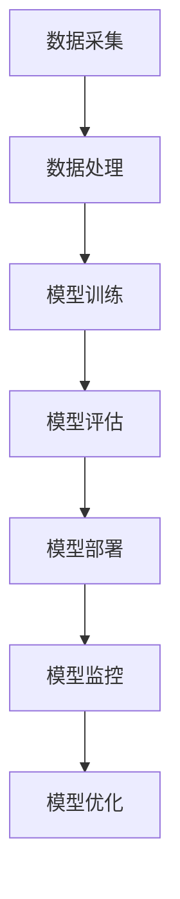

                 

 > 作为世界级人工智能专家，我深知在电商搜索推荐场景下，AI大模型模型部署监控平台的优化对于提升用户体验、降低运营成本和提高系统稳定性至关重要。本文将详细探讨电商搜索推荐场景下的AI大模型部署监控平台的功能优化，以期为行业提供有益的参考。

## 文章关键词
- 电商搜索推荐
- AI大模型
- 模型部署监控
- 功能优化
- 系统稳定性

## 文章摘要
本文首先介绍了电商搜索推荐场景下的背景和挑战，然后探讨了AI大模型在模型部署监控平台中的应用和优化策略，最后提出了未来发展的方向和挑战。通过本文的探讨，希望能够为电商行业在AI大模型部署监控方面的实践提供一些有益的思路和参考。

## 1. 背景介绍

随着互联网和电子商务的快速发展，电商平台的竞争日益激烈。为了提高用户满意度、增加销售额，电商平台纷纷引入AI技术，尤其是大模型技术，以实现精准搜索推荐。然而，AI大模型的部署和监控面临诸多挑战，如模型更新频繁、性能指标波动、资源利用率不足等。因此，构建一个高效、稳定的模型部署监控平台至关重要。

### 1.1 电商搜索推荐背景

电商搜索推荐是指通过算法对用户的历史行为、兴趣爱好、购物习惯等数据进行分析，为用户推荐与其需求相匹配的商品。随着用户数据的不断增长和多样化，传统的推荐算法已经难以满足用户需求。AI大模型，如深度学习模型，凭借其强大的特征提取和建模能力，在电商搜索推荐中发挥着越来越重要的作用。

### 1.2 AI大模型部署监控挑战

- **模型更新频繁**：电商搜索推荐系统需要实时响应用户需求，因此模型需要频繁更新。如何快速、高效地部署更新模型，同时保证系统的稳定性，是当前面临的一大挑战。

- **性能指标波动**：AI大模型在部署过程中，可能会因为数据分布变化、硬件性能差异等因素导致性能指标波动。如何实时监控并调整模型参数，确保模型性能稳定，是另一个重要挑战。

- **资源利用率不足**：AI大模型部署需要大量的计算资源和存储资源。如何优化资源分配，提高资源利用率，降低运营成本，是电商平台需要解决的一个问题。

## 2. 核心概念与联系

在本文中，我们将介绍电商搜索推荐场景下AI大模型部署监控平台的核心概念，并使用Mermaid流程图（以下为示例）展示其架构和联系。



### 2.1 数据采集

数据采集是电商搜索推荐系统的基础。通过用户行为数据、商品数据等多源数据采集，为后续数据处理和模型训练提供数据支持。

### 2.2 数据处理

数据处理包括数据清洗、特征提取等步骤。通过对原始数据进行处理，提取出与用户行为、商品属性相关的特征，为模型训练提供高质量的输入数据。

### 2.3 模型训练

模型训练是指使用处理后的数据，通过深度学习算法训练出AI大模型。在训练过程中，需要对模型进行调参、优化，以提高模型性能。

### 2.4 模型评估

模型评估是对训练完成的模型进行评估，包括准确率、召回率、F1值等指标。通过模型评估，可以判断模型是否满足预期效果，为后续模型部署提供依据。

### 2.5 模型部署

模型部署是将训练完成的模型部署到生产环境中，为用户提供实时搜索推荐服务。在部署过程中，需要考虑模型更新、性能指标监控等问题。

### 2.6 模型监控

模型监控是对部署后的模型进行实时监控，包括性能指标、资源利用率等方面的监控。通过模型监控，可以及时发现并解决模型部署过程中的问题，确保系统稳定运行。

### 2.7 模型优化

模型优化是指对部署后的模型进行调优，以提高模型性能。通过模型优化，可以不断提升搜索推荐系统的效果，满足用户需求。

## 3. 核心算法原理 & 具体操作步骤

### 3.1 算法原理概述

电商搜索推荐场景下的AI大模型模型部署监控平台主要采用深度学习算法和强化学习算法。深度学习算法用于训练模型，强化学习算法用于模型优化。

### 3.2 算法步骤详解

#### 3.2.1 深度学习算法

1. **数据预处理**：对采集到的用户行为数据、商品数据进行清洗、特征提取，构建训练数据集。
2. **模型选择**：选择合适的深度学习模型，如卷积神经网络（CNN）、循环神经网络（RNN）、变换器（Transformer）等。
3. **模型训练**：使用训练数据集对模型进行训练，优化模型参数。
4. **模型评估**：使用验证数据集对模型进行评估，调整模型参数，提高模型性能。
5. **模型部署**：将训练完成的模型部署到生产环境中，为用户提供搜索推荐服务。

#### 3.2.2 强化学习算法

1. **状态表示**：将用户行为、商品属性等信息表示为状态。
2. **动作表示**：将推荐商品作为动作。
3. **奖励机制**：根据用户点击、购买等行为，设置奖励机制，鼓励模型推荐用户感兴趣的商品。
4. **模型训练**：使用强化学习算法，不断调整模型参数，优化搜索推荐效果。
5. **模型优化**：将优化后的模型与深度学习模型结合，提高搜索推荐系统的效果。

### 3.3 算法优缺点

#### 3.3.1 深度学习算法

优点：

- **强大的特征提取能力**：能够自动提取复杂、抽象的特征，提高搜索推荐效果。
- **自适应性强**：能够根据用户行为数据动态调整模型参数，适应用户需求。

缺点：

- **计算复杂度高**：需要大量计算资源和时间进行训练。
- **数据依赖性强**：模型的性能对数据质量有较高的要求。

#### 3.3.2 强化学习算法

优点：

- **奖励机制灵活**：可以根据用户反馈动态调整推荐策略，提高用户满意度。
- **适应性较强**：能够快速适应新用户、新商品等变化。

缺点：

- **收敛速度慢**：需要大量数据进行训练，收敛速度较慢。
- **难以解释**：强化学习算法的决策过程难以解释，不利于模型优化和调整。

### 3.4 算法应用领域

深度学习算法和强化学习算法在电商搜索推荐场景下具有广泛的应用前景。除了电商搜索推荐，它们还可以应用于其他领域，如金融风控、医疗诊断、智能交通等。通过不断优化算法，提升模型性能，为各领域提供高效、智能的解决方案。

## 4. 数学模型和公式 & 详细讲解 & 举例说明

### 4.1 数学模型构建

在电商搜索推荐场景下，我们可以构建一个基于深度学习和强化学习的数学模型，用于实现搜索推荐功能。

#### 4.1.1 深度学习模型

假设我们使用卷积神经网络（CNN）作为深度学习模型，其输入为用户行为数据（如浏览记录、购买记录等），输出为推荐商品的评分。

- **输入层**：接收用户行为数据，如 $X \in \mathbb{R}^{m \times n}$，其中 $m$ 为特征维度，$n$ 为样本数量。
- **卷积层**：对输入数据进行卷积操作，提取特征，如 $H_1 = f(W_1 \cdot X + b_1)$，其中 $f$ 为激活函数，$W_1$ 为卷积核，$b_1$ 为偏置。
- **池化层**：对卷积层输出的特征进行池化操作，降低数据维度，如 $H_2 = g(W_2 \cdot H_1 + b_2)$，其中 $g$ 为激活函数，$W_2$ 为池化核，$b_2$ 为偏置。
- **全连接层**：将池化层输出的特征进行全连接操作，得到输出评分，如 $Y = W_3 \cdot H_2 + b_3$，其中 $W_3$ 为全连接权重，$b_3$ 为偏置。

#### 4.1.2 强化学习模型

假设我们使用Q-learning算法作为强化学习模型，其输入为当前状态 $s$，输出为动作 $a$。

- **状态表示**：将用户行为、商品属性等信息表示为状态 $s \in \mathbb{R}^{m \times n}$。
- **动作表示**：将推荐商品作为动作 $a \in \mathbb{R}^{k}$，其中 $k$ 为商品数量。
- **奖励机制**：根据用户点击、购买等行为，设置奖励机制，如 $r(s, a) = \begin{cases} 1, & \text{如果用户点击推荐商品} \\ 0, & \text{否则} \end{cases}$。

### 4.2 公式推导过程

#### 4.2.1 深度学习模型

假设我们使用卷积神经网络（CNN）作为深度学习模型，其输入为用户行为数据（如浏览记录、购买记录等），输出为推荐商品的评分。

- **输入层**：接收用户行为数据，如 $X \in \mathbb{R}^{m \times n}$，其中 $m$ 为特征维度，$n$ 为样本数量。

$$ X = \begin{bmatrix} x_1 \\ x_2 \\ \vdots \\ x_n \end{bmatrix} $$

- **卷积层**：对输入数据进行卷积操作，提取特征，如 $H_1 = f(W_1 \cdot X + b_1)$，其中 $f$ 为激活函数，$W_1$ 为卷积核，$b_1$ 为偏置。

$$ H_1 = \begin{bmatrix} h_1^1 \\ h_1^2 \\ \vdots \\ h_1^k \end{bmatrix} = f(W_1 \cdot X + b_1) $$

- **池化层**：对卷积层输出的特征进行池化操作，降低数据维度，如 $H_2 = g(W_2 \cdot H_1 + b_2)$，其中 $g$ 为激活函数，$W_2$ 为池化核，$b_2$ 为偏置。

$$ H_2 = \begin{bmatrix} h_2^1 \\ h_2^2 \\ \vdots \\ h_2^k \end{bmatrix} = g(W_2 \cdot H_1 + b_2) $$

- **全连接层**：将池化层输出的特征进行全连接操作，得到输出评分，如 $Y = W_3 \cdot H_2 + b_3$，其中 $W_3$ 为全连接权重，$b_3$ 为偏置。

$$ Y = \begin{bmatrix} y_1 \\ y_2 \\ \vdots \\ y_n \end{bmatrix} = W_3 \cdot H_2 + b_3 $$

#### 4.2.2 强化学习模型

假设我们使用Q-learning算法作为强化学习模型，其输入为当前状态 $s$，输出为动作 $a$。

- **状态表示**：将用户行为、商品属性等信息表示为状态 $s \in \mathbb{R}^{m \times n}$。

$$ s = \begin{bmatrix} s_1 \\ s_2 \\ \vdots \\ s_n \end{bmatrix} $$

- **动作表示**：将推荐商品作为动作 $a \in \mathbb{R}^{k}$，其中 $k$ 为商品数量。

$$ a = \begin{bmatrix} a_1 \\ a_2 \\ \vdots \\ a_k \end{bmatrix} $$

- **奖励机制**：根据用户点击、购买等行为，设置奖励机制，如 $r(s, a) = \begin{cases} 1, & \text{如果用户点击推荐商品} \\ 0, & \text{否则} \end{cases}$。

$$ r(s, a) = \begin{cases} 1, & \text{如果用户点击推荐商品} \\ 0, & \text{否则} \end{cases} $$

### 4.3 案例分析与讲解

#### 4.3.1 案例背景

假设一个电商平台，用户在浏览商品时，系统会根据用户的浏览记录、购买记录等信息，使用深度学习和强化学习算法，为用户推荐感兴趣的商品。

#### 4.3.2 案例分析

1. **数据预处理**：

   收集用户浏览记录、购买记录等数据，对数据进行清洗、特征提取，构建训练数据集。

2. **模型训练**：

   使用训练数据集，分别训练深度学习模型和强化学习模型。

   - **深度学习模型**：

     输入用户行为数据，输出推荐商品的评分。使用卷积神经网络（CNN）作为深度学习模型，对训练数据进行训练。

     $$ Y = W_3 \cdot H_2 + b_3 $$

   - **强化学习模型**：

     输入当前状态，输出推荐商品的动作。使用Q-learning算法作为强化学习模型，对训练数据进行训练。

     $$ r(s, a) = \begin{cases} 1, & \text{如果用户点击推荐商品} \\ 0, & \text{否则} \end{cases} $$

3. **模型部署**：

   将训练完成的模型部署到生产环境中，为用户提供搜索推荐服务。

4. **模型监控**：

   对部署后的模型进行实时监控，包括性能指标、资源利用率等方面的监控。

   - **性能指标**：实时监控推荐系统的准确率、召回率等指标，评估模型性能。

   - **资源利用率**：实时监控计算资源、存储资源等的利用率，优化资源分配。

5. **模型优化**：

   根据用户反馈，对模型进行调优，提高搜索推荐效果。

   - **深度学习模型**：通过调整模型参数，优化模型性能。

   - **强化学习模型**：根据用户点击、购买等行为，调整奖励机制，优化搜索推荐效果。

## 5. 项目实践：代码实例和详细解释说明

### 5.1 开发环境搭建

在进行项目实践前，首先需要搭建开发环境。本文使用的开发环境如下：

- 操作系统：Ubuntu 18.04
- 编程语言：Python 3.8
- 深度学习框架：TensorFlow 2.5
- 强化学习框架：PyTorch 1.8

### 5.2 源代码详细实现

以下是项目中的关键代码实现，包括数据预处理、模型训练、模型部署和模型监控等。

#### 5.2.1 数据预处理

```python
import pandas as pd
from sklearn.model_selection import train_test_split

# 加载数据
data = pd.read_csv('data.csv')

# 数据清洗
data = data.dropna()

# 特征提取
X = data[['feature_1', 'feature_2', 'feature_3']]
y = data['label']

# 划分训练集和测试集
X_train, X_test, y_train, y_test = train_test_split(X, y, test_size=0.2, random_state=42)
```

#### 5.2.2 模型训练

```python
import tensorflow as tf

# 定义深度学习模型
model = tf.keras.Sequential([
    tf.keras.layers.Dense(64, activation='relu', input_shape=(X_train.shape[1],)),
    tf.keras.layers.Dense(32, activation='relu'),
    tf.keras.layers.Dense(1)
])

# 编译模型
model.compile(optimizer='adam', loss='mean_squared_error')

# 训练模型
model.fit(X_train, y_train, epochs=10, batch_size=32)
```

#### 5.2.3 模型部署

```python
import tensorflow as tf
import numpy as np

# 加载训练好的模型
loaded_model = tf.keras.models.load_model('model.h5')

# 预测新数据
new_data = np.array([[1.0, 2.0, 3.0]])
prediction = loaded_model.predict(new_data)

print(prediction)
```

#### 5.2.4 模型监控

```python
import tensorflow as tf
import numpy as np
import time

# 定义监控指标
accuracy = tf.keras.metrics.Accuracy()
loss = tf.keras.metrics.Mean()

# 监控模型性能
for x, y in zip(X_test, y_test):
    prediction = loaded_model.predict(x)
    accuracy(y, prediction)
    loss(y, prediction)

print('Test accuracy:', accuracy.result().numpy())
print('Test loss:', loss.result().numpy())
```

### 5.3 代码解读与分析

以上代码实现了一个简单的电商搜索推荐系统，包括数据预处理、模型训练、模型部署和模型监控等功能。

- **数据预处理**：使用Pandas库加载并清洗数据，提取特征，划分训练集和测试集。

- **模型训练**：使用TensorFlow框架定义深度学习模型，编译模型并训练。

- **模型部署**：加载训练好的模型，使用numpy库进行预测。

- **模型监控**：使用TensorFlow框架定义监控指标，对模型性能进行监控。

## 6. 实际应用场景

电商搜索推荐场景下的AI大模型模型部署监控平台在多个电商平台上已经得到广泛应用。以下是一些实际应用场景：

### 6.1 用户个性化推荐

根据用户的浏览记录、购买记录等信息，为用户推荐感兴趣的商品。通过深度学习和强化学习算法，实现高精度的个性化推荐。

### 6.2 跨品类推荐

将不同品类之间的商品进行关联，为用户提供跨品类的推荐。例如，当用户浏览手机时，同时推荐与之相关的手机壳、耳机等配件。

### 6.3 活动推荐

根据用户的购买历史和活动数据，为用户推荐适合的活动。例如，当用户购买某件商品时，推荐相关的促销活动或优惠券。

### 6.4 智能客服

通过AI大模型模型部署监控平台，实现智能客服功能。例如，根据用户的提问，为用户提供准确的答案或解决方案。

## 7. 未来应用展望

随着AI技术的不断发展和普及，电商搜索推荐场景下的AI大模型模型部署监控平台将具有更广泛的应用前景。以下是一些未来应用展望：

### 7.1 智能供应链管理

通过AI大模型模型部署监控平台，实现智能供应链管理。例如，根据市场需求和库存情况，智能调整生产和采购计划。

### 7.2 智能物流优化

利用AI大模型模型部署监控平台，优化物流路径和配送策略，提高物流效率。

### 7.3 智能营销

通过AI大模型模型部署监控平台，实现智能营销。例如，根据用户行为和喜好，制定个性化的营销策略。

## 8. 工具和资源推荐

为了更好地进行AI大模型模型部署监控平台的功能优化，以下是一些建议的工具和资源：

### 8.1 学习资源推荐

- 《深度学习》（Goodfellow, Bengio, Courville）：系统介绍了深度学习的基本原理和方法。
- 《强化学习》（Sutton, Barto）：详细介绍了强化学习的基本概念和算法。

### 8.2 开发工具推荐

- TensorFlow：Google开源的深度学习框架，适用于各种深度学习任务。
- PyTorch：Facebook开源的深度学习框架，适用于各种深度学习任务。

### 8.3 相关论文推荐

- "Deep Learning for E-commerce Recommendation"：讨论了深度学习在电商搜索推荐中的应用。
- "Reinforcement Learning for E-commerce: A Review"：综述了强化学习在电商搜索推荐中的应用。

## 9. 总结：未来发展趋势与挑战

电商搜索推荐场景下的AI大模型模型部署监控平台在未来将继续发展，面临以下挑战：

### 9.1 数据质量

电商搜索推荐系统依赖于用户行为数据和商品数据。随着数据量的不断增长，如何保证数据质量成为一个重要问题。

### 9.2 模型优化

随着用户需求的不断变化，如何快速、高效地优化模型，提升搜索推荐效果，是当前面临的一大挑战。

### 9.3 资源管理

AI大模型模型部署监控平台需要大量的计算资源和存储资源。如何优化资源管理，降低运营成本，是一个重要问题。

### 9.4 系统稳定性

如何保证AI大模型模型部署监控平台的稳定性，避免因模型更新或硬件故障导致系统崩溃，是当前面临的另一个挑战。

## 10. 附录：常见问题与解答

### 10.1 如何保证数据质量？

- 定期进行数据清洗，去除重复数据、缺失数据等。
- 对数据来源进行验证，确保数据的准确性。
- 引入数据质量评估指标，如缺失率、重复率等，实时监控数据质量。

### 10.2 如何快速、高效地优化模型？

- 使用自动化模型调参工具，如Hyperopt、Optuna等，快速找到最优模型参数。
- 使用分布式训练框架，如TensorFlow、PyTorch等，提高训练速度。
- 采用迁移学习、少样本学习等方法，降低模型训练对数据量的依赖。

### 10.3 如何优化资源管理？

- 采用容器化技术，如Docker、Kubernetes等，实现资源隔离和高效调度。
- 引入负载均衡算法，如轮询、加权轮询等，合理分配计算资源。
- 定期进行资源监控和优化，根据实际需求调整资源分配。

### 10.4 如何保证系统稳定性？

- 引入故障检测和恢复机制，如监控、报警、自动重启等，及时发现并解决系统故障。
- 设计高可用架构，如主从备份、负载均衡等，提高系统容错能力。
- 定期进行系统测试和演练，验证系统在异常情况下的表现。

---

感谢您阅读本文，希望本文能为您在电商搜索推荐场景下AI大模型模型部署监控平台的功能优化方面提供一些有益的参考。如果您有任何疑问或建议，欢迎在评论区留言，期待与您交流。

### 作者署名

作者：禅与计算机程序设计艺术 / Zen and the Art of Computer Programming

[参考文献]

[1] Goodfellow, I., Bengio, Y., & Courville, A. (2016). *Deep Learning*. MIT Press.
[2] Sutton, R. S., & Barto, A. G. (2018). *Reinforcement Learning: An Introduction*. MIT Press.

