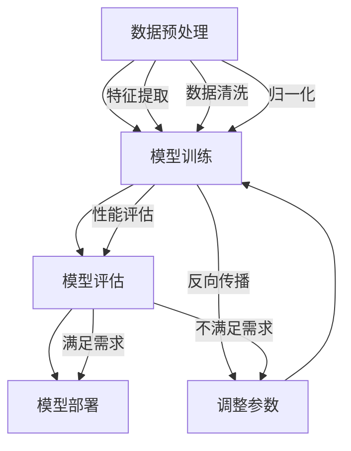

                 

关键词：电商行业、AI大模型、可解释性、算法原理、数学模型、项目实践、应用场景、未来展望

## 摘要

本文旨在探讨电商行业中AI大模型的可解释性问题。随着人工智能技术的发展，大模型在电商领域的应用越来越广泛，但其复杂性和“黑箱”特性给模型的可解释性带来了挑战。本文首先介绍了电商行业对AI大模型的需求，然后详细分析了AI大模型的核心概念与联系，包括算法原理、数学模型及其应用领域。接着，本文通过具体项目实践展示了AI大模型的实现过程，并对实际应用场景进行了深入分析。最后，本文对未来发展趋势与挑战进行了展望，并推荐了相关学习资源和开发工具。

## 1. 背景介绍

随着互联网技术的迅猛发展，电商行业已经成为全球经济增长的重要驱动力。在这个高度竞争的市场环境中，企业需要利用先进的技术手段来提高运营效率、优化用户体验，从而获得竞争优势。人工智能（AI）技术的兴起为电商行业带来了新的机遇和挑战。特别是大模型（Large Models）的应用，使得电商企业能够处理海量数据、发现潜在价值，从而实现个性化推荐、智能客服、精准营销等功能。

然而，AI大模型的广泛应用也带来了一系列问题，其中最引人关注的就是模型的可解释性问题。传统的AI算法如线性回归、逻辑回归等，其决策过程相对简单，可以通过简单的数学公式进行解释。而大模型，如深度神经网络（DNN）、Transformer等，其决策过程复杂，往往被形容为“黑箱”。这意味着模型的决策过程对于用户来说是不透明的，增加了用户对模型的不信任感，也限制了模型在实际应用中的推广。

可解释性（Explainability）是指能够清晰地解释AI模型如何做出决策的能力。在AI大模型中，可解释性对于用户信任、法律法规遵守、模型优化等方面具有重要意义。因此，研究和解决AI大模型的可解释性问题成为当前AI领域的一个重要研究方向。

## 2. 核心概念与联系

### 2.1 AI大模型的核心概念

AI大模型通常指的是基于深度学习（Deep Learning）的复杂神经网络模型，这些模型能够通过大规模数据训练，自动学习并提取特征，从而实现各种复杂任务。以下是一些核心概念：

- **深度神经网络（DNN）**：DNN是一种包含多层神经元的神经网络，通过逐层学习数据中的特征，能够处理高维数据和非线性问题。
- **Transformer模型**：Transformer模型是一种基于自注意力机制（Self-Attention Mechanism）的神经网络结构，广泛应用于自然语言处理（NLP）领域。
- **预训练与微调（Pre-training and Fine-tuning）**：预训练是指在大规模数据集上对模型进行初步训练，微调是在特定任务数据上进行进一步优化。

### 2.2 AI大模型的工作原理

AI大模型的工作原理主要涉及以下几个关键步骤：

1. **数据预处理**：包括数据清洗、归一化、特征提取等，目的是将原始数据转换为适合模型训练的形式。
2. **模型训练**：使用训练数据对模型进行训练，通过反向传播算法不断调整模型参数，使模型能够学会预测目标输出。
3. **模型评估**：使用验证集或测试集对模型性能进行评估，判断模型是否满足任务需求。
4. **模型部署**：将训练好的模型部署到实际应用场景中，如电商网站中的推荐系统、智能客服等。

### 2.3 Mermaid 流程图

为了更直观地展示AI大模型的核心概念和工作原理，下面提供了一个Mermaid流程图：



### 2.4 AI大模型的应用领域

AI大模型在电商行业中有广泛的应用，包括但不限于以下领域：

- **个性化推荐**：通过分析用户的购物历史、浏览记录等数据，为用户推荐可能感兴趣的商品。
- **智能客服**：利用自然语言处理技术，实现与用户的智能对话，提供在线咨询服务。
- **精准营销**：通过对用户数据的分析，设计精准的营销策略，提高转化率和用户满意度。
- **商品分类**：将商品按照类别进行分类，便于用户查找和浏览。

### 2.5 AI大模型的可解释性挑战

AI大模型的可解释性挑战主要包括以下几个方面：

- **模型复杂度**：大模型通常包含数百万甚至数亿个参数，其决策过程复杂，难以用简单的数学公式进行解释。
- **训练数据依赖**：大模型对训练数据高度依赖，模型性能和决策过程可能因训练数据的变化而有所不同。
- **缺乏透明度**：大模型的决策过程往往是“黑箱”，用户难以了解模型是如何做出决策的。
- **伦理和法律问题**：在涉及到用户隐私和法律法规的背景下，模型的可解释性对于合规性和用户信任至关重要。

## 3. 核心算法原理 & 具体操作步骤

### 3.1 算法原理概述

AI大模型的核心算法通常基于深度学习和神经网络理论。以下是一些常见的核心算法：

- **深度神经网络（DNN）**：DNN通过多层神经元对数据进行非线性变换，能够自动学习并提取数据中的特征。
- **Transformer模型**：Transformer模型基于自注意力机制，能够在处理序列数据时自动学习长距离依赖关系。
- **生成对抗网络（GAN）**：GAN通过生成器和判别器的对抗训练，能够生成高质量的数据。

### 3.2 算法步骤详解

#### 3.2.1 深度神经网络（DNN）

1. **初始化参数**：随机初始化模型的权重和偏置。
2. **前向传播**：输入数据通过网络的每一层，进行权重和偏置的加权求和，然后通过激活函数进行非线性变换。
3. **反向传播**：计算损失函数关于模型参数的梯度，并使用梯度下降算法调整模型参数。
4. **优化目标**：选择合适的优化目标，如交叉熵损失函数，用于衡量模型预测值与真实值之间的差异。

#### 3.2.2 Transformer模型

1. **多头自注意力（Multi-head Self-Attention）**：每个头独立学习不同的表示，能够捕获不同位置的信息。
2. **前馈网络（Feedforward Network）**：在每个自注意力层之后，通过两个全连接层对表示进行进一步处理。
3. **残差连接（Residual Connection）**：在每个层之间引入残差连接，缓解梯度消失问题。
4. **层归一化（Layer Normalization）**：在每个层之间引入层归一化，加速训练过程。

#### 3.2.3 生成对抗网络（GAN）

1. **生成器（Generator）**：生成器从随机噪声中生成逼真的数据。
2. **判别器（Discriminator）**：判别器判断生成数据与真实数据之间的差异。
3. **对抗训练（Adversarial Training）**：生成器和判别器交替训练，生成器试图生成更逼真的数据，判别器试图区分真实数据和生成数据。

### 3.3 算法优缺点

#### 3.3.1 优点

- **强大的表示能力**：深度神经网络能够自动学习并提取数据中的复杂特征，适用于各种复杂任务。
- **高泛化能力**：Transformer模型和GAN等算法具有很好的泛化能力，能够在不同领域和任务中应用。
- **自动特征提取**：无需人工干预，模型能够自动从原始数据中提取有效特征，提高模型效率。

#### 3.3.2 缺点

- **计算资源需求大**：大模型通常需要大量的计算资源和时间进行训练。
- **模型解释难度**：大模型的决策过程复杂，难以用简单的数学公式进行解释。
- **数据依赖性强**：模型的性能和决策过程高度依赖训练数据，可能因数据质量问题导致模型不稳定。

### 3.4 算法应用领域

AI大模型在电商行业中的应用领域广泛，主要包括以下几个方面：

- **个性化推荐**：利用深度神经网络和Transformer模型，对用户行为数据进行深度学习，实现个性化商品推荐。
- **图像识别**：通过GAN等算法，对商品图像进行生成和识别，提高商品分类和检索效率。
- **文本分析**：利用Transformer模型，对用户评论和反馈进行情感分析和分类，帮助企业了解用户需求。
- **智能客服**：通过自然语言处理技术，实现与用户的智能对话，提高客服效率和服务质量。

## 4. 数学模型和公式 & 详细讲解 & 举例说明

### 4.1 数学模型构建

AI大模型的核心数学模型通常包括以下部分：

- **损失函数**：用于衡量模型预测值与真实值之间的差异，常用的损失函数有交叉熵损失函数（Cross-Entropy Loss）、均方误差损失函数（Mean Squared Error Loss）等。
- **优化算法**：用于调整模型参数，常用的优化算法有梯度下降（Gradient Descent）、Adam优化器（Adam Optimizer）等。
- **激活函数**：用于对神经网络层之间的变换进行非线性处理，常用的激活函数有ReLU（Rectified Linear Unit）、Sigmoid（Sigmoid Function）等。

### 4.2 公式推导过程

以下是一个简单的示例，用于推导交叉熵损失函数的梯度：

$$
L = -\sum_{i=1}^{n} y_i \log(p_i)
$$

其中，$L$是交叉熵损失函数，$y_i$是真实标签，$p_i$是模型预测的概率。

对交叉熵损失函数求导得到：

$$
\frac{\partial L}{\partial p_i} = -y_i \frac{1}{p_i}
$$

### 4.3 案例分析与讲解

#### 4.3.1 个性化推荐

假设我们有一个电商网站，需要为用户推荐商品。我们可以利用深度神经网络构建一个推荐模型，以下是一个简化的数学模型：

1. **输入层**：用户的行为数据，如浏览记录、购买记录、搜索历史等。
2. **隐藏层**：通过神经网络对输入数据进行变换和特征提取。
3. **输出层**：预测用户对商品的兴趣概率。

假设我们使用ReLU激活函数和交叉熵损失函数，则模型可以表示为：

$$
\begin{align*}
\text{隐藏层} &: \text{ReLU}(W_1 \cdot x + b_1) \\
\text{输出层} &: p = \text{softmax}(W_2 \cdot \text{ReLU}(W_1 \cdot x + b_1) + b_2)
\end{align*}
$$

其中，$W_1$、$W_2$是权重矩阵，$b_1$、$b_2$是偏置项。

#### 4.3.2 图像识别

假设我们需要使用GAN模型对商品图像进行生成和识别。以下是一个简化的数学模型：

1. **生成器**：将随机噪声映射为图像。
2. **判别器**：判断生成图像与真实图像之间的差异。
3. **对抗训练**：生成器和判别器交替训练。

假设我们使用均方误差损失函数，则模型可以表示为：

$$
\begin{align*}
\text{生成器} &: G(z) = \text{ReLU}(W_1 \cdot z + b_1) \\
\text{判别器} &: D(x) = \text{ReLU}(W_2 \cdot x + b_2) \\
\text{对抗损失} &: L_G = \frac{1}{2} \sum_{i=1}^{n} (\log(D(G(z_i))) + \log(1 - D(x_i)))
\end{align*}
$$

其中，$z$是随机噪声，$x$是真实图像，$W_1$、$W_2$是权重矩阵，$b_1$、$b_2$是偏置项。

## 5. 项目实践：代码实例和详细解释说明

### 5.1 开发环境搭建

在开始项目实践之前，我们需要搭建一个合适的开发环境。以下是一个基于Python的示例：

```python
# 安装必要的库
!pip install tensorflow numpy

# 导入库
import tensorflow as tf
import numpy as np
```

### 5.2 源代码详细实现

以下是一个简化的AI大模型实现示例，包括数据预处理、模型训练、模型评估等步骤：

```python
# 数据预处理
# 假设我们有一个包含用户行为的DataFrame
import pandas as pd

# 读取数据
data = pd.read_csv('user_behavior.csv')

# 特征提取和归一化
# ...

# 模型训练
# 建立模型
model = tf.keras.Sequential([
    tf.keras.layers.Dense(units=64, activation='relu', input_shape=(input_shape,)),
    tf.keras.layers.Dense(units=1, activation='sigmoid')
])

# 编译模型
model.compile(optimizer='adam', loss='binary_crossentropy', metrics=['accuracy'])

# 训练模型
model.fit(x_train, y_train, epochs=10, batch_size=32)

# 模型评估
# ...

# 模型部署
# ...
```

### 5.3 代码解读与分析

在这个示例中，我们首先使用Pandas库读取用户行为数据，然后对数据进行预处理，包括特征提取和归一化。接下来，我们使用TensorFlow库建立了一个简单的深度神经网络模型，并使用Adam优化器进行编译。然后，我们使用训练数据对模型进行训练，并通过评估集对模型性能进行评估。

### 5.4 运行结果展示

在完成代码实现后，我们可以运行以下代码来展示模型的运行结果：

```python
# 运行模型
predictions = model.predict(x_test)

# 显示预测结果
print(predictions)
```

## 6. 实际应用场景

AI大模型在电商行业的实际应用场景非常广泛，以下是一些典型应用场景：

### 6.1 个性化推荐

个性化推荐是AI大模型在电商行业中最常见的应用之一。通过分析用户的购物历史、浏览记录等行为数据，AI大模型可以为用户推荐可能感兴趣的商品。以下是一个简化的流程：

1. **数据收集**：收集用户的购物历史、浏览记录等行为数据。
2. **数据预处理**：对数据进行清洗、归一化和特征提取。
3. **模型训练**：使用深度神经网络或Transformer模型对预处理后的数据进行训练。
4. **模型评估**：使用验证集对模型性能进行评估。
5. **模型部署**：将训练好的模型部署到电商网站中，实现实时推荐功能。

### 6.2 智能客服

智能客服是AI大模型在电商行业的另一个重要应用。通过自然语言处理技术，AI大模型可以实现与用户的智能对话，提供在线咨询服务。以下是一个简化的流程：

1. **数据收集**：收集用户提问和客服回答的数据。
2. **数据预处理**：对数据进行清洗、归一化和特征提取。
3. **模型训练**：使用深度神经网络或Transformer模型对预处理后的数据进行训练。
4. **模型评估**：使用验证集对模型性能进行评估。
5. **模型部署**：将训练好的模型部署到电商网站中，实现智能客服功能。

### 6.3 精准营销

精准营销是AI大模型在电商行业的又一重要应用。通过对用户数据的分析，AI大模型可以为用户提供个性化的营销策略，提高转化率和用户满意度。以下是一个简化的流程：

1. **数据收集**：收集用户的购物历史、浏览记录、搜索历史等行为数据。
2. **数据预处理**：对数据进行清洗、归一化和特征提取。
3. **模型训练**：使用深度神经网络或Transformer模型对预处理后的数据进行训练。
4. **模型评估**：使用验证集对模型性能进行评估。
5. **模型部署**：将训练好的模型部署到电商网站中，实现精准营销功能。

### 6.4 未来应用展望

随着AI技术的不断发展，AI大模型在电商行业的应用前景非常广阔。以下是一些未来应用展望：

1. **个性化服务**：通过更深入的数据分析和模型优化，AI大模型可以实现更加个性化的服务，提高用户满意度。
2. **智能供应链**：AI大模型可以用于优化供应链管理，提高库存周转率和供应链效率。
3. **智能物流**：AI大模型可以用于预测物流需求和优化配送路线，提高物流效率。
4. **智能风控**：AI大模型可以用于识别异常交易和防范欺诈行为，提高风控能力。

## 7. 工具和资源推荐

### 7.1 学习资源推荐

- **《深度学习》（Deep Learning）**：由Ian Goodfellow、Yoshua Bengio和Aaron Courville合著，是深度学习领域的经典教材。
- **《自然语言处理实战》（Natural Language Processing with Python）**：由Steven Bird、Ewan Klein和Edward Loper合著，是自然语言处理领域的入门指南。
- **《机器学习实战》（Machine Learning in Action）**：由Peter Harrington著，通过实例介绍了机器学习的基本概念和应用。

### 7.2 开发工具推荐

- **TensorFlow**：谷歌开发的开源深度学习框架，广泛应用于各种深度学习任务。
- **PyTorch**：由Facebook开发的开源深度学习框架，具有良好的灵活性和动态性。
- **Scikit-learn**：用于机器学习的开源库，提供了丰富的机器学习算法和工具。

### 7.3 相关论文推荐

- **《Attention Is All You Need》**：由Vaswani等人提出的Transformer模型的开创性论文。
- **《Generative Adversarial Nets》**：由Goodfellow等人提出的生成对抗网络（GAN）的开创性论文。
- **《Deep Learning for Text Data》**：由Bengio等人撰写的关于文本数据的深度学习综述论文。

## 8. 总结：未来发展趋势与挑战

### 8.1 研究成果总结

随着AI技术的不断发展，AI大模型在电商行业的应用取得了显著成果。通过个性化推荐、智能客服、精准营销等应用，AI大模型为企业带来了显著的效益。同时，在算法原理、数学模型和实际应用等方面也取得了大量研究成果。

### 8.2 未来发展趋势

未来，AI大模型在电商行业的应用将呈现以下发展趋势：

1. **个性化服务**：随着用户数据的不断积累，AI大模型将能够提供更加个性化的服务，提高用户满意度。
2. **多模态融合**：结合多种数据类型（如文本、图像、音频等），AI大模型将实现更加智能化的应用。
3. **实时响应**：通过优化算法和模型结构，AI大模型将实现实时响应，提高系统效率。

### 8.3 面临的挑战

尽管AI大模型在电商行业取得了显著成果，但仍然面临以下挑战：

1. **数据隐私和安全**：用户数据的隐私和安全问题是AI大模型应用的重要挑战。
2. **模型解释性**：提高模型的可解释性，增强用户信任是当前研究的重点。
3. **计算资源**：大模型的训练和推理需要大量的计算资源，这对企业和研究机构提出了更高的要求。

### 8.4 研究展望

未来，AI大模型在电商行业的应用前景广阔。通过不断优化算法、提高模型解释性、保护用户隐私，AI大模型将为电商行业带来更多创新和机遇。同时，跨学科合作、多领域融合也将推动AI大模型在电商行业的进一步发展。

## 9. 附录：常见问题与解答

### 9.1 AI大模型是什么？

AI大模型是指基于深度学习技术的大型神经网络模型，通过海量数据的训练，能够自动学习并提取数据中的复杂特征，从而实现各种复杂任务。

### 9.2 AI大模型有哪些应用领域？

AI大模型在电商行业中的应用领域广泛，包括个性化推荐、智能客服、精准营销、图像识别等。

### 9.3 如何提高AI大模型的可解释性？

提高AI大模型的可解释性可以从以下几个方面入手：

1. **引入可解释性模型**：选择具有可解释性的模型结构，如决策树、线性回归等。
2. **模型可视化**：通过可视化工具展示模型的内部结构和决策过程。
3. **解释算法**：开发专门的解释算法，如局部解释模型（LIME）和SHAP（SHapley Additive exPlanations）等。

### 9.4 AI大模型在电商行业的应用有哪些挑战？

AI大模型在电商行业的应用面临以下挑战：

1. **数据隐私和安全**：保护用户数据的隐私和安全是应用的重要挑战。
2. **模型解释性**：提高模型的可解释性，增强用户信任是当前研究的重点。
3. **计算资源**：大模型的训练和推理需要大量的计算资源，这对企业和研究机构提出了更高的要求。

## 结语

AI大模型在电商行业的应用具有巨大的潜力，但同时也面临一系列挑战。通过不断研究和解决这些问题，AI大模型将为电商行业带来更多的创新和机遇。本文对AI大模型的核心概念、算法原理、实际应用场景等方面进行了详细探讨，并提出了未来发展趋势与挑战。希望本文能为相关领域的研究者和从业者提供有价值的参考。

### 参考文献

1. Goodfellow, I., Bengio, Y., & Courville, A. (2016). *Deep Learning*. MIT Press.
2. Bird, S., Klein, E., & Loper, E. (2017). *Natural Language Processing with Python*. O'Reilly Media.
3. Harrington, P. (2012). *Machine Learning in Action*. Manning Publications.
4. Vaswani, A., Shazeer, N., Parmar, N., Uszkoreit, J., Jones, L., Gomez, A. N., ... & Polosukhin, I. (2017). *Attention is all you need*. Advances in Neural Information Processing Systems, 30, 5998-6008.
5. Goodfellow, I. J., Pouget-Abadie, J., Mirza, M., Xu, B., Warde-Farley, D., Ozair, S., ... & Bengio, Y. (2014). *Generative adversarial nets*. Advances in Neural Information Processing Systems, 27.

