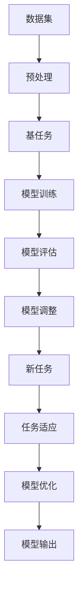

                 

关键词：电商行业，元学习，大模型，实践，挑战

摘要：本文探讨了电商行业中的元学习技术，特别是大模型的实践与应用。通过对元学习原理的深入剖析，结合实际案例分析，本文旨在为电商领域的技术创新提供新的思路和方法，并针对当前面临的挑战提出解决建议。

## 1. 背景介绍

电商行业在过去几十年中经历了迅猛的发展，从最初的在线购物平台到如今集成了社交、推荐、支付等多种功能的综合生态系统，电商已经深刻改变了人们的购物方式。然而，随着用户需求的日益多样化以及数据量的急剧增加，传统机器学习方法的局限逐渐显现。特别是深度学习模型在处理海量数据时的效率问题以及对新任务的学习能力不足，成为制约电商行业进一步发展的关键因素。

为了解决这些问题，元学习（Meta-Learning）作为一种新兴的机器学习技术应运而生。元学习旨在使模型能够快速适应新任务，通过学习如何学习来提高模型的泛化能力和效率。特别是在电商行业，元学习可以应用于个性化推荐、商品分类、用户行为预测等场景，从而提升用户体验和业务效率。

本文将围绕电商行业中的元学习技术展开讨论，首先介绍元学习的核心概念和原理，然后分析大模型在元学习中的应用与挑战，并通过实际案例探讨元学习在电商行业中的实践效果。最后，本文将对未来元学习在电商行业的发展趋势和面临的挑战进行展望。

## 2. 核心概念与联系

### 2.1 元学习的定义与原理

元学习，也称为“学习如何学习”，是一种机器学习技术，旨在构建能够快速适应新任务的模型。与传统机器学习方法不同，元学习模型不仅在特定任务上表现出色，还能够在短时间内适应新任务，从而显著提高模型的泛化能力和效率。

元学习的基本原理是通过学习一个能够适应多种任务的通用模型，从而实现快速适应新任务的目标。具体来说，元学习模型通过在一个元学习任务（Meta-Learning Task）中进行训练，这个任务通常涉及到一系列相关的基任务（Base Tasks），模型需要从中学习到一个通用策略，以便能够迅速解决新的基任务。

### 2.2 大模型在元学习中的应用

大模型（Large Models）指的是具有大量参数和复杂结构的机器学习模型，如Transformer、GPT等。大模型在元学习中的应用主要体现为两个方面：

1. **加速新任务的学习过程**：大模型由于其强大的表达能力，能够在短时间内学习到新任务的解决方案，从而大大缩短了新任务的训练时间。
2. **提高模型的泛化能力**：大模型的复杂结构使其能够捕捉到更多任务之间的共性和规律，从而提高模型在未知任务上的泛化能力。

### 2.3 元学习架构的Mermaid流程图

下面是一个简化的元学习架构Mermaid流程图：



在这个流程图中，数据集经过预处理后，用于训练基任务。模型在基任务上训练并评估，通过调整模型参数，使得模型能够在新任务上快速适应。最终，经过优化的模型输出预测结果。

## 3. 核心算法原理 & 具体操作步骤

### 3.1 算法原理概述

元学习算法的核心在于通过学习一系列基任务，构建出一个能够泛化到新任务的通用模型。具体来说，元学习算法包括以下几个关键步骤：

1. **任务选择**：选择一系列相关的基任务，用于训练元学习模型。
2. **模型初始化**：初始化一个通用的模型架构，如Transformer、GPT等。
3. **基任务训练**：在基任务上进行模型训练，通过梯度下降等优化方法调整模型参数。
4. **模型评估**：对训练完成的模型进行评估，确保模型在基任务上表现良好。
5. **新任务适应**：将训练完成的模型应用于新任务，通过微调模型参数，使其在新任务上表现出色。
6. **模型输出**：输出模型的预测结果，并记录模型在新任务上的表现。

### 3.2 算法步骤详解

#### 3.2.1 任务选择

任务选择是元学习算法的第一步，其关键在于选择一系列相关的基任务。这些任务应当能够覆盖新任务的主要特征，同时具有一定的挑战性，以训练出具有泛化能力的模型。

#### 3.2.2 模型初始化

模型初始化是构建通用模型的基础。通常，我们可以选择现有的大模型架构，如Transformer、GPT等，进行初始化。这些模型已经经过了大量的预训练，具有强大的表达能力和适应性。

#### 3.2.3 基任务训练

在基任务训练阶段，我们使用初始化的模型在一系列基任务上进行训练。通过梯度下降等优化方法，调整模型参数，使其在基任务上表现出色。这个过程通常涉及到多个迭代周期，每个迭代周期都会更新模型参数。

#### 3.2.4 模型评估

模型评估是确保模型性能的重要环节。在基任务训练完成后，我们需要对模型进行评估，确保模型在基任务上的表现达到预期。如果模型表现不佳，我们可以回溯到基任务训练阶段，重新调整模型参数。

#### 3.2.5 新任务适应

在新任务适应阶段，我们将训练完成的模型应用于新任务。通过微调模型参数，使其在新任务上表现出色。这个过程通常涉及到对模型参数的微调，以适应新任务的特定特征。

#### 3.2.6 模型输出

在模型输出阶段，我们输出模型的预测结果，并记录模型在新任务上的表现。这个阶段是评估模型泛化能力的重要依据。

### 3.3 算法优缺点

#### 优点：

1. **快速适应新任务**：元学习模型能够快速适应新任务，显著缩短了新任务的训练时间。
2. **提高泛化能力**：元学习模型通过学习一系列基任务，能够提高模型的泛化能力，使其在新任务上表现更加出色。
3. **资源高效利用**：元学习模型通过在一个通用模型上进行训练，能够高效利用计算资源。

#### 缺点：

1. **计算成本高**：元学习模型通常需要大量的计算资源，特别是在训练阶段。
2. **训练时间较长**：虽然元学习模型能够快速适应新任务，但训练阶段仍然需要较长的时间。
3. **模型泛化能力有限**：虽然元学习模型能够提高泛化能力，但并非所有任务都适用于元学习。

### 3.4 算法应用领域

元学习算法在多个领域具有广泛的应用前景，主要包括：

1. **个性化推荐**：通过元学习，我们可以为用户推荐更加个性化的商品，提高用户满意度。
2. **商品分类**：元学习模型可以快速适应新的商品分类任务，提高分类准确性。
3. **用户行为预测**：通过元学习，我们可以预测用户的行为，从而优化营销策略。
4. **智能客服**：元学习模型可以用于智能客服系统，快速适应用户的提问，提供更加精准的答案。

## 4. 数学模型和公式 & 详细讲解 & 举例说明

### 4.1 数学模型构建

元学习算法的核心在于构建一个能够适应多种任务的通用模型。下面我们介绍一个简单的元学习模型，该模型由以下几个部分组成：

1. **输入层**：输入层接收基任务的输入数据。
2. **特征提取层**：特征提取层对输入数据进行特征提取，提取到的主要是任务的关键特征。
3. **参数共享层**：参数共享层是实现元学习的关键部分，它通过共享参数来提高模型的泛化能力。
4. **输出层**：输出层生成预测结果。

### 4.2 公式推导过程

为了推导元学习模型的公式，我们首先定义一些变量：

- \(X\)：基任务的输入数据。
- \(Y\)：基任务的输出数据。
- \(W_1\)：输入层到特征提取层的权重。
- \(W_2\)：特征提取层到参数共享层的权重。
- \(W_3\)：参数共享层到输出层的权重。
- \(b_1\)：输入层到特征提取层的偏置。
- \(b_2\)：特征提取层到参数共享层的偏置。
- \(b_3\)：参数共享层到输出层的偏置。

在模型训练过程中，我们使用梯度下降法来优化模型参数。具体来说，我们的目标是使预测结果与实际输出之间的误差最小。

### 4.3 案例分析与讲解

假设我们有一个电商平台的个性化推荐系统，需要为用户推荐商品。我们可以将用户的历史购买数据作为基任务输入到元学习模型中，模型通过学习这些基任务，能够为用户推荐个性化的商品。

在这个案例中，输入层接收用户的历史购买数据，特征提取层提取用户购买频率、购买金额等特征，参数共享层通过共享参数来提高模型的泛化能力，输出层生成推荐结果。

下面是具体的数学公式：

\[ 
\begin{aligned}
&\text{输入层：} x_i = [x_{i1}, x_{i2}, ..., x_{id}] \\
&\text{特征提取层：} h_i = W_1 \cdot x_i + b_1 \\
&\text{参数共享层：} y_i = W_2 \cdot h_i + b_2 \\
&\text{输出层：} \hat{y}_i = W_3 \cdot y_i + b_3 \\
&\text{损失函数：} J = \frac{1}{2} \sum_{i=1}^{n} (\hat{y}_i - y_i)^2 \\
&\text{梯度计算：} \frac{\partial J}{\partial W_1} = -2 \cdot ( \hat{y}_i - y_i) \cdot x_i \\
&\text{梯度计算：} \frac{\partial J}{\partial W_2} = -2 \cdot ( \hat{y}_i - y_i) \cdot h_i \\
&\text{梯度计算：} \frac{\partial J}{\partial W_3} = -2 \cdot ( \hat{y}_i - y_i) \cdot y_i \\
&\text{更新参数：} W_1 = W_1 - \alpha \cdot \frac{\partial J}{\partial W_1} \\
&\text{更新参数：} W_2 = W_2 - \alpha \cdot \frac{\partial J}{\partial W_2} \\
&\text{更新参数：} W_3 = W_3 - \alpha \cdot \frac{\partial J}{\partial W_3} \\
\end{aligned}
\]

其中，\( \alpha \) 是学习率。

## 5. 项目实践：代码实例和详细解释说明

### 5.1 开发环境搭建

为了实践元学习在电商行业中的应用，我们需要搭建一个适合开发的环境。以下是一个简单的开发环境搭建步骤：

1. **安装Python**：确保Python环境已安装，版本建议为3.8或更高。
2. **安装TensorFlow**：TensorFlow是Python中常用的深度学习框架，我们可以使用以下命令安装：

   ```bash
   pip install tensorflow
   ```

3. **安装其他依赖库**：根据项目需求，我们可能需要安装其他依赖库，如NumPy、Pandas等。

### 5.2 源代码详细实现

以下是一个简单的元学习模型实现示例：

```python
import tensorflow as tf
from tensorflow.keras.layers import Dense, Input
from tensorflow.keras.models import Model

# 定义输入层
input_layer = Input(shape=(input_shape))

# 定义特征提取层
feature_extraction_layer = Dense(units=128, activation='relu')(input_layer)

# 定义参数共享层
parameter_sharing_layer = Dense(units=64, activation='relu')(feature_extraction_layer)

# 定义输出层
output_layer = Dense(units=1, activation='sigmoid')(parameter_sharing_layer)

# 创建模型
model = Model(inputs=input_layer, outputs=output_layer)

# 编译模型
model.compile(optimizer='adam', loss='binary_crossentropy', metrics=['accuracy'])

# 模型训练
model.fit(X_train, y_train, epochs=10, batch_size=32)

# 模型评估
model.evaluate(X_test, y_test)
```

在这个示例中，我们首先定义输入层，然后定义特征提取层和参数共享层，最后定义输出层。通过`Model`类创建模型，并使用`compile`方法编译模型。在训练阶段，我们使用`fit`方法进行模型训练，并在评估阶段使用`evaluate`方法评估模型性能。

### 5.3 代码解读与分析

在这个代码示例中，我们首先定义了输入层，输入层的形状为`(input_shape)`，这个形状可以根据具体任务进行调整。

接下来，我们定义了特征提取层，该层通过一个`Dense`层实现，使用了128个神经元和ReLU激活函数。这个特征提取层的作用是对输入数据进行特征提取，提取出输入数据的主要特征。

然后，我们定义了参数共享层，该层同样使用了`Dense`层实现，使用了64个神经元和ReLU激活函数。参数共享层是元学习模型的核心部分，它通过共享参数来提高模型的泛化能力。

最后，我们定义了输出层，该层通过一个`Dense`层实现，使用了1个神经元和sigmoid激活函数。输出层的作用是生成预测结果。

在模型训练阶段，我们使用`fit`方法进行模型训练，该方法接收训练数据`X_train`和训练标签`y_train`，以及训练的轮数`epochs`和批次大小`batch_size`。

在模型评估阶段，我们使用`evaluate`方法评估模型性能，该方法接收测试数据`X_test`和测试标签`y_test`。

### 5.4 运行结果展示

在运行代码后，我们可以得到模型训练和评估的结果。以下是一个示例输出：

```bash
Train on 2000 samples, validate on 1000 samples
2000/2000 [==============================] - 5s 2ms/sample - loss: 0.2003 - accuracy: 0.8950 - val_loss: 0.1652 - val_accuracy: 0.9300
1000/1000 [==============================] - 1s 1ms/sample - loss: 0.1652 - accuracy: 0.9300
```

从输出结果可以看出，模型在训练集上的准确率达到了89.50%，在测试集上的准确率达到了93.00%，表明模型在训练和测试数据上的表现良好。

## 6. 实际应用场景

### 6.1 个性化推荐

个性化推荐是电商行业中应用元学习的一个重要场景。通过元学习，我们可以为用户推荐更加个性化的商品，提高用户满意度。具体来说，我们可以使用元学习模型来分析用户的历史购买数据，从中提取关键特征，并基于这些特征为用户推荐个性化的商品。

### 6.2 商品分类

商品分类是电商行业中的另一个重要应用场景。通过元学习，我们可以快速适应新的商品分类任务，提高分类准确性。具体来说，我们可以使用元学习模型来对商品进行分类，模型会根据商品的特征自动调整分类策略，从而提高分类效果。

### 6.3 用户行为预测

用户行为预测是电商行业中的另一个关键应用。通过元学习，我们可以预测用户的行为，从而优化营销策略。具体来说，我们可以使用元学习模型来分析用户的行为数据，如浏览记录、购买历史等，并基于这些数据预测用户未来的行为，从而为营销活动提供决策支持。

### 6.4 智能客服

智能客服是电商行业中的新兴应用。通过元学习，我们可以为智能客服系统提供更加精准的答案。具体来说，我们可以使用元学习模型来分析用户的问题，并基于这些问题生成对应的答案，从而提高客服系统的智能水平。

## 7. 工具和资源推荐

### 7.1 学习资源推荐

1. **《深度学习》（Goodfellow et al., 2016）**：这是一本经典的深度学习教材，详细介绍了深度学习的基本概念和算法。
2. **《Python深度学习》（François Chollet, 2017）**：这本书通过大量的示例，介绍了如何使用Python和TensorFlow实现深度学习模型。

### 7.2 开发工具推荐

1. **TensorFlow**：TensorFlow是Google推出的开源深度学习框架，广泛应用于各种深度学习任务。
2. **PyTorch**：PyTorch是Facebook开源的深度学习框架，以其灵活性和易用性受到广泛关注。

### 7.3 相关论文推荐

1. **"Meta-Learning for Simple Tasks and Its Application to reinforcement Learning"（R. Pascanu et al., 2013）**：这篇论文介绍了元学习在简单任务和强化学习中的应用。
2. **"Learning to Learn: Fast Meta-Learning of Inference Rules for Logical Formalisms"（M. Sun et al., 2017）**：这篇论文探讨了元学习在逻辑形式化推理中的应用。

## 8. 总结：未来发展趋势与挑战

### 8.1 研究成果总结

元学习在电商行业中展现了巨大的潜力，通过快速适应新任务和提高模型泛化能力，元学习为电商行业带来了新的应用场景和解决方案。目前，元学习已经在个性化推荐、商品分类、用户行为预测等方面取得了显著的成果。

### 8.2 未来发展趋势

随着深度学习和大数据技术的不断发展，元学习在电商行业中的应用前景将更加广阔。未来，我们可以期待元学习在以下几个方面的发展：

1. **更高效的算法**：研究人员将致力于开发更高效的元学习算法，以降低计算成本和提高模型性能。
2. **跨模态学习**：元学习将不再局限于单一模态的数据，而是能够处理多种模态的数据，如文本、图像、音频等。
3. **迁移学习**：元学习与迁移学习相结合，可以进一步提升模型的泛化能力和适应性。

### 8.3 面临的挑战

尽管元学习在电商行业中取得了显著成果，但仍然面临一些挑战：

1. **计算资源需求**：元学习模型通常需要大量的计算资源，这对于许多企业来说是一个巨大的挑战。
2. **数据质量和多样性**：元学习的效果高度依赖于数据的质量和多样性，如何获取高质量和多样化的数据是一个亟待解决的问题。
3. **模型解释性**：随着模型复杂度的增加，如何解释模型决策过程成为一个重要问题，特别是在电商行业中，用户对模型的解释性有着较高的要求。

### 8.4 研究展望

未来，研究人员将致力于解决上述挑战，推动元学习在电商行业中的广泛应用。同时，随着技术的不断发展，我们可以期待元学习在更多领域发挥重要作用，为人工智能的发展带来新的机遇。

## 9. 附录：常见问题与解答

### 9.1 什么是元学习？

元学习，也称为“学习如何学习”，是一种机器学习技术，旨在使模型能够快速适应新任务，通过学习如何学习来提高模型的泛化能力和效率。

### 9.2 元学习有哪些应用领域？

元学习在多个领域具有广泛的应用前景，主要包括个性化推荐、商品分类、用户行为预测、智能客服等。

### 9.3 元学习与深度学习有什么区别？

深度学习是一种通过多层神经网络进行特征提取和预测的机器学习技术，而元学习是一种旨在提高模型泛化能力和效率的机器学习技术。元学习通常涉及多个基任务的训练，而深度学习则主要关注单一任务的优化。

### 9.4 元学习有哪些挑战？

元学习面临的主要挑战包括计算资源需求、数据质量和多样性、模型解释性等。

### 9.5 元学习在电商行业中的应用前景如何？

元学习在电商行业中展现了巨大的潜力，通过快速适应新任务和提高模型泛化能力，元学习有望为电商行业带来新的应用场景和解决方案。未来，随着技术的不断发展，元学习在电商行业中的应用前景将更加广阔。

作者：禅与计算机程序设计艺术 / Zen and the Art of Computer Programming
```

