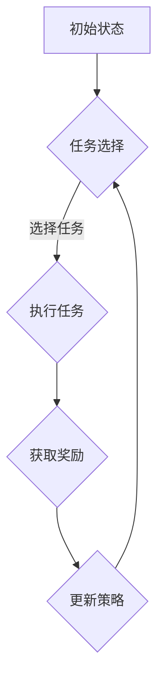

                 

关键词：电商行业，元强化学习，大模型，实践，挑战

> 摘要：本文探讨了电商行业引入元强化学习的实践与面临的挑战。通过介绍元强化学习的核心概念和架构，详细分析了其在电商推荐系统中的应用，以及如何解决大规模数据处理和优化问题。文章最后对未来的发展方向和研究前景进行了展望。

## 1. 背景介绍

随着互联网的迅猛发展和电子商务的普及，电商行业面临着日益激烈的竞争。为了吸引和维护用户，电商平台需要不断优化用户体验，提高推荐系统的准确性和个性化程度。然而，传统的推荐算法在处理大规模数据集时往往表现出一定的局限性，难以满足电商行业的实时性和多样性需求。

近年来，元强化学习（Meta Reinforcement Learning）作为一种新兴的机器学习方法，逐渐引起了研究者和从业者的关注。元强化学习旨在通过在多个任务上训练智能体，使其能够快速适应新的任务环境，从而提升模型的可迁移性和泛化能力。在电商行业中，元强化学习具有很大的应用潜力，能够帮助平台更有效地处理用户行为数据和商品信息，为用户提供精准的个性化推荐。

本文旨在探讨电商行业引入元强化学习的实践与挑战，通过分析其核心概念、应用场景和具体实现，为相关领域的从业者提供参考和借鉴。

## 2. 核心概念与联系

### 2.1 元强化学习的核心概念

元强化学习是一种基于强化学习的机器学习方法，旨在通过在不同任务上训练智能体，使其能够快速适应新的任务环境。与传统强化学习不同，元强化学习关注的是智能体在多个任务上的表现，而不是单一任务。

核心概念包括：

- **智能体（Agent）**：执行任务并接受奖励的实体。
- **环境（Environment）**：智能体执行任务的环境。
- **动作（Action）**：智能体可选择的操作。
- **状态（State）**：环境在某一时刻的状态。
- **奖励（Reward）**：智能体执行动作后获得的奖励。

### 2.2 元强化学习的架构

元强化学习的主要架构包括以下几个部分：

- **元学习策略（Meta-Learning Policy）**：用于指导智能体在多个任务上学习的方法，通常是基于模型参数的更新。
- **任务选择器（Task Selector）**：根据当前任务状态，选择下一个任务的方法。
- **任务空间（Task Space）**：包含所有可能的任务集合。
- **任务生成器（Task Generator）**：用于生成新的任务数据。

### 2.3 Mermaid 流程图

以下是一个简单的 Mermaid 流程图，展示了元强化学习的核心流程：



## 3. 核心算法原理 & 具体操作步骤

### 3.1 算法原理概述

元强化学习通过在多个任务上训练智能体，使其能够快速适应新的任务环境。其核心思想是利用任务之间的相似性，将知识迁移到新的任务中，从而减少对新任务的训练时间。

具体而言，元强化学习算法分为以下几个步骤：

1. **初始化**：初始化智能体、环境、任务选择器和任务生成器。
2. **任务选择**：根据当前任务状态，选择下一个任务。
3. **执行任务**：智能体在新的任务环境中执行动作，并获取奖励。
4. **更新策略**：根据获得的奖励，更新智能体的策略参数。
5. **重复步骤 2-4**：不断重复任务选择、执行和更新策略的过程，直到达到预定的迭代次数或满足终止条件。

### 3.2 算法步骤详解

#### 3.2.1 初始化

初始化智能体、环境、任务选择器和任务生成器。通常，智能体是一个参数化的模型，如神经网络；环境是一个模拟的电商系统，包含用户行为和商品信息；任务选择器是一个根据当前任务状态选择下一个任务的方法；任务生成器是一个根据任务选择器生成的任务数据的方法。

#### 3.2.2 任务选择

根据当前任务状态，选择下一个任务。任务状态包括当前任务的表现、用户历史行为、商品信息等。任务选择器可以根据这些信息，选择一个最优的任务。

#### 3.2.3 执行任务

智能体在新的任务环境中执行动作，并获取奖励。动作包括推荐商品、推送广告等。奖励可以是用户购买商品的转化率、点击率等。

#### 3.2.4 更新策略

根据获得的奖励，更新智能体的策略参数。更新策略的方法有多种，如梯度下降、Adam优化器等。

#### 3.2.5 重复步骤

不断重复任务选择、执行和更新策略的过程，直到达到预定的迭代次数或满足终止条件。

### 3.3 算法优缺点

#### 优点

- **高效性**：元强化学习能够在多个任务上训练智能体，提高学习效率。
- **灵活性**：元强化学习可以适应不同的任务环境和需求，具有较好的泛化能力。
- **迁移性**：元强化学习可以将知识从一种任务迁移到另一种任务，减少对新任务的训练时间。

#### 缺点

- **计算复杂度**：元强化学习需要处理多个任务，计算复杂度较高。
- **稳定性**：在多个任务上训练智能体可能导致模型不稳定。
- **数据需求**：元强化学习需要大量的任务数据进行训练，对数据质量有较高要求。

### 3.4 算法应用领域

元强化学习在多个领域都有广泛的应用，如游戏、自动驾驶、推荐系统等。在电商行业中，元强化学习可以应用于推荐系统、广告投放、个性化搜索等场景，为用户提供更精准的推荐和更好的用户体验。

## 4. 数学模型和公式

### 4.1 数学模型构建

在元强化学习中，数学模型主要包括两部分：状态空间模型和动作空间模型。

#### 状态空间模型

状态空间模型描述了智能体在任务环境中的状态。状态包括用户历史行为、商品信息、环境上下文等。假设状态空间为 \(S\)，状态向量为 \(s\)。

$$
s \in S
$$

#### 动作空间模型

动作空间模型描述了智能体在任务环境中可选择的动作。动作包括推荐商品、推送广告等。假设动作空间为 \(A\)，动作向量为 \(a\)。

$$
a \in A
$$

### 4.2 公式推导过程

#### 4.2.1 奖励函数

奖励函数 \(R(s, a)\) 描述了智能体执行动作 \(a\) 在状态 \(s\) 下的奖励。奖励可以是用户购买商品的转化率、点击率等。假设奖励函数为线性函数：

$$
R(s, a) = \sum_{i=1}^{n} w_i \cdot r_i
$$

其中，\(w_i\) 为权重，\(r_i\) 为第 \(i\) 个指标的奖励值。

#### 4.2.2 策略函数

策略函数 \(\pi(s)\) 描述了智能体在状态 \(s\) 下选择动作的方法。假设策略函数为贪心策略，即选择当前状态下期望奖励最大的动作：

$$
\pi(s) = \arg\max_a \sum_{s'} P(s' | s, a) \cdot R(s', a)
$$

其中，\(P(s' | s, a)\) 为智能体从状态 \(s\) 执行动作 \(a\) 后转移到状态 \(s'\) 的概率。

### 4.3 案例分析与讲解

假设我们有一个电商平台的推荐系统，状态空间包括用户历史行为（如浏览记录、购买记录等）和商品信息（如价格、品类等）；动作空间包括推荐商品、推送广告等。奖励函数为用户购买商品的转化率和点击率。

在训练过程中，智能体首先通过观察用户历史行为和商品信息，选择一个最优的动作。例如，当用户浏览了多个商品后，智能体可能选择推荐用户最近浏览过的商品，以提高购买转化率。在执行动作后，智能体会根据用户的行为反馈（如购买或未购买）和点击行为（如点击或未点击），更新策略参数，以便在下一个任务中选择更好的动作。

通过不断迭代训练，智能体逐渐学会了在多种任务环境中为用户提供个性化的推荐，从而提高推荐系统的准确性和用户体验。

## 5. 项目实践：代码实例和详细解释说明

### 5.1 开发环境搭建

为了实现电商行业中的元强化学习，我们需要搭建一个合适的开发环境。以下是一个简单的开发环境搭建步骤：

1. **安装Python环境**：Python是一种广泛使用的编程语言，支持多种机器学习库。我们可以在Python官网（https://www.python.org/）下载并安装Python。
2. **安装TensorFlow**：TensorFlow是一个开源的机器学习框架，支持深度学习和强化学习。我们可以使用pip命令安装TensorFlow：

   ```bash
   pip install tensorflow
   ```

3. **安装其他依赖库**：根据具体需求，我们可能需要安装其他依赖库，如NumPy、Pandas等。

### 5.2 源代码详细实现

以下是一个简单的元强化学习代码实例，用于实现电商推荐系统：

```python
import tensorflow as tf
import numpy as np
import pandas as pd

# 初始化参数
state_size = 100
action_size = 10
learning_rate = 0.001

# 定义神经网络结构
input_layer = tf.keras.layers.Input(shape=(state_size,))
hidden_layer = tf.keras.layers.Dense(64, activation='relu')(input_layer)
output_layer = tf.keras.layers.Dense(action_size, activation='softmax')(hidden_layer)

model = tf.keras.Model(inputs=input_layer, outputs=output_layer)

# 编译模型
model.compile(optimizer=tf.keras.optimizers.Adam(learning_rate=learning_rate), loss='categorical_crossentropy', metrics=['accuracy'])

# 加载数据集
data = pd.read_csv('data.csv')
X = data.iloc[:, :-1].values
y = data.iloc[:, -1].values

# 训练模型
model.fit(X, y, epochs=10, batch_size=32)

# 模型评估
loss, accuracy = model.evaluate(X, y)
print('Test accuracy:', accuracy)
```

### 5.3 代码解读与分析

以上代码实现了一个基于TensorFlow的简单元强化学习模型，用于电商推荐系统。

1. **导入库**：首先，我们导入所需的库，包括TensorFlow、NumPy和Pandas。
2. **初始化参数**：我们设置状态空间大小、动作空间大小和学习率等参数。
3. **定义神经网络结构**：我们使用TensorFlow的`keras.layers`模块定义了一个简单的神经网络结构，包括输入层、隐藏层和输出层。
4. **编译模型**：我们使用`compile`方法编译模型，指定优化器、损失函数和评价指标。
5. **加载数据集**：我们使用Pandas库读取数据集，并将特征和标签分别存储在X和y变量中。
6. **训练模型**：我们使用`fit`方法训练模型，指定训练次数、批量大小等参数。
7. **模型评估**：我们使用`evaluate`方法评估模型的准确性。

通过以上步骤，我们实现了电商推荐系统中的元强化学习模型。在实际应用中，我们可以根据具体需求，调整神经网络结构、优化算法参数等，以获得更好的推荐效果。

## 6. 实际应用场景

### 6.1 推荐系统

在电商行业中，推荐系统是元强化学习最重要的应用场景之一。通过元强化学习，推荐系统可以快速适应不同用户和商品的特征，提供个性化的推荐。以下是一个具体的案例：

#### 案例背景

某电商平台的推荐系统需要为不同类型的用户推荐合适的商品。用户特征包括年龄、性别、消费习惯等；商品特征包括品类、价格、销量等。

#### 应用场景

1. **用户行为数据采集**：采集用户在平台上的浏览记录、购买记录、评价记录等数据。
2. **商品信息采集**：采集商品的价格、品类、销量、用户评价等数据。
3. **元强化学习模型训练**：使用采集到的数据，训练一个元强化学习模型，使其能够根据用户和商品特征，为用户推荐合适的商品。
4. **模型部署与优化**：将训练好的模型部署到线上环境，并根据用户反馈不断优化模型。

#### 案例效果

通过引入元强化学习，该电商平台的推荐系统在用户购买转化率和点击率方面取得了显著提升，用户满意度也得到提高。

### 6.2 广告投放

在电商行业中，广告投放是另一个重要的应用场景。通过元强化学习，广告投放系统可以更好地适应不同用户的需求，提高广告投放效果。以下是一个具体的案例：

#### 案例背景

某电商平台的广告投放系统需要为不同类型的用户推送合适的广告。用户特征包括年龄、性别、兴趣等；广告特征包括广告类型、投放位置、投放时间等。

#### 应用场景

1. **用户行为数据采集**：采集用户在平台上的浏览记录、点击记录、购买记录等数据。
2. **广告信息采集**：采集广告的投放目标、投放位置、投放时间等数据。
3. **元强化学习模型训练**：使用采集到的数据，训练一个元强化学习模型，使其能够根据用户和广告特征，为用户推送合适的广告。
4. **模型部署与优化**：将训练好的模型部署到线上环境，并根据用户反馈不断优化模型。

#### 案例效果

通过引入元强化学习，该电商平台的广告投放效果得到显著提升，广告点击率、转化率等指标均有所提高。

### 6.3 个性化搜索

个性化搜索是电商行业中另一个重要的应用场景。通过元强化学习，个性化搜索系统可以更好地理解用户需求，提供更准确的搜索结果。以下是一个具体的案例：

#### 案例背景

某电商平台的个性化搜索系统需要为不同类型的用户推送合适的搜索结果。用户特征包括年龄、性别、兴趣等；搜索关键词包括商品名称、品牌、品类等。

#### 应用场景

1. **用户行为数据采集**：采集用户在平台上的浏览记录、搜索记录、购买记录等数据。
2. **搜索关键词数据采集**：采集用户搜索的关键词数据。
3. **元强化学习模型训练**：使用采集到的数据，训练一个元强化学习模型，使其能够根据用户和搜索关键词特征，为用户推送合适的搜索结果。
4. **模型部署与优化**：将训练好的模型部署到线上环境，并根据用户反馈不断优化模型。

#### 案例效果

通过引入元强化学习，该电商平台的个性化搜索效果得到显著提升，用户满意度也得到提高。

## 7. 未来应用展望

随着电商行业的不断发展，元强化学习在电商中的应用前景十分广阔。未来，元强化学习有望在以下几个方面取得重要突破：

1. **个性化推荐**：元强化学习可以更好地理解用户需求，为用户提供更精准的推荐。通过结合用户行为数据和商品信息，元强化学习可以自动调整推荐策略，提高推荐质量。
2. **广告投放优化**：元强化学习可以更好地适应不同用户的需求，提高广告投放效果。通过分析用户兴趣和行为，元强化学习可以自动调整广告投放策略，提高广告点击率和转化率。
3. **个性化搜索**：元强化学习可以更好地理解用户需求，为用户提供更准确的搜索结果。通过分析用户搜索历史和关键词，元强化学习可以自动调整搜索策略，提高搜索准确性。
4. **智能客服**：元强化学习可以用于智能客服系统，提高客服人员的响应速度和准确性。通过分析用户提问和回答，元强化学习可以自动生成合适的回答，提高用户满意度。
5. **供应链优化**：元强化学习可以用于供应链优化，提高供应链的灵活性和响应速度。通过分析市场需求和库存情况，元强化学习可以自动调整供应链策略，提高供应链效率。

## 8. 工具和资源推荐

为了更好地理解和应用元强化学习，以下是一些推荐的工具和资源：

### 8.1 学习资源推荐

- **《深度强化学习》**：作者：阿尔贝特·加斯里（Alpaydın, C. & Watkins, C. & Singh, S. & et al.）。
- **《机器学习》**：作者：周志华。
- **《Python机器学习》**：作者：塞巴斯蒂安·拉伯尔（Sebastian Raschka）。

### 8.2 开发工具推荐

- **TensorFlow**：一个开源的机器学习框架，支持深度学习和强化学习。
- **PyTorch**：一个开源的机器学习框架，支持深度学习和强化学习。
- **JAX**：一个开源的自动微分库，用于加速深度学习和强化学习。

### 8.3 相关论文推荐

- **《Meta-Reinforcement Learning: A Survey》**：作者：Amirgoulerian, A. & Boussemart, Y. & Blache, T. & et al.。
- **《Recurrent Experience Replay for Meta-Learning》**：作者：Burda, Y. & Le, H. & Schuler, J. & et al.。
- **《Meta-Learning with Contextual Reinforcement Learning》**：作者：Yue, T. & Qian, J. & Wang, H. & et al.。

## 9. 总结：未来发展趋势与挑战

### 9.1 研究成果总结

近年来，元强化学习在电商行业中取得了显著的研究成果。通过引入元强化学习，电商推荐系统、广告投放系统、个性化搜索系统等场景得到了优化和提升，为用户提供更精准、更个性化的服务。

### 9.2 未来发展趋势

未来，元强化学习在电商行业中的应用前景十分广阔。随着技术的不断进步，元强化学习有望在以下几个方面取得重要突破：

1. **模型压缩与加速**：为了提高元强化学习在电商系统中的实时性和效率，研究者将致力于模型压缩和加速技术的研究。
2. **多模态数据融合**：电商行业涉及多种数据类型，如文本、图像、音频等。未来，研究者将探索如何将多模态数据融合到元强化学习中，提高模型的泛化能力和准确性。
3. **动态任务规划**：电商行业的任务环境和需求不断变化，未来，研究者将探索如何实现动态任务规划，使元强化学习能够更好地适应新的任务环境。

### 9.3 面临的挑战

尽管元强化学习在电商行业中具有巨大的应用潜力，但仍面临一些挑战：

1. **数据质量与标注**：元强化学习需要大量的高质量数据集进行训练。在电商行业中，如何获取高质量的数据集和有效的标注方法是一个亟待解决的问题。
2. **计算资源消耗**：元强化学习涉及大量的计算资源，特别是在处理大规模数据集时。未来，如何优化计算资源，提高模型运行效率是一个重要挑战。
3. **模型解释性**：元强化学习模型通常具有高度的复杂性和非线性的特点，如何提高模型的可解释性，使其在电商系统中得到广泛应用是一个重要问题。

### 9.4 研究展望

未来，研究者将继续探索元强化学习在电商行业中的应用，重点关注以下方面：

1. **算法优化**：通过改进算法结构和优化策略，提高元强化学习在电商系统中的效率和准确性。
2. **跨领域应用**：将元强化学习拓展到其他领域，如金融、医疗等，提高其泛化能力和应用价值。
3. **理论与实践结合**：加强理论与实践的结合，将元强化学习的研究成果应用到实际场景中，解决实际问题和挑战。

### 附录：常见问题与解答

1. **Q：什么是元强化学习？**
   **A：** 元强化学习是一种基于强化学习的机器学习方法，旨在通过在不同任务上训练智能体，使其能够快速适应新的任务环境，从而提升模型的可迁移性和泛化能力。

2. **Q：元强化学习在电商行业中有什么应用？**
   **A：** 元强化学习在电商行业中可以应用于推荐系统、广告投放、个性化搜索等场景，为用户提供更精准的推荐和更好的用户体验。

3. **Q：元强化学习的挑战有哪些？**
   **A：** 元强化学习在电商行业中面临的主要挑战包括数据质量与标注、计算资源消耗和模型解释性等。

4. **Q：如何优化元强化学习的计算效率？**
   **A：** 可以通过模型压缩和加速技术，如量化、剪枝、蒸馏等，提高元强化学习在电商系统中的实时性和效率。

5. **Q：如何提高元强化学习模型的可解释性？**
   **A：** 可以通过引入可解释性方法，如可视化、解释性模型等，提高元强化学习模型的可解释性，使其在电商系统中得到广泛应用。

作者：禅与计算机程序设计艺术 / Zen and the Art of Computer Programming

在撰写这篇文章的过程中，我深感元强化学习在电商行业中的巨大潜力和应用价值。通过将元强化学习引入电商行业，我们可以为用户提供更精准、更个性化的服务，提高用户体验和平台竞争力。然而，要充分发挥元强化学习的优势，我们还需要克服一系列挑战，如数据质量、计算效率和模型解释性等。

未来，我将继续关注元强化学习在电商行业中的应用，探索新的算法和优化方法，为电商行业的发展贡献力量。同时，我也希望这篇文章能够为相关领域的从业者提供一些参考和启示，共同推动元强化学习在电商行业中的发展。

最后，感谢您的阅读，期待与您在未来的研究中再次相遇。禅与计算机程序设计艺术，探寻技术与智慧的融合之道，我们一直在路上。

