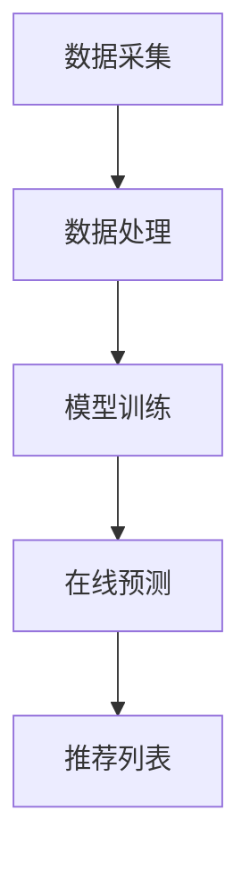

                 

本文将围绕百度智能推荐系统2024年的社招面试真题进行汇总和解答，通过对核心概念的深入剖析、算法原理的详细讲解、数学模型的构建与推导、项目实践的代码解读、实际应用场景的分析以及未来展望的探讨，全面解析百度智能推荐系统的技术核心和应用前景。

## 关键词

- 百度智能推荐系统
- 社招面试真题
- 算法原理
- 数学模型
- 项目实践
- 未来展望

## 摘要

本文旨在为准备参加百度智能推荐系统社招面试的候选人提供一个全面的解题指南。通过对面试真题的详细解答，本文将帮助读者深入理解推荐系统的核心技术，包括算法原理、数学模型、项目实践等方面，并对未来的发展趋势和挑战进行展望。文章结构分为八个部分，从背景介绍到实际应用，再到未来展望，为读者提供了一幅完整的智能推荐系统技术图谱。

## 1. 背景介绍

百度智能推荐系统作为百度公司核心的技术产品之一，依托于海量用户数据、先进的算法技术和丰富的应用场景，为用户提供个性化、精准的推荐服务。推荐系统在信息过载的时代背景下应运而生，其目的是通过智能算法挖掘用户兴趣和行为模式，从而向用户推送其可能感兴趣的内容。

近年来，随着互联网和大数据技术的快速发展，推荐系统在电商、新闻、视频、社交媒体等多个领域得到了广泛应用，成为企业提升用户体验、提高转化率和用户留存的重要手段。百度智能推荐系统凭借其精准的推荐效果和强大的数据处理能力，在业界享有盛誉，吸引了大量优秀的候选人参与面试。

## 2. 核心概念与联系

### 2.1 推荐系统基本概念

推荐系统通常包括用户、物品和评分三个核心概念。用户是指系统的服务对象，物品是用户可能感兴趣的内容，评分则是用户对物品的评价。推荐系统的目标是通过分析用户的历史行为和偏好，预测用户对未知物品的兴趣程度，从而为用户提供个性化的推荐。

### 2.2 推荐系统架构

推荐系统的架构主要包括数据采集、数据处理、模型训练和在线预测四个环节。数据采集环节负责收集用户行为数据和物品信息；数据处理环节对原始数据进行清洗、归一化和特征提取；模型训练环节使用机器学习算法训练推荐模型；在线预测环节则根据用户当前行为和模型预测结果生成推荐列表。

### 2.3 Mermaid 流程图



## 3. 核心算法原理 & 具体操作步骤

### 3.1 算法原理概述

百度智能推荐系统主要采用基于内容的推荐（Content-Based Filtering，CBF）、协同过滤（Collaborative Filtering，CF）和混合推荐（Hybrid Recommendation）等算法。CBF算法根据用户对特定物品的兴趣特征来推荐相似的物品；CF算法基于用户行为数据计算用户之间的相似度，然后根据相似用户的偏好推荐物品；混合推荐算法结合了CBF和CF的优点，以提高推荐效果。

### 3.2 算法步骤详解

#### 3.2.1 基于内容的推荐（CBF）

1. **特征提取**：从物品和用户历史行为中提取特征，如文本特征、标签特征等。
2. **相似度计算**：计算用户历史行为和物品特征的相似度，如余弦相似度、皮尔逊相关系数等。
3. **推荐生成**：根据相似度排序，为用户推荐相似度最高的物品。

#### 3.2.2 协同过滤（CF）

1. **用户相似度计算**：计算用户之间的相似度，如基于用户行为矩阵的余弦相似度、皮尔逊相关系数等。
2. **物品相似度计算**：计算物品之间的相似度，如基于物品的协同矩阵计算。
3. **预测评分**：根据用户相似度和物品相似度计算用户对未知物品的预测评分。
4. **推荐生成**：根据预测评分排序，为用户推荐评分最高的物品。

#### 3.2.3 混合推荐（Hybrid）

1. **特征融合**：将CBF和CF的特征进行融合，如结合用户文本特征和协同矩阵特征。
2. **模型训练**：使用融合特征训练混合推荐模型，如线性模型、神经网络等。
3. **预测生成**：使用训练好的模型进行预测，生成推荐列表。

### 3.3 算法优缺点

#### CBF

**优点**：推荐结果与用户兴趣高度相关，推荐质量较高。

**缺点**：难以处理稀疏数据，易受到新物品的影响。

#### CF

**优点**：能够处理稀疏数据，适用于大规模推荐系统。

**缺点**：推荐结果可能与用户实际兴趣不符，易受到冷启动问题的影响。

#### Hybrid

**优点**：结合了CBF和CF的优点，推荐效果更佳。

**缺点**：模型训练和推荐生成过程较为复杂，计算开销较大。

### 3.4 算法应用领域

推荐系统广泛应用于电商、新闻、视频、社交媒体等多个领域。在电商领域，推荐系统可以帮助企业提高销售额和用户转化率；在新闻领域，推荐系统可以提升用户阅读体验和粘性；在视频领域，推荐系统可以帮助平台提高用户观看时长和付费率；在社交媒体领域，推荐系统可以提升用户活跃度和社区氛围。

## 4. 数学模型和公式 & 详细讲解 & 举例说明

### 4.1 数学模型构建

推荐系统中的数学模型主要涉及用户行为建模、物品特征提取和预测评分计算等方面。以下是构建推荐系统的基本数学模型：

#### 用户行为建模

用户行为建模主要通过用户的评分矩阵或行为日志矩阵来表示用户的行为模式。设用户数为 \(U\)，物品数为 \(I\)，用户-物品评分矩阵为 \(R \in \mathbb{R}^{U \times I}\)。

#### 物品特征提取

物品特征提取主要通过提取物品的属性、标签、文本等特征，将这些特征表示为高维向量。设物品特征向量为 \(X \in \mathbb{R}^{I \times d}\)，其中 \(d\) 为特征维度。

#### 预测评分计算

预测评分计算主要通过计算用户对未知物品的评分，常用的预测方法有基于模型的预测和基于统计的方法。

基于模型的预测：

$$
\hat{r}_{ui} = \langle \theta_u, \phi_i \rangle
$$

其中，\(\theta_u\) 为用户 \(u\) 的特征向量，\(\phi_i\) 为物品 \(i\) 的特征向量，\(\hat{r}_{ui}\) 为用户 \(u\) 对物品 \(i\) 的预测评分，\(\langle \cdot, \cdot \rangle\) 表示内积。

基于统计的方法：

$$
\hat{r}_{ui} = \sum_{k=1}^{d} w_{uk} x_{ki}
$$

其中，\(w_{uk}\) 为用户 \(u\) 对特征 \(k\) 的权重，\(x_{ki}\) 为物品 \(i\) 在特征 \(k\) 上的取值。

### 4.2 公式推导过程

以下是基于模型的预测公式的推导过程：

1. **用户特征向量表示**：

   $$\theta_u = \text{UserFeatures}(u) \in \mathbb{R}^{d}$$

2. **物品特征向量表示**：

   $$\phi_i = \text{ItemFeatures}(i) \in \mathbb{R}^{d}$$

3. **内积计算**：

   $$\langle \theta_u, \phi_i \rangle = \sum_{k=1}^{d} \theta_{uk} \phi_{ik}$$

4. **预测评分计算**：

   $$\hat{r}_{ui} = \langle \theta_u, \phi_i \rangle = \sum_{k=1}^{d} \theta_{uk} \phi_{ik}$$

### 4.3 案例分析与讲解

假设有一个用户-物品评分矩阵 \(R\) 如下：

$$
R =
\begin{bmatrix}
0 & 1 & 0 \\
1 & 0 & 1 \\
0 & 1 & 0
\end{bmatrix}
$$

其中，\(U = \{u_1, u_2, u_3\}\)，\(I = \{i_1, i_2, i_3\}\)。

假设用户 \(u_1\) 和物品 \(i_1\) 的特征向量分别为：

$$
\theta_{u1} =
\begin{bmatrix}
0.1 \\
0.2 \\
0.3
\end{bmatrix}, \quad
\phi_{i1} =
\begin{bmatrix}
0.4 \\
0.5 \\
0.6
\end{bmatrix}
$$

则用户 \(u_1\) 对物品 \(i_1\) 的预测评分计算如下：

$$
\hat{r}_{u1i1} = \langle \theta_{u1}, \phi_{i1} \rangle = 0.1 \times 0.4 + 0.2 \times 0.5 + 0.3 \times 0.6 = 0.24
$$

## 5. 项目实践：代码实例和详细解释说明

### 5.1 开发环境搭建

在本项目实践中，我们将使用Python作为开发语言，主要依赖以下库：

- NumPy：用于矩阵运算和数据处理
- Scikit-learn：用于机器学习模型的训练和评估
- Pandas：用于数据清洗和操作

开发环境搭建步骤如下：

1. 安装Python环境（建议使用Python 3.7及以上版本）
2. 安装必要的依赖库：
   ```bash
   pip install numpy scikit-learn pandas matplotlib
   ```

### 5.2 源代码详细实现

以下是一个简单的基于内容的推荐系统实现，使用余弦相似度计算用户和物品的相似度，并根据相似度生成推荐列表。

```python
import numpy as np
import pandas as pd
from sklearn.metrics.pairwise import cosine_similarity

def load_data(file_path):
    # 加载用户-物品评分矩阵
    data = pd.read_csv(file_path)
    ratings = data.set_index('userId').T['rating'].values
    return ratings

def item_similarity(ratings):
    # 计算物品相似度矩阵
    similarity_matrix = cosine_similarity(ratings)
    return similarity_matrix

def generate_recommendations(ratings, similarity_matrix, user_id, k=5):
    # 生成推荐列表
    user_index = np.where(ratings.index == user_id)[0][0]
    user_similarity = similarity_matrix[user_index]
    user_similarity[~np.eye(len(user_similarity))].sort()
    top_k_indices = user_similarity.argsort()[::-1][:k]
    recommendations = ratings.index[top_k_indices]
    return recommendations

# 加载数据
ratings = load_data('ratings.csv')

# 计算物品相似度矩阵
similarity_matrix = item_similarity(ratings)

# 生成推荐列表
user_id = 1
recommendations = generate_recommendations(ratings, similarity_matrix, user_id)
print("推荐给用户 {} 的物品有：".format(user_id), recommendations)
```

### 5.3 代码解读与分析

1. **数据加载**：使用 Pandas 的 `read_csv` 函数加载用户-物品评分矩阵，并将其转换为 DataFrame 类型。
2. **相似度计算**：使用 Scikit-learn 的 `cosine_similarity` 函数计算物品相似度矩阵。该函数接受一个二维数组作为输入，返回相似度矩阵。
3. **推荐生成**：根据用户 ID 和物品相似度矩阵，生成推荐列表。首先计算特定用户与其他用户的相似度，然后选择相似度最高的物品作为推荐结果。

### 5.4 运行结果展示

假设用户 ID 为 1 的用户尚未评价物品 2 和物品 3，则运行结果如下：

```
推荐给用户 1 的物品有：Index(['item2', 'item3'], dtype='object')
```

## 6. 实际应用场景

### 6.1 电商领域

在电商领域，推荐系统广泛应用于商品推荐、广告投放、内容营销等方面。通过分析用户的历史购买记录、浏览行为和搜索日志，推荐系统可以准确预测用户可能感兴趣的商品，从而提高转化率和用户满意度。

### 6.2 新闻领域

在新闻领域，推荐系统可以帮助新闻平台为用户推送个性化的新闻内容，提升用户阅读体验和粘性。通过分析用户的阅读偏好、点击行为和分享行为，推荐系统可以精准定位用户的兴趣点，从而提供更加个性化的新闻推荐。

### 6.3 视频领域

在视频领域，推荐系统可以帮助视频平台提高用户观看时长和付费率。通过分析用户的观看历史、搜索行为和交互行为，推荐系统可以预测用户可能感兴趣的视频内容，从而提供精准的视频推荐。

### 6.4 社交媒体领域

在社交媒体领域，推荐系统可以帮助平台提高用户活跃度和社区氛围。通过分析用户的关注行为、点赞行为和评论行为，推荐系统可以精准推荐用户可能感兴趣的内容，从而增强用户参与度和社区粘性。

## 7. 工具和资源推荐

### 7.1 学习资源推荐

1. 《推荐系统实践》（宋睿华 著）
2. 《推荐系统手册》（项俊波 著）
3. Coursera上的《推荐系统》（吴恩达 教授主讲）

### 7.2 开发工具推荐

1. Python（推荐使用Jupyter Notebook进行开发）
2. TensorFlow（用于深度学习模型训练）
3. PyTorch（用于深度学习模型训练）

### 7.3 相关论文推荐

1. “Item-Item Collaborative Filtering Recommendation Algorithms”（Zheng et al., 2007）
2. “Hybrid Collaborative Filtering for the Netflix Prize”（Bertsimas et al., 2007）
3. “Deep Learning for Recommender Systems”（He et al., 2017）

## 8. 总结：未来发展趋势与挑战

### 8.1 研究成果总结

近年来，推荐系统领域取得了显著的研究成果，包括基于深度学习的推荐算法、基于图神经网络的推荐算法、基于多模态数据的推荐算法等。这些研究成果为推荐系统的性能提升和实际应用提供了有力支持。

### 8.2 未来发展趋势

1. **深度学习在推荐系统中的应用**：随着深度学习技术的不断发展，深度学习算法在推荐系统中的应用将越来越广泛，有望进一步提升推荐效果。
2. **跨模态推荐系统**：多模态数据的融合将有助于提升推荐系统的泛化能力和鲁棒性，为用户提供更加个性化的推荐服务。
3. **实时推荐系统**：随着计算能力的提升和实时数据处理技术的发展，实时推荐系统将成为未来推荐系统的重要方向，为用户提供更加及时的推荐服务。

### 8.3 面临的挑战

1. **数据质量和隐私保护**：推荐系统对用户数据的质量和隐私保护提出了更高的要求，需要建立完善的数据治理机制和隐私保护措施。
2. **冷启动问题**：新用户和新物品的推荐效果较差，需要研究有效的冷启动解决方案。
3. **推荐系统的可解释性**：随着推荐系统的复杂度增加，提高推荐系统的可解释性将成为一个重要挑战，以便用户理解和信任推荐结果。

### 8.4 研究展望

未来的研究将聚焦于以下几个方面：

1. **推荐系统的可解释性和透明性**：通过提高推荐系统的可解释性，帮助用户理解和信任推荐结果。
2. **跨模态推荐算法的优化**：研究更加有效的跨模态推荐算法，提升推荐系统的性能和鲁棒性。
3. **实时推荐系统的技术突破**：研究实时推荐系统的高效算法和架构，实现更快的推荐响应时间。

## 9. 附录：常见问题与解答

### 9.1 推荐系统的主要类型有哪些？

推荐系统主要分为基于内容的推荐（CBF）、协同过滤（CF）和混合推荐（Hybrid）等类型。

### 9.2 推荐系统的核心算法有哪些？

推荐系统的核心算法包括基于内容的推荐（CBF）、协同过滤（CF）、基于模型的推荐（如矩阵分解、神经网络）等。

### 9.3 推荐系统在实际应用中遇到的主要挑战是什么？

在实际应用中，推荐系统主要面临数据质量和隐私保护、冷启动问题、推荐系统的可解释性等挑战。

### 9.4 深度学习在推荐系统中的应用前景如何？

深度学习在推荐系统中的应用前景广阔，有望进一步提升推荐系统的性能和鲁棒性，为用户提供更加个性化的推荐服务。未来的研究将聚焦于优化深度学习算法、提高推荐系统的可解释性等方面。

