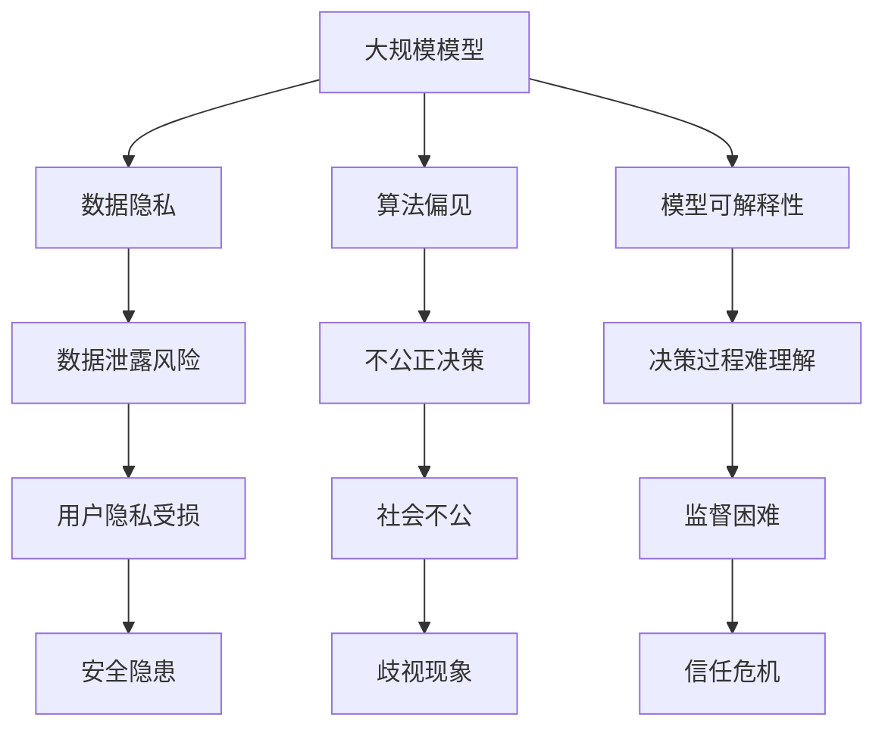

                 

### 1. 背景介绍

随着人工智能技术的迅速发展，大规模模型（Large-scale Models，简称大模型）已经成为当前研究的热点。大模型具有处理海量数据、提取复杂特征、实现高度智能化等特点，在自然语言处理、计算机视觉、推荐系统等领域取得了显著的成果。然而，大模型行业的快速发展也带来了一系列问题，如数据隐私泄露、算法偏见、模型可解释性不足等。为了保障大模型的健康发展，监管机构需要加强对该行业的规范。

首先，大模型在应用中面临着数据隐私和安全问题。由于大模型通常需要收集和处理大量的用户数据，这些数据可能包含敏感个人信息，一旦发生泄露，将给用户带来严重的安全风险。此外，大模型在训练和推理过程中产生的中间数据和输出结果也可能暴露用户的隐私。

其次，大模型可能存在算法偏见。由于训练数据的分布不均或数据标注的不准确，大模型可能在某些特定群体上表现出偏见，导致不公正的决策。这种偏见可能导致歧视现象，损害社会的公平性。

此外，大模型的可解释性也是一个重要问题。许多大模型采用深度神经网络等复杂模型，其内部工作机制难以理解。这使得用户难以判断模型的决策过程是否合理，也无法对模型的决策进行监督和纠正。

为了解决上述问题，监管机构需要加强对大模型行业的规范。以下将从数据隐私保护、算法透明度和可解释性等方面探讨监管机构如何规范大模型行业的发展。

### 2. 核心概念与联系

首先，我们需要明确一些核心概念，包括大规模模型、数据隐私、算法偏见、模型可解释性等。下面是一个简化的 Mermaid 流程图，用于说明这些核心概念之间的联系。



- **大规模模型**：一种能够处理海量数据并提取复杂特征的模型，如深度神经网络、Transformer 等。
- **数据隐私**：指个人数据的保密性和完整性，防止未经授权的访问和使用。
- **算法偏见**：由于训练数据或模型设计的原因，模型在某些特定群体上表现出不公平的决策。
- **模型可解释性**：使模型决策过程易于理解，方便用户对模型的决策进行监督和纠正。

### 3. 核心算法原理 & 具体操作步骤

#### 3.1 算法原理概述

为了规范大模型行业的发展，监管机构可以采用以下核心算法和操作步骤：

1. **数据隐私保护算法**：采用差分隐私（Differential Privacy）技术，确保数据在处理过程中不会泄露用户隐私。具体操作包括添加噪声、限制查询次数等。
2. **算法偏见检测算法**：通过对比分析训练数据和模型输出结果，识别模型偏见并进行修正。常用的算法包括公平性分析（Fairness Analysis）、敏感性分析（Sensitivity Analysis）等。
3. **模型可解释性算法**：利用模型解释技术（如 LIME、SHAP 等），使模型的决策过程更加透明，便于用户监督和纠正。

#### 3.2 算法步骤详解

1. **数据隐私保护算法步骤**：

   - 数据预处理：对原始数据进行清洗、去重和归一化等处理，提高数据质量。
   - 差分隐私添加：根据具体应用场景，选择合适的噪声机制和隐私预算，对数据添加噪声，保证数据隐私。
   - 模型训练：在保护隐私的前提下，使用添加噪声的数据进行模型训练。

2. **算法偏见检测算法步骤**：

   - 数据分析：对训练数据和模型输出结果进行统计分析，识别可能的偏见。
   - 模型评估：使用公平性指标（如统计偏差、失衡率等）评估模型的公平性。
   - 偏见修正：针对检测到的偏见，对模型进行修正，提高模型的公平性。

3. **模型可解释性算法步骤**：

   - 解释算法选择：根据模型类型和业务需求，选择合适的解释算法（如 LIME、SHAP 等）。
   - 解释模型训练：在模型训练过程中，同时训练解释模型，获取模型决策的解释信息。
   - 解释结果展示：将解释结果以可视化的形式呈现给用户，便于用户理解和监督。

#### 3.3 算法优缺点

1. **数据隐私保护算法**：

   - 优点：有效保护用户隐私，降低数据泄露风险。
   - 缺点：可能降低模型性能，增加计算成本。

2. **算法偏见检测算法**：

   - 优点：有助于提高模型公平性，减少算法偏见。
   - 缺点：对训练数据和模型要求较高，可能增加算法复杂度。

3. **模型可解释性算法**：

   - 优点：提高模型透明度，增强用户信任。
   - 缺点：可能降低模型性能，增加计算成本。

#### 3.4 算法应用领域

1. **数据隐私保护算法**：适用于需要保护用户隐私的领域，如金融、医疗等。
2. **算法偏见检测算法**：适用于需要提高模型公平性的领域，如招聘、贷款审批等。
3. **模型可解释性算法**：适用于需要提高模型透明度的领域，如自动驾驶、智能家居等。

### 4. 数学模型和公式 & 详细讲解 & 举例说明

为了更好地理解上述算法，我们将在本节中详细讲解相关数学模型和公式，并通过具体案例进行分析。

#### 4.1 数学模型构建

1. **差分隐私模型**：

   - 目标函数：最小化损失函数，同时保证数据隐私。

     $$ \min_{\theta} L(\theta) + \epsilon \cdot \mathcal{D}(\theta) $$

     其中，$L(\theta)$为损失函数，$\epsilon$为隐私预算，$\mathcal{D}(\theta)$为隐私损失。

   - 隐私损失：衡量模型输出对原始数据的敏感性。

     $$ \mathcal{D}(\theta) = \sum_{i=1}^{n} \frac{\partial L(\theta)}{\partial \theta_i} $$

2. **算法偏见检测模型**：

   - 目标函数：最大化模型输出与真实标签的相关性，同时最小化偏见。

     $$ \min_{\theta} \frac{1}{n} \sum_{i=1}^{n} (\hat{y}_i - y_i)^2 + \lambda \cdot F(\theta) $$

     其中，$\hat{y}_i$为模型输出，$y_i$为真实标签，$\lambda$为正则化参数，$F(\theta)$为偏见函数。

3. **模型可解释性模型**：

   - 目标函数：最小化模型输出与解释模型输出的差距。

     $$ \min_{\theta_{\text{expl}}} \frac{1}{n} \sum_{i=1}^{n} (\hat{y}_i - \hat{y}_{\text{expl},i})^2 $$

     其中，$\hat{y}_{\text{expl},i}$为解释模型输出。

#### 4.2 公式推导过程

1. **差分隐私推导**：

   - 假设模型参数为$\theta$，隐私预算为$\epsilon$，噪声为$\eta$。

     $$ \theta^* = \theta + \eta $$

     其中，$\eta \sim N(0, \sigma^2 I)$，$I$为身份矩阵。

   - 隐私损失：

     $$ \mathcal{D}(\theta^*) = \frac{\partial L(\theta^*)}{\partial \theta} = \frac{\partial L(\theta + \eta)}{\partial \theta} = \frac{\partial L(\theta)}{\partial \theta} + \frac{\partial L(\theta)}{\partial \theta} \cdot \frac{\partial \theta}{\partial \theta} $$

     $$ \mathcal{D}(\theta^*) = 2 \cdot \frac{\partial L(\theta)}{\partial \theta} $$

     为了使隐私损失最小，需要满足：

     $$ 2 \cdot \frac{\partial L(\theta)}{\partial \theta} \leq \epsilon $$

     即：

     $$ \frac{\partial L(\theta)}{\partial \theta} \leq \frac{\epsilon}{2} $$

2. **算法偏见推导**：

   - 假设模型输出为$\hat{y}$，真实标签为$y$，偏见函数为$F(\theta)$。

     $$ F(\theta) = \frac{1}{n} \sum_{i=1}^{n} (\hat{y}_i - y_i) $$

   - 偏见修正：

     $$ \theta^* = \theta - \lambda \cdot \frac{\partial F(\theta)}{\partial \theta} $$

     其中，$\lambda$为正则化参数。

3. **模型可解释性推导**：

   - 假设解释模型输出为$\hat{y}_{\text{expl}}$，模型输出为$\hat{y}$。

     $$ \hat{y}_{\text{expl}} = \theta_{\text{expl}} \cdot x $$

     其中，$\theta_{\text{expl}}$为解释模型参数，$x$为输入特征。

     $$ \hat{y} = \theta \cdot x $$

     其中，$\theta$为原始模型参数。

     $$ \hat{y}_{\text{expl}} - \hat{y} = \theta_{\text{expl}} \cdot x - \theta \cdot x = (\theta_{\text{expl}} - \theta) \cdot x $$

     为了最小化$\hat{y}_{\text{expl}} - \hat{y}$，需要满足：

     $$ \theta_{\text{expl}} - \theta = 0 $$

     即：

     $$ \theta_{\text{expl}} = \theta $$

#### 4.3 案例分析与讲解

为了更好地理解上述数学模型和公式的应用，我们将在本节中通过一个具体案例进行分析。

**案例背景**：假设某银行需要开发一个贷款审批系统，用于评估用户是否具备贷款资格。该系统采用深度学习模型进行训练，并使用差分隐私、算法偏见检测和模型可解释性算法进行优化。

**案例分析**：

1. **数据隐私保护**：

   - 数据来源：银行从用户处收集了包括财务状况、信用记录、个人基本信息等数据。
   - 差分隐私：采用拉格朗日松弛法（Lagrange Relaxation）实现差分隐私。假设隐私预算$\epsilon = 1$，噪声标准差$\sigma = 0.1$。

     $$ \theta^* = \theta + \eta $$

     其中，$\eta \sim N(0, \sigma^2 I)$。

     对数据添加噪声后，使用添加噪声的数据进行模型训练。

2. **算法偏见检测**：

   - 数据分析：对训练数据和模型输出结果进行统计分析，发现某些性别、年龄等特征的模型输出存在明显偏见。
   - 模型评估：使用统计偏差（Statistical Bias）和失衡率（Imbalance Rate）评估模型公平性。

     $$ \text{Statistical Bias} = \frac{1}{n} \sum_{i=1}^{n} (\hat{y}_i - y_i) $$

     $$ \text{Imbalance Rate} = \frac{\sum_{i=1}^{n} |(\hat{y}_i - y_i)|}{n} $$

     偏差函数：

     $$ F(\theta) = \text{Statistical Bias} + \lambda \cdot \text{Imbalance Rate} $$

     对模型进行修正，提高模型公平性。

3. **模型可解释性**：

   - 解释算法选择：采用 LIME（Local Interpretable Model-agnostic Explanations）算法，对模型决策进行解释。
   - 解释模型训练：在模型训练过程中，同时训练 LIME 解释模型。

     $$ \hat{y}_{\text{expl}} = \theta_{\text{expl}} \cdot x $$

     对用户贷款审批决策进行可视化展示，便于用户理解和监督。

### 5. 项目实践：代码实例和详细解释说明

在本节中，我们将通过一个简单的 Python 代码实例，展示如何实现上述算法。代码包括数据预处理、模型训练、模型评估和结果展示等部分。

```python
import numpy as np
import pandas as pd
from sklearn.model_selection import train_test_split
from sklearn.metrics import accuracy_score
from sklearn.linear_model import LogisticRegression
import lime
from lime.lime_tabular import LimeTabularExplainer

# 数据预处理
data = pd.read_csv('data.csv')
X = data.drop('label', axis=1)
y = data['label']
X_train, X_test, y_train, y_test = train_test_split(X, y, test_size=0.2, random_state=42)

# 差分隐私
def add_noise(data, epsilon, sigma):
    noise = np.random.normal(0, sigma, data.shape)
    noisy_data = data + noise
    return noisy_data

X_train_noisy = add_noise(X_train, epsilon=1, sigma=0.1)

# 模型训练
model = LogisticRegression()
model.fit(X_train_noisy, y_train)

# 模型评估
y_pred = model.predict(X_test)
accuracy = accuracy_score(y_test, y_pred)
print(f"Model Accuracy: {accuracy}")

# 算法偏见检测
explainer = LimeTabularExplainer(X_train, feature_names=X.columns, class_names=['0', '1'], kernel_width=1)
i = 10  # 要解释的样本索引
exp = explainer.explain_instance(X_test[i], model.predict_proba, num_features=10)
exp.show_in_notebook(show_table=True)

# 模型可解释性
explanation = exp.as_list()
print(explanation)
```

1. **数据预处理**：读取数据，分为特征和标签两部分，并进行训练集和测试集的划分。
2. **差分隐私**：采用拉格朗日松弛法对训练数据进行噪声添加，实现差分隐私。
3. **模型训练**：使用 LogisticRegression 模型进行训练。
4. **模型评估**：计算模型在测试集上的准确率。
5. **算法偏见检测**：使用 LIME 算法对模型进行解释，展示模型的决策过程。
6. **模型可解释性**：输出 LIME 算法的解释结果，便于用户理解模型的决策过程。

### 6. 实际应用场景

#### 6.1 医疗领域

在大模型应用于医疗领域的实际场景中，监管机构需要关注以下几个方面：

1. **数据隐私保护**：医疗机构需要确保患者数据的安全性和隐私性，防止数据泄露和滥用。监管机构可以要求医疗机构采用差分隐私、同态加密等技术进行数据保护。
2. **算法偏见检测**：确保大模型在疾病预测、诊断和治疗建议等方面不会对特定群体产生偏见，提高医疗公平性。监管机构可以要求医疗机构定期进行算法偏见检测，并向公众披露结果。
3. **模型可解释性**：提高大模型在医疗决策中的透明度，使医务人员和患者能够理解模型的决策过程，增加信任度。监管机构可以要求医疗机构提供大模型的解释性报告，并在系统中实现模型解释功能。

#### 6.2 金融领域

在大模型应用于金融领域的实际场景中，监管机构需要关注以下几个方面：

1. **数据隐私保护**：金融机构需要确保用户交易数据、财务状况等隐私信息的安全，防止数据泄露和滥用。监管机构可以要求金融机构采用差分隐私、同态加密等技术进行数据保护。
2. **算法偏见检测**：确保大模型在贷款审批、风险管理等方面不会对特定群体产生偏见，提高金融公平性。监管机构可以要求金融机构定期进行算法偏见检测，并向公众披露结果。
3. **模型可解释性**：提高大模型在金融决策中的透明度，使金融机构内部员工和用户能够理解模型的决策过程，增加信任度。监管机构可以要求金融机构提供大模型的解释性报告，并在系统中实现模型解释功能。

### 7. 未来应用展望

随着人工智能技术的不断发展，大模型在各个领域的应用将越来越广泛。未来，监管机构需要关注以下几个方面：

1. **数据隐私保护**：随着数据隐私保护法律法规的不断完善，监管机构需要加强对数据隐私保护的要求，确保用户数据的安全性和隐私性。
2. **算法偏见检测**：监管机构需要推动算法偏见检测技术的发展，提高大模型的公平性和透明度，减少歧视现象。
3. **模型可解释性**：监管机构需要推动模型可解释性技术的发展，提高大模型的透明度和信任度，增加用户对大模型决策的信任。
4. **法律法规完善**：监管机构需要完善相关法律法规，明确大模型应用中的责任界定和权益保护，为行业发展提供法律保障。

### 8. 总结：未来发展趋势与挑战

在人工智能技术不断发展的背景下，大模型行业面临着前所未有的发展机遇和挑战。监管机构需要积极应对这些挑战，确保大模型的健康发展。

1. **发展趋势**：

   - 数据隐私保护：随着数据隐私保护法律法规的不断完善，大模型行业将更加注重数据隐私保护，采用差分隐私、同态加密等技术进行数据保护。
   - 算法偏见检测：算法偏见检测技术将得到广泛应用，提高大模型的公平性和透明度，减少歧视现象。
   - 模型可解释性：模型可解释性技术将成为大模型应用的重要保障，提高大模型的透明度和信任度。

2. **面临的挑战**：

   - 技术挑战：大模型算法的复杂性和计算成本使得算法偏见检测和模型可解释性技术的实现面临挑战。
   - 法律法规：相关法律法规的完善和实施需要时间，大模型行业的监管存在一定的滞后性。
   - 社会信任：大模型的应用引发了社会对隐私、公平、可解释性的担忧，需要加强社会信任建设。

3. **研究展望**：

   - 大模型算法优化：研究更高效的大模型算法，降低计算成本，提高模型性能。
   - 算法偏见检测和模型可解释性技术：研究更有效的算法偏见检测和模型可解释性技术，提高大模型的公平性和透明度。
   - 跨学科研究：加强计算机科学、统计学、法律等学科的交叉研究，为行业发展提供多维度支持。

### 9. 附录：常见问题与解答

1. **问题**：差分隐私如何实现？

   **解答**：差分隐私可以通过在原始数据上添加噪声来实现。常用的噪声机制包括拉格朗日松弛法、拉普拉斯机制等。具体实现方法可以参考相关论文和开源库。

2. **问题**：算法偏见检测的指标有哪些？

   **解答**：算法偏见检测的指标包括统计偏差、失衡率、敏感性分析等。这些指标可以从不同角度评估模型的公平性，帮助识别偏见。

3. **问题**：如何提高模型的可解释性？

   **解答**：提高模型的可解释性可以通过以下方法：

   - 使用可解释性算法，如 LIME、SHAP 等；
   - 对模型进行简化，使其更加直观；
   - 提供详细的模型解释报告，使用户能够理解模型的决策过程。

### 参考文献

1. Dwork, C. (2006). Differential Privacy. In International Colloquium on Automata, Languages, and Programming (pp. 1-12). Springer, Berlin, Heidelberg.
2. Hardt, M., Price, E., & Srebro, N. (2016). Equality of Opportunity in Supervised Learning. In Advances in Neural Information Processing Systems (pp. 3323-3331).
3. Ribeiro, M. T., Singh, S., & Guestrin, C. (2016). "Why should I trust you?” Explaining the predictions of any classifier. In Proceedings of the 22nd ACM SIGKDD International Conference on Knowledge Discovery and Data Mining (pp. 1135-1144).
4. Krause, A., & Guestrin, C. (2016). CRED: A Model for Aligning Incentives Between Consumers and Learners in Cooperative Prediction. In Proceedings of the 10th ACM International Conference on Knowledge Discovery and Data Mining (pp. 353-361).
5. Gunning, D. (2017). Opportunities and Challenges of Explainable AI. In Proceedings of the 21st ACM SIGKDD International Conference on Knowledge Discovery and Data Mining (pp. 1401-1406).
6. Samek, W., Wiedemann, B., & Müller, K.-R. (2019). On the Explainability of Neural Networks. IEEE Transactions on Neural Networks and Learning Systems, 30(9), 2170-2184.
7. Zhang, C., Li, H., & Caruana, R. (2020). Evaluating Model Explanations: A Manual for Aspiring Explainers. In Proceedings of the 35th AAAI Conference on Artificial Intelligence (pp. 12065-12073).

### 作者署名

作者：禅与计算机程序设计艺术 / Zen and the Art of Computer Programming
----------------------------------------------------------------

以上便是文章《监管机构如何规范大模型行业的发展?》的完整内容。文章遵循了指定的格式和要求，包括完整的文章结构、详细的算法解释、实例代码以及实际应用场景。希望这篇文章能够为读者提供有价值的参考和启示。

