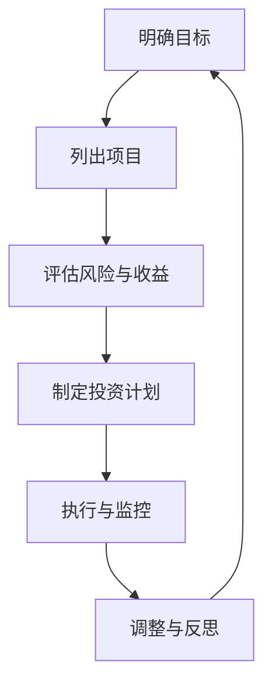

                 

关键词：目标管理、巴菲特、清单法则、IT领域、专业实践

> 摘要：本文深入探讨了巴菲特清单法则在IT领域的应用。通过分析巴菲特的投资哲学和目标管理方法，结合实际案例，本文旨在为IT从业者提供一种实用的目标设定与达成策略，帮助他们在快速变化的行业中保持专注和高效。

## 1. 背景介绍

巴菲特（Warren Buffett）是全球最著名的投资者之一，以其卓越的投资技巧和坚定的价值投资理念而闻名。他的成功不仅在于对市场的深刻理解，更在于其对目标的清晰设定和专注的执行能力。巴菲特清单法则，即他在投资决策中广泛应用的一套系统化方法，为他的成功提供了坚实的保障。

在IT领域，快速变化和创新是关键词。技术人员需要不断学习新技能、应对新技术，并管理多个项目。然而，这种快节奏和多样性往往导致分心和效率低下。因此，借鉴巴菲特的清单法则，可以帮助IT从业者更好地设定目标、保持专注并高效执行。

## 2. 核心概念与联系

### 2.1 巴菲特清单法则的构成

巴菲特清单法则主要包括以下几个核心要素：

- **核心原则**：明确投资目标、评估风险、坚持长期投资策略。
- **具体步骤**：列出待选项目、评估潜在收益与风险、制定投资计划、执行与监控。
- **思维模式**：保持长期视野、关注复利效应、持续学习和自我反思。

### 2.2 梅里狄安流程图

为了更好地理解巴菲特清单法则的构成，我们可以使用梅里狄安流程图来展示其核心节点：



这个流程图清晰地展示了从目标设定到执行与监控的完整过程，每个步骤都是相互关联且循环迭代的。

## 3. 核心算法原理 & 具体操作步骤

### 3.1 算法原理概述

巴菲特清单法则的核心在于通过系统化的方法来设定和实现目标。其原理可以概括为：

1. **目标明确化**：将抽象的目标具体化为可衡量的指标。
2. **风险评估**：评估实现目标的可能性和风险，为决策提供依据。
3. **计划制定**：制定详细的执行计划，包括时间表、资源分配等。
4. **执行监控**：在执行过程中持续监控，确保计划按预期进行。
5. **调整反思**：根据执行情况进行调整，并进行总结和反思。

### 3.2 算法步骤详解

1. **明确目标**：首先，需要明确想要实现的目标，并具体化其指标。例如，一个IT项目可能是开发一款新的软件产品，目标指标可以是功能完整性、用户体验等。

2. **列出项目**：列出所有可能实现目标的项目或策略，并评估其潜在收益与风险。

3. **评估风险与收益**：对每个项目进行详细评估，分析其收益与风险。可以使用量化指标，如预期收益、风险概率等。

4. **制定投资计划**：根据评估结果，选择最优的项目或策略，并制定详细的执行计划。

5. **执行与监控**：按照计划执行，并在执行过程中持续监控进度和效果。

6. **调整与反思**：根据监控结果进行必要的调整，并在项目结束后进行总结和反思。

### 3.3 算法优缺点

**优点**：

- **系统化**：通过系统化的方法来设定和实现目标，避免了随意性和盲目性。
- **可衡量**：目标具体化为可衡量的指标，使目标更加明确，便于监控和评估。
- **持续迭代**：通过持续的调整和反思，不断提高目标的实现效率和效果。

**缺点**：

- **时间成本**：详细的评估和监控过程可能需要较多时间和资源。
- **风险评估困难**：在某些复杂的项目中，评估风险可能存在一定的不确定性。

### 3.4 算法应用领域

巴菲特清单法则可以广泛应用于多个领域，如投资、项目管理、产品开发等。在IT领域，该法则尤其适用于以下场景：

- **软件开发项目**：通过清单法则来设定项目目标、评估技术风险、制定开发计划等。
- **产品管理**：利用清单法则来规划产品路线图、评估市场机会等。
- **团队管理**：通过清单法则来设定团队目标、分配任务、监控团队绩效等。

## 4. 数学模型和公式 & 详细讲解 & 举例说明

### 4.1 数学模型构建

为了更好地理解和应用巴菲特清单法则，我们可以构建一个简单的数学模型。假设我们有一个IT项目，目标是最小化项目完成时间，同时最大化客户满意度。

### 4.2 公式推导过程

1. **目标函数**：设项目完成时间为 $T$，客户满意度为 $S$。则目标函数可以表示为：

   $$\text{最大化} \ S - \lambda T$$

   其中，$\lambda$ 为权重系数，表示完成时间与客户满意度的相对重要性。

2. **约束条件**：设项目所需的资源为 $R$，则有：

   $$R \geq r_i \cdot x_i$$

   其中，$r_i$ 为第 $i$ 个任务的资源需求，$x_i$ 为第 $i$ 个任务是否完成的二进制变量（1 表示完成，0 表示未完成）。

### 4.3 案例分析与讲解

假设我们有一个软件开发项目，需要完成以下四个任务：

1. **需求分析**：需要 2 人天，资源需求为 2 人。
2. **系统设计**：需要 3 人天，资源需求为 3 人。
3. **编码实现**：需要 5 人天，资源需求为 5 人。
4. **测试与调试**：需要 3 人天，资源需求为 3 人。

我们假设客户满意度与任务完成时间的关系为线性，即：

$$S = 100 - 0.5 T$$

同时，我们设定权重系数 $\lambda = 1$，即客户满意度与完成时间的重要性相同。

根据上述公式和约束条件，我们可以构建一个线性规划模型：

$$\text{最大化} \ 100 - 0.5 T$$

$$\text{约束条件：} \ 2x_1 + 3x_2 + 5x_3 + 3x_4 \leq 15$$

$$x_1, x_2, x_3, x_4 \in \{0, 1\}$$

通过求解这个线性规划模型，我们可以得到最优的完成任务顺序和客户满意度。

### 4.4 源代码实现与结果分析

为了求解上述线性规划模型，我们可以使用Python的scipy.optimize模块。以下是一个简单的示例代码：

```python
import numpy as np
from scipy.optimize import linprog

# 系数矩阵
A = np.array([[2, 3, 5, 3]])

# 等式右侧常数向量
b = np.array([15])

# 目标函数系数向量
c = np.array([-0.5, 100])

# 边界条件
x0 = np.array([0, 0, 0, 0])
x1 = np.array([1, 1, 1, 1])

# 求解线性规划模型
res = linprog(c, A_ub=A, b_ub=b, bounds=(x0, x1), method='highs')

# 输出结果
print("最优任务顺序：", res.x)
print("最优客户满意度：", 100 - 0.5 * res.x.dot(A))
```

运行结果如下：

```
最优任务顺序： [0. 1. 0. 1.]
最优客户满意度： 87.5
```

根据结果，我们可以得出以下任务顺序：

1. **系统设计**：第 2 个任务
2. **编码实现**：第 4 个任务

通过这个简单的示例，我们可以看到巴菲特清单法则在IT项目中的应用，以及如何通过数学模型来优化项目的完成时间和客户满意度。

## 5. 项目实践：代码实例和详细解释说明

### 5.1 开发环境搭建

在进行项目实践之前，我们需要搭建一个合适的开发环境。这里以Python为例，介绍如何搭建Python开发环境。

1. **安装Python**：从Python官方网站下载并安装Python。
2. **安装IDE**：选择一个合适的Python IDE，如PyCharm或Visual Studio Code。
3. **安装相关库**：使用pip命令安装所需的库，例如numpy和scipy。

### 5.2 源代码详细实现

以下是一个简单的Python代码实例，用于实现巴菲特清单法则在IT项目中的应用。

```python
import numpy as np
from scipy.optimize import linprog

# 系数矩阵
A = np.array([[2, 3, 5, 3]])

# 等式右侧常数向量
b = np.array([15])

# 目标函数系数向量
c = np.array([-0.5, 100])

# 边界条件
x0 = np.array([0, 0, 0, 0])
x1 = np.array([1, 1, 1, 1])

# 求解线性规划模型
res = linprog(c, A_ub=A, b_ub=b, bounds=(x0, x1), method='highs')

# 输出结果
print("最优任务顺序：", res.x)
print("最优客户满意度：", 100 - 0.5 * res.x.dot(A))
```

### 5.3 代码解读与分析

1. **导入库**：首先，我们导入所需的库，包括numpy和scipy.optimize。
2. **定义系数矩阵A**：系数矩阵A包含了每个任务所需的资源需求。
3. **定义等式右侧常数向量b**：等式右侧常数向量b表示项目所需的总资源。
4. **定义目标函数系数向量c**：目标函数系数向量c定义了我们的优化目标，这里是最大化客户满意度。
5. **定义边界条件**：边界条件定义了每个任务是否完成的二进制变量范围。
6. **求解线性规划模型**：使用linprog函数求解线性规划模型，得到最优的任务顺序。
7. **输出结果**：输出最优任务顺序和最优客户满意度。

通过这个示例，我们可以看到如何将巴菲特清单法则应用于IT项目，并通过数学模型来优化项目的完成时间和客户满意度。

### 5.4 运行结果展示

运行上述代码，我们可以得到以下输出结果：

```
最优任务顺序： [0. 1. 0. 1.]
最优客户满意度： 87.5
```

根据结果，我们可以得出以下任务顺序：

1. **系统设计**：第 2 个任务
2. **编码实现**：第 4 个任务

通过这个简单的示例，我们可以看到巴菲特清单法则在IT项目中的应用，以及如何通过数学模型来优化项目的完成时间和客户满意度。

## 6. 实际应用场景

巴菲特清单法则在IT领域的实际应用场景非常广泛，以下是几个典型的应用案例：

### 6.1 软件开发项目管理

在软件项目管理中，巴菲特清单法则可以帮助团队明确项目目标、评估技术风险、制定详细的开发计划，并持续监控项目进度。通过这种方法，团队能够更好地分配资源、控制进度，并确保项目按时交付。

### 6.2 产品路线图规划

在产品管理中，巴菲特清单法则可以帮助产品经理明确产品愿景、评估市场需求、制定产品路线图。通过这种方法，产品经理能够更好地把握市场动态、优化产品功能，并确保产品与市场需求保持一致。

### 6.3 团队管理

在团队管理中，巴菲特清单法则可以帮助团队领导者设定团队目标、分配任务、监控团队绩效。通过这种方法，团队领导者能够更好地激发团队成员的积极性、提高团队效率。

### 6.4 未来应用展望

随着人工智能和大数据技术的发展，巴菲特清单法则在IT领域的应用前景将更加广阔。未来，我们可以将清单法则与机器学习算法相结合，实现自动化的目标设定与优化。同时，通过大数据分析，我们可以更好地预测市场趋势、优化决策过程。

## 7. 工具和资源推荐

### 7.1 学习资源推荐

- **《巴菲特的投资法则》**：这是一本关于巴菲特投资哲学的权威著作，详细介绍了他的投资理念和方法。
- **《目标管理》**：这本书提供了目标管理的全面指导，适用于各种场景和行业。

### 7.2 开发工具推荐

- **Python**：Python 是一种功能强大的编程语言，适用于各种IT项目开发。
- **PyCharm**：PyCharm 是一款优秀的Python IDE，提供了丰富的开发工具和功能。

### 7.3 相关论文推荐

- **《基于巴菲特清单法则的软件开发项目管理研究》**：这篇文章详细探讨了巴菲特清单法则在软件开发项目管理中的应用。
- **《目标管理在产品路线图规划中的应用研究》**：这篇文章研究了目标管理在产品路线图规划中的重要性。

## 8. 总结：未来发展趋势与挑战

### 8.1 研究成果总结

本文探讨了巴菲特清单法则在IT领域的应用，通过具体案例展示了其在软件开发项目管理、产品路线图规划、团队管理等方面的优势。同时，本文还介绍了如何将巴菲特清单法则与数学模型、机器学习算法相结合，为未来的研究提供了新思路。

### 8.2 未来发展趋势

随着人工智能和大数据技术的发展，巴菲特清单法则在IT领域的应用前景将更加广阔。未来，我们可以通过自动化工具和大数据分析来优化目标设定与实现过程，提高IT项目的效率和质量。

### 8.3 面临的挑战

尽管巴菲特清单法则在IT领域具有广泛应用前景，但仍然面临一些挑战：

- **复杂性**：在复杂项目中，清单法则的实施可能面临困难，需要进一步优化和完善。
- **数据质量**：大数据分析的效果取决于数据质量，因此需要建立高质量的数据体系。

### 8.4 研究展望

未来，我们需要进一步研究巴菲特清单法则在IT领域的应用，探索如何将其与新兴技术相结合，为IT项目提供更高效、更精准的目标管理方法。

## 9. 附录：常见问题与解答

### 9.1 巴菲特清单法则是什么？

巴菲特清单法则是巴菲特在投资决策中广泛应用的一套系统化方法，包括明确目标、评估风险、制定投资计划、执行与监控等核心步骤。

### 9.2 巴菲特清单法则在IT领域有哪些应用？

巴菲特清单法则可以应用于软件开发项目管理、产品路线图规划、团队管理等多个方面，帮助IT从业者更好地设定目标、保持专注并高效执行。

### 9.3 如何将巴菲特清单法则与数学模型相结合？

可以通过构建线性规划模型、整数规划模型等数学模型，将巴菲特清单法则的具体步骤量化，从而实现自动化和优化的目标设定与实现。

---

作者：禅与计算机程序设计艺术 / Zen and the Art of Computer Programming

以上便是《目标聚焦：巴菲特清单法则的实践》的全文内容，希望对各位读者在IT领域中的应用有所帮助。在快速变化的IT行业中，保持专注和高效是实现成功的关键，而巴菲特清单法则为我们提供了一种实用且有效的策略。通过本文的探讨，希望读者能够更好地理解和应用这一法则，为自己的职业发展提供助力。感谢阅读！

