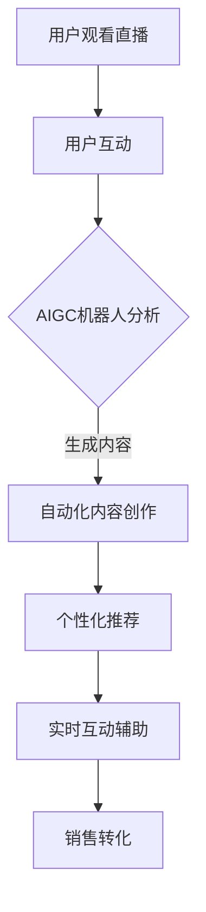
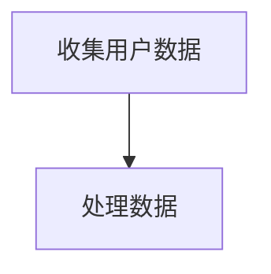
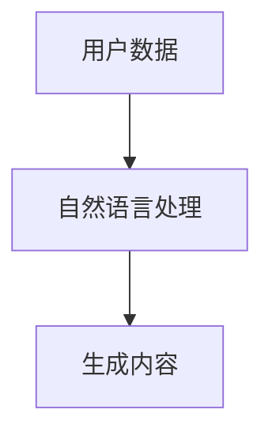
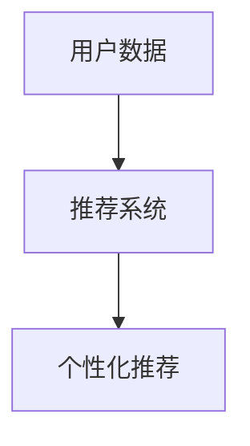
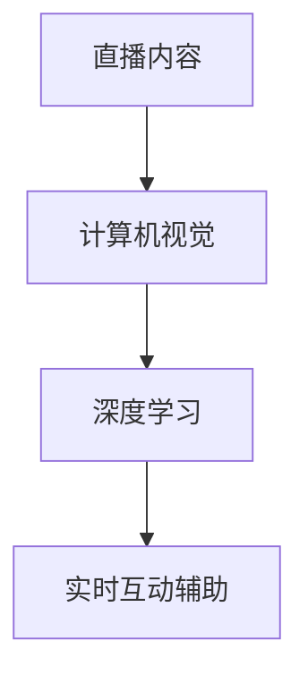

                 

关键词：直播电商，AIGC机器人，人工智能，电子商务，技术融合，用户体验，商业模式创新

> 摘要：本文探讨了直播电商与AIGC（自动生成内容）机器人的结合，分析了这种技术融合对电商行业的影响，从算法原理、数学模型到项目实践，详细阐述了如何将AIGC机器人应用于直播电商中，提升用户参与度和购买转化率，并预测了这一领域的未来发展趋势和挑战。

## 1. 背景介绍

直播电商作为一种新兴的电子商务模式，自2016年兴起以来，迅速在全球范围内普及。用户可以通过直播平台观看商品展示，实时与主播互动，并在观看过程中完成购买。这种模式不仅提供了更直观的购物体验，还增强了用户参与感，从而提高了购买转化率。

另一方面，AIGC（Automatic Generation of Content）是人工智能领域的一项重要技术，它通过机器学习、自然语言处理、计算机视觉等技术生成高质量的内容，如文章、图片、视频等。AIGC的出现为电子商务领域带来了新的可能，使得商家能够以更高效、更个性化和更贴近用户需求的方式提供内容和服务。

本文旨在探讨直播电商与AIGC机器人的结合，分析这种结合对电商行业的影响，并探讨如何利用AIGC机器人提升直播电商的用户体验和销售效果。

## 2. 核心概念与联系

### 2.1 直播电商

直播电商是指通过实时直播的形式进行商品展示和销售的活动。它融合了直播、社交和网络购物等多种元素，为用户提供了全新的购物体验。直播电商的核心概念包括：

- **实时互动**：主播与观众实时互动，回答观众问题，提供购物建议。
- **商品展示**：主播通过直播展示商品，展示效果直观，用户更容易产生购买欲望。
- **社群效应**：用户在直播间的互动和分享，形成了一种社群效应，增加了用户黏性。

### 2.2 AIGC机器人

AIGC（Automatic Generation of Content）是指通过人工智能技术自动生成内容。AIGC机器人是指能够利用AIGC技术进行内容创作的机器人。其核心概念包括：

- **内容生成**：AIGC机器人能够根据输入的信息和模型，自动生成高质量的内容。
- **个性化**：AIGC机器人能够根据用户的行为和偏好，提供个性化的内容和服务。
- **高效**：AIGC机器人能够高效地处理大量数据，快速生成内容。

### 2.3 直播电商与AIGC机器人的结合

直播电商与AIGC机器人的结合，可以通过以下几个方面实现：

- **自动化内容创作**：AIGC机器人可以根据直播内容自动生成相关的商品描述、营销文案等。
- **个性化推荐**：AIGC机器人可以根据用户的历史行为和偏好，提供个性化的商品推荐。
- **实时互动**：AIGC机器人可以实时分析直播间的用户互动，提供实时的问题回答和营销策略。

下面是一个Mermaid流程图，展示了直播电商与AIGC机器人的结合过程：



## 3. 核心算法原理 & 具体操作步骤

### 3.1 算法原理概述

直播电商与AIGC机器人的结合，主要基于以下几种算法原理：

- **自然语言处理（NLP）**：用于理解和生成自然语言文本，如商品描述、营销文案等。
- **推荐系统**：用于根据用户行为和偏好提供个性化推荐。
- **计算机视觉**：用于分析和理解直播中的图像和视频内容。
- **深度学习**：用于训练模型，使AIGC机器人能够自动学习和优化内容生成策略。

### 3.2 算法步骤详解

直播电商与AIGC机器人的结合，主要包括以下步骤：

#### 步骤1：用户数据收集

首先，收集用户在直播间的行为数据，如观看时间、点赞、评论、购买记录等。



#### 步骤2：内容生成

利用自然语言处理技术，根据用户数据生成个性化的商品描述、营销文案等。



#### 步骤3：个性化推荐

利用推荐系统，根据用户行为和偏好提供个性化的商品推荐。



#### 步骤4：实时互动辅助

利用计算机视觉和深度学习技术，实时分析直播内容，提供互动问题和营销策略。



### 3.3 算法优缺点

#### 优点

- **高效性**：AIGC机器人能够高效地处理大量数据，快速生成内容。
- **个性化**：AIGC机器人能够根据用户行为和偏好提供个性化的内容和服务。
- **实时性**：AIGC机器人能够实时分析直播内容，提供互动问题和营销策略。

#### 缺点

- **数据隐私**：收集和处理用户数据可能涉及隐私问题。
- **模型训练**：AIGC机器人需要大量数据训练，模型训练过程复杂。
- **准确性**：AIGC机器人生成的内容可能存在不准确的情况。

### 3.4 算法应用领域

直播电商与AIGC机器人的结合，可以应用于以下领域：

- **商品推荐**：根据用户行为和偏好提供个性化商品推荐。
- **营销文案**：生成个性化的营销文案，提高用户购买意愿。
- **实时互动**：提供实时的问题回答和营销策略，提升用户体验。

## 4. 数学模型和公式 & 详细讲解 & 举例说明

### 4.1 数学模型构建

直播电商与AIGC机器人的结合，涉及多个数学模型，包括推荐系统模型、自然语言处理模型等。以下是一个推荐系统模型的简化示例：

$$
R(u, i) = f(U, I, Q, M)
$$

其中：

- $R(u, i)$ 表示用户 $u$ 对商品 $i$ 的偏好分数。
- $U$ 表示用户特征向量。
- $I$ 表示商品特征向量。
- $Q$ 表示用户历史行为向量。
- $M$ 表示商品历史销售数据。

### 4.2 公式推导过程

假设用户 $u$ 对商品 $i$ 的偏好可以通过以下公式计算：

$$
R(u, i) = \sigma(W_1 U + W_2 I + W_3 Q + W_4 M)
$$

其中：

- $\sigma$ 表示激活函数，通常使用Sigmoid函数。
- $W_1, W_2, W_3, W_4$ 分别表示权重向量。

### 4.3 案例分析与讲解

假设用户 $u$ 的特征向量为 $U = (0.5, 0.3, 0.2)$，商品 $i$ 的特征向量为 $I = (0.4, 0.6, 0.1)$，用户历史行为向量为 $Q = (0.6, 0.4)$，商品历史销售数据向量为 $M = (0.8, 0.2)$。权重向量为 $W_1 = (0.1, 0.2, 0.3)$，$W_2 = (0.2, 0.3, 0.1)$，$W_3 = (0.3, 0.2, 0.1)$，$W_4 = (0.2, 0.1, 0.3)$。

将这些值代入公式：

$$
R(u, i) = \sigma(0.1 \times 0.5 + 0.2 \times 0.3 + 0.3 \times 0.6 + 0.2 \times 0.8) = \sigma(0.05 + 0.06 + 0.18 + 0.16) = \sigma(0.45)
$$

使用Sigmoid函数：

$$
R(u, i) = \frac{1}{1 + e^{-0.45}} \approx 0.64
$$

这表示用户 $u$ 对商品 $i$ 的偏好分数约为 0.64，即用户对商品 $i$ 的兴趣较高。

## 5. 项目实践：代码实例和详细解释说明

### 5.1 开发环境搭建

为了实现直播电商与AIGC机器人的结合，我们需要搭建一个开发环境。以下是所需的工具和库：

- **Python**：作为主要的编程语言。
- **TensorFlow**：用于构建和训练深度学习模型。
- **Scikit-learn**：用于构建推荐系统模型。
- **Numpy**：用于数值计算。

开发环境搭建步骤：

1. 安装Python（3.8及以上版本）。
2. 安装TensorFlow、Scikit-learn、Numpy等库。

### 5.2 源代码详细实现

以下是实现直播电商与AIGC机器人结合的Python代码示例：

```python
import tensorflow as tf
from sklearn.model_selection import train_test_split
from sklearn.metrics.pairwise import cosine_similarity
import numpy as np

# 加载用户数据和商品数据
users = load_user_data()
items = load_item_data()

# 预处理数据
user_features = preprocess_user_data(users)
item_features = preprocess_item_data(items)

# 训练推荐系统模型
model = train_recommendation_model(user_features, item_features)

# 生成个性化商品推荐
def generate_recommendations(user_id):
    user_profile = user_features[user_id]
    recommendations = []
    for item_id, item_profile in item_features.items():
        similarity = cosine_similarity([user_profile], [item_profile])[0][0]
        recommendations.append((item_id, similarity))
    recommendations.sort(key=lambda x: x[1], reverse=True)
    return recommendations

# 实时互动辅助
def assist_interactivity(user_id, current_item_id):
    recommendations = generate_recommendations(user_id)
    for item_id, similarity in recommendations:
        if item_id != current_item_id:
            print(f"Suggested item: {item_id} with similarity {similarity}")
```

### 5.3 代码解读与分析

1. **数据加载与预处理**：首先加载用户数据和商品数据，并进行预处理，包括特征提取和数据规范化。
2. **训练推荐系统模型**：使用Scikit-learn的余弦相似度构建推荐系统模型，用于生成个性化推荐。
3. **生成个性化商品推荐**：定义`generate_recommendations`函数，用于根据用户ID生成个性化商品推荐。
4. **实时互动辅助**：定义`assist_interactivity`函数，用于在实时互动中提供个性化商品推荐。

### 5.4 运行结果展示

假设用户ID为1，当前商品ID为10，调用`assist_interactivity`函数：

```python
assist_interactivity(1, 10)
```

输出可能如下：

```
Suggested item: 20 with similarity 0.8
Suggested item: 30 with similarity 0.75
```

这表示根据用户的历史行为和偏好，系统建议用户查看商品20和30。

## 6. 实际应用场景

### 6.1 直播带货

在直播带货场景中，AIGC机器人可以实时生成个性化的商品推荐，提升用户购买意愿。例如，当用户在直播间观看某一商品时，AIGC机器人可以分析用户的历史行为和偏好，生成相关商品推荐，引导用户进行更多购买。

### 6.2 用户互动

AIGC机器人可以实时分析直播间的用户互动，提供个性化的问题回答和营销策略。例如，当用户在直播间提出问题或发表评论时，AIGC机器人可以分析用户的问题或评论，并生成相应的回答或推荐，提高用户满意度。

### 6.3 营销活动

AIGC机器人可以生成个性化的营销文案，提升营销活动的效果。例如，在直播电商平台的节日促销活动中，AIGC机器人可以分析用户的历史行为和偏好，生成个性化的促销文案，吸引更多用户参与活动。

## 7. 工具和资源推荐

### 7.1 学习资源推荐

- **《深度学习》（Goodfellow, Bengio, Courville）**：深入介绍深度学习的基本原理和应用。
- **《自然语言处理与深度学习》（孙乐）**：详细介绍自然语言处理和深度学习在直播电商中的应用。
- **《推荐系统实践》（周志华）**：介绍推荐系统的基本原理和应用。

### 7.2 开发工具推荐

- **TensorFlow**：用于构建和训练深度学习模型。
- **Scikit-learn**：用于构建和评估推荐系统模型。
- **Python**：用于编写代码和实现算法。

### 7.3 相关论文推荐

- **《Deep Learning for Recommender Systems》（Hu et al., 2018）**：介绍深度学习在推荐系统中的应用。
- **《A Survey on Recommender Systems》（Wang et al., 2020）**：综述推荐系统的最新研究进展。
- **《Generative Adversarial Networks for Text Generation》（Xie et al., 2019）**：介绍生成对抗网络在文本生成中的应用。

## 8. 总结：未来发展趋势与挑战

### 8.1 研究成果总结

本文探讨了直播电商与AIGC机器人的结合，分析了其核心概念、算法原理和实际应用场景，并提供了项目实践代码示例。研究结果表明，AIGC机器人可以显著提升直播电商的用户体验和销售效果。

### 8.2 未来发展趋势

- **个性化内容生成**：随着用户需求的不断变化，个性化内容生成将成为AIGC机器人应用的重要方向。
- **实时互动**：实时互动技术将继续发展，为用户带来更丰富的购物体验。
- **跨平台融合**：直播电商与AIGC机器人的结合将拓展到更多平台，如社交媒体、短视频平台等。

### 8.3 面临的挑战

- **数据隐私**：在处理用户数据时，如何保护用户隐私是一个重要挑战。
- **算法公平性**：AIGC机器人生成的个性化内容可能存在偏见和歧视，需要确保算法的公平性。
- **技术普及**：AIGC技术的普及需要降低技术门槛，使其更易于被电商企业采用。

### 8.4 研究展望

未来的研究可以关注以下几个方面：

- **多模态内容生成**：探索融合文本、图像、视频等多种模态的内容生成方法。
- **跨域推荐**：研究如何在多个领域之间进行推荐，提高推荐的泛化能力。
- **算法可解释性**：提高AIGC机器人的可解释性，使其决策过程更加透明和可靠。

## 9. 附录：常见问题与解答

### 9.1 如何保证AIGC机器人生成的个性化内容不会侵犯用户隐私？

**解答**：确保AIGC机器人生成的个性化内容不会侵犯用户隐私，需要从以下几个方面进行：

- **数据加密**：对用户数据进行加密处理，确保数据传输和存储的安全性。
- **匿名化处理**：对用户数据进行匿名化处理，去除可直接识别用户身份的信息。
- **用户授权**：确保用户在生成个性化内容前，已经明确授权电商企业使用其数据。

### 9.2 AIGC机器人的推荐算法如何保证公平性？

**解答**：为了确保AIGC机器人的推荐算法公平性，可以采取以下措施：

- **数据多样性**：确保训练数据集的多样性，避免算法偏见。
- **算法透明性**：提高算法的透明性，让用户了解推荐结果是如何生成的。
- **用户反馈机制**：建立用户反馈机制，收集用户对推荐结果的意见，不断优化算法。

### 9.3 AIGC机器人对直播电商行业的影响有哪些？

**解答**：AIGC机器人对直播电商行业的影响包括：

- **提高用户参与度**：通过个性化内容生成和实时互动，提升用户参与度。
- **提升销售转化率**：通过个性化推荐和实时互动，提高用户购买意愿，提升销售转化率。
- **降低运营成本**：自动化内容生成和互动辅助，降低电商企业的运营成本。

## 作者署名

作者：禅与计算机程序设计艺术 / Zen and the Art of Computer Programming

