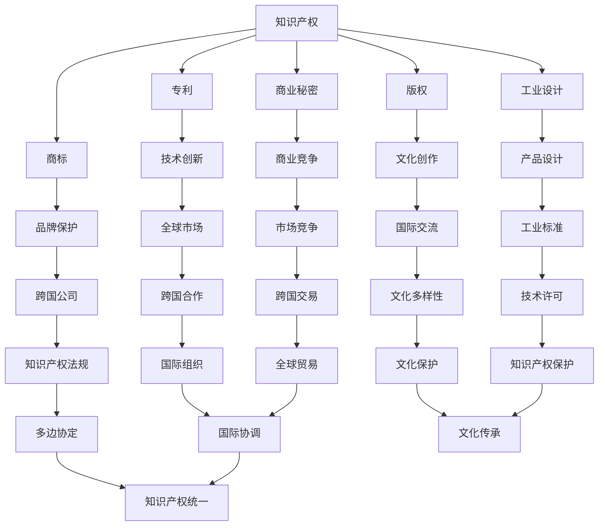

                 

## 摘要
本文旨在探讨知识产权（Intellectual Property, IP）与全球化之间的互动关系。知识产权作为创新和知识经济的基础，在全球化的浪潮中扮演着越来越重要的角色。本文将首先介绍知识产权的基本概念和类型，然后分析知识产权在全球贸易和投资中的作用，探讨全球化对知识产权法规的影响，以及知识产权保护对技术创新的推动作用。此外，本文还将分析全球化背景下知识产权面临的挑战，包括跨国界的版权争议、专利侵权、以及知识产权保护成本等问题。最后，本文将对未来知识产权保护的趋势进行展望，并提出相关的政策建议。

## 1. 背景介绍

在现代社会，知识经济成为驱动经济发展的核心力量，而知识产权作为保护创新成果的基石，其重要性日益凸显。知识产权的定义涵盖了专利、版权、商标、商业秘密等多种类型，它们在促进技术创新、文化创作和保护商业利益方面发挥着重要作用。

全球化是当今世界经济和社会发展的重要特征。全球化使得各国经济更加紧密地联系在一起，促进了贸易、资本流动和技术传播。随着全球化进程的加速，知识产权的跨国界保护变得更加复杂和重要。一方面，知识产权保护促进了技术创新和知识传播，有助于各国经济协同发展；另一方面，知识产权的跨国保护也面临着诸多挑战，如版权争议、专利侵权等问题。

本文将首先回顾知识产权的发展历程，阐述知识产权的基本概念和类型，然后分析知识产权在全球贸易和投资中的作用，探讨全球化对知识产权法规的影响，最后讨论知识产权保护对技术创新的推动作用以及全球化背景下知识产权面临的挑战。

## 2. 核心概念与联系

为了深入理解知识产权与全球化的互动关系，我们首先需要明确几个核心概念及其相互之间的联系。

### 2.1 知识产权的基本概念

知识产权（Intellectual Property, IP）是指由个人或集体创造的知识成果所享有的专有权利。根据世界知识产权组织（WIPO）的定义，知识产权包括专利、版权、商标、商业秘密、工业设计等。以下是这些主要类型的基本概念：

- **专利**：授予发明人在一定期限内对其发明享有的独占权利，包括发明专利、实用新型专利和外观设计专利。
- **版权**：涉及文学、艺术和科学作品的原创表达，包括文学、音乐、戏剧、电影、绘画等。
- **商标**：用于区分商品或服务的标识，如品牌名称、标志、口号等。
- **商业秘密**：涉及商业活动中不为公众所知悉的信息，如配方、工艺、客户名单等。
- **工业设计**：涉及对产品的形状、图案、色彩或其结合所做出的富有美感并适于工业应用的新设计。

### 2.2 知识产权与全球化的关系

知识产权与全球化之间的关系可以从多个维度来分析。首先，全球化为知识产权的跨国保护提供了新的挑战和机遇。随着全球化进程的加速，国际间的知识流动和技术传播变得更加频繁，这对知识产权的保护提出了更高的要求。跨国公司和国际组织需要建立更加有效的知识产权保护机制，以适应全球市场的需求。

其次，全球化促进了各国知识产权法规的协调与统一。国际社会通过签订多边协定和条约，如《伯尔尼公约》、《巴黎公约》、《专利合作条约》等，致力于消除国际贸易中的知识产权壁垒，推动知识产权的全球保护。这些协定和条约为知识产权的跨国申请和维权提供了法律依据。

最后，全球化对知识产权的影响还体现在技术标准的制定和文化产业的国际化。技术标准的制定往往涉及知识产权的许可和使用，这需要各国在知识产权政策上达成共识。文化产业的国际化则使得版权保护和跨国版权交易成为知识产权保护的重要内容。

### 2.3 Mermaid 流程图

为了更直观地展示知识产权与全球化的关系，我们使用 Mermaid 流程图来描述各个概念之间的相互联系。

通过这个 Mermaid 流程图，我们可以看到知识产权的各个类型是如何与技术创新、文化创作、市场竞争、国际交流和全球化相互联系的。这个过程不仅涉及到法律和技术的层面，还涉及到经济、文化和国际关系的多个维度。

### 2.4 知识产权在全球贸易和投资中的作用

知识产权在全球贸易和投资中发挥着至关重要的作用。它不仅为创新和知识成果提供了法律保障，也为国际贸易和投资提供了新的动力和机会。

首先，知识产权是国际贸易的重要基石。在国际贸易中，知识产权保护确保了创新成果的合法化和商业化，促进了技术转移和知识传播。知识产权制度通过专利、版权和商标等手段，为商品和服务提供了独占权，使得创新者能够在全球市场上获得经济利益，从而激励更多的研发投入和创新活动。

其次，知识产权是跨国投资的重要保障。在全球投资中，知识产权被视为重要的资产和资源，投资者通过购买、许可和转让知识产权来获取技术和市场优势。知识产权的高效保护为跨国投资者提供了信心和保障，使得投资决策更加稳健和可预测。此外，知识产权还可以作为抵押物，为投资融资提供支持，从而降低了投资风险。

最后，知识产权在国际投资中的重要性还体现在技术许可和跨国并购中。技术许可使得企业可以通过授权方式获取他人的知识产权，从而扩大产品线和市场范围。跨国并购中，知识产权的评估和转移成为交易的核心环节，知识产权的价值直接影响并购的成败和效益。

总之，知识产权在全球贸易和投资中的作用不仅体现在法律保护和经济激励上，还涉及到技术创新、市场拓展和国际合作的多个层面。随着全球化的深入发展，知识产权的作用将愈发凸显，成为推动全球经济和社会发展的重要动力。

### 2.5 全球化对知识产权法规的影响

全球化对知识产权法规产生了深远的影响，这种影响主要体现在立法、执法和国际协调等多个方面。

首先，全球化推动了知识产权立法的国际化。为了适应全球贸易和投资的多样化需求，各国纷纷修订和完善本国的知识产权法律体系，以更好地与国际标准接轨。例如，许多国家加入了《伯尔尼公约》和《巴黎公约》等国际条约，加强了版权和工业产权的保护。此外，一些区域性的贸易协定，如《北美自由贸易协定》（NAFTA）和《区域全面经济伙伴关系协定》（RCEP），也包含了对知识产权保护的条款，推动了各国知识产权法规的统一和协调。

其次，全球化对知识产权执法提出了新的挑战。跨国界的知识产权侵权行为日益增多，执法机关需要更高效、协调的执法手段来应对这些挑战。例如，一些国家建立了专门的知识产权法院或仲裁机构，以快速解决跨国知识产权纠纷。同时，各国执法机关之间的合作也日益密切，通过建立信息共享机制和联合执法行动，提高了知识产权保护的效率和效果。

最后，全球化促进了知识产权国际协调的深化。国际组织和多边机制在知识产权领域发挥着越来越重要的作用。例如，世界知识产权组织（WIPO）作为全球知识产权保护的主要国际机构，通过制定国际标准和提供技术支持，推动了全球知识产权保护的协调与统一。此外，各国政府、企业、学术界和民间组织也在通过国际合作，共同应对知识产权保护中的挑战和问题，促进全球知识产权体系的健康发展。

总之，全球化对知识产权法规的影响是全方位的，它不仅推动了知识产权立法和执法的国际化，也促进了国际协调与合作，为全球知识产权保护提供了更加完善的制度保障。随着全球化进程的加速，知识产权法规的影响将进一步扩大，对全球经济的发展产生深远影响。

### 2.6 知识产权保护对技术创新的推动作用

知识产权保护在技术创新中发挥着至关重要的作用，它不仅为创新者提供了法律保障，激励了更多的研发投入，还在市场机制、投资激励和技术转移等方面产生了深远影响。

首先，知识产权保护为创新者提供了明确的产权归属和独占权。创新成果，如发明、文学作品和设计，通过专利、版权和商标等知识产权形式得到法律保护，使得创新者能够在一定期限内独占其成果，享有商业利益。这种产权保障激励了创新者的研发投入，因为他们知道自己的创新成果不会被轻易抄袭或盗用，从而可以获得经济回报。

其次，知识产权保护促进了市场机制的完善。在知识产权保护的法律框架下，创新者能够通过许可和转让等方式，将知识产权转化为市场价值。这种市场机制的完善，使得创新成果能够更有效地进入市场，满足消费者的需求，同时也为投资者提供了明确的投资方向和预期回报，促进了资本向创新领域的流动。

第三，知识产权保护对投资激励有着重要作用。知识产权的高效保护为投资者提供了信心，使他们愿意将资金投入到高风险的创新项目中。知识产权可以作为一种特殊的资产，通过许可、转让或质押等方式进行融资，从而降低了投资风险。例如，专利可以作为抵押物为创新项目融资，使得创新者能够获得必要的资金支持，推动技术项目的实施和商业化的进程。

最后，知识产权保护促进了技术转移和知识传播。在全球化的背景下，知识产权的高效保护使得创新者能够跨越国界，将创新成果传播到全球市场。通过国际专利申请和跨国许可，技术转移变得更加顺畅和高效，促进了全球技术和知识的共享。这不仅有助于提高全球创新水平，也为各国经济的协同发展提供了动力。

总之，知识产权保护在技术创新中起到了关键性的推动作用。它不仅为创新者提供了法律保障和商业利益，还通过完善市场机制、激励投资和技术转移，促进了全球技术创新的持续发展。

### 2.7 全球化背景下知识产权面临的挑战

尽管知识产权在全球化背景下发挥了重要作用，但同时也面临着诸多挑战，这些挑战不仅影响了知识产权的有效保护，也对全球创新和经济发展产生了负面影响。

首先，跨国界的版权争议日益增多。随着数字技术的发展，作品传播的速度和范围大大增加，版权争议也随之增多。例如，音乐、电影、文学作品等数字内容的跨国传播引发了版权归属和利益分配的纠纷。这些问题不仅涉及个人创作者和版权所有者，还涉及平台和分销商，使得版权争议的解决变得更加复杂和耗时。

其次，专利侵权问题在全球化背景下尤为突出。跨国公司的竞争和合作使得专利侵权案件频繁发生。一些企业通过不正当手段获取他人的专利技术，甚至进行专利狙击，试图垄断市场。这不仅损害了原创者的利益，也扰乱了市场秩序，影响了技术创新的积极性。

第三，知识产权保护成本高昂。跨国知识产权保护需要支付高额的律师费、诉讼费和行政费用，对于中小企业和个体创新者来说，这种高成本往往成为他们无法承受的负担。此外，知识产权保护制度的不完善，如执法不力、法律漏洞等，也增加了知识产权保护的难度和成本。

最后，知识产权保护的地域差异和标准不一。全球各地的知识产权保护法律和实践存在较大差异，这给跨国知识产权保护带来了困扰。例如，一些国家对知识产权的保护力度较弱，使得跨国企业面临不公平竞争。此外，国际社会在知识产权保护标准上的协调也不尽完善，导致不同国家和地区的知识产权法律存在冲突和矛盾。

总之，全球化背景下知识产权面临的挑战是多方面的，这不仅需要各国政府加强知识产权保护的法律建设和执法力度，也需要国际社会在知识产权保护标准上达成更多共识，共同推动全球知识产权保护的健康发展。

### 2.8 未来知识产权保护的趋势与挑战

展望未来，知识产权保护将在全球范围内面临新的趋势与挑战。首先，技术创新的加速发展将继续推动知识产权保护的需求。人工智能、生物技术、区块链等新兴技术领域，知识产权保护的重要性日益凸显。这些领域的快速变革不仅要求知识产权制度与时俱进，还需要在法律和技术层面进行深入探索。

其次，全球知识产权保护标准将逐步趋同。随着国际贸易和投资合作的加深，各国在知识产权保护方面的协调和合作将更加紧密。国际组织和多边机制将在制定全球知识产权保护标准方面发挥更大的作用，有助于消除国际贸易中的知识产权壁垒，推动全球知识产权保护体系的统一和协调。

此外，数字版权保护将成为知识产权保护的重要内容。随着数字内容的迅速增长，版权保护面临着新的挑战，如数字盗版、内容分享等。为了应对这些挑战，将需要开发更加先进的数字版权保护技术和手段，如区块链、加密技术等，以保障数字内容的合法权益。

然而，未来知识产权保护也将面临诸多挑战。例如，技术创新的快速发展可能导致知识产权纠纷增多，特别是在涉及新兴技术领域时，法律解释和司法实践的滞后可能会增加保护难度。此外，全球知识产权保护的成本和复杂性将继续上升，对中小企业和个体创新者构成新的挑战。

为了应对这些趋势和挑战，各国政府和国际社会需要采取一系列政策措施。首先，加强知识产权法律建设和执法力度，提高知识产权保护的实际效果。其次，推动国际知识产权合作，通过多边机制和双边协定，加强知识产权保护标准的协调。此外，还需加大对新兴技术和数字版权保护的研究投入，开发更加高效和安全的保护技术。

总之，未来知识产权保护将在技术创新、全球化进程和数字时代的背景下不断发展，面临新的机遇和挑战。通过加强国际合作、完善法律体系和提升技术手段，知识产权保护将为全球创新和经济发展提供更加有力的支持。

### 2.9 工具和资源推荐

为了更好地理解和应用知识产权保护的知识，以下是一些学习资源、开发工具和相关论文的推荐。

#### 2.9.1 学习资源

1. **在线课程**：Coursera、edX 和 Udacity 等平台提供了多种知识产权相关的在线课程，涵盖基础理论和实际应用。
2. **官方资料**：世界知识产权组织（WIPO）的官方网站提供了丰富的知识产权法律法规、案例研究和最新动态。
3. **学术期刊**：阅读《知识产权法律评论》、《知识产权管理》等专业期刊，可以深入了解知识产权领域的最新研究进展。

#### 2.9.2 开发工具

1. **版权追踪工具**：如Copytrack、Rightfind等，可以帮助创作者监测和追踪作品的版权使用情况。
2. **专利检索工具**：如Google Patents、Patent Explorer 等，可以方便地进行专利检索和分析。
3. **数字版权保护工具**：如ContentGuard、Rightscorp 等，提供数字版权管理和保护解决方案。

#### 2.9.3 相关论文

1. **"The Economics of Intellectual Property Rights"** - 由著名经济学家Richard A. Posner撰写，探讨了知识产权的经济影响和效率问题。
2. **"Globalization and Intellectual Property: Challenges and Opportunities"** - 该论文分析了全球化对知识产权法规和国际协调的影响。
3. **"Blockchain and Intellectual Property: Opportunities and Challenges"** - 探讨了区块链技术在知识产权保护中的应用前景。

通过这些资源，读者可以更全面地了解知识产权保护的各个方面，从而在实际工作和研究中更好地应用相关知识和技能。

### 2.10 总结：未来发展趋势与挑战

本文从多个维度探讨了知识产权与全球化的互动关系，总结了知识产权在全球贸易和投资中的重要作用，分析了全球化对知识产权法规的影响，并阐述了知识产权保护对技术创新的推动作用。同时，我们也指出了全球化背景下知识产权面临的挑战，如跨国界的版权争议、专利侵权以及知识产权保护成本等问题。

展望未来，知识产权保护将在技术创新、全球化进程和数字时代的背景下继续发展。随着新兴技术的不断涌现，知识产权保护的需求将更加多样化和复杂化。为了应对这些挑战，各国政府和国际社会需要加强知识产权法律建设和执法力度，推动国际知识产权合作，制定统一的标准，提升数字版权保护技术。

在未来的发展中，知识产权保护不仅需要法律和技术手段的创新，还需要各方的共同努力和合作。通过构建更加完善和高效的知识产权保护体系，我们有望促进全球创新和经济的可持续发展，为人类社会的进步做出更大贡献。

### 2.11 附录：常见问题与解答

**Q1：什么是知识产权？它主要包括哪些类型？**
A1：知识产权是指由个人或集体创造的知识成果所享有的专有权利，主要包括专利、版权、商标、商业秘密、工业设计等。

**Q2：知识产权在全球贸易和投资中扮演什么角色？**
A2：知识产权在全球贸易和投资中扮演关键角色，它保护创新成果，激励研发投入，促进技术转移和知识传播，同时也是跨国投资和并购中的重要资产和资源。

**Q3：全球化对知识产权法规有什么影响？**
A3：全球化推动了知识产权立法的国际化，促进了各国知识产权法规的协调与统一。国际组织和多边机制在知识产权领域发挥着越来越重要的作用，推动了全球知识产权保护的协调与统一。

**Q4：知识产权保护如何推动技术创新？**
A4：知识产权保护为创新者提供了明确的产权归属和独占权，激励了更多的研发投入。此外，它通过完善市场机制、激励投资和技术转移，促进了全球技术创新的持续发展。

**Q5：全球化背景下知识产权面临哪些挑战？**
A5：全球化背景下，知识产权面临的挑战包括跨国界的版权争议、专利侵权、知识产权保护成本高昂以及知识产权保护的地域差异和标准不一等。

**Q6：未来知识产权保护的发展趋势是什么？**
A6：未来知识产权保护的发展趋势包括技术创新的加速发展、全球知识产权保护标准的逐步趋同、数字版权保护技术的进步，以及国际合作的深化。同时，新兴技术和数字时代的到来也将带来新的挑战和机遇。

### 结语

本文通过系统分析和深入探讨，全面阐述了知识产权与全球化的互动关系。从知识产权的基本概念到其在全球贸易和投资中的作用，再到全球化对知识产权法规的影响，以及知识产权保护对技术创新的推动作用，我们都进行了详细的论述。同时，我们也指出了全球化背景下知识产权面临的挑战，并对未来知识产权保护的发展趋势进行了展望。

知识产权作为现代社会创新和知识经济的重要保障，其重要性不容忽视。在全球化的背景下，加强知识产权的保护不仅有助于促进技术创新和经济发展，还能推动全球知识产权保护体系的健康发展。未来，随着新兴技术和数字时代的到来，知识产权保护将在全球范围内迎来新的机遇和挑战。我们期待通过各方的共同努力，构建一个更加公平、高效和可持续的知识产权保护体系，为全球创新和经济的可持续发展贡献力量。

作者：禅与计算机程序设计艺术 / Zen and the Art of Computer Programming

