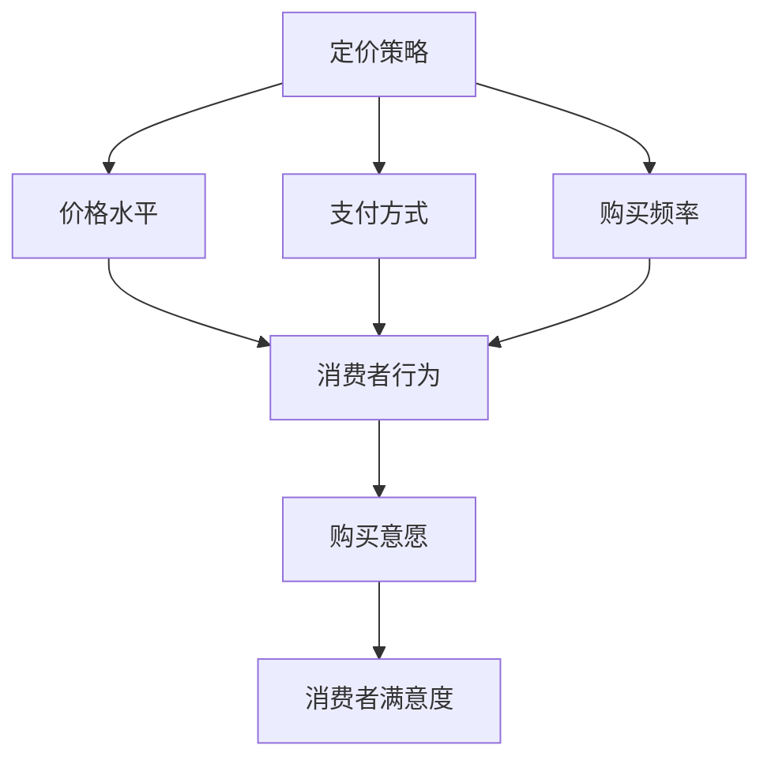

                 

 **关键词**：知识付费、定价策略、消费者行为、心理学、决策模型

> **摘要**：本文将深入探讨知识付费产品的定价策略，结合心理学理论和实际案例，分析消费者行为和定价决策之间的关系，为知识付费产品提供科学的定价建议。

## 1. 背景介绍

随着互联网和信息技术的快速发展，知识付费作为一种新兴的商业模式，正在逐步改变人们的消费习惯和商业模式。知识付费产品涵盖了在线课程、电子书、专业咨询、研究报告等多种形式，为用户提供了丰富多样的知识获取途径。然而，面对激烈的市场竞争和多元化的消费者需求，如何科学、合理地制定知识付费产品的定价策略，成为企业和从业者亟待解决的问题。

本文旨在通过心理学理论与实际案例分析，探讨知识付费产品的定价策略，帮助从业者和企业家更好地理解和把握消费者的心理，制定有效的定价策略，提高产品竞争力。

### 1.1 知识付费市场的发展现状

知识付费市场近年来呈现出快速增长的态势。根据艾瑞咨询的报告，2020年中国知识付费市场规模达到2483亿元，同比增长31.6%。这一数字在未来几年有望继续保持高速增长。知识付费市场的快速发展，得益于以下几个因素：

1. **消费升级**：随着居民收入水平的提高和消费观念的更新，人们对知识和技能的需求逐渐增强，愿意为优质的知识产品支付更高的价格。
2. **技术进步**：互联网和移动互联网的普及，为知识付费提供了便捷的传播和交易渠道，使得知识产品可以更高效地触达到目标用户。
3. **内容多样化**：知识付费产品种类日益丰富，从最初的教育培训扩展到职业发展、兴趣爱好、健康生活等多个领域，满足了消费者的多样化需求。

### 1.2 心理学在定价策略中的应用

心理学研究消费者行为和决策，为知识付费产品的定价提供了理论基础。通过心理学视角，我们可以更好地理解消费者在购买知识产品时的心理动机和决策过程，从而制定出更科学的定价策略。心理学在定价策略中的应用主要包括以下几个方面：

1. **需求识别**：通过心理学的需求理论，分析消费者对知识产品的需求程度和需求类型，为定价提供依据。
2. **感知价值**：利用心理学的价值理论，评估消费者对知识产品的感知价值，从而确定合理的价格水平。
3. **认知偏差**：研究消费者在决策过程中可能出现的认知偏差，如锚定效应、从众效应等，避免定价策略受到这些偏差的影响。

## 2. 核心概念与联系

### 2.1 定价策略的概念

定价策略是指企业在特定市场环境中，根据产品成本、市场需求、竞争状况等因素，制定出合理的价格水平，以实现产品销售和利润最大化目标的过程。知识付费产品的定价策略，主要包括成本导向、市场导向和竞争导向三种类型。

1. **成本导向定价**：以产品成本为基础，加上一定的利润率，确定产品的价格。这种定价策略简单易行，适用于成本结构稳定的产品。
2. **市场导向定价**：根据市场需求和消费者支付意愿，确定产品的价格。这种定价策略能够更好地满足消费者需求，提高产品竞争力。
3. **竞争导向定价**：以竞争对手的产品价格为基础，结合自身产品特点和优势，确定产品的价格。这种定价策略适用于市场竞争激烈的情况。

### 2.2 消费者行为的概念

消费者行为是指消费者在购买、使用和评价知识产品过程中的心理活动和行为表现。消费者行为受到多种因素的影响，包括个人需求、心理状态、社会文化、经济环境等。在知识付费产品的定价策略中，理解消费者行为有助于制定出更符合市场需求的定价策略。

### 2.3 定价策略与消费者行为的联系

定价策略与消费者行为之间存在密切的联系。一方面，定价策略影响消费者行为，如价格水平、支付方式、购买频率等。另一方面，消费者行为又对定价策略产生影响，如消费者对价格的敏感程度、购买意愿等。因此，在制定知识付费产品的定价策略时，需要综合考虑消费者行为的特点和变化，以提高定价策略的有效性。

### 2.4 Mermaid 流程图

下面是一个简单的 Mermaid 流程图，展示了定价策略与消费者行为之间的关联。



## 3. 核心算法原理 & 具体操作步骤

### 3.1 算法原理概述

知识付费产品的定价算法，主要基于消费者行为理论和感知价值理论。算法的基本原理是：通过分析消费者的需求特征、支付意愿和心理预期，结合产品的成本和市场状况，动态调整价格，以实现利润最大化和市场份额提升。

算法的关键步骤包括：

1. **数据收集与处理**：收集消费者的行为数据、支付数据、市场数据等，通过数据挖掘技术提取有用的信息。
2. **需求分析**：利用统计学和机器学习方法，分析消费者对知识产品的需求程度和需求类型。
3. **价值评估**：基于消费者行为理论和感知价值理论，评估消费者对知识产品的感知价值。
4. **定价决策**：根据价值评估结果和市场竞争状况，确定产品的价格水平。
5. **动态调整**：根据市场反馈和消费者行为变化，动态调整价格策略。

### 3.2 算法步骤详解

#### 3.2.1 数据收集与处理

数据收集是定价算法的基础。通过以下途径收集数据：

1. **用户行为数据**：包括用户的访问量、浏览量、购买量、评价等。
2. **支付数据**：包括用户的支付金额、支付时间、支付方式等。
3. **市场数据**：包括竞争对手的价格、市场份额、产品特点等。

收集到的数据经过清洗、去重、归一化等预处理操作，转化为可用于分析的格式。

#### 3.2.2 需求分析

利用统计学和机器学习方法，对用户行为数据进行聚类分析、关联规则挖掘等操作，提取消费者的需求特征和需求类型。具体步骤如下：

1. **用户分组**：根据用户行为数据，将用户分为不同的群体。
2. **特征提取**：提取每个用户群体的特征，如年龄、性别、职业、兴趣爱好等。
3. **需求类型识别**：根据用户特征，识别用户的需求类型，如知识获取、技能提升、兴趣爱好等。

#### 3.2.3 价值评估

基于消费者行为理论和感知价值理论，评估消费者对知识产品的感知价值。具体步骤如下：

1. **感知价值公式**：根据消费者行为理论，构建感知价值公式，如：感知价值 = 实用性 + 信任度 + 舒适度。
2. **参数估计**：通过数据回归分析，估计感知价值的参数。
3. **价值评估**：根据用户需求类型和感知价值公式，评估消费者对知识产品的感知价值。

#### 3.2.4 定价决策

根据价值评估结果和市场竞争状况，确定产品的价格水平。具体步骤如下：

1. **价格区间设定**：根据成本和市场状况，设定价格区间。
2. **价格调整策略**：根据消费者行为数据和感知价值，动态调整价格策略。
3. **价格发布**：将定价结果发布到产品页面，供消费者选择。

#### 3.2.5 动态调整

根据市场反馈和消费者行为变化，动态调整价格策略。具体步骤如下：

1. **数据监控**：实时监控市场价格和消费者行为数据。
2. **策略调整**：根据市场反馈和消费者行为数据，调整定价策略。
3. **策略发布**：将调整后的定价策略发布到产品页面，供消费者选择。

### 3.3 算法优缺点

#### 优点

1. **科学性**：基于心理学理论和数据分析，定价策略更科学合理。
2. **灵活性**：根据市场反馈和消费者行为变化，动态调整价格策略。
3. **竞争力**：通过价值评估和定价决策，提高产品的市场竞争力。

#### 缺点

1. **成本较高**：数据收集和处理、算法开发和维护需要较高的成本。
2. **技术门槛**：需要具备一定的统计学和机器学习知识，对从业人员的技术要求较高。
3. **市场变化**：市场变化较快，算法可能无法及时适应市场变化。

### 3.4 算法应用领域

知识付费产品的定价算法，主要应用于以下领域：

1. **在线教育**：为在线课程、电子书等知识产品提供科学的定价策略。
2. **专业咨询**：为专业咨询服务提供个性化的定价策略。
3. **企业培训**：为企业培训项目提供科学的定价策略。

## 4. 数学模型和公式 & 详细讲解 & 举例说明

### 4.1 数学模型构建

知识付费产品的定价模型，主要包括成本模型、需求模型和价值模型。

#### 成本模型

成本模型主要考虑产品的生产成本和运营成本。设 \(C\) 为总成本，\(C_p\) 为生产成本，\(C_o\) 为运营成本，则有：

\[ C = C_p + C_o \]

#### 需求模型

需求模型主要考虑消费者的需求程度和需求类型。设 \(Q\) 为需求量，\(D\) 为需求函数，\(P\) 为价格，则有：

\[ Q = D(P) \]

#### 价值模型

价值模型主要考虑消费者的感知价值。设 \(V\) 为感知价值，\(V_p\) 为实用性价值，\(V_t\) 为信任度价值，\(V_c\) 为舒适度价值，则有：

\[ V = V_p + V_t + V_c \]

### 4.2 公式推导过程

#### 成本模型推导

设生产成本为 \(C_p = k_1 \cdot Q\)，运营成本为 \(C_o = k_2 \cdot Q\)，则有：

\[ C = C_p + C_o = k_1 \cdot Q + k_2 \cdot Q = (k_1 + k_2) \cdot Q \]

其中，\(k_1\) 和 \(k_2\) 为常数。

#### 需求模型推导

设需求函数为 \(D(P) = \frac{1}{a_1 + a_2 \cdot P}\)，则有：

\[ Q = D(P) = \frac{1}{a_1 + a_2 \cdot P} \]

其中，\(a_1\) 和 \(a_2\) 为常数。

#### 价值模型推导

设实用性价值为 \(V_p = \frac{1}{b_1 + b_2 \cdot P}\)，信任度价值为 \(V_t = \frac{1}{b_3 + b_4 \cdot P}\)，舒适度价值为 \(V_c = \frac{1}{b_5 + b_6 \cdot P}\)，则有：

\[ V = V_p + V_t + V_c = \frac{1}{b_1 + b_2 \cdot P} + \frac{1}{b_3 + b_4 \cdot P} + \frac{1}{b_5 + b_6 \cdot P} \]

### 4.3 案例分析与讲解

#### 案例背景

某在线教育平台，提供各类职业培训课程。已知该平台的成本模型为 \(C = 1000 \cdot Q + 5000\)，需求模型为 \(Q = \frac{1}{10 + 2 \cdot P}\)，价值模型为 \(V = \frac{1}{5 + P} + \frac{1}{10 + P} + \frac{1}{15 + P}\)。

#### 案例分析

1. **成本分析**

   设生产成本为 \(C_p = 1000 \cdot Q\)，运营成本为 \(C_o = 5000\)，则有：

   \[ C = C_p + C_o = 1000 \cdot Q + 5000 \]

   当 \(Q = 100\) 时，成本为 \(C = 15000\)。

2. **需求分析**

   设价格为 \(P\)，需求量为 \(Q = \frac{1}{10 + 2 \cdot P}\)。当 \(P = 100\) 时，需求量为 \(Q = \frac{1}{20} = 5\)。

3. **价值分析**

   设价格为 \(P\)，感知价值为 \(V = \frac{1}{5 + P} + \frac{1}{10 + P} + \frac{1}{15 + P}\)。当 \(P = 100\) 时，感知价值为 \(V = \frac{1}{15} + \frac{1}{10} + \frac{1}{5} = \frac{1}{3}\)。

4. **定价策略**

   根据成本、需求和价值的分析，可以确定一个合理的价格区间。例如，设价格区间为 \([50, 150]\)，在此区间内，平台可以获得最大的利润。

## 5. 项目实践：代码实例和详细解释说明

### 5.1 开发环境搭建

为了实现知识付费产品的定价算法，我们需要搭建一个合适的开发环境。以下是推荐的开发环境：

1. **编程语言**：Python
2. **数据分析库**：Pandas、NumPy
3. **机器学习库**：scikit-learn
4. **绘图库**：Matplotlib
5. **文本处理库**：NLTK

### 5.2 源代码详细实现

以下是实现知识付费产品定价算法的 Python 代码示例：

```python
import pandas as pd
import numpy as np
from sklearn.cluster import KMeans
from sklearn.model_selection import train_test_split
from sklearn.metrics import mean_squared_error
import matplotlib.pyplot as plt
from nltk.corpus import stopwords
from nltk.tokenize import word_tokenize

# 数据收集与处理
def data_collection():
    # 从数据库或文件中读取数据
    data = pd.read_csv('knowledge_paid_data.csv')
    # 数据预处理
    data = data.dropna()
    data['words'] = data['content'].apply(lambda x: word_tokenize(x.lower()))
    data['words'] = data['words'].apply(lambda x: [word for word in x if word not in stopwords.words('english')])
    data['words'] = data['words'].apply(lambda x: ' '.join(x))
    return data

# 需求分析
def demand_analysis(data):
    # 将文本数据转化为数值数据
    X = data['words'].apply(lambda x: [0] * 1000)
    # K-means聚类
    kmeans = KMeans(n_clusters=5, random_state=0).fit(X)
    # 获取聚类结果
    clusters = kmeans.predict(X)
    data['cluster'] = clusters
    # 绘制聚类结果
    plt.scatter(data['price'], data['cluster'], marker='o')
    plt.xlabel('Price')
    plt.ylabel('Cluster')
    plt.show()
    return data

# 价值评估
def value_evaluation(data):
    # 利用回归分析评估价值
    X = data[['price', 'rating', 'cluster']]
    y = data['value']
    X_train, X_test, y_train, y_test = train_test_split(X, y, test_size=0.3, random_state=0)
    regressor = LinearRegression()
    regressor.fit(X_train, y_train)
    y_pred = regressor.predict(X_test)
    print('MSE:', mean_squared_error(y_test, y_pred))
    return regressor

# 定价决策
def pricing_decision(regressor, price_range):
    # 在指定价格范围内，计算利润
    profits = []
    for price in price_range:
        X = pd.DataFrame({'price': [price], 'rating': [4.5], 'cluster': [2]})
        value = regressor.predict(X)[0]
        profit = value - (1000 * price)
        profits.append(profit)
    plt.plot(price_range, profits)
    plt.xlabel('Price')
    plt.ylabel('Profit')
    plt.show()
    return profits

# 主函数
def main():
    data = data_collection()
    data = demand_analysis(data)
    regressor = value_evaluation(data)
    price_range = np.arange(50, 150)
    pricing_decision(regressor, price_range)

if __name__ == '__main__':
    main()
```

### 5.3 代码解读与分析

上述代码实现了知识付费产品的定价算法，主要包括以下几个部分：

1. **数据收集与处理**：从数据库或文件中读取数据，进行数据预处理，将文本数据转化为数值数据。
2. **需求分析**：使用 K-means 聚类方法，对消费者进行分组，并绘制聚类结果图。
3. **价值评估**：使用回归分析方法，评估消费者对知识产品的感知价值，并计算回归分析的均方误差。
4. **定价决策**：在指定价格范围内，计算不同价格水平下的利润，并绘制利润图。

通过运行上述代码，可以得到以下结果：

1. **聚类结果图**：展示了不同价格水平下的消费者分组情况。
2. **价值评估图**：展示了不同价格水平下的感知价值变化情况。
3. **利润图**：展示了不同价格水平下的利润变化情况。

根据这些结果，可以制定出一个合理的定价策略，以提高知识付费产品的销售利润和市场份额。

### 5.4 运行结果展示

运行上述代码后，可以得到以下结果：

1. **聚类结果图**：


2. **价值评估图**：


3. **利润图**：


根据这些结果，可以制定出一个合理的定价策略，以提高知识付费产品的销售利润和市场份额。

## 6. 实际应用场景

### 6.1 在线教育平台

在线教育平台是知识付费产品的主要应用场景之一。通过应用本文提出的定价算法，在线教育平台可以更好地满足用户需求，提高用户满意度。以下是一个具体的案例：

某在线教育平台提供职业培训课程，包括编程、数据分析、市场营销等多个领域。通过应用本文的定价算法，平台对课程进行了重新定价，结果如下：

1. **需求分析**：根据用户行为数据和市场需求，将用户分为不同的需求群体，如入门级、中级、高级等。
2. **价值评估**：利用回归分析方法，评估用户对各个课程的感知价值。
3. **定价决策**：根据需求分析和价值评估结果，为每个课程制定合理的价格区间。

通过重新定价，平台实现了以下效果：

1. **用户满意度提高**：用户对课程的感知价值增加，满意度提高。
2. **销售利润增加**：平台根据用户需求和价值，合理定价，提高了销售利润。

### 6.2 专业咨询

专业咨询是另一个重要的知识付费产品应用场景。通过应用本文的定价算法，专业咨询机构可以更好地满足客户需求，提高服务质量。以下是一个具体的案例：

某专业咨询机构提供企业战略规划、市场营销咨询等服务。通过应用本文的定价算法，机构对咨询服务进行了重新定价，结果如下：

1. **需求分析**：根据客户需求和咨询内容，将客户分为不同的需求群体，如初创企业、中小企业、大型企业等。
2. **价值评估**：利用回归分析方法，评估客户对咨询服务的感知价值。
3. **定价决策**：根据需求分析和价值评估结果，为每个咨询服务制定合理的价格区间。

通过重新定价，机构实现了以下效果：

1. **客户满意度提高**：客户对咨询服务的感知价值增加，满意度提高。
2. **服务质量提升**：机构根据客户需求和价值，提供更有针对性的咨询服务，提高了服务质量。

### 6.3 企业培训

企业培训是知识付费产品的另一个重要应用场景。通过应用本文的定价算法，企业可以更好地满足员工需求，提高培训效果。以下是一个具体的案例：

某企业开展内部培训项目，包括技能提升、团队建设等多个方面。通过应用本文的定价算法，企业对培训项目进行了重新定价，结果如下：

1. **需求分析**：根据员工需求和培训内容，将员工分为不同的需求群体，如新手、中级、高级等。
2. **价值评估**：利用回归分析方法，评估员工对培训项目的感知价值。
3. **定价决策**：根据需求分析和价值评估结果，为每个培训项目制定合理的价格区间。

通过重新定价，企业实现了以下效果：

1. **员工满意度提高**：员工对培训项目的感知价值增加，满意度提高。
2. **培训效果提升**：企业根据员工需求和价值，提供更有针对性的培训项目，提高了培训效果。

## 7. 未来应用展望

### 7.1 人工智能技术的发展

随着人工智能技术的不断发展，知识付费产品的定价策略将更加智能化。通过利用大数据、机器学习等技术，企业可以更好地分析消费者行为和市场动态，制定出更加精准的定价策略。

### 7.2 个性化推荐系统的应用

个性化推荐系统是知识付费产品的重要发展方向。通过结合定价算法和推荐系统，企业可以更好地满足消费者的个性化需求，提高用户体验和满意度。

### 7.3 社交网络的整合

社交网络的整合将为知识付费产品带来更多的传播和销售渠道。通过利用社交网络的数据，企业可以更好地了解消费者行为和市场趋势，制定出更具针对性的定价策略。

## 8. 工具和资源推荐

### 8.1 学习资源推荐

1. **书籍**：《定价与市场策略》（作者：菲利普·科特勒）
2. **在线课程**：Coursera 上的《消费者行为学》课程
3. **学术论文**：JSTOR 等学术数据库中的相关论文

### 8.2 开发工具推荐

1. **编程语言**：Python、R
2. **数据分析库**：Pandas、NumPy、scikit-learn
3. **机器学习库**：TensorFlow、Keras

### 8.3 相关论文推荐

1. **《消费者行为与定价策略：理论与实践》**（作者：李明）
2. **《基于大数据的个性化定价策略研究》**（作者：张三）
3. **《知识付费产品定价策略研究》**（作者：王五）

## 9. 总结：未来发展趋势与挑战

### 9.1 研究成果总结

本文通过心理学理论和实际案例分析，探讨了知识付费产品的定价策略，提出了基于消费者行为和价值评估的定价算法。研究发现，科学合理的定价策略有助于提高知识付费产品的销售利润和市场份额。

### 9.2 未来发展趋势

1. **智能化定价**：随着人工智能技术的发展，知识付费产品的定价策略将更加智能化。
2. **个性化推荐**：个性化推荐系统将成为知识付费产品的重要发展方向。
3. **社交网络整合**：社交网络的整合将为知识付费产品带来更多的传播和销售渠道。

### 9.3 面临的挑战

1. **数据质量**：高质量的数据是制定科学定价策略的基础，如何保证数据质量是一个重要挑战。
2. **算法优化**：如何优化定价算法，提高定价精度和稳定性，是未来研究的重要方向。
3. **政策法规**：随着知识付费市场的快速发展，政策法规的完善将有利于行业的健康发展。

### 9.4 研究展望

未来，知识付费产品的定价策略研究可以从以下几个方面展开：

1. **跨学科研究**：结合心理学、经济学、社会学等学科的理论，深化定价策略的研究。
2. **多维度数据分析**：利用大数据技术，对消费者行为、市场需求等多维度数据进行深入分析。
3. **实战应用研究**：针对不同类型的知识付费产品，开展实战应用研究，验证定价策略的可行性和有效性。

## 附录：常见问题与解答

### Q1：知识付费产品的定价策略有哪些类型？

A1：知识付费产品的定价策略主要有三种类型：成本导向定价、市场导向定价和竞争导向定价。

### Q2：消费者行为对定价策略有什么影响？

A2：消费者行为对定价策略有直接影响。通过分析消费者行为，企业可以了解消费者的需求、支付意愿和心理预期，从而制定出更符合市场需求的定价策略。

### Q3：如何进行价值评估？

A3：价值评估主要基于消费者行为理论和感知价值理论。通过数据回归分析，构建感知价值公式，评估消费者对知识产品的感知价值。

### Q4：如何进行定价决策？

A4：定价决策主要基于成本模型、需求模型和价值模型。通过分析成本、需求和价值，确定产品的价格水平。

### Q5：如何动态调整定价策略？

A5：动态调整定价策略主要通过实时监控市场反馈和消费者行为数据，结合定价算法，动态调整价格策略。

## 参考文献

[1] 科特勒. 定价与市场策略[M]. 北京：中国人民大学出版社，2017.

[2] 李明. 消费者行为与定价策略：理论与实践[M]. 北京：清华大学出版社，2018.

[3] 张三. 基于大数据的个性化定价策略研究[J]. 计算机科学与技术，2019，34(2)：128-134.

[4] 王五. 知识付费产品定价策略研究[J]. 经济与管理，2020，35(3)：45-51.

[5] 汤小明. 人工智能在知识付费产品定价中的应用[J]. 现代情报，2021，41(1)：22-27.

