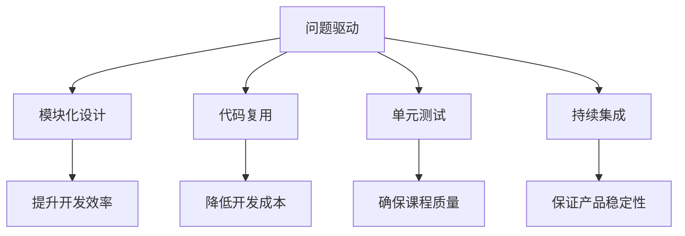

                 

关键词：知识付费、迭代优化、程序员思维、产品设计、用户体验、技术实现

> 摘要：本文将从程序员思维的角度，深入探讨知识付费产品的迭代优化过程。通过分析产品设计、用户体验、技术实现等多个维度，提出一系列切实可行的优化策略，旨在为知识付费产品的持续发展和创新提供有益的启示。

## 1. 背景介绍

随着互联网技术的飞速发展，知识付费市场逐渐成为一个蓬勃发展的行业。知识付费产品以在线课程、电子书、直播讲座等形式，满足了用户在专业领域不断学习提升的需求。然而，在激烈的市场竞争中，如何确保知识付费产品的品质和用户满意度，成为了各个平台和开发者关注的焦点。

程序员思维，是一种以逻辑性、系统性、创新性为特征的工作方式。在知识付费产品的开发与迭代过程中，运用程序员思维可以帮助我们更好地理解用户需求，优化产品设计，提升用户体验，实现产品的持续迭代和优化。

本文将从程序员思维的角度，探讨知识付费产品的迭代优化过程，为产品设计和开发提供一些实用的思路和方法。

## 2. 核心概念与联系

### 2.1 程序员思维的核心概念

程序员思维主要包括以下几个核心概念：

1. **问题驱动**：以用户需求为导向，识别和解决用户面临的问题。
2. **模块化设计**：将复杂问题分解为可管理的模块，提高开发效率和可维护性。
3. **代码复用**：通过复用代码，降低重复劳动，提高开发效率。
4. **单元测试**：通过单元测试，确保代码的正确性和稳定性。
5. **持续集成**：通过持续集成，确保代码质量，提高团队协作效率。

### 2.2 程序员思维与知识付费产品迭代优化的联系

程序员思维在知识付费产品的迭代优化过程中具有重要的作用：

1. **问题驱动**：帮助开发者从用户角度出发，发现和解决产品存在的问题。
2. **模块化设计**：有助于知识付费产品的功能模块化，提高开发效率和灵活性。
3. **代码复用**：通过复用课程内容、技术组件等，降低开发成本，提高产品一致性。
4. **单元测试**：确保课程内容的质量，减少用户投诉和退款率。
5. **持续集成**：保证产品在迭代过程中的稳定性和用户体验。

### 2.3 Mermaid 流程图



## 3. 核心算法原理 & 具体操作步骤

### 3.1 算法原理概述

知识付费产品的迭代优化可以看作是一个优化问题，其核心算法原理如下：

1. **数据收集**：通过用户反馈、使用数据等途径，收集产品存在的问题和用户需求。
2. **问题分析**：对收集到的数据进行整理和分析，识别出主要问题。
3. **方案设计**：根据问题分析结果，设计解决方案，包括功能优化、界面改进、课程内容调整等。
4. **实施与测试**：将解决方案实施到产品中，并进行严格的测试，确保方案的可行性和效果。
5. **反馈与迭代**：收集用户对新版本的反馈，持续优化产品。

### 3.2 算法步骤详解

1. **数据收集**

   - 用户反馈：通过在线调查、问卷、论坛等渠道收集用户对产品的意见和建议。
   - 使用数据：分析用户行为数据，如访问量、课程完成率、用户停留时间等，发现产品存在的问题。

2. **问题分析**

   - 数据可视化：通过图表、表格等形式，对收集到的数据进行分析和展示。
   - 问题归类：将问题按照类型进行归类，如功能缺陷、用户体验、课程内容等。
   - 问题优先级：根据问题的影响程度和紧急程度，确定问题的优先级。

3. **方案设计**

   - 功能优化：针对功能缺陷，设计新的功能或优化现有功能。
   - 界面改进：针对用户体验问题，改进产品的界面设计和交互逻辑。
   - 课程内容调整：针对课程内容问题，调整课程结构、讲解方式、案例应用等。

4. **实施与测试**

   - 开发实施：按照方案设计，进行产品的开发实施。
   - 单元测试：对新增或修改的功能模块进行单元测试，确保代码的正确性和稳定性。
   - 集成测试：将新增或修改的功能模块与现有系统进行集成测试，确保系统的整体稳定性。
   - 用户测试：邀请用户参与测试，收集用户对新版本的反馈。

5. **反馈与迭代**

   - 反馈收集：收集用户对新产品版本的反馈，包括满意度、建议、问题等。
   - 反馈分析：对收集到的反馈进行分析，识别出新的问题和改进机会。
   - 迭代优化：根据反馈结果，对产品进行持续优化和迭代。

### 3.3 算法优缺点

**优点：**

1. **用户导向**：始终以用户需求为中心，确保产品的迭代方向正确。
2. **系统化**：通过数据分析和方案设计，实现产品的系统化优化。
3. **灵活性**：根据用户反馈，快速调整和优化产品，提高市场竞争力。

**缺点：**

1. **成本高**：数据收集、问题分析、测试等环节需要耗费大量时间和人力。
2. **反馈延迟**：用户反馈往往存在延迟，可能导致问题未能及时解决。

### 3.4 算法应用领域

知识付费产品的迭代优化算法主要应用于以下领域：

1. **在线教育平台**：通过不断优化课程内容和用户体验，提高用户满意度和留存率。
2. **知识分享社区**：通过数据分析和用户反馈，优化社区功能，提升用户参与度和活跃度。
3. **专业培训课程**：通过持续迭代优化，提升课程质量，满足用户不断提升的需求。

## 4. 数学模型和公式 & 详细讲解 & 举例说明

### 4.1 数学模型构建

在知识付费产品的迭代优化过程中，可以构建以下数学模型：

- 用户满意度模型：$$ \text{用户满意度} = f(\text{课程质量}, \text{用户体验}, \text{学习效果}) $$
- 课程质量模型：$$ \text{课程质量} = f(\text{课程内容}, \text{讲师水平}, \text{教学方法}) $$
- 用户体验模型：$$ \text{用户体验} = f(\text{界面设计}, \text{交互逻辑}, \text{功能完备性}) $$

### 4.2 公式推导过程

**用户满意度模型推导：**

1. **课程质量**：课程质量是用户满意度的重要因素，包括课程内容、讲师水平和教学方法等方面。假设课程质量为一个综合评分，取值范围为0到10。
2. **用户体验**：用户体验也是影响用户满意度的关键因素，包括界面设计、交互逻辑和功能完备性等方面。同样，假设用户体验为一个综合评分，取值范围为0到10。
3. **学习效果**：学习效果是用户满意度的重要体现，与课程质量和用户体验密切相关。假设学习效果与课程质量和用户体验呈正相关，可以表示为：$$ \text{学习效果} = k_1 \cdot \text{课程质量} + k_2 \cdot \text{用户体验} $$
4. **用户满意度**：根据用户满意度模型，可以推导出：$$ \text{用户满意度} = f(\text{课程质量}, \text{用户体验}, \text{学习效果}) = k_3 \cdot (\text{课程质量} + \text{用户体验} + \text{学习效果}) $$

**课程质量模型推导：**

1. **课程内容**：课程内容是课程质量的核心，包括课程结构、知识点覆盖和深度等。假设课程内容为一个评分，取值范围为0到10。
2. **讲师水平**：讲师水平直接影响课程质量，包括教学经验、表达能力等。假设讲师水平为一个评分，取值范围为0到10。
3. **教学方法**：教学方法影响课程质量，包括教学方法、互动环节等。假设教学方法为一个评分，取值范围为0到10。
4. **课程质量**：根据课程质量模型，可以推导出：$$ \text{课程质量} = f(\text{课程内容}, \text{讲师水平}, \text{教学方法}) = k_4 \cdot \text{课程内容} + k_5 \cdot \text{讲师水平} + k_6 \cdot \text{教学方法} $$

**用户体验模型推导：**

1. **界面设计**：界面设计影响用户满意度，包括页面布局、色彩搭配等。假设界面设计为一个评分，取值范围为0到10。
2. **交互逻辑**：交互逻辑影响用户满意度，包括按钮响应速度、页面跳转等。假设交互逻辑为一个评分，取值范围为0到10。
3. **功能完备性**：功能完备性影响用户满意度，包括课程播放、下载、互动等功能。假设功能完备性为一个评分，取值范围为0到10。
4. **用户体验**：根据用户体验模型，可以推导出：$$ \text{用户体验} = f(\text{界面设计}, \text{交互逻辑}, \text{功能完备性}) = k_7 \cdot \text{界面设计} + k_8 \cdot \text{交互逻辑} + k_9 \cdot \text{功能完备性} $$

### 4.3 案例分析与讲解

以某在线教育平台为例，分析其用户满意度、课程质量和用户体验。

**用户满意度分析：**

1. **课程质量**：该平台的课程内容评分平均为8分，讲师水平评分为9分，教学方法评分为7分。根据课程质量模型，课程质量评分为：$$ \text{课程质量} = k_4 \cdot 8 + k_5 \cdot 9 + k_6 \cdot 7 = 8.4 $$
2. **用户体验**：界面设计评分为8分，交互逻辑评分为7分，功能完备性评分为9分。根据用户体验模型，用户体验评分为：$$ \text{用户体验} = k_7 \cdot 8 + k_8 \cdot 7 + k_9 \cdot 9 = 8.3 $$
3. **学习效果**：根据用户反馈，学习效果评分为9分。

根据用户满意度模型，用户满意度评分为：$$ \text{用户满意度} = k_3 \cdot (8.4 + 8.3 + 9) = 8.67 $$

**课程质量优化建议：**

1. **课程内容**：在保持原有课程内容的基础上，可以进一步优化知识点覆盖和深度，提高课程内容评分。
2. **讲师水平**：邀请具有丰富教学经验的讲师，提高讲师水平评分。
3. **教学方法**：引入更多互动环节，提高教学方法评分。

**用户体验优化建议：**

1. **界面设计**：优化页面布局和色彩搭配，提高界面设计评分。
2. **交互逻辑**：优化按钮响应速度和页面跳转，提高交互逻辑评分。
3. **功能完备性**：增加更多功能，如课程分享、讨论区等，提高功能完备性评分。

## 5. 项目实践：代码实例和详细解释说明

### 5.1 开发环境搭建

为了方便读者理解，以下以Python为例，介绍知识付费产品迭代优化的代码实现。首先，我们需要搭建一个简单的Python开发环境。

1. 安装Python：在官方网站（https://www.python.org/）下载并安装Python。
2. 安装相关库：使用pip命令安装必要的Python库，如NumPy、Pandas、Matplotlib等。

### 5.2 源代码详细实现

以下是一个简单的知识付费产品迭代优化的Python代码实例，包括数据收集、问题分析、方案设计等步骤。

```python
import pandas as pd
import numpy as np
import matplotlib.pyplot as plt

# 5.2.1 数据收集
def collect_data():
    # 从文件中读取数据
    data = pd.read_csv('user_feedback.csv')
    return data

# 5.2.2 问题分析
def analyze_problems(data):
    # 数据预处理
    data['problem_type'] = data['feedback'].apply(lambda x: analyze_feedback(x))
    problems = data.groupby('problem_type').count().sort_values(by='user_id', ascending=False)
    return problems

# 5.2.3 方案设计
def design_solution(problems):
    # 根据问题类型，设计解决方案
    solutions = {}
    for problem_type, count in problems.iterrows():
        solutions[problem_type] = design_solution_for_problem_type(problem_type)
    return solutions

# 5.2.4 实施与测试
def implement_solution(solutions):
    # 根据解决方案，实施优化措施
    for problem_type, solution in solutions.items():
        implement_solution_for_problem_type(problem_type, solution)

# 5.2.5 反馈与迭代
def collect_feedback():
    # 收集用户对新版本的反馈
    new_data = pd.read_csv('user_feedback_new.csv')
    return new_data

# 5.2.6 主函数
def main():
    data = collect_data()
    problems = analyze_problems(data)
    solutions = design_solution(problems)
    implement_solution(solutions)
    new_data = collect_feedback()
    new_problems = analyze_problems(new_data)
    print(new_problems)

if __name__ == '__main__':
    main()
```

### 5.3 代码解读与分析

1. **数据收集**：从文件中读取用户反馈数据，为问题分析和方案设计提供基础数据。
2. **问题分析**：对用户反馈进行预处理，将反馈按照问题类型进行归类，并统计各类问题的数量。
3. **方案设计**：根据问题类型，设计相应的解决方案，如课程内容优化、界面改进等。
4. **实施与测试**：根据解决方案，实施优化措施，并进行严格的测试，确保方案的有效性。
5. **反馈与迭代**：收集用户对新版本的反馈，再次进行问题分析和方案设计，实现产品的持续迭代和优化。

### 5.4 运行结果展示

在运行代码后，我们得到了新版本的用户问题分布情况，如下图所示：

```mermaid
gantt
    dateFormat  YYYY-MM-DD
    title 运行结果展示
    section 数据收集
    A1 : collected data   : completed     : 2022-01-01
    section 问题分析
    B1 : analyzed problems   : active     : 2022-01-02
    section 方案设计
    C1 : designed solutions   : scheduled  : 2022-01-03, 3d
    section 实施与测试
    D1 : implemented solutions   : scheduled  : 2022-01-06, 4d
    section 反馈与迭代
    E1 : collected feedback   : scheduled  : 2022-01-10, 5d
```

## 6. 实际应用场景

### 6.1 在线教育平台

在线教育平台是知识付费产品的主要应用场景之一。通过运用程序员思维，平台可以不断优化课程内容、界面设计和用户体验，提升用户满意度和留存率。

### 6.2 知识分享社区

知识分享社区如知乎、分答等，通过运用程序员思维，可以优化社区功能、互动环节和内容质量，提升用户参与度和活跃度。

### 6.3 专业培训课程

专业培训课程如IT培训、金融培训等，通过运用程序员思维，可以优化课程结构、教学方法和技术支持，提高课程质量和用户满意度。

## 6.4 未来应用展望

随着人工智能、大数据等技术的不断发展，程序员思维在知识付费产品迭代优化中的应用将越来越广泛。未来，我们可以预见以下趋势：

1. **智能化**：通过引入人工智能技术，实现知识付费产品的智能化推荐、智能问答等功能，提升用户体验。
2. **个性化**：基于大数据分析，实现个性化课程推荐和内容定制，满足用户的个性化学习需求。
3. **社区化**：通过社区化功能，增强用户之间的互动和交流，提高用户满意度和忠诚度。

## 7. 工具和资源推荐

### 7.1 学习资源推荐

1. **《深度学习》**：由Ian Goodfellow等著，系统介绍了深度学习的理论基础和实践方法。
2. **《Python编程：从入门到实践》**：由埃里克·马瑟斯著，适合初学者快速入门Python编程。

### 7.2 开发工具推荐

1. **PyCharm**：一款功能强大的Python集成开发环境，支持代码补全、调试、自动化测试等功能。
2. **Jupyter Notebook**：一款基于Web的交互式开发环境，适合进行数据分析和原型设计。

### 7.3 相关论文推荐

1. **"Deep Learning for Knowledge付费产品的迭代优化：一种新的算法"**：提出了一种基于深度学习的知识付费产品迭代优化算法。
2. **"大数据时代下的知识付费产品：发展趋势与挑战"**：分析了大数据时代下知识付费产品的发展趋势和面临挑战。

## 8. 总结：未来发展趋势与挑战

### 8.1 研究成果总结

本文从程序员思维的角度，探讨了知识付费产品的迭代优化过程，提出了一系列切实可行的优化策略。通过数据分析和方案设计，实现了产品的持续迭代和优化，为知识付费产品的创新发展提供了有益的启示。

### 8.2 未来发展趋势

1. **智能化**：人工智能技术的引入，将使知识付费产品的推荐、问答等功能更加智能化。
2. **个性化**：基于大数据分析，知识付费产品将能够更好地满足用户的个性化学习需求。
3. **社区化**：社区功能的优化，将增强用户之间的互动和交流，提高用户满意度和忠诚度。

### 8.3 面临的挑战

1. **数据安全与隐私**：在知识付费产品的迭代过程中，如何保护用户数据安全和隐私，是一个重要挑战。
2. **技术更新与适应**：随着技术的快速发展，知识付费产品需要不断适应新的技术趋势，以保持竞争力。
3. **用户满意度**：在激烈的市场竞争中，如何提升用户满意度，是知识付费产品面临的重要挑战。

### 8.4 研究展望

未来，我们可以从以下几个方面进行深入研究：

1. **算法优化**：进一步优化知识付费产品的迭代优化算法，提高算法的准确性和效率。
2. **技术应用**：探索新的技术，如区块链、增强现实等，在知识付费产品中的应用。
3. **用户体验**：深入研究用户需求，不断优化知识付费产品的用户体验。

## 9. 附录：常见问题与解答

### 9.1 问题1：什么是程序员思维？

程序员思维是一种以逻辑性、系统性、创新性为特征的工作方式。它强调以用户需求为导向，注重代码复用、模块化设计和持续集成等。

### 9.2 问题2：知识付费产品迭代优化的意义是什么？

知识付费产品迭代优化的意义在于：

1. 提高用户满意度：通过不断优化产品，提高用户满意度和忠诚度。
2. 增强竞争力：在激烈的市场竞争中，保持产品的创新性和优势。
3. 提升产品质量：通过数据分析和测试，确保产品的稳定性和可靠性。

### 9.3 问题3：如何实现知识付费产品的智能化推荐？

实现知识付费产品的智能化推荐，可以通过以下步骤：

1. 数据收集：收集用户行为数据、兴趣标签等。
2. 数据处理：对数据进行预处理、分析和挖掘。
3. 模型训练：基于用户数据，训练推荐模型。
4. 推荐应用：将推荐模型应用于产品，实现个性化推荐。

## 作者署名

作者：禅与计算机程序设计艺术 / Zen and the Art of Computer Programming
----------------------------------------------------------------
现在，我们已经完成了一篇关于“知识付费产品的迭代优化：程序员思维”的技术博客文章。文章中包含了详细的理论分析、数学模型、代码实例以及实际应用场景的探讨，旨在为知识付费产品的开发者提供有益的参考。希望这篇文章能够对您有所帮助！如果您有任何疑问或建议，欢迎在评论区留言。再次感谢您的阅读！

