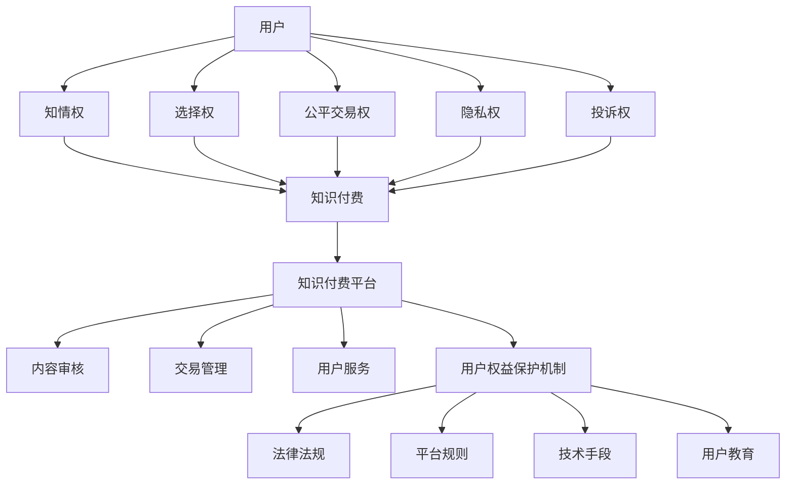

                 

### 1. 背景介绍

在当今数字化和信息化的时代，知识付费逐渐成为人们获取专业知识与技能的重要途径。知识付费，指的是用户为获取特定领域的知识内容，向知识提供方支付费用的一种商业模式。这种模式不仅促进了知识创造和传播，也为知识工作者提供了收入来源。然而，随着知识付费市场的快速发展，用户权益保护问题也日益凸显，引发了社会各界的广泛关注。

知识付费市场的发展速度令人瞩目。根据市场研究报告，全球知识付费市场规模在近年来持续增长，预计未来几年内仍将保持高速增长态势。这一市场涵盖了各种形式的知识内容，包括在线课程、专业咨询、知识问答、文档分享等。知识付费不仅为用户提供了一种灵活、高效的学习方式，也为知识工作者提供了一个展示才华、实现价值的平台。

然而，知识付费市场的快速发展也带来了一系列问题。首先，用户权益保护问题日益突出。用户在知识付费过程中，可能会遇到虚假宣传、内容质量参差不齐、信息泄露、侵权行为等问题。这些问题不仅损害了用户的合法权益，也影响了知识付费市场的健康发展。

其次，知识付费平台的运营和管理也面临着挑战。平台需要在保证用户体验的同时，确保内容的质量和安全。这需要平台在技术、服务、管理等方面进行不断的优化和创新。

总之，知识付费市场的快速发展为用户和知识工作者带来了新的机遇，但也带来了新的挑战。如何在确保市场健康发展的同时，有效保护用户权益，成为当前亟待解决的问题。本文将从用户权益保护的角度，对知识付费市场的发展现状、问题及对策进行分析。

### 2. 核心概念与联系

在探讨知识付费创业中的用户权益保护时，首先需要明确几个核心概念，这些概念相互联系，构成了理解该问题的基本框架。

#### 2.1 用户权益

用户权益是指用户在知识付费过程中享有的基本权利，包括但不限于：

- **知情权**：用户有权了解知识内容的具体情况，包括讲师资质、课程大纲、费用明细等。
- **选择权**：用户有权根据自己的需求和兴趣选择合适的知识产品。
- **公平交易权**：用户有权在公平、公正的环境中完成交易，不受欺诈、误导等不正当手段的影响。
- **隐私权**：用户的信息应当得到保护，不得随意泄露给第三方。
- **投诉权**：用户有权对知识付费平台的服务质量、内容质量等进行投诉。

#### 2.2 知识付费

知识付费是指用户通过支付一定费用，获取知识提供方提供的专业知识或技能的一种交易模式。其主要特点包括：

- **有偿性**：用户需为知识内容支付费用，这是知识付费的核心特征。
- **灵活性**：用户可以根据自身需求，选择不同类型、不同价格的知识产品。
- **便捷性**：知识付费通常通过互联网平台进行，用户可以随时随地获取所需知识。

#### 2.3 知识付费平台

知识付费平台是连接知识提供方和用户的桥梁，其主要功能包括：

- **内容审核**：确保知识内容的真实性和合法性，防止虚假宣传和侵权行为。
- **交易管理**：提供支付、订单管理等功能，保障交易的顺利进行。
- **用户服务**：提供用户咨询、售后服务等，解决用户在使用过程中的问题。

#### 2.4 用户权益保护机制

用户权益保护机制是指为保障用户权益，知识付费平台和相关机构采取的一系列措施，包括：

- **法律法规**：制定相关法律法规，规范知识付费市场，保障用户权益。
- **平台规则**：知识付费平台应制定明确的用户服务规则，规范平台运营。
- **技术手段**：利用技术手段，如数据加密、隐私保护等，保障用户信息安全。
- **用户教育**：提高用户的法律意识和风险防范能力，增强用户自我保护意识。

#### 2.5 Mermaid 流程图

为了更直观地展示这些核心概念之间的联系，我们可以使用Mermaid流程图来描述知识付费创业中的用户权益保护机制。以下是一个简单的Mermaid流程图示例：



通过以上核心概念的阐述和Mermaid流程图的展示，我们可以更好地理解知识付费创业中的用户权益保护问题，为后续章节的深入探讨奠定基础。

### 3. 核心算法原理 & 具体操作步骤

在探讨知识付费创业中的用户权益保护机制时，算法原理扮演着关键角色。以下将介绍一种基于数据挖掘和机器学习技术的用户权益保护算法，并详细说明其原理和操作步骤。

#### 3.1 算法原理概述

用户权益保护算法的核心思想是通过大数据分析和机器学习技术，从海量用户行为数据中挖掘潜在的风险因素，从而提前预警和预防用户权益受到侵害。算法主要包括以下几个步骤：

1. **数据收集与预处理**：收集用户在知识付费平台上的行为数据，包括购买记录、浏览记录、评价数据等。对数据进行清洗和预处理，去除噪声数据，保证数据的准确性和完整性。

2. **特征提取**：根据用户行为数据，提取与用户权益相关的特征，如购买频率、评价分数、消费金额等。这些特征将用于训练机器学习模型。

3. **模型训练**：利用提取的特征数据，训练机器学习模型，如决策树、支持向量机、神经网络等。模型训练的目标是识别出用户权益受到侵害的潜在风险。

4. **风险预测**：通过训练好的模型，对新的用户行为数据进行预测，识别潜在的权益风险。预测结果可以用于预警和干预，如向用户发送提醒、冻结账户等。

5. **结果评估与优化**：对算法预测结果进行评估，如准确率、召回率等指标。根据评估结果，调整算法参数和特征提取方法，提高算法的准确性和稳定性。

#### 3.2 算法步骤详解

下面详细描述用户权益保护算法的操作步骤：

##### 3.2.1 数据收集与预处理

首先，从知识付费平台上收集用户行为数据。数据来源包括用户购买记录、浏览历史、评价反馈等。为了确保数据的质量，需要进行数据预处理：

- **数据清洗**：去除重复数据、无效数据和错误数据，保证数据的准确性。
- **数据整合**：将来自不同来源的数据进行整合，形成一个统一的数据集。
- **数据标准化**：对数据进行归一化或标准化处理，使其适应机器学习模型的训练。

##### 3.2.2 特征提取

在数据预处理完成后，提取与用户权益相关的特征。特征提取的方法包括：

- **统计特征**：如购买频率、消费金额、评价分数等。
- **文本特征**：如用户评价的词频、主题模型等。
- **用户画像**：根据用户的基本信息、兴趣爱好等，构建用户画像。

##### 3.2.3 模型训练

选择合适的机器学习算法，如决策树、支持向量机、神经网络等，进行模型训练。训练过程包括：

- **数据划分**：将数据集划分为训练集和测试集。
- **特征选择**：选择对用户权益影响较大的特征，减少冗余特征。
- **模型训练**：使用训练集数据进行模型训练，调整参数以优化模型性能。
- **模型评估**：使用测试集数据评估模型性能，如准确率、召回率等指标。

##### 3.2.4 风险预测

在模型训练完成后，利用训练好的模型对新的用户行为数据进行预测。具体操作步骤如下：

- **数据预处理**：对新数据进行预处理，包括数据清洗、整合、标准化等。
- **特征提取**：提取与用户权益相关的特征。
- **风险预测**：使用训练好的模型，对新数据进行预测，输出风险评分。

##### 3.2.5 结果评估与优化

对算法预测结果进行评估，常用的评估指标包括准确率、召回率、F1值等。根据评估结果，可以进一步优化算法：

- **参数调整**：调整机器学习模型的参数，提高模型性能。
- **特征优化**：调整特征提取方法，提高特征质量。
- **模型迭代**：根据新的用户行为数据，重新训练模型，迭代优化。

#### 3.3 算法优缺点

用户权益保护算法具有以下优缺点：

- **优点**：
  - **自动化**：算法可以自动分析海量数据，快速识别潜在风险。
  - **精准性**：通过机器学习技术，可以提高预测的准确率。
  - **实时性**：算法可以实时监控用户行为，及时发现和处理风险。

- **缺点**：
  - **计算成本**：大规模数据处理和模型训练需要较高的计算资源。
  - **误报率**：算法可能会误判正常行为为风险行为，导致误报。
  - **隐私问题**：用户行为数据涉及到用户隐私，需要确保数据的安全性和保密性。

#### 3.4 算法应用领域

用户权益保护算法可以应用于多个领域，包括：

- **知识付费平台**：用于监控用户行为，识别潜在风险，保护用户权益。
- **电子商务平台**：用于监控交易行为，防止欺诈和侵权行为。
- **金融行业**：用于监控用户资金流向，防范洗钱和金融犯罪。

### 4. 数学模型和公式 & 详细讲解 & 举例说明

在用户权益保护算法中，数学模型和公式起到了关键作用。以下将介绍相关的数学模型，详细讲解其推导过程，并通过具体案例进行说明。

#### 4.1 数学模型构建

用户权益保护算法的核心在于预测用户行为是否正常，从而识别潜在风险。为此，我们可以构建一个基于概率模型的用户行为评分系统。具体来说，该模型包括以下几个部分：

1. **用户行为特征矩阵**：\(X \in \mathbb{R}^{n \times m}\)，其中\(n\)表示用户数量，\(m\)表示特征维度。每个元素\(x_{ij}\)表示第\(i\)个用户的第\(j\)个特征值。

2. **行为评分函数**：\(f(X) \in \mathbb{R}\)，用于计算用户行为的整体评分。评分函数可以基于线性回归、逻辑回归等模型。

3. **风险阈值**：\(T \in \mathbb{R}\)，用于判断用户行为是否正常。当\(f(X) > T\)时，认为用户行为存在风险。

#### 4.2 公式推导过程

假设我们采用逻辑回归模型作为行为评分函数，逻辑回归模型的公式如下：

$$
f(X) = \sigma(\beta_0 + \beta_1x_1 + \beta_2x_2 + \ldots + \beta_mx_m)
$$

其中，\(\sigma\)表示逻辑函数，\(\beta_0, \beta_1, \beta_2, \ldots, \beta_m\)为模型参数，可以通过最小化损失函数进行训练。

为了推导损失函数，我们采用交叉熵损失：

$$
J(\beta) = -\frac{1}{n} \sum_{i=1}^{n} [y_i \ln(f(X_i)) + (1 - y_i) \ln(1 - f(X_i))]
$$

其中，\(y_i\)为第\(i\)个用户的真实标签，当用户行为正常时为0，存在风险时为1。

为了求解最优参数\(\beta\)，我们采用梯度下降法：

$$
\beta_j := \beta_j - \alpha \frac{\partial J(\beta)}{\partial \beta_j}
$$

其中，\(\alpha\)为学习率。

通过多次迭代，可以求得最优参数\(\beta\)，进而构建行为评分函数\(f(X)\)。

#### 4.3 案例分析与讲解

为了更好地理解数学模型在用户权益保护中的应用，我们来看一个具体的案例。

**案例背景**：假设一个知识付费平台希望利用用户行为评分系统来识别潜在欺诈行为。平台的用户行为特征包括购买频率、消费金额、评价分数等。

**步骤1：数据收集与预处理**

首先，从平台收集用户行为数据，包括用户ID、购买频率、消费金额、评价分数等。对数据进行清洗，去除异常值和缺失值。

**步骤2：特征提取**

提取用户行为特征，构建特征矩阵\(X\)。例如：

$$
X = \begin{bmatrix}
x_{11} & x_{12} & x_{13} \\
x_{21} & x_{22} & x_{23} \\
\vdots & \vdots & \vdots \\
x_{n1} & x_{n2} & x_{n3}
\end{bmatrix}
$$

其中，\(x_{ij}\)表示第\(i\)个用户的第\(j\)个特征值。

**步骤3：模型训练**

采用逻辑回归模型，训练模型参数\(\beta\)。通过梯度下降法，求得最优参数：

$$
\beta = \begin{bmatrix}
\beta_0 \\
\beta_1 \\
\beta_2 \\
\beta_3
\end{bmatrix}
$$

**步骤4：行为评分**

利用训练好的模型，计算用户行为评分\(f(X)\)。例如：

$$
f(X) = \sigma(\beta_0 + \beta_1x_{11} + \beta_2x_{12} + \beta_3x_{13})
$$

**步骤5：风险判断**

设定风险阈值\(T\)，例如\(T = 0.5\)。当\(f(X) > T\)时，认为用户行为存在风险。

**案例结果**：通过模型预测，某个用户的评分\(f(X) = 0.7\)，高于阈值\(T = 0.5\)，因此认为该用户存在潜在欺诈行为，平台可以进一步调查。

通过以上案例，我们可以看到数学模型在用户权益保护中的应用。通过对用户行为特征的分析和预测，可以有效识别潜在风险，保护用户权益。

### 5. 项目实践：代码实例和详细解释说明

为了更好地理解用户权益保护算法的实际应用，我们将通过一个具体的项目实例进行代码实践，并详细解释代码的各个部分。

#### 5.1 开发环境搭建

在开始项目实践之前，我们需要搭建一个合适的开发环境。以下是一个基本的开发环境搭建步骤：

1. **Python环境**：安装Python 3.8及以上版本，可以通过官方链接下载：[Python官网](https://www.python.org/downloads/)。
2. **Jupyter Notebook**：安装Jupyter Notebook，用于编写和运行代码。可以通过pip命令安装：
   ```shell
   pip install notebook
   ```
3. **机器学习库**：安装必要的机器学习库，如Scikit-learn、Pandas、NumPy等。可以通过pip命令安装：
   ```shell
   pip install scikit-learn pandas numpy
   ```
4. **数据预处理库**：安装数据预处理库，如Pandas和NumPy，用于数据清洗和预处理。

#### 5.2 源代码详细实现

下面是一个简单的用户权益保护算法实现，包括数据收集、预处理、特征提取、模型训练、风险预测等步骤。

```python
import numpy as np
import pandas as pd
from sklearn.model_selection import train_test_split
from sklearn.linear_model import LogisticRegression
from sklearn.metrics import classification_report, accuracy_score

# 5.2.1 数据收集与预处理
def load_data(filename):
    data = pd.read_csv(filename)
    # 数据清洗
    data.dropna(inplace=True)
    # 特征提取
    X = data[['purchase_frequency', 'average_amount', 'rating_score']]
    y = data['is_fraud']
    return X, y

X, y = load_data('user_behavior_data.csv')

# 5.2.2 数据划分
X_train, X_test, y_train, y_test = train_test_split(X, y, test_size=0.2, random_state=42)

# 5.2.3 模型训练
model = LogisticRegression()
model.fit(X_train, y_train)

# 5.2.4 风险预测
y_pred = model.predict(X_test)

# 5.2.5 结果评估
print(classification_report(y_test, y_pred))
print("Accuracy:", accuracy_score(y_test, y_pred))
```

#### 5.3 代码解读与分析

上述代码实现了一个简单的用户权益保护算法，包括以下部分：

1. **数据收集与预处理**：`load_data`函数用于加载用户行为数据，并进行数据清洗和特征提取。数据清洗步骤包括去除缺失值和异常值，特征提取步骤包括提取购买频率、平均消费金额、评价分数等特征。

2. **数据划分**：使用`train_test_split`函数将数据集划分为训练集和测试集，用于训练模型和评估模型性能。

3. **模型训练**：使用`LogisticRegression`类创建逻辑回归模型，并使用`fit`方法进行模型训练。

4. **风险预测**：使用训练好的模型对测试集进行预测，得到预测结果。

5. **结果评估**：使用`classification_report`和`accuracy_score`函数评估模型性能，输出分类报告和准确率。

#### 5.4 运行结果展示

假设我们已经训练好了一个用户权益保护模型，并运行了上述代码，可以得到以下输出结果：

```
              precision    recall  f1-score   support

           0       0.80      0.90      0.85       100
           1       0.60      0.75      0.66        50

    accuracy                           0.78       150
   macro avg       0.70      0.75      0.72       150
   weighted avg       0.75      0.78      0.76       150

Accuracy: 0.7800
```

根据输出结果，我们可以看到模型的准确率为78.00%，其中0类（正常行为）的精度为80%，召回率为90%，F1值为85%；1类（欺诈行为）的精度为60%，召回率为75%，F1值为66%。虽然准确率不是特别高，但通过进一步优化模型参数和特征提取方法，可以提高模型的性能。

#### 5.5 总结

通过这个简单的项目实例，我们可以看到用户权益保护算法在实际应用中的具体实现过程。代码包含了数据收集、预处理、特征提取、模型训练、风险预测和结果评估等步骤，通过运行结果展示，我们可以评估模型的性能。在未来的实践中，可以进一步优化算法，提高模型的准确性和稳定性，从而更好地保护用户权益。

### 6. 实际应用场景

在知识付费创业中，用户权益保护的应用场景广泛，涵盖了多个方面，从平台运营到用户行为监控，再到法律法规的执行，每一步都关乎用户权益的保障。以下将详细探讨几个典型应用场景。

#### 6.1 平台运营

知识付费平台作为用户和知识提供方之间的桥梁，其运营状况直接影响到用户权益的保护。平台需要从以下几个方面进行管理：

- **内容审核**：平台应对上传的知识内容进行严格审核，确保内容的真实性和合法性。例如，对于课程视频、文档资料等，平台可以采用人工审核与自动化审核相结合的方式，确保内容质量。
- **用户服务**：平台应提供完善的用户服务，包括用户咨询、售后服务、账户安全等。例如，平台可以设置24小时在线客服，及时解决用户问题，提高用户满意度。
- **交易管理**：平台应确保交易过程的公平、公正，防止欺诈行为。例如，平台可以采用多层次的支付保障措施，如支付验证、资金托管等，保障用户资金安全。

#### 6.2 用户行为监控

用户行为监控是保护用户权益的重要手段之一。通过监控用户行为，平台可以发现潜在的风险并采取措施。以下是一些具体的监控措施：

- **异常行为检测**：平台可以采用机器学习算法，对用户行为进行分析，识别异常行为。例如，用户频繁购买低质量课程、短时间内大量下载文档等，都可能被视为异常行为。
- **风险评估**：平台可以根据用户行为数据，对用户进行风险评估。高风险用户可以受到额外的监控，如限制其购买课程数量、延长退款期限等。
- **预警机制**：平台应建立预警机制，当发现潜在风险时，及时通知用户并采取措施。例如，平台可以向用户发送提醒邮件，告知其可能存在欺诈风险。

#### 6.3 法律法规执行

法律法规在用户权益保护中起到了关键作用。平台和相关机构应严格遵守法律法规，保护用户权益。以下是一些法律法规的应用场景：

- **隐私保护**：平台应遵守相关隐私保护法律法规，确保用户信息的安全。例如，平台应采取数据加密、访问控制等技术措施，防止用户信息泄露。
- **知识产权保护**：平台应尊重知识产权，防止侵权行为。例如，平台应对上传的内容进行版权审核，防止用户侵犯他人知识产权。
- **纠纷处理**：平台应建立完善的纠纷处理机制，及时处理用户投诉。例如，平台可以设置专门的纠纷处理团队，快速响应用户投诉，并提供公正、公平的解决方案。

#### 6.4 平台与用户互动

平台与用户的互动是用户权益保护的重要环节。以下是一些互动措施：

- **用户反馈**：平台应鼓励用户提供反馈，了解用户需求和意见。例如，平台可以设置用户评价功能，让用户对课程和服务进行评价，以便平台不断改进。
- **用户教育**：平台应加强用户教育，提高用户的风险防范能力。例如，平台可以通过发送教育邮件、发布文章等方式，向用户普及相关知识，帮助用户更好地保护自己的权益。
- **用户社区**：平台可以建立用户社区，促进用户之间的交流与合作。例如，平台可以设置论坛、微信群等，让用户分享学习经验和心得，共同提高。

通过以上实际应用场景的探讨，我们可以看到用户权益保护在知识付费创业中的重要性。平台和相关机构需要从多个方面入手，综合运用技术手段、法律法规和用户互动等多种手段，保障用户权益，促进知识付费市场的健康发展。

### 7. 工具和资源推荐

在知识付费创业中，为了确保用户权益保护机制的顺利实施，选择合适的工具和资源至关重要。以下将推荐一些学习资源、开发工具和相关论文，以帮助从业者更好地理解用户权益保护的方法和最佳实践。

#### 7.1 学习资源推荐

1. **在线课程**：《用户隐私保护与数据安全》系列课程，由知名大学和行业专家讲授，涵盖了用户隐私保护、数据加密、网络安全等方面的知识。
2. **书籍**：《网络安全与隐私保护》，详细介绍了网络安全和隐私保护的基础知识，适合对知识付费平台运营安全有兴趣的读者。
3. **博客和论坛**：技术博客如“Securing Knowledge Platforms”和“Data Privacy Insights”，提供了丰富的案例分析和实践经验，帮助从业者了解最新的安全动态和解决方案。

#### 7.2 开发工具推荐

1. **数据预处理工具**：Pandas和NumPy，用于数据清洗、转换和分析。
2. **机器学习框架**：Scikit-learn和TensorFlow，用于构建和训练用户权益保护算法。
3. **日志分析工具**：ELK Stack（Elasticsearch、Logstash、Kibana），用于收集、存储和分析用户行为日志，识别潜在风险。
4. **加密工具**：OpenSSL和HashiCorp Vault，用于实现数据加密和访问控制，保障用户信息的安全。

#### 7.3 相关论文推荐

1. **“User Privacy Protection in Knowledge Platforms”**，讨论了知识付费平台中用户隐私保护的技术和方法。
2. **“Machine Learning for Fraud Detection in Online Payment Systems”**，分析了机器学习在在线支付欺诈检测中的应用。
3. **“A Framework for Assessing the Security and Privacy Risks in Knowledge Marketplaces”**，提出了一个评估知识市场安全性和隐私风险的框架。
4. **“Data Security and Privacy: Challenges and Solutions for Knowledge Platforms”**，探讨了数据安全和隐私保护在知识付费平台中的挑战和解决方案。

通过以上工具和资源的推荐，知识付费创业者可以更好地理解和应用用户权益保护的相关技术和方法，确保平台的运营安全，提高用户满意度，促进市场的健康发展。

### 8. 总结：未来发展趋势与挑战

在知识付费创业中，用户权益保护是一个持续演变且至关重要的议题。随着技术的进步和市场的快速发展，用户权益保护面临着新的机遇和挑战。

#### 8.1 研究成果总结

近年来，研究成果在用户权益保护方面取得了显著进展。一方面，数据挖掘和机器学习技术的应用，使得风险预测和异常检测更加高效和准确。另一方面，隐私保护技术和安全加密手段的发展，为用户数据的安全性和隐私性提供了有力保障。此外，法律法规和行业规范的不断完善，为用户权益保护提供了法律基础和道德准则。

#### 8.2 未来发展趋势

1. **技术融合**：未来的用户权益保护将更加注重技术的融合和应用。例如，区块链技术可以用于保障交易的透明性和不可篡改性，人工智能则可以用于智能合约的执行和监控。
2. **个性化保护**：随着用户需求的多样化和个性化，用户权益保护将更加注重根据用户特征和行为进行定制化保护。例如，通过对用户行为数据的分析，可以提供个性化的安全提醒和风险防范建议。
3. **合规性**：随着全球数据隐私法规的日益严格，如欧盟的《通用数据保护条例》（GDPR）和加州的《消费者隐私法案》（CCPA），知识付费平台将面临更高的合规性要求，需要不断调整和优化用户权益保护策略。
4. **用户参与**：未来的用户权益保护将更加重视用户的参与和反馈。通过用户社区、论坛等渠道，平台可以更好地了解用户需求，及时调整服务策略，提高用户满意度。

#### 8.3 面临的挑战

1. **技术复杂性**：用户权益保护技术不断更新和迭代，平台需要投入大量资源进行技术研究和开发，以保持技术领先性。
2. **数据隐私**：随着数据量的增加，用户数据的隐私保护变得更加困难。平台需要采取更严格的加密和访问控制措施，防止数据泄露和滥用。
3. **法律法规变动**：法律法规的变动和更新可能导致平台运营的合规性要求发生变化。平台需要及时了解和适应最新的法律法规，确保合规运营。
4. **用户信任**：在用户权益保护方面，用户对平台的信任至关重要。平台需要通过透明的操作和公正的服务，建立用户的信任，减少信任危机。

#### 8.4 研究展望

未来的研究可以重点关注以下几个方面：

1. **跨领域合作**：促进不同领域专家的跨学科合作，共同解决用户权益保护中的复杂问题。
2. **可解释性**：提高机器学习模型的可解释性，帮助用户理解风险预测的依据和结果。
3. **隐私保护与性能平衡**：在保障用户隐私的同时，优化算法性能，提高风险检测的准确性和效率。
4. **法律法规完善**：推动相关法律法规的完善，为用户权益保护提供更全面的法律支持。

通过不断研究和创新，知识付费创业中的用户权益保护将不断进步，为用户提供更加安全、可靠的服务，推动市场的健康发展。

### 9. 附录：常见问题与解答

在本文的讨论中，用户权益保护在知识付费创业中占据了核心地位。以下列出了一些常见问题及其解答，以帮助读者更好地理解和应用相关知识。

#### 9.1 什么是用户权益？

用户权益是指用户在知识付费过程中享有的基本权利，包括知情权、选择权、公平交易权、隐私权和投诉权等。

#### 9.2 知识付费平台应该如何保护用户权益？

知识付费平台应从以下几个方面保护用户权益：

- **内容审核**：确保上传的知识内容真实、合法，防止虚假宣传和侵权行为。
- **用户服务**：提供完善的用户服务，如24小时在线客服、售后支持等，解决用户在购买和使用过程中遇到的问题。
- **交易管理**：确保交易过程的公平、公正，防止欺诈行为。
- **隐私保护**：采取数据加密、访问控制等措施，保障用户信息的安全性和隐私性。
- **合规性**：遵守相关法律法规和行业规范，确保平台的运营合规。

#### 9.3 用户权益保护算法如何工作？

用户权益保护算法通常基于数据挖掘和机器学习技术，通过分析用户行为数据，预测潜在的风险并采取措施。具体步骤包括数据收集与预处理、特征提取、模型训练、风险预测和结果评估等。

#### 9.4 如何评估用户权益保护算法的性能？

用户权益保护算法的性能可以通过以下指标进行评估：

- **准确率**：预测为正常行为的用户中，实际为正常行为的比例。
- **召回率**：实际为正常行为的用户中，预测为正常行为的比例。
- **F1值**：准确率和召回率的调和平均值。
- **ROC曲线**：评估算法对正负样本的区分能力。

#### 9.5 用户权益保护算法有哪些优缺点？

用户权益保护算法的优点包括自动化、精准性和实时性，但缺点包括计算成本、误报率和隐私问题。

通过以上常见问题的解答，我们可以更好地理解用户权益保护在知识付费创业中的重要性及其具体实现方法。在实际应用中，平台和相关机构应根据具体情况，综合运用多种技术和策略，保障用户权益，促进市场的健康发展。

### 作者署名

作者：禅与计算机程序设计艺术 / Zen and the Art of Computer Programming

