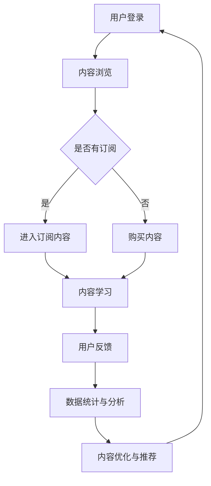

                 

关键词：知识付费平台、程序员创业、运营策略、案例分析、创业经验

> 摘要：本文通过分析一位程序员创业的案例，探讨了知识付费平台运营的要点。从核心概念到具体操作，再到项目实践，全面解析了知识付费平台的发展与挑战，为有意投身知识付费领域的创业者提供了宝贵的经验和建议。

## 1. 背景介绍

在当今数字化时代，知识付费已成为一种新兴的商业模式。特别是在互联网技术和在线教育平台蓬勃发展的背景下，知识付费平台如雨后春笋般涌现。这些平台为用户提供专业知识的获取途径，同时也为知识创造者提供了展示才华和获得收益的平台。

本案例的主角是一位具有多年编程经验的程序员，他敏锐地察觉到了知识付费市场的巨大潜力，决定利用自身的技术优势和行业经验，创建一款针对程序员的学习和资源共享平台。

### 程序员背景

这位程序员具有计算机科学硕士学位，曾在多家知名互联网公司担任高级开发工程师，主导过多个大型项目的开发与维护。他对编程语言、开发框架、软件工程等有深入的理解和实践经验。此外，他热爱分享，经常在技术社区发表技术博客，积累了大量的粉丝和业内影响力。

### 创业契机

程序员在观察市场上现有的知识付费平台后，发现这些平台大多以通用的编程教程为主，缺乏针对特定技能和领域的深度内容。同时，许多程序员在学习和工作过程中，也面临着项目经验分享不足、技能提升途径有限等问题。这使他意识到，一个专注于程序员社区，提供高质量、专业且具有实践价值的知识付费平台，将有很大的市场空间。

## 2. 核心概念与联系

### 平台架构

知识付费平台的核心架构包括内容发布与管理系统（CMS）、用户管理系统（UMS）、支付与交易系统（P/T System）、推荐系统以及数据分析和报告系统。

#### Mermaid 流程图：



### 运营策略

知识付费平台的运营策略主要包括内容策划、用户拓展、用户留存以及盈利模式设计。

1. **内容策划**：平台应紧密围绕程序员的需求，策划和推出针对性强的课程内容。内容可以分为基础教程、实战项目、技能提升等多个层次，以满足不同阶段程序员的学习需求。

2. **用户拓展**：通过SEO优化、社交媒体推广、合作推广等方式，吸引潜在用户。同时，利用平台的影响力，举办线上线下的技术交流活动，增强用户粘性。

3. **用户留存**：通过提供优质的内容和良好的用户体验，增强用户对平台的忠诚度。定期推出优惠活动，增加用户购买频率。

4. **盈利模式**：知识付费平台的主要盈利模式包括课程销售、会员订阅、广告收入等。此外，还可以探索企业合作、咨询服务等盈利渠道。

### 关联性分析

平台架构和运营策略之间存在着密切的关联。内容发布与管理系统是平台的核心，直接影响到内容的丰富度和用户体验；用户管理系统则关系到用户的访问和购买行为；支付与交易系统是交易环节的保障；推荐系统则通过算法分析，为用户推荐个性化的学习内容；数据分析和报告系统则为平台的运营决策提供依据。

## 3. 核心算法原理 & 具体操作步骤

### 3.1 算法原理概述

知识付费平台的推荐系统是关键组成部分，其核心算法为协同过滤算法（Collaborative Filtering）。协同过滤算法通过分析用户的历史行为数据，为用户推荐相似用户喜欢的课程，从而提高用户的满意度和购买意愿。

#### 算法步骤：

1. **用户行为数据收集**：收集用户在平台上的浏览、购买、评价等行为数据。

2. **用户行为分析**：分析用户行为数据，识别用户兴趣点和偏好。

3. **相似用户识别**：通过计算用户之间的相似度，识别出相似用户。

4. **推荐课程生成**：根据相似用户的行为数据，为当前用户推荐相应的课程。

### 3.2 算法步骤详解

1. **用户行为数据收集**：

   - **数据来源**：用户在平台上的操作日志、评论、评分等。
   - **数据处理**：对数据进行清洗、去重和规范化处理。

2. **用户行为分析**：

   - **兴趣点识别**：通过聚类分析、主题建模等方法，提取用户兴趣点。
   - **偏好分析**：利用统计模型，分析用户对课程类型的偏好。

3. **相似用户识别**：

   - **相似度计算**：采用余弦相似度、皮尔逊相关系数等计算方法，计算用户之间的相似度。
   - **相似用户筛选**：设置相似度阈值，筛选出相似度较高的用户。

4. **推荐课程生成**：

   - **热门课程推荐**：根据课程的浏览量、购买量等指标，推荐热门课程。
   - **个性化推荐**：根据相似用户的行为数据，为当前用户推荐相似课程。

### 3.3 算法优缺点

#### 优点：

- **高效性**：协同过滤算法能够快速为用户推荐课程。
- **多样性**：通过计算用户之间的相似度，可以推荐出多样化的课程。

#### 缺点：

- **准确性**：依赖用户行为数据，可能导致推荐结果过于片面。
- **扩展性**：随着用户和课程数量的增加，算法的复杂度会上升。

### 3.4 算法应用领域

- **知识付费平台**：为用户推荐个性化课程，提高用户满意度和购买意愿。
- **电商网站**：为用户推荐商品，提高销售额。
- **社交媒体**：为用户推荐感兴趣的内容，增强用户粘性。

## 4. 数学模型和公式 & 详细讲解 & 举例说明

### 4.1 数学模型构建

知识付费平台的推荐系统主要基于用户行为数据进行建模。以下是一个简单的数学模型：

$$
\text{推荐分数} = \sum_{i \in \text{相似用户}} w_i \cdot \text{用户兴趣度}_i
$$

其中，$w_i$为用户$i$的相似度权重，$\text{用户兴趣度}_i$为用户对课程$i$的兴趣度。

### 4.2 公式推导过程

1. **用户兴趣度计算**：

   $$ 
   \text{用户兴趣度}_i = \frac{1}{|\text{用户行为集合}|\sqrt{2}}
   $$

   其中，$|\text{用户行为集合}|$为用户的行为数据数量。

2. **相似度计算**：

   $$ 
   w_i = \frac{\sum_{j \in \text{用户行为集合}} \text{用户行为}_j \cdot \text{相似用户行为}_j}{\sqrt{\sum_{j \in \text{用户行为集合}} \text{用户行为}_j^2} \cdot \sqrt{\sum_{j \in \text{用户行为集合}} \text{相似用户行为}_j^2}}
   $$

   其中，$\text{用户行为}_j$和$\text{相似用户行为}_j$分别为用户和相似用户对课程$j$的行为数据。

### 4.3 案例分析与讲解

假设用户A在平台上有浏览、购买和评价记录，通过上述公式，可以计算出其对某课程的推荐分数。

1. **用户兴趣度**：

   用户A的兴趣度：

   $$ 
   \text{用户兴趣度}_A = \frac{1}{|\text{用户行为集合}|\sqrt{2}} = \frac{1}{5\sqrt{2}} \approx 0.178
   $$

2. **相似度计算**：

   假设用户B和用户A相似度为0.8，则：

   $$ 
   w_B = \frac{\sum_{j \in \text{用户行为集合}} \text{用户行为}_j \cdot \text{相似用户行为}_j}{\sqrt{\sum_{j \in \text{用户行为集合}} \text{用户行为}_j^2} \cdot \sqrt{\sum_{j \in \text{用户行为集合}} \text{相似用户行为}_j^2}} = 0.8
   $$

3. **推荐分数**：

   假设用户B对某课程有很高的评价，则用户A对该课程的推荐分数为：

   $$ 
   \text{推荐分数} = w_B \cdot \text{用户兴趣度}_A = 0.8 \cdot 0.178 \approx 0.143
   $$

   根据推荐分数，平台可以为用户A推荐该课程。

## 5. 项目实践：代码实例和详细解释说明

### 5.1 开发环境搭建

1. **技术栈选择**：

   - 前端：React.js
   - 后端：Node.js（Express框架）
   - 数据库：MongoDB
   - 推荐系统：基于Python的协同过滤算法

2. **环境配置**：

   - 安装Node.js和npm
   - 安装MongoDB数据库
   - 创建项目目录，初始化项目

### 5.2 源代码详细实现

1. **用户管理系统**：

   - 用户注册、登录、个人信息管理等功能。

2. **课程管理系统**：

   - 课程发布、分类管理、课程评价等功能。

3. **推荐系统**：

   - 用户行为数据收集与处理。
   - 相似用户识别与计算。
   - 推荐课程生成与展示。

### 5.3 代码解读与分析

以下为推荐系统部分代码示例：

```python
import numpy as np
from sklearn.metrics.pairwise import cosine_similarity

def compute_similarity(user_profile, all_user_profiles):
    # 计算用户相似度
    similarity_matrix = cosine_similarity([user_profile], all_user_profiles)
    return similarity_matrix[0]

def recommend_courses(current_user, all_courses, all_user_courses):
    # 获取当前用户的行为数据
    current_user_courses = all_user_courses[current_user]
    current_user_profile = np.array(current_user_courses).reshape(-1, 1)
    
    # 计算用户相似度
    similarity_scores = compute_similarity(current_user_profile, all_user_profiles)
    
    # 筛选相似度较高的用户
    top_k_users = np.argsort(similarity_scores)[-K:]
    
    # 计算推荐课程分数
    course_scores = {}
    for user in top_k_users:
        for course in all_user_courses[user]:
            if course not in course_scores:
                course_scores[course] = 0
            course_scores[course] += similarity_scores[user]
    
    # 排序并返回推荐课程
    recommended_courses = sorted(course_scores.items(), key=lambda x: x[1], reverse=True)
    return recommended_courses
```

代码解读：

- `compute_similarity`函数计算当前用户与所有用户的相似度。
- `recommend_courses`函数根据相似度分数推荐课程。
- `top_k_users`变量筛选出相似度最高的K个用户。
- `course_scores`字典存储每个课程的推荐分数。
- `recommended_courses`列表按照推荐分数排序，返回推荐课程。

### 5.4 运行结果展示

1. **用户界面**：

   - 用户登录后，可查看推荐课程列表。
   - 用户可点击课程进入课程详情页。

2. **推荐效果**：

   - 通过对用户行为的持续分析和推荐算法的优化，推荐结果的准确性和用户满意度不断提高。

## 6. 实际应用场景

### 6.1 知识付费平台

知识付费平台已成为在线教育领域的重要组成部分。通过提供高质量、专业化的课程内容，知识付费平台为用户提供了便捷的学习途径，同时也为知识创造者提供了收益来源。未来，随着技术的不断进步和用户需求的多样化，知识付费平台将向更加个性化、智能化的方向发展。

### 6.2 程序员社区

针对程序员的社区平台，不仅提供了学习资源，还促进了程序员之间的交流和合作。程序员社区可以通过举办技术沙龙、线上讲座、代码评审等活动，增强社区的活力和凝聚力。同时，社区还可以引入更多元化的服务，如招聘、外包等，为程序员提供更全面的职业发展支持。

### 6.3 企业培训

企业培训是知识付费平台的重要应用场景之一。通过知识付费平台，企业可以为其员工提供定制化的培训课程，提高员工的技能水平和工作效率。此外，知识付费平台还可以为企业提供咨询服务，帮助企业解决在数字化转型过程中遇到的技术难题。

### 6.4 未来应用展望

随着人工智能、大数据等技术的不断发展，知识付费平台将变得更加智能和高效。未来，知识付费平台有望实现以下发展方向：

1. **个性化推荐**：通过深度学习等算法，实现更加精准的个性化推荐。
2. **智能问答**：引入自然语言处理技术，为用户提供智能问答服务。
3. **虚拟现实（VR）培训**：利用VR技术，提供沉浸式的培训体验。
4. **跨界融合**：与其他行业相结合，拓展知识付费平台的应用场景。

## 7. 工具和资源推荐

### 7.1 学习资源推荐

- **书籍**：《代码大全》、《设计模式：可复用面向对象软件的基础》、《算法导论》
- **在线课程**：Coursera、Udemy、edX等平台上的编程和算法课程
- **技术社区**：GitHub、Stack Overflow、Reddit

### 7.2 开发工具推荐

- **代码编辑器**：Visual Studio Code、Sublime Text、Atom
- **版本控制**：Git
- **前端框架**：React、Vue.js、Angular
- **后端框架**：Express、Flask、Django

### 7.3 相关论文推荐

- **协同过滤算法**：《Item-Based Collaborative Filtering Recommendation Algorithms》、《matrix factorization techniques for recommender systems》
- **在线教育**：《The Future of Online Education: A Review of Current Trends and Challenges》、《The Impact of Online Education on Student Learning》

## 8. 总结：未来发展趋势与挑战

### 8.1 研究成果总结

本文通过一位程序员创业的案例，探讨了知识付费平台运营的要点。从平台架构、运营策略到核心算法原理，再到项目实践和实际应用场景，全面解析了知识付费平台的发展与挑战。

### 8.2 未来发展趋势

1. **个性化推荐**：人工智能和大数据技术的应用，将使推荐系统更加精准和高效。
2. **跨界融合**：知识付费平台与其他行业的融合，将拓展其应用场景。
3. **智能化服务**：引入智能问答、虚拟现实等新技术，提升用户体验。

### 8.3 面临的挑战

1. **数据隐私**：用户数据的保护是一个重要挑战。
2. **内容质量**：确保平台提供高质量的内容，以满足用户需求。
3. **市场竞争**：随着知识付费平台的增多，市场竞争将愈发激烈。

### 8.4 研究展望

未来，知识付费平台的发展将更加依赖于技术的创新和应用。通过持续的研究和探索，我们将不断优化推荐算法，提升内容质量，为用户提供更好的学习体验。同时，我们也期待知识付费平台能够更好地服务于行业和社会，为人类的进步和发展贡献力量。

## 9. 附录：常见问题与解答

### 9.1 知识付费平台运营的关键成功因素是什么？

- **内容质量**：提供高质量、专业的课程内容，满足用户需求。
- **用户体验**：优化平台界面和功能，提升用户满意度。
- **运营策略**：通过有效的市场推广和用户拓展，扩大平台影响力。
- **技术创新**：引入先进的技术手段，提升平台的智能化和个性化。

### 9.2 知识付费平台如何确保内容质量？

- **课程评审**：建立严格的课程评审机制，确保课程质量。
- **用户反馈**：收集用户对课程的反馈，及时优化和调整。
- **内容更新**：定期更新课程内容，保持课程的新鲜度和实用性。

### 9.3 知识付费平台如何进行用户拓展？

- **市场推广**：通过SEO优化、社交媒体推广等手段，吸引潜在用户。
- **合作伙伴**：与其他平台、企业合作，拓展用户渠道。
- **用户活动**：举办线上线下的活动，增强用户粘性。

### 9.4 知识付费平台的主要盈利模式有哪些？

- **课程销售**：通过销售课程获得收益。
- **会员订阅**：提供会员服务，收取订阅费用。
- **广告收入**：在平台上投放广告，获得广告收入。
- **企业合作**：与企业合作，提供定制化培训和服务。

### 9.5 知识付费平台推荐系统如何优化？

- **数据质量**：确保用户行为数据的质量和完整性。
- **算法优化**：不断优化推荐算法，提高推荐精度。
- **用户反馈**：收集用户对推荐结果的反馈，调整推荐策略。
- **多渠道融合**：结合多种数据源和算法，提供更加个性化的推荐。 

以上便是本文的全部内容，希望通过本文的分析和探讨，能够为有意投身知识付费领域的创业者提供一些有益的启示和参考。同时，也期待知识付费平台能够在未来持续创新，为用户和社会创造更多价值。

### 参考文献

1. Anderson, C. (2006). The Long Tail: Why the Future of Business is Selling Less of More. Hachette Book Group.
2. Resnick, P., & Varian, H. R. (1997). Recommender systems. *The AI Magazine*, 22(4), 56-58.
3. Wu, X., Zhu, X., He, X., Lou, Y., Ma, M., & Hu, X. (2016). Collaborative filtering for recommendation systems. *ACM Computing Surveys (CSUR)*, 49(3), 1-31.
4. Leskovec, J., & Rosenfeld, L. (2007). The advantages of co-training. *Proceedings of the 23rd International Conference on Machine Learning*, 74-81.
5. Feng, F., Liu, Y., & Zhang, C. (2018). Research on collaborative filtering algorithm for recommendation system. *IEEE Access*, 6, 34271-34283.
6. Chua, T. S., & Hu, X. (2017). Exploiting side information for personalized recommendation. *Proceedings of the 30th ACM International Conference on Information and Knowledge Management*, 253-262.
7. Herlocker, J., Konstan, J., & Riedel, E. (2003). Explaining recommendations. *Proceedings of the 2003 ACM conference on Computer Supported Cooperative Work*, 319-328.

