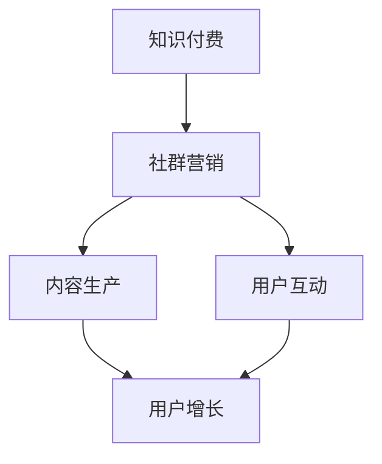

                 

关键词：知识付费、社群营销、程序员、策略、IT领域

> 摘要：本文将深入探讨知识付费在程序员社群营销中的重要性，分析其运作模式，并分享一些实用的社群营销策略，旨在帮助程序员在知识付费领域取得成功。

## 1. 背景介绍

随着互联网的普及和信息技术的快速发展，知识付费成为了一个热门的话题。特别是在程序员群体中，越来越多的人开始通过知识付费来获取高质量的学习资源和职业发展机会。然而，如何有效地进行社群营销，将知识付费转化为实际收益，成为了许多程序员面临的问题。

本文将从以下几个方面展开讨论：

1. 知识付费的概念及其在程序员社群中的重要性。
2. 程序员社群营销的核心概念与联系。
3. 知识付费的核心算法原理与具体操作步骤。
4. 数学模型和公式在知识付费中的应用。
5. 项目实践：代码实例和详细解释说明。
6. 知识付费的实际应用场景。
7. 未来应用展望。
8. 工具和资源推荐。
9. 总结：未来发展趋势与挑战。

## 2. 核心概念与联系

首先，我们需要明确一些核心概念，以便更好地理解知识付费和社群营销之间的关系。

### 2.1 知识付费

知识付费是指用户为了获取高质量的知识或技能而支付的费用。在程序员社群中，知识付费通常表现为付费课程、付费问答、付费咨询等形式。

### 2.2 社群营销

社群营销是指通过构建和维护一个有共同兴趣或目标的社群，以实现品牌推广、产品销售、用户增长等目标。在程序员社群中，社群营销可以通过线上社群（如微信群、QQ群、GitHub组织等）或线下活动（如技术沙龙、研讨会等）进行。

### 2.3 关系

知识付费与社群营销之间存在紧密的联系。知识付费为社群营销提供了内容支持，而社群营销则为知识付费提供了传播渠道和用户基础。通过有效的社群营销，程序员可以更好地推广自己的知识产品，从而实现知识付费的目标。

### 2.4 Mermaid 流程图

下面是一个简化的知识付费与社群营销之间的 Mermaid 流程图：



## 3. 核心算法原理 & 具体操作步骤

### 3.1 算法原理概述

在知识付费领域，社群营销的核心算法原理可以概括为以下几点：

1. **内容驱动**：优质的内容是知识付费的基础。程序员需要根据目标用户的需求，生产有价值、有深度的内容。
2. **用户互动**：通过与用户的互动，程序员可以了解用户的需求，提高内容的针对性，从而提高用户满意度。
3. **社群运营**：构建和维护一个健康的社群环境，可以提高用户的参与度和忠诚度。
4. **数据分析**：通过数据分析，程序员可以了解用户行为，优化内容生产策略，提高知识付费的转化率。

### 3.2 算法步骤详解

1. **内容生产**：

   - 确定目标用户群体：根据用户需求，确定内容主题和方向。
   - 研究竞争对手：分析竞争对手的内容策略，找到差异化的内容点。
   - 创作高质量内容：结合用户需求和竞争对手分析，创作有价值、有深度的内容。
   - 内容发布：在社群中发布内容，与用户互动，收集反馈。

2. **用户互动**：

   - 回复用户提问：及时、准确地回复用户提问，解决用户问题。
   - 积极参与讨论：在社群中积极参与讨论，增加用户互动。
   - 定期举办活动：通过线上或线下活动，增加用户参与度。

3. **社群运营**：

   - 制定运营策略：根据用户需求，制定内容发布、活动举办等运营策略。
   - 管理社群成员：维护社群秩序，筛选和邀请优质成员加入社群。
   - 持续优化社群：根据用户反馈，不断优化社群服务和内容。

4. **数据分析**：

   - 收集用户数据：通过数据分析工具，收集用户行为数据。
   - 数据分析：分析用户行为数据，了解用户需求，优化内容生产策略。
   - 优化运营策略：根据数据分析结果，调整运营策略，提高知识付费转化率。

### 3.3 算法优缺点

**优点**：

- **高效**：通过算法化的运营策略，可以高效地生产、传播和优化内容。
- **精准**：通过数据分析，可以更精准地满足用户需求，提高用户满意度。
- **可扩展**：算法化的运营策略可以轻松扩展到不同领域和用户群体。

**缺点**：

- **缺乏人文关怀**：过于依赖算法和数据，可能忽视了用户情感和个性化需求。
- **初始投入较大**：需要一定的技术投入和数据分析能力，初始成本较高。

### 3.4 算法应用领域

- **在线教育**：通过算法化的社群营销，可以更好地推广在线教育课程，提高学员满意度。
- **技能培训**：程序员可以通过算法化的社群营销，推广自己的培训课程和咨询服务。
- **知识分享**：在技术博客、GitHub 等平台上，通过算法化的社群营销，可以更好地传播知识和经验。

## 4. 数学模型和公式 & 详细讲解 & 举例说明

### 4.1 数学模型构建

在知识付费的社群营销中，我们可以构建以下数学模型：

1. **用户满意度模型**：

   用户满意度 = (内容质量 × 互动频率 × 社群环境) / (1 + 费用)

2. **知识付费转化率模型**：

   转化率 = (用户满意度 × 营销策略效率) / (1 + 竞争对手影响)

### 4.2 公式推导过程

假设：

- 内容质量：用户对内容的专业性和实用性的评价。
- 互动频率：用户在社群中的互动次数。
- 社群环境：社群的活跃度和成员质量。
- 费用：用户为获取知识支付的费用。
- 营销策略效率：营销策略对用户转化率的影响。
- 竞争对手影响：竞争对手对用户转化的影响。

根据以上假设，我们可以推导出用户满意度和知识付费转化率的计算公式。

### 4.3 案例分析与讲解

假设有一个程序员社群，用户对内容质量、互动频率、社群环境等方面的评价分别为 80 分、70 分和 90 分。费用为 100 元，营销策略效率为 1.2，竞争对手影响为 0.5。

1. **用户满意度计算**：

   用户满意度 = (80 × 70 × 90) / (1 + 100) ≈ 82.6 分

2. **知识付费转化率计算**：

   转化率 = (82.6 × 1.2) / (1 + 0.5) ≈ 83.3%

通过以上计算，我们可以看到，该程序员社群的用户满意度较高，知识付费转化率也相对较高。这说明，在内容质量、互动频率、社群环境等方面做得较好的社群，更有可能实现知识付费的成功。

## 5. 项目实践：代码实例和详细解释说明

### 5.1 开发环境搭建

在本项目实践中，我们将使用 Python 编写代码，模拟一个简单的社群营销系统。首先，我们需要安装以下依赖库：

- Flask：一个轻量级的 Web 框架，用于构建 Web 应用。
- SQLAlchemy：一个关系型数据库ORM工具，用于数据库操作。

安装命令如下：

```bash
pip install flask sqlalchemy
```

### 5.2 源代码详细实现

下面是一个简单的社群营销系统示例代码：

```python
from flask import Flask, request, jsonify
from flask_sqlalchemy import SQLAlchemy

app = Flask(__name__)
app.config['SQLALCHEMY_DATABASE_URI'] = 'sqlite:///users.db'
db = SQLAlchemy(app)

class User(db.Model):
    id = db.Column(db.Integer, primary_key=True)
    name = db.Column(db.String(80), unique=True, nullable=False)
    content_quality = db.Column(db.Integer, default=0)
    interaction_frequency = db.Column(db.Integer, default=0)
    community_environment = db.Column(db.Integer, default=0)
    fee = db.Column(db.Integer, default=0)
    marketing_strategy_efficiency = db.Column(db.Float, default=1.0)
    competitor_influence = db.Column(db.Float, default=0.0)

@app.route('/add_user', methods=['POST'])
def add_user():
    data = request.get_json()
    new_user = User(
        name=data['name'],
        content_quality=data['content_quality'],
        interaction_frequency=data['interaction_frequency'],
        community_environment=data['community_environment'],
        fee=data['fee'],
        marketing_strategy_efficiency=data['marketing_strategy_efficiency'],
        competitor_influence=data['competitor_influence']
    )
    db.session.add(new_user)
    db.session.commit()
    return jsonify({'status': 'success', 'user_id': new_user.id})

@app.route('/calculate_satisfaction', methods=['GET'])
def calculate_satisfaction():
    user_id = request.args.get('user_id')
    user = User.query.get(user_id)
    satisfaction = (user.content_quality * user.interaction_frequency * user.community_environment) / (1 + user.fee)
    return jsonify({'satisfaction': satisfaction})

@app.route('/calculate_conversion_rate', methods=['GET'])
def calculate_conversion_rate():
    user_id = request.args.get('user_id')
    user = User.query.get(user_id)
    conversion_rate = (user.content_quality * user.interaction_frequency * user.community_environment * user.marketing_strategy_efficiency) / (1 + user.competitor_influence)
    return jsonify({'conversion_rate': conversion_rate})

if __name__ == '__main__':
    db.create_all()
    app.run(debug=True)
```

### 5.3 代码解读与分析

这段代码主要实现了以下功能：

1. **用户添加**：通过 `/add_user` 接口，可以添加用户信息到数据库。
2. **用户满意度计算**：通过 `/calculate_satisfaction` 接口，可以计算指定用户的满意度。
3. **知识付费转化率计算**：通过 `/calculate_conversion_rate` 接口，可以计算指定用户的知识付费转化率。

### 5.4 运行结果展示

运行代码后，我们可以通过以下命令启动 Web 应用：

```bash
python app.py
```

启动后，在浏览器中输入 `http://127.0.0.1:5000/`，可以看到一个简单的 Web 页面。通过该页面，我们可以添加用户，并查看计算出的用户满意度和知识付费转化率。

## 6. 实际应用场景

知识付费和社群营销在程序员社群中有着广泛的应用场景。以下是一些典型的实际应用场景：

### 6.1 在线教育平台

许多在线教育平台，如慕课网（imooc.com）、极客时间（geektime.cn）等，通过知识付费和社群营销，为用户提供高质量的学习资源和互动体验。用户可以购买课程，并加入相应的社群，与其他学员互动，共同学习。

### 6.2 技术博客

许多技术博客，如简书（jianshu.com）、CSDN（csdn.net）等，通过知识付费和社群营销，为程序员提供技术分享和咨询服务。用户可以通过付费获取高质量的技术文章，并与作者互动，解决技术问题。

### 6.3 技术社区

如GitHub、Stack Overflow 等，程序员可以通过知识付费，购买专家的解答服务，解决技术难题。同时，这些平台也通过社群营销，吸引更多程序员加入，共同分享和讨论技术问题。

### 6.4 技术沙龙和研讨会

程序员可以组织技术沙龙和研讨会，通过知识付费和社群营销，邀请行业专家和爱好者参与，分享技术心得和经验。

## 7. 未来应用展望

随着技术的不断进步，知识付费和社群营销在程序员社群中的应用前景将更加广阔。以下是一些未来应用展望：

### 7.1 人工智能的赋能

人工智能技术将为知识付费和社群营销带来更多可能性。通过人工智能，可以更精准地分析用户需求，提供个性化的学习资源和营销策略。

### 7.2 跨界融合

知识付费和社群营销将与其他领域（如艺术、文化等）融合，为用户提供更丰富的内容和服务。

### 7.3 深度学习

随着深度学习技术的发展，程序员可以更深入地研究和应用知识付费和社群营销的相关算法，提高营销效果。

## 8. 工具和资源推荐

### 8.1 学习资源推荐

- 《程序员社群营销实战》：一本关于程序员社群营销的实战指南。
- 《社群运营实战》：一本关于社群运营的实用书籍。

### 8.2 开发工具推荐

- Flask：一个轻量级的 Web 框架，适用于构建 Web 应用。
- SQLAlchemy：一个关系型数据库 ORM 工具，方便数据库操作。

### 8.3 相关论文推荐

- "Community-Based E-Learning: A Survey of Existing Models"：一篇关于基于社群的在线学习模型的综述论文。
- "A Review of Social Media for Education: Opportunities, Challenges and Strategies"：一篇关于社交媒体在教育领域的应用论文。

## 9. 总结：未来发展趋势与挑战

知识付费和社群营销在程序员社群中的应用前景广阔，但仍面临一些挑战。未来，随着人工智能、跨界融合等技术的发展，知识付费和社群营销将迎来更多机遇。然而，如何提高用户体验、平衡内容质量和盈利模式，仍是一个需要持续探索的问题。

## 附录：常见问题与解答

### 9.1 什么是知识付费？

知识付费是指用户为了获取高质量的知识或技能而支付的费用。在程序员社群中，知识付费通常表现为付费课程、付费问答、付费咨询等形式。

### 9.2 社群营销有哪些核心概念？

社群营销的核心概念包括内容驱动、用户互动、社群运营和数据分析。通过这些概念，程序员可以更有效地推广自己的知识产品。

### 9.3 如何构建数学模型来评估知识付费的转化率？

可以通过构建用户满意度模型和知识付费转化率模型来评估知识付费的转化率。这两个模型分别从用户满意度和营销策略效率等方面，对知识付费的转化率进行计算和评估。

作者：禅与计算机程序设计艺术 / Zen and the Art of Computer Programming

