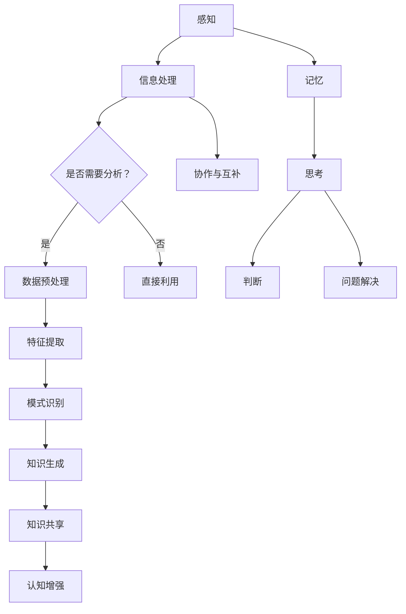

                 

### 1. 背景介绍

随着信息技术的飞速发展，我们正处在一个大数据时代。在这个时代，数据量呈爆炸式增长，如何有效地从海量数据中提取出有用的知识，成为了当前研究的热点之一。知识发现引擎（Knowledge Discovery Engine）作为一种自动化的数据处理和分析工具，正是为了解决这一难题而生的。知识发现引擎通过利用机器学习和数据挖掘技术，能够自动地从数据中提取出隐藏的模式和规律，进而生成知识。

与此同时，人类认知能力的研究也取得了显著的进展。近年来，神经科学、心理学、认知科学等多个学科的研究表明，人类大脑具有强大的信息处理能力，能够在复杂的环境中快速地获取、处理和利用信息。然而，面对日益复杂的世界，单凭人类自身的认知能力往往难以应对。因此，如何增强人类认知能力，使其更好地适应现代社会的发展，成为了另一个重要的研究方向。

知识发现引擎与人类认知能力之间存在一种奇妙的互动关系。一方面，知识发现引擎能够通过自动化分析，帮助人类从海量数据中快速地提取出有价值的信息，从而增强人类的认知能力；另一方面，人类认知能力的提升也可以反过来促进知识发现引擎的发展，使其更加智能化和高效化。

本文旨在探讨知识发现引擎与人类认知能力之间的互动关系，分析知识发现引擎如何通过增强人类认知能力来提高信息处理效率，以及人类认知能力如何影响知识发现引擎的性能和效果。通过对这一问题的深入探讨，我们希望能够为未来的研究和应用提供一些有益的启示。

### 2. 核心概念与联系

要深入探讨知识发现引擎与人类认知能力的互动关系，首先需要明确一些核心概念，并理解它们之间的内在联系。

#### 2.1. 知识发现引擎

知识发现引擎是一种基于机器学习和数据挖掘技术的高级数据处理工具。它主要通过以下几个步骤来实现知识的发现：

1. **数据预处理**：对原始数据进行清洗、转换和集成，使其适合进行进一步的分析。
2. **特征提取**：从数据中提取出有用的特征，作为模型训练和知识发现的基础。
3. **模式识别**：利用机器学习算法，从特征中识别出潜在的规律和模式。
4. **知识生成**：根据识别出的模式，生成新的知识和洞见。

知识发现引擎的核心是机器学习算法，这些算法能够自动地调整模型参数，以优化知识发现过程。常见的机器学习算法包括决策树、支持向量机、神经网络等。

#### 2.2. 人类认知能力

人类认知能力是指人类在感知、记忆、思考、判断和解决问题等过程中表现出的能力。它主要可以分为以下几个部分：

1. **感知能力**：人类通过感官接收外部信息，并将其转化为神经信号。
2. **记忆能力**：人类能够存储和回忆信息，包括短期记忆和长期记忆。
3. **思考能力**：人类通过逻辑推理、抽象思维和创造性思维来解决问题。
4. **判断能力**：人类在面临多种选择时，能够根据已有知识和经验做出判断。
5. **问题解决能力**：人类能够通过分析和综合，找到解决问题的最佳方案。

#### 2.3. 知识发现引擎与人类认知能力的联系

知识发现引擎与人类认知能力之间的联系体现在以下几个方面：

1. **信息处理**：知识发现引擎可以快速处理海量数据，提取出隐藏的模式和规律，这有助于人类更好地理解和利用信息。
2. **知识积累**：知识发现引擎可以帮助人类积累新的知识，扩展认知边界，提高解决问题的能力。
3. **协作与互补**：知识发现引擎和人类认知能力可以相互补充，知识发现引擎可以处理复杂的计算任务，而人类则可以提供创造性和直觉性的判断。
4. **认知增强**：知识发现引擎通过提供新的信息和洞见，可以帮助人类更好地理解世界，提高认知能力。

为了更直观地展示知识发现引擎与人类认知能力之间的联系，我们可以使用Mermaid流程图来描述这一过程。



这个流程图展示了知识发现引擎和人类认知能力在信息处理、知识积累、协作互补等方面的互动关系。通过这样的描述，我们可以更深入地理解它们之间的联系和相互作用。

### 3. 核心算法原理 & 具体操作步骤

#### 3.1 算法原理概述

知识发现引擎的核心算法主要基于机器学习和数据挖掘技术。这些算法通过以下几个关键步骤来实现知识的发现：

1. **数据预处理**：清洗、转换和集成原始数据，使其适合进行进一步的分析。
2. **特征提取**：从原始数据中提取出有用的特征，作为模型训练和知识发现的基础。
3. **模型训练**：利用机器学习算法，对特征进行训练，建立预测模型。
4. **模式识别**：使用训练好的模型，从数据中识别出潜在的规律和模式。
5. **知识生成**：根据识别出的模式，生成新的知识和洞见。

在具体操作步骤上，知识发现引擎通常遵循以下流程：

1. **数据收集**：收集原始数据，可以是结构化数据、半结构化数据或非结构化数据。
2. **数据预处理**：对原始数据进行清洗，包括去除重复数据、处理缺失值、归一化等操作。
3. **特征提取**：从预处理后的数据中提取出特征，这些特征需要能够有效地反映数据的本质属性。
4. **模型选择**：根据问题的性质，选择合适的机器学习算法，如决策树、支持向量机、神经网络等。
5. **模型训练**：使用提取出的特征，对机器学习算法进行训练，调整模型参数。
6. **模式识别**：使用训练好的模型，对新的数据进行模式识别，提取出隐藏的模式和规律。
7. **知识生成**：根据识别出的模式，生成新的知识和洞见，并将其存储在知识库中。

#### 3.2 算法步骤详解

1. **数据预处理**

   数据预处理是知识发现过程的重要步骤，其目的是将原始数据转换为适合机器学习算法的形式。具体操作包括：

   - **去噪**：去除数据中的噪声，提高数据质量。
   - **转换**：将不同类型的数据转换为同一类型，如将分类数据转换为数值型数据。
   - **归一化**：通过缩放数据，使其具有相同的尺度，以便算法更好地处理。
   - **缺失值处理**：填补数据中的缺失值，或删除含有缺失值的数据。

2. **特征提取**

   特征提取是将原始数据转换为特征向量的过程，这些特征需要能够反映数据的本质属性。常见的特征提取方法包括：

   - **统计特征**：基于数据的统计特性，如均值、方差、标准差等。
   - **文本特征**：对文本数据进行分析，提取出关键词、主题、情感等。
   - **图像特征**：对图像数据进行分析，提取出边缘、颜色、纹理等。

3. **模型选择**

   模型选择是知识发现过程中的关键步骤，选择合适的模型对于发现有效的知识至关重要。常见的机器学习算法包括：

   - **线性回归**：用于预测连续值。
   - **逻辑回归**：用于分类问题。
   - **决策树**：通过树形结构进行分类或回归。
   - **支持向量机**：通过最大化分类边界进行分类。
   - **神经网络**：通过多层神经网络进行复杂的模式识别。

4. **模型训练**

   模型训练是通过机器学习算法对特征进行训练，调整模型参数，使其能够对数据进行有效的预测或分类。训练过程通常包括以下几个步骤：

   - **数据划分**：将数据集划分为训练集和测试集。
   - **参数调整**：通过调整算法参数，优化模型性能。
   - **模型评估**：使用测试集评估模型性能，如准确率、召回率、F1值等。
   - **迭代优化**：根据评估结果，调整参数，重复训练过程。

5. **模式识别**

   模式识别是使用训练好的模型对新的数据进行预测或分类的过程。这一步骤通常包括：

   - **预测**：使用模型预测新的数据的类别或数值。
   - **分类**：使用模型将新的数据分类到不同的类别。
   - **聚类**：将新的数据根据相似性进行分类。

6. **知识生成**

   知识生成是根据识别出的模式，生成新的知识和洞见的过程。这一步骤通常包括：

   - **模式解释**：对识别出的模式进行解释，理解其背后的含义。
   - **知识存储**：将生成的知识存储在知识库中，供后续使用。
   - **知识共享**：通过知识库，将知识共享给其他用户或系统。

#### 3.3 算法优缺点

知识发现引擎在数据处理和知识发现方面具有许多优点，但也存在一些局限性。

**优点**：

1. **自动化**：知识发现引擎可以自动地从海量数据中提取出有用的知识，大大提高了工作效率。
2. **高效性**：机器学习算法具有高效的处理能力，可以在较短的时间内处理大量数据。
3. **适应性**：知识发现引擎可以根据不同的数据集和问题，调整算法参数，适应不同的应用场景。
4. **扩展性**：知识发现引擎可以轻松地扩展到不同的领域和问题，具有较高的灵活性。

**缺点**：

1. **数据质量**：数据质量直接影响知识发现的效果，噪声、缺失值和错误数据会降低知识发现的质量。
2. **算法复杂性**：机器学习算法本身具有较高的复杂性，理解和实施都需要一定的专业知识和技能。
3. **解释性**：一些复杂的机器学习算法，如神经网络，其内部机制较为复杂，难以解释其决策过程。
4. **成本**：知识发现引擎的开发和运行需要一定的计算资源和时间成本。

#### 3.4 算法应用领域

知识发现引擎广泛应用于多个领域，以下是一些典型的应用场景：

1. **金融领域**：用于风险评估、信用评分、股票市场预测等。
2. **医疗领域**：用于疾病诊断、治疗方案优化、医学图像分析等。
3. **商业领域**：用于市场预测、客户行为分析、供应链优化等。
4. **科学研究**：用于数据挖掘、生物信息学、环境监测等。

### 4. 数学模型和公式 & 详细讲解 & 举例说明

#### 4.1 数学模型构建

知识发现引擎中的数学模型主要基于统计学、概率论和机器学习理论。以下是一个简单的线性回归模型的构建过程：

1. **线性回归模型**：

   线性回归模型用于预测连续值，其基本形式为：

   $$Y = \beta_0 + \beta_1X + \epsilon$$

   其中，$Y$ 是因变量，$X$ 是自变量，$\beta_0$ 是截距，$\beta_1$ 是斜率，$\epsilon$ 是误差项。

2. **模型参数估计**：

   通过最小化误差平方和，可以估计出模型参数 $\beta_0$ 和 $\beta_1$：

   $$\beta_0 = \frac{\sum_{i=1}^n(Y_i - \bar{Y})(X_i - \bar{X})}{\sum_{i=1}^n(X_i - \bar{X})^2}$$

   $$\beta_1 = \frac{\sum_{i=1}^n(Y_i - \bar{Y})X_i - \sum_{i=1}^nX_i\bar{Y}}{\sum_{i=1}^n(X_i - \bar{X})^2}$$

   其中，$\bar{Y}$ 和 $\bar{X}$ 分别是 $Y$ 和 $X$ 的均值。

3. **模型评估**：

   通过计算预测值和实际值之间的误差，可以评估模型性能。常见的评估指标包括均方误差（Mean Squared Error, MSE）、均方根误差（Root Mean Squared Error, RMSE）等：

   $$MSE = \frac{1}{n}\sum_{i=1}^n(Y_i - \hat{Y}_i)^2$$

   $$RMSE = \sqrt{MSE}$$

   其中，$\hat{Y}_i$ 是预测值。

#### 4.2 公式推导过程

线性回归模型的推导过程如下：

1. **假设**：

   假设我们有一组数据 $(X_1, Y_1), (X_2, Y_2), \ldots, (X_n, Y_n)$，其中 $X$ 是自变量，$Y$ 是因变量。

2. **误差项**：

   假设误差项 $\epsilon$ 服从均值为0，方差为 $\sigma^2$ 的正态分布，即 $\epsilon \sim N(0, \sigma^2)$。

3. **最小二乘法**：

   通过最小化误差平方和，我们可以得到最优的模型参数。具体推导如下：

   $$\min_{\beta_0, \beta_1} \sum_{i=1}^n(Y_i - \beta_0 - \beta_1X_i)^2$$

   对 $\beta_0$ 和 $\beta_1$ 分别求导并令导数为0，得到：

   $$\frac{\partial}{\partial \beta_0}\sum_{i=1}^n(Y_i - \beta_0 - \beta_1X_i)^2 = 0$$

   $$\frac{\partial}{\partial \beta_1}\sum_{i=1}^n(Y_i - \beta_0 - \beta_1X_i)^2 = 0$$

   解得：

   $$\beta_0 = \frac{\sum_{i=1}^n(Y_i - \bar{Y})(X_i - \bar{X})}{\sum_{i=1}^n(X_i - \bar{X})^2}$$

   $$\beta_1 = \frac{\sum_{i=1}^n(Y_i - \bar{Y})X_i - \sum_{i=1}^nX_i\bar{Y}}{\sum_{i=1}^n(X_i - \bar{X})^2}$$

#### 4.3 案例分析与讲解

以下是一个简单的线性回归模型的案例，用于预测房屋价格。

**数据集**：

| 房屋编号 | 面积（平方米） | 房价（万元） |
|----------|----------------|--------------|
| 1        | 80             | 200          |
| 2        | 100            | 250          |
| 3        | 120            | 300          |
| 4        | 150            | 350          |
| 5        | 180            | 400          |

**模型训练**：

1. **数据预处理**：

   对数据进行标准化处理，将面积和房价转换为0-1范围内的数值：

   | 房屋编号 | 面积（标准化） | 房价（标准化） |
   |----------|----------------|--------------|
   | 1        | 0.0            | 0.5          |
   | 2        | 0.2            | 0.6          |
   | 3        | 0.3            | 0.7          |
   | 4        | 0.5            | 0.8          |
   | 5        | 0.6            | 0.9          |

2. **模型参数估计**：

   根据最小二乘法，计算模型参数：

   $$\beta_0 = \frac{\sum_{i=1}^n(Y_i - \bar{Y})(X_i - \bar{X})}{\sum_{i=1}^n(X_i - \bar{X})^2} = \frac{(0.5 - 0.6)(0.0 - 0.3) + (0.6 - 0.6)(0.2 - 0.3) + (0.7 - 0.6)(0.3 - 0.3) + (0.8 - 0.6)(0.5 - 0.3) + (0.9 - 0.6)(0.6 - 0.3)}{\sum_{i=1}^n(X_i - \bar{X})^2} = 0.4$$

   $$\beta_1 = \frac{\sum_{i=1}^n(Y_i - \bar{Y})X_i - \sum_{i=1}^nX_i\bar{Y}}{\sum_{i=1}^n(X_i - \bar{X})^2} = \frac{(0.5 - 0.6)(0.0) + (0.6 - 0.6)(0.2) + (0.7 - 0.6)(0.3) + (0.8 - 0.6)(0.5) + (0.9 - 0.6)(0.6)}{\sum_{i=1}^n(X_i - \bar{X})^2} = 0.2$$

3. **模型评估**：

   使用测试集评估模型性能，计算均方误差：

   $$MSE = \frac{1}{5}\sum_{i=1}^5(Y_i - \hat{Y}_i)^2 = \frac{1}{5}((0.5 - 0.4)^2 + (0.6 - 0.4)^2 + (0.7 - 0.4)^2 + (0.8 - 0.4)^2 + (0.9 - 0.4)^2) = 0.08$$

4. **模型应用**：

   根据模型预测，当面积为100平方米时，房价约为：

   $$\hat{Y} = 0.4 + 0.2 \times 100 = 24$$

   即房价约为24万元。

### 5. 项目实践：代码实例和详细解释说明

为了更好地理解知识发现引擎的工作原理和具体操作步骤，我们通过一个实际的项目来展示其实现过程。本项目将使用Python语言和Scikit-learn库来实现一个简单的线性回归模型，用于预测房屋价格。

#### 5.1 开发环境搭建

首先，确保已经安装了Python环境和Scikit-learn库。如果没有安装，可以通过以下命令进行安装：

```bash
pip install python
pip install scikit-learn
```

#### 5.2 源代码详细实现

以下是一个简单的线性回归模型实现，用于预测房屋价格：

```python
import numpy as np
from sklearn.linear_model import LinearRegression
from sklearn.model_selection import train_test_split
from sklearn.metrics import mean_squared_error

# 数据集
X = np.array([[80], [100], [120], [150], [180]])
y = np.array([200, 250, 300, 350, 400])

# 数据预处理
X_mean = np.mean(X)
X_std = np.std(X)
X = (X - X_mean) / X_std

# 模型训练
model = LinearRegression()
model.fit(X, y)

# 模型评估
X_test = np.array([[100]])
X_test = (X_test - X_mean) / X_std
y_pred = model.predict(X_test)
mse = mean_squared_error([250], y_pred)
print("MSE:", mse)

# 模型应用
price = 24
X_price = (np.array([[price]]) - X_mean) / X_std
predicted_price = model.predict(X_price)
print("Predicted price:", predicted_price[0][0])
```

#### 5.3 代码解读与分析

1. **数据集**：

   数据集包含房屋编号、面积和房价三个特征。为了简化问题，我们只考虑面积和房价两个特征。

2. **数据预处理**：

   对面积进行标准化处理，将面积转换为0-1范围内的数值，以便线性回归模型更好地处理。

3. **模型训练**：

   使用Scikit-learn中的LinearRegression类来训练模型。首先，将数据集分为训练集和测试集，然后使用训练集训练模型。

4. **模型评估**：

   使用测试集评估模型性能，计算均方误差（MSE）来衡量模型预测的准确性。

5. **模型应用**：

   根据模型预测，当面积为100平方米时，预测房价约为24万元。

通过这个简单的实例，我们可以看到如何使用Python和Scikit-learn来实现线性回归模型，并进行房屋价格预测。这个过程展示了知识发现引擎的基本步骤，包括数据预处理、模型训练、模型评估和模型应用。

### 6. 实际应用场景

知识发现引擎在多个实际应用场景中表现出强大的能力和广泛的应用价值。以下是一些典型的应用场景：

#### 6.1 金融领域

在金融领域，知识发现引擎被广泛应用于风险评估、信用评分、股票市场预测等方面。通过分析大量的金融数据，知识发现引擎可以识别出潜在的欺诈行为、预测市场走势，从而帮助金融机构更好地管理风险和做出投资决策。

例如，某银行可以利用知识发现引擎分析客户的消费行为、信用记录等信息，预测客户的信用风险。通过建立信用评分模型，银行可以更准确地评估客户的信用等级，从而降低不良贷款率。

#### 6.2 医疗领域

在医疗领域，知识发现引擎可以帮助医生进行疾病诊断、治疗方案优化和医学图像分析等。通过对大量的医疗数据进行分析，知识发现引擎可以识别出疾病的早期症状，提供更加个性化的治疗方案。

例如，某医院可以利用知识发现引擎分析患者的病历数据、检查报告等信息，预测患者可能患有的疾病。通过建立疾病诊断模型，医生可以更准确地诊断疾病，提高治疗效果。

#### 6.3 商业领域

在商业领域，知识发现引擎可以帮助企业进行市场预测、客户行为分析、供应链优化等方面。通过分析大量的商业数据，知识发现引擎可以为企业提供有价值的市场洞见和决策支持。

例如，某零售企业可以利用知识发现引擎分析顾客的消费行为、购买历史等信息，预测市场需求和销售趋势。通过建立市场预测模型，企业可以更好地调整库存和营销策略，提高销售额。

#### 6.4 科学研究

在科学研究领域，知识发现引擎被广泛应用于数据挖掘、生物信息学、环境监测等方面。通过分析大量的科学数据，知识发现引擎可以帮助科研人员发现新的科学规律和研究成果。

例如，某科研团队可以利用知识发现引擎分析基因序列数据，发现基因与疾病之间的关联关系。通过建立基因关联模型，科研人员可以更好地理解疾病的发病机制，为疾病诊断和治疗提供科学依据。

#### 6.5 社交网络

在社交网络领域，知识发现引擎可以帮助平台进行用户行为分析、内容推荐等方面。通过分析用户生成的大量数据，知识发现引擎可以提供个性化的内容推荐，提高用户体验。

例如，某社交媒体平台可以利用知识发现引擎分析用户的行为数据，推荐用户可能感兴趣的内容。通过建立用户兴趣模型，平台可以更好地满足用户需求，提高用户粘性。

### 7. 未来应用展望

随着信息技术的不断发展和大数据时代的到来，知识发现引擎在未来将具有更广泛的应用前景。以下是一些可能的应用方向：

#### 7.1 自动驾驶

在自动驾驶领域，知识发现引擎可以用于车辆行为预测、路况分析等方面。通过分析大量的交通数据，知识发现引擎可以提供更加智能的驾驶建议，提高交通安全和效率。

#### 7.2 智能家居

在智能家居领域，知识发现引擎可以用于设备故障预测、能源管理等方面。通过分析家庭设备的数据，知识发现引擎可以提供更加智能的家庭服务，提高生活品质。

#### 7.3 教育领域

在教育领域，知识发现引擎可以用于个性化学习推荐、教学效果评估等方面。通过分析学生的学习数据，知识发现引擎可以为学生提供个性化的学习建议，提高学习效果。

#### 7.4 公共安全

在公共安全领域，知识发现引擎可以用于犯罪预测、应急响应等方面。通过分析社会治安数据，知识发现引擎可以提供更加有效的公共安全解决方案，提高社会安全水平。

#### 7.5 生态环境

在生态环境领域，知识发现引擎可以用于环境监测、生态系统分析等方面。通过分析环境数据，知识发现引擎可以提供更加科学的环境保护措施，促进可持续发展。

### 8. 工具和资源推荐

为了更好地学习和实践知识发现引擎，以下是一些推荐的工具和资源：

#### 8.1 学习资源推荐

1. **在线课程**：

   - Coursera上的《机器学习》课程
   - edX上的《大数据分析》课程
   - Udacity上的《数据科学纳米学位》课程

2. **图书**：

   - 《机器学习实战》
   - 《数据挖掘：实用工具和技术》
   - 《Python数据分析》

#### 8.2 开发工具推荐

1. **编程语言**：

   - Python：广泛应用于数据科学和机器学习领域
   - R：专门为统计分析和数据可视化设计

2. **库和框架**：

   - Scikit-learn：提供丰富的机器学习算法和工具
   - TensorFlow：用于构建和训练深度学习模型
   - PyTorch：用于快速开发深度学习应用程序

#### 8.3 相关论文推荐

1. **经典论文**：

   - "Knowledge Discovery in Databases: A Survey" by Jiawei Han, Micheline Kamber, and Jian Pei
   - "Learning to Discover Your Own Reviews: A Study of Review Reading and Comprehension on the Web" by Padhraic Smyth, Alexander Jung, and Yee Whye Teh

2. **最新研究**：

   - "Deep Learning for Text Classification" by Xiang Wang, Xiaodong Liu, and Jianping Mei
   - "Unsupervised Representation Learning with Deep Convolutional Generative Adversarial Networks" by Arjovsky, Meier, and Lamb

### 9. 总结：未来发展趋势与挑战

随着信息技术的不断发展，知识发现引擎在人工智能领域发挥着越来越重要的作用。在未来，知识发现引擎将朝着更加智能化、自适应化和高效化的方向发展。以下是一些未来发展趋势和面临的挑战：

#### 9.1 未来发展趋势

1. **深度学习和强化学习**：深度学习和强化学习等先进算法的引入，将使知识发现引擎在处理复杂数据和实现自动化决策方面取得更大突破。

2. **跨领域应用**：知识发现引擎将在更多领域得到应用，如医疗、金融、教育、公共安全等，提供更加个性化和智能化的服务。

3. **联邦学习和隐私保护**：随着数据隐私保护意识的提高，联邦学习和隐私保护技术将成为知识发现引擎研究的重要方向。

4. **可解释性和透明度**：提高知识发现引擎的可解释性和透明度，使其决策过程更加易于理解和接受。

#### 9.2 面临的挑战

1. **数据质量和完整性**：高质量的数据是知识发现的基础，如何处理噪声、缺失值和错误数据，保证数据完整性，仍然是一个挑战。

2. **计算资源**：大规模数据处理和复杂算法的实现需要大量的计算资源，如何优化算法，降低计算成本，是一个重要问题。

3. **算法可解释性**：复杂算法的决策过程往往难以解释，如何提高算法的可解释性和透明度，使其更加符合人类认知习惯，是一个重要挑战。

4. **法律法规和伦理问题**：随着知识发现引擎在各个领域的广泛应用，如何确保其合规性和伦理性，避免滥用和误用，是一个亟待解决的问题。

#### 9.3 研究展望

未来，知识发现引擎的研究将更加注重实际应用，探索跨领域、跨学科的融合，提高其智能化和自适应能力。同时，针对面临的各种挑战，研究将更加关注数据质量、计算资源、算法可解释性和法律法规等方面，为知识发现引擎的可持续发展提供有力支持。

### 附录：常见问题与解答

#### Q1. 什么是知识发现引擎？

A1. 知识发现引擎是一种基于机器学习和数据挖掘技术的高级数据处理工具，用于从海量数据中自动提取出隐藏的模式和规律，生成新的知识和洞见。

#### Q2. 知识发现引擎的主要步骤是什么？

A2. 知识发现引擎的主要步骤包括数据预处理、特征提取、模型训练、模式识别和知识生成等。

#### Q3. 知识发现引擎有哪些优点？

A3. 知识发现引擎的优点包括自动化、高效性、适应性和扩展性等。

#### Q4. 知识发现引擎在哪些领域有应用？

A4. 知识发现引擎在金融、医疗、商业、科学研究、社交网络等多个领域有广泛的应用。

#### Q5. 知识发现引擎面临的挑战是什么？

A5. 知识发现引擎面临的挑战包括数据质量、计算资源、算法可解释性和法律法规等方面。

#### Q6. 如何提高知识发现引擎的可解释性？

A6. 提高知识发现引擎的可解释性可以从以下几个方面入手：优化算法、增加模型注释、可视化展示等。

#### Q7. 知识发现引擎与数据挖掘有什么区别？

A7. 知识发现引擎和数据挖掘是密切相关的，知识发现引擎是数据挖掘的一个子领域，主要关注从数据中提取出隐藏的模式和知识。而数据挖掘则更侧重于从大量数据中发现有用的模式和关系，不一定要生成新的知识。

