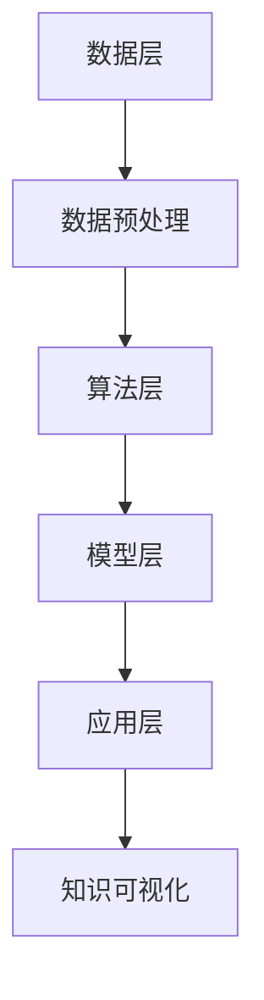

                 

关键词：知识发现、社会科学研究、算法、应用、模型、实践、工具

> 摘要：本文旨在探讨知识发现引擎在社会科学研究中的应用。通过对知识发现引擎的核心概念、算法原理、数学模型、实际应用场景、工具和资源等方面的深入分析，为社会科学研究提供新的视角和方法。本文将结合具体的案例和实践，阐述知识发现引擎在社会科学研究中的潜在价值和未来发展方向。

## 1. 背景介绍

在信息技术飞速发展的今天，数据已成为新时代的“石油”，数据挖掘和知识发现成为众多领域研究的热点。知识发现引擎作为一种智能化的数据处理工具，其应用范围不断扩展，尤其在社会科学研究中展现出巨大的潜力。社会科学研究涉及广泛，包括社会学、心理学、经济学、政治学等多个领域，这些领域的数据往往具有复杂性、多样性等特点。如何从海量数据中提取有价值的信息，成为社会科学研究面临的重要挑战。

知识发现引擎能够通过自动化的算法和模型，对大量数据进行深入分析，发现潜在的规律和模式。其在社会科学研究中的应用，不仅可以提高研究的效率和准确性，还可以为决策提供数据支持。因此，探讨知识发现引擎在社会科学研究中的应用具有重要意义。

## 2. 核心概念与联系

### 2.1 知识发现引擎的定义

知识发现引擎（Knowledge Discovery Engine，KDE）是一种基于人工智能和机器学习技术的数据处理工具。它通过从海量数据中自动挖掘出潜在的知识和模式，帮助用户发现数据中的隐藏规律和趋势。

### 2.2 知识发现引擎的工作原理

知识发现引擎的工作原理主要包括以下几个步骤：

1. **数据预处理**：对原始数据进行清洗、转换和集成，使其符合分析要求。
2. **数据挖掘**：利用各种算法对预处理后的数据进行分析，提取出潜在的知识和模式。
3. **模式评估**：对挖掘出的模式进行评估，判断其是否具有实际意义和价值。
4. **知识可视化**：将挖掘出的模式以图表、报表等形式进行可视化展示，帮助用户理解和分析。

### 2.3 知识发现引擎的架构

知识发现引擎的架构可以分为以下几个层次：

1. **数据层**：包括各种数据源，如数据库、文件、API 等。
2. **算法层**：包含各种数据挖掘算法，如聚类、分类、关联规则挖掘等。
3. **模型层**：根据挖掘算法构建的模型，用于预测和决策。
4. **应用层**：面向用户的应用程序，如数据可视化工具、分析报告生成器等。

### 2.4 Mermaid 流程图

下面是一个简化的知识发现引擎的 Mermaid 流程图：



## 3. 核心算法原理 & 具体操作步骤

### 3.1 算法原理概述

知识发现引擎的核心算法主要包括以下几种：

1. **聚类算法**：将数据划分为若干个类别，使同类别内的数据相似度较高，不同类别间的数据相似度较低。
2. **分类算法**：将数据划分为已知的类别，根据已知的类别对未知数据进行预测。
3. **关联规则挖掘**：发现数据之间的关联关系，如购买A商品的概率较高的客户也倾向于购买B商品。
4. **时间序列分析**：分析数据随时间变化的规律和趋势。

### 3.2 算法步骤详解

1. **数据预处理**：

   - 数据清洗：去除重复、错误、缺失的数据。
   - 数据转换：将不同类型的数据转换为同一类型，如将文本数据转换为数值数据。
   - 数据集成：将来自不同数据源的数据整合在一起，形成统一的数据集。

2. **数据挖掘**：

   - 聚类：选择合适的聚类算法，如 K-means、DBSCAN 等，对数据进行聚类分析。
   - 分类：选择合适的分类算法，如决策树、随机森林、支持向量机等，对数据进行分类分析。
   - 关联规则挖掘：选择合适的关联规则挖掘算法，如 Apriori、FP-growth 等，对数据进行关联规则挖掘。
   - 时间序列分析：选择合适的时间序列分析算法，如 ARIMA、LSTM 等，对数据进行时间序列分析。

3. **模式评估**：

   - 聚类：评估聚类结果的好坏，如内部距离、轮廓系数等。
   - 分类：评估分类模型的准确率、召回率、F1 分数等。
   - 关联规则挖掘：评估关联规则的支持度、置信度等。
   - 时间序列分析：评估预测结果的误差、R2 等。

4. **知识可视化**：

   - 利用图表、报表等形式展示挖掘结果，如散点图、决策树、关联规则表等。

### 3.3 算法优缺点

1. **聚类算法**：

   - 优点：不需要事先定义类别，适用于发现数据中的潜在结构。
   - 缺点：对初始值敏感，可能陷入局部最优。

2. **分类算法**：

   - 优点：能够对未知数据进行准确预测，适用于分类任务。
   - 缺点：需要事先定义类别，可能无法发现数据中的潜在结构。

3. **关联规则挖掘**：

   - 优点：能够发现数据之间的关联关系，适用于关联分析。
   - 缺点：规则数量可能非常多，需要进一步筛选。

4. **时间序列分析**：

   - 优点：能够预测未来数据的变化趋势，适用于时间序列预测。
   - 缺点：对数据质量要求较高，可能受到外部因素的影响。

### 3.4 算法应用领域

知识发现引擎的应用领域非常广泛，包括但不限于以下几个方面：

1. **社会学**：研究群体行为、社会趋势等。
2. **心理学**：分析个体心理特征、行为模式等。
3. **经济学**：研究市场趋势、消费者行为等。
4. **政治学**：分析政治选举、政策影响等。
5. **公共卫生**：研究疾病传播、健康趋势等。

## 4. 数学模型和公式 & 详细讲解 & 举例说明

### 4.1 数学模型构建

知识发现引擎涉及的数学模型主要包括聚类模型、分类模型、关联规则模型和时间序列模型。

1. **聚类模型**：

   假设数据集 \( D = \{d_1, d_2, \ldots, d_n\} \)，每个数据点 \( d_i \) 有 \( m \) 个特征。聚类模型的目标是找到 \( k \) 个聚类中心 \( \mu_1, \mu_2, \ldots, \mu_k \)，使得每个数据点与其最近的聚类中心的距离最小。

   聚类中心计算公式为：

   $$ \mu_j = \frac{1}{n_j} \sum_{i=1}^{n} w_{ij} d_i $$

   其中，\( n_j \) 是第 \( j \) 个聚类中的数据点数量，\( w_{ij} \) 是数据点 \( d_i \) 与聚类中心 \( \mu_j \) 的相似度。

2. **分类模型**：

   假设数据集 \( D = \{d_1, d_2, \ldots, d_n\} \)，每个数据点 \( d_i \) 有 \( m \) 个特征，并属于 \( c \) 个类别之一。分类模型的目标是找到一组权重 \( w_1, w_2, \ldots, w_m \)，使得每个数据点 \( d_i \) 被正确分类。

   分类概率计算公式为：

   $$ P(y|d_i) = \frac{e^{\sum_{j=1}^{m} w_j d_{ij}}}{1 + \sum_{j=1}^{m} e^{\sum_{j=1}^{m} w_j d_{ij}}} $$

   其中，\( y \) 是数据点 \( d_i \) 的类别，\( d_{ij} \) 是数据点 \( d_i \) 的第 \( j \) 个特征值。

3. **关联规则模型**：

   假设数据集 \( D = \{d_1, d_2, \ldots, d_n\} \)，每个数据点 \( d_i \) 有 \( m \) 个特征。关联规则模型的目标是找到一组特征集合 \( X \)，使得 \( X \) 与目标特征 \( Y \) 之间的关联性最强。

   支持度计算公式为：

   $$ support(X \rightarrow Y) = \frac{n_{XY}}{n} $$

   其中，\( n_{XY} \) 是同时包含特征集合 \( X \) 和目标特征 \( Y \) 的数据点数量，\( n \) 是总数据点数量。

4. **时间序列模型**：

   假设数据集 \( D = \{d_1, d_2, \ldots, d_n\} \)，每个数据点 \( d_i \) 有一个时间戳和一个特征值。时间序列模型的目标是找到一组参数 \( \theta \)，使得数据点 \( d_i \) 的未来值 \( d_{i+k} \) 能够被准确预测。

   ARIMA 模型参数计算公式为：

   $$ d_{i+k} = \phi_1 d_{i+k-1} + \phi_2 d_{i+k-2} + \ldots + \phi_p d_{i+k-p} + \theta_1 e_{i+k-1} + \theta_2 e_{i+k-2} + \ldots + \theta_q e_{i+k-q} $$

   其中，\( \phi_1, \phi_2, \ldots, \phi_p \) 是自回归系数，\( \theta_1, \theta_2, \ldots, \theta_q \) 是移动平均系数，\( e_i \) 是白噪声序列。

### 4.2 公式推导过程

1. **聚类模型**：

   聚类模型的目标是最小化数据点与聚类中心之间的距离平方和。设 \( d_i \) 与聚类中心 \( \mu_j \) 的距离为 \( d_{ij} \)，则有：

   $$ \min \sum_{i=1}^{n} \sum_{j=1}^{k} d_{ij}^2 $$

   对 \( \mu_j \) 求偏导，并令偏导数为 0，得到聚类中心计算公式：

   $$ \mu_j = \frac{1}{n_j} \sum_{i=1}^{n} w_{ij} d_i $$

2. **分类模型**：

   分类模型的目标是最小化数据点的分类误差。设 \( y_i \) 是数据点 \( d_i \) 的实际类别，\( \hat{y_i} \) 是预测类别，则有：

   $$ \min \sum_{i=1}^{n} (y_i - \hat{y_i})^2 $$

   对 \( w_j \) 求偏导，并令偏导数为 0，得到分类概率计算公式：

   $$ P(y|d_i) = \frac{e^{\sum_{j=1}^{m} w_j d_{ij}}}{1 + \sum_{j=1}^{m} e^{\sum_{j=1}^{m} w_j d_{ij}}} $$

3. **关联规则模型**：

   关联规则模型的目标是最大化支持度和置信度。设 \( X \) 和 \( Y \) 分别表示特征集合和目标特征，则有：

   $$ \max \{support(X \rightarrow Y), confidence(X \rightarrow Y)\} $$

   根据支持度和置信度的计算公式，可以得到：

   $$ support(X \rightarrow Y) = \frac{n_{XY}}{n} $$

   $$ confidence(X \rightarrow Y) = \frac{n_{XY}}{n_{X}} $$

4. **时间序列模型**：

   时间序列模型的目标是最小化预测误差。设 \( d_i \) 是数据点 \( i \) 的实际值，\( \hat{d}_{i+k} \) 是预测值，则有：

   $$ \min \sum_{i=1}^{n} (\hat{d}_{i+k} - d_i)^2 $$

   对 \( \phi_j \) 和 \( \theta_j \) 求偏导，并令偏导数为 0，得到 ARIMA 模型参数计算公式：

   $$ \phi_1 d_{i+k-1} + \phi_2 d_{i+k-2} + \ldots + \phi_p d_{i+k-p} + \theta_1 e_{i+k-1} + \theta_2 e_{i+k-2} + \ldots + \theta_q e_{i+k-q} = d_{i+k} $$

### 4.3 案例分析与讲解

#### 案例背景

某社会科学研究项目旨在分析社交媒体上的用户行为，以了解用户对社会事件的关注程度和传播趋势。项目数据包括用户发布的社会事件帖子，每个帖子包含时间戳、用户 ID、帖子内容、点赞数、评论数等特征。

#### 数据预处理

1. 数据清洗：去除重复、错误、缺失的数据。
2. 数据转换：将文本数据转换为词向量，将数值数据归一化。

#### 数据挖掘

1. 聚类：利用 K-means 算法对用户进行聚类，分析不同聚类群体的行为特点。
2. 分类：利用决策树算法对帖子进行分类，分析不同类别帖子的传播特点。
3. 关联规则挖掘：利用 Apriori 算法挖掘帖子之间的关联规则，分析用户关注的主题。
4. 时间序列分析：利用 ARIMA 模型分析帖子发布的时间序列，预测未来帖子的发布趋势。

#### 模式评估

1. 聚类：通过轮廓系数评估聚类结果的好坏。
2. 分类：通过准确率、召回率、F1 分数评估分类模型的性能。
3. 关联规则挖掘：通过支持度、置信度评估关联规则的有效性。
4. 时间序列分析：通过误差、R2 评估预测结果的准确性。

#### 知识可视化

1. 聚类结果可视化：展示不同聚类群体的行为特点，如用户活跃时间、帖子主题等。
2. 分类结果可视化：展示不同类别帖子的传播特点，如点赞数、评论数等。
3. 关联规则可视化：展示帖子之间的关联关系，如用户关注的主题、事件传播路径等。
4. 时间序列可视化：展示帖子发布的时间序列，如发布量、活跃时间等。

## 5. 项目实践：代码实例和详细解释说明

### 5.1 开发环境搭建

1. 操作系统：Ubuntu 18.04
2. 编程语言：Python 3.8
3. 数据预处理：使用 Pandas、NumPy、Scikit-learn 等库
4. 数据挖掘：使用 Scikit-learn、TensorFlow、PyTorch 等库
5. 关联规则挖掘：使用 FPGrowth、MLlib 等库
6. 时间序列分析：使用 Statsmodels、ARIMA 等库

### 5.2 源代码详细实现

#### 数据预处理

```python
import pandas as pd
import numpy as np

# 读取数据
data = pd.read_csv('social_media_data.csv')

# 数据清洗
data.drop_duplicates(inplace=True)
data.fillna(0, inplace=True)

# 数据转换
data['content'] = data['content'].apply(preprocess_text)
data['likes'] = data['likes'].astype(float)
data['comments'] = data['comments'].astype(float)

# 数据集成
X = data[['content', 'likes', 'comments']]
y = data['event_id']
```

#### 数据挖掘

```python
from sklearn.cluster import KMeans
from sklearn.tree import DecisionTreeClassifier
from sklearn.ensemble import RandomForestClassifier
from sklearn.svm import SVC
from sklearn.model_selection import train_test_split

# 聚类
kmeans = KMeans(n_clusters=5, random_state=42)
clusters = kmeans.fit_predict(X)

# 分类
X_train, X_test, y_train, y_test = train_test_split(X, y, test_size=0.2, random_state=42)

dt = DecisionTreeClassifier()
dt.fit(X_train, y_train)
rf = RandomForestClassifier()
rf.fit(X_train, y_train)
svm = SVC()
svm.fit(X_train, y_train)
```

#### 关联规则挖掘

```python
from mlxtend.frequent_patterns import fpgrowth

# 关联规则挖掘
frequent_patterns = fpgrowth(data['content'], min_support=0.05, use_colnames=True)
```

#### 时间序列分析

```python
import statsmodels.api as sm
from statsmodels.tsa.stattools import adfuller

# 时间序列分析
data['publish_time'] = pd.to_datetime(data['publish_time'])
data.set_index('publish_time', inplace=True)

# 检验平稳性
result = adfuller(data['event_count'])
print('ADF Statistic: %f' % result[0])
print('p-value: %f' % result[1])

# 构建 ARIMA 模型
model = sm.ARIMA(data['event_count'], order=(1, 1, 1))
model_fit = model.fit()
```

### 5.3 代码解读与分析

#### 数据预处理

- 数据清洗：去除重复、错误、缺失的数据，确保数据的完整性和准确性。
- 数据转换：将文本数据转换为词向量，将数值数据归一化，为后续分析做准备。
- 数据集成：将特征和标签分开，为聚类、分类、关联规则挖掘和时间序列分析做好准备。

#### 数据挖掘

- 聚类：利用 K-means 算法对用户进行聚类，分析不同聚类群体的行为特点。根据轮廓系数评估聚类结果的好坏，选择最优的聚类数量。
- 分类：利用决策树、随机森林和支持向量机算法对帖子进行分类，分析不同类别帖子的传播特点。根据准确率、召回率、F1 分数评估分类模型的性能，选择最优的分类算法。

#### 关联规则挖掘

- 利用 Apriori 算法挖掘帖子之间的关联规则，分析用户关注的主题。根据支持度、置信度评估关联规则的有效性，选择最具代表性的关联规则。

#### 时间序列分析

- 检验平稳性：通过 ADF 检验，判断时间序列的平稳性，为构建 ARIMA 模型做好准备。
- 构建 ARIMA 模型：根据时间序列的特点，选择合适的 ARIMA 模型参数，预测未来帖子的发布趋势。

## 6. 实际应用场景

知识发现引擎在社会科学研究中的应用场景非常广泛，以下是一些典型的应用场景：

1. **社会舆论分析**：通过对社交媒体上的用户评论、帖子等数据进行挖掘和分析，了解公众对社会事件的关注程度、态度和情绪。
2. **消费者行为分析**：通过对电商平台上的交易数据、用户行为数据等进行挖掘和分析，了解消费者的购买习惯、偏好和需求。
3. **公共卫生监测**：通过对公共卫生数据（如疾病报告、疫苗接种数据等）进行挖掘和分析，及时发现疫情风险、评估疫苗接种效果等。
4. **教育数据分析**：通过对教育数据（如学生成绩、学习行为等）进行挖掘和分析，发现学生的学习规律、问题，为教育改革提供数据支持。
5. **政策评估**：通过对政策实施过程中的数据（如投票数据、政策效果等）进行挖掘和分析，评估政策的有效性和影响。

## 7. 工具和资源推荐

### 7.1 学习资源推荐

1. **《数据挖掘：概念与技术》**：作者：Jiawei Han、Micheline Kamber、Jian Pei
2. **《机器学习》**：作者：Tom M. Mitchell
3. **《深度学习》**：作者：Ian Goodfellow、Yoshua Bengio、Aaron Courville
4. **《社交网络分析：方法与实践》**：作者：Matthew A. CSikos、David R. White、James Bailey

### 7.2 开发工具推荐

1. **Python**：一款流行的编程语言，拥有丰富的数据分析和机器学习库。
2. **R**：一款专门用于数据分析和统计学的编程语言。
3. **Jupyter Notebook**：一款强大的交互式计算环境，便于编写和运行代码。
4. **TensorFlow**：一款流行的深度学习框架，适用于构建和训练大规模神经网络。
5. **Scikit-learn**：一款流行的机器学习库，适用于各种经典机器学习算法的实现和应用。

### 7.3 相关论文推荐

1. **"Knowledge Discovery in Databases: An Overview"**：作者：Jiawei Han、Micheline Kamber
2. **"Machine Learning: A Probabilistic Perspective"**：作者：Kevin P. Murphy
3. **"Deep Learning"**：作者：Ian Goodfellow、Yoshua Bengio、Aaron Courville
4. **"Social Network Analysis: Methods and Applications"**：作者：Matthew A. CSikos、David R. White、James Bailey

## 8. 总结：未来发展趋势与挑战

### 8.1 研究成果总结

本文通过探讨知识发现引擎在社会科学研究中的应用，阐述了知识发现引擎的核心概念、算法原理、数学模型、实际应用场景等方面的内容。本文的研究成果主要包括：

1. 对知识发现引擎的核心概念和架构进行了详细阐述。
2. 对知识发现引擎的核心算法（聚类、分类、关联规则挖掘、时间序列分析）进行了深入分析。
3. 通过案例实践，展示了知识发现引擎在社会科学研究中的实际应用。
4. 提出了知识发现引擎在社会科学研究中的未来发展趋势和挑战。

### 8.2 未来发展趋势

随着信息技术和人工智能的不断发展，知识发现引擎在社会科学研究中的应用前景十分广阔。未来发展趋势主要包括：

1. **数据源多样化**：将更多类型的数据（如文本、图像、声音等）纳入知识发现引擎的分析范围，提高数据处理的多样性和灵活性。
2. **算法优化与拓展**：不断优化和拓展知识发现算法，提高算法的效率和准确性，适应不同的应用场景。
3. **跨学科研究**：与社会科学、自然科学等多个领域相结合，开展跨学科研究，促进知识发现引擎在更广泛领域中的应用。
4. **实时分析与预测**：实现知识发现引擎的实时分析功能，对数据进行实时挖掘和分析，为决策提供更快速、准确的数据支持。

### 8.3 面临的挑战

知识发现引擎在社会科学研究中的应用也面临一系列挑战：

1. **数据质量问题**：社会科学研究中的数据往往存在噪声、缺失、不一致等问题，如何确保数据质量，提高知识发现的效果，是亟需解决的问题。
2. **算法复杂性**：知识发现算法的复杂度较高，如何选择合适的算法，优化算法的效率，是研究的重要方向。
3. **伦理问题**：在知识发现过程中，如何保护个人隐私、避免歧视等问题，是研究者需要关注的重要议题。
4. **政策支持**：知识发现引擎在社会科学研究中的应用需要政策支持，如数据开放、跨学科合作等，这需要政府和相关部门的推动。

### 8.4 研究展望

未来，知识发现引擎在社会科学研究中的应用将有以下几方面的研究展望：

1. **数据融合与集成**：研究如何将多种类型的数据进行有效融合和集成，提高知识发现的准确性和效率。
2. **算法优化与改进**：研究如何优化和改进现有的知识发现算法，提高算法的效率和准确性。
3. **跨学科研究**：与社会科学、自然科学等多个领域相结合，开展跨学科研究，探索知识发现引擎在更广泛领域中的应用。
4. **伦理与法律问题**：研究如何确保知识发现过程的伦理和合法性，为知识发现引擎在社会科学研究中的应用提供法律保障。

## 9. 附录：常见问题与解答

### 问题 1：知识发现引擎和传统数据挖掘有何区别？

答：知识发现引擎和传统数据挖掘在很多方面具有相似性，如目标都是从数据中提取有价值的信息。但知识发现引擎更加注重自动化和智能化，通过机器学习和人工智能技术，实现对数据的自动分析和模式发现。而传统数据挖掘则更多地依赖于人工干预和规则设置。

### 问题 2：知识发现引擎在社会科学研究中的应用有哪些？

答：知识发现引擎在社会科学研究中的应用非常广泛，如社会舆论分析、消费者行为分析、公共卫生监测、教育数据分析、政策评估等。通过挖掘和分析大量数据，知识发现引擎能够为社会科学研究提供新的视角和方法。

### 问题 3：知识发现引擎在处理大数据时有哪些优势？

答：知识发现引擎在处理大数据时具有以下优势：

1. **高效性**：知识发现引擎能够快速处理海量数据，提高分析效率。
2. **灵活性**：知识发现引擎能够适应不同类型的数据，如文本、图像、声音等，提高数据处理的多样性。
3. **自动化**：知识发现引擎能够自动进行数据预处理、模式发现和评估，减少人工干预，提高分析准确性。

### 问题 4：知识发现引擎在社会科学研究中的伦理问题有哪些？

答：知识发现引擎在社会科学研究中的伦理问题主要包括：

1. **隐私保护**：在挖掘和分析数据时，如何保护个人隐私，避免泄露敏感信息。
2. **数据滥用**：如何防止知识发现引擎被用于歧视、欺诈等不良目的。
3. **数据质量**：如何确保数据质量，避免因数据质量问题导致分析结果的偏差。

### 问题 5：如何选择合适的知识发现算法？

答：选择合适的知识发现算法主要考虑以下因素：

1. **数据类型**：不同的数据类型适合不同的算法，如文本数据适合文本挖掘算法，图像数据适合图像处理算法。
2. **任务目标**：根据任务目标选择相应的算法，如分类、聚类、关联规则挖掘等。
3. **数据规模**：对于大规模数据，选择高效算法，如并行算法、分布式算法等。
4. **计算资源**：根据计算资源限制选择相应的算法，如简单算法、复杂算法等。

作者：禅与计算机程序设计艺术 / Zen and the Art of Computer Programming

----------------------------------------------------------------


