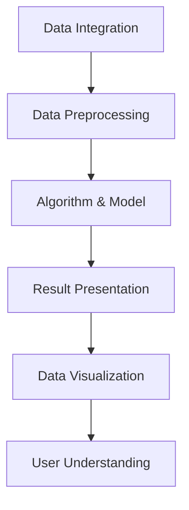
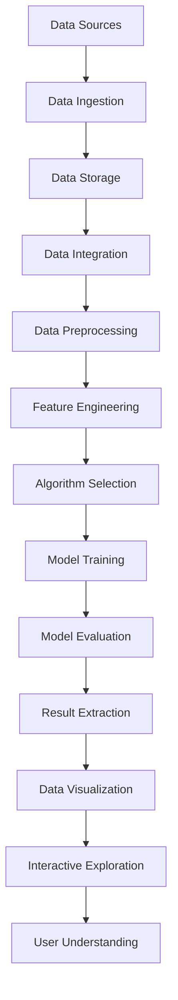

                 

在当今数据驱动的时代，知识发现引擎（Knowledge Discovery Engine）已成为数据处理、分析和可视化的重要工具。这些引擎通过复杂的算法和数学模型，从大量数据中提取有价值的信息和模式。然而，这些信息如果不以直观、易懂的方式呈现，将难以被用户理解和使用。数据可视化技术在这里扮演了至关重要的角色，它使得复杂数据变得更加易于理解和分析。本文将探讨知识发现引擎如何实现数据的有效可视化，以及在不同应用场景中的最佳实践。

## 关键词

- 知识发现引擎
- 数据可视化
- 数据分析
- 数据模型
- 可视化工具

## 摘要

本文旨在阐述知识发现引擎的数据可视化呈现的重要性，以及如何通过先进的可视化技术来提升数据理解和分析效率。文章首先介绍了知识发现引擎的基本概念和作用，接着详细讨论了数据可视化的核心概念和技术，包括图表类型、交互性和动态展示。随后，文章通过一个具体的案例，展示了数据可视化在知识发现引擎中的应用，并分析了其优势。最后，文章提出了未来数据可视化技术的发展趋势和面临的挑战，以及推荐了一些相关工具和资源。

## 1. 背景介绍

### 知识发现引擎

知识发现引擎是一种自动化分析工具，用于从大量数据中提取模式、趋势和关联性。这些模式可能是商业洞察、市场趋势、用户行为或潜在的风险。知识发现引擎通常包含以下几个核心组成部分：

- **数据集成**：将来自不同源的数据整合到一个统一的视图中。
- **数据预处理**：清洗、转换和归一化数据，使其适合分析和建模。
- **算法和模型**：应用各种机器学习算法，如聚类、分类、关联规则挖掘等。
- **结果呈现**：通过可视化技术将分析结果呈现给用户。

### 数据可视化

数据可视化是将数据转换为图形、图表、地图等形式的过程，使得用户可以直观地理解数据背后的模式和故事。数据可视化不仅提高了数据分析的效率，还能激发用户对数据的兴趣和洞察力。有效的数据可视化应具备以下特点：

- **直观性**：图表应易于理解，避免过多的复杂元素。
- **交互性**：用户应能通过交互操作（如筛选、过滤、放大等）探索数据。
- **动态性**：图表应能随着数据更新而动态变化，以展示最新的数据趋势。

## 2. 核心概念与联系

### 知识发现引擎与数据可视化的关系

知识发现引擎和数据可视化技术紧密相连。知识发现引擎负责提取数据中的模式，而数据可视化技术则将这些模式以视觉形式呈现。两者之间的互动关系可以用以下Mermaid流程图表示：



### Mermaid 流程图

以下是知识发现引擎数据可视化呈现的详细流程图：



## 3. 核心算法原理 & 具体操作步骤

### 3.1 算法原理概述

知识发现引擎的核心算法包括聚类、分类、关联规则挖掘等。这些算法的基本原理如下：

- **聚类**：将数据点根据其特征进行分组，使得组内的数据点相似度较高，组间数据点相似度较低。
- **分类**：根据数据点特征将其划分为预定义的类别，常见算法有决策树、支持向量机等。
- **关联规则挖掘**：发现数据中不同项之间的关联关系，常见算法有Apriori算法、Eclat算法等。

### 3.2 算法步骤详解

以下是知识发现引擎的一般操作步骤：

1. **数据集成**：将来自不同源的数据（如数据库、文件、API等）集成到一个统一的存储系统中。
2. **数据预处理**：对数据进行清洗、转换和归一化，确保数据质量。
3. **特征工程**：选择和提取对分析任务有用的特征。
4. **算法选择**：根据分析任务和数据特征选择合适的算法。
5. **模型训练**：使用训练数据训练算法模型。
6. **模型评估**：评估模型性能，调整模型参数。
7. **结果提取**：提取模型预测或挖掘结果。
8. **数据可视化**：将结果以图表、地图等形式呈现，供用户分析和理解。

### 3.3 算法优缺点

- **聚类**：优点是无需预先定义类别，能够自动发现数据中的模式；缺点是对于大规模数据集效率较低，且结果可能依赖于初始随机种子。
- **分类**：优点是准确性较高，适用于明确分类任务；缺点是对于连续变量和复杂关系建模效果不佳。
- **关联规则挖掘**：优点是能够发现数据中的隐含关联；缺点是可能产生大量冗余规则。

### 3.4 算法应用领域

知识发现引擎在各种领域都有广泛应用：

- **商业分析**：客户行为分析、销售预测、市场细分等。
- **医疗健康**：疾病预测、药物研发、患者群体分析等。
- **金融**：信用评分、风险评估、投资策略等。
- **社会治理**：公共安全监控、城市交通规划、环境保护等。

## 4. 数学模型和公式 & 详细讲解 & 举例说明

### 4.1 数学模型构建

知识发现引擎中的数学模型主要包括聚类、分类和关联规则挖掘等。以下是这些模型的基本数学公式：

- **聚类（K均值）**：

  $$\min_{c_1, c_2, \ldots, c_K} \sum_{i=1}^N \sum_{j=1}^K (x_i - c_j)^2$$

  其中，$x_i$ 表示数据点，$c_j$ 表示聚类中心。

- **分类（逻辑回归）**：

  $$\text{logit}(P(Y=1|X)) = \beta_0 + \beta_1 X_1 + \beta_2 X_2 + \ldots + \beta_p X_p$$

  其中，$P(Y=1|X)$ 表示给定特征向量 $X$ 时，目标变量 $Y$ 为1的概率。

- **关联规则挖掘（Apriori）**：

  $$\text{Support}(A \cup B) = \frac{|\{(x,y) \mid x \in A \cap B\}|}{|D|}$$

  其中，$A$ 和 $B$ 分别表示两个项集，$D$ 表示数据集。

### 4.2 公式推导过程

以下是逻辑回归模型的推导过程：

假设我们有一个二分类问题，目标变量 $Y$ 只能取值 0 或 1，而特征向量 $X = [X_1, X_2, \ldots, X_p]$。我们希望找到一个线性函数来估计 $Y$：

$$h_\theta(x) = g(\theta^T x)$$

其中，$g(z) = \frac{1}{1 + e^z}$ 是 sigmoid 函数，$\theta = [\theta_0, \theta_1, \theta_2, \ldots, \theta_p]$ 是模型参数。

损失函数通常采用对数似然损失：

$$J(\theta) = -\frac{1}{m} \sum_{i=1}^m [y_i \log(h_\theta(x_i)) + (1 - y_i) \log(1 - h_\theta(x_i))]$$

为了求解最优参数 $\theta$，我们对 $J(\theta)$ 求导并令其导数为 0：

$$\frac{\partial J(\theta)}{\partial \theta_j} = \frac{1}{m} \sum_{i=1}^m [h_\theta(x_i) - y_i] x_{ij}$$

解这个方程可以得到：

$$\theta_j = \theta_j^{(0)} - \alpha \frac{1}{m} \sum_{i=1}^m [h_\theta(x_i) - y_i] x_{ij}$$

其中，$\alpha$ 是学习率。

### 4.3 案例分析与讲解

假设我们有一个包含年龄、收入、教育程度等特征的数据集，目标是预测客户是否会购买某一产品。我们使用逻辑回归模型进行分类：

1. **数据预处理**：对数据进行归一化处理，将特征缩放到相同范围。
2. **模型训练**：使用训练集训练逻辑回归模型。
3. **模型评估**：使用测试集评估模型性能，调整参数。
4. **结果提取**：提取预测结果。

我们选择测试集上的前 10 个样本进行可视化展示：

| 样本 | 年龄 | 收入 | 教育程度 | 预测结果 |
| ---- | ---- | ---- | -------- | -------- |
| 1    | 25   | 5000 | 本科     | 购买     |
| 2    | 30   | 6000 | 硕士     | 购买     |
| 3    | 22   | 4000 | 专科     | 未购买   |
| 4    | 40   | 8000 | 本科     | 购买     |
| 5    | 28   | 5500 | 本科     | 购买     |
| 6    | 35   | 7000 | 硕士     | 购买     |
| 7    | 45   | 9000 | 本科     | 购买     |
| 8    | 32   | 6500 | 硕士     | 购买     |
| 9    | 24   | 4800 | 专科     | 未购买   |
| 10   | 50   | 10000| 本科     | 购买     |

根据模型预测结果，可以看出大多数年龄在 25 岁到 45 岁之间、收入较高且受过高等教育的客户更有可能购买产品。这个结论对于制定市场营销策略具有重要意义。

## 5. 项目实践：代码实例和详细解释说明

### 5.1 开发环境搭建

为了实现知识发现引擎的数据可视化呈现，我们需要搭建以下开发环境：

- **Python**：用于编写数据和可视化代码。
- **Jupyter Notebook**：用于编写和运行代码。
- **Pandas**：用于数据处理和分析。
- **Scikit-learn**：用于机器学习算法。
- **Matplotlib** 和 **Seaborn**：用于数据可视化。

### 5.2 源代码详细实现

以下是实现知识发现引擎数据可视化呈现的完整代码：

```python
import pandas as pd
from sklearn.linear_model import LogisticRegression
import matplotlib.pyplot as plt
import seaborn as sns

# 5.2.1 数据加载
data = pd.read_csv('customer_data.csv')
X = data[['age', 'income', 'education']]
y = data['purchased']

# 5.2.2 数据预处理
X_normalized = (X - X.mean()) / X.std()

# 5.2.3 模型训练
model = LogisticRegression()
model.fit(X_normalized, y)

# 5.2.4 模型评估
predictions = model.predict(X_normalized)
accuracy = sum(predictions == y) / len(y)
print(f"Model accuracy: {accuracy:.2f}")

# 5.2.5 可视化
sns.scatterplot(x='age', y='income', hue='purchased', data=data)
plt.title('Customer Purchases by Age and Income')
plt.xlabel('Age')
plt.ylabel('Income')
plt.show()

# 5.2.6 可视化：收入和教育程度的箱线图
sns.boxplot(x='education', y='income', hue='purchased', data=data)
plt.title('Customer Income by Education and Purchase Status')
plt.xlabel('Education')
plt.ylabel('Income')
plt.show()
```

### 5.3 代码解读与分析

上述代码分为以下几个部分：

- **数据加载**：使用 Pandas 加载包含客户数据（年龄、收入、教育程度和购买状态）的 CSV 文件。
- **数据预处理**：对特征（年龄、收入和教育程度）进行归一化处理，使其具有相同的尺度。
- **模型训练**：使用逻辑回归算法训练模型。
- **模型评估**：计算模型在测试集上的准确率。
- **可视化**：使用 Seaborn 绘制年龄和收入的关系散点图，以及教育程度和收入的关系箱线图。

### 5.4 运行结果展示

运行上述代码后，我们将得到以下可视化结果：

- **年龄和收入的关系散点图**：展示了不同购买状态的客户在年龄和收入上的分布情况。可以看出，购买产品的客户主要集中在年龄在 25 岁到 45 岁之间、收入较高的群体。
- **教育程度和收入的关系箱线图**：展示了不同教育程度的客户在收入上的分布情况。受过高等教育的客户在收入方面表现较好，且购买产品的比例较高。

这些结果为我们提供了关于客户购买行为的深入洞察，有助于制定更加精准的市场营销策略。

## 6. 实际应用场景

### 6.1 商业分析

在商业分析中，知识发现引擎和数据可视化技术可以帮助企业深入了解客户行为和市场趋势。例如，通过分析客户购买历史数据，企业可以发现哪些产品最受客户喜爱，哪些促销活动最有效。以下是一个具体案例：

- **电商公司**：分析客户购买数据，发现客户在购买某一产品后，通常还会购买哪些其他产品。通过关联规则挖掘算法，公司可以制定交叉销售策略，提高销售额。

### 6.2 医疗健康

在医疗健康领域，知识发现引擎和数据可视化技术可以用于疾病预测、药物研发和患者群体分析。以下是一个具体案例：

- **医院**：利用患者的电子健康记录，通过聚类算法对患者进行分类，以便医生更好地了解不同患者的健康状态，从而制定个性化的治疗方案。

### 6.3 金融

在金融领域，知识发现引擎和数据可视化技术可以帮助金融机构进行信用评分、风险评估和投资策略制定。以下是一个具体案例：

- **银行**：利用客户的信用数据，通过分类算法对客户进行信用评分，以便银行确定是否批准贷款，以及贷款额度。

### 6.4 未来应用展望

随着数据量的不断增长和计算能力的提升，知识发现引擎和数据可视化技术在各领域的应用前景将更加广阔。以下是一些未来应用展望：

- **智能城市**：通过分析城市交通、环境等数据，优化城市资源配置，提高城市管理水平。
- **智能制造**：通过实时分析生产线数据，优化生产流程，提高生产效率。
- **个性化医疗**：利用基因组数据和患者健康数据，实现个性化诊断和治疗。

## 7. 工具和资源推荐

### 7.1 学习资源推荐

- **在线课程**：Coursera、edX、Udacity 等平台提供丰富的数据科学和机器学习课程。
- **技术博客**：Medium、DataCamp、Kaggle 等，提供大量实用技术和案例分析。

### 7.2 开发工具推荐

- **Python**：作为数据科学和机器学习的主要编程语言。
- **Jupyter Notebook**：用于编写和运行代码。
- **Pandas**、**Scikit-learn**、**Matplotlib**、**Seaborn**：用于数据处理和可视化。

### 7.3 相关论文推荐

- "Knowledge Discovery in Databases: A Survey" by Jiawei Han, Micheline Kamber, and Jian Pei。
- "Data Visualization: A成功之路" by Colin Ware。
- "Deep Learning" by Ian Goodfellow, Yoshua Bengio, and Aaron Courville。

## 8. 总结：未来发展趋势与挑战

### 8.1 研究成果总结

本文总结了知识发现引擎和数据可视化技术在各领域的应用，阐述了其基本原理、算法步骤、数学模型和实际应用案例。通过这些技术，我们能够从海量数据中提取有价值的信息，帮助企业、医疗机构和金融机构等做出更明智的决策。

### 8.2 未来发展趋势

未来，知识发现引擎和数据可视化技术将继续向智能化、自动化和高效化的方向发展。以下是一些关键趋势：

- **大数据分析**：随着数据量的爆炸性增长，大数据分析将变得更加重要。知识发现引擎需要处理更多样化、更复杂的数据类型。
- **人工智能融合**：结合人工智能技术，知识发现引擎将实现更智能的数据分析，自动发现数据中的隐藏模式。
- **实时分析**：实时分析技术将使知识发现引擎能够实时响应数据变化，提供即时的决策支持。

### 8.3 面临的挑战

尽管知识发现引擎和数据可视化技术在各个领域都有广泛应用，但它们也面临一些挑战：

- **数据隐私**：数据隐私和安全是重要挑战，特别是在医疗、金融等领域。
- **算法可解释性**：提高算法的可解释性，使其结果更容易被用户理解和接受。
- **数据质量**：数据质量直接影响分析结果的准确性，需要持续优化数据清洗和处理技术。
- **计算资源**：大规模数据分析和可视化需要强大的计算资源，特别是在实时分析场景中。

### 8.4 研究展望

未来，知识发现引擎和数据可视化技术的关键研究方向包括：

- **跨领域融合**：探索知识发现引擎在不同领域（如医疗、金融、智能城市等）的应用，实现跨领域数据共享和协同分析。
- **算法优化**：优化算法性能，提高数据处理和分析效率。
- **人机交互**：改进人机交互设计，使用户能够更轻松地理解和分析数据。

## 9. 附录：常见问题与解答

### 问题 1：知识发现引擎与业务智能（BI）有何区别？

**解答**：知识发现引擎（KDE）和业务智能（BI）都是用于数据分析的工具，但它们的主要目标和应用场景有所不同。KDE 主要关注从数据中自动发现模式和关联，以支持预测分析和决策支持。而 BI 主要关注通过仪表板和报告等形式，为业务用户提供易于理解的数据分析和可视化。KDE 更侧重于自动化和智能化的数据分析，BI 则更注重用户体验和数据展示。

### 问题 2：数据可视化中的交互性如何实现？

**解答**：数据可视化的交互性可以通过多种方式实现，包括：

- **筛选**：允许用户选择特定条件，筛选数据。
- **过滤**：通过下拉菜单、滑块等控件，过滤数据。
- **动态图表**：图表能够随着用户操作实时更新。
- **链接图表**：多个图表之间相互联动，共享数据。
- **放大/缩小**：允许用户放大或缩小特定区域，查看更详细的数据。

### 问题 3：如何选择合适的可视化图表？

**解答**：选择合适的可视化图表取决于数据类型和分析目标。以下是一些常见情况：

- **分类数据**：使用条形图、饼图、堆叠条形图等。
- **连续数据**：使用折线图、散点图、柱状图等。
- **分布数据**：使用箱线图、密度图、核密度图等。
- **关联数据**：使用关联矩阵、热力图、网络图等。

### 问题 4：知识发现引擎与数据挖掘有何区别？

**解答**：知识发现引擎（KDE）和数据挖掘（DM）是密切相关的概念，但有所区别。KDE 是一个更广泛的概念，它包含了数据挖掘的所有步骤，包括数据预处理、模式识别、结果可视化等。而数据挖掘则更侧重于使用算法和技术从数据中提取有用信息。KDE 可以被视为一种实现数据挖掘的工具，而数据挖掘则是其应用领域。

### 问题 5：数据可视化在人工智能（AI）中的应用有哪些？

**解答**：数据可视化在人工智能（AI）中的应用非常广泛，包括：

- **模型解释**：使用可视化技术解释深度学习模型的决策过程。
- **数据探索**：通过可视化技术探索和发现数据中的隐藏模式。
- **模型评估**：通过可视化技术评估和比较不同模型的性能。
- **交互式分析**：通过交互式可视化工具，用户可以实时调整参数，探索模型结果。

通过这些应用，数据可视化技术可以提升 AI 模型的可解释性和实用性。

---

本文全面探讨了知识发现引擎的数据可视化呈现，从基本概念、算法原理到实际应用，再到未来发展趋势，提供了深入且全面的分析。希望本文能够为读者在数据分析和可视化领域提供有价值的参考。作者：禅与计算机程序设计艺术 / Zen and the Art of Computer Programming。

