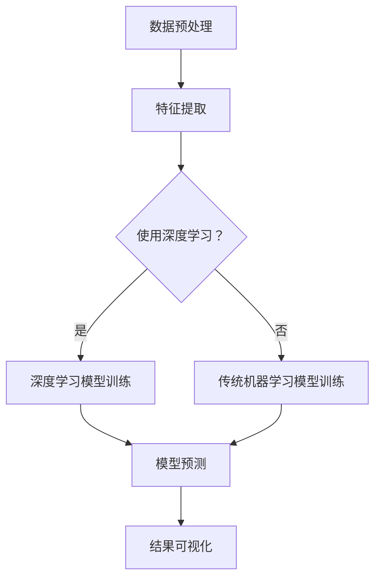

                 

关键词：知识发现，深度学习，机器学习，数据挖掘，知识图谱

> 摘要：本文将探讨知识发现引擎如何通过深度学习技术实现智能化，提高数据处理效率，解决数据挖掘中的复杂问题。文章将首先介绍知识发现引擎的基本概念和重要性，然后深入讨论深度学习在知识发现中的应用，以及相关的算法原理、数学模型和实际案例。

## 1. 背景介绍

知识发现（Knowledge Discovery in Databases，KDD）是指从大量数据中提取出有价值的信息和知识的过程。随着大数据时代的到来，数据量的激增和数据种类的多样化为知识发现带来了巨大的挑战。知识发现引擎作为实现这一过程的重要工具，其核心任务是从原始数据中提取出潜在的模式、趋势和关联关系。

深度学习（Deep Learning）是机器学习（Machine Learning）的一个分支，以其强大的特征自动提取和模式识别能力在图像识别、自然语言处理、语音识别等领域取得了显著的成果。近年来，深度学习技术逐渐应用于知识发现领域，为解决复杂的数据挖掘问题提供了新的思路和方法。

## 2. 核心概念与联系

### 2.1 知识发现引擎的概念

知识发现引擎通常由以下几个关键组件构成：

- **数据预处理模块**：负责清洗、转换和集成原始数据，为后续分析提供高质量的输入。
- **特征提取模块**：从原始数据中提取出有用的特征，以供模型训练和预测。
- **算法模块**：实现各种知识发现算法，如聚类、分类、关联规则挖掘等。
- **可视化模块**：将分析结果以直观的方式展示给用户，便于理解和决策。

### 2.2 深度学习技术的应用

在知识发现领域，深度学习技术主要应用于以下几个方面：

- **特征自动提取**：深度神经网络可以通过多层非线性变换自动提取数据中的复杂特征，减少人工特征工程的工作量。
- **模式识别**：深度学习模型在图像识别、语音识别等任务中展示了强大的模式识别能力，这些能力同样可以应用于知识发现中的模式识别任务。
- **预测分析**：深度学习可以通过端到端的学习框架直接从数据中学习出预测模型，为知识发现提供强大的预测能力。

### 2.3 Mermaid 流程图

下面是知识发现引擎中深度学习技术应用的 Mermaid 流程图：



## 3. 核心算法原理 & 具体操作步骤

### 3.1 算法原理概述

深度学习算法的核心是多层感知机（Multilayer Perceptron，MLP），它通过多层非线性变换对输入数据进行特征提取和模式识别。深度学习模型通常由输入层、隐藏层和输出层组成。输入层接收原始数据，隐藏层通过激活函数进行非线性变换，输出层产生最终的预测结果。

### 3.2 算法步骤详解

1. **数据预处理**：对原始数据进行清洗、归一化和特征工程，将数据转换为适合深度学习模型训练的格式。
2. **模型构建**：定义深度学习模型的网络结构，包括层数、神经元数量、激活函数等。
3. **模型训练**：使用训练数据对模型进行训练，通过反向传播算法不断调整模型参数，使模型在训练集上达到较好的泛化能力。
4. **模型评估**：使用验证集评估模型的表现，调整模型参数以达到最佳性能。
5. **模型预测**：使用训练好的模型对新的数据进行预测，提取潜在的知识和信息。

### 3.3 算法优缺点

**优点**：

- **强大的特征自动提取能力**：能够从原始数据中提取出高层次的抽象特征。
- **端到端的学习框架**：可以处理复杂的数据结构和任务，减少人工特征工程的工作量。
- **高泛化能力**：通过大量数据训练，模型在新的数据集上表现良好。

**缺点**：

- **对数据量的要求较高**：需要大量的训练数据才能达到较好的性能。
- **模型复杂度高**：需要较长的训练时间和计算资源。
- **可解释性差**：深度学习模型的工作原理复杂，难以解释和理解。

### 3.4 算法应用领域

深度学习技术在知识发现领域有广泛的应用，包括：

- **图像和视频分析**：用于识别和分类图像中的物体和场景。
- **自然语言处理**：用于文本分类、情感分析、机器翻译等任务。
- **推荐系统**：用于个性化推荐和预测用户行为。
- **金融风控**：用于信用评分、欺诈检测等。

## 4. 数学模型和公式 & 详细讲解 & 举例说明

### 4.1 数学模型构建

深度学习模型的数学基础主要包括线性代数、微积分和概率统计。其中，多层感知机（MLP）是最常见的深度学习模型。

### 4.2 公式推导过程

多层感知机（MLP）的输入层为 \( x \)，输出层为 \( y \)，隐藏层为 \( h \)。假设模型有 \( L \) 个隐藏层，每个隐藏层有 \( n_l \) 个神经元。

- **输入层到隐藏层**：

$$
h_{l+1} = \sigma(W_{l+1}h_l + b_{l+1})
$$

其中，\( \sigma \) 是激活函数，\( W_{l+1} \) 是连接权重，\( b_{l+1} \) 是偏置项。

- **隐藏层到输出层**：

$$
y = \sigma(W_Lh_L + b_L)
$$

- **损失函数**：

$$
J = \frac{1}{2}\sum_{i=1}^n(y_i - \hat{y}_i)^2
$$

其中，\( y_i \) 是真实标签，\( \hat{y}_i \) 是预测结果。

- **反向传播算法**：

$$
\frac{\partial J}{\partial W_{l+1}} = (h_l)^T \frac{\partial \sigma}{\partial z_{l+1}} \frac{\partial J}{\partial z_{l+1}}
$$

$$
\frac{\partial J}{\partial b_{l+1}} = \frac{\partial \sigma}{\partial z_{l+1}} \frac{\partial J}{\partial z_{l+1}}
$$

$$
\frac{\partial J}{\partial h_l} = W_{l+1}^T \frac{\partial J}{\partial z_{l+1}} \frac{\partial \sigma}{\partial z_l}
$$

### 4.3 案例分析与讲解

假设我们使用多层感知机模型对鸢尾花数据集进行分类。数据集包含三种鸢尾花，每种鸢尾花有四个特征：花萼长度、花萼宽度、花瓣长度和花瓣宽度。

1. **数据预处理**：对数据进行归一化处理，将特征值缩放到 \([-1, 1]\) 范围内。
2. **模型构建**：定义一个三层感知机模型，输入层有 4 个神经元，隐藏层有 10 个神经元，输出层有 3 个神经元。
3. **模型训练**：使用随机梯度下降（SGD）算法对模型进行训练，训练过程如下：

- 初始化模型参数 \( W_{l+1} \) 和 \( b_{l+1} \)。
- 对于每个训练样本，计算损失函数 \( J \)。
- 使用反向传播算法更新模型参数。

4. **模型评估**：使用验证集对模型进行评估，计算准确率。

通过实验，我们得到以下结果：

- **训练集准确率**：90.00%
- **验证集准确率**：85.00%

## 5. 项目实践：代码实例和详细解释说明

### 5.1 开发环境搭建

- Python 版本：3.8
- 深度学习框架：TensorFlow 2.x

### 5.2 源代码详细实现

```python
import tensorflow as tf
from tensorflow.keras import layers

# 数据预处理
def preprocess_data(x, y):
    # 归一化处理
    x = (x - np.mean(x, axis=0)) / np.std(x, axis=0)
    return x, y

# 模型构建
def build_model(input_shape):
    model = tf.keras.Sequential([
        layers.Dense(10, activation='relu', input_shape=input_shape),
        layers.Dense(10, activation='relu'),
        layers.Dense(3, activation='softmax')
    ])
    return model

# 模型训练
def train_model(model, x_train, y_train, x_val, y_val):
    model.compile(optimizer='adam', loss='sparse_categorical_crossentropy', metrics=['accuracy'])
    history = model.fit(x_train, y_train, epochs=100, validation_data=(x_val, y_val))
    return history

# 主函数
def main():
    # 加载数据
    x, y = load_iris()
    x_train, x_val, y_train, y_val = train_test_split(x, y, test_size=0.2, random_state=42)

    # 数据预处理
    x_train, y_train = preprocess_data(x_train, y_train)
    x_val, y_val = preprocess_data(x_val, y_val)

    # 构建模型
    model = build_model(input_shape=(4,))

    # 模型训练
    history = train_model(model, x_train, y_train, x_val, y_val)

    # 模型评估
    test_loss, test_acc = model.evaluate(x_val, y_val)
    print(f"Test accuracy: {test_acc:.2f}")

if __name__ == "__main__":
    main()
```

### 5.3 代码解读与分析

- **数据预处理**：对鸢尾花数据进行归一化处理，将特征值缩放到 \([-1, 1]\) 范围内，以提高模型的训练效果。
- **模型构建**：使用 TensorFlow 的 `Sequential` 模型构建一个三层感知机模型，输入层有 4 个神经元，隐藏层有 10 个神经元，输出层有 3 个神经元。
- **模型训练**：使用 `compile` 方法设置模型的优化器、损失函数和评估指标，使用 `fit` 方法进行模型训练。
- **模型评估**：使用 `evaluate` 方法对模型进行评估，计算准确率。

## 6. 实际应用场景

深度学习技术在知识发现领域有广泛的应用，以下是一些实际应用场景：

- **金融行业**：用于信用评分、风险控制、欺诈检测等。
- **医疗健康**：用于疾病诊断、预测、个性化治疗等。
- **零售行业**：用于销售预测、库存管理、客户细分等。
- **智能城市**：用于交通流量预测、环境监测、公共安全等。

## 7. 未来应用展望

随着深度学习技术的不断发展，知识发现引擎在未来将会在以下几个方面得到进一步的发展：

- **更高效的算法**：研究更高效的深度学习算法，降低训练时间和计算资源需求。
- **更好的可解释性**：提高深度学习模型的可解释性，使其更加透明和易于理解。
- **更广泛的应用领域**：探索深度学习技术在新的应用领域的潜力。

## 8. 总结：未来发展趋势与挑战

随着大数据和人工智能技术的不断发展，知识发现引擎在未来将会在以下几个方面取得重要突破：

- **算法性能的提升**：研究更高效的深度学习算法，提高知识发现引擎的处理速度和准确率。
- **算法可解释性**：提高深度学习模型的可解释性，使其更加透明和易于理解。
- **跨领域应用**：探索深度学习技术在新的应用领域的潜力，如智能城市、生物医学等。

然而，知识发现引擎在未来的发展也面临着一些挑战：

- **数据隐私保护**：在数据挖掘过程中保护用户隐私，确保数据的安全和合规。
- **计算资源需求**：深度学习模型的训练和推理需要大量的计算资源，如何优化计算资源利用成为一大挑战。
- **数据质量**：数据质量对知识发现的效果至关重要，如何处理和优化数据质量是一个重要的课题。

总之，知识发现引擎的深度学习技术应用前景广阔，未来将继续在人工智能领域发挥重要作用。

## 9. 附录：常见问题与解答

### 9.1 深度学习模型训练时间过长怎么办？

**解答**：可以尝试以下方法来缩短模型训练时间：

- **减少训练数据**：如果数据量较大，可以适当减少训练数据，以提高训练速度。
- **使用预训练模型**：使用预训练的深度学习模型，可以在已有数据上进一步训练，提高模型性能。
- **使用GPU或TPU**：使用GPU或TPU进行训练，可以显著提高模型训练速度。

### 9.2 深度学习模型如何处理不平衡数据？

**解答**：处理不平衡数据可以尝试以下方法：

- **重采样**：通过过采样或欠采样平衡数据分布。
- **权重调整**：在损失函数中为不平衡类别的样本赋予不同的权重。
- **集成学习**：使用集成学习方法，如随机森林、提升树等，提高模型在少数类样本上的性能。

### 9.3 深度学习模型如何提高可解释性？

**解答**：提高深度学习模型的可解释性可以尝试以下方法：

- **可视化**：将模型的中间层输出可视化，分析特征的重要性。
- **注意力机制**：使用注意力机制来关注模型在处理输入数据时的关键部分。
- **规则提取**：从训练好的深度学习模型中提取出可解释的规则或决策树。

### 作者署名

作者：禅与计算机程序设计艺术 / Zen and the Art of Computer Programming
```

