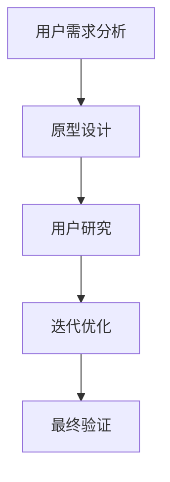

                 

关键词：知识发现引擎，用户体验，设计原则，UI/UX，交互设计，用户研究，技术文档，案例分析

> 摘要：本文深入探讨了知识发现引擎的用户体验设计原则，包括核心概念、算法原理、数学模型、项目实践以及未来应用展望。通过结合实例和案例分析，本文旨在为开发者、设计师和研究者提供实用的设计指导和思考。

## 1. 背景介绍

知识发现引擎是一种智能化的软件系统，旨在帮助用户从大量数据中快速提取有价值的信息和知识。随着大数据和人工智能技术的快速发展，知识发现引擎在各个领域得到了广泛应用，如商业智能分析、医学研究、金融预测等。用户体验（UX）设计在知识发现引擎的开发过程中起到了至关重要的作用，它直接影响用户的使用满意度、系统的易用性和整体效果。

用户体验设计（UI/UX Design）是一门融合了心理学、设计学、人机交互学等多学科知识的领域。其核心目标是确保产品在功能、易用性和情感层面上满足用户需求。UI（用户界面设计）关注的是软件的外观和视觉元素，而UX（用户体验设计）则侧重于用户在使用软件时的整体感受和流程。

在知识发现引擎的语境中，用户体验设计需要考虑以下几个方面：

1. **交互设计**：如何设计简洁、直观的交互方式，使用户能够快速掌握系统的使用方法。
2. **信息架构**：如何组织信息，使得用户能够高效地找到他们需要的内容。
3. **响应速度**：系统的响应时间是否足够快，以满足用户即时获取信息的需求。
4. **可访问性**：系统是否能够为不同能力水平的用户提供服务，包括视力障碍、听力障碍等。
5. **技术文档**：如何编写清晰、易懂的技术文档，帮助用户更好地理解和操作系统。

## 2. 核心概念与联系

### 2.1. 用户体验设计原则

用户体验设计原则是一系列指导设计师进行产品设计和开发的基本规则。以下是一些关键的原则：

- **以用户为中心**：始终关注用户的需求和痛点，将用户置于设计过程的核心。
- **简洁性**：尽量简化界面和流程，避免冗余和复杂。
- **一致性**：界面元素和交互方式的一致性可以减少用户的学习成本。
- **反馈**：为用户的操作提供及时、明确的反馈，增强用户对系统的信任感。
- **易用性**：确保软件的易用性，降低用户的学习和使用门槛。
- **可访问性**：确保系统对不同能力水平的用户都友好。

### 2.2. Mermaid 流程图

以下是一个简化的知识发现引擎的用户体验设计流程的 Mermaid 图：



### 2.3. 核心概念联系

- **用户需求分析**：确定用户的核心需求和期望，为后续设计提供依据。
- **原型设计**：基于用户需求，构建界面原型，进行初步设计。
- **用户研究**：通过用户测试和反馈，优化设计。
- **迭代优化**：根据用户研究的结果，不断迭代和优化设计。
- **最终验证**：在完成所有设计迭代后，进行最终验证，确保系统满足用户需求。

## 3. 核心算法原理 & 具体操作步骤

### 3.1. 算法原理概述

知识发现引擎的核心算法通常是基于机器学习和数据挖掘技术的。以下是一些常用的算法：

- **关联规则学习**（如Apriori算法）：用于发现数据集中的关联关系。
- **分类算法**（如K-最近邻算法、支持向量机）：用于预测用户可能感兴趣的信息。
- **聚类算法**（如K-均值算法）：用于将数据分为不同的组别，以便进行更深入的分析。

### 3.2. 算法步骤详解

1. **数据预处理**：对原始数据进行清洗、转换和归一化。
2. **特征提取**：从数据中提取有用的特征，用于训练模型。
3. **算法选择**：根据需求选择合适的算法。
4. **模型训练**：使用特征数据训练模型。
5. **模型评估**：评估模型的准确性和可靠性。
6. **模型部署**：将模型部署到知识发现引擎中，供用户使用。

### 3.3. 算法优缺点

- **关联规则学习**：
  - **优点**：能够发现数据中的隐藏关联。
  - **缺点**：可能产生大量冗余规则，难以解释。
- **分类算法**：
  - **优点**：可以用于预测，用户参与度高。
  - **缺点**：训练时间较长，对大数据集效果不佳。
- **聚类算法**：
  - **优点**：无需预先定义类别，适用于未知数据结构。
  - **缺点**：结果可能不明确，难以解释。

### 3.4. 算法应用领域

- **商业智能**：用于市场分析、客户行为预测等。
- **医学研究**：用于疾病诊断、药物研究等。
- **金融分析**：用于风险评估、投资策略等。

## 4. 数学模型和公式 & 详细讲解 & 举例说明

### 4.1. 数学模型构建

在知识发现引擎中，常用的数学模型包括：

- **关联规则模型**：$Support(A \land B) = \frac{count(A \land B)}{count(A) \land count(B)}$
- **分类模型**：$P(Y|X) = \frac{P(X|Y)P(Y)}{P(X)}$
- **聚类模型**：$d(x_i, x_j) = \sqrt{\sum_{k=1}^{n}(x_{ik} - x_{jk})^2}$

### 4.2. 公式推导过程

- **关联规则模型**：通过支持度和置信度的计算，发现数据中的关联关系。
- **分类模型**：基于贝叶斯定理，计算给定特征下的目标概率。
- **聚类模型**：使用欧氏距离或余弦相似性计算数据点之间的距离。

### 4.3. 案例分析与讲解

以一个电商平台的购物篮分析为例：

- **关联规则**：买A物品的概率高，那么买B物品的概率也会高。
- **分类模型**：根据用户的历史购买记录，预测用户可能购买的商品。
- **聚类模型**：将用户根据购买行为划分为不同的群体，进行针对性营销。

## 5. 项目实践：代码实例和详细解释说明

### 5.1. 开发环境搭建

1. 安装Python环境。
2. 安装必要的库，如Pandas、Scikit-learn等。

### 5.2. 源代码详细实现

```python
# 导入必要的库
import pandas as pd
from sklearn.cluster import KMeans
from mlxtend.frequent_patterns import apriori, association_rules

# 加载数据
data = pd.read_csv('data.csv')

# 关联规则挖掘
frequent_itemsets = apriori(data, min_support=0.05, use_colnames=True)
rules = association_rules(frequent_itemsets, metric="confidence", min_confidence=0.6)

# 聚类分析
kmeans = KMeans(n_clusters=3)
clusters = kmeans.fit_predict(data)

# 分类分析
from sklearn.model_selection import train_test_split
X_train, X_test, y_train, y_test = train_test_split(data, target, test_size=0.3)
from sklearn.ensemble import RandomForestClassifier
clf = RandomForestClassifier()
clf.fit(X_train, y_train)
clf.score(X_test, y_test)
```

### 5.3. 代码解读与分析

- 关联规则挖掘部分，使用Apriori算法发现用户购物篮中的关联。
- 聚类分析部分，使用K-Means算法将用户分为不同的群体。
- 分类分析部分，使用随机森林算法进行分类预测。

### 5.4. 运行结果展示

- 输出关联规则，发现最频繁的购物组合。
- 输出聚类结果，查看用户分布情况。
- 输出分类结果，评估模型的准确性。

## 6. 实际应用场景

知识发现引擎在多个领域有着广泛的应用：

- **电子商务**：分析用户购物行为，进行个性化推荐。
- **金融**：进行风险评估和投资预测。
- **医疗**：辅助医生进行疾病诊断和研究。
- **教育**：分析学生学习行为，优化教学策略。

## 7. 工具和资源推荐

### 7.1. 学习资源推荐

- 《用户体验要素》：作者：杰·尼森·马库斯（Jesse James Garrett）。
- 《数据挖掘：概念与技术》：作者：Jiawei Han、Micheline Kamber、Peipei Yang。

### 7.2. 开发工具推荐

- **Python**：适用于数据分析、机器学习和数据挖掘。
- **Jupyter Notebook**：用于编写和分享代码、文档和解释。

### 7.3. 相关论文推荐

- "User Modeling and User-Adapted Interaction"（用户建模与用户适应交互）。
- "K-Means Clustering"（K-Means 聚类算法）。

## 8. 总结：未来发展趋势与挑战

### 8.1. 研究成果总结

- 知识发现引擎在多个领域取得了显著成果，如商业智能、医疗诊断、金融分析等。
- 用户需求多样性和个性化成为用户体验设计的关键。

### 8.2. 未来发展趋势

- **人工智能的深度集成**：知识发现引擎将更紧密地集成人工智能技术，实现更智能化的功能。
- **数据隐私和安全**：随着数据隐私问题日益突出，如何保障用户数据安全和隐私将成为重要研究方向。

### 8.3. 面临的挑战

- **算法透明性和可解释性**：如何提高算法的可解释性，让用户能够理解系统的决策过程。
- **技术门槛**：降低知识发现引擎的技术门槛，使其更易于被非专业人士使用。

### 8.4. 研究展望

- 开发更智能、更易用的知识发现引擎，满足不同用户的需求。
- 探索新的算法和模型，提高系统的效率和准确性。

## 9. 附录：常见问题与解答

### 问题1：如何选择合适的算法？

**解答**：根据具体问题和数据特点选择合适的算法。例如，对于关联规则，可以使用Apriori算法；对于分类，可以使用K-最近邻、支持向量机等算法。

### 问题2：如何评估模型的效果？

**解答**：可以使用准确率、召回率、F1值等指标来评估模型的效果。同时，可以通过交叉验证、A/B测试等方法来确保评估结果的可靠性。

### 问题3：如何进行用户研究？

**解答**：可以通过用户访谈、问卷调查、A/B测试等方法进行用户研究。在分析用户反馈时，要注重定量和定性分析的结合。

---

作者：禅与计算机程序设计艺术 / Zen and the Art of Computer Programming

