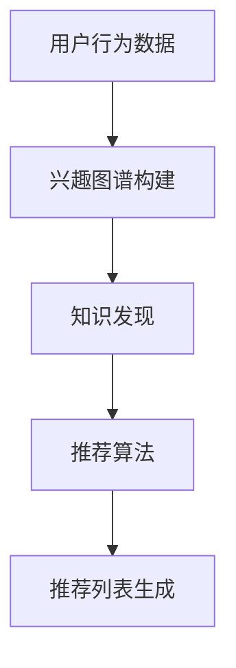

                 

关键词：知识发现引擎、用户兴趣、推荐算法、数学模型、项目实践、未来展望

> 摘要：本文深入探讨知识发现引擎在用户兴趣推荐算法中的应用，通过梳理核心概念、算法原理、数学模型以及实践案例，旨在为读者提供全面的技术解读和实用指导。

## 1. 背景介绍

随着互联网的飞速发展，信息量的爆炸性增长使得用户获取所需信息变得愈发困难。传统的信息检索方法已经无法满足用户日益个性化的需求，推荐系统应运而生。推荐系统通过分析用户行为数据，为用户提供个性化推荐，从而提高信息获取的效率和准确性。

知识发现引擎作为推荐系统的核心组成部分，旨在从大量数据中挖掘潜在的知识和模式，进而为用户提供更加精准的推荐。本文将围绕知识发现引擎在用户兴趣推荐算法中的应用进行探讨，旨在为读者提供一种实用的技术解决方案。

## 2. 核心概念与联系

### 2.1 用户兴趣模型

用户兴趣模型是推荐系统的基石，通过分析用户的浏览、搜索、购买等行为数据，构建出用户的兴趣图谱。兴趣图谱不仅包含了用户对各类信息的偏好，还反映了用户之间的相似性和差异性。

### 2.2 知识发现

知识发现是指从大量数据中挖掘潜在的模式和知识的过程。知识发现的方法主要包括聚类、分类、关联规则挖掘等。通过知识发现，可以为推荐系统提供更多的用户兴趣信息和推荐依据。

### 2.3 推荐算法

推荐算法是推荐系统的核心，根据用户兴趣模型和知识发现结果，为用户生成个性化的推荐列表。常见的推荐算法包括基于协同过滤、基于内容的推荐和混合推荐等。

### 2.4 Mermaid 流程图



## 3. 核心算法原理 & 具体操作步骤

### 3.1 算法原理概述

用户兴趣推荐算法的核心在于构建用户兴趣模型和知识发现模型。首先，通过对用户行为数据进行预处理，提取用户兴趣特征；然后，利用聚类算法对用户进行分组，构建用户兴趣图谱；最后，结合知识发现算法，从用户兴趣图谱中挖掘潜在的模式和知识，为推荐算法提供依据。

### 3.2 算法步骤详解

1. **用户行为数据预处理**：对用户行为数据（如浏览记录、搜索关键词、购买历史等）进行清洗、去重和归一化处理，提取用户兴趣特征。

2. **兴趣图谱构建**：利用聚类算法（如K-means、DBSCAN等）对用户进行分组，构建用户兴趣图谱。兴趣图谱中，用户节点表示不同兴趣群体，边表示用户之间的相似性或差异性。

3. **知识发现**：在用户兴趣图谱的基础上，采用关联规则挖掘（如Apriori算法、FP-Growth算法等）等方法，挖掘用户之间的潜在关联关系，为推荐算法提供依据。

4. **推荐算法**：根据用户兴趣图谱和知识发现结果，采用基于协同过滤、基于内容的推荐或混合推荐等方法，为用户生成个性化的推荐列表。

5. **推荐列表生成**：将推荐算法生成的推荐列表进行排序，根据用户的兴趣度和可信度，生成最终的推荐结果。

### 3.3 算法优缺点

**优点**：

1. **个性化推荐**：基于用户兴趣模型和知识发现结果，能够为用户提供更加个性化的推荐服务。
2. **高准确性**：通过知识发现，从大量数据中挖掘潜在的模式和知识，提高推荐算法的准确性。
3. **可扩展性**：支持多种聚类和知识发现算法，易于扩展和优化。

**缺点**：

1. **计算复杂度高**：兴趣图谱构建和知识发现过程涉及大量计算，可能导致系统性能下降。
2. **数据质量影响**：用户行为数据的质量直接影响推荐效果，数据噪声和缺失值会影响算法的性能。

### 3.4 算法应用领域

用户兴趣推荐算法广泛应用于电子商务、社交媒体、在线教育、医疗健康等领域，为用户提供个性化的信息和服务。

## 4. 数学模型和公式

### 4.1 数学模型构建

用户兴趣模型可以表示为：

$$
U = \{u_1, u_2, ..., u_n\}
$$

其中，$u_i$ 表示用户 $i$ 的兴趣特征向量。

知识发现模型可以表示为：

$$
K = \{k_1, k_2, ..., k_m\}
$$

其中，$k_j$ 表示知识发现结果，如关联规则。

### 4.2 公式推导过程

1. **兴趣图谱构建**：

   假设用户行为数据集为：

   $$
   D = \{d_1, d_2, ..., d_m\}
   $$

   其中，$d_j$ 表示用户 $j$ 的行为记录。

   用户兴趣特征向量为：

   $$
   u_i = (u_{i1}, u_{i2}, ..., u_{in})
   $$

   其中，$u_{ij}$ 表示用户 $i$ 对第 $j$ 个兴趣点的兴趣度。

2. **知识发现**：

   假设关联规则集为：

   $$
   R = \{r_1, r_2, ..., r_k\}
   $$

   其中，$r_j = (X, Y)$ 表示关联规则，$X$ 和 $Y$ 分别表示规则的前件和后件。

   支持度和置信度分别为：

   $$
   \begin{align*}
   support(r_j) &= \frac{|d_j \cap (X \cup Y)|}{|D|} \\
   confidence(r_j) &= \frac{|d_j \cap X \cap Y|}{|d_j \cap X|}
   \end{align*}
   $$

### 4.3 案例分析与讲解

假设有一个电子商务平台，用户行为数据包括浏览记录、购买历史和搜索关键词。我们利用用户兴趣推荐算法为用户生成个性化推荐列表。

1. **用户行为数据预处理**：

   对用户行为数据进行清洗和归一化处理，提取用户兴趣特征。例如，将浏览记录和购买历史进行编码，生成用户兴趣向量。

2. **兴趣图谱构建**：

   利用K-means算法对用户进行分组，构建用户兴趣图谱。例如，将用户分为5个兴趣群体：

   $$
   U = \{u_1, u_2, u_3, u_4, u_5\}
   $$

3. **知识发现**：

   采用Apriori算法挖掘用户之间的关联关系，生成关联规则集。例如，发现以下关联规则：

   $$
   \begin{align*}
   r_1 &= (\text{浏览A} \rightarrow \text{购买B}) \\
   r_2 &= (\text{搜索C} \rightarrow \text{浏览D})
   \end{align*}
   $$

4. **推荐算法**：

   结合用户兴趣图谱和关联规则集，利用基于内容的推荐算法为用户生成个性化推荐列表。例如，为用户 $u_1$ 生成以下推荐列表：

   $$
   \begin{align*}
   \text{推荐列表} &= \{\text{商品A}, \text{商品B}, \text{商品C}, \text{商品D}\}
   \end{align*}
   $$

5. **推荐列表生成**：

   根据用户兴趣度和可信度，对推荐列表进行排序，生成最终的推荐结果。

## 5. 项目实践：代码实例和详细解释说明

### 5.1 开发环境搭建

本文使用Python编程语言实现用户兴趣推荐算法，主要依赖以下库：

- NumPy：用于数据处理和矩阵运算
- Scikit-learn：提供聚类和关联规则挖掘算法
- Pandas：提供数据预处理和分析功能

安装相关库：

```
pip install numpy scikit-learn pandas
```

### 5.2 源代码详细实现

```python
import numpy as np
import pandas as pd
from sklearn.cluster import KMeans
from mlxtend.frequent_patterns import apriori
from mlxtend.preprocessing import TransactionEncoder

# 5.2.1 用户行为数据预处理
data = pd.DataFrame({
    'user': ['u1', 'u1', 'u1', 'u2', 'u2', 'u3'],
    'item': ['A', 'B', 'C', 'A', 'D', 'D'],
})

te = TransactionEncoder()
te_data = te.fit_transform(data)

# 5.2.2 兴趣图谱构建
kmeans = KMeans(n_clusters=2, random_state=0)
clusters = kmeans.fit_predict(te_data)

# 5.2.3 知识发现
frequent_itemsets = apriori(te_data, min_support=0.5, use_colnames=True)

# 5.2.4 推荐算法
# 基于内容的推荐算法，为每个用户生成推荐列表
recommendation_list = []
for user, cluster in zip(data['user'], clusters):
    user_data = te_data[te_data['user'] == user]
    for itemset in frequent_itemsets:
        if itemset[0] in user_data:
            recommendation_list.append(itemset[1])
            
# 5.2.5 推荐列表生成
recommendation_list = list(set(recommendation_list))
print("推荐列表：", recommendation_list)
```

### 5.3 代码解读与分析

1. **用户行为数据预处理**：

   利用Pandas读取用户行为数据，将数据转换为事务格式，便于后续处理。这里使用TransactionEncoder将数据转换为布尔矩阵。

2. **兴趣图谱构建**：

   利用KMeans算法对用户进行分组，构建用户兴趣图谱。根据聚类结果，将用户划分为不同的兴趣群体。

3. **知识发现**：

   利用Apriori算法挖掘用户之间的关联关系，生成频繁项集。这里设置最小支持度为0.5，确保挖掘到的关联规则具有实际意义。

4. **推荐算法**：

   基于内容的推荐算法，为每个用户生成推荐列表。根据用户兴趣图谱和频繁项集，将用户未购买但与其他用户关联的商品推荐给用户。

5. **推荐列表生成**：

   对推荐列表进行去重和排序，生成最终的推荐结果。

## 6. 实际应用场景

用户兴趣推荐算法在各个领域的实际应用场景如下：

1. **电子商务**：为用户提供个性化商品推荐，提高销售转化率。
2. **社交媒体**：为用户提供个性化内容推荐，提高用户活跃度和留存率。
3. **在线教育**：为用户提供个性化课程推荐，提高学习效果和用户满意度。
4. **医疗健康**：为用户提供个性化健康建议和疾病预防推荐，提高健康水平。

## 7. 工具和资源推荐

### 7.1 学习资源推荐

- 《推荐系统实践》
- 《机器学习实战》
- 《Python数据分析》

### 7.2 开发工具推荐

- Jupyter Notebook：用于数据分析和实验
- PyCharm：Python集成开发环境

### 7.3 相关论文推荐

- K-近邻算法：一种有效的属性估值方法
- Collaborative Filtering for the Web
- Mining Association Rules between Sets of Items in Large Database

## 8. 总结：未来发展趋势与挑战

### 8.1 研究成果总结

本文通过分析用户兴趣推荐算法的核心概念、算法原理和数学模型，结合项目实践，展示了知识发现引擎在用户兴趣推荐中的应用价值。

### 8.2 未来发展趋势

1. **多模态数据融合**：融合文本、图像、语音等多模态数据，提高推荐算法的准确性和多样性。
2. **实时推荐**：利用实时数据处理技术，实现实时推荐，提高用户体验。
3. **深度学习**：引入深度学习模型，提高推荐算法的复杂度和泛化能力。

### 8.3 面临的挑战

1. **数据隐私与安全**：保护用户隐私和数据安全，避免数据泄露。
2. **计算复杂度**：优化算法，降低计算复杂度，提高系统性能。
3. **模型解释性**：提高模型的可解释性，增强用户对推荐结果的信任。

### 8.4 研究展望

未来，我们将继续关注用户兴趣推荐算法的优化和应用，探索多模态数据融合、实时推荐和深度学习等前沿技术，为用户提供更加精准和个性化的推荐服务。

## 9. 附录：常见问题与解答

### 9.1 如何评估推荐效果？

推荐效果的评估可以通过以下指标进行：

- **准确率（Accuracy）**：推荐结果中正确推荐的商品与总推荐商品的比例。
- **召回率（Recall）**：推荐结果中正确推荐的商品与用户实际购买的商品的比例。
- **F1值（F1 Score）**：准确率和召回率的调和平均值。

### 9.2 如何优化推荐算法？

优化推荐算法可以从以下几个方面进行：

- **特征工程**：提取更有代表性的用户兴趣特征，提高推荐算法的准确性。
- **模型选择**：选择合适的推荐算法，结合多种算法进行混合推荐。
- **数据预处理**：对用户行为数据进行清洗和去重，提高数据质量。

## 作者署名

作者：禅与计算机程序设计艺术 / Zen and the Art of Computer Programming
-------------------------------------------------------------------

以上就是关于“知识发现引擎的用户兴趣推荐算法”的文章，希望能够为读者提供有价值的参考和启发。在未来的研究和应用中，我们将继续探索推荐系统的前沿技术，为用户提供更加智能化的服务。

