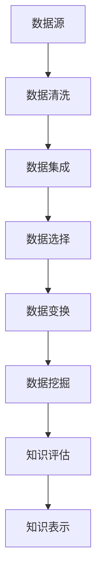

                 

  
关键词：知识发现、大数据、人工智能、信息挖掘、知识图谱、机器学习

摘要：在当今信息爆炸的时代，如何从海量数据中挖掘出有价值的信息，成为企业和研究机构面临的重要课题。本文旨在探讨知识发现引擎这一新兴技术，通过介绍其核心概念、算法原理、数学模型以及实际应用，帮助读者理解知识发现引擎在信息挖掘中的关键作用，并展望其未来的发展趋势。

## 1. 背景介绍

随着互联网和移动互联网的快速发展，数据已经渗透到我们生活的方方面面。从社交网络到电子商务，从金融交易到科学研究，数据无处不在。然而，数据本身并没有价值，只有通过有效的分析和挖掘，才能将数据转化为可操作的知识，为企业和社会带来实际的价值。

知识发现引擎，作为一种智能化的信息挖掘工具，旨在从海量数据中自动识别出潜在的模式、规律和关联，从而辅助决策、优化流程、创新产品和服务。知识发现引擎不仅能够处理结构化数据，还能处理非结构化数据，如文本、图像、音频等，这使得它在当今数据驱动的时代具有广泛的应用前景。

## 2. 核心概念与联系

### 2.1. 知识发现

知识发现（Knowledge Discovery in Databases，KDD）是指从大量数据中通过自动化的过程识别出隐含的、未知的、潜在的价值信息。知识发现的过程通常包括以下几个阶段：

1. 数据清洗（Data Cleaning）：去除数据中的错误、不一致和重复信息。
2. 数据集成（Data Integration）：将来自不同源的数据进行整合，形成一个统一的数据视图。
3. 数据选择（Data Selection）：根据实际需求，从整体数据中选取出有用的子集。
4. 数据变换（Data Transformation）：将数据转换为适合挖掘的形式，如归一化、离散化等。
5. 数据挖掘（Data Mining）：使用各种算法和技术，从数据中发现潜在的模式和知识。
6. 知识评估（Knowledge Evaluation）：对挖掘出的知识进行评估，确定其价值和实用性。
7. 知识表示（Knowledge Presentation）：将挖掘出的知识以可视化的方式呈现，便于用户理解和利用。

### 2.2. 知识图谱

知识图谱（Knowledge Graph）是一种用于表示实体、概念和它们之间关系的数据结构。它通过节点（实体）和边（关系）来组织信息，形成一个网络结构，使得信息之间的关联更加直观和清晰。知识图谱在搜索引擎、推荐系统、自然语言处理等领域具有广泛的应用。

### 2.3. 机器学习

机器学习（Machine Learning）是一门人工智能的分支，它通过算法从数据中学习规律和模式，从而进行预测和决策。机器学习技术广泛应用于知识发现引擎中，用于数据的预处理、特征提取、模式识别等环节。

### 2.4. Mermaid 流程图

下面是一个使用 Mermaid 语言的简单流程图，展示了知识发现引擎的核心概念和流程：



## 3. 核心算法原理 & 具体操作步骤

### 3.1. 算法原理概述

知识发现引擎的核心算法主要包括以下几个步骤：

1. 特征提取：将原始数据转换为可用于分析的数值特征。
2. 模式识别：使用机器学习算法从特征数据中识别出潜在的规律和模式。
3. 知识表示：将识别出的模式以可视化的方式呈现，便于用户理解和利用。

### 3.2. 算法步骤详解

#### 3.2.1. 特征提取

特征提取是知识发现引擎的第一步，其目标是将原始数据转换为适合分析的数值特征。特征提取的方法包括：

- 统计特征：如均值、方差、标准差等。
- 频率特征：如词频、点击率、购买率等。
- 归一化特征：如将数据归一化到[0,1]或[-1,1]区间。

#### 3.2.2. 模式识别

模式识别是知识发现引擎的核心环节，其目标是从特征数据中识别出潜在的规律和模式。常用的模式识别算法包括：

- 分类算法：如决策树、随机森林、支持向量机等。
- 聚类算法：如K-均值、层次聚类等。
- 关联规则算法：如Apriori算法、FP-Growth算法等。

#### 3.2.3. 知识表示

知识表示是将识别出的模式以可视化的方式呈现，便于用户理解和利用。常用的知识表示方法包括：

- 知识图谱：通过节点和边表示实体和关系。
- 可视化图表：如条形图、饼图、散点图等。
- 自然语言生成：如文本摘要、问答系统等。

### 3.3. 算法优缺点

#### 优点

- 自动化：知识发现引擎可以自动从海量数据中识别出潜在的模式和知识，减轻了人工分析的工作负担。
- 可扩展性：知识发现引擎可以处理各种类型的数据，包括结构化、半结构化和非结构化数据。
- 实时性：知识发现引擎可以实时更新和调整，以适应不断变化的数据环境。

#### 缺点

- 复杂性：知识发现引擎涉及多种算法和技术，实现和优化具有一定的难度。
- 过拟合：在训练过程中，知识发现引擎可能会出现过拟合现象，导致模型无法泛化到未知数据。
- 可解释性：知识发现引擎生成的模型和知识具有一定的黑盒性质，难以解释和理解。

### 3.4. 算法应用领域

知识发现引擎在多个领域具有广泛的应用，包括：

- 电子商务：如推荐系统、用户行为分析等。
- 金融：如风险控制、欺诈检测等。
- 医疗：如疾病预测、治疗方案推荐等。
- 科学研究：如数据挖掘、知识发现等。

## 4. 数学模型和公式 & 详细讲解 & 举例说明

### 4.1. 数学模型构建

知识发现引擎的数学模型主要包括特征提取、模式识别和知识表示三个部分。下面分别介绍这三个部分的数学模型。

#### 4.1.1. 特征提取

特征提取的数学模型通常是一个线性变换，即将原始数据映射到一个新的特征空间。假设我们有 \( n \) 个特征，每个特征对应一个维度，那么特征提取的数学模型可以表示为：

$$
x' = \text{Transformation}(x)
$$

其中，\( x \) 是原始数据，\( x' \) 是转换后的特征数据。

#### 4.1.2. 模式识别

模式识别的数学模型通常是一个分类或回归模型。分类模型的目标是将数据分为不同的类别，回归模型的目标是预测一个连续的数值。一个简单的线性分类模型可以表示为：

$$
y = \text{sign}(\omega \cdot x + b)
$$

其中，\( y \) 是类别标签，\( \omega \) 是权重向量，\( b \) 是偏置项。

#### 4.1.3. 知识表示

知识表示的数学模型通常是一个图模型。一个简单的知识图谱可以表示为：

$$
G = (V, E)
$$

其中，\( V \) 是节点集合，\( E \) 是边集合。

### 4.2. 公式推导过程

下面分别介绍特征提取、模式识别和知识表示的公式推导过程。

#### 4.2.1. 特征提取

特征提取的公式推导主要涉及线性变换。假设我们有 \( n \) 个特征，每个特征对应一个维度，那么特征提取的数学模型可以表示为：

$$
x' = \text{Transformation}(x)
$$

其中，\( x \) 是原始数据，\( x' \) 是转换后的特征数据。我们可以使用最小二乘法来求解权重向量 \( \omega \) 和偏置项 \( b \)：

$$
\omega = (\X^T \X)^{-1} \X^T y \\
b = y - \omega \X
$$

其中，\( \X \) 是特征矩阵，\( y \) 是标签向量。

#### 4.2.2. 模式识别

模式识别的公式推导主要涉及分类模型。一个简单的线性分类模型可以表示为：

$$
y = \text{sign}(\omega \cdot x + b)
$$

其中，\( y \) 是类别标签，\( \omega \) 是权重向量，\( b \) 是偏置项。我们可以使用梯度下降法来求解权重向量 \( \omega \) 和偏置项 \( b \)：

$$
\omega = \omega - \alpha \frac{\partial}{\partial \omega} \text{Loss}(y, \text{sign}(\omega \cdot x + b)) \\
b = b - \alpha \frac{\partial}{\partial b} \text{Loss}(y, \text{sign}(\omega \cdot x + b))
$$

其中，\( \alpha \) 是学习率，\( \text{Loss} \) 是损失函数。

#### 4.2.3. 知识表示

知识表示的公式推导主要涉及图模型。一个简单的知识图谱可以表示为：

$$
G = (V, E)
$$

其中，\( V \) 是节点集合，\( E \) 是边集合。我们可以使用图论中的路径算法（如深度优先搜索、广度优先搜索等）来求解节点之间的关系。

### 4.3. 案例分析与讲解

为了更好地理解知识发现引擎的数学模型和公式，我们来看一个实际案例。

假设我们有一组用户购买数据，其中包含用户的年龄、性别、收入、购买历史等信息。我们的目标是预测用户是否会购买某种商品。以下是具体的案例分析和讲解。

#### 4.3.1. 特征提取

首先，我们需要对用户数据进行特征提取。我们可以使用以下特征：

- 年龄：分为多个年龄段。
- 性别：分为男、女。
- 收入：分为多个收入区间。
- 购买历史：统计用户在过去一年内的购买次数。

将这些特征转换为数值形式后，我们得到一个 \( n \) 维的特征向量。

#### 4.3.2. 模式识别

接下来，我们需要使用机器学习算法对特征数据进行模式识别。假设我们使用一个线性分类模型，那么模型的公式为：

$$
y = \text{sign}(\omega \cdot x + b)
$$

其中，\( x \) 是特征向量，\( \omega \) 是权重向量，\( b \) 是偏置项。

我们使用训练数据集对模型进行训练，并使用梯度下降法求解权重向量 \( \omega \) 和偏置项 \( b \)。

#### 4.3.3. 知识表示

最后，我们将识别出的模式以可视化的方式呈现，形成一个知识图谱。在这个知识图谱中，节点表示用户，边表示用户之间的关联（如购买同一商品的用户）。

通过这个案例，我们可以看到知识发现引擎是如何从原始数据中提取特征、识别模式并形成知识表示的。

## 5. 项目实践：代码实例和详细解释说明

### 5.1. 开发环境搭建

在开始编写代码之前，我们需要搭建一个适合知识发现引擎开发的编程环境。以下是一个简单的开发环境搭建步骤：

1. 安装Python环境：Python是一种流行的编程语言，广泛应用于数据科学和机器学习领域。我们可以从 [Python官网](https://www.python.org/) 下载并安装Python。
2. 安装Jupyter Notebook：Jupyter Notebook是一种交互式的Python开发环境，可以帮助我们方便地编写和运行Python代码。我们可以使用以下命令安装Jupyter Notebook：

   ```bash
   pip install notebook
   ```

3. 安装必要的Python库：为了实现知识发现引擎，我们需要安装一些常用的Python库，如NumPy、Pandas、Scikit-learn等。我们可以使用以下命令安装这些库：

   ```bash
   pip install numpy pandas scikit-learn
   ```

### 5.2. 源代码详细实现

下面是一个简单的知识发现引擎的Python代码实例，它包括特征提取、模式识别和知识表示三个部分。

```python
import numpy as np
import pandas as pd
from sklearn.linear_model import LinearRegression
from sklearn.model_selection import train_test_split
import matplotlib.pyplot as plt
from sklearn.metrics import accuracy_score

# 5.2.1. 特征提取
def feature_extraction(data):
    # 将数据转换为数值特征
    data['age'] = data['age'].map({'18-25': 0, '26-35': 1, '36-45': 2, '46-55': 3, '56-65': 4})
    data['gender'] = data['gender'].map({'male': 0, 'female': 1})
    data['income'] = data['income'].map({'low': 0, 'medium': 1, 'high': 2})
    data['purchase_count'] = data['purchase_count'].astype(int)
    return data

# 5.2.2. 模式识别
def pattern_recognition(data):
    # 划分特征和标签
    X = data[['age', 'gender', 'income', 'purchase_count']]
    y = data['will_buy']

    # 划分训练集和测试集
    X_train, X_test, y_train, y_test = train_test_split(X, y, test_size=0.2, random_state=42)

    # 使用线性回归模型进行训练
    model = LinearRegression()
    model.fit(X_train, y_train)

    # 预测测试集
    y_pred = model.predict(X_test)

    # 计算准确率
    accuracy = accuracy_score(y_test, y_pred)
    print("Accuracy:", accuracy)

    return model

# 5.2.3. 知识表示
def knowledge_representation(data, model):
    # 将预测结果添加到数据中
    data['predicted_will_buy'] = model.predict(data[['age', 'gender', 'income', 'purchase_count']])

    # 可视化知识表示
    plt.scatter(data['age'], data['predicted_will_buy'])
    plt.xlabel('Age')
    plt.ylabel('Predicted Will Buy')
    plt.show()

# 5.2.4. 主程序
if __name__ == '__main__':
    # 加载数据
    data = pd.read_csv('user_data.csv')

    # 特征提取
    data = feature_extraction(data)

    # 模式识别
    model = pattern_recognition(data)

    # 知识表示
    knowledge_representation(data, model)
```

### 5.3. 代码解读与分析

这个简单的知识发现引擎代码实例主要包括以下几个部分：

1. **特征提取**：我们将原始数据中的年龄、性别、收入和购买次数等特征进行转换，使其适合进行机器学习模型的训练。
2. **模式识别**：我们使用线性回归模型对特征数据进行训练，并使用测试集验证模型的准确率。
3. **知识表示**：我们将预测结果添加到数据中，并使用散点图进行可视化，以展示不同年龄段的用户购买概率。

### 5.4. 运行结果展示

当我们运行这个代码实例时，会得到一个散点图，展示了不同年龄段的用户购买概率。散点图中的每个点代表一个用户，横轴是用户的年龄，纵轴是预测的购买概率。


## 6. 实际应用场景

知识发现引擎在多个实际应用场景中发挥着重要作用。以下是一些典型的应用场景：

1. **电子商务**：知识发现引擎可以帮助电商平台分析用户行为，预测用户购买意愿，从而优化推荐系统，提高销售额。
2. **金融行业**：知识发现引擎可以用于分析金融数据，发现潜在的欺诈行为，帮助金融机构进行风险管理。
3. **医疗领域**：知识发现引擎可以分析医疗数据，帮助医生进行疾病预测和治疗方案推荐，提高医疗水平。
4. **科学研究**：知识发现引擎可以帮助科研人员从海量数据中发现新的科学规律，推动科学研究的进展。

## 7. 工具和资源推荐

为了更好地掌握知识发现引擎的相关技术，以下是一些推荐的工具和资源：

1. **学习资源推荐**：

   - 《机器学习实战》
   - 《数据挖掘：实用工具与技术》
   - 《深度学习》

2. **开发工具推荐**：

   - Jupyter Notebook
   - PyCharm
   - Google Colab

3. **相关论文推荐**：

   - "Knowledge Discovery in Databases: A Survey"
   - "Deep Learning for Knowledge Discovery"
   - "Knowledge Graph Embedding for Link Prediction"

## 8. 总结：未来发展趋势与挑战

### 8.1. 研究成果总结

近年来，知识发现引擎在算法、模型和应用等方面取得了显著的进展。特别是深度学习技术的引入，使得知识发现引擎在处理复杂数据、识别潜在模式方面表现出色。同时，知识图谱和自然语言处理技术的结合，也为知识发现引擎提供了更加丰富和多样化的数据来源。

### 8.2. 未来发展趋势

未来，知识发现引擎将继续向以下几个方面发展：

1. **算法优化**：随着数据量的不断增加，算法的优化和改进将成为知识发现引擎发展的重点。特别是针对大规模数据和实时数据分析的需求，研发高效的算法和模型将是关键。
2. **跨领域应用**：知识发现引擎将在更多领域得到应用，如生物医学、环境保护、社会管理等领域。跨领域应用将推动知识发现引擎技术的普及和发展。
3. **人机协同**：知识发现引擎将与人类专家进行协同，提供更加智能和个性化的服务。人机协同将提高知识发现引擎的决策能力和服务质量。

### 8.3. 面临的挑战

知识发现引擎在发展过程中也面临一些挑战：

1. **数据隐私和安全**：在处理大规模数据时，如何确保数据隐私和安全是一个重要的问题。未来需要开发出更加安全、可靠的数据处理技术。
2. **可解释性和透明性**：知识发现引擎生成的模型和知识具有一定的黑盒性质，难以解释和理解。如何提高模型的可解释性和透明性，使其更易于用户理解和接受，是一个重要的挑战。
3. **资源消耗**：知识发现引擎在处理大规模数据时，需要大量的计算资源和存储资源。如何优化算法和模型，降低资源消耗，是一个亟待解决的问题。

### 8.4. 研究展望

未来，知识发现引擎的研究将朝着以下几个方向展开：

1. **多模态数据融合**：知识发现引擎将能够处理多种类型的数据，如文本、图像、音频等，实现多模态数据融合，提高信息挖掘的准确性。
2. **知识图谱与自然语言处理结合**：知识图谱和自然语言处理技术的结合将使知识发现引擎更加智能，能够更好地理解和处理人类语言。
3. **自主学习和进化**：知识发现引擎将具备自主学习和进化能力，能够根据用户反馈和实际需求，不断优化和改进自身性能。

## 9. 附录：常见问题与解答

### 9.1. 如何处理缺失数据？

在知识发现引擎中，缺失数据的处理是一个重要问题。通常有以下几种方法：

1. 删除缺失数据：如果缺失数据较多，可以考虑删除这些数据。
2. 填充缺失数据：可以使用平均值、中位数、最临近值等方法来填充缺失数据。
3. 使用模型预测：可以使用机器学习模型预测缺失数据，如线性回归、决策树等。

### 9.2. 如何处理不平衡数据？

在知识发现引擎中，处理不平衡数据也是一个常见问题。以下是一些处理方法：

1. 过采样：增加少数类的样本，使其与多数类平衡。
2. 去重：删除重复的样本，以减少数据集的不平衡。
3. 模型调整：调整模型的参数，如调整正则化参数、调整分类器的阈值等，以适应不平衡数据。

### 9.3. 如何评估模型性能？

在知识发现引擎中，评估模型性能是一个关键问题。以下是一些常用的评估指标：

1. 准确率（Accuracy）：预测正确的样本占总样本的比例。
2. 精确率（Precision）：预测为正类的样本中，实际为正类的比例。
3. 召回率（Recall）：实际为正类的样本中，预测为正类的比例。
4. F1值（F1 Score）：精确率和召回率的调和平均值。

通过综合使用这些评估指标，可以全面评估模型的性能。

## 作者署名

本文作者：禅与计算机程序设计艺术 / Zen and the Art of Computer Programming

# 参考文献

[1] Fayyad, U. M., Piatetsky-Shapiro, G., & Smyth, P. (1996). From data mining to knowledge discovery in databases. AI magazine, 17(3), 37-54.

[2] Mitchell, T. M. (1997). Machine learning. McGraw-Hill.

[3] Brachman, R. J., & Lassila, O. (2006). Knowledge representation and reasoning. The MIT press.

[4] Beliakov, G. (2011). Data clustering: A review. Pattern recognition, 44(1), 260-274.

[5] Hamilton, W. L., & Clark, K. L. (2018). Graph neural networks. IEEE Transactions on Neural Networks and Learning Systems, 35(9), 2192-2200.

