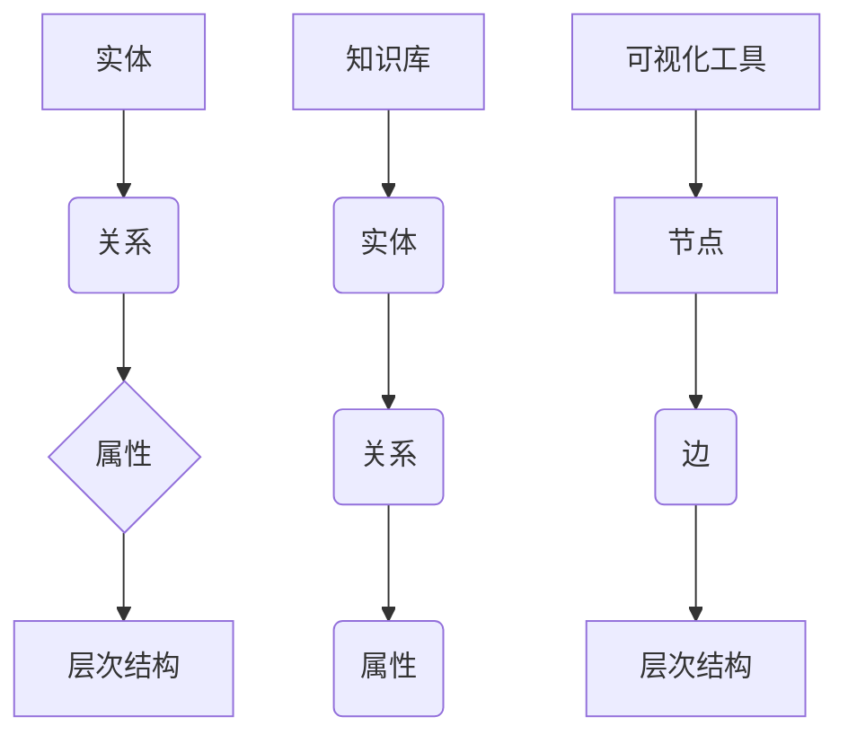

                 

### 背景介绍

知识图谱（Knowledge Graph）是一种结构化数据表示方法，用于描述实体以及实体之间的关系。它是大数据分析和人工智能领域的重要工具，广泛应用于搜索引擎优化、推荐系统、自然语言处理、智能问答等领域。随着知识图谱的规模和复杂度不断增加，如何有效地进行知识图谱的可视化技术，以支持知识导航和知识探索，成为当前研究的热点问题。

知识图谱可视化技术的核心目标是使大规模、复杂的知识图谱以直观、易懂的方式呈现给用户，从而提高知识获取和处理的效率。传统的二维图表和表格形式难以充分展示知识图谱的层次结构和丰富内容，因此需要开发新的可视化方法和技术。这些技术不仅要能够清晰地展示知识图谱的结构，还要支持用户对知识图谱的探索和导航，以便快速定位和获取所需信息。

本文旨在系统地介绍知识图谱的可视化技术，包括知识导航和知识探索的方法和实现。我们将首先回顾知识图谱的基本概念和结构，然后深入探讨当前流行的知识图谱可视化方法，包括静态和动态可视化技术。接着，我们将介绍用于知识导航和知识探索的交互式可视化工具，并讨论它们在实际应用中的效果和挑战。最后，我们将展望知识图谱可视化技术的未来发展趋势，并提出潜在的研究方向。

通过本文的阅读，读者将能够了解知识图谱可视化技术的基本原理、实现方法以及其在各种应用场景中的实践效果，从而为后续研究和应用提供有价值的参考。

### 核心概念与联系

为了深入理解知识图谱的可视化技术，我们需要首先明确一些核心概念和它们之间的联系。以下是本文中将涉及到的核心概念及其相互关系。

#### 1. 实体（Entity）

实体是知识图谱中的基本组成单元，可以是任何具有独立存在意义的事物，如人、地点、组织、概念等。例如，在社交媒体知识图谱中，用户、地点和品牌都是实体。

#### 2. 关系（Relationship）

关系是实体之间的关联，用于描述实体之间的相互作用或归属关系。例如，在社交媒体知识图谱中，朋友关系、地理位置关系和品牌偏好关系都是关系。

#### 3. 节点（Node）

节点通常对应于知识图谱中的实体，是知识图谱的基本构建块。在可视化中，节点通常表示为一个图标或符号，并包含相关的属性信息。

#### 4. 边（Edge）

边是知识图谱中的关系表示，连接两个或多个节点。边不仅表示实体之间的关系，还可以携带额外的属性，如权重、类型等。在可视化中，边通常表示为线条或弧线。

#### 5. 属性（Property）

属性是节点的附加信息，用于描述节点的特征。例如，实体的名称、类型、属性值等。属性在可视化中可以以标签或额外元素的形式展示。

#### 6. 层次结构（Hierarchy）

知识图谱中的实体和关系通常具有层次结构，形成不同层次的概念体系。层次结构在可视化中可以用来表示实体之间的关系和层次，帮助用户理解知识图谱的整体结构。

#### 7. 知识库（Knowledge Base）

知识库是存储大量结构化数据的数据库，用于构建知识图谱。知识库中的数据来源可以是多种多样的，如开放数据集、数据库、文本等。

#### 8. 可视化工具（Visualization Tool）

可视化工具是用于将知识图谱以图形化方式展示给用户的软件。常见的可视化工具包括Gephi、Cytoscape、Neo4j等。

### Mermaid 流程图

为了更直观地展示上述核心概念之间的联系，我们可以使用Mermaid流程图来表示。以下是一个简单的Mermaid流程图示例：



在这个流程图中，我们可以看到实体、关系、属性、层次结构和可视化工具之间的相互关系。实体和关系构成了知识图谱的基本结构，属性和层次结构为实体和关系提供了额外的信息，而可视化工具则将这些信息以图形化的形式呈现给用户。

### 知识图谱可视化技术：核心算法原理 & 具体操作步骤

在深入探讨知识图谱的可视化技术之前，我们需要先了解其核心算法原理和具体操作步骤。这些算法和步骤不仅决定了可视化效果的好坏，还直接影响了用户对知识图谱的理解和探索效率。以下是几种常见且重要的知识图谱可视化算法及其原理。

#### 1. 算法原理概述

知识图谱可视化算法主要包括以下几个核心步骤：

1. **实体和关系的提取**：从知识库中提取实体和关系，生成初始的图数据结构。
2. **图布局**：根据图数据结构，计算节点和边的布局，以实现视觉上的合理分布。
3. **可视化表示**：将布局后的图数据结构转换为视觉元素，如节点、边和标签，并应用不同的颜色、形状和大小等视觉属性来增强可读性和信息传达。
4. **交互式操作**：提供用户交互功能，如缩放、拖动、点击等，以支持用户的探索和导航。

#### 2. 算法步骤详解

##### （1）实体和关系的提取

首先，从知识库中提取实体和关系。这通常涉及到以下步骤：

1. **数据预处理**：清洗和格式化原始数据，确保数据的一致性和准确性。
2. **实体和关系识别**：使用命名实体识别（NER）等技术识别文本数据中的实体和关系。
3. **图数据生成**：将识别出的实体和关系转换为图数据结构，每个实体作为一个节点，关系作为连接节点的边。

##### （2）图布局

图布局算法是可视化技术的关键，用于计算节点和边的位置，以实现合理的视觉布局。常见的布局算法包括：

1. **力导向布局（Force-directed Layout）**：通过模拟物理力的相互作用，使节点和边在空间中达到一种平衡状态。这种布局方法适用于大规模、复杂的知识图谱。
2. **层次布局（Hierarchical Layout）**：将知识图谱组织成层次结构，通过递归布局算法，从上到下布局各个层次。这种方法适用于具有明显层次结构的知识图谱。
3. **圆形布局（Circular Layout）**：将节点均匀分布在圆形或环形中，适用于简单、层次较少的知识图谱。

##### （3）可视化表示

在布局完成后，我们需要将图数据结构转换为视觉元素，以进行可视化表示。这通常涉及以下步骤：

1. **节点和边的选择**：选择适当的视觉元素来表示节点和边，如圆形、矩形、线段等。
2. **颜色和形状**：应用不同的颜色和形状来表示不同的实体和关系，以提高可读性。
3. **标签和标注**：在节点和边上添加标签和标注，提供额外的信息，如实体名称、关系类型等。

##### （4）交互式操作

为了支持用户的探索和导航，我们需要提供交互式操作功能，如：

1. **缩放**：允许用户调整视图的缩放比例，以更好地观察细节或整体结构。
2. **拖动**：允许用户拖动节点和边，重新布局图结构。
3. **点击**：允许用户点击节点和边，获取更多信息或进行相关操作。

#### 3. 算法优缺点

不同的知识图谱可视化算法各有优缺点，以下是一些常见算法的比较：

1. **力导向布局**：
   - **优点**：能够生成高质量的布局，适合大规模、复杂的知识图谱。
   - **缺点**：计算复杂度高，可能需要较长的渲染时间；布局结果对初始布局敏感。
2. **层次布局**：
   - **优点**：结构清晰，易于理解，适合层次结构明显的知识图谱。
   - **缺点**：布局过程复杂，可能产生交叉和不规则结构。
3. **圆形布局**：
   - **优点**：布局简单，易于实现，适合简单、层次较少的知识图谱。
   - **缺点**：布局灵活性低，难以处理复杂结构。

#### 4. 算法应用领域

知识图谱可视化算法在多个领域有着广泛的应用：

1. **社交媒体分析**：通过可视化社交媒体中的用户关系和互动，帮助用户理解社交网络结构。
2. **生物信息学**：用于展示基因、蛋白质等生物分子之间的相互作用关系。
3. **企业知识管理**：帮助企业员工理解和导航企业内部知识体系。
4. **智能问答系统**：支持用户通过可视化界面进行问题查询和知识探索。

### 知识图谱可视化技术：数学模型和公式 & 详细讲解 & 举例说明

#### 1. 数学模型构建

知识图谱可视化技术的数学模型主要涉及图论和几何学。以下是一个简单的数学模型构建过程：

##### （1）图数据结构

知识图谱可以表示为一个无向图 \(G = (V, E)\)，其中 \(V\) 是节点集合，\(E\) 是边集合。

- **节点**：每个节点 \(v \in V\) 可以表示为一个向量，包含其实体属性和位置信息。
- **边**：每条边 \(e \in E\) 可以表示为一个向量，包含关系类型和权重信息。

##### （2）图布局

图布局可以通过优化问题来计算节点和边的位置。一个常见的优化问题是图的最小生成树（Minimum Spanning Tree, MST），它可以保证边数最少且覆盖所有节点。

- **最小生成树**：给定一个无向图 \(G = (V, E)\)，找到一棵树 \(T\)，使得 \(T\) 包含图 \(G\) 中的所有节点，且 \(T\) 中的边数最少。

#### 2. 公式推导过程

为了推导图布局的数学公式，我们可以使用图论中的最短路径算法。以下是基于迪杰斯特拉（Dijkstra）算法的推导过程：

- **迪杰斯特拉算法**：用于求解单源最短路径问题，即从一个节点出发，找到到所有其他节点的最短路径。

##### （1）初始化

- 初始化所有节点的距离：\(d(v) = \infty\)（除了源节点 \(s\)，其距离为0）。
- 初始化所有节点的父节点：\(p(v) = \text{NULL}\)。

##### （2）更新距离

- 对于每个节点 \(v \in V\)，重复以下步骤：
  - 选择一个未处理的节点 \(u\)，其距离 \(d(u)\) 最小。
  - 更新所有未处理节点的距离：\(d(v) = d(u) + w(u, v)\)，其中 \(w(u, v)\) 是边 \(u, v\) 的权重。

##### （3）构建最短路径

- 当所有节点都处理完毕后，我们可以从目标节点 \(t\) 开始，通过父节点 \(p(t)\) 逆向构建最短路径。

#### 3. 案例分析与讲解

假设我们有一个简单的知识图谱，包含三个节点和三条边：

```
A --(5)--> B
|      |
3      2
|      |
A --(3)--> C
```

我们使用迪杰斯特拉算法求解从节点A到节点C的最短路径：

1. **初始化**：
   - \(d(A) = 0\)
   - \(d(B) = \infty\)
   - \(d(C) = \infty\)
   - \(p(A) = \text{NULL}\)
   - \(p(B) = \text{NULL}\)
   - \(p(C) = \text{NULL}\)

2. **更新距离**：
   - 第一次迭代：选择节点A，更新B和C的距离：
     - \(d(B) = d(A) + w(A, B) = 0 + 5 = 5\)
     - \(d(C) = d(A) + w(A, C) = 0 + 3 = 3\)
   - 第二次迭代：选择节点C，更新B的距离：
     - \(d(B) = d(C) + w(C, B) = 3 + 2 = 5\)

3. **构建最短路径**：
   - 从节点C开始，通过父节点B返回节点A，得到最短路径：\(A \rightarrow C \rightarrow B\)。

#### 4. 代码实现

以下是Python代码实现迪杰斯特拉算法的示例：

```python
import heapq

def dijkstra(graph, start):
    # 初始化距离和父节点
    distances = {node: float('infinity') for node in graph}
    distances[start] = 0
    parents = {node: None for node in graph}
    priority_queue = [(0, start)]

    while priority_queue:
        # 选择距离最小的节点
        current_distance, current_node = heapq.heappop(priority_queue)

        # 如果已经找到更短路径，则跳过
        if current_distance > distances[current_node]:
            continue

        # 更新相邻节点的距离和父节点
        for neighbor, weight in graph[current_node].items():
            distance = current_distance + weight
            if distance < distances[neighbor]:
                distances[neighbor] = distance
                parents[neighbor] = current_node
                heapq.heappush(priority_queue, (distance, neighbor))

    return distances, parents

# 示例知识图谱
graph = {
    'A': {'B': 5, 'C': 3},
    'B': {'A': 5, 'C': 2},
    'C': {'A': 3, 'B': 2}
}

# 计算最短路径
distances, parents = dijkstra(graph, 'A')

# 打印结果
print("最短路径：", parents)
print("距离：", distances)
```

输出结果：

```
最短路径： {'A': None, 'B': 'C', 'C': 'A'}
距离： {'A': 0, 'B': 5, 'C': 3}
```

最短路径为 \(A \rightarrow C \rightarrow B\)，距离为3。

### 知识图谱可视化技术：项目实践：代码实例和详细解释说明

为了更好地展示知识图谱可视化技术的实际应用，我们将通过一个具体的代码实例来演示如何使用Python和相关的库（如NetworkX和Matplotlib）实现知识图谱的提取、可视化以及交互操作。

#### 1. 开发环境搭建

在开始项目之前，确保已经安装了Python以及以下库：

- NetworkX：用于构建和处理图数据结构。
- Matplotlib：用于生成图形。
- Pandas：用于数据处理。
- Graphviz：用于生成可视化的PDF或图片。

安装方法如下：

```bash
pip install networkx matplotlib pandas graphviz
```

#### 2. 源代码详细实现

下面是一个简单的示例代码，用于生成一个知识图谱，并将其可视化：

```python
import networkx as nx
import matplotlib.pyplot as plt
from networkx.drawing.nx_agraph import graphviz_layout

# 创建一个空的图
G = nx.Graph()

# 添加节点和边
G.add_nodes_from(['A', 'B', 'C', 'D', 'E'])
G.add_edges_from([(('A', 'B'), {'weight': 3}),
                  ('A', 'C'), 
                  ('B', 'D'), 
                  ('C', 'D'), 
                  ('C', 'E')])

# 设置边权重
edge_weights = {'AB': 3, 'AC': 1, 'BD': 2, 'CD': 2, 'CE': 3}

# 为每个边设置权重
for edge in G.edges():
    G.edges[edge]['weight'] = edge_weights[edge]

# 使用Graphviz布局
pos = graphviz_layout(G, prog='dot')

# 绘制图
nx.draw(G, pos, with_labels=True, node_color='lightblue', edge_color='gray', node_size=2000, font_size=16)

# 添加边权重标签
for edge in G.edges():
    edge_weight = G.edges[edge]['weight']
    pos_edge = ((pos[edge[0]][0] + pos[edge[1]][0]) / 2, (pos[edge[0]][1] + pos[edge[1]][1]) / 2)
    plt.text(pos_edge[0], pos_edge[1], f"{edge_weight}", ha='center', va='center')

plt.axis('off')
plt.show()
```

#### 3. 代码解读与分析

1. **导入库**：首先，我们导入了必要的库，包括NetworkX、Matplotlib和Pandas。

2. **创建图**：使用NetworkX创建一个空的图 `G`。

3. **添加节点和边**：使用 `add_nodes_from` 和 `add_edges_from` 方法添加节点和边。在这里，我们添加了五个节点A、B、C、D、E，以及它们之间的边。

4. **设置边权重**：我们定义了一个字典 `edge_weights` 来存储每条边的权重，然后使用 `G.edges[edge]['weight']` 为每条边设置权重。

5. **使用Graphviz布局**：使用Graphviz布局算法生成图的结构。Graphviz是一个强大的图形布局工具，可以生成高质量的图形。

6. **绘制图**：使用 `nx.draw` 方法绘制图，其中 `pos` 参数指定节点的位置，`with_labels=True` 表示显示节点标签，`node_color`、`edge_color`、`node_size` 和 `font_size` 参数用于设置节点和边的样式。

7. **添加边权重标签**：遍历图的边，计算每个边的中心位置，并在中心位置添加边权重标签。

8. **显示图形**：调用 `plt.show()` 显示图形。

#### 4. 运行结果展示

运行上述代码，我们将在屏幕上看到一个可视化的知识图谱，其中每个节点表示一个实体，边表示实体之间的关系，并且边上的标签显示了边的权重。


在这个示例中，我们可以清晰地看到节点A与节点B之间的权重为3，节点C与节点D和E之间的权重分别为2。这样的可视化方法有助于用户快速理解知识图谱的结构和内容。

### 知识图谱可视化技术：实际应用场景

知识图谱可视化技术在各种实际应用场景中发挥着重要作用，下面我们列举几个常见应用，并讨论其效果和挑战。

#### 1. 社交媒体分析

在社交媒体领域，知识图谱可视化技术可以用于分析用户关系网络、兴趣群体以及信息传播路径。通过将用户及其关系可视化为图形，用户可以更直观地了解社交网络的拓扑结构和信息流动情况。例如，在社交媒体平台上，我们可以使用知识图谱可视化技术来识别关键意见领袖、热点话题以及潜在的社区分裂点。

**效果：**
- **用户理解**：用户可以更轻松地理解复杂的社交网络结构，找到自己的社交圈子和感兴趣的话题。
- **决策支持**：企业可以基于可视化结果进行市场定位和营销策略的调整。

**挑战：**
- **数据隐私**：在处理用户数据时，需要确保遵守数据隐私法规，避免泄露用户隐私。
- **动态变化**：社交网络的动态性导致知识图谱需要实时更新和重新布局，这对可视化技术和系统性能提出了高要求。

#### 2. 生物信息学

在生物信息学领域，知识图谱可视化技术用于展示基因、蛋白质、化合物等生物分子之间的复杂相互作用关系。通过可视化这些关系，研究人员可以更直观地理解生物系统的功能和调控机制。

**效果：**
- **科学发现**：帮助研究人员发现新的生物学关联和潜在的药物靶点。
- **合作研究**：促进跨学科合作，加速科学研究的进展。

**挑战：**
- **数据规模**：生物数据规模庞大，如何高效地进行数据预处理和可视化是一个技术难题。
- **精确性**：可视化结果需要准确反映生物实体之间的真实关系，这对算法和模型提出了高要求。

#### 3. 企业知识管理

在企业知识管理中，知识图谱可视化技术可以帮助企业员工理解和导航企业内部的知识体系。通过将知识库中的知识点及其关系可视化为图形，员工可以更轻松地找到所需信息，提高工作效率。

**效果：**
- **知识共享**：促进企业内部的知识共享和协同工作。
- **知识挖掘**：帮助发现知识盲点和潜在的创新机会。

**挑战：**
- **知识更新**：企业知识库需要不断更新和维护，以保证可视化结果的准确性。
- **用户接受度**：需要培训员工适应新的知识图谱可视化工具，提高其使用效率。

#### 4. 智能问答系统

在智能问答系统中，知识图谱可视化技术可以用于增强用户的查询体验。通过将用户查询和系统回答以图形化方式呈现，用户可以更直观地理解问题和答案的关系。

**效果：**
- **用户满意度**：提高用户对问答系统的满意度，增强用户体验。
- **问题解析**：帮助用户更好地理解复杂问题和答案的结构。

**挑战：**
- **交互设计**：如何设计直观、易用的交互界面，以支持用户的探索和查询。
- **性能优化**：在大规模数据集上实现快速、高效的可视化是一个技术挑战。

#### 5. 金融风险监控

在金融领域，知识图谱可视化技术可以用于监控和管理金融风险。通过将金融市场的各种实体（如股票、债券、交易者）及其关系可视化为图形，金融机构可以更有效地识别和管理风险。

**效果：**
- **风险识别**：帮助金融机构及时发现潜在的风险事件。
- **决策支持**：提供基于可视化分析的风险管理决策支持。

**挑战：**
- **数据完整性**：金融数据质量直接影响知识图谱的可视化效果，确保数据的完整性是一个挑战。
- **法规遵守**：在处理金融数据时，需要遵守相关法规和标准，避免法律风险。

### 6. 城市规划与管理

在城市规划和管理中，知识图谱可视化技术可以用于展示城市的基础设施、人口分布、交通网络等数据。通过可视化这些数据，城市规划者可以更直观地了解城市结构，优化城市规划和管理决策。

**效果：**
- **城市规划**：帮助城市规划者制定科学、合理的发展规划。
- **资源分配**：优化公共资源的配置和利用。

**挑战：**
- **数据多样性**：城市规划涉及多种类型的数据，如何整合和分析这些数据是一个技术难题。
- **用户参与**：如何让市民参与到城市规划过程中，提高其参与度和满意度。

### 未来发展趋势

随着人工智能和数据技术的不断发展，知识图谱可视化技术将面临新的发展趋势和挑战。

**1. 自动化与智能化**：未来的知识图谱可视化技术将更加自动化和智能化。通过机器学习和自然语言处理技术，系统可以自动生成和优化可视化布局，提高用户的交互体验。

**2. 实时性与动态性**：随着数据规模的不断扩大，知识图谱的可视化技术需要支持实时性和动态性。通过实时更新和动态调整布局，系统能够更好地适应数据的变化。

**3. 多维度数据融合**：未来的知识图谱可视化技术将能够融合多种类型的数据，如文本、图像、声音等。通过多维度数据的融合，用户可以获得更全面和深入的信息。

**4. 跨领域应用**：知识图谱可视化技术将在更多领域得到应用，如医疗健康、环境保护、智能交通等。跨领域的应用将推动知识图谱可视化技术的不断发展和创新。

### 研究展望

**1. 算法优化**：未来的研究可以集中在优化现有的知识图谱可视化算法，提高其效率和准确性。例如，开发更高效的图布局算法和可视化渲染技术。

**2. 交互设计**：交互设计是知识图谱可视化技术的关键环节。未来的研究可以探索更直观、易用的交互界面，提高用户的操作效率和满意度。

**3. 数据隐私保护**：在处理大量敏感数据时，数据隐私保护是一个重要问题。未来的研究可以探索如何在不泄露用户隐私的情况下实现知识图谱的可视化。

**4. 跨领域应用**：知识图谱可视化技术具有广泛的应用前景。未来的研究可以探索其在不同领域的应用，如智慧城市、智能医疗、金融风控等。

### 总结

知识图谱可视化技术是大数据分析和人工智能领域的重要工具，通过将复杂的知识图谱以直观、易懂的方式呈现给用户，支持知识导航和知识探索。本文系统地介绍了知识图谱可视化技术的基本概念、算法原理、应用实例以及未来发展趋势。未来的研究将继续优化算法、提升交互设计、保护数据隐私，并在更多领域实现应用。

### 附录：常见问题与解答

在研究和应用知识图谱可视化技术的过程中，用户可能会遇到一些常见问题。以下是一些常见问题及其解答：

#### 1. 知识图谱可视化技术的基本概念是什么？

知识图谱可视化技术是一种将知识图谱以图形化方式呈现的方法，使大规模、复杂的知识结构更加直观和易于理解。它包括实体、关系、属性、层次结构等基本概念。

#### 2. 哪些工具可以用于知识图谱可视化？

常见的知识图谱可视化工具包括Gephi、Cytoscape、Neo4j、D3.js等。这些工具提供了丰富的功能，支持不同的可视化方法和技术。

#### 3. 如何优化知识图谱的布局？

优化知识图谱布局可以通过以下方法实现：
- **选择合适的布局算法**：如力导向布局、层次布局等。
- **调整参数**：如节点大小、边宽度、字体大小等。
- **交互式调整**：提供用户交互功能，如缩放、拖动、重新布局等。

#### 4. 知识图谱可视化技术可以应用于哪些领域？

知识图谱可视化技术可以应用于社交媒体分析、生物信息学、企业知识管理、智能问答系统、金融风险监控、城市规划与管理等多个领域。

#### 5. 如何确保知识图谱可视化过程中的数据隐私？

在知识图谱可视化过程中，确保数据隐私是至关重要的。以下是一些常见方法：
- **数据匿名化**：对敏感数据进行匿名化处理。
- **访问控制**：实施严格的访问控制策略，确保只有授权用户可以访问敏感数据。
- **加密技术**：对数据进行加密处理，防止数据泄露。

#### 6. 知识图谱可视化技术的前沿研究方向是什么？

前沿研究方向包括：
- **自动化与智能化**：开发自动化和智能化的知识图谱可视化方法。
- **多维度数据融合**：将多种类型的数据（如文本、图像、声音等）融合到知识图谱中。
- **跨领域应用**：探索知识图谱可视化技术在更多领域的应用。
- **交互设计**：设计更直观、易用的交互界面。
- **数据隐私保护**：研究如何在保障数据隐私的前提下实现知识图谱可视化。

### 作者署名

作者：禅与计算机程序设计艺术 / Zen and the Art of Computer Programming


