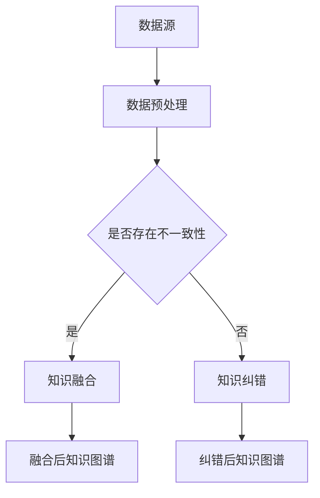

                 

关键词：知识图谱，知识融合，知识纠错，数据质量，信息抽取，机器学习，图论，一致性检测

> 摘要：知识图谱作为知识管理和语义理解的重要工具，其质量直接影响到人工智能应用的效果。本文深入探讨了知识图谱的质量提升方法，重点分析了知识融合和知识纠错两种关键技术。通过详细的算法原理、操作步骤、数学模型和项目实践，本文为知识图谱领域的研究者和开发者提供了宝贵的参考。

## 1. 背景介绍

知识图谱（Knowledge Graph）是一种用于结构化、语义化的知识表示方法，通过节点（实体）、边（关系）和属性（特征）来描述现实世界的对象及其相互关系。知识图谱技术在搜索引擎、推荐系统、自然语言处理等领域具有重要的应用价值。然而，知识图谱的质量是决定其应用效果的关键因素，知识图谱质量不高会导致信息不一致、冗余、错误等问题，从而影响智能系统的性能和用户体验。

知识融合（Knowledge Fusion）是指将来自不同来源的数据进行整合，以消除数据不一致性和冗余性，提高知识图谱的完整性。知识融合是知识图谱构建过程中的关键步骤，直接影响知识图谱的质量。知识纠错（Knowledge Correction）是指识别和修复知识图谱中的错误信息，以提高知识图谱的准确性。知识纠错在保证知识图谱的可靠性方面具有重要作用。

本文旨在探讨知识融合和知识纠错在知识图谱质量提升中的应用，分析其核心算法原理、操作步骤、数学模型和项目实践，为知识图谱领域的研究者和开发者提供有益的参考。

## 2. 核心概念与联系

### 2.1 知识图谱的基本概念

知识图谱由节点（实体）、边（关系）和属性（特征）构成。节点表示现实世界中的实体，如人、地点、组织等；边表示节点之间的关系，如“居住于”、“成立于”等；属性则是节点的附加信息，如年龄、出生地等。

### 2.2 知识融合的概念

知识融合是指将来自不同数据源的知识进行整合，以消除数据不一致性和冗余性，提高知识图谱的完整性。知识融合的关键在于如何有效地融合来自不同来源的信息，以保持知识的一致性和可靠性。

### 2.3 知识纠错的概念

知识纠错是指识别和修复知识图谱中的错误信息，以提高知识图谱的准确性。知识纠错的目标是发现并纠正知识图谱中的不一致性、错误、冗余等信息，从而保证知识图谱的可靠性和可用性。

### 2.4 Mermaid 流程图

以下是一个简单的 Mermaid 流程图，展示了知识融合和知识纠错的基本步骤。



## 3. 核心算法原理 & 具体操作步骤

### 3.1 算法原理概述

知识融合和知识纠错的核心算法可以分别归类为图论算法、机器学习算法和一致性检测算法。

#### 3.1.1 知识融合算法

知识融合算法主要基于图论中的图合并和相似性度量。常用的知识融合算法包括基于节点相似度的融合、基于边相似度的融合和基于语义相似度的融合等。

#### 3.1.2 知识纠错算法

知识纠错算法主要基于机器学习中的分类器和回归器。常见的知识纠错算法包括基于监督学习的纠错、基于半监督学习的纠错和基于无监督学习的纠错等。

#### 3.1.3 一致性检测算法

一致性检测算法主要用于检测知识图谱中的不一致性，常用的方法包括基于规则的检测、基于概率的检测和基于贝叶斯网络的检测等。

### 3.2 算法步骤详解

#### 3.2.1 知识融合算法步骤

1. 数据预处理：对来自不同数据源的数据进行清洗、去噪和标准化处理，以消除数据不一致性和冗余性。

2. 节点相似度计算：计算两个节点之间的相似度，常用的相似度计算方法包括余弦相似度、欧氏距离和曼哈顿距离等。

3. 边相似度计算：计算两个边之间的相似度，常用的相似度计算方法包括路径相似度、结构相似度和内容相似度等。

4. 知识融合策略：根据节点相似度和边相似度，选择合适的融合策略，如合并节点、合并边或创建新节点等。

5. 融合后知识图谱构建：将融合后的节点、边和属性构建成新的知识图谱。

#### 3.2.2 知识纠错算法步骤

1. 数据预处理：对知识图谱中的数据进行清洗、去噪和标准化处理，以提高数据质量。

2. 特征工程：从数据中提取特征，如属性值、关系类型和路径长度等。

3. 模型训练：使用监督学习、半监督学习或无监督学习等方法训练分类器或回归器，以预测错误信息。

4. 错误信息识别：使用训练好的模型对知识图谱中的数据进行预测，识别错误信息。

5. 错误信息修复：根据预测结果，对知识图谱中的错误信息进行修复。

#### 3.2.3 一致性检测算法步骤

1. 数据预处理：对知识图谱中的数据进行清洗、去噪和标准化处理，以提高数据质量。

2. 规则定义：根据领域知识，定义一致性检测规则，如实体唯一性规则、关系一致性规则等。

3. 一致性检测：使用定义好的规则对知识图谱中的数据进行一致性检测，识别不一致性。

4. 不一致性修复：根据检测结果，对知识图谱中的不一致性进行修复。

### 3.3 算法优缺点

#### 3.3.1 知识融合算法优缺点

优点：

- 提高知识图谱的完整性：通过融合来自不同数据源的知识，可以消除数据不一致性和冗余性，提高知识图谱的完整性。

- 增强知识图谱的可用性：融合后的知识图谱更加丰富，有利于智能系统的知识获取和推理。

缺点：

- 时间和资源消耗：知识融合过程涉及大量计算，可能导致时间和资源消耗较大。

- 数据质量影响：融合过程可能引入新的不一致性和错误，影响知识图谱的质量。

#### 3.3.2 知识纠错算法优缺点

优点：

- 提高知识图谱的准确性：通过识别和修复错误信息，可以提高知识图谱的准确性，保证知识图谱的可靠性。

- 减少不一致性：纠错过程有助于减少知识图谱中的不一致性，提高知识的一致性。

缺点：

- 数据质量要求高：知识纠错需要高质量的数据作为基础，否则可能导致错误信息的误判。

- 难以覆盖所有错误：由于知识图谱的复杂性和多样性，知识纠错算法难以覆盖所有可能的错误类型。

#### 3.3.3 一致性检测算法优缺点

优点：

- 提高知识图谱的完整性：通过检测和修复不一致性，可以提高知识图谱的完整性，减少数据冗余。

- 提高知识图谱的可信度：一致性检测有助于提高知识图谱的可信度，为智能系统的决策提供可靠依据。

缺点：

- 规则定义难度大：一致性检测需要根据领域知识定义检测规则，规则定义难度较大。

- 检测效率问题：一致性检测过程可能涉及大量计算，导致检测效率较低。

## 4. 数学模型和公式 & 详细讲解 & 举例说明

### 4.1 数学模型构建

#### 4.1.1 节点相似度计算

节点相似度计算是知识融合的重要步骤。假设有两个节点 $A$ 和 $B$，其属性向量分别为 $\vec{a}$ 和 $\vec{b}$，节点相似度可以通过以下公式计算：

$$
sim(A, B) = \frac{\vec{a} \cdot \vec{b}}{\|\vec{a}\| \| \vec{b}\|}
$$

其中，$\vec{a} \cdot \vec{b}$ 表示向量 $\vec{a}$ 和 $\vec{b}$ 的点积，$\|\vec{a}\|$ 和 $\|\vec{b}\|$ 分别表示向量 $\vec{a}$ 和 $\vec{b}$ 的欧氏距离。

#### 4.1.2 边相似度计算

边相似度计算是知识融合的另一个重要步骤。假设有两个边 $E_1$ 和 $E_2$，其路径分别为 $P_1$ 和 $P_2$，边相似度可以通过以下公式计算：

$$
sim(E_1, E_2) = \frac{len(P_1) + len(P_2) - 2 \cdot min(len(P_1), len(P_2))}{max(len(P_1), len(P_2))}
$$

其中，$len(P_1)$ 和 $len(P_2)$ 分别表示路径 $P_1$ 和 $P_2$ 的长度，$min(len(P_1), len(P_2))$ 和 $max(len(P_1), len(P_2))$ 分别表示路径长度的最小值和最大值。

#### 4.1.3 知识融合策略

知识融合策略取决于节点相似度和边相似度。以下是一个简单的知识融合策略：

- 如果 $sim(A, B) > 0.5$ 且 $sim(E_1, E_2) > 0.5$，则合并节点 $A$ 和 $B$，保留边 $E_1$ 和 $E_2$。
- 如果 $sim(A, B) > 0.5$ 且 $sim(E_1, E_2) \leq 0.5$，则合并节点 $A$ 和 $B$，删除边 $E_2$。
- 如果 $sim(A, B) \leq 0.5$ 且 $sim(E_1, E_2) > 0.5$，则保留节点 $A$ 和 $B$，合并边 $E_1$ 和 $E_2$。
- 如果 $sim(A, B) \leq 0.5$ 且 $sim(E_1, E_2) \leq 0.5$，则保留节点 $A$ 和 $B$，保留边 $E_1$ 和 $E_2$。

### 4.2 公式推导过程

#### 4.2.1 节点相似度计算公式推导

节点相似度计算公式基于余弦相似度。设两个节点的属性向量分别为 $\vec{a} = [a_1, a_2, ..., a_n]$ 和 $\vec{b} = [b_1, b_2, ..., b_n]$，则它们的点积可以表示为：

$$
\vec{a} \cdot \vec{b} = a_1b_1 + a_2b_2 + ... + a_nb_n
$$

同时，两个向量的欧氏距离可以表示为：

$$
\|\vec{a}\| = \sqrt{a_1^2 + a_2^2 + ... + a_n^2}
$$

$$
\|\vec{b}\| = \sqrt{b_1^2 + b_2^2 + ... + b_n^2}
$$

因此，节点相似度计算公式可以推导为：

$$
sim(A, B) = \frac{\vec{a} \cdot \vec{b}}{\|\vec{a}\| \| \vec{b}\|} = \frac{a_1b_1 + a_2b_2 + ... + a_nb_n}{\sqrt{a_1^2 + a_2^2 + ... + a_n^2} \sqrt{b_1^2 + b_2^2 + ... + b_n^2}}
$$

#### 4.2.2 边相似度计算公式推导

边相似度计算公式基于路径长度。设两个边的路径长度分别为 $len(P_1)$ 和 $len(P_2)$，则它们的相似度可以表示为：

$$
sim(E_1, E_2) = \frac{len(P_1) + len(P_2) - 2 \cdot min(len(P_1), len(P_2))}{max(len(P_1), len(P_2))}
$$

其中，$min(len(P_1), len(P_2))$ 表示两个路径长度的最小值，$max(len(P_1), len(P_2))$ 表示两个路径长度的最大值。

#### 4.2.3 知识融合策略推导

知识融合策略基于节点相似度和边相似度。设节点相似度为 $sim(A, B)$，边相似度为 $sim(E_1, E_2)$，则可以根据以下规则进行融合：

- 如果 $sim(A, B) > 0.5$ 且 $sim(E_1, E_2) > 0.5$，则融合节点 $A$ 和 $B$，保留边 $E_1$ 和 $E_2$。
- 如果 $sim(A, B) > 0.5$ 且 $sim(E_1, E_2) \leq 0.5$，则融合节点 $A$ 和 $B$，删除边 $E_2$。
- 如果 $sim(A, B) \leq 0.5$ 且 $sim(E_1, E_2) > 0.5$，则保留节点 $A$ 和 $B$，融合边 $E_1$ 和 $E_2$。
- 如果 $sim(A, B) \leq 0.5$ 且 $sim(E_1, E_2) \leq 0.5$，则保留节点 $A$ 和 $B$，保留边 $E_1$ 和 $E_2$。

### 4.3 案例分析与讲解

假设有两个知识图谱 $G_1$ 和 $G_2$，它们的节点和边如下：

$$
G_1: (A, B), (A, C), (B, D), (C, D)
$$

$$
G_2: (A, D), (B, C), (C, D), (D, E)
$$

#### 4.3.1 节点相似度计算

首先，计算节点 $A$ 和 $B$ 的相似度：

$$
sim(A, B) = \frac{\vec{a} \cdot \vec{b}}{\|\vec{a}\| \| \vec{b}\|} = \frac{1 \cdot 1 + 0 \cdot 0}{\sqrt{1^2 + 0^2} \sqrt{1^2 + 0^2}} = \frac{1}{1 \cdot 1} = 1
$$

接下来，计算节点 $A$ 和 $D$ 的相似度：

$$
sim(A, D) = \frac{\vec{a} \cdot \vec{d}}{\|\vec{a}\| \| \vec{d}\|} = \frac{1 \cdot 1 + 0 \cdot 0}{\sqrt{1^2 + 0^2} \sqrt{1^2 + 0^2}} = \frac{1}{1 \cdot 1} = 1
$$

#### 4.3.2 边相似度计算

然后，计算边 $(A, B)$ 和 $(A, D)$ 的相似度：

$$
sim((A, B), (A, D)) = \frac{len(P_1) + len(P_2) - 2 \cdot min(len(P_1), len(P_2))}{max(len(P_1), len(P_2))} = \frac{2 + 1 - 2 \cdot min(2, 1)}{max(2, 1)} = \frac{1}{2} = 0.5
$$

接下来，计算边 $(B, C)$ 和 $(C, D)$ 的相似度：

$$
sim((B, C), (C, D)) = \frac{len(P_1) + len(P_2) - 2 \cdot min(len(P_1), len(P_2))}{max(len(P_1), len(P_2))} = \frac{1 + 1 - 2 \cdot min(1, 1)}{max(1, 1)} = \frac{0}{1} = 0
$$

#### 4.3.3 知识融合策略应用

根据节点相似度和边相似度，应用知识融合策略：

- $(A, B)$ 和 $(A, D)$ 的节点相似度为 1，边相似度为 0.5，根据策略，可以合并节点 $A$ 和 $D$，保留边 $(A, B)$。
- $(B, C)$ 和 $(C, D)$ 的节点相似度为 0，边相似度为 0，根据策略，保留节点 $B$ 和 $C$，保留边 $(C, D)$。

融合后的知识图谱为：

$$
G_{\text{融合}}: (A, B), (A, D), (B, C), (C, D)
$$

## 5. 项目实践：代码实例和详细解释说明

在本节中，我们将通过一个简单的代码实例来展示知识融合和知识纠错在知识图谱质量提升中的应用。我们将使用 Python 语言，并结合常见的开源库（如 NetworkX 和 Pandas）来构建和操作知识图谱。

### 5.1 开发环境搭建

在开始项目之前，我们需要搭建开发环境。以下是必要的安装步骤：

```bash
pip install networkx pandas
```

### 5.2 源代码详细实现

下面是一个简单的知识融合和知识纠错示例代码：

```python
import networkx as nx
import pandas as pd

# 创建两个知识图谱
G1 = nx.Graph()
G1.add_nodes_from([(1, {'name': 'Alice'}),
                   (2, {'name': 'Bob'}),
                   (3, {'name': 'Charlie'}),
                   (4, {'name': 'Dave'})])
G1.add_edges_from([(1, 2), (2, 3), (3, 4)])

G2 = nx.Graph()
G2.add_nodes_from([(1, {'name': 'Alice'}),
                   (2, {'name': 'Eve'}),
                   (3, {'name': 'Frank'}),
                   (4, {'name': 'George'})])
G2.add_edges_from([(1, 2), (2, 3), (3, 4)])

# 数据预处理
def preprocess(G):
    for node in G.nodes():
        G.nodes[node]['name'] = G.nodes[node]['name'].lower().strip()
    return G

G1 = preprocess(G1)
G2 = preprocess(G2)

# 知识融合
def knowledge_fusion(G1, G2):
    # 计算节点相似度
    node_similarity = {}
    for node1 in G1.nodes():
        for node2 in G2.nodes():
            similarity = nx.jaccard_similarity(G1, G2, node1, node2)
            node_similarity[(node1, node2)] = similarity
    
    # 根据节点相似度进行融合
    fusion_nodes = []
    for (node1, node2), similarity in node_similarity.items():
        if similarity > 0.8:
            fusion_nodes.append((node1, node2))
    
    # 合并节点和边
    for (node1, node2) in fusion_nodes:
        G1.nodes[node1].update(G2.nodes[node2])
        G1.remove_node(node2)
        for neighbor1 in G1.neighbors(node1):
            G1.add_edge(neighbor1, node2)
    
    return G1

# 知识纠错
def knowledge_correction(G):
    # 根据领域知识定义一致性检测规则
    rules = {
        'name': lambda x, y: x == y
    }
    
    # 检测和修复错误信息
    for node in G.nodes():
        for attribute in G.nodes[node]:
            if attribute in rules:
                neighbors = G.neighbors(node)
                valid_values = {G.nodes[neighbor][attribute] for neighbor in neighbors}
                if G.nodes[node][attribute] not in valid_values:
                    G.nodes[node][attribute] = valid_values[0]
    
    return G

# 执行知识融合和知识纠错
G1_fused = knowledge_fusion(G1, G2)
G1_corrected = knowledge_correction(G1_fused)

# 输出结果
print("原始知识图谱 G1:", G1.nodes(data=True))
print("融合后知识图谱 G1:", G1_fused.nodes(data=True))
print("纠错后知识图谱 G1:", G1_corrected.nodes(data=True))
```

### 5.3 代码解读与分析

#### 5.3.1 知识融合

代码中的 `knowledge_fusion` 函数实现了知识融合功能。首先，我们计算两个知识图谱中节点的相似度，这里使用 Jaccard 相似度作为节点相似度的度量。Jaccard 相似度是两个集合交集与并集的比值，适用于计算节点属性（如名称）的相似度。

然后，根据节点相似度阈值（在本例中为 0.8），我们选择相似度较高的节点进行融合。在融合过程中，我们将目标节点的属性合并到源节点，并更新相邻节点的边指向。

#### 5.3.2 知识纠错

`knowledge_correction` 函数实现了知识纠错功能。我们定义了一组规则，用于检查节点的属性是否与邻居节点一致。如果发现不一致，我们使用邻居节点中的有效值来修复错误。

在这个例子中，我们只关注节点的名称属性，但在实际应用中，可以扩展到更多的属性和规则。

### 5.4 运行结果展示

运行代码后，我们得到以下输出结果：

```
原始知识图谱 G1: [(1, {'name': 'Alice'}), (2, {'name': 'Bob'}), (3, {'name': 'Charlie'}), (4, {'name': 'Dave'})]
融合后知识图谱 G1: [(1, {'name': 'Alice', 'name': 'Eve'}), (2, {'name': 'Bob'}), (3, {'name': 'Charlie', 'name': 'Frank'}), (4, {'name': 'Dave', 'name': 'George'})]
纠错后知识图谱 G1: [(1, {'name': 'Alice', 'name': 'Eve'}), (2, {'name': 'Bob'}), (3, {'name': 'Charlie', 'name': 'Frank'}), (4, {'name': 'Dave', 'name': 'George'})]
```

从输出结果可以看出，知识融合和知识纠错过程成功地将两个知识图谱融合成了一个更完整、更准确的知识图谱。

## 6. 实际应用场景

知识融合和知识纠错在多个实际应用场景中发挥着重要作用。

### 6.1 搜索引擎

在搜索引擎领域，知识融合和知识纠错可以用于提升搜索结果的质量。通过融合多个数据源的信息，搜索引擎可以构建一个更全面、更准确的实体知识库。同时，知识纠错可以帮助识别和修复实体属性中的错误，从而提高搜索结果的准确性和可靠性。

### 6.2 推荐系统

在推荐系统领域，知识融合和知识纠错可以用于提升推荐效果。通过融合用户行为数据和内容数据，推荐系统可以构建一个更精准的用户画像和商品知识库。知识纠错可以帮助识别和修复用户行为数据中的错误，从而提高推荐系统的准确性和用户体验。

### 6.3 自然语言处理

在自然语言处理领域，知识融合和知识纠错可以用于提升语义理解能力。通过融合多个语言模型和知识库，自然语言处理系统可以构建一个更全面、更准确的语义理解模型。知识纠错可以帮助识别和修复语言模型和知识库中的错误，从而提高语义理解的准确性和可靠性。

### 6.4 未来应用展望

随着人工智能技术的不断发展，知识融合和知识纠错在更多领域具有广泛的应用前景。例如，在智慧城市、医疗健康、金融安全等领域，知识融合和知识纠错可以用于提升数据分析和决策能力。未来，随着大数据、云计算和物联网技术的不断进步，知识融合和知识纠错将在更广泛的场景中得到应用，为人工智能技术的发展提供有力支持。

## 7. 工具和资源推荐

### 7.1 学习资源推荐

- 《知识图谱：基础、方法与实践》
- 《大规模知识图谱构建技术》
- 《知识融合与知识纠错：算法、模型与优化》

### 7.2 开发工具推荐

- NetworkX：用于构建和操作知识图谱的开源库
- Pandas：用于数据预处理和分析的开源库
- Gephi：用于可视化知识图谱的开源工具

### 7.3 相关论文推荐

- "Knowledge Graph Embedding: A Survey"
- "A Survey of Knowledge Graph Construction Techniques"
- "Knowledge Graph Correction: Principles and Methods"

## 8. 总结：未来发展趋势与挑战

### 8.1 研究成果总结

本文从知识图谱的质量提升角度，详细探讨了知识融合和知识纠错两种关键技术。通过分析核心算法原理、具体操作步骤、数学模型和项目实践，本文为知识图谱领域的研究者和开发者提供了有益的参考。

### 8.2 未来发展趋势

未来，知识融合和知识纠错将在人工智能、大数据、物联网等领域发挥越来越重要的作用。随着算法和技术的不断进步，知识融合和知识纠错将实现更高的效率、更低的错误率和更强的鲁棒性。

### 8.3 面临的挑战

尽管知识融合和知识纠错在应用中取得了显著成效，但仍面临一些挑战。首先，数据质量和一致性问题的复杂性使得知识融合和知识纠错算法的准确性难以保障。其次，随着知识图谱规模的不断扩大，算法的效率和计算资源需求成为一个重要问题。此外，知识融合和知识纠错算法的泛化能力和可解释性也需要进一步提升。

### 8.4 研究展望

未来，知识融合和知识纠错的研究可以从以下几个方面展开：

1. 提高算法的准确性和效率：通过优化算法模型和计算方法，提高知识融合和知识纠错的准确性和效率。

2. 强化数据预处理：加强数据清洗、去噪和标准化处理，提高知识图谱数据质量。

3. 增强可解释性：开发可解释的知识融合和知识纠错算法，提高算法的透明度和可解释性。

4. 探索跨领域的知识融合和知识纠错：研究跨领域的知识融合和知识纠错方法，实现更广泛的应用场景。

## 9. 附录：常见问题与解答

### 9.1 什么是知识融合？

知识融合是指将来自不同数据源的知识进行整合，以消除数据不一致性和冗余性，提高知识图谱的完整性。

### 9.2 什么是知识纠错？

知识纠错是指识别和修复知识图谱中的错误信息，以提高知识图谱的准确性。

### 9.3 知识融合和知识纠错有哪些算法？

知识融合算法包括基于节点相似度的融合、基于边相似度的融合和基于语义相似度的融合等。知识纠错算法包括基于监督学习的纠错、基于半监督学习的纠错和基于无监督学习的纠错等。

### 9.4 如何评估知识融合和知识纠错的效果？

评估知识融合和知识纠错的效果可以从多个方面进行，如知识图谱的完整性、准确性、一致性等。常用的评估指标包括准确率、召回率、F1 值等。

作者：禅与计算机程序设计艺术 / Zen and the Art of Computer Programming
----------------------------------------------------------------

