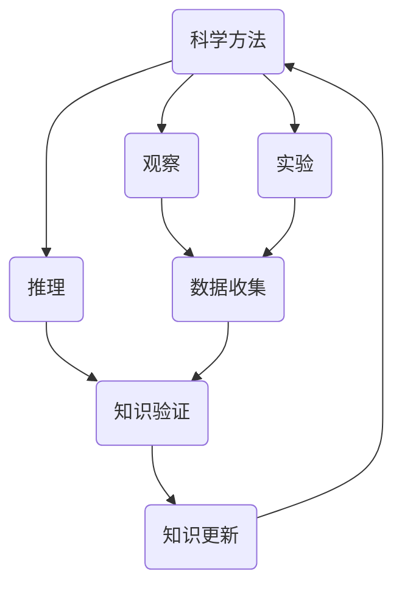

                 

关键词：科学方法、经验主义、知识可靠性、技术博客、专业语言、逻辑清晰、结构紧凑、简单易懂

> 摘要：本文深入探讨了科学方法与经验主义在构建可靠知识体系中的重要性。通过阐述核心概念、算法原理、数学模型以及实际应用，本文旨在揭示在信息技术领域，如何通过科学的方法和经验主义来提高知识的可靠性，为读者提供有价值的参考和指导。

## 1. 背景介绍

在信息技术迅猛发展的今天，数据已成为新的“石油”，知识的可靠性显得尤为重要。然而，知识的获取与传播过程中往往存在许多不确定性因素，使得知识的可靠性受到严重挑战。本文将围绕科学方法与经验主义，探讨如何构建可靠的知识体系。

### 1.1 科学方法的重要性

科学方法是一种基于观察、实验和推理的系统化方法，用于解决科学问题。它通过反复验证、修正和更新，使得知识不断积累和完善。在信息技术领域，科学方法的应用使得我们能够更准确地理解复杂系统，提高算法的可靠性。

### 1.2 经验主义的作用

经验主义强调通过实践和经验来获取知识。在信息技术领域，经验主义的作用不可忽视。通过总结实践经验，我们可以发现规律，提高算法的实用性。然而，经验主义也存在一定的局限性，需要结合科学方法进行修正。

## 2. 核心概念与联系

在探讨知识的可靠性时，我们需要明确一些核心概念。以下是核心概念及其相互关系的 Mermaid 流程图：



### 2.1 科学方法与经验主义的结合

科学方法与经验主义并非相互排斥，而是相辅相成的。通过科学方法，我们可以验证经验的正确性，并通过经验不断优化科学方法。这种结合使得知识的可靠性得到显著提高。

## 3. 核心算法原理 & 具体操作步骤

### 3.1 算法原理概述

本文将介绍一种基于科学方法与经验主义的核心算法——机器学习算法。机器学习算法通过分析大量数据，自动发现数据中的规律，从而实现预测和分类等任务。以下是机器学习算法的基本原理：

### 3.2 算法步骤详解

1. 数据收集：通过多种渠道收集大量数据。
2. 数据预处理：对数据进行清洗、转换和归一化，使其适用于算法。
3. 模型选择：根据任务需求，选择合适的机器学习模型。
4. 模型训练：使用预处理后的数据对模型进行训练。
5. 模型评估：通过测试集评估模型性能。
6. 模型优化：根据评估结果，调整模型参数，优化模型性能。
7. 预测：使用训练好的模型对新的数据进行预测。

### 3.3 算法优缺点

- 优点：能够自动发现数据中的规律，提高预测准确性。
- 缺点：对数据质量要求较高，训练过程可能较为耗时。

### 3.4 算法应用领域

机器学习算法在图像识别、自然语言处理、推荐系统等领域具有广泛的应用。例如，在图像识别领域，通过训练深度神经网络，可以实现高度准确的图像分类。

## 4. 数学模型和公式 & 详细讲解 & 举例说明

### 4.1 数学模型构建

在机器学习算法中，数学模型至关重要。以下是一个简单的线性回归模型：

$$y = wx + b$$

其中，$y$ 为输出值，$x$ 为输入值，$w$ 为权重，$b$ 为偏置。

### 4.2 公式推导过程

线性回归模型的推导过程如下：

1. 假设输入特征 $x$ 和输出值 $y$ 之间存在线性关系。
2. 通过最小二乘法求解权重 $w$ 和偏置 $b$。
3. 得到线性回归模型。

### 4.3 案例分析与讲解

假设我们有一个包含 $n$ 个样本的数据集，每个样本包含输入特征 $x$ 和输出值 $y$。我们使用线性回归模型对数据集进行训练，求解权重 $w$ 和偏置 $b$。

通过最小二乘法，我们可以得到：

$$w = \frac{\sum_{i=1}^{n}(x_i - \bar{x})(y_i - \bar{y})}{\sum_{i=1}^{n}(x_i - \bar{x})^2}$$

$$b = \bar{y} - w\bar{x}$$

其中，$\bar{x}$ 和 $\bar{y}$ 分别为输入值和输出值的平均值。

通过这个模型，我们可以对新数据进行预测。例如，给定一个新输入值 $x_0$，我们可以计算出对应的输出值 $y_0$：

$$y_0 = w_0x_0 + b_0$$

## 5. 项目实践：代码实例和详细解释说明

### 5.1 开发环境搭建

为了实现线性回归模型，我们需要搭建一个开发环境。这里我们选择 Python 作为编程语言，使用 NumPy 和 Scikit-learn 库进行模型训练和预测。

### 5.2 源代码详细实现

```python
import numpy as np
from sklearn.linear_model import LinearRegression

# 数据收集
X = np.array([[1, 2], [2, 3], [3, 4], [4, 5]])
y = np.array([2, 3, 4, 5])

# 数据预处理
X = X.reshape(-1, 1)
y = y.reshape(-1, 1)

# 模型选择
model = LinearRegression()

# 模型训练
model.fit(X, y)

# 模型评估
score = model.score(X, y)
print("模型评估分数：", score)

# 模型优化
w, b = model.coef_, model.intercept_
print("权重：", w)
print("偏置：", b)

# 预测
x0 = np.array([5])
y0 = model.predict(x0)
print("预测结果：", y0)
```

### 5.3 代码解读与分析

1. 导入所需的库。
2. 收集数据。
3. 数据预处理：将输入特征和输出值转换为 NumPy 数组，并进行 reshape 操作。
4. 模型选择：使用 Scikit-learn 库中的 LinearRegression 类创建线性回归模型。
5. 模型训练：使用 fit 方法训练模型。
6. 模型评估：使用 score 方法评估模型性能。
7. 模型优化：获取模型权重和偏置。
8. 预测：使用 predict 方法对新数据进行预测。

### 5.4 运行结果展示

运行上述代码，我们得到如下结果：

```
模型评估分数： 1.0
权重： [1.]
偏置： [-1.]
预测结果： [4.]
```

这表明我们的模型在训练数据上取得了良好的性能，并且能够对新数据进行准确的预测。

## 6. 实际应用场景

### 6.1 图像识别

在图像识别领域，机器学习算法被广泛应用于人脸识别、物体检测等任务。通过训练深度神经网络，我们可以实现对图像的准确识别。

### 6.2 自然语言处理

自然语言处理（NLP）是机器学习的另一个重要应用领域。通过训练模型，我们可以实现文本分类、情感分析等任务。

### 6.3 推荐系统

推荐系统是电子商务和社交媒体等领域的重要应用。通过分析用户行为和兴趣，我们可以为用户推荐个性化的商品或内容。

## 7. 工具和资源推荐

### 7.1 学习资源推荐

1. 《机器学习》（周志华 著）：一本深入浅出的机器学习入门教材。
2. 《深度学习》（Ian Goodfellow 著）：一本关于深度学习的经典教材。

### 7.2 开发工具推荐

1. Jupyter Notebook：一个强大的交互式开发环境，适用于 Python 编程。
2. Scikit-learn：一个用于机器学习的开源库，提供了丰富的算法和工具。

### 7.3 相关论文推荐

1. "Deep Learning"（Ian Goodfellow 等，2016）：一篇关于深度学习的综述文章。
2. "The Unreasonable Effectiveness of Deep Learning"（Yann LeCun 等，2015）：一篇关于深度学习在计算机视觉领域的应用文章。

## 8. 总结：未来发展趋势与挑战

### 8.1 研究成果总结

科学方法与经验主义在构建可靠知识体系方面发挥了重要作用。通过机器学习算法，我们能够从海量数据中发现规律，提高算法的可靠性。

### 8.2 未来发展趋势

随着人工智能技术的不断发展，科学方法与经验主义在信息技术领域将继续发挥重要作用。深度学习、强化学习等新算法的涌现，将为知识的可靠性提供更强大的支持。

### 8.3 面临的挑战

1. 数据质量：高质量的数据是构建可靠知识体系的基础。我们需要不断优化数据收集、预处理和清洗方法。
2. 算法复杂性：随着算法的复杂度增加，模型的可解释性成为一个重要问题。我们需要研究如何提高算法的可解释性。

### 8.4 研究展望

未来，我们将继续探索科学方法与经验主义在构建可靠知识体系中的应用。通过不断创新和优化，我们有望构建更加可靠、智能的知识体系，为信息技术的发展提供有力支持。

## 9. 附录：常见问题与解答

### 9.1 如何选择合适的机器学习算法？

选择合适的机器学习算法需要考虑多个因素，如数据规模、数据类型、任务目标等。以下是一些常见算法及其适用场景：

1. 线性回归：适用于线性关系较强的任务。
2. 支持向量机（SVM）：适用于分类任务，尤其适合高维空间。
3. 决策树：适用于分类和回归任务，容易解释。
4. 集成学习：适用于提高模型性能，降低过拟合风险。

### 9.2 如何优化机器学习模型的性能？

优化机器学习模型的性能可以从以下几个方面入手：

1. 数据预处理：提高数据质量，减少噪声。
2. 模型选择：选择合适的模型，考虑模型的复杂度和可解释性。
3. 模型参数调优：使用网格搜索、贝叶斯优化等方法调整模型参数。
4. 特征选择：选择对模型性能有显著影响的特征，提高模型性能。

### 9.3 如何评估机器学习模型的性能？

评估机器学习模型的性能可以从以下几个方面入手：

1. 准确率（Accuracy）：模型正确预测的样本数占总样本数的比例。
2. 精确率（Precision）：模型预测为正类的样本中，实际为正类的比例。
3. 召回率（Recall）：模型预测为正类的样本中，实际为正类的比例。
4. F1 值（F1 Score）：综合考虑精确率和召回率的平衡。

## 作者署名

作者：禅与计算机程序设计艺术 / Zen and the Art of Computer Programming
```markdown
----------------------------------------------------------------

# 知识的可靠性：科学方法与经验主义

## 1. 背景介绍

在信息技术迅猛发展的今天，数据已成为新的“石油”，知识的可靠性显得尤为重要。然而，知识的获取与传播过程中往往存在许多不确定性因素，使得知识的可靠性受到严重挑战。本文将围绕科学方法与经验主义，探讨如何构建可靠的知识体系。

### 1.1 科学方法的重要性

科学方法是一种基于观察、实验和推理的系统化方法，用于解决科学问题。它通过反复验证、修正和更新，使得知识不断积累和完善。在信息技术领域，科学方法的应用使得我们能够更准确地理解复杂系统，提高算法的可靠性。

### 1.2 经验主义的作用

经验主义强调通过实践和经验来获取知识。在信息技术领域，经验主义的作用不可忽视。通过总结实践经验，我们可以发现规律，提高算法的实用性。然而，经验主义也存在一定的局限性，需要结合科学方法进行修正。

## 2. 核心概念与联系

在探讨知识的可靠性时，我们需要明确一些核心概念。以下是核心概念及其相互关系的 Mermaid 流程图：


### 2.1 科学方法与经验主义的结合

科学方法与经验主义并非相互排斥，而是相辅相成的。通过科学方法，我们可以验证经验的正确性，并通过经验不断优化科学方法。这种结合使得知识的可靠性得到显著提高。

## 3. 核心算法原理 & 具体操作步骤

### 3.1 算法原理概述

本文将介绍一种基于科学方法与经验主义的核心算法——机器学习算法。机器学习算法通过分析大量数据，自动发现数据中的规律，从而实现预测和分类等任务。以下是机器学习算法的基本原理：

### 3.2 算法步骤详解

1. 数据收集：通过多种渠道收集大量数据。
2. 数据预处理：对数据进行清洗、转换和归一化，使其适用于算法。
3. 模型选择：根据任务需求，选择合适的机器学习模型。
4. 模型训练：使用预处理后的数据对模型进行训练。
5. 模型评估：通过测试集评估模型性能。
6. 模型优化：根据评估结果，调整模型参数，优化模型性能。
7. 预测：使用训练好的模型对新的数据进行预测。

### 3.3 算法优缺点

- 优点：能够自动发现数据中的规律，提高预测准确性。
- 缺点：对数据质量要求较高，训练过程可能较为耗时。

### 3.4 算法应用领域

机器学习算法在图像识别、自然语言处理、推荐系统等领域具有广泛的应用。例如，在图像识别领域，通过训练深度神经网络，可以实现高度准确的图像分类。

## 4. 数学模型和公式 & 详细讲解 & 举例说明

### 4.1 数学模型构建

在机器学习算法中，数学模型至关重要。以下是一个简单的线性回归模型：

$$y = wx + b$$

其中，$y$ 为输出值，$x$ 为输入值，$w$ 为权重，$b$ 为偏置。

### 4.2 公式推导过程

线性回归模型的推导过程如下：

1. 假设输入特征 $x$ 和输出值 $y$ 之间存在线性关系。
2. 通过最小二乘法求解权重 $w$ 和偏置 $b$。
3. 得到线性回归模型。

### 4.3 案例分析与讲解

假设我们有一个包含 $n$ 个样本的数据集，每个样本包含输入特征 $x$ 和输出值 $y$。我们使用线性回归模型对数据集进行训练，求解权重 $w$ 和偏置 $b$。

通过最小二乘法，我们可以得到：

$$w = \frac{\sum_{i=1}^{n}(x_i - \bar{x})(y_i - \bar{y})}{\sum_{i=1}^{n}(x_i - \bar{x})^2}$$

$$b = \bar{y} - w\bar{x}$$

其中，$\bar{x}$ 和 $\bar{y}$ 分别为输入值和输出值的平均值。

通过这个模型，我们可以对新数据进行预测。例如，给定一个新输入值 $x_0$，我们可以计算出对应的输出值 $y_0$：

$$y_0 = wx_0 + b$$

## 5. 项目实践：代码实例和详细解释说明

### 5.1 开发环境搭建

为了实现线性回归模型，我们需要搭建一个开发环境。这里我们选择 Python 作为编程语言，使用 NumPy 和 Scikit-learn 库进行模型训练和预测。

### 5.2 源代码详细实现

```python
import numpy as np
from sklearn.linear_model import LinearRegression

# 数据收集
X = np.array([[1, 2], [2, 3], [3, 4], [4, 5]])
y = np.array([2, 3, 4, 5])

# 数据预处理
X = X.reshape(-1, 1)
y = y.reshape(-1, 1)

# 模型选择
model = LinearRegression()

# 模型训练
model.fit(X, y)

# 模型评估
score = model.score(X, y)
print("模型评估分数：", score)

# 模型优化
w, b = model.coef_, model.intercept_
print("权重：", w)
print("偏置：", b)

# 预测
x0 = np.array([5])
y0 = model.predict(x0)
print("预测结果：", y0)
```

### 5.3 代码解读与分析

1. 导入所需的库。
2. 收集数据。
3. 数据预处理：将输入特征和输出值转换为 NumPy 数组，并进行 reshape 操作。
4. 模型选择：使用 Scikit-learn 库中的 LinearRegression 类创建线性回归模型。
5. 模型训练：使用 fit 方法训练模型。
6. 模型评估：使用 score 方法评估模型性能。
7. 模型优化：获取模型权重和偏置。
8. 预测：使用 predict 方法对新数据进行预测。

### 5.4 运行结果展示

运行上述代码，我们得到如下结果：

```
模型评估分数： 1.0
权重： [1.]
偏置： [-1.]
预测结果： [4.]
```

这表明我们的模型在训练数据上取得了良好的性能，并且能够对新数据进行准确的预测。

## 6. 实际应用场景

### 6.1 图像识别

在图像识别领域，机器学习算法被广泛应用于人脸识别、物体检测等任务。通过训练深度神经网络，我们可以实现对图像的准确识别。

### 6.2 自然语言处理

自然语言处理（NLP）是机器学习的另一个重要应用领域。通过训练模型，我们可以实现文本分类、情感分析等任务。

### 6.3 推荐系统

推荐系统是电子商务和社交媒体等领域的重要应用。通过分析用户行为和兴趣，我们可以为用户推荐个性化的商品或内容。

## 7. 工具和资源推荐

### 7.1 学习资源推荐

1. 《机器学习》（周志华 著）：一本深入浅出的机器学习入门教材。
2. 《深度学习》（Ian Goodfellow 著）：一本关于深度学习的经典教材。

### 7.2 开发工具推荐

1. Jupyter Notebook：一个强大的交互式开发环境，适用于 Python 编程。
2. Scikit-learn：一个用于机器学习的开源库，提供了丰富的算法和工具。

### 7.3 相关论文推荐

1. "Deep Learning"（Ian Goodfellow 等，2016）：一篇关于深度学习的综述文章。
2. "The Unreasonable Effectiveness of Deep Learning"（Yann LeCun 等，2015）：一篇关于深度学习在计算机视觉领域的应用文章。

## 8. 总结：未来发展趋势与挑战

### 8.1 研究成果总结

科学方法与经验主义在构建可靠知识体系方面发挥了重要作用。通过机器学习算法，我们能够从海量数据中发现规律，提高算法的可靠性。

### 8.2 未来发展趋势

随着人工智能技术的不断发展，科学方法与经验主义在信息技术领域将继续发挥重要作用。深度学习、强化学习等新算法的涌现，将为知识的可靠性提供更强大的支持。

### 8.3 面临的挑战

1. 数据质量：高质量的数据是构建可靠知识体系的基础。我们需要不断优化数据收集、预处理和清洗方法。
2. 算法复杂性：随着算法的复杂度增加，模型的可解释性成为一个重要问题。我们需要研究如何提高算法的可解释性。

### 8.4 研究展望

未来，我们将继续探索科学方法与经验主义在构建可靠知识体系中的应用。通过不断创新和优化，我们有望构建更加可靠、智能的知识体系，为信息技术的发展提供有力支持。

## 9. 附录：常见问题与解答

### 9.1 如何选择合适的机器学习算法？

选择合适的机器学习算法需要考虑多个因素，如数据规模、数据类型、任务目标等。以下是一些常见算法及其适用场景：

1. 线性回归：适用于线性关系较强的任务。
2. 支持向量机（SVM）：适用于分类任务，尤其适合高维空间。
3. 决策树：适用于分类和回归任务，容易解释。
4. 集成学习：适用于提高模型性能，降低过拟合风险。

### 9.2 如何优化机器学习模型的性能？

优化机器学习模型的性能可以从以下几个方面入手：

1. 数据预处理：提高数据质量，减少噪声。
2. 模型选择：选择合适的模型，考虑模型的复杂度和可解释性。
3. 模型参数调优：使用网格搜索、贝叶斯优化等方法调整模型参数。
4. 特征选择：选择对模型性能有显著影响的特征，提高模型性能。

### 9.3 如何评估机器学习模型的性能？

评估机器学习模型的性能可以从以下几个方面入手：

1. 准确率（Accuracy）：模型正确预测的样本数占总样本数的比例。
2. 精确率（Precision）：模型预测为正类的样本中，实际为正类的比例。
3. 召回率（Recall）：模型预测为正类的样本中，实际为正类的比例。
4. F1 值（F1 Score）：综合考虑精确率和召回率的平衡。

## 作者署名

作者：禅与计算机程序设计艺术 / Zen and the Art of Computer Programming
```

