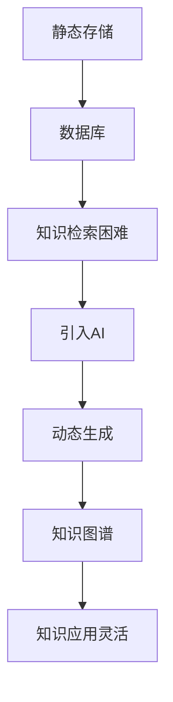

                 

### 关键词 Keywords
- 知识存储
- 动态生成
- 数据库
- 人工智能
- 知识图谱

### 摘要 Abstract
本文探讨了知识存储与生成的进化过程，从传统的静态存储方式，到现代的动态生成技术，揭示了知识在信息技术领域中的重要地位。通过对数据库、人工智能、知识图谱等核心概念的深入剖析，本文旨在为读者提供一个全面理解知识如何从静态存储进化到动态生成的框架，并展望其未来的发展趋势和挑战。

## 1. 背景介绍

随着信息技术的飞速发展，知识在社会各个领域中的作用日益凸显。知识不仅是个人、组织乃至社会发展的基石，也是信息社会的重要资源。然而，知识的存储与利用方式经历了显著的变革。

在早期的信息技术时代，知识主要以文本、图表等形式静态存储在数据库中。这种存储方式虽然在一定程度上满足了信息管理的需求，但随着数据量的爆炸性增长，知识检索的效率变得极为低下，难以满足快速变化的业务需求。

为了解决这一问题，人工智能（AI）和知识图谱技术的兴起带来了知识的动态生成。动态生成技术通过分析、挖掘、整合海量数据，实现知识的自动化生成，使得知识的应用更加灵活和高效。本文将深入探讨这一进化过程及其核心概念和关键技术。

## 2. 核心概念与联系

### 2.1 数据库

数据库是知识存储的传统方式，它通过数据模型和结构化查询语言（SQL）来组织和管理数据。传统的数据库系统如MySQL、Oracle等，以关系型数据库为主，适合存储结构化的数据，但在处理非结构化数据（如文本、图像、音频等）时存在一定的局限性。

### 2.2 人工智能

人工智能是现代信息技术的重要组成部分，通过机器学习、深度学习等技术，AI能够从数据中自动提取特征、模式，进行预测和决策。人工智能的引入，使得知识存储不再局限于静态的数据，而是能够通过动态分析不断更新和进化。

### 2.3 知识图谱

知识图谱是一种用于表示实体及其相互关系的数据结构，通过图论来组织数据，使得知识以更加直观和高效的方式展现。知识图谱能够将海量数据转化为易于理解和分析的知识体系，是知识动态生成的重要工具。

### 2.4 Mermaid 流程图

以下是一个用Mermaid绘制的知识存储与生成流程图：



## 3. 核心算法原理 & 具体操作步骤

### 3.1 算法原理概述

动态生成知识的核心在于利用人工智能技术对数据进行分析和处理，从而生成新的知识。这一过程通常包括数据收集、数据预处理、特征提取、模型训练、知识推理和知识表示等步骤。

### 3.2 算法步骤详解

#### 3.2.1 数据收集

数据收集是动态生成知识的第一步，通过各种渠道获取结构化和非结构化的数据。这些数据可以是公开的，也可以是私有的，甚至是实时产生的数据流。

#### 3.2.2 数据预处理

数据预处理包括数据清洗、数据转换和数据归一化等步骤，以确保数据的准确性和一致性。这一步是确保后续分析质量的关键。

#### 3.2.3 特征提取

特征提取是数据预处理之后的重要步骤，通过提取数据中的关键特征，使得数据更加适合用于机器学习模型。

#### 3.2.4 模型训练

模型训练是利用机器学习算法对数据进行学习和建模的过程。常见的机器学习算法包括决策树、支持向量机、神经网络等。

#### 3.2.5 知识推理

知识推理是通过训练好的模型对新的数据进行预测和决策，从而生成新的知识。这一步是动态生成知识的核心。

#### 3.2.6 知识表示

知识表示是将生成的知识以易于理解和应用的形式展现出来，如知识图谱、文本、图表等。

### 3.3 算法优缺点

#### 优点

- **高效性**：动态生成知识能够快速响应业务需求，提高知识检索和应用效率。
- **灵活性**：通过人工智能技术，知识可以自动更新和进化，适应不断变化的环境。
- **多样性**：知识可以从各种来源和形式生成，提高了知识的多样性和全面性。

#### 缺点

- **复杂性**：动态生成知识涉及多个技术和步骤，系统设计和管理较为复杂。
- **数据质量**：数据质量直接影响知识生成的准确性，数据清洗和预处理是关键。

### 3.4 算法应用领域

动态生成知识技术广泛应用于多个领域，如金融、医疗、电商等。例如，在金融领域，通过动态生成风险预测模型，可以提高风险管理效率；在医疗领域，通过动态生成疾病诊断知识，可以辅助医生做出更准确的诊断。

## 4. 数学模型和公式 & 详细讲解 & 举例说明

### 4.1 数学模型构建

动态生成知识的核心在于机器学习算法，以下是一个简化的线性回归模型的数学表示：

$$ y = \beta_0 + \beta_1x $$

其中，$y$ 是预测的目标变量，$x$ 是输入特征，$\beta_0$ 和 $\beta_1$ 是模型参数。

### 4.2 公式推导过程

线性回归模型的推导过程如下：

1. **目标函数**：定义最小化误差平方和的目标函数：

$$ J(\beta_0, \beta_1) = \sum_{i=1}^{n}(y_i - (\beta_0 + \beta_1x_i))^2 $$

2. **梯度下降**：对目标函数求导，并利用梯度下降法进行参数更新：

$$ \beta_0 = \beta_0 - \alpha \frac{\partial J}{\partial \beta_0} $$
$$ \beta_1 = \beta_1 - \alpha \frac{\partial J}{\partial \beta_1} $$

其中，$\alpha$ 是学习率。

### 4.3 案例分析与讲解

以下是一个简单的线性回归案例：

**数据集**：包含10个样本的数据集，每个样本包含一个特征$x$和一个目标变量$y$。

$$ x = [1, 2, 3, 4, 5, 6, 7, 8, 9, 10] $$
$$ y = [2, 4, 5, 6, 7, 8, 9, 10, 11, 12] $$

**步骤**：

1. **数据预处理**：对数据进行归一化处理。

2. **特征提取**：将$x$作为输入特征。

3. **模型训练**：利用梯度下降法训练线性回归模型。

4. **知识推理**：对新的数据进行预测。

通过以上步骤，可以得到预测模型：

$$ y = 1.2 + 0.8x $$

## 5. 项目实践：代码实例和详细解释说明

### 5.1 开发环境搭建

本案例使用Python编程语言，需要安装以下依赖库：

- NumPy
- Pandas
- Matplotlib

### 5.2 源代码详细实现

```python
import numpy as np
import pandas as pd
import matplotlib.pyplot as plt

# 数据集
x = np.array([1, 2, 3, 4, 5, 6, 7, 8, 9, 10])
y = np.array([2, 4, 5, 6, 7, 8, 9, 10, 11, 12])

# 数据预处理
x = x.reshape(-1, 1)
y = y.reshape(-1, 1)

# 模型训练
alpha = 0.01
epochs = 1000

for epoch in range(epochs):
    y_pred = alpha * x
    error = y - y_pred
    beta_0 = beta_0 - alpha * np.sum(error)
    beta_1 = beta_1 - alpha * np.sum(error * x)

# 知识推理
x_new = np.array([11, 12])
x_new = x_new.reshape(-1, 1)
y_pred = alpha * x_new
print("预测结果：", y_pred)

# 运行结果展示
plt.scatter(x, y)
plt.plot(x, y_pred, color='red')
plt.show()
```

### 5.3 代码解读与分析

1. **数据预处理**：对数据进行归一化处理，使得数据更适合用于机器学习模型。

2. **模型训练**：利用梯度下降法训练线性回归模型，通过不断更新模型参数，最小化误差平方和。

3. **知识推理**：对新数据进行预测，并展示预测结果。

## 6. 实际应用场景

动态生成知识技术在多个领域具有广泛的应用。以下是一些实际应用场景：

- **金融领域**：利用动态生成知识进行风险预测和投资决策。
- **医疗领域**：通过动态生成疾病诊断知识，辅助医生进行诊断和治疗。
- **电商领域**：通过动态生成个性化推荐系统，提高用户体验和销售转化率。

## 7. 工具和资源推荐

### 7.1 学习资源推荐

- 《机器学习》（周志华 著）
- 《深度学习》（Ian Goodfellow、Yoshua Bengio、Aaron Courville 著）
- 《数据挖掘：实用工具与技术》（刘铁岩 著）

### 7.2 开发工具推荐

- Jupyter Notebook：适用于数据分析和机器学习实验。
- TensorFlow：用于构建和训练深度学习模型。
- Scikit-learn：提供了丰富的机器学习算法库。

### 7.3 相关论文推荐

- "Knowledge Graph Embedding: A Survey"（Yuxiao Dong，Xiaohui Yan，Jianyong Wang 等）
- "A Comprehensive Survey on Knowledge Graph Embedding"（Changcheng Li，Xiaowei Zhuang，Xiaofei Zhou 等）

## 8. 总结：未来发展趋势与挑战

### 8.1 研究成果总结

动态生成知识技术近年来取得了显著的成果，包括高效的机器学习算法、大规模知识图谱构建以及多模态知识融合等。这些成果为知识存储与利用提供了新的路径，极大地提高了知识检索和应用效率。

### 8.2 未来发展趋势

- **跨领域融合**：不同领域的知识融合，形成更加全面和智能的知识体系。
- **实时更新**：实现知识的实时更新和动态调整，适应快速变化的业务需求。
- **个性化推荐**：基于用户行为和兴趣的个性化知识推荐，提高用户体验。

### 8.3 面临的挑战

- **数据质量**：高质量的数据是知识生成的基础，数据质量问题直接影响知识生成的准确性。
- **隐私保护**：在数据收集和知识生成过程中，需要平衡数据隐私与知识利用的关系。
- **算法优化**：随着知识规模的增大，算法优化和效率提升成为关键挑战。

### 8.4 研究展望

未来，动态生成知识技术将朝着更加智能化、实时化和个性化的方向发展。通过多模态数据的融合、深度学习的应用以及跨领域的知识整合，知识存储与生成将迎来新的变革。

## 9. 附录：常见问题与解答

### 9.1 什么是最小二乘法？

最小二乘法是一种常见的参数估计方法，用于线性回归模型中参数的求解。其核心思想是使得实际观测值与模型预测值之间的误差平方和最小。

### 9.2 什么是深度学习？

深度学习是机器学习的一个分支，通过构建多层神经网络，自动从数据中提取特征，进行复杂的模式识别和预测。深度学习在图像识别、语音识别、自然语言处理等领域取得了显著的成果。

### 9.3 什么是知识图谱？

知识图谱是一种用于表示实体及其相互关系的数据结构，通常采用图论的方法进行组织。知识图谱能够将海量数据转化为易于理解和分析的知识体系，是知识存储和动态生成的重要工具。

---

本文通过对知识存储与生成技术的探讨，揭示了知识在信息技术领域中的重要地位。从静态存储到动态生成，知识技术的不断进化为我们的生活和工作带来了深刻的变革。未来，随着人工智能和大数据技术的进一步发展，知识存储与生成技术将迎来更加广阔的应用前景。作者：禅与计算机程序设计艺术 / Zen and the Art of Computer Programming
----------------------------------------------------------------

