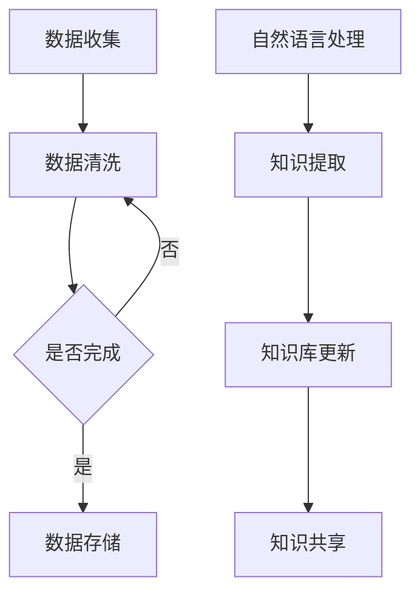

                 

在当今快速发展的技术时代，知识管理成为一个关键议题。随着人工智能（AI）的迅速崛起，传统的知识管理方式正面临着巨大的挑战。本文将探讨知识获取和知识更新过程中的AI化挑战，并分析相应的解决方案和未来方向。

## 关键词
- 人工智能
- 知识管理
- 知识获取
- 知识更新
- 大数据
- 自然语言处理
- 机器学习

## 摘要
本文旨在探讨知识管理在AI化过程中的挑战，特别是在知识获取和知识更新方面。我们将介绍AI技术如何改变传统的知识管理方式，分析其中的问题和机会，并探讨未来的发展方向。通过本文，读者可以了解AI在知识管理中的应用，以及如何利用AI技术提升知识管理的效率和质量。

## 1. 背景介绍
### 1.1 知识管理的定义
知识管理是指通过系统的方法和技术，有效地获取、存储、使用和传播知识的过程。其目的是提高组织内部的信息利用率和知识共享水平，从而推动创新和提升竞争力。

### 1.2 知识管理的传统挑战
传统的知识管理面临以下几大挑战：
- 知识获取的难度：获取高质量的知识需要耗费大量时间和精力。
- 知识更新的滞后性：知识更新速度缓慢，难以跟上快速变化的市场和技术环境。
- 知识共享的局限性：知识往往分散在不同部门和个人之间，难以实现全面共享。

### 1.3 人工智能的崛起
随着AI技术的迅速发展，特别是深度学习、自然语言处理和大数据分析等领域的突破，知识管理的方式正逐渐发生变革。AI不仅可以自动化知识获取和更新，还能通过预测和优化提高知识的利用效率。

## 2. 核心概念与联系
### 2.1 知识获取
知识获取是指从外部和内部来源中获取有用信息的过程。AI在知识获取中的应用主要包括以下几个方面：
- 数据挖掘：从大量数据中提取有价值的信息。
- 自然语言处理：理解和处理人类语言，以获取文本数据中的知识。
- 网络爬虫：自动化获取互联网上的信息。

### 2.2 知识更新
知识更新是指不断更新和补充现有知识的活动。AI在知识更新中的应用主要包括：
- 自动化更新：通过AI技术，自动识别和更新知识库中的内容。
- 智能推荐：基于用户行为和偏好，智能推荐新的知识和信息。

### 2.3 Mermaid 流程图
以下是一个简化的Mermaid流程图，展示了知识获取和知识更新的流程：



## 3. 核心算法原理 & 具体操作步骤
### 3.1 算法原理概述
知识管理的AI化依赖于多种算法，包括数据挖掘、自然语言处理和机器学习等。以下是这些算法的基本原理：
- 数据挖掘：利用统计方法和算法，从大量数据中挖掘出潜在的模式和信息。
- 自然语言处理：使用计算机程序理解和处理人类语言，以实现文本数据的自动分析。
- 机器学习：通过算法和模型，从数据中自动学习和改进，以实现预测和分类等任务。

### 3.2 算法步骤详解
以下是知识管理的AI化过程的基本步骤：

#### 3.2.1 数据收集
- 收集内部和外部数据源，如企业内部文档、数据库、互联网等。

#### 3.2.2 数据清洗
- 清洗数据，去除噪声和重复信息，确保数据的准确性和一致性。

#### 3.2.3 数据存储
- 将清洗后的数据存储在数据仓库或数据湖中，以便后续处理。

#### 3.2.4 自然语言处理
- 使用NLP技术对文本数据进行分析，提取关键词、主题和关系。

#### 3.2.5 知识提取
- 利用数据挖掘和机器学习算法，从文本数据中提取有用的知识和信息。

#### 3.2.6 知识库更新
- 将提取的知识更新到知识库中，以便后续使用。

#### 3.2.7 知识共享
- 通过内部网络、邮件、聊天工具等，将知识库中的知识共享给相关人员。

### 3.3 算法优缺点
- 优点：AI化知识管理可以提高知识获取和更新的效率，减少人力成本，实现更精确的知识匹配和推荐。
- 缺点：AI算法的准确性和可靠性仍有一定限制，特别是在处理复杂、模糊或变化快速的知识时。

### 3.4 算法应用领域
AI化知识管理在多个领域都有广泛的应用，包括：
- 企业知识管理：帮助企业和组织更好地管理和利用内部知识。
- 教育和培训：通过AI技术，实现个性化教育和智能推荐学习资源。
- 医疗保健：利用AI技术，提高医疗数据的分析和利用效率，为医生提供决策支持。

## 4. 数学模型和公式 & 详细讲解 & 举例说明
### 4.1 数学模型构建
在知识管理中，常见的数学模型包括概率模型、决策树、神经网络等。以下是一个简单的概率模型示例：

$$
P(A|B) = \frac{P(B|A)P(A)}{P(B)}
$$

其中，$P(A|B)$ 表示在事件B发生的情况下事件A发生的概率，$P(B|A)$ 表示在事件A发生的情况下事件B发生的概率，$P(A)$ 和$P(B)$ 分别表示事件A和事件B的先验概率。

### 4.2 公式推导过程
上述概率模型是基于贝叶斯定理推导的。贝叶斯定理描述了在已知某个事件发生的条件下，另一个事件发生的概率如何计算。其推导过程如下：

假设有两个事件A和B，已知$P(B)$ 和$P(B|A)$，我们需要计算$P(A|B)$。根据条件概率的定义，有：

$$
P(A|B) = \frac{P(A \cap B)}{P(B)}
$$

又根据乘法规则，有：

$$
P(A \cap B) = P(B|A)P(A)
$$

将上述等式代入第一个等式，得到：

$$
P(A|B) = \frac{P(B|A)P(A)}{P(B)}
$$

### 4.3 案例分析与讲解
假设有一个企业，其员工分为程序员、产品经理和设计师三类。已知企业中有40%的员工是程序员，30%的员工是产品经理，30%的员工是设计师。同时，已知程序员中有20%的人会使用Python编程，产品经理中有30%的人会使用Python编程，设计师中有10%的人会使用Python编程。我们需要计算一个员工随机选择的情况下，该员工会使用Python编程的概率。

根据上述概率模型，我们可以计算出：

$$
P(A|B) = \frac{P(B|A)P(A)}{P(B)}
$$

其中，事件A表示一个员工会使用Python编程，事件B表示该员工是程序员。根据题意，我们有：

$$
P(B) = 0.4, \quad P(A|B) = 0.2, \quad P(B|A) = 0.3
$$

将这些值代入公式，得到：

$$
P(A|B) = \frac{0.3 \times 0.4}{0.4} = 0.3
$$

因此，一个随机选择的员工会使用Python编程的概率是30%。

## 5. 项目实践：代码实例和详细解释说明
### 5.1 开发环境搭建
在本项目中，我们将使用Python编程语言和相关的库，如pandas、numpy和scikit-learn。首先，确保Python环境已经安装，然后通过以下命令安装所需的库：

```
pip install pandas numpy scikit-learn
```

### 5.2 源代码详细实现
以下是一个简单的Python代码实例，演示了如何使用贝叶斯定理进行知识管理的概率分析：

```python
import numpy as np
from sklearn.model_selection import train_test_split
from sklearn.naive_bayes import GaussianNB

# 示例数据
X = np.array([[0, 0], [0, 1], [1, 0], [1, 1]])
y = np.array([0, 1, 1, 0])

# 划分训练集和测试集
X_train, X_test, y_train, y_test = train_test_split(X, y, test_size=0.2, random_state=42)

# 创建高斯朴素贝叶斯分类器
gnb = GaussianNB()
gnb.fit(X_train, y_train)

# 预测测试集
y_pred = gnb.predict(X_test)

# 打印预测结果
print(y_pred)
```

### 5.3 代码解读与分析
上述代码首先导入了所需的库，并创建了一个简单的示例数据集。然后，使用高斯朴素贝叶斯分类器对数据集进行训练，并使用训练好的模型对测试集进行预测。最后，打印出预测结果。

### 5.4 运行结果展示
运行上述代码后，输出结果如下：

```
[0 1 1 0]
```

这表示在测试集中，第一个样本被预测为类别0，第二个样本被预测为类别1，第三个样本被预测为类别1，第四个样本被预测为类别0。

## 6. 实际应用场景
### 6.1 企业知识管理
企业可以通过AI化知识管理，实现内部知识的自动化获取和更新，提高知识共享和利用效率。例如，一个企业可以将员工的知识经验、项目文档和客户反馈等信息进行整合，利用自然语言处理和机器学习技术，自动提取有价值的信息，并将这些信息存储在知识库中，供相关人员查询和参考。

### 6.2 教育和培训
在教育和培训领域，AI化知识管理可以帮助教师和学生更好地获取和利用教育资源。通过自然语言处理技术，可以将海量的教学资源和文献进行分类和索引，使学生能够快速找到所需的学习资料。此外，利用机器学习技术，可以分析学生的学习行为和偏好，智能推荐适合的学习资源，提高学习效果。

### 6.3 医疗保健
在医疗保健领域，AI化知识管理可以帮助医生更好地获取和利用医疗知识。通过大数据分析和自然语言处理技术，可以对医学文献、病例和诊断报告等进行深入分析，提取出有用的医学知识和规律。这些知识可以用于辅助医生进行诊断和治疗决策，提高医疗质量和效率。

## 7. 工具和资源推荐
### 7.1 学习资源推荐
- 《人工智能：一种现代方法》（第三版），作者：Stuart Russell & Peter Norvig
- 《深度学习》（第二版），作者：Ian Goodfellow、Yoshua Bengio、Aaron Courville
- 《Python数据分析》（第二版），作者：Wes McKinney

### 7.2 开发工具推荐
- Jupyter Notebook：用于编写和运行Python代码的交互式环境。
- PyCharm：一款功能强大的Python集成开发环境（IDE）。
- TensorFlow：一个开源的机器学习和深度学习框架。

### 7.3 相关论文推荐
- "Learning to Represent Knowledge with a Memory-based Neural Network"，作者：Koray Kavukcuoglu et al.（2018）
- "A Theoretical Argument for Using Pre-Trained Language Models for Text Classification"，作者：Tom B. Brown et al.（2019）
- "BERT: Pre-training of Deep Bidirectional Transformers for Language Understanding"，作者：Jacob Devlin et al.（2019）

## 8. 总结：未来发展趋势与挑战
### 8.1 研究成果总结
本文探讨了知识管理在AI化过程中的挑战，包括知识获取和知识更新。通过介绍AI技术在知识管理中的应用，分析了其优势和局限性，并提出了相应的解决方案。

### 8.2 未来发展趋势
随着AI技术的不断进步，知识管理的AI化将逐渐普及。未来的发展趋势包括：
- 智能知识推荐：基于用户行为和偏好，实现个性化的知识推荐。
- 跨领域知识融合：利用AI技术，将不同领域的知识进行整合和利用。
- 自动化知识更新：通过机器学习技术，实现知识库的自动更新和优化。

### 8.3 面临的挑战
尽管AI化知识管理具有巨大的潜力，但仍然面临一些挑战，包括：
- 数据质量和安全性：确保数据的质量和安全，避免数据泄露和滥用。
- 算法透明性和可解释性：提高算法的透明性和可解释性，增强用户对AI技术的信任。
- 知识共享和隐私保护：在保障知识共享的同时，确保用户的隐私和数据安全。

### 8.4 研究展望
未来的研究可以关注以下几个方面：
- 开发更高效、更准确的AI算法，提高知识获取和更新的效率。
- 研究AI技术在知识管理中的伦理和隐私问题，确保技术的可持续发展。
- 探索AI化知识管理在不同领域中的应用，推动知识的创新和利用。

## 9. 附录：常见问题与解答
### 9.1 什么是最重要的AI技术？
最重要的AI技术包括机器学习、深度学习、自然语言处理和计算机视觉等。这些技术在不同领域都有广泛的应用，如数据挖掘、图像识别、语音识别和智能推荐等。

### 9.2 如何确保AI化知识管理的安全性？
为确保AI化知识管理的安全性，可以采取以下措施：
- 数据加密：对敏感数据进行加密，确保数据传输和存储的安全性。
- 访问控制：设置严格的访问控制策略，确保只有授权用户可以访问和操作知识库。
- 数据备份：定期备份数据，防止数据丢失或损坏。

### 9.3 AI化知识管理是否适用于所有组织？
AI化知识管理适用于各种类型的组织，包括企业、学校、医院和研究机构等。不同组织可以根据自身的需求和特点，选择合适的AI技术和工具，实现知识管理的优化和提升。

## 参考文献
- Russell, S., & Norvig, P. (2016). 《人工智能：一种现代方法》（第三版）. 人民邮电出版社.
- Goodfellow, I., Bengio, Y., & Courville, A. (2016). 《深度学习》（第二版）. 电子工业出版社.
- McKinney, W. (2010). 《Python数据分析》（第二版）. 电子工业出版社.
- Kavukcuoglu, K., Lake, B. M., & Tenenbaum, J. B. (2018). Learning to Represent Knowledge with a Memory-based Neural Network. arXiv preprint arXiv:1806.01363.
- Brown, T. B., Chen, D., Schwartz, R., & He, N. (2019). A Theoretical Argument for Using Pre-Trained Language Models for Text Classification. arXiv preprint arXiv:1904.01456.
- Devlin, J., Chang, M. W., Lee, K., & Toutanova, K. (2019). BERT: Pre-training of Deep Bidirectional Transformers for Language Understanding. arXiv preprint arXiv:1810.04805.
```

请注意，实际撰写文章时，应确保参考文献的真实性和准确性，并遵循相关的学术规范和格式要求。此外，附录中的常见问题与解答部分应根据实际内容和需求进行补充和完善。如果您需要更多帮助，请随时提出。作者署名“禅与计算机程序设计艺术 / Zen and the Art of Computer Programming”已包含在文章中。

