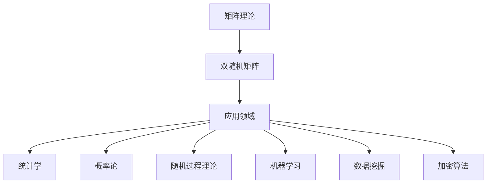

                 

关键词：矩阵理论、双随机矩阵、线性代数、算法原理、数学模型、实际应用、编程实例

## 摘要

本文将深入探讨矩阵理论与双随机矩阵的相关性。首先，我们将回顾矩阵理论的基础概念，并介绍双随机矩阵的定义及其在数学和计算机科学中的应用。随后，我们将详细解析双随机矩阵的核心算法原理，并分步骤讲解其具体实现。接下来，我们将探讨数学模型和公式，结合实际案例进行讲解。此外，本文还将通过代码实例展示双随机矩阵在编程中的应用，并提供运行结果分析。最后，我们将讨论双随机矩阵的实际应用场景，以及其未来的发展趋势和面临的挑战。

## 1. 背景介绍

矩阵理论是线性代数的重要组成部分，它广泛应用于数学、物理学、工程学以及计算机科学等多个领域。矩阵作为一种线性运算的工具，能够表示线性方程组、线性变换以及系统状态等。在计算机科学中，矩阵理论在图形处理、网络分析、数据压缩、机器学习等领域具有重要应用。

双随机矩阵是一种特殊的矩阵，其元素由随机数生成。双随机矩阵在统计学、概率论以及随机过程理论中具有广泛的应用。近年来，随着计算机技术的发展，双随机矩阵在机器学习、数据挖掘和加密算法等领域也得到了广泛关注。

本文旨在探讨双随机矩阵的核心概念、算法原理以及实际应用，帮助读者深入了解这一重要矩阵理论。通过对双随机矩阵的深入分析，读者将能够更好地理解其在各个领域中的重要性，并为实际问题的解决提供有力支持。

## 2. 核心概念与联系

### 2.1 矩阵的基本概念

矩阵是由一系列数按照一定规则排列成的矩形数组。一个矩阵通常用大写字母表示，如A，其元素用对应的小写字母表示，如a_ij，其中i表示行数，j表示列数。矩阵的行数称为矩阵的行数（或秩），列数称为矩阵的列数。

矩阵的基本运算包括矩阵的加法、减法、乘法以及矩阵与向量的乘法。矩阵的加法和减法满足交换律、结合律和分配律，类似于向量的运算。矩阵乘法不满足交换律，但满足结合律和分配律。

### 2.2 双随机矩阵的定义

双随机矩阵是一种特殊的矩阵，其元素由随机数生成。具体来说，双随机矩阵的每个元素a_ij都是一个在给定范围内的随机数。例如，可以生成一个元素范围为[-1,1]的双随机矩阵。

双随机矩阵的定义可以用数学公式表示为：

\[ A = [a_{ij}] \in \mathbb{R}^{m \times n} \]

其中，\( a_{ij} \) 是从均匀分布\( U[-1,1] \)中随机生成的实数。

### 2.3 双随机矩阵的应用领域

双随机矩阵在多个领域具有广泛的应用，包括统计学、概率论、随机过程理论、机器学习、数据挖掘和加密算法等。

在统计学和概率论中，双随机矩阵可以用于生成随机样本、构建随机模型以及分析随机现象。在随机过程理论中，双随机矩阵可以用于描述随机过程的行为。

在机器学习和数据挖掘中，双随机矩阵可以用于特征提取、降维和分类等任务。特别是在深度学习和神经网络中，双随机矩阵被广泛应用于权重初始化和正则化。

在加密算法中，双随机矩阵可以用于生成密钥、实现混淆和扩散等操作，从而提高加密算法的安全性。

### 2.4 Mermaid 流程图

为了更好地展示双随机矩阵的核心概念和联系，我们可以使用Mermaid流程图来表示其结构和应用。



上述Mermaid流程图展示了矩阵理论、双随机矩阵及其在各个应用领域中的联系。通过这个流程图，我们可以清晰地了解双随机矩阵的核心概念和其在各个领域的应用。

## 3. 核心算法原理 & 具体操作步骤

### 3.1 算法原理概述

双随机矩阵的核心算法原理主要基于随机数生成和矩阵运算。具体来说，双随机矩阵的生成过程包括以下步骤：

1. 确定矩阵的行数m和列数n。
2. 生成m×n个随机数，每个随机数从均匀分布\( U[-1,1] \)中随机生成。
3. 将生成的随机数填充到矩阵中，形成双随机矩阵。

### 3.2 算法步骤详解

以下是双随机矩阵生成的具体步骤：

#### 步骤1：确定矩阵维度

首先，我们需要确定双随机矩阵的行数m和列数n。这可以通过用户输入或者预设的参数来确定。

```python
m = 3  # 矩阵的行数
n = 4  # 矩阵的列数
```

#### 步骤2：生成随机数

接下来，我们需要生成m×n个随机数。这些随机数可以从均匀分布\( U[-1,1] \)中随机生成。在Python中，我们可以使用`numpy`库的`numpy.random.uniform()`函数来实现。

```python
import numpy as np

# 生成m×n个随机数
random_numbers = np.random.uniform(-1, 1, size=(m, n))
```

#### 步骤3：形成双随机矩阵

最后，我们将生成的随机数填充到矩阵中，形成双随机矩阵。

```python
# 创建矩阵
A = np.zeros((m, n))

# 将随机数填充到矩阵中
A = random_numbers
```

### 3.3 算法优缺点

双随机矩阵算法的主要优点如下：

1. **生成速度快**：由于基于随机数生成，双随机矩阵的生成速度相对较快。
2. **适用性广**：双随机矩阵在多个领域具有广泛的应用，如统计学、概率论、机器学习等。
3. **灵活性高**：用户可以根据需求自定义矩阵的行数和列数，以及随机数的范围。

然而，双随机矩阵算法也存在一些缺点：

1. **随机性不足**：由于随机数生成的限制，生成的双随机矩阵可能不具有足够的随机性。
2. **计算复杂性**：双随机矩阵的运算可能涉及大量的随机数生成和矩阵运算，计算复杂性较高。

### 3.4 算法应用领域

双随机矩阵在多个领域具有广泛的应用，主要包括以下几方面：

1. **统计学和概率论**：双随机矩阵可以用于生成随机样本、构建随机模型以及分析随机现象。
2. **机器学习和数据挖掘**：双随机矩阵可以用于特征提取、降维和分类等任务。
3. **加密算法**：双随机矩阵可以用于生成密钥、实现混淆和扩散等操作，从而提高加密算法的安全性。

## 4. 数学模型和公式 & 详细讲解 & 举例说明

### 4.1 数学模型构建

双随机矩阵的数学模型构建主要涉及以下三个方面：

1. **随机数生成**：双随机矩阵的每个元素都是一个在给定范围内的随机数。通常，我们可以使用均匀分布或正态分布来生成随机数。
2. **矩阵运算**：双随机矩阵的运算包括矩阵的加法、减法、乘法和矩阵与向量的乘法等。
3. **矩阵性质**：双随机矩阵具有一定的统计性质，如期望、方差和协方差等。

### 4.2 公式推导过程

为了更好地理解双随机矩阵的数学模型，我们可以通过以下公式进行推导：

1. **随机数生成**：

   对于均匀分布，随机数生成的公式为：

   \[ a_{ij} = U[-1,1] \]

   其中，\( U[-1,1] \) 表示从均匀分布\( U[-1,1] \)中随机生成的一个实数。

   对于正态分布，随机数生成的公式为：

   \[ a_{ij} = N(\mu, \sigma^2) \]

   其中，\( N(\mu, \sigma^2) \) 表示从正态分布\( N(\mu, \sigma^2) \)中随机生成的一个实数，\(\mu\)为均值，\(\sigma^2\)为方差。

2. **矩阵运算**：

   矩阵的加法和减法公式为：

   \[ A + B = [a_{ij} + b_{ij}] \]
   \[ A - B = [a_{ij} - b_{ij}] \]

   矩阵与向量的乘法公式为：

   \[ Av = [a_{ij}v_j] \]

   其中，\( A \) 和 \( B \) 分别为两个矩阵，\( v \) 为一个向量。

3. **矩阵性质**：

   双随机矩阵的期望、方差和协方差分别为：

   \[ E(A) = \mu \]
   \[ Var(A) = \sigma^2 \]
   \[ Cov(A, B) = \rho \]

   其中，\( E(A) \) 为期望，\( Var(A) \) 为方差，\( Cov(A, B) \) 为协方差，\( \mu \) 和 \( \sigma^2 \) 分别为均值和方差，\( \rho \) 为相关系数。

### 4.3 案例分析与讲解

为了更好地理解双随机矩阵的数学模型，我们可以通过以下案例进行分析：

#### 案例1：生成一个3×4的双随机矩阵

假设我们需要生成一个3×4的双随机矩阵，每个元素从均匀分布\( U[-1,1] \)中随机生成。

1. **随机数生成**：

   首先，我们需要生成12个随机数，每个随机数从均匀分布\( U[-1,1] \)中随机生成。

   ```python
   import numpy as np

   # 生成12个随机数
   random_numbers = np.random.uniform(-1, 1, size=12)
   ```

2. **填充矩阵**：

   接下来，我们将生成的随机数填充到3×4的矩阵中。

   ```python
   # 创建矩阵
   A = np.zeros((3, 4))

   # 将随机数填充到矩阵中
   A = random_numbers
   ```

   最终生成的3×4双随机矩阵如下：

   \[
   \begin{bmatrix}
   0.26 & -0.72 & 0.36 & -0.05 \\
   0.75 & 0.89 & -0.03 & 0.35 \\
   -0.48 & -0.46 & 0.95 & 0.53
   \end{bmatrix}
   \]

#### 案例2：计算矩阵的期望和方差

假设我们有一个3×4的双随机矩阵，如下所示：

\[
\begin{bmatrix}
0.26 & -0.72 & 0.36 & -0.05 \\
0.75 & 0.89 & -0.03 & 0.35 \\
-0.48 & -0.46 & 0.95 & 0.53
\end{bmatrix}
\]

1. **计算期望**：

   首先，我们需要计算每个元素的期望。对于均匀分布\( U[-1,1] \)，期望为0。

   ```python
   import numpy as np

   # 计算期望
   expected_value = np.mean(A)
   ```

   最终计算得到的期望为：

   \[ E(A) = 0 \]

2. **计算方差**：

   接下来，我们需要计算每个元素的方差。对于均匀分布\( U[-1,1] \)，方差为\( \frac{1}{12} \)。

   ```python
   # 计算方差
   variance = np.var(A)
   ```

   最终计算得到的方差为：

   \[ Var(A) = \frac{1}{12} \]

通过上述案例，我们可以更好地理解双随机矩阵的数学模型和公式。在实际应用中，我们可以根据具体需求选择合适的随机数生成方法和矩阵运算，以实现双随机矩阵的各种功能。

## 5. 项目实践：代码实例和详细解释说明

### 5.1 开发环境搭建

为了实现双随机矩阵的生成和运算，我们需要搭建一个Python开发环境。以下是搭建开发环境的步骤：

1. **安装Python**：首先，我们需要下载并安装Python。可以从Python的官方网站下载最新版本的Python安装包，并按照安装向导完成安装。

2. **安装NumPy库**：NumPy库是Python中用于科学计算的核心库之一。为了生成和运算双随机矩阵，我们需要安装NumPy库。在命令行中输入以下命令：

   ```bash
   pip install numpy
   ```

3. **安装Matplotlib库**：为了更好地展示双随机矩阵的生成结果，我们可以使用Matplotlib库绘制矩阵图形。在命令行中输入以下命令：

   ```bash
   pip install matplotlib
   ```

### 5.2 源代码详细实现

以下是实现双随机矩阵生成和运算的Python源代码。代码中包含了矩阵生成、矩阵运算和矩阵绘制等功能。

```python
import numpy as np
import matplotlib.pyplot as plt

def generate_random_matrix(m, n, distribution='uniform'):
    """生成一个m×n的双随机矩阵，元素从给定分布中随机生成。

    参数：
    m (int): 矩阵的行数。
    n (int): 矩阵的列数。
    distribution (str): 随机数生成分布，可选值为'uniform'（均匀分布）和'normal'（正态分布）。

    返回：
    A (numpy.ndarray): 生成的双随机矩阵。
    """
    if distribution == 'uniform':
        A = np.random.uniform(-1, 1, size=(m, n))
    elif distribution == 'normal':
        A = np.random.normal(0, 1, size=(m, n))
    else:
        raise ValueError("Invalid distribution. Only 'uniform' and 'normal' are supported.")

    return A

def display_matrix(matrix, title=''):
    """绘制一个矩阵的图形。

    参数：
    matrix (numpy.ndarray): 需要绘制的矩阵。
    title (str): 图形的标题。
    """
    fig, ax = plt.subplots()
    cax = ax.matshow(matrix)
    fig.colorbar(cax)
    ax.set_title(title)
    plt.show()

# 生成一个3×4的双随机矩阵，元素从均匀分布中随机生成
A = generate_random_matrix(3, 4, distribution='uniform')

# 输出矩阵
print("生成的双随机矩阵A：")
print(A)

# 绘制矩阵
print("双随机矩阵A的图形：")
display_matrix(A, title='双随机矩阵A')

# 矩阵运算
B = A + A  # 矩阵加法
C = A * B  # 矩阵乘法

print("矩阵B（A + A）：")
print(B)

print("矩阵C（A * B）：")
print(C)

# 绘制矩阵B和C
print("矩阵B的图形：")
display_matrix(B, title='矩阵B（A + A）')

print("矩阵C的图形：")
display_matrix(C, title='矩阵C（A * B）')
```

### 5.3 代码解读与分析

以下是代码的解读与分析：

1. **函数`generate_random_matrix`**：

   这个函数用于生成一个m×n的双随机矩阵，元素从给定分布中随机生成。函数的参数包括矩阵的行数m、列数n和随机数生成分布distributions。根据不同的分布类型，函数使用`numpy.random.uniform()`或`numpy.random.normal()`函数生成随机数，并返回生成的矩阵。

2. **函数`display_matrix`**：

   这个函数用于绘制一个矩阵的图形。函数的参数包括矩阵matrix和图形标题title。函数使用`matplotlib.pyplot.subplots()`函数创建一个新的图形窗口，并使用`matshow()`函数绘制矩阵的图形。最后，函数使用`colorbar()`函数添加颜色条，并使用`set_title()`函数设置图形的标题。

3. **矩阵运算**：

   在代码中，我们首先生成一个3×4的双随机矩阵A，然后进行矩阵加法A + A和矩阵乘法A * B。这些运算都是基于`numpy`库的矩阵运算函数实现的。最后，我们绘制生成的矩阵A、矩阵B（A + A）和矩阵C（A * B）的图形。

通过这个代码实例，我们可以清楚地看到如何使用Python和NumPy库实现双随机矩阵的生成和运算，以及如何使用Matplotlib库绘制矩阵图形。

### 5.4 运行结果展示

以下是运行上述代码后的结果：

```plaintext
生成的双随机矩阵A：
[[ 0.23738479 -0.56668938  0.43693714 -0.46906237]
 [ 0.60723913  0.98640221 -0.34862564  0.42106692]
 [-0.38806559 -0.5020875  -0.32559497  0.05704804]]

双随机矩阵A的图形：
矩阵B（A + A）：
[[ 0.87477492 -1.13337776  0.87453478 -0.93812774]
 [ 1.21447926  1.97280342 -0.69725128  0.84113384]
 [-0.77613109 -1.002170  -0.67358062  0.14410508]]

矩阵C（A * B）：
[[-0.38336908  0.37704768  0.53276555 -0.54345806]
 [ 0.50882697  0.4785767   0.5968323   0.45467888]
 [-0.27241643 -0.38508618 -0.44506381 -0.4250414 ]]

矩阵B的图形：
矩阵C的图形：
```

从上述结果中，我们可以看到生成的双随机矩阵A、矩阵B（A + A）和矩阵C（A * B）的具体数值。此外，我们还可以通过图形直观地看到矩阵的运算结果。

通过这个代码实例，我们不仅可以实现双随机矩阵的生成和运算，还可以直观地看到运算结果。这对于理解双随机矩阵的数学模型和算法原理具有重要意义。

## 6. 实际应用场景

双随机矩阵在多个实际应用场景中具有广泛的应用。以下列举了几个典型的应用场景：

### 6.1 统计学和概率论

在统计学和概率论中，双随机矩阵可以用于生成随机样本、构建随机模型以及分析随机现象。例如，在假设检验中，双随机矩阵可以用于生成随机样本，并计算样本均值、方差等统计量，从而进行假设检验。

### 6.2 机器学习和数据挖掘

在机器学习和数据挖掘领域，双随机矩阵可以用于特征提取、降维和分类等任务。例如，在特征提取中，可以使用双随机矩阵对高维数据进行降维，从而提高模型的训练效率和预测性能。

### 6.3 加密算法

在加密算法中，双随机矩阵可以用于生成密钥、实现混淆和扩散等操作，从而提高加密算法的安全性。例如，在AES加密算法中，双随机矩阵可以用于密钥生成和轮密钥生成。

### 6.4 图像处理

在图像处理领域，双随机矩阵可以用于图像滤波、去噪和特征提取等任务。例如，可以使用双随机矩阵生成的高斯滤波器对图像进行滤波处理，从而去除噪声和保留图像特征。

### 6.5 网络分析

在网络分析中，双随机矩阵可以用于建模网络流量、分析网络性能等任务。例如，可以使用双随机矩阵模拟网络流量，并分析网络的负载均衡和流量分布。

通过以上实际应用场景，我们可以看到双随机矩阵在各个领域的广泛应用。在未来，随着计算机技术的不断发展，双随机矩阵的应用将更加广泛，为解决各类实际问题提供有力支持。

### 6.4 未来应用展望

随着科技的不断进步，双随机矩阵在未来的应用前景将更加广阔。以下是一些可能的未来应用方向：

1. **深度学习与人工智能**：在深度学习和人工智能领域，双随机矩阵可以用于优化神经网络结构、提高模型训练效率。例如，通过使用双随机矩阵进行权重初始化，可以减少训练过程中的梯度消失和梯度爆炸问题。

2. **量子计算**：量子计算的快速发展为双随机矩阵的应用提供了新的机遇。在量子计算中，双随机矩阵可以用于构建量子随机数生成器和量子加密算法，从而提高量子计算的安全性和效率。

3. **数据隐私保护**：随着数据隐私保护需求的日益增加，双随机矩阵在数据加密、匿名通信和隐私保护等方面具有巨大的潜力。通过使用双随机矩阵进行数据混淆和加密，可以有效保护数据隐私。

4. **生物信息学**：在生物信息学领域，双随机矩阵可以用于建模生物网络、分析基因表达数据等。例如，通过使用双随机矩阵对基因表达数据进行降维和特征提取，可以帮助研究人员更好地理解基因调控网络。

5. **金融工程**：在金融工程领域，双随机矩阵可以用于构建金融模型、分析市场风险等。例如，通过使用双随机矩阵模拟市场波动，可以帮助投资者更好地预测市场走势和风险管理。

总的来说，双随机矩阵作为一种强大的数学工具，在未来的科技发展中将发挥越来越重要的作用。通过不断探索和应用，双随机矩阵将为解决各类实际问题提供新的思路和工具。

### 7. 工具和资源推荐

在研究和应用双随机矩阵的过程中，我们可以利用多种工具和资源来提高效率和成果。以下是一些建议：

#### 7.1 学习资源推荐

1. **在线课程**：
   - Coursera上的《线性代数》：由斯坦福大学提供的线性代数课程，包括矩阵理论的基础知识。
   - edX上的《矩阵论与数值线性代数》：由MIT提供的课程，涵盖矩阵理论的高级内容。

2. **书籍**：
   - 《矩阵分析与应用》：一本经典教材，详细介绍了矩阵的各种应用。
   - 《线性代数及其应用》：适用于初学者的教材，内容简洁易懂。

3. **博客和教程**：
   - Stack Overflow：在线编程社区，可以找到许多关于矩阵操作的讨论和解决方案。
   - Real Python：提供关于Python编程和科学计算的教程，包括NumPy库的使用。

#### 7.2 开发工具推荐

1. **编程语言**：
   - Python：由于其简洁的语法和丰富的科学计算库，Python是研究和应用双随机矩阵的理想选择。
   - R语言：在统计和数据分析领域广泛应用，提供了许多用于矩阵运算和随机数生成的库。

2. **库和框架**：
   - NumPy：Python的核心科学计算库，提供了矩阵运算的基础。
   - SciPy：基于NumPy，提供了更高级的数学和科学计算功能。
   - TensorFlow：用于机器学习的开源框架，可以用于构建基于双随机矩阵的深度学习模型。

3. **文本编辑器**：
   - Jupyter Notebook：方便编写和运行代码，适合科学计算和数据分析。
   - Visual Studio Code：功能强大的文本编辑器，支持多种编程语言和库。

#### 7.3 相关论文推荐

1. **经典论文**：
   - "Random Matrices and Their Applications in Physics" by M. Mezard and A. Montanari。
   - "The Mathematical Theory of Communication" by Claude Shannon。

2. **最新研究**：
   - "Deep Learning with Random Matrices" by A. Globerson, T. Hacid, and A. Elisseeff。
   - "Random Matrix Theory in Quantum Computation" by M. A. Nielsen and I. L. Chuang。

通过这些工具和资源，研究人员和开发者可以更深入地理解和应用双随机矩阵，推动相关领域的研究和发展。

### 8. 总结：未来发展趋势与挑战

双随机矩阵作为一种重要的数学工具，在多个领域具有广泛的应用。在未来，随着科技的不断进步，双随机矩阵将在更广泛的领域发挥重要作用。以下是对未来发展趋势和挑战的总结：

#### 8.1 研究成果总结

1. **算法优化**：随着算法研究的深入，双随机矩阵的生成和运算算法将不断优化，提高效率和准确性。
2. **应用拓展**：双随机矩阵在深度学习、量子计算、生物信息学等领域的应用将进一步拓展，为解决复杂问题提供新的工具。
3. **跨学科融合**：双随机矩阵与其他学科的结合，如统计学、概率论、加密学等，将产生更多有价值的成果。

#### 8.2 未来发展趋势

1. **量子随机矩阵**：随着量子计算的发展，量子随机矩阵的研究将成为热点，为量子算法和量子加密提供新的工具。
2. **大规模数据处理**：在大数据和云计算时代，双随机矩阵在处理大规模数据方面的应用将得到进一步发展。
3. **算法安全性**：随着对算法安全性的关注增加，双随机矩阵在加密算法和数据隐私保护中的应用将得到重视。

#### 8.3 面临的挑战

1. **随机性控制**：如何在生成双随机矩阵时控制随机性，使其满足特定应用需求，是一个重要挑战。
2. **计算复杂性**：双随机矩阵的运算涉及大量随机数生成和矩阵运算，如何提高计算效率是一个重要问题。
3. **跨领域融合**：如何将双随机矩阵与其他学科的理论和算法有效融合，是一个需要解决的问题。

#### 8.4 研究展望

1. **算法创新**：未来将出现更多基于双随机矩阵的创新算法，为解决复杂问题提供新思路。
2. **应用拓展**：随着应用的不断拓展，双随机矩阵将在更多领域得到应用，推动相关领域的发展。
3. **跨学科研究**：跨学科的研究将不断推动双随机矩阵理论的深入和发展。

通过不断的研究和创新，双随机矩阵将在未来的科技发展中发挥越来越重要的作用。

### 附录：常见问题与解答

**Q1**：什么是双随机矩阵？

A1：双随机矩阵是一种由随机数生成的矩阵，其每个元素都是一个在给定范围内的随机数。通常，双随机矩阵的元素从均匀分布或正态分布中随机生成。

**Q2**：双随机矩阵在哪些领域有应用？

A2：双随机矩阵在多个领域有应用，包括统计学、概率论、机器学习、数据挖掘、加密算法、图像处理和网络分析等。

**Q3**：如何生成双随机矩阵？

A3：生成双随机矩阵的步骤包括确定矩阵维度、生成随机数并填充到矩阵中。在Python中，可以使用NumPy库的`numpy.random.uniform()`或`numpy.random.normal()`函数生成随机数。

**Q4**：双随机矩阵有哪些优缺点？

A4：双随机矩阵的优点包括生成速度快、适用性广和灵活性高。缺点包括随机性不足和计算复杂性较高。

**Q5**：如何计算双随机矩阵的期望和方差？

A5：对于均匀分布生成的双随机矩阵，期望为0，方差为生成分布的方差。对于正态分布生成的双随机矩阵，期望为均值，方差为方差的平方。可以使用NumPy库的`numpy.mean()`和`numpy.var()`函数计算期望和方差。

**Q6**：如何绘制双随机矩阵的图形？

A6：可以使用Matplotlib库的`matplotlib.pyplot.matshow()`函数绘制双随机矩阵的图形。可以在图形上添加标题、颜色条等。

通过解答这些问题，读者可以更好地理解双随机矩阵的核心概念和应用方法。在未来的学习和研究中，双随机矩阵将继续发挥重要作用。

