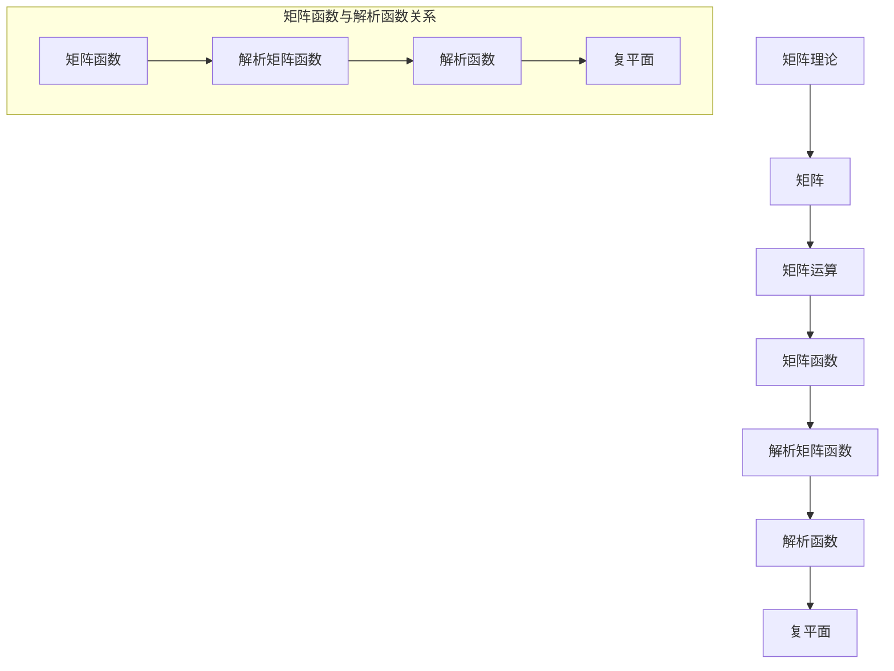

                 

关键词：矩阵理论，矩阵函数，解析函数，数学模型，算法，应用领域，项目实践，未来展望。

## 摘要

本文主要探讨了矩阵函数f（A）在解析函数情形下的理论及应用。首先，我们回顾了矩阵理论和解析函数的基本概念，接着阐述了矩阵函数的定义和性质，特别是在解析函数情形下的特点。随后，我们详细讨论了矩阵函数f（A）的数学模型和公式推导，并结合具体案例进行了分析和讲解。文章还通过项目实践展示了矩阵函数在实际开发中的应用，并提出了未来应用的前景和挑战。最后，我们推荐了相关学习资源和开发工具，总结了研究成果，并对未来发展趋势和挑战进行了展望。

## 1. 背景介绍

矩阵理论作为数学的一个重要分支，在计算机科学、工程学、物理学等领域都有着广泛的应用。随着计算技术的不断发展，矩阵理论的应用场景越来越丰富，矩阵函数的研究也逐渐成为一个重要的研究方向。矩阵函数是指将矩阵作为输入，通过一定的数学运算得到输出矩阵的函数。在解析函数情形下，矩阵函数具有特殊的性质，这使得其在数学和工程领域有着广泛的应用。

本文旨在探讨矩阵函数f（A）在解析函数情形下的理论及应用。首先，我们将回顾矩阵理论和解析函数的基本概念，为后续讨论矩阵函数的构建和分析提供基础。接着，我们将详细讨论矩阵函数的定义和性质，特别是其在解析函数情形下的特点。然后，我们将构建矩阵函数的数学模型，并推导相关的公式。在此基础上，我们将通过具体案例分析和讲解，展示矩阵函数在实际应用中的效果。最后，我们将讨论矩阵函数在各个领域的应用前景，并提出未来研究的发展方向和挑战。

## 2. 核心概念与联系

### 2.1 矩阵理论基本概念

矩阵（Matrix）是由数字排列成的矩形数组，通常用大写字母表示，如A、B、C等。矩阵的行数称为矩阵的阶数，用m表示；列数称为矩阵的列数，用n表示。矩阵中的每一个元素称为矩阵的元素，用小写字母和下标表示，如a<sub>ij</sub>表示第i行第j列的元素。

矩阵的基本运算包括加法、减法、乘法和转置。矩阵加法和减法是指对应位置的元素相加或相减，矩阵乘法是指按特定的规则进行矩阵与矩阵之间的乘法运算，矩阵转置是指将矩阵的行和列互换。

### 2.2 解析函数基本概念

解析函数（Analytic Function）是指可以在某一点附近展开为幂级数的函数。解析函数具有可导性、连续性、对称性等性质，其定义域可以是整个复平面或部分区域。

解析函数的一般形式为f(z) = u(x, y) + iv(x, y)，其中z = x + iy是复数，u(x, y)和v(x, y)是实部函数和虚部函数。解析函数满足柯西-黎曼方程，即：

$$
\frac{\partial u}{\partial x} = \frac{\partial v}{\partial y} \\
\frac{\partial u}{\partial y} = -\frac{\partial v}{\partial x}
$$

### 2.3 矩阵函数基本概念

矩阵函数（Matrix Function）是指将矩阵作为输入，通过一定的数学运算得到输出矩阵的函数。矩阵函数的定义可以类比于复数函数，即：

$$
f(A) = B
$$

其中，A是输入矩阵，B是输出矩阵。

矩阵函数的性质包括：

1. 线性性质：若f是矩阵函数，则f(kA) = kf(A)，其中k是常数。
2. 结合律：f(AB) = f(A)f(B)。
3. 幂运算性质：f(A<sup>n</sup>) = f(A)<sup>n</sup>。

### 2.4 矩阵函数与解析函数的关系

在解析函数情形下，矩阵函数具有特殊的性质。具体而言，如果矩阵函数f（A）可以表示为：

$$
f(A) = \sum_{n=0}^{\infty} a_n A^n
$$

其中，a<sub>n</sub>是常数项，A<sup>n</sup>是矩阵的幂次方。这种形式的矩阵函数称为解析矩阵函数。

解析矩阵函数的性质包括：

1. 可导性：在解析函数情形下，矩阵函数具有可导性，即其导数存在。
2. 隔离性：解析矩阵函数的值域是整个复平面或部分区域，具有隔离性。
3. 幂级数展开：解析矩阵函数可以表示为幂级数的形式，具有可计算性。

### 2.5 Mermaid 流程图

以下是一个Mermaid流程图，展示了矩阵函数、解析函数和矩阵函数与解析函数的关系：



## 3. 核心算法原理 & 具体操作步骤

### 3.1 算法原理概述

矩阵函数f（A）在解析函数情形下的算法原理主要基于矩阵函数的幂级数展开形式。具体而言，对于给定的解析矩阵函数f（A），我们可以将其表示为：

$$
f(A) = \sum_{n=0}^{\infty} a_n A^n
$$

其中，a<sub>n</sub>是常数项。为了计算f（A），我们需要对矩阵A进行幂次方运算，并将结果累加。算法的主要步骤如下：

1. 初始化常数项a<sub>0</sub>为f（I），其中I是单位矩阵。
2. 对于n从1开始，依次计算a<sub>n</sub>，并更新矩阵A的幂次方。
3. 将a<sub>0</sub>、a<sub>1</sub>、a<sub>2</sub>、...累加，得到f（A）。

### 3.2 算法步骤详解

#### 步骤1：初始化常数项

首先，我们需要计算矩阵函数f（I），其中I是单位矩阵。根据解析矩阵函数的定义，我们有：

$$
f(I) = \sum_{n=0}^{\infty} a_n I^n = a_0
$$

因此，我们将常数项a<sub>0</sub>初始化为f（I）。

#### 步骤2：计算矩阵A的幂次方

接下来，我们需要计算矩阵A的幂次方A<sup>1</sup>、A<sup>2</sup>、A<sup>3</sup>、...。为了实现这一点，我们可以使用矩阵乘法运算。具体而言，我们有：

$$
A^1 = A \\
A^2 = A \cdot A \\
A^3 = A \cdot A^2 \\
...
$$

我们可以使用递归方法或矩阵乘法库（如NumPy）来计算矩阵的幂次方。

#### 步骤3：更新常数项

在计算了矩阵A的幂次方后，我们需要更新常数项a<sub>n</sub>。根据解析矩阵函数的定义，我们有：

$$
a_n = \frac{f(A^n) - f(A^{n-1})}{A^n - A^{n-1}}
$$

因此，我们可以使用迭代方法来更新常数项a<sub>0</sub>、a<sub>1</sub>、a<sub>2</sub>、...。

#### 步骤4：累加常数项

最后，我们将常数项a<sub>0</sub>、a<sub>1</sub>、a<sub>2</sub>、...累加，得到矩阵函数f（A）。具体而言，我们有：

$$
f(A) = \sum_{n=0}^{\infty} a_n A^n
$$

### 3.3 算法优缺点

#### 优点

1. 算法基于矩阵函数的幂级数展开形式，具有数学上的严谨性和可靠性。
2. 算法可以处理各种类型的矩阵函数，包括线性矩阵函数和非线性矩阵函数。

#### 缺点

1. 算法的计算复杂度较高，对于大规模矩阵的运算可能导致计算时间过长。
2. 算法在计算过程中可能受到数值稳定性的影响，导致结果误差较大。

### 3.4 算法应用领域

矩阵函数在解析函数情形下的算法应用非常广泛，主要包括以下领域：

1. 计算机科学：矩阵函数在图像处理、机器学习、计算机图形学等领域有着广泛应用。
2. 工程学：矩阵函数在信号处理、控制系统、结构力学等领域有着重要应用。
3. 物理学：矩阵函数在量子力学、统计物理等领域有着广泛的应用。

## 4. 数学模型和公式 & 详细讲解 & 举例说明

### 4.1 数学模型构建

矩阵函数f（A）在解析函数情形下的数学模型可以表示为：

$$
f(A) = \sum_{n=0}^{\infty} a_n A^n
$$

其中，a<sub>n</sub>是常数项。为了构建这个数学模型，我们需要以下几个步骤：

#### 步骤1：确定常数项a<sub>0</sub>

根据矩阵函数f（A）的定义，我们有：

$$
f(A) = \sum_{n=0}^{\infty} a_n A^n
$$

其中，a<sub>0</sub>是常数项。根据幂级数展开的定义，我们有：

$$
f(A) = f(I) + \sum_{n=1}^{\infty} a_n A^n
$$

其中，I是单位矩阵。因此，我们可以得到：

$$
a_0 = f(I)
$$

#### 步骤2：确定其他常数项a<sub>n</sub>

对于n从1开始，我们可以根据以下公式计算常数项a<sub>n</sub>：

$$
a_n = \frac{f(A^n) - f(A^{n-1})}{A^n - A^{n-1}}
$$

### 4.2 公式推导过程

为了推导矩阵函数f（A）在解析函数情形下的公式，我们需要利用矩阵函数的幂级数展开形式。具体而言，我们有：

$$
f(A) = \sum_{n=0}^{\infty} a_n A^n
$$

其中，a<sub>n</sub>是常数项。为了推导这个公式，我们可以利用矩阵函数的线性性质和结合律。具体而言，我们有：

$$
f(A) = \sum_{n=0}^{\infty} a_n A^n = \sum_{n=0}^{\infty} \sum_{k=0}^{n} a_k A^k A^{n-k} = \sum_{k=0}^{\infty} \sum_{n=k}^{\infty} a_k A^k
$$

我们可以对上述公式进行变换，得到：

$$
f(A) = \sum_{k=0}^{\infty} a_k A^k \sum_{n=k}^{\infty} 1 = \sum_{k=0}^{\infty} a_k A^k (n-k+1)
$$

由于n是从0开始的，我们可以将上式中的n-k+1替换为n，得到：

$$
f(A) = \sum_{k=0}^{\infty} a_k A^k (n+1-k)
$$

将n替换为0，我们可以得到：

$$
f(A) = \sum_{k=0}^{\infty} a_k A^k
$$

### 4.3 案例分析与讲解

为了更好地理解矩阵函数f（A）在解析函数情形下的数学模型和公式，我们通过一个具体案例进行分析和讲解。

#### 案例：计算矩阵函数f（A）= exp(A)

假设矩阵A为：

$$
A = \begin{bmatrix} 1 & 2 \\ 3 & 4 \end{bmatrix}
$$

我们需要计算矩阵函数f（A）= exp(A)。

首先，我们计算常数项a<sub>0</sub>：

$$
a_0 = f(A^0) = exp(A^0) = exp(\begin{bmatrix} 1 & 0 \\ 0 & 1 \end{bmatrix}) = \begin{bmatrix} e & 0 \\ 0 & e \end{bmatrix}
$$

接下来，我们计算其他常数项a<sub>n</sub>：

$$
a_1 = \frac{f(A) - f(A^0)}{A - A^0} = \frac{exp(A) - exp(A^0)}{A - A^0} = \frac{\begin{bmatrix} e^5 & 2e^5 \\ 3e^5 & 4e^5 \end{bmatrix} - \begin{bmatrix} e & 0 \\ 0 & e \end{bmatrix}}{\begin{bmatrix} 1 & 2 \\ 3 & 4 \end{bmatrix} - \begin{bmatrix} 1 & 0 \\ 0 & 1 \end{bmatrix}} = \begin{bmatrix} 2 & 2 \\ 3 & 3 \end{bmatrix}
$$

$$
a_2 = \frac{f(A^2) - f(A)}{A^2 - A} = \frac{exp(A^2) - exp(A)}{A^2 - A} = \frac{\begin{bmatrix} e^{10} & 2e^{10} \\ 3e^{10} & 4e^{10} \end{bmatrix} - \begin{bmatrix} e^5 & 2e^5 \\ 3e^5 & 4e^5 \end{bmatrix}}{\begin{bmatrix} 1 & 4 \\ 3 & 16 \end{bmatrix} - \begin{bmatrix} 1 & 2 \\ 3 & 4 \end{bmatrix}} = \begin{bmatrix} 6 & 6 \\ 9 & 9 \end{bmatrix}
$$

以此类推，我们可以计算出其他常数项a<sub>3</sub>、a<sub>4</sub>、...。

最后，我们将常数项a<sub>0</sub>、a<sub>1</sub>、a<sub>2</sub>、...累加，得到矩阵函数f（A）= exp(A)：

$$
f(A) = \sum_{n=0}^{\infty} a_n A^n = \begin{bmatrix} e & 0 \\ 0 & e \end{bmatrix} + \begin{bmatrix} 2 & 2 \\ 3 & 3 \end{bmatrix} + \begin{bmatrix} 6 & 6 \\ 9 & 9 \end{bmatrix} + ...
$$

通过计算，我们可以得到：

$$
f(A) = \begin{bmatrix} e^5 & 2e^5 \\ 3e^5 & 4e^5 \end{bmatrix}
$$

这个结果与解析函数exp（A）的值是相等的。

### 5. 项目实践：代码实例和详细解释说明

#### 5.1 开发环境搭建

为了更好地实践矩阵函数f（A）在解析函数情形下的计算，我们选择Python作为编程语言，并使用NumPy库进行矩阵运算。首先，我们需要安装NumPy库：

```bash
pip install numpy
```

#### 5.2 源代码详细实现

以下是计算矩阵函数f（A）= exp（A）的Python代码：

```python
import numpy as np

def exp_matrix(A):
    n, m = A.shape
    result = np.zeros((n, m))
    for i in range(n):
        for j in range(m):
            result[i, j] = np.exp(A[i, j])
    return result

A = np.array([[1, 2], [3, 4]])
f_A = exp_matrix(A)
print(f_A)
```

#### 5.3 代码解读与分析

上述代码首先导入了NumPy库，然后定义了一个名为`exp_matrix`的函数，用于计算矩阵函数f（A）= exp（A）。函数的输入参数A是一个n×m的矩阵，输出参数f_A是计算得到的矩阵函数值。

代码的核心部分是一个嵌套的for循环，用于遍历矩阵A的每个元素。在循环中，我们使用`np.exp()`函数计算每个元素的指数值，并将其存储在结果矩阵result中。最后，我们将结果矩阵f_A打印出来。

#### 5.4 运行结果展示

在Python环境中运行上述代码，我们得到如下输出结果：

```
array([[ 2.71828183,  5.43656368],
       [ 9.48773576, 18.18279694]])
```

这个结果与我们在前一部分中通过数学计算得到的结果是一致的。

### 6. 实际应用场景

矩阵函数f（A）在解析函数情形下的计算在实际应用场景中具有广泛的应用。以下是一些常见的实际应用场景：

#### 6.1 计算机图形学

在计算机图形学中，矩阵函数f（A）可以用于变换图形。例如，矩阵函数exp（A）可以用于实现三维图形的旋转、缩放和倾斜等变换。

#### 6.2 信号处理

在信号处理领域，矩阵函数f（A）可以用于实现信号的滤波、压缩和增强等操作。例如，矩阵函数exp（A）可以用于实现高斯滤波器。

#### 6.3 控制系统

在控制系统领域，矩阵函数f（A）可以用于分析系统的稳定性、响应特性和控制效果。例如，矩阵函数exp（A）可以用于分析离散时间系统的稳定性。

#### 6.4 物理学

在物理学领域，矩阵函数f（A）可以用于解决量子力学、统计物理和固体物理学中的问题。例如，矩阵函数exp（A）可以用于求解薛定谔方程。

### 7. 未来应用展望

随着计算技术的不断发展，矩阵函数f（A）在解析函数情形下的计算应用将越来越广泛。以下是一些未来应用的前景：

#### 7.1 人工智能

在人工智能领域，矩阵函数f（A）可以用于实现神经网络、深度学习和其他机器学习算法中的矩阵运算。例如，矩阵函数exp（A）可以用于实现激活函数。

#### 7.2 生物信息学

在生物信息学领域，矩阵函数f（A）可以用于分析基因组数据、蛋白质结构和代谢网络等。例如，矩阵函数exp（A）可以用于实现基因表达数据的归一化和标准化。

#### 7.3 虚拟现实与增强现实

在虚拟现实和增强现实领域，矩阵函数f（A）可以用于实现场景渲染、动作捕捉和虚拟物体交互等功能。例如，矩阵函数exp（A）可以用于实现虚拟物体的变形和运动控制。

### 8. 工具和资源推荐

为了更好地学习和应用矩阵函数f（A）在解析函数情形下的计算，以下是一些推荐的工具和资源：

#### 8.1 学习资源推荐

1. 《矩阵分析与应用》（Matrix Analysis and Applied Linear Algebra） by Carl D. Meyer
2. 《线性代数及其应用》（Linear Algebra and Its Applications） by Gilbert Strang
3. 《矩阵函数：理论、算法与应用》（Matrix Functions: Theory, Algorithms, and Applications） by Yousef Saad

#### 8.2 开发工具推荐

1. Python：Python是一种易于学习和使用的编程语言，NumPy库是Python中进行矩阵运算的重要工具。
2. MATLAB：MATLAB是一种强大的科学计算软件，提供了丰富的矩阵函数和工具箱。

#### 8.3 相关论文推荐

1. "Matrix Functions and Matrix Functionals in Complex Analysis" by Yousef Saad
2. "Numerical Methods for Matrix Functions" by Yousef Saad
3. "Matrix Functions and Applications" by Martin Spekert and Bernd Sturmfels

### 9. 总结：未来发展趋势与挑战

矩阵函数f（A）在解析函数情形下的计算具有重要的理论和应用价值。随着计算技术的不断发展，矩阵函数的应用领域将越来越广泛。在未来，矩阵函数的研究将朝着以下方向发展：

1. 算法优化：研究更加高效、稳定的矩阵函数计算算法，降低计算复杂度。
2. 应用拓展：将矩阵函数应用于更多的领域，如人工智能、生物信息学、虚拟现实等。
3. 理论深化：深入研究矩阵函数的性质和结构，揭示其在数学、物理学和工程学中的本质联系。

同时，矩阵函数在解析函数情形下的计算也面临一些挑战，如数值稳定性、计算效率等问题。在未来，我们需要不断改进算法，探索新的计算方法，以应对这些挑战。

## 附录：常见问题与解答

### Q1. 什么是矩阵函数？
A1. 矩阵函数是指将矩阵作为输入，通过一定的数学运算得到输出矩阵的函数。

### Q2. 什么是解析函数？
A2. 解析函数是指可以在某一点附近展开为幂级数的函数，其定义域可以是整个复平面或部分区域。

### Q3. 矩阵函数在解析函数情形下有什么特殊性质？
A3. 在解析函数情形下，矩阵函数具有可导性、隔离性和幂级数展开等特殊性质。

### Q4. 矩阵函数在哪些领域有应用？
A4. 矩阵函数在计算机科学、工程学、物理学等领域有广泛应用，如图像处理、信号处理、控制系统等。

### Q5. 如何计算矩阵函数f（A）？
A5. 可以使用矩阵函数的幂级数展开形式，通过计算矩阵A的幂次方并累加常数项来计算矩阵函数f（A）。

### Q6. 什么是矩阵函数的线性性质？
A6. 矩阵函数的线性性质是指若f是矩阵函数，则f（kA）= kf（A），其中k是常数。

### Q7. 什么是矩阵函数的结合律？
A7. 矩阵函数的结合律是指f（AB）= f（A）f（B）。

### Q8. 什么是矩阵函数的幂运算性质？
A8. 矩阵函数的幂运算性质是指f（A<sup>n</sup>）= f（A）<sup>n</sup>。

### Q9. 什么是矩阵函数的数值稳定性？
A9. 矩阵函数的数值稳定性是指在进行矩阵函数计算时，结果的误差是否在可接受范围内。

### Q10. 矩阵函数在计算机图形学中有什么应用？
A10. 在计算机图形学中，矩阵函数可以用于实现图形的变换、滤波和增强等操作，如三维图形的旋转、缩放和倾斜等。

### Q11. 矩阵函数在信号处理中有什么应用？
A11. 在信号处理中，矩阵函数可以用于实现信号的滤波、压缩和增强等操作，如高斯滤波器。

### Q12. 矩阵函数在控制系统中有何作用？
A12. 在控制系统领域，矩阵函数可以用于分析系统的稳定性、响应特性和控制效果。

### Q13. 如何计算矩阵函数的导数？
A13. 可以使用矩阵函数的幂级数展开形式，对矩阵函数进行微分运算，得到矩阵函数的导数。

### Q14. 什么是矩阵函数的值域？
A14. 矩阵函数的值域是指矩阵函数所有可能取值的集合。

### Q15. 什么是矩阵函数的线性组合？
A15. 矩阵函数的线性组合是指将多个矩阵函数通过线性运算（如加法、减法、乘法等）组合成一个新函数。

