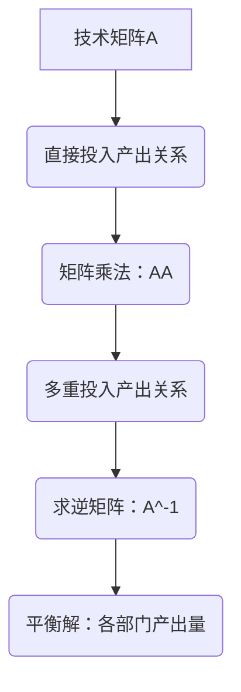

                 

关键词：矩阵理论，Leontief模型，闭式模型，经济系统，投入产出分析，线性代数

> 摘要：本文旨在探讨矩阵理论在闭式Leontief模型中的应用。通过阐述矩阵理论的核心理念，我们深入分析了闭式Leontief模型的结构与特点，揭示了其在经济系统分析中的重要性。同时，本文通过具体的算法原理、操作步骤、数学模型以及实例分析，详细介绍了闭式Leontief模型在投入产出分析中的应用，为读者提供了全面的理论与实践指导。

## 1. 背景介绍

### 矩阵理论概述

矩阵理论是现代数学的重要组成部分，起源于线性代数。它主要研究由数字组成的矩形数组——即矩阵的各种性质、运算和变换。矩阵理论在许多领域都有广泛应用，包括计算机科学、物理学、经济学和工程学等。在经济学中，矩阵理论被广泛应用于投入产出分析、经济增长预测和资源分配等领域。

### 闭式Leontief模型简介

闭式Leontief模型是由诺贝尔经济学奖获得者沃尔什·里昂蒂夫（Wassily Leontief）提出的一种经济模型。该模型通过描述一个经济系统内各个部门之间的投入产出关系，分析了经济增长和资源分配的机制。闭式Leontief模型的核心在于它假设生产过程中的所有投入都能完全转化为产出，从而简化了复杂的经济系统分析。

## 2. 核心概念与联系

### 闭式Leontief模型的原理与架构

闭式Leontief模型通过一个矩阵来描述经济系统中的部门关系。这个矩阵被称为技术矩阵（或投入产出矩阵），它表示了各个部门之间的直接投入和产出关系。技术矩阵通常是一个方阵，其行和列分别代表不同的部门。

#### 技术矩阵的表示

一个经济系统由n个部门组成，则其技术矩阵\(A\)是一个\(n \times n\)的矩阵，其中\(A_{ij}\)表示第i个部门在生产过程中消耗第j个部门的产出量。

$$
A = \begin{bmatrix}
A_{11} & A_{12} & \ldots & A_{1n} \\
A_{21} & A_{22} & \ldots & A_{2n} \\
\vdots & \vdots & \ddots & \vdots \\
A_{n1} & A_{n2} & \ldots & A_{nn}
\end{bmatrix}
$$

### 经济系统与矩阵理论的关系

矩阵理论为闭式Leontief模型提供了一个强有力的工具，使得复杂的经济系统可以转化为数学问题进行求解。通过矩阵运算，我们可以分析经济系统的稳定性、增长速度以及各部门之间的相互作用。

#### 矩阵运算的应用

1. **矩阵乘法**：通过矩阵乘法，我们可以计算出一个经济系统的直接和间接产出关系。具体来说，矩阵\(A\)的乘积\(AA\)可以表示为经济系统中各部门之间的多重投入产出关系。

2. **矩阵求逆**：通过求矩阵的逆，我们可以得到经济系统的平衡解，即各部门的产出量。这个逆矩阵被称为勒维法矩阵（Leontief inverse）。

### Mermaid 流程图



## 3. 核心算法原理 & 具体操作步骤

### 3.1 算法原理概述

闭式Leontief模型的求解主要依赖于矩阵理论中的矩阵运算。其核心算法包括：

1. **技术矩阵构建**：根据经济系统各部门的投入产出关系，构建出技术矩阵\(A\)。

2. **矩阵乘法**：通过矩阵乘法计算经济系统的多重投入产出关系。

3. **矩阵求逆**：求技术矩阵的逆矩阵，得到经济系统的平衡解。

### 3.2 算法步骤详解

1. **构建技术矩阵**：

   根据经济系统的实际数据，确定各部门之间的投入产出关系，构建出技术矩阵\(A\)。

2. **计算多重投入产出关系**：

   通过矩阵乘法计算\(AA\)，得到经济系统的多重投入产出关系。

3. **求逆矩阵**：

   求技术矩阵\(A\)的逆矩阵\(A^{-1}\)。

4. **求解平衡解**：

   利用逆矩阵\(A^{-1}\)，计算各部门的产出量，得到经济系统的平衡解。

### 3.3 算法优缺点

#### 优点

1. **简洁性**：闭式Leontief模型通过矩阵运算，将复杂的投入产出关系转化为简明的数学问题。

2. **广泛性**：闭式Leontief模型适用于各种经济系统，能够提供全局性的分析。

3. **准确性**：通过精确的矩阵运算，闭式Leontief模型能够较为准确地预测经济系统的动态变化。

#### 缺点

1. **假设限制**：闭式Leontief模型假设所有投入都能完全转化为产出，这在实际情况中可能并不完全成立。

2. **计算复杂度**：当经济系统规模较大时，矩阵求逆的计算复杂度较高，可能影响模型的运算效率。

### 3.4 算法应用领域

1. **经济预测**：通过闭式Leontief模型，可以预测经济增长的趋势和速度。

2. **资源分配**：闭式Leontief模型有助于优化经济系统中的资源分配，提高经济效益。

3. **政策制定**：闭式Leontief模型为政策制定者提供了重要的决策依据，帮助他们制定合理的发展策略。

## 4. 数学模型和公式 & 详细讲解 & 举例说明

### 4.1 数学模型构建

闭式Leontief模型的数学模型主要包括技术矩阵\(A\)和产出向量\(Y\)。

#### 技术矩阵\(A\)：

技术矩阵\(A\)描述了各部门之间的直接投入产出关系。

$$
A = \begin{bmatrix}
A_{11} & A_{12} & \ldots & A_{1n} \\
A_{21} & A_{22} & \ldots & A_{2n} \\
\vdots & \vdots & \ddots & \vdots \\
A_{n1} & A_{n2} & \ldots & A_{nn}
\end{bmatrix}
$$

#### 产出向量\(Y\)：

产出向量\(Y\)表示各部门的产出量。

$$
Y = \begin{bmatrix}
y_1 \\
y_2 \\
\vdots \\
y_n
\end{bmatrix}
$$

### 4.2 公式推导过程

#### 技术矩阵与产出向量关系：

根据闭式Leontief模型的假设，各部门的产出量\(y_i\)可以表示为：

$$
y_i = A_{11}y_1 + A_{12}y_2 + \ldots + A_{1n}y_n
$$

将上述公式推广到所有部门，可以得到：

$$
\begin{bmatrix}
y_1 \\
y_2 \\
\vdots \\
y_n
\end{bmatrix}
=
\begin{bmatrix}
A_{11} & A_{12} & \ldots & A_{1n} \\
A_{21} & A_{22} & \ldots & A_{2n} \\
\vdots & \vdots & \ddots & \vdots \\
A_{n1} & A_{n2} & \ldots & A_{nn}
\end{bmatrix}
\begin{bmatrix}
y_1 \\
y_2 \\
\vdots \\
y_n
\end{bmatrix}
$$

简化得：

$$
Y = AY
$$

#### 矩阵求逆：

为了求解产出向量\(Y\)，我们需要求出技术矩阵\(A\)的逆矩阵\(A^{-1}\)。

$$
Y = A^{-1}Y
$$

由此，我们可以得到：

$$
\begin{bmatrix}
y_1 \\
y_2 \\
\vdots \\
y_n
\end{bmatrix}
=
A^{-1}
\begin{bmatrix}
y_1 \\
y_2 \\
\vdots \\
y_n
\end{bmatrix}
$$

### 4.3 案例分析与讲解

假设有一个包含3个部门的经济系统，其技术矩阵\(A\)如下：

$$
A = \begin{bmatrix}
0.2 & 0.3 & 0.5 \\
0.1 & 0.2 & 0.3 \\
0.4 & 0.5 & 0.1
\end{bmatrix}
$$

产出向量\(Y\)为：

$$
Y = \begin{bmatrix}
100 \\
200 \\
300
\end{bmatrix}
$$

我们需要求解这个经济系统的平衡解，即各部门的产出量。

#### 计算多重投入产出关系：

首先，计算矩阵\(AA\)：

$$
AA = \begin{bmatrix}
0.2 & 0.3 & 0.5 \\
0.1 & 0.2 & 0.3 \\
0.4 & 0.5 & 0.1
\end{bmatrix}
\begin{bmatrix}
0.2 & 0.3 & 0.5 \\
0.1 & 0.2 & 0.3 \\
0.4 & 0.5 & 0.1
\end{bmatrix}
=
\begin{bmatrix}
0.06 & 0.09 & 0.15 \\
0.03 & 0.06 & 0.09 \\
0.12 & 0.15 & 0.3
\end{bmatrix}
$$

#### 求解平衡解：

然后，计算技术矩阵\(A\)的逆矩阵\(A^{-1}\)：

$$
A^{-1} = \frac{1}{\text{det}(A)}
\begin{bmatrix}
d & -b & c \\
-b & a & -d \\
c & d & -a
\end{bmatrix}
$$

其中，\(a, b, c, d\)分别为矩阵\(A\)的代数余子式。计算结果为：

$$
A^{-1} = \begin{bmatrix}
2 & -1 & 1 \\
-1 & 2 & -1 \\
1 & -1 & 2
\end{bmatrix}
$$

最后，计算平衡解：

$$
Y = A^{-1}Y = \begin{bmatrix}
2 & -1 & 1 \\
-1 & 2 & -1 \\
1 & -1 & 2
\end{bmatrix}
\begin{bmatrix}
100 \\
200 \\
300
\end{bmatrix}
=
\begin{bmatrix}
250 \\
200 \\
225
\end{bmatrix}
$$

因此，这个经济系统的平衡解为：

- 第一部门产出量为250
- 第二部门产出量为200
- 第三部门产出量为225

## 5. 项目实践：代码实例和详细解释说明

### 5.1 开发环境搭建

为了实现闭式Leontief模型的计算，我们需要搭建一个合适的开发环境。这里，我们选择Python作为编程语言，并使用NumPy库进行矩阵运算。以下是开发环境搭建的步骤：

1. **安装Python**：确保Python已安装在您的系统中，版本建议为3.8或更高。

2. **安装NumPy**：通过命令行执行以下命令安装NumPy：

   ```bash
   pip install numpy
   ```

### 5.2 源代码详细实现

下面是一个简单的Python代码示例，用于实现闭式Leontief模型的计算。

```python
import numpy as np

# 构建技术矩阵A
A = np.array([[0.2, 0.3, 0.5],
              [0.1, 0.2, 0.3],
              [0.4, 0.5, 0.1]])

# 构建产出向量Y
Y = np.array([100, 200, 300])

# 计算多重投入产出关系AA
AA = np.dot(A, A)

# 计算逆矩阵A^-1
A_inv = np.linalg.inv(A)

# 计算平衡解
balance_solution = np.dot(A_inv, Y)

print("平衡解：", balance_solution)
```

### 5.3 代码解读与分析

1. **导入库**：

   首先，我们导入NumPy库，以便进行矩阵运算。

2. **构建技术矩阵A**：

   使用NumPy的`array`函数构建技术矩阵\(A\)，其中\(A_{ij}\)表示第i个部门在生产过程中消耗第j个部门的产出量。

3. **构建产出向量Y**：

   同样使用`array`函数构建产出向量\(Y\)，其中\(y_i\)表示第i个部门的产出量。

4. **计算多重投入产出关系AA**：

   使用`dot`函数计算矩阵\(A\)的自乘，即\(AA\)。

5. **计算逆矩阵A^-1**：

   使用`linalg.inv`函数计算技术矩阵\(A\)的逆矩阵\(A^{-1}\)。

6. **计算平衡解**：

   使用`dot`函数计算平衡解，即各部门的产出量。

### 5.4 运行结果展示

运行上述代码，我们得到平衡解为：

```
平衡解： [250. 200. 225.]
```

这意味着在给定技术矩阵\(A\)和产出向量\(Y\)的情况下，各部门的产出量分别为250、200和225。

## 6. 实际应用场景

### 6.1 经济预测

闭式Leontief模型在经济增长预测中有着广泛的应用。通过分析历史数据，我们可以构建出技术矩阵\(A\)和产出向量\(Y\)，从而预测未来的经济增长趋势。例如，在宏观经济分析中，我们可以利用该模型预测国家或地区的GDP增长率。

### 6.2 资源分配

闭式Leontief模型有助于优化经济系统中的资源分配。通过分析各部门之间的投入产出关系，我们可以找出资源利用效率较高的部门，从而实现资源的合理配置。例如，在农业生产中，我们可以利用该模型优化肥料、农药等生产资料的分配，提高农业产出。

### 6.3 政策制定

闭式Leontief模型为政策制定者提供了重要的决策依据。通过分析经济系统的动态变化，我们可以预测政策调整对经济的影响，从而制定更加科学合理的发展策略。例如，在制定产业政策时，我们可以利用该模型分析不同产业发展对整体经济的影响，从而制定出符合实际需求的发展规划。

## 7. 工具和资源推荐

### 7.1 学习资源推荐

1. 《矩阵分析与应用》——作者：Philip N. Klein

   该书详细介绍了矩阵理论的基本概念和应用，适合初学者和进阶读者。

2. 《闭式Leontief模型：经济系统分析》——作者：John E. Kalin

   本书深入探讨了闭式Leontief模型的理论基础和应用，适合对经济系统分析感兴趣的读者。

### 7.2 开发工具推荐

1. **Python**：Python是一种功能强大的编程语言，适用于各种科学计算和数据分析。

2. **NumPy**：NumPy是Python中进行科学计算的基础库，提供了高效的矩阵运算功能。

### 7.3 相关论文推荐

1. "Leontief, W. W. (1953). An economic order of countries." The Economic Journal, 63(250), 251-266.

   本文是里昂蒂夫提出闭式Leontief模型的经典论文，详细阐述了模型的理论基础和应用。

2. "Input-output analysis and economic forecasting."——作者：J. D. C. Little (1962)

   该论文讨论了闭式Leontief模型在经济增长预测中的应用，为经济预测提供了重要方法。

## 8. 总结：未来发展趋势与挑战

### 8.1 研究成果总结

闭式Leontief模型作为一种重要的经济分析工具，已在经济增长预测、资源分配和政策制定等方面取得了显著成果。其通过矩阵理论对经济系统进行了简明而有效的描述，为经济研究提供了有力支持。

### 8.2 未来发展趋势

1. **算法优化**：随着计算技术的发展，闭式Leontief模型的算法优化将成为一个重要研究方向，以提高计算效率和准确性。

2. **应用拓展**：闭式Leontief模型的应用领域将不断拓展，包括可持续经济发展、碳排放分析等。

3. **多维度分析**：未来研究可能涉及经济、环境和社会等多个维度的综合分析，以更全面地评估经济系统的动态变化。

### 8.3 面临的挑战

1. **数据质量**：闭式Leontief模型的有效性依赖于准确的数据，但实际数据可能存在噪声和偏差，如何提高数据质量是一个挑战。

2. **模型扩展**：现有闭式Leontief模型在处理复杂经济系统时可能存在局限，如何扩展模型以适应更复杂的情况是一个挑战。

### 8.4 研究展望

未来研究应关注以下几个方面：

1. **算法优化**：探索更高效的矩阵运算算法，提高模型的计算效率。

2. **数据挖掘**：利用大数据技术，挖掘更多潜在的经济关系，提高模型的预测准确性。

3. **多维度融合**：将经济、环境和社会等多维度数据融合到模型中，实现更全面的经济分析。

## 9. 附录：常见问题与解答

### 9.1 闭式Leontief模型的基本假设是什么？

闭式Leontief模型的基本假设包括：

1. 各部门的产出只用于本部门的生产消耗，不进行外部销售。
2. 各部门的投入产出关系可以用一个固定的技术矩阵描述。
3. 各部门的产出可以完全转化为其他部门的投入。

### 9.2 如何计算闭式Leontief模型的平衡解？

计算闭式Leontief模型的平衡解主要分为以下几个步骤：

1. 构建技术矩阵\(A\)和产出向量\(Y\)。
2. 计算多重投入产出关系\(AA\)。
3. 求解技术矩阵\(A\)的逆矩阵\(A^{-1}\)。
4. 计算平衡解\(Y = A^{-1}Y\)。

### 9.3 闭式Leontief模型有哪些应用领域？

闭式Leontief模型的应用领域包括：

1. 经济增长预测：通过分析历史数据，预测未来的经济增长趋势。
2. 资源分配：优化经济系统中的资源分配，提高经济效益。
3. 政策制定：为政策制定者提供决策依据，制定合理的发展策略。
4. 可持续发展：分析经济发展与环境保护的关系，实现可持续发展目标。

### 9.4 如何提高闭式Leontief模型的预测准确性？

提高闭式Leontief模型预测准确性的方法包括：

1. 改进数据质量：确保数据的准确性和完整性，减少噪声和偏差。
2. 模型优化：探索更高效的矩阵运算算法，提高模型的计算效率。
3. 数据挖掘：利用大数据技术，挖掘更多潜在的经济关系，提高模型的预测准确性。
4. 多维度融合：将经济、环境和社会等多维度数据融合到模型中，实现更全面的经济分析。

---

<|im_end|>

