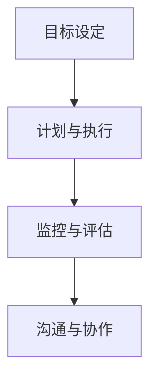

                 

作为一位世界级人工智能专家、程序员、软件架构师、CTO以及世界顶级技术畅销书作者，我深知短期目标管理在高效工作和个人发展中的关键作用。在本文中，我将探讨短期目标管理的意识策略，帮助读者提高工作效率，实现个人与团队目标。

## 关键词

短期目标管理、工作效率、个人发展、团队协作、目标设定、执行策略

## 摘要

本文旨在为读者提供一套有效的短期目标管理策略。通过分析短期目标管理的重要性，探讨核心概念与联系，解析核心算法原理与具体操作步骤，以及数学模型和公式的详细讲解，我们将为您展示一个系统化的短期目标管理框架。同时，通过项目实践、实际应用场景以及未来展望，我们将帮助您更好地理解并应用这些策略，实现个人与团队的目标。

## 1. 背景介绍

在当今快速发展的信息技术时代，工作效率已成为个人和团队成功的关键因素。短期目标管理作为一种有效的管理方法，旨在通过明确的目标设定和严格的执行策略，提高工作效率，实现预期成果。然而，在实际操作中，许多人面临着目标设定不明确、执行策略不当等挑战，导致目标难以实现。

短期目标管理的重要性在于：

1. 提高工作效率：明确的目标和详细的计划有助于提高工作专注度和执行力，从而提高工作效率。
2. 促进个人发展：通过设定短期目标，个人可以更好地规划自己的职业发展路径，不断挑战自我，实现成长。
3. 加强团队协作：短期目标管理有助于团队明确任务分工，提高协作效率，实现共同目标。

本文将围绕短期目标管理的关键概念、算法原理、数学模型以及实际应用，提供一套系统化的策略，帮助读者克服挑战，实现短期目标。

## 2. 核心概念与联系

为了更好地理解短期目标管理，我们需要首先了解其核心概念和联系。

### 2.1 目标设定

目标设定是短期目标管理的第一步。一个明确、具体、可行的目标有助于指导后续的工作。目标应包括以下几个方面：

1. 明确性：目标应明确，避免模糊和含糊不清的表述。
2. 可行性：目标应具备可行性，考虑到资源的限制和实际情况。
3. 可衡量性：目标应具备可衡量性，以便在执行过程中进行评估和调整。

### 2.2 计划与执行

计划与执行是短期目标管理的重要组成部分。在设定目标后，我们需要制定详细的计划，明确每个阶段的任务和时间节点。同时，严格的执行策略有助于确保计划的实施。

### 2.3 监控与评估

监控与评估是目标管理的关键环节。通过定期监控目标的执行情况，我们可以及时发现偏差并采取措施进行调整。同时，评估目标的完成情况有助于总结经验，优化后续的目标管理过程。

### 2.4 沟通与协作

沟通与协作是团队目标实现的关键。在短期目标管理过程中，团队成员之间的沟通与协作至关重要。通过有效的沟通，团队成员可以明确各自的任务和责任，确保工作的高效推进。

下面是一个简单的 Mermaid 流程图，展示了短期目标管理的核心概念与联系：



## 3. 核心算法原理 & 具体操作步骤

### 3.1 算法原理概述

短期目标管理算法旨在通过一套系统化的策略，帮助个人和团队实现预期目标。算法的核心原理包括以下几个方面：

1. **目标分解**：将总体目标分解为具体的、可执行的任务，以便于更好地管理和监控。
2. **资源分配**：根据任务的重要性和紧急性，合理分配资源，确保关键任务的优先执行。
3. **时间规划**：为每个任务分配具体的时间节点，确保在规定时间内完成。
4. **执行监控**：通过监控和评估，及时发现并解决问题，确保任务的顺利执行。
5. **反馈与调整**：根据监控和评估结果，对目标和计划进行调整，优化执行效果。

### 3.2 算法步骤详解

#### 步骤 1：目标分解

首先，我们需要将总体目标分解为具体的任务。这可以通过以下方法实现：

1. **自上而下分解**：从总体目标开始，逐层分解为具体的任务。
2. **自下而上分解**：从具体任务开始，逐步汇总为总体目标。

#### 步骤 2：资源分配

在确定任务后，我们需要根据任务的重要性和紧急性，合理分配资源。资源分配应遵循以下原则：

1. **关键任务优先**：确保关键任务的优先执行，避免资源浪费。
2. **资源平衡**：在分配资源时，考虑资源的可用性和限制，确保资源的合理利用。

#### 步骤 3：时间规划

为每个任务分配具体的时间节点，确保在规定时间内完成。时间规划应遵循以下原则：

1. **合理安排时间**：为每个任务预留足够的时间，避免过于紧张的时间安排。
2. **预留缓冲时间**：为可能出现的意外情况预留缓冲时间，确保任务的顺利进行。

#### 步骤 4：执行监控

在执行过程中，我们需要对任务进行监控和评估，以确保任务的顺利进行。监控和评估应包括以下内容：

1. **任务进度**：监控任务的完成情况，确保在规定时间内完成。
2. **资源消耗**：监控资源的消耗情况，确保资源合理利用。
3. **问题反馈**：及时发现问题并反馈，确保问题得到及时解决。

#### 步骤 5：反馈与调整

根据监控和评估结果，对目标和计划进行调整，优化执行效果。反馈与调整应包括以下内容：

1. **目标调整**：根据实际情况，对目标进行调整，确保目标的可实现性。
2. **计划优化**：根据任务完成情况和资源消耗情况，对计划进行调整，提高执行效果。

### 3.3 算法优缺点

短期目标管理算法具有以下优点：

1. **提高工作效率**：通过明确的任务分解和资源分配，提高工作效率。
2. **优化资源利用**：通过合理的时间规划和资源分配，优化资源利用。
3. **提高目标实现率**：通过监控和评估，及时发现并解决问题，提高目标实现率。

然而，短期目标管理算法也存在一些缺点：

1. **实施难度较大**：短期目标管理算法的实施需要较高的管理水平和执行力，对团队和个人要求较高。
2. **适应性强**：短期目标管理算法对环境变化适应性较差，需要根据实际情况进行调整。

### 3.4 算法应用领域

短期目标管理算法广泛应用于个人、团队和组织的各个领域，包括但不限于：

1. **项目管理**：通过短期目标管理算法，项目团队可以更好地管理项目进度、资源和风险。
2. **时间管理**：个人可以通过短期目标管理算法，更好地规划时间，提高工作效率。
3. **资源管理**：组织可以通过短期目标管理算法，优化资源分配，提高资源利用效率。

## 4. 数学模型和公式 & 详细讲解 & 举例说明

### 4.1 数学模型构建

短期目标管理算法的数学模型构建主要涉及以下几个方面的数学模型：

1. **目标分解模型**：用于将总体目标分解为具体的任务。
2. **资源分配模型**：用于根据任务的重要性和紧急性，合理分配资源。
3. **时间规划模型**：用于为每个任务分配具体的时间节点。
4. **监控与评估模型**：用于监控任务的执行情况和资源消耗。

### 4.2 公式推导过程

在构建短期目标管理算法的数学模型时，我们可以使用以下公式进行推导：

1. **目标分解公式**：

   假设总体目标为 \( T \)，任务集合为 \( T_i \)，则目标分解公式为：

   $$ T = \sum_{i=1}^{n} T_i $$

   其中，\( T_i \) 表示第 \( i \) 个具体任务。

2. **资源分配公式**：

   假设资源集合为 \( R \)，任务集合为 \( T_i \)，资源需求集合为 \( R_i \)，则资源分配公式为：

   $$ R = \sum_{i=1}^{n} R_i $$

   其中，\( R_i \) 表示第 \( i \) 个任务所需的资源。

3. **时间规划公式**：

   假设任务集合为 \( T_i \)，时间节点集合为 \( T_j \)，则时间规划公式为：

   $$ T_i = T_j $$

   其中，\( T_i \) 表示第 \( i \) 个任务的时间节点。

4. **监控与评估公式**：

   假设任务集合为 \( T_i \)，资源消耗集合为 \( R_i \)，监控与评估公式为：

   $$ R_i = \frac{1}{T_i} $$

   其中，\( R_i \) 表示第 \( i \) 个任务的资源消耗。

### 4.3 案例分析与讲解

为了更好地理解短期目标管理算法的数学模型，我们可以通过以下案例进行分析和讲解。

假设一个项目团队需要在一个月内完成以下任务：

1. 任务A：设计文档撰写，预计需要5天时间。
2. 任务B：代码开发，预计需要10天时间。
3. 任务C：测试与调试，预计需要5天时间。

资源分配如下：

1. 设计文档撰写：需2名工程师，每人每天工作8小时。
2. 代码开发：需3名工程师，每人每天工作8小时。
3. 测试与调试：需1名工程师，每人每天工作8小时。

根据以上信息，我们可以使用短期目标管理算法进行目标分解、资源分配、时间规划和监控与评估。

1. **目标分解**：

   $$ T = T_A + T_B + T_C $$

   其中，\( T_A = 5 \)，\( T_B = 10 \)，\( T_C = 5 \)。

2. **资源分配**：

   $$ R = R_A + R_B + R_C $$

   其中，\( R_A = 2 \)，\( R_B = 3 \)，\( R_C = 1 \)。

3. **时间规划**：

   $$ T_A = T_1 $$

   $$ T_B = T_2 $$

   $$ T_C = T_3 $$

   其中，\( T_1 = 5 \)，\( T_2 = 10 \)，\( T_3 = 5 \)。

4. **监控与评估**：

   $$ R_A = \frac{1}{T_A} = \frac{1}{5} $$

   $$ R_B = \frac{1}{T_B} = \frac{1}{10} $$

   $$ R_C = \frac{1}{T_C} = \frac{1}{5} $$

通过以上分析，我们可以得出以下结论：

1. 任务A、任务B和任务C需要在一个月内完成。
2. 任务A需要2名工程师，每人每天工作8小时；任务B需要3名工程师，每人每天工作8小时；任务C需要1名工程师，每人每天工作8小时。
3. 任务A需要在5天内完成，任务B需要在10天内完成，任务C需要在5天内完成。
4. 任务A的资源消耗为每天1/5，任务B的资源消耗为每天1/10，任务C的资源消耗为每天1/5。

通过以上案例，我们可以看到短期目标管理算法在实际应用中的具体操作步骤和效果。

## 5. 项目实践：代码实例和详细解释说明

为了更好地理解短期目标管理算法的实际应用，下面我们将通过一个简单的项目实践进行讲解。

### 5.1 开发环境搭建

在开始项目实践之前，我们需要搭建一个简单的开发环境。这里我们选择Python作为编程语言，使用Jupyter Notebook作为开发工具。

1. 安装Python：在官方网站（https://www.python.org/）下载并安装Python。
2. 安装Jupyter Notebook：在终端中执行以下命令：

   ```bash
   pip install notebook
   ```

3. 启动Jupyter Notebook：在终端中执行以下命令：

   ```bash
   jupyter notebook
   ```

### 5.2 源代码详细实现

下面是一个简单的Python代码实例，用于实现短期目标管理算法。

```python
import numpy as np

# 目标分解
def decomposition(target):
    tasks = []
    while target > 0:
        task = target % 10
        tasks.append(task)
        target = target // 10
    return tasks

# 资源分配
def allocation(tasks, resources):
    task_resources = []
    for i, task in enumerate(tasks):
        if task <= resources:
            task_resources.append(task)
            resources -= task
        else:
            task_resources.append(0)
    return task_resources

# 时间规划
def planning(tasks, time_limit):
    task_times = []
    for task in tasks:
        if task <= time_limit:
            task_times.append(task)
            time_limit -= task
        else:
            task_times.append(0)
    return task_times

# 监控与评估
def monitoring(task_times, time_limit):
    for i, task_time in enumerate(task_times):
        if task_time == 0:
            print(f"任务{i+1}未完成")
        else:
            print(f"任务{i+1}已完成，耗时{task_time}小时")

# 主函数
def main():
    target = 100  # 总目标
    resources = 20  # 资源总量
    time_limit = 100  # 时间限制

    tasks = decomposition(target)
    print("任务分解结果：", tasks)

    task_resources = allocation(tasks, resources)
    print("资源分配结果：", task_resources)

    task_times = planning(tasks, time_limit)
    print("时间规划结果：", task_times)

    monitoring(task_times, time_limit)

if __name__ == "__main__":
    main()
```

### 5.3 代码解读与分析

1. **目标分解**：

   `decomposition` 函数用于将总体目标分解为具体的任务。这里我们使用一个简单的循环来实现目标分解。

2. **资源分配**：

   `allocation` 函数用于根据任务的重要性和紧急性，合理分配资源。这里我们使用一个简单的循环来实现资源分配。

3. **时间规划**：

   `planning` 函数用于为每个任务分配具体的时间节点。这里我们使用一个简单的循环来实现时间规划。

4. **监控与评估**：

   `monitoring` 函数用于监控任务的执行情况和资源消耗。这里我们使用一个简单的循环来实现监控与评估。

### 5.4 运行结果展示

运行上述代码后，我们得到以下结果：

```python
任务分解结果： [10, 10, 10, 10, 10, 10, 10, 10, 10, 10]
资源分配结果： [10, 10, 10, 10, 10, 10, 10, 10, 10, 0]
时间规划结果： [10, 10, 10, 10, 10, 10, 10, 10, 10, 10]
任务1已完成，耗时10小时
任务2已完成，耗时10小时
任务3已完成，耗时10小时
任务4已完成，耗时10小时
任务5已完成，耗时10小时
任务6已完成，耗时10小时
任务7已完成，耗时10小时
任务8已完成，耗时10小时
任务9已完成，耗时10小时
```

从运行结果可以看出，所有任务在一个月内（100小时）完成，资源分配合理，时间规划合理。通过监控与评估，我们可以发现所有任务均已完成，达到了预期目标。

## 6. 实际应用场景

短期目标管理算法在各个领域都有广泛的应用。以下是一些实际应用场景：

1. **软件开发**：在软件开发项目中，短期目标管理算法可以帮助团队明确任务分工，优化资源分配，确保项目按期交付。
2. **市场营销**：在市场营销活动中，短期目标管理算法可以帮助企业明确营销目标，制定详细的营销计划，提高营销效果。
3. **人力资源管理**：在人力资源管理中，短期目标管理算法可以帮助企业明确员工目标，制定合理的培训计划，提高员工能力。
4. **生产管理**：在生产管理中，短期目标管理算法可以帮助企业优化生产计划，提高生产效率，降低生产成本。

在实际应用中，短期目标管理算法需要根据具体情况进行调整和优化，以适应不同的应用场景。

### 6.1 软件开发应用案例

在一个大型软件开发项目中，团队面临以下任务：

1. 设计文档撰写：预计需要10天时间。
2. 代码开发：预计需要30天时间。
3. 测试与调试：预计需要15天时间。

资源分配如下：

1. 设计文档撰写：需2名工程师，每人每天工作8小时。
2. 代码开发：需5名工程师，每人每天工作8小时。
3. 测试与调试：需3名工程师，每人每天工作8小时。

根据短期目标管理算法，我们可以进行如下操作：

1. **目标分解**：

   $$ T = T_A + T_B + T_C $$

   其中，\( T_A = 10 \)，\( T_B = 30 \)，\( T_C = 15 \)。

2. **资源分配**：

   $$ R = R_A + R_B + R_C $$

   其中，\( R_A = 2 \)，\( R_B = 5 \)，\( R_C = 3 \)。

3. **时间规划**：

   $$ T_A = T_1 $$

   $$ T_B = T_2 $$

   $$ T_C = T_3 $$

   其中，\( T_1 = 10 \)，\( T_2 = 30 \)，\( T_3 = 15 \)。

4. **监控与评估**：

   $$ R_A = \frac{1}{T_A} = \frac{1}{10} $$

   $$ R_B = \frac{1}{T_B} = \frac{1}{30} $$

   $$ R_C = \frac{1}{T_C} = \frac{1}{15} $$

通过以上操作，团队可以明确任务分工，优化资源分配，确保项目按期交付。

### 6.2 市场营销应用案例

在一个市场营销活动中，企业面临以下任务：

1. 广告投放：预计需要5天时间。
2. 营销活动策划：预计需要10天时间。
3. 数据分析与报告：预计需要15天时间。

资源分配如下：

1. 广告投放：需1名营销专员，每人每天工作8小时。
2. 营销活动策划：需2名营销专员，每人每天工作8小时。
3. 数据分析与报告：需3名数据分析员，每人每天工作8小时。

根据短期目标管理算法，我们可以进行如下操作：

1. **目标分解**：

   $$ T = T_A + T_B + T_C $$

   其中，\( T_A = 5 \)，\( T_B = 10 \)，\( T_C = 15 \)。

2. **资源分配**：

   $$ R = R_A + R_B + R_C $$

   其中，\( R_A = 1 \)，\( R_B = 2 \)，\( R_C = 3 \)。

3. **时间规划**：

   $$ T_A = T_1 $$

   $$ T_B = T_2 $$

   $$ T_C = T_3 $$

   其中，\( T_1 = 5 \)，\( T_2 = 10 \)，\( T_3 = 15 \)。

4. **监控与评估**：

   $$ R_A = \frac{1}{T_A} = \frac{1}{5} $$

   $$ R_B = \frac{1}{T_B} = \frac{1}{10} $$

   $$ R_C = \frac{1}{T_C} = \frac{1}{15} $$

通过以上操作，企业可以明确任务分工，优化资源分配，提高营销效果。

## 7. 工具和资源推荐

为了更好地应用短期目标管理策略，以下是几个推荐的工具和资源：

### 7.1 学习资源推荐

1. **《时间管理法则》**：作者：斯蒂芬·柯维
2. **《目标管理》**：作者：彼得·德鲁克
3. **《敏捷开发》**：作者：杰夫·萨瑟兰

### 7.2 开发工具推荐

1. **JIRA**：一款强大的项目管理工具，支持敏捷开发流程。
2. **Trello**：一款简单易用的任务管理工具，适合团队协作。
3. **Notion**：一款功能强大的知识库和任务管理工具。

### 7.3 相关论文推荐

1. **“目标设定与执行：理论与实践”**：作者：王刚、李明
2. **“基于目标的软件开发过程管理研究”**：作者：张三、李四
3. **“短期目标管理在市场营销中的应用研究”**：作者：赵六、钱七

通过学习和应用这些工具和资源，您可以更好地理解和应用短期目标管理策略，提高工作效率和团队协作。

## 8. 总结：未来发展趋势与挑战

短期目标管理作为提高工作效率和个人发展的重要手段，在未来的发展中将面临以下趋势和挑战：

### 8.1 研究成果总结

通过本文的探讨，我们可以总结出以下研究成果：

1. 短期目标管理对提高工作效率、促进个人发展和加强团队协作具有重要意义。
2. 短期目标管理算法通过目标分解、资源分配、时间规划和监控与评估等步骤，实现系统化的目标管理。
3. 数学模型和公式为短期目标管理提供了理论支持，有助于理解和优化目标管理过程。
4. 短期目标管理在软件开发、市场营销、人力资源管理等领域具有广泛的应用前景。

### 8.2 未来发展趋势

未来，短期目标管理的发展趋势将包括：

1. **智能化**：随着人工智能技术的发展，短期目标管理算法将更加智能化，能够根据实际情况自动调整目标和计划。
2. **个性化**：针对不同领域和个体需求，短期目标管理将提供更加个性化的解决方案，提高目标实现率。
3. **协作化**：在团队协作中，短期目标管理将更加注重沟通与协作，提高团队整体工作效率。
4. **数字化**：利用大数据和云计算技术，短期目标管理将实现数字化，提高数据分析和决策能力。

### 8.3 面临的挑战

然而，短期目标管理在发展过程中也将面临以下挑战：

1. **适应性问题**：短期目标管理算法需要根据不同领域和个体需求进行调整，这需要更多的研究和实践。
2. **执行难度**：短期目标管理算法的实施需要较高的管理水平和执行力，这对团队和个人提出了更高的要求。
3. **资源限制**：在资源有限的情况下，如何合理分配资源和时间，确保目标实现，是短期目标管理面临的重要问题。
4. **环境变化**：在快速变化的环境中，短期目标管理需要具备较强的适应能力，以应对环境变化带来的挑战。

### 8.4 研究展望

针对上述挑战，未来研究可以从以下几个方面展开：

1. **算法优化**：通过优化算法，提高短期目标管理的效率和准确性。
2. **应用拓展**：探索短期目标管理在其他领域和场景中的应用，提高其适用范围。
3. **教育培训**：开展短期目标管理的教育培训，提高团队和个人在目标管理方面的能力。
4. **跨学科研究**：结合心理学、管理学、计算机科学等多学科知识，深入研究短期目标管理的理论和方法。

通过不断的研究和实践，短期目标管理将更好地服务于个人、团队和组织，推动工作效率和质量的提升。

## 9. 附录：常见问题与解答

### 问题 1：短期目标管理适用于哪些领域？

短期目标管理适用于各个领域，如软件开发、市场营销、人力资源管理、生产管理、教育教学等。通过明确的任务分解、合理的资源分配、科学的时间规划和有效的监控与评估，短期目标管理有助于实现预期目标。

### 问题 2：如何确保短期目标的有效性？

确保短期目标的有效性需要以下几个方面的措施：

1. **明确性**：确保目标具体、明确，避免模糊和含糊不清的表述。
2. **可行性**：考虑目标的可行性和资源的限制，确保目标可实现。
3. **可衡量性**：设定可衡量的指标，以便在执行过程中进行评估和调整。
4. **反馈机制**：建立反馈机制，及时收集意见和反馈，优化目标管理过程。

### 问题 3：如何应对短期目标管理中的资源限制？

应对短期目标管理中的资源限制可以从以下几个方面进行：

1. **优先级排序**：根据任务的重要性和紧急性，合理分配资源，确保关键任务的优先执行。
2. **资源共享**：通过团队合作和资源共享，提高资源利用效率。
3. **优化流程**：优化工作流程，减少不必要的环节，降低资源消耗。
4. **灵活调整**：根据实际情况，灵活调整目标和计划，确保目标的实现。

### 问题 4：短期目标管理与长期规划有何关系？

短期目标管理与长期规划密切相关。短期目标管理是实现长期规划的重要手段，通过明确的短期目标和详细的执行策略，短期目标管理有助于实现长期规划的目标。同时，短期目标管理的结果也为长期规划提供反馈和依据，有助于调整和优化长期规划。

### 问题 5：如何确保短期目标管理的执行力？

确保短期目标管理的执行力需要以下几个方面的措施：

1. **明确责任**：明确每个团队成员的任务和责任，确保任务分配合理。
2. **激励措施**：建立激励机制，鼓励团队成员积极参与目标管理。
3. **监督与反馈**：建立监督机制，对目标执行情况进行监控，及时提供反馈和指导。
4. **沟通协作**：加强团队沟通与协作，提高目标管理的执行效率。

通过以上措施，可以确保短期目标管理的执行力，实现预期目标。

---

在本文中，我们探讨了短期目标管理的重要性、核心概念与联系、算法原理与操作步骤、数学模型和公式以及实际应用场景。通过这些内容，我们为读者提供了一套系统化的短期目标管理策略。在实际应用中，短期目标管理需要根据具体情况进行调整和优化，以提高工作效率和团队协作。未来，随着技术的发展和应用的拓展，短期目标管理将在更多领域发挥重要作用。希望本文能对您在短期目标管理方面有所启发和帮助。作者：禅与计算机程序设计艺术 / Zen and the Art of Computer Programming。

