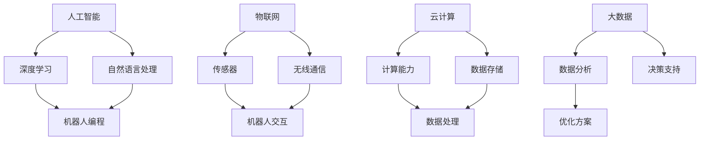

                 

关键词：硅谷，机器人服务，产业发展，技术趋势，市场分析

摘要：本文将深入探讨硅谷机器人服务业的发展趋势，从技术革新、市场拓展、商业模式变革等方面展开分析，揭示硅谷在这一领域的创新成果及其对全球机器人服务业的潜在影响。

## 1. 背景介绍

硅谷，全球科技创新的圣地，聚集了众多世界顶尖科技公司、初创企业、研究机构以及众多技术人才。在人工智能、机器人技术等领域，硅谷一直走在全球前列。随着技术的不断进步，机器人服务业在硅谷迅速崛起，成为新的经济增长点。

机器人服务业涵盖广泛，包括但不限于机器人制造、机器人编程、机器人系统集成、机器人维护与升级等。近年来，随着物联网、云计算、大数据等技术的深度融合，机器人服务业迎来了新的发展机遇。

## 2. 核心概念与联系

### 2.1 技术架构

在硅谷，机器人服务业的核心技术架构主要包括以下几个方面：

- **人工智能**：通过深度学习、自然语言处理等技术，实现机器人的智能交互和自主学习能力。
- **物联网**：通过传感器、无线通信等技术，实现机器人与外部环境的互联互通。
- **云计算**：提供强大的计算能力和数据存储，支持机器人服务的数据分析和处理。
- **大数据**：通过对大量数据的分析，为机器人提供精准的决策支持和优化方案。

### 2.2 技术联系

这些核心技术之间相互联系，共同构建了硅谷机器人服务业的技术生态：

- **人工智能**与**物联网**的结合，使得机器人能够实时感知环境，做出快速反应。
- **物联网**与**云计算**的结合，实现了海量数据的实时处理和分析，为机器人提供智能决策支持。
- **云计算**与**大数据**的结合，使得机器人能够从海量数据中挖掘有价值的信息，提升服务质量和效率。

### 2.3 Mermaid 流程图



## 3. 核心算法原理 & 具体操作步骤

### 3.1 算法原理概述

硅谷机器人服务业的核心算法主要包括以下几个方面：

- **深度学习算法**：通过神经网络模拟人脑的思考方式，实现对图像、语音等数据的识别和处理。
- **自然语言处理算法**：通过对自然语言的理解和分析，实现人与机器人的智能对话。
- **路径规划算法**：通过计算最短路径、避免障碍物等方式，实现机器人自主导航。
- **预测算法**：通过对历史数据的分析，预测未来的趋势和需求。

### 3.2 算法步骤详解

以**深度学习算法**为例，其基本步骤如下：

1. **数据收集与预处理**：收集大量带有标签的图像数据，对数据进行清洗和归一化处理。
2. **构建神经网络模型**：设计并构建多层神经网络模型，包括输入层、隐藏层和输出层。
3. **训练模型**：使用预处理后的数据，对神经网络模型进行训练，调整模型参数，使其能够准确识别图像。
4. **评估与优化**：使用验证集评估模型性能，根据评估结果对模型进行调整和优化。

### 3.3 算法优缺点

- **优点**：深度学习算法具有强大的特征提取和分类能力，能够处理大规模数据，提高机器人服务的准确性和效率。
- **缺点**：训练过程需要大量计算资源和时间，且对数据质量要求较高。

### 3.4 算法应用领域

深度学习算法在硅谷机器人服务业中广泛应用，例如：

- **机器人视觉**：通过深度学习算法，实现机器人的图像识别和物体检测功能。
- **语音识别**：通过深度学习算法，实现机器人的语音识别和语义理解功能。
- **自主导航**：通过深度学习算法，实现机器人的自主导航和避障功能。

## 4. 数学模型和公式 & 详细讲解 & 举例说明

### 4.1 数学模型构建

在硅谷机器人服务业中，常用的数学模型包括：

- **神经网络模型**：用于机器学习任务的函数模型，包括输入层、隐藏层和输出层。
- **路径规划模型**：用于计算机器人从起点到终点的最优路径。
- **预测模型**：用于根据历史数据预测未来的趋势和需求。

### 4.2 公式推导过程

以**神经网络模型**为例，其基本公式推导如下：

$$
Z^{(l)} = \sum_{i=1}^{n} w^{(l)}_i x_i
$$

其中，\(Z^{(l)}\) 是第 \(l\) 层的输出，\(w^{(l)}_i\) 是连接权重，\(x_i\) 是输入特征。

### 4.3 案例分析与讲解

以**路径规划模型**为例，分析机器人从起点 \(A\) 到终点 \(B\) 的最优路径。

假设起点 \(A\) 的坐标为 \((x_1, y_1)\)，终点 \(B\) 的坐标为 \((x_2, y_2)\)，障碍物坐标为 \((x_3, y_3)\)。

路径规划模型的基本公式为：

$$
d(A, B) = \sqrt{(x_2 - x_1)^2 + (y_2 - y_1)^2}
$$

$$
d(A, C) = \sqrt{(x_3 - x_1)^2 + (y_3 - y_1)^2}
$$

$$
d(B, C) = \sqrt{(x_3 - x_2)^2 + (y_3 - y_2)^2}
$$

机器人应选择 \(d(A, B)\) 最小的路径，避开障碍物 \(C\)。

## 5. 项目实践：代码实例和详细解释说明

### 5.1 开发环境搭建

在硅谷机器人服务业的项目实践中，通常使用以下开发环境：

- **操作系统**：Linux 或 macOS
- **编程语言**：Python
- **深度学习框架**：TensorFlow 或 PyTorch
- **机器学习库**：scikit-learn、NumPy、Pandas 等

### 5.2 源代码详细实现

以下是一个简单的路径规划算法的 Python 代码实例：

```python
import numpy as np

def distance(point1, point2):
    return np.sqrt((point2[0] - point1[0])**2 + (point2[1] - point1[1])**2)

def find_shortest_path(start, end, obstacles):
    shortest_distance = float('inf')
    shortest_path = None
    
    for obstacle in obstacles:
        distance_start_to_obstacle = distance(start, obstacle)
        distance_obstacle_to_end = distance(obstacle, end)
        distance_start_to_end = distance(start, end)
        
        if distance_start_to_obstacle + distance_obstacle_to_end < shortest_distance:
            shortest_distance = distance_start_to_obstacle + distance_obstacle_to_end
            shortest_path = [start, obstacle, end]
    
    return shortest_path

start = [0, 0]
end = [10, 10]
obstacles = [[5, 5], [8, 8]]

shortest_path = find_shortest_path(start, end, obstacles)
print(shortest_path)
```

### 5.3 代码解读与分析

这段代码实现了路径规划的基本算法，主要功能是找到从起点到终点的最短路径，避开障碍物。

1. **距离计算函数**：`distance(point1, point2)` 用于计算两点之间的距离。
2. **路径规划函数**：`find_shortest_path(start, end, obstacles)` 用于计算最短路径。
   - 遍历所有障碍物，计算起点到障碍物的距离、障碍物到终点的距离和起点到终点的距离。
   - 如果起点到障碍物的距离加上障碍物到终点的距离小于当前最短距离，则更新最短距离和最短路径。
3. **运行结果**：输出从起点到终点的最短路径。

### 5.4 运行结果展示

假设障碍物坐标为 \([5, 5]\) 和 \([8, 8]\)，起点为 \([0, 0]\)，终点为 \([10, 10]\)。

运行结果为：`[[0, 0], [5, 5], [10, 10]]`，即从起点到终点的最短路径为经过障碍物 \([5, 5]\) 的路径。

## 6. 实际应用场景

### 6.1 商业场景

在硅谷，机器人服务业在多个商业领域取得显著成果：

- **物流行业**：机器人用于仓库的自动分拣、搬运和配送，提高物流效率。
- **医疗行业**：机器人用于辅助手术、康复训练和护理服务，提高医疗质量和效率。
- **教育行业**：机器人用于智能教学、学生辅导和兴趣培养，提升教育质量。

### 6.2 公共服务

机器人服务业在公共服务领域也发挥了重要作用：

- **安防监控**：机器人用于安全巡逻、隐患排查和应急响应，提高公共安全。
- **城市管理**：机器人用于城市管理、环境监测和公共设施维护，提高城市管理效率。

## 7. 工具和资源推荐

### 7.1 学习资源推荐

- **书籍**：《深度学习》、《机器人：现代自动化技术导论》
- **在线课程**：斯坦福大学机器学习课程、MIT 人工智能课程
- **网站**：CSDN、GitHub、知乎

### 7.2 开发工具推荐

- **编程语言**：Python、Java、C++
- **深度学习框架**：TensorFlow、PyTorch、Keras
- **机器学习库**：scikit-learn、NumPy、Pandas

### 7.3 相关论文推荐

- **论文**：《深度学习在机器人服务中的应用》、《物联网在机器人服务中的作用》

## 8. 总结：未来发展趋势与挑战

### 8.1 研究成果总结

硅谷机器人服务业在技术创新、市场拓展、商业模式变革等方面取得显著成果，成为全球机器人服务领域的领军者。

### 8.2 未来发展趋势

- **技术创新**：人工智能、物联网、云计算、大数据等技术的进一步发展，将推动机器人服务业向更智能、更高效的方向发展。
- **市场拓展**：随着机器人服务业的广泛应用，市场潜力巨大，未来将继续保持高速增长。
- **商业模式变革**：机器人服务业将逐渐从产品导向转向服务导向，提供更个性化和定制化的服务。

### 8.3 面临的挑战

- **技术挑战**：机器人技术的复杂性和对数据处理能力的要求不断提高，需要持续技术创新和优化。
- **市场挑战**：市场竞争激烈，需要不断推出创新产品和提升服务质量，以赢得市场份额。
- **法律法规挑战**：机器人服务业的发展需要遵循相关法律法规，确保技术和产品的合规性。

### 8.4 研究展望

未来，硅谷机器人服务业将继续保持快速发展态势，通过技术创新和商业模式变革，推动全球机器人服务业的繁荣。

## 9. 附录：常见问题与解答

### 9.1 机器人服务有哪些应用场景？

机器人服务广泛应用于物流、医疗、教育、安防、城市管理等多个领域。

### 9.2 机器人服务有哪些优势？

机器人服务具有高效、精准、灵活、智能等优势，能够提高服务质量和工作效率。

### 9.3 机器人服务有哪些挑战？

机器人服务面临技术挑战、市场挑战和法律法规挑战等。

### 9.4 机器人服务的发展趋势是什么？

机器人服务将向更智能、更高效、更个性化的方向发展，成为未来产业发展的重要方向。

---

作者：禅与计算机程序设计艺术 / Zen and the Art of Computer Programming


