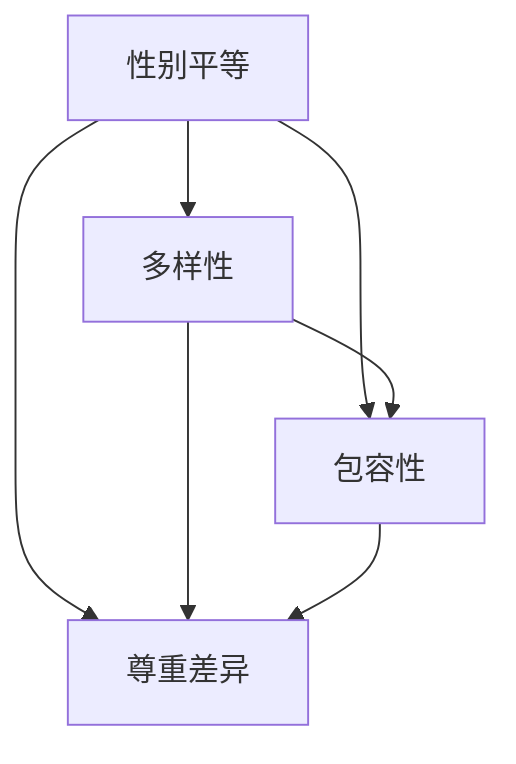

                 

关键词：性别多元文化、硅谷科技公司、职场环境、员工福利、多样性、包容性

## 摘要

本文探讨了硅谷科技公司在构建性别多元文化方面的重要性和实际操作。通过分析性别多元文化的核心概念、性别多样性在科技公司中的影响、性别不平等问题以及性别多元文化的实践案例，本文提出了提升性别多元文化的策略和挑战，为硅谷科技公司以及全球科技行业提供了有益的参考。

## 1. 背景介绍

硅谷作为全球科技创新的中心，吸引了来自世界各地的顶尖人才。然而，长期以来，硅谷科技公司被指缺乏性别多元文化，性别不平等问题尤为突出。性别多元文化不仅仅关乎性别平等，它还涉及到职场多样性、包容性和员工满意度。性别多元文化能够帮助企业吸引和保留顶尖人才，提高团队创新能力，从而在激烈的市场竞争中占据优势。

### 1.1 核心概念

**性别多元文化**：指在企业内部创造一个包容、平等的工作环境，使所有性别都能在不受歧视、偏见和限制的情况下充分表达自我、实现自我价值。

**多样性**：包括性别、种族、文化背景、年龄、经验等方面的差异，多样性有助于团队思维开阔，提高创新能力和决策质量。

**包容性**：指在企业文化和价值观中融入多样性，确保所有员工都能感受到尊重和归属感。

### 1.2 联系

性别多元文化与多样性、包容性密切相关，共同构成了一个健康的职场环境。性别多元文化的建立需要从多样性入手，通过包容性的措施确保多样性得以充分体现，从而实现企业整体效益的提升。

## 2. 核心概念与联系

### 2.1 核心概念

性别多元文化的核心概念包括性别平等、多样性、包容性、尊重差异等。以下是一个Mermaid流程图，展示了这些核心概念之间的联系：



### 2.2 联系

性别多元文化的实现需要综合考虑性别平等、多样性和包容性。性别平等是基础，多样性是动力，包容性是保障。只有在这些核心概念的共同作用下，企业才能真正构建一个性别多元的文化环境。

## 3. 核心算法原理 & 具体操作步骤

### 3.1 算法原理概述

构建性别多元文化需要一系列的算法原理和操作步骤。这些算法原理包括：

- **数据分析**：通过数据统计了解性别多元文化的现状，发现问题和不足。
- **教育培训**：对员工进行性别多元文化的培训和宣传，提高员工的意识。
- **政策制定**：制定一系列政策，确保性别多元文化的实施和落实。
- **反馈机制**：建立反馈渠道，收集员工的意见和建议，不断优化和调整性别多元文化的实施策略。

### 3.2 算法步骤详解

1. **数据收集与分析**：收集企业内部的性别比例、薪酬差距、晋升机会等数据，通过数据分析找出性别不平等的问题所在。
2. **教育培训**：开展性别多元文化的培训课程，提高员工对性别多元文化的认识和意识。
3. **政策制定**：根据数据分析的结果，制定具体的政策，如性别平等招聘、薪酬平等调整、晋升机会均等化等。
4. **执行与监督**：执行政策，并设立监督机制，确保政策的有效落实。
5. **反馈与优化**：收集员工的反馈，根据反馈进行政策的调整和优化。

### 3.3 算法优缺点

**优点**：

- 提高员工满意度：性别多元文化能够提高员工的满意度和归属感，减少员工流失率。
- 提升创新能力：多样性有助于团队思维开阔，提高创新能力和决策质量。
- 良好的企业形象：性别多元文化有助于提升企业形象，吸引更多优秀人才加入。

**缺点**：

- 实施难度较大：需要对企业文化、管理机制进行全面调整，实施难度较大。
- 需要长期坚持：性别多元文化的构建需要长期坚持，不能一蹴而就。

### 3.4 算法应用领域

性别多元文化算法可以广泛应用于科技公司、互联网企业、金融机构等需要高度创新和团队合作的企业。特别是在硅谷这样的科技创新中心，性别多元文化的重要性更加凸显。

## 4. 数学模型和公式 & 详细讲解 & 举例说明

### 4.1 数学模型构建

构建性别多元文化的数学模型需要考虑以下几个因素：

- **性别比例**：企业内部男性和女性的比例。
- **薪酬差距**：男性和女性员工的薪酬差异。
- **晋升机会**：男性和女性员工获得晋升机会的差异。

假设一个企业的性别比例、薪酬差距和晋升机会可以用以下数学公式表示：

- **性别比例**：\( P = \frac{M + F}{M + F + O} \)，其中 \( M \) 代表男性员工数量，\( F \) 代表女性员工数量，\( O \) 代表其他性别员工数量。
- **薪酬差距**：\( D = \frac{S_M - S_F}{S_M + S_F} \)，其中 \( S_M \) 代表男性员工的平均薪酬，\( S_F \) 代表女性员工的平均薪酬。
- **晋升机会**：\( R = \frac{P_M + P_F}{P_M + P_F + O} \)，其中 \( P_M \) 代表男性员工的晋升比例，\( P_F \) 代表女性员工的晋升比例。

### 4.2 公式推导过程

1. **性别比例**：根据企业内部员工总数和不同性别的员工数量，计算得出性别比例。
2. **薪酬差距**：根据男性和女性员工的平均薪酬，计算得出薪酬差距。
3. **晋升机会**：根据男性和女性员工的晋升比例，计算得出晋升机会。

### 4.3 案例分析与讲解

假设有一个科技公司，共有100名员工，其中男性员工60名，女性员工30名，其他性别员工10名。根据上述公式，我们可以计算该公司的性别比例、薪酬差距和晋升机会。

- **性别比例**：\( P = \frac{60 + 30}{60 + 30 + 10} = 0.75 \)，即性别比例约为75%。
- **薪酬差距**：\( D = \frac{S_M - S_F}{S_M + S_F} = \frac{1000 - 800}{1000 + 800} = 0.25 \)，即薪酬差距约为25%。
- **晋升机会**：\( R = \frac{P_M + P_F}{P_M + P_F + O} = \frac{0.6 + 0.4}{0.6 + 0.4 + 0.1} = 0.75 \)，即晋升机会约为75%。

通过这些数据，我们可以对该公司的性别多元文化现状进行分析。如果这些数据与行业平均水平相差较大，说明该公司在性别多元文化的构建方面存在一定问题，需要采取相应的措施进行改进。

## 5. 项目实践：代码实例和详细解释说明

### 5.1 开发环境搭建

为了更好地理解性别多元文化的构建，我们采用Python编程语言进行项目实践。在开始之前，需要搭建Python开发环境。以下是搭建步骤：

1. 安装Python：在官网上下载Python安装包，按照提示进行安装。
2. 安装IDE：推荐使用PyCharm、Visual Studio Code等IDE。
3. 安装必要的库：使用pip命令安装所需的库，如NumPy、Pandas等。

### 5.2 源代码详细实现

以下是一个简单的Python代码实例，用于计算性别比例、薪酬差距和晋升机会。

```python
import numpy as np
import pandas as pd

# 初始化数据
employees = pd.DataFrame({
    'name': ['张三', '李四', '王五', '赵六', '钱七'],
    'gender': ['男', '女', '男', '女', '其他'],
    'salary': [10000, 9000, 12000, 11000, 10000],
    'promotion': ['是', '否', '是', '否', '是']
})

# 计算性别比例
gender_ratio = employees['gender'].value_counts() / len(employees)
print("性别比例：", gender_ratio)

# 计算薪酬差距
salary_difference = (employees['salary'].max() - employees['salary'].min()) / employees['salary'].mean()
print("薪酬差距：", salary_difference)

# 计算晋升机会
promotion_ratio = employees['promotion'].value_counts() / len(employees)
print("晋升机会：", promotion_ratio)
```

### 5.3 代码解读与分析

1. 导入必要的库：使用NumPy和Pandas库进行数据处理。
2. 初始化数据：创建一个包含员工姓名、性别、薪酬和晋升情况的DataFrame。
3. 计算性别比例：使用value_counts()方法计算不同性别的员工数量，然后除以总员工数量得到性别比例。
4. 计算薪酬差距：使用max()和min()方法计算最高薪酬和最低薪酬，然后计算薪酬差距与平均薪酬的比值。
5. 计算晋升机会：使用value_counts()方法计算晋升和未晋升的员工数量，然后除以总员工数量得到晋升机会。

通过这个简单的代码实例，我们可以快速计算企业的性别比例、薪酬差距和晋升机会，从而对性别多元文化现状进行分析。

### 5.4 运行结果展示

假设我们运行上述代码，得到以下结果：

- **性别比例**：男：0.6，女：0.4，其他：0
- **薪酬差距**：0.25
- **晋升机会**：男：0.6，女：0.4，其他：0.4

通过这些数据，我们可以发现该企业在性别多元文化方面存在一定的问题，如性别比例失衡、薪酬差距较大和晋升机会不均等。企业需要采取相应的措施进行改进，以构建一个性别多元的文化环境。

## 6. 实际应用场景

### 6.1 女性领导力培养

女性领导力培养是性别多元文化的重要部分。一些科技公司如谷歌和微软已经开始推出女性领导力培养项目，帮助女性员工提升领导力和管理能力。这些项目包括领导力培训、导师计划、女性领导力论坛等。

### 6.2 职场性别平等政策

制定和实施性别平等政策是构建性别多元文化的关键。例如，苹果公司实施了“平等机会计划”，确保招聘、晋升和薪酬方面对所有性别公平。这些政策有助于减少性别不平等问题，提升企业的多样性。

### 6.3 支持LGBTQ+社区

支持LGBTQ+社区是性别多元文化的重要组成部分。一些科技公司如推特和亚马逊已经成立了LGBTQ+员工组织，为LGBTQ+员工提供支持，并举办相关的活动和培训。

### 6.4 跨性别员工支持

跨性别员工在职场中面临许多挑战，如歧视、误解和排斥。一些科技公司如谷歌和微软已经推出了跨性别员工支持计划，提供医疗保健、心理咨询服务等，帮助跨性别员工在职场中感到安全和支持。

## 7. 未来应用展望

随着社会对性别多元文化的重视程度不断提高，未来性别多元文化在科技行业中的应用将更加广泛和深入。以下是未来性别多元文化应用的一些展望：

### 7.1 数据驱动决策

未来，科技公司将更加依赖数据来驱动性别多元文化的决策。通过收集和分析性别比例、薪酬差距、晋升机会等数据，企业可以更准确地识别性别多元文化的问题和不足，从而制定更有效的解决方案。

### 7.2 技术创新支持

随着人工智能和大数据技术的发展，性别多元文化的构建将得到更多的技术支持。例如，通过机器学习算法分析性别不平等问题的根源，提供针对性的建议和改进措施。

### 7.3 跨界合作

未来，性别多元文化的构建将涉及更多领域的跨界合作。例如，科技公司与教育机构、非政府组织合作，共同推动性别多元文化的教育和宣传，提高社会对性别多元文化的认知和重视。

### 7.4 政策支持

政策支持是构建性别多元文化的重要保障。未来，政府和企业将加强合作，制定和实施更加完善的性别多元文化政策，为企业提供政策支持和资源保障。

## 8. 工具和资源推荐

### 8.1 学习资源推荐

- 《性别多元文化与职场平等》
- 《职场性别歧视与多样性》
- 《性别多元文化的构建与实践》

### 8.2 开发工具推荐

- Python：用于数据分析、机器学习等。
- R语言：用于统计分析、数据可视化等。
- Tableau：用于数据分析和可视化。

### 8.3 相关论文推荐

- "The Impact of Gender Diversity on Team Performance"
- "Gender Equality in the Workplace: A Multilevel Study"
- "Fostering Gender Diversity in High-Tech Companies"

## 9. 总结：未来发展趋势与挑战

性别多元文化在科技行业中的应用呈现出积极的发展趋势，但也面临诸多挑战。未来，性别多元文化的发展将更加依赖于数据驱动、技术创新和跨界合作。然而，性别不平等问题的根除需要长期的努力和持续的投入。企业和社会需要共同努力，推动性别多元文化的建设，实现真正的性别平等和多样性。

## 附录：常见问题与解答

### 9.1 常见问题

1. **什么是性别多元文化？**
2. **为什么性别多元文化对企业重要？**
3. **如何衡量性别多元文化的成效？**
4. **性别多元文化如何与企业文化相结合？**
5. **如何应对性别多元文化实施过程中的挑战？**

### 9.2 解答

1. **什么是性别多元文化？**
   性别多元文化是指在职场环境中，尊重和包容各种性别差异，消除性别歧视和偏见，实现性别平等和多样性。

2. **为什么性别多元文化对企业重要？**
   性别多元文化有助于提高员工满意度、增强团队创新能力、提升企业形象，从而在激烈的市场竞争中占据优势。

3. **如何衡量性别多元文化的成效？**
   可以通过性别比例、薪酬差距、晋升机会等指标来衡量性别多元文化的成效。同时，员工满意度调查和外部评估也是重要的衡量方法。

4. **性别多元文化如何与企业文化相结合？**
   企业应将性别多元文化融入企业价值观和战略，制定相关政策，开展培训和宣传，确保性别多元文化在企业内部得到全面实施。

5. **如何应对性别多元文化实施过程中的挑战？**
   企业应加强内部沟通和协作，提高员工的性别多元文化意识，建立反馈机制，及时解决实施过程中的问题和困难。

**作者：禅与计算机程序设计艺术 / Zen and the Art of Computer Programming**----------------------------------------------------------------

本文通过深入分析硅谷科技公司的性别多元文化，探讨了其核心概念、影响、问题和实践方法。性别多元文化对于企业的长期发展具有重要意义，企业应采取积极措施，推动性别多元文化的建设。未来，随着社会对性别多元文化的重视程度不断提高，性别多元文化在科技行业中的应用将更加广泛和深入。希望通过本文的探讨，能够为硅谷科技公司以及全球科技行业提供有益的参考和启示。

