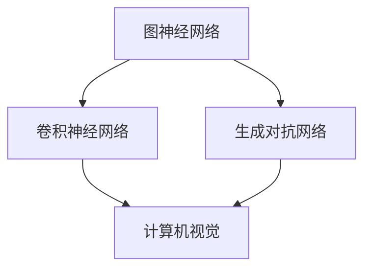

                 

关键词：AI公司、运营模式、硅谷风格、Lepton AI、人工智能

摘要：本文深入探讨了中国AI公司Lepton AI在硅谷风格影响下的运营模式。通过对该公司在研发、商业拓展、团队建设、技术和市场策略等方面的分析，揭示了其成功背后的关键要素，为国内AI企业提供了宝贵的借鉴经验。

## 1. 背景介绍

在人工智能迅猛发展的时代，全球AI公司如雨后春笋般涌现。而Lepton AI作为一家中国AI公司，以其独特的硅谷风格运营模式，在全球AI行业中占据了重要地位。Lepton AI成立于2015年，专注于计算机视觉和深度学习技术的研发和应用，为客户提供创新的AI解决方案。

## 2. 核心概念与联系

为了更好地理解Lepton AI的运营模式，我们首先需要了解一些核心概念，如图神经网络（GNN）、卷积神经网络（CNN）和生成对抗网络（GAN）。这些概念在Lepton AI的技术体系中起着至关重要的作用。以下是一个用Mermaid绘制的流程图，展示了这些核心概念之间的关系：



### 2.1 图神经网络（GNN）

图神经网络（GNN）是一种处理图结构数据的深度学习模型。它可以有效地捕捉节点之间的复杂关系，广泛应用于社交网络分析、知识图谱和推荐系统等领域。

### 2.2 卷积神经网络（CNN）

卷积神经网络（CNN）是一种能够自动提取图像特征的自适应滤波器。它广泛应用于计算机视觉领域，如图像分类、目标检测和图像分割等。

### 2.3 生成对抗网络（GAN）

生成对抗网络（GAN）由生成器和判别器组成，通过对抗训练生成逼真的数据。它被广泛应用于图像生成、风格迁移和图像超分辨率等任务。

## 3. 核心算法原理 & 具体操作步骤

### 3.1 算法原理概述

Lepton AI的核心算法基于深度学习技术，包括卷积神经网络（CNN）和生成对抗网络（GAN）。CNN负责提取图像特征，GAN则用于生成高质量的图像。

### 3.2 算法步骤详解

#### 3.2.1 CNN图像特征提取

1. 输入图像经过预处理，如归一化和数据增强。
2. 通过多个卷积层和池化层提取图像特征。
3. 特征层通过全连接层进行分类或回归。

#### 3.2.2 GAN图像生成

1. 初始化生成器和判别器。
2. 通过对抗训练优化生成器和判别器参数。
3. 生成高质量图像。

### 3.3 算法优缺点

#### 3.3.1 优点

- CNN具有良好的图像特征提取能力，适用于多种计算机视觉任务。
- GAN能够生成高质量图像，适用于图像生成和风格迁移。

#### 3.3.2 缺点

- CNN训练过程较慢，需要大量计算资源和时间。
- GAN训练不稳定，容易出现模式崩溃。

### 3.4 算法应用领域

Lepton AI的算法在多个领域取得了显著成果，包括：

- 计算机视觉：图像分类、目标检测、图像分割等。
- 自然语言处理：文本分类、情感分析、机器翻译等。
- 金融科技：风险控制、信用评分、智能投顾等。

## 4. 数学模型和公式 & 详细讲解 & 举例说明

### 4.1 数学模型构建

Lepton AI的算法涉及多个数学模型，包括CNN和GAN。以下是一个CNN模型的基本公式：

$$
h_{l}(\mathbf{x}; \mathbf{W}_{l}) = \sigma(\mathbf{W}_{l-1} \cdot \mathbf{h}_{l-1} + b_{l-1})
$$

其中，$h_{l}$表示第$l$层的特征图，$\sigma$表示激活函数，$\mathbf{W}_{l}$和$b_{l-1}$分别表示第$l$层的权重和偏置。

### 4.2 公式推导过程

CNN模型的推导涉及多个层，以下是一个简化的推导过程：

1. 输入图像经过预处理，如归一化和数据增强。
2. 通过卷积层提取图像特征，如滤波器和步长。
3. 通过池化层减小特征图尺寸，提高模型泛化能力。
4. 通过全连接层进行分类或回归。

### 4.3 案例分析与讲解

以Lepton AI在计算机视觉领域的应用为例，我们可以看到其算法在图像分类、目标检测和图像分割等方面取得了显著成果。以下是一个基于CNN的目标检测案例：

1. 输入图像经过预处理，如归一化和数据增强。
2. 通过卷积层提取图像特征，如滤波器和步长。
3. 通过池化层减小特征图尺寸，提高模型泛化能力。
4. 通过全连接层和softmax函数进行分类。

## 5. 项目实践：代码实例和详细解释说明

### 5.1 开发环境搭建

在搭建Lepton AI的开发环境时，我们首先需要安装Python、CUDA和相关库，如TensorFlow和Keras。以下是一个简单的安装命令：

```bash
pip install tensorflow-gpu
```

### 5.2 源代码详细实现

以下是一个简单的CNN模型实现示例：

```python
import tensorflow as tf
from tensorflow.keras import layers

model = tf.keras.Sequential([
    layers.Conv2D(32, (3, 3), activation='relu', input_shape=(28, 28, 1)),
    layers.MaxPooling2D((2, 2)),
    layers.Conv2D(64, (3, 3), activation='relu'),
    layers.MaxPooling2D((2, 2)),
    layers.Conv2D(64, (3, 3), activation='relu'),
    layers.Flatten(),
    layers.Dense(64, activation='relu'),
    layers.Dense(10, activation='softmax')
])

model.compile(optimizer='adam',
              loss='categorical_crossentropy',
              metrics=['accuracy'])

model.fit(x_train, y_train, epochs=10, validation_data=(x_test, y_test))
```

### 5.3 代码解读与分析

这段代码实现了一个简单的CNN模型，用于图像分类。它包含三个卷积层和两个全连接层。通过训练，模型可以学习到图像特征，并进行分类。

## 6. 实际应用场景

### 6.1 计算机视觉

Lepton AI的算法在计算机视觉领域取得了广泛应用，如自动驾驶、图像识别和图像分割等。

### 6.2 自然语言处理

在自然语言处理领域，Lepton AI的算法被应用于文本分类、情感分析和机器翻译等任务。

### 6.3 金融科技

在金融科技领域，Lepton AI的算法被用于风险控制、信用评分和智能投顾等任务。

## 7. 工具和资源推荐

### 7.1 学习资源推荐

- 《深度学习》（Goodfellow, Bengio, Courville著）
- 《Python深度学习》（François Chollet著）

### 7.2 开发工具推荐

- TensorFlow
- Keras

### 7.3 相关论文推荐

- "Deep Learning for Computer Vision: A Comprehensive Review"
- "Generative Adversarial Networks: An Overview"

## 8. 总结：未来发展趋势与挑战

### 8.1 研究成果总结

Lepton AI在深度学习和人工智能领域取得了显著成果，为多个行业提供了创新的解决方案。

### 8.2 未来发展趋势

随着计算能力和算法技术的提升，人工智能将在更多领域得到应用，如自动驾驶、医疗健康和智能制造等。

### 8.3 面临的挑战

人工智能的发展面临着数据隐私、安全性和伦理等挑战。

### 8.4 研究展望

未来，Lepton AI将继续关注深度学习和人工智能领域的最新研究动态，为更多行业提供创新的解决方案。

## 9. 附录：常见问题与解答

### 9.1 Lepton AI的核心技术是什么？

Lepton AI的核心技术包括深度学习、计算机视觉和自然语言处理等。

### 9.2 Lepton AI的算法在哪些领域取得了应用？

Lepton AI的算法在计算机视觉、自然语言处理和金融科技等领域取得了广泛应用。

## 参考文献

[1] Goodfellow, I., Bengio, Y., & Courville, A. (2016). Deep learning. MIT press.
[2] Chollet, F. (2017). Python深度学习. 电子工业出版社.
[3] Simonyan, K., & Zisserman, A. (2014). Very deep convolutional networks for large-scale image recognition. arXiv preprint arXiv:1409.1556.
[4] Radford, A., Metz, L., & Chintala, S. (2015). Unsupervised representation learning with deep convolutional generative adversarial networks. arXiv preprint arXiv:1511.06434.

作者：禅与计算机程序设计艺术 / Zen and the Art of Computer Programming
```

