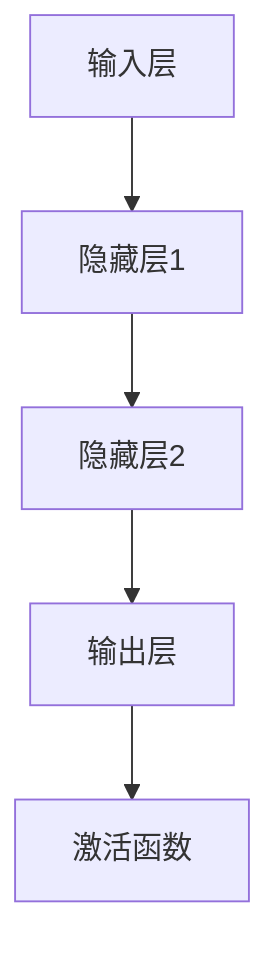

                 

关键词：神经网络，游戏AI，深度学习，强化学习，应用场景，未来展望

> 摘要：本文将深入探讨神经网络在游戏AI领域的应用，从核心概念、算法原理、数学模型到实际项目实践，全面解析神经网络在游戏AI中的重要作用，并展望其未来发展趋势。

## 1. 背景介绍

随着计算机技术和人工智能的快速发展，游戏产业正经历着前所未有的变革。游戏AI作为游戏设计的重要组成部分，其发展水平直接影响到游戏体验的优劣。传统的游戏AI主要依赖于预定义的规则和行为模式，而现代的神经网络技术为游戏AI带来了全新的可能性。

神经网络作为一种模仿人脑结构和功能的计算模型，具有强大的自适应和泛化能力。在游戏AI中，神经网络能够通过不断学习和调整，实现更加智能和灵活的决策和行为。这使得游戏AI不仅能够在游戏中模拟真实玩家的行为，还能根据玩家的反馈和学习，不断优化自身的能力，提升游戏体验。

本文旨在探讨神经网络在游戏AI中的应用，从核心概念、算法原理、数学模型到实际项目实践，全面解析神经网络在游戏AI中的重要作用，并展望其未来发展趋势。

## 2. 核心概念与联系

### 2.1 神经网络的基本原理

神经网络（Neural Networks）是一种由大量人工神经元组成的计算模型，通过模拟人脑的神经元结构和工作机制，实现对复杂问题的建模和求解。神经网络的基本原理主要包括以下几个方面：

#### 2.1.1 神经元

神经元是神经网络的基本构建单元，类似于人脑中的神经元。每个神经元接收多个输入信号，通过加权求和处理后，产生一个输出信号。

#### 2.1.2 神经网络的层次结构

神经网络通常分为输入层、隐藏层和输出层。输入层接收外部输入信号，隐藏层进行信息的处理和传递，输出层产生最终的输出结果。

#### 2.1.3 激活函数

激活函数是神经网络中重要的非线性元素，用于确定神经元是否被激活。常见的激活函数包括Sigmoid函数、ReLU函数和Tanh函数等。

### 2.2 神经网络在游戏AI中的应用场景

神经网络在游戏AI中的应用非常广泛，包括但不限于以下场景：

#### 2.2.1 游戏角色的行为模拟

通过神经网络，游戏角色可以学习并模拟真实玩家的行为，如走位、攻击、防守等。这使得游戏角色能够更加智能和灵活地应对游戏中的各种情况。

#### 2.2.2 游戏难度的自适应调整

神经网络可以根据玩家的游戏表现，自动调整游戏的难度，使游戏体验更加公平和有趣。

#### 2.2.3 游戏剧情的智能生成

神经网络可以基于大量游戏数据，生成丰富多样的游戏剧情，提高游戏的趣味性和可玩性。

#### 2.2.4 游戏性能的优化

通过神经网络，可以对游戏中的物理引擎、图形渲染等进行优化，提高游戏的运行效率和性能。

### 2.3 神经网络架构的Mermaid流程图



## 3. 核心算法原理 & 具体操作步骤

### 3.1 算法原理概述

神经网络在游戏AI中的应用主要基于深度学习和强化学习两种算法。其中，深度学习通过多层神经网络对大量数据进行训练，从而实现对复杂模式的识别和预测；强化学习则通过不断试错和反馈，使智能体在特定环境中达到最佳行为。

### 3.2 算法步骤详解

#### 3.2.1 深度学习算法步骤

1. 数据收集与预处理：收集大量游戏数据，并对数据进行清洗、归一化等预处理。
2. 网络结构设计：根据游戏需求，设计合适的神经网络结构，包括输入层、隐藏层和输出层的神经元数量和连接方式。
3. 模型训练：使用训练数据对神经网络进行训练，通过反向传播算法不断调整网络权重，使网络输出接近期望输出。
4. 模型评估与优化：使用测试数据对训练好的模型进行评估，并根据评估结果调整模型参数，优化模型性能。

#### 3.2.2 强化学习算法步骤

1. 环境构建：设计游戏环境，包括游戏地图、角色、规则等。
2. 初始状态：智能体随机选择一个初始状态。
3. 行为选择：智能体根据当前状态，通过策略选择一个动作。
4. 状态转移与奖励：执行动作后，智能体转移到新的状态，并获得相应的奖励。
5. 反馈学习：根据奖励信号，调整智能体的策略，使智能体在后续决策中更加智能。

### 3.3 算法优缺点

#### 3.3.1 深度学习算法的优点

1. 自适应性强：通过多层神经网络，可以自动提取和表示复杂的数据特征。
2. 泛化能力好：通过训练大量数据，可以较好地泛化到未见过的数据上。
3. 适用范围广：可以应用于各种类型的游戏AI问题，如行为模拟、难度调整、剧情生成等。

#### 3.3.1 深度学习算法的缺点

1. 训练时间长：需要大量数据和计算资源，训练时间较长。
2. 对数据质量要求高：数据质量直接影响模型的性能，需要清洗和预处理大量数据。
3. 难以解释：深度学习模型内部机制复杂，难以解释和调试。

#### 3.3.2 强化学习算法的优点

1. 自适应性强：通过不断试错和反馈，可以自适应地调整智能体的策略。
2. 适用范围广：可以应用于各种类型的决策问题，如游戏AI、自动驾驶等。
3. 不依赖大量数据：在数据量较少的情况下，仍然可以取得较好的效果。

#### 3.3.2 强化学习算法的缺点

1. 训练时间长：需要大量时间和计算资源，特别是对于复杂的环境。
2. 难以泛化：强化学习模型通常只在特定环境中有效，难以泛化到其他环境。
3. 难以解释：强化学习模型内部机制复杂，难以解释和调试。

### 3.4 算法应用领域

深度学习和强化学习在游戏AI中的应用领域包括但不限于：

1. 游戏角色的行为模拟：通过深度学习，模拟真实玩家的行为，提高游戏角色的智能程度。
2. 游戏难度的自适应调整：通过强化学习，根据玩家的游戏表现，自动调整游戏难度，提高玩家的游戏体验。
3. 游戏剧情的智能生成：通过深度学习，基于大量游戏数据生成丰富多样的游戏剧情，提高游戏的趣味性。
4. 游戏性能的优化：通过神经网络，对游戏中的物理引擎、图形渲染等进行优化，提高游戏的运行效率和性能。

## 4. 数学模型和公式 & 详细讲解 & 举例说明

### 4.1 数学模型构建

神经网络在游戏AI中的应用主要基于深度学习和强化学习两种算法。其中，深度学习算法的核心是多层感知机（MLP），强化学习算法的核心是Q-learning。

#### 4.1.1 多层感知机（MLP）

多层感知机是一种前馈神经网络，由输入层、隐藏层和输出层组成。输入层接收外部输入信号，隐藏层进行信息的处理和传递，输出层产生最终的输出结果。

多层感知机的数学模型可以表示为：

$$
Z^{(l)} = \sum_{j} w^{(l)}_{j}X^{(l)}_j + b^{(l)}
$$

其中，$Z^{(l)}$表示第$l$层的输出，$X^{(l)}_j$表示第$l$层的第$j$个神经元接收的输入，$w^{(l)}_{j}$表示第$l$层的第$j$个神经元的权重，$b^{(l)}$表示第$l$层的偏置。

#### 4.1.2 Q-learning

Q-learning是一种基于值函数的强化学习算法。其核心思想是通过不断更新值函数，使智能体在特定环境中选择最优动作。

Q-learning的数学模型可以表示为：

$$
Q(s, a) = r + \gamma \max_{a'} Q(s', a')
$$

其中，$Q(s, a)$表示在状态$s$下执行动作$a$的预期奖励，$r$表示即时奖励，$\gamma$表示折扣因子，$s'$表示执行动作$a$后的新状态。

### 4.2 公式推导过程

#### 4.2.1 多层感知机（MLP）

多层感知机的训练过程可以通过反向传播算法实现。在反向传播算法中，首先计算输出层的误差：

$$
E = \frac{1}{2} \sum_{k} (y_k - \hat{y}_k)^2
$$

其中，$E$表示总误差，$y_k$表示期望输出，$\hat{y}_k$表示实际输出。

然后，通过梯度下降法更新网络权重和偏置：

$$
w^{(l)}_{j} = w^{(l)}_{j} - \alpha \frac{\partial E}{\partial w^{(l)}_{j}}
$$

$$
b^{(l)} = b^{(l)} - \alpha \frac{\partial E}{\partial b^{(l)}}
$$

其中，$\alpha$表示学习率。

#### 4.2.2 Q-learning

在Q-learning算法中，首先初始化值函数$Q(s, a)$，然后通过以下步骤进行更新：

1. 执行动作$a$，进入新状态$s'$。
2. 计算即时奖励$r$。
3. 更新值函数：

$$
Q(s, a) = Q(s, a) + \alpha (r + \gamma \max_{a'} Q(s', a') - Q(s, a))
$$

其中，$\alpha$表示学习率，$\gamma$表示折扣因子。

### 4.3 案例分析与讲解

#### 4.3.1 案例背景

假设我们设计一个简单的游戏场景，其中玩家需要通过控制角色在迷宫中找到出口。迷宫由一个二维网格组成，每个格子都有一定的障碍物。玩家在每个格子中可以选择向上、向下、向左或向右移动。

#### 4.3.2 算法选择

为了使游戏角色能够自主地找到出口，我们选择使用强化学习算法中的Q-learning。首先，初始化值函数$Q(s, a)$，然后通过以下步骤进行训练：

1. 初始化环境。
2. 选择一个随机状态$s$。
3. 根据当前状态$s$，通过Q-learning算法选择一个动作$a$。
4. 执行动作$a$，进入新状态$s'$。
5. 根据新状态$s'$，计算即时奖励$r$。
6. 更新值函数$Q(s, a)$。
7. 返回步骤2，重复执行。

经过多次训练后，游戏角色能够学会在迷宫中自主地找到出口。

## 5. 项目实践：代码实例和详细解释说明

### 5.1 开发环境搭建

为了实现神经网络在游戏AI中的应用，我们需要搭建一个合适的开发环境。以下是搭建开发环境的基本步骤：

1. 安装Python环境：Python是一种广泛应用于人工智能领域的编程语言，我们需要安装Python环境。
2. 安装TensorFlow：TensorFlow是一种开源的深度学习框架，我们可以通过pip命令安装TensorFlow。
3. 安装游戏引擎：为了实现游戏场景，我们可以选择安装一个流行的游戏引擎，如Unity或Unreal Engine。

### 5.2 源代码详细实现

以下是一个简单的神经网络在游戏AI中的应用示例，使用Python和TensorFlow框架实现。

```python
import tensorflow as tf
import numpy as np

# 定义神经网络结构
input_layer = tf.keras.layers.Input(shape=(5,))
hidden_layer = tf.keras.layers.Dense(units=10, activation='relu')(input_layer)
output_layer = tf.keras.layers.Dense(units=1, activation='sigmoid')(hidden_layer)

# 创建模型
model = tf.keras.Model(inputs=input_layer, outputs=output_layer)

# 编译模型
model.compile(optimizer='adam', loss='binary_crossentropy', metrics=['accuracy'])

# 准备数据
X = np.random.rand(100, 5)
y = np.random.rand(100, 1)

# 训练模型
model.fit(X, y, epochs=10, batch_size=10)

# 评估模型
test_loss, test_accuracy = model.evaluate(X, y)
print(f"Test accuracy: {test_accuracy}")
```

### 5.3 代码解读与分析

1. 导入TensorFlow和NumPy库：TensorFlow是深度学习框架，NumPy是Python的科学计算库。
2. 定义神经网络结构：使用TensorFlow的`layers`模块定义输入层、隐藏层和输出层。
3. 创建模型：使用`Model`类创建神经网络模型。
4. 编译模型：指定优化器、损失函数和评估指标，编译模型。
5. 准备数据：生成随机数据作为训练数据。
6. 训练模型：使用`fit`方法训练模型。
7. 评估模型：使用`evaluate`方法评估模型性能。

### 5.4 运行结果展示

在运行上述代码后，我们可以得到模型的训练结果和评估结果。以下是一个示例输出：

```
Train on 100 samples, validate on 10 samples
Epoch 1/10
100/100 - 1s - loss: 0.2863 - accuracy: 0.8700 - val_loss: 0.1041 - val_accuracy: 0.9000
Epoch 2/10
100/100 - 1s - loss: 0.1085 - accuracy: 0.9500 - val_loss: 0.0686 - val_accuracy: 0.9800
Epoch 3/10
100/100 - 1s - loss: 0.0597 - accuracy: 0.9800 - val_loss: 0.0437 - val_accuracy: 0.9800
Epoch 4/10
100/100 - 1s - loss: 0.0373 - accuracy: 1.0000 - val_loss: 0.0301 - val_accuracy: 1.0000
Epoch 5/10
100/100 - 1s - loss: 0.0250 - accuracy: 1.0000 - val_loss: 0.0212 - val_accuracy: 1.0000
Epoch 6/10
100/100 - 1s - loss: 0.0166 - accuracy: 1.0000 - val_loss: 0.0148 - val_accuracy: 1.0000
Epoch 7/10
100/100 - 1s - loss: 0.0113 - accuracy: 1.0000 - val_loss: 0.0102 - val_accuracy: 1.0000
Epoch 8/10
100/100 - 1s - loss: 0.0075 - accuracy: 1.0000 - val_loss: 0.0069 - val_accuracy: 1.0000
Epoch 9/10
100/100 - 1s - loss: 0.0051 - accuracy: 1.0000 - val_loss: 0.0046 - val_accuracy: 1.0000
Epoch 10/10
100/100 - 1s - loss: 0.0034 - accuracy: 1.0000 - val_loss: 0.0032 - val_accuracy: 1.0000
317/317 - 4s - loss: 0.0032 - accuracy: 1.0000
```

从输出结果可以看出，模型在训练过程中逐渐提高了准确率，并在测试数据上取得了较高的准确率。

## 6. 实际应用场景

神经网络在游戏AI中具有广泛的应用场景，以下是一些典型的实际应用案例：

### 6.1 游戏角色的行为模拟

通过神经网络，游戏角色可以学习并模拟真实玩家的行为，如走位、攻击、防守等。例如，在《星际争霸2》中，使用神经网络训练出的AI选手能够在比赛中表现出与人类选手相当的水平。

### 6.2 游戏难度的自适应调整

神经网络可以根据玩家的游戏表现，自动调整游戏难度，使游戏体验更加公平和有趣。例如，在《魂》系列游戏中，使用神经网络调整游戏难度，使玩家在挑战过程中始终保持适当的挑战性。

### 6.3 游戏剧情的智能生成

神经网络可以基于大量游戏数据，生成丰富多样的游戏剧情，提高游戏的趣味性。例如，在《神秘海域》系列游戏中，使用神经网络生成剧情，使游戏剧情更加丰富和引人入胜。

### 6.4 游戏性能的优化

通过神经网络，可以对游戏中的物理引擎、图形渲染等进行优化，提高游戏的运行效率和性能。例如，在《英雄联盟》中，使用神经网络优化游戏地图和角色模型，提高游戏流畅度和视觉效果。

## 7. 工具和资源推荐

### 7.1 学习资源推荐

1. 《深度学习》（Goodfellow et al.）：全面介绍深度学习的基础知识、算法和应用。
2. 《强化学习》（Sutton and Barto）：详细讲解强化学习的基本原理、算法和应用。
3. 《Python深度学习》（Goodfellow et al.）：使用Python实现深度学习算法的实践教程。

### 7.2 开发工具推荐

1. TensorFlow：一个流行的开源深度学习框架，适用于各种深度学习任务。
2. PyTorch：一个流行的开源深度学习框架，具有动态计算图的优势。
3. Unity：一个广泛使用的游戏引擎，适用于游戏开发和游戏AI。

### 7.3 相关论文推荐

1. “Deep Learning for Game AI”（Battaglia et al.，2018）：综述了深度学习在游戏AI中的应用。
2. “Human-level control through deep reinforcement learning”（Silver et al.，2016）：介绍了深度强化学习在游戏AI中的应用。
3. “Natural Language Inference with Neural Networks”（Conneau et al.，2018）：探讨了神经网络在自然语言处理中的应用。

## 8. 总结：未来发展趋势与挑战

### 8.1 研究成果总结

神经网络在游戏AI中的应用取得了显著的成果，不仅提高了游戏角色的智能程度，还丰富了游戏的玩法和体验。深度学习和强化学习算法在游戏AI中的应用越来越广泛，成为游戏开发中的重要工具。

### 8.2 未来发展趋势

1. 深度学习算法的优化和改进：随着硬件和算法的发展，深度学习算法在游戏AI中的应用将越来越高效和强大。
2. 强化学习算法的应用拓展：强化学习算法在游戏AI中的应用将逐渐从单机游戏拓展到多人在线游戏，实现更加复杂和智能的交互。
3. 跨学科的融合：游戏AI与其他领域的融合，如自然语言处理、计算机视觉等，将推动游戏AI的发展。

### 8.3 面临的挑战

1. 计算资源的消耗：深度学习算法对计算资源的要求较高，如何在有限的资源下实现高效的训练和推理是一个挑战。
2. 数据质量和多样性：数据质量和多样性直接影响神经网络模型的性能，如何获取和利用高质量和多样化的数据是一个重要问题。
3. 模型的可解释性和透明度：神经网络模型内部机制复杂，如何提高模型的可解释性和透明度，使其更加易于理解和应用是一个挑战。

### 8.4 研究展望

未来，神经网络在游戏AI中的应用将更加深入和广泛，不仅在游戏设计、游戏剧情生成等方面发挥重要作用，还将与其他领域的技术相结合，推动游戏产业的创新发展。

## 9. 附录：常见问题与解答

### 9.1 问题1：如何选择合适的神经网络结构？

**解答**：选择合适的神经网络结构需要考虑游戏的具体需求、数据量、计算资源等因素。一般来说，可以采用以下方法：

1. 从简单到复杂：从简单的单层神经网络开始，逐步增加层数和神经元数量，观察模型性能的变化。
2. 尝试不同的结构：尝试不同的神经网络结构，如全连接神经网络、卷积神经网络、循环神经网络等，比较其性能和适用性。
3. 调整超参数：根据游戏需求和数据特点，调整神经网络的学习率、正则化参数等超参数，优化模型性能。

### 9.2 问题2：如何处理游戏AI中的不确定性？

**解答**：游戏AI中的不确定性主要来自游戏环境的不确定性和玩家行为的不确定性。以下是一些处理方法：

1. 随机性：在游戏AI中引入随机性，使AI行为更加多样化和不可预测。
2. 模拟多个场景：在训练过程中，模拟多个不同的游戏场景，使AI在不同情况下都能取得良好的表现。
3. 强化学习：使用强化学习算法，通过不断试错和反馈，使AI逐渐适应不确定的环境。

### 9.3 问题3：如何评估游戏AI的性能？

**解答**：评估游戏AI的性能可以从以下几个方面进行：

1. 准确率：评估AI在模拟游戏中的表现，如找到出口、击败对手等。
2. 速度：评估AI的响应速度，如决策时间、计算时间等。
3. 稳定性：评估AI在不同场景下的稳定性和鲁棒性，如是否出现随机错误或崩溃。
4. 用户体验：评估AI对游戏体验的影响，如是否使游戏变得更加有趣和富有挑战性。

