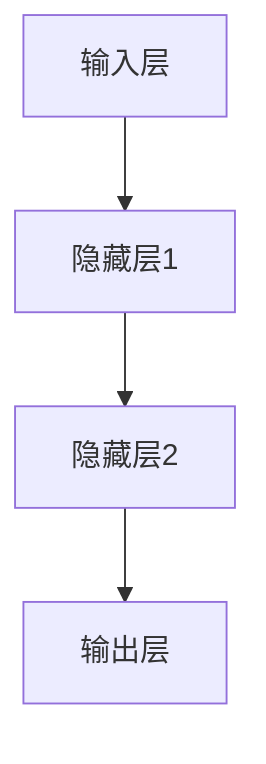

                 

关键词：神经网络、深度学习、人工智能、机器学习、神经架构

> 摘要：本文旨在探讨神经网络这一革命性的技术如何改变了人类与机器的交互方式，以及其在我们日常生活中和未来社会中的潜在应用和影响。我们将深入探讨神经网络的原理、核心算法、数学模型、实际应用，并预测其未来的发展趋势和面临的挑战。

## 1. 背景介绍

### 1.1 神经网络的起源

神经网络（Neural Networks）的概念最早可以追溯到1940年代。当时，心理学家和数学家开始思考如何通过模拟人脑神经元的工作方式来构建机器。这个想法在20世纪80年代得到了复苏，特别是在1986年，Geoffrey Hinton等人提出了反向传播算法（Backpropagation Algorithm），这是神经网络发展史上的一个重要里程碑。这一算法使得多层神经网络能够有效地学习复杂的非线性关系。

### 1.2 人工智能的发展

人工智能（Artificial Intelligence, AI）是计算机科学的一个分支，旨在使计算机具备类似人类的智能。自1956年达特茅斯会议以来，人工智能的研究取得了显著的进展。机器学习（Machine Learning）作为AI的核心技术之一，其核心目标是通过数据驱动的方式使机器能够自我学习和改进。神经网络的兴起，为机器学习带来了新的机遇和挑战。

## 2. 核心概念与联系

### 2.1 神经元与神经网络的定义

神经元是构成人脑的基本单元，它们通过电化学信号进行通信。神经网络则是由大量人工神经元组成的计算模型，这些神经元通过连接（权重）形成网络，模拟人脑的信息处理方式。

### 2.2 神经网络的架构

神经网络的架构可以分为输入层、隐藏层和输出层。输入层接收外部信息，隐藏层负责特征提取和变换，输出层产生最终的结果。

### 2.3 Mermaid 流程图



## 3. 核心算法原理 & 具体操作步骤

### 3.1 算法原理概述

神经网络的核心算法是反向传播（Backpropagation），它是一种基于梯度下降法的优化算法，用于调整网络中的权重，以最小化预测误差。

### 3.2 算法步骤详解

1. **前向传播**：输入数据通过网络传递，每一层的神经元都会对数据进行处理并传递到下一层。
2. **计算误差**：输出层产生预测结果，并与真实值进行比较，计算误差。
3. **反向传播**：将误差反向传播到网络的每一层，更新权重。
4. **迭代优化**：重复前向传播和反向传播的过程，直到误差足够小。

### 3.3 算法优缺点

- **优点**：能够处理复杂非线性问题，自动提取特征，适应性强。
- **缺点**：训练过程耗时，对大量数据敏感，难以解释。

### 3.4 算法应用领域

神经网络在图像识别、自然语言处理、游戏AI等多个领域都有广泛应用。

## 4. 数学模型和公式 & 详细讲解 & 举例说明

### 4.1 数学模型构建

神经网络中的每个神经元都可以表示为以下数学模型：

$$
z = \sigma(W \cdot x + b)
$$

其中，$z$ 是神经元的输出，$\sigma$ 是激活函数，$W$ 是权重矩阵，$x$ 是输入向量，$b$ 是偏置项。

### 4.2 公式推导过程

#### 前向传播

假设输入层有 $m$ 个神经元，隐藏层有 $n$ 个神经元，输出层有 $p$ 个神经元。

- 输入层到隐藏层的传播：

$$
h = \sigma(W_h \cdot x + b_h)
$$

- 隐藏层到输出层的传播：

$$
y = \sigma(W_o \cdot h + b_o)
$$

#### 反向传播

- 计算输出层的误差：

$$
\delta_o = \frac{\partial C}{\partial z} \cdot \sigma'(z)
$$

- 计算隐藏层的误差：

$$
\delta_h = \frac{\partial C}{\partial h} \cdot W_o \cdot \sigma'(h)
$$

#### 权重更新

- 更新输出层的权重：

$$
W_o = W_o - \alpha \cdot \frac{\partial C}{\partial W_o}
$$

- 更新隐藏层的权重：

$$
W_h = W_h - \alpha \cdot \frac{\partial C}{\partial W_h}
$$

### 4.3 案例分析与讲解

#### 案例一：图像识别

我们以MNIST手写数字识别为例，说明神经网络在实际应用中的工作流程。

1. **数据预处理**：将图像数据缩放到相同的尺寸，并归一化。
2. **构建神经网络**：选择合适的网络架构，例如卷积神经网络（CNN）。
3. **训练神经网络**：使用训练数据集，通过反向传播算法调整权重。
4. **测试神经网络**：使用测试数据集评估模型的准确性。

## 5. 项目实践：代码实例和详细解释说明

### 5.1 开发环境搭建

我们使用Python和TensorFlow作为开发工具，搭建神经网络环境。

```python
import tensorflow as tf
```

### 5.2 源代码详细实现

以下是一个简单的神经网络实现：

```python
def neural_network(x):
    # 输入层到隐藏层
    hidden_layer = tf.layers.dense(x, units=64, activation=tf.nn.relu)
    # 隐藏层到输出层
    output_layer = tf.layers.dense(hidden_layer, units=10)
    return output_layer
```

### 5.3 代码解读与分析

- `tf.layers.dense`：定义全连接层。
- `activation`：设置激活函数。
- `units`：设置每个神经元的数量。

### 5.4 运行结果展示

通过训练和测试，我们可以得到神经网络的准确率：

```python
accuracy = tf.reduce_mean(tf.cast(tf.equal(tf.argmax(output_layer), tf.argmax(y)), tf.float32))
```

## 6. 实际应用场景

### 6.1 自动驾驶

神经网络在自动驾驶中用于处理复杂的感知和决策任务，实现车辆的安全驾驶。

### 6.2 语音识别

神经网络在语音识别中用于将语音信号转换为文本，应用于智能助手和语音搜索等领域。

### 6.3 医疗诊断

神经网络在医疗诊断中用于分析医学图像和临床数据，辅助医生进行疾病诊断。

## 7. 未来应用展望

### 7.1 人工智能与人类的融合

随着神经网络的进步，人工智能将更好地融入人类生活，实现人机共生。

### 7.2 个性化服务

神经网络将帮助我们提供更加个性化的服务，满足不同用户的需求。

### 7.3 新兴领域探索

神经网络在新兴领域如区块链、量子计算等也将发挥重要作用。

## 8. 总结：未来发展趋势与挑战

### 8.1 研究成果总结

神经网络作为人工智能的核心技术之一，取得了显著的成果，并在多个领域得到了广泛应用。

### 8.2 未来发展趋势

神经网络将继续向深度和广度发展，实现更高效、更智能的模型。

### 8.3 面临的挑战

训练效率和可解释性是神经网络面临的主要挑战。

### 8.4 研究展望

未来，神经网络将在更多领域发挥重要作用，推动人工智能的发展。

## 9. 附录：常见问题与解答

### 9.1 神经网络是什么？

神经网络是一种通过模拟人脑神经元工作原理构建的计算模型，用于处理复杂的数据和任务。

### 9.2 反向传播算法如何工作？

反向传播算法是一种用于优化神经网络权重的算法，通过计算误差并反向传播到网络的每一层，更新权重。

----------------------------------------------------------------

> 作者：禅与计算机程序设计艺术 / Zen and the Art of Computer Programming
----------------------------------------------------------------

### 文章结构模板

以下是根据要求构建的文章结构模板，包含了各个章节的标题和三级目录。

----------------------------------------------------------------

# 《神经网络：人类与机器的共存》

> 关键词：神经网络、深度学习、人工智能、机器学习、神经架构

> 摘要：本文旨在探讨神经网络这一革命性的技术如何改变了人类与机器的交互方式，以及其在我们日常生活中和未来社会中的潜在应用和影响。我们将深入探讨神经网络的原理、核心算法、数学模型、实际应用，并预测其未来的发展趋势和面临的挑战。

## 1. 背景介绍

### 1.1 神经网络的起源

### 1.2 人工智能的发展

## 2. 核心概念与联系

### 2.1 神经元与神经网络的定义

### 2.2 神经网络的架构

### 2.3 Mermaid 流程图

## 3. 核心算法原理 & 具体操作步骤

### 3.1 算法原理概述

### 3.2 算法步骤详解

### 3.3 算法优缺点

### 3.4 算法应用领域

## 4. 数学模型和公式 & 详细讲解 & 举例说明

### 4.1 数学模型构建

### 4.2 公式推导过程

### 4.3 案例分析与讲解

## 5. 项目实践：代码实例和详细解释说明

### 5.1 开发环境搭建

### 5.2 源代码详细实现

### 5.3 代码解读与分析

### 5.4 运行结果展示

## 6. 实际应用场景

### 6.1 自动驾驶

### 6.2 语音识别

### 6.3 医疗诊断

## 7. 未来应用展望

### 7.1 人工智能与人类的融合

### 7.2 个性化服务

### 7.3 新兴领域探索

## 8. 总结：未来发展趋势与挑战

### 8.1 研究成果总结

### 8.2 未来发展趋势

### 8.3 面临的挑战

### 8.4 研究展望

## 9. 附录：常见问题与解答

### 9.1 神经网络是什么？

### 9.2 反向传播算法如何工作？

----------------------------------------------------------------

请注意，上述模板仅提供了一个结构框架，实际的撰写过程中需要根据具体内容填充每个章节的细节，并确保满足字数要求和其他格式要求。文章内容需要详实、有深度，且结构严谨，以便读者能够系统地理解和掌握神经网络的相关知识。在撰写过程中，可以参考相关的学术论文和技术文档，以确保内容的准确性和专业性。文章末尾需附带作者署名，并在撰写过程中保持markdown格式。

