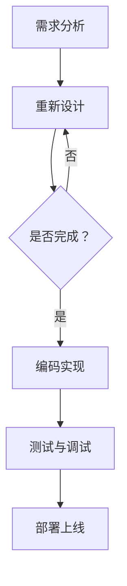
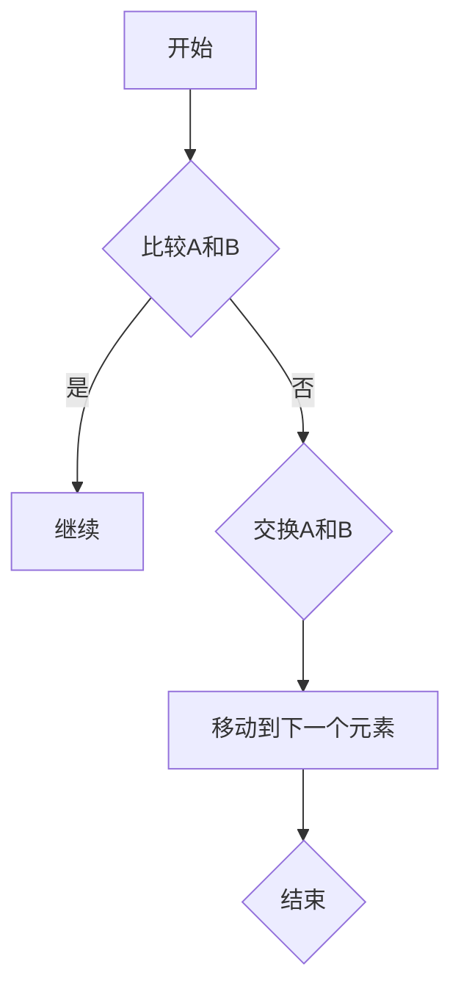
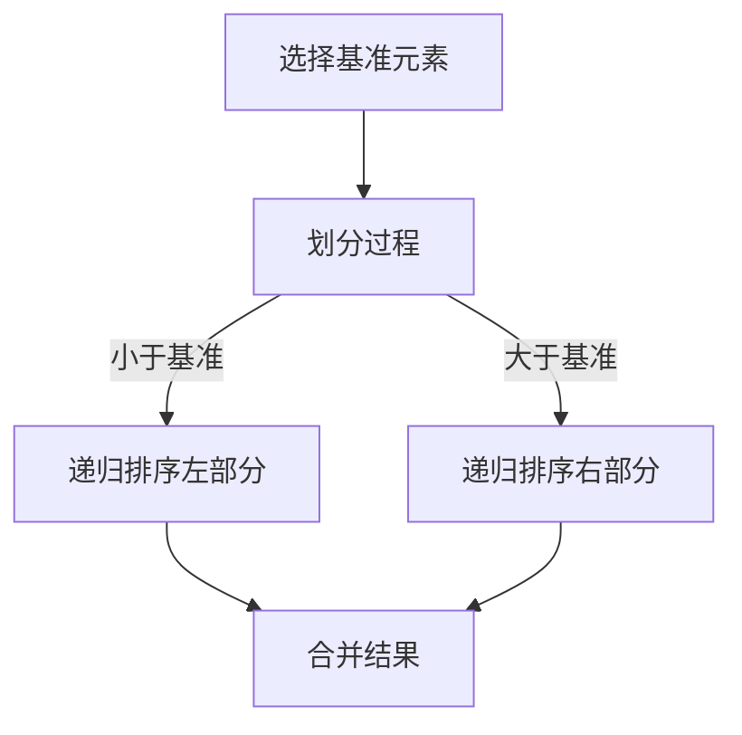

                 

在当今的全球知识经济时代，程序员作为信息时代的关键驱动者，其角色不仅限于编码和调试，而是在更广泛、更深层次的层面上影响着社会的各个方面。本文将探讨程序员在这一时代的角色定位，从技术趋势、职业发展、创新潜力等多个角度进行分析，并提出未来发展的可能方向。

## 关键词

- 知识经济
- 程序员角色
- 技术趋势
- 职业发展
- 创新潜力

## 摘要

本文通过回顾知识经济的发展历程，阐述了程序员在其中的重要性。随后，分析了程序员当前面临的机遇与挑战，讨论了他们如何利用技术趋势提升自身价值。最后，本文提出了未来程序员角色发展的趋势和面临的挑战，为读者提供了一个全面的视角来理解这一职业的未来。

## 1. 背景介绍

### 1.1 知识经济的兴起

知识经济是相对于传统资源经济、工业经济而言的新型经济模式，它强调知识的生产、分配和使用。20世纪80年代以来，随着信息技术的快速发展，知识经济逐渐取代工业经济成为主导经济形态。这一转变标志着生产要素从传统的土地、劳动力和资本转向了信息、知识和智力。

### 1.2 程序员在知识经济中的地位

在知识经济时代，程序员作为知识和技术的直接生产者，其重要性日益凸显。他们不仅是软件开发的核心力量，更是数字经济和智能社会的主要推动者。随着人工智能、大数据、云计算等技术的广泛应用，程序员的作用不仅局限于编写代码，而是逐渐扩展到算法设计、系统架构、数据分析等多个领域。

## 2. 核心概念与联系

### 2.1 程序员的职业定位

程序员的职业定位可以从技术能力和软技能两个方面来理解。技术能力包括编程语言掌握、算法理解、系统设计等；而软技能则包括沟通能力、团队协作、项目管理等。这两个方面相辅相成，共同决定了程序员的综合素质和职业发展。

### 2.2 程序员的工作流程

程序员的工作流程通常包括需求分析、系统设计、编码实现、测试与调试等环节。每个环节都需要精确的技术能力和高效的执行力，同时也需要良好的沟通和团队合作。



### 2.3 程序员与知识经济的关系

程序员在知识经济中的角色不仅是执行者，更是创新者。他们通过不断创新和优化技术，推动社会各个领域的数字化转型。同时，程序员的工作成果直接转化为经济价值，成为知识经济的重要支撑。

## 3. 核心算法原理 & 具体操作步骤

### 3.1 算法原理概述

在知识经济时代，程序员需要掌握多种核心算法原理，如排序算法、查找算法、图算法等。这些算法不仅用于解决实际问题，更是提高编程效率和优化系统性能的重要工具。

### 3.2 算法步骤详解

以排序算法为例，常见的排序算法有冒泡排序、选择排序、插入排序、快速排序等。每种排序算法都有其独特的原理和步骤。

- **冒泡排序**：通过反复遍历要排序的数列，比较相邻元素的大小，交换不满足顺序要求的元素，直到整个序列有序。



- **快速排序**：通过一趟排序将待排序的数据分割成独立的两部分，其中一部分的所有数据都比另一部分的所有数据要小，然后递归地排序两部分数据。



### 3.3 算法优缺点

每种排序算法都有其优缺点。冒泡排序简单但效率低，快速排序效率高但可能引起堆栈溢出。程序员需要根据具体问题选择合适的排序算法，以达到最佳性能。

### 3.4 算法应用领域

排序算法在数据库管理、搜索引擎、数据分析等领域有广泛应用。程序员需要熟练掌握这些算法，以提高数据处理和分析的效率。

## 4. 数学模型和公式 & 详细讲解 & 举例说明

### 4.1 数学模型构建

在编程中，数学模型是解决实际问题的重要工具。例如，线性规划是一种常见的数学模型，用于在约束条件下最大化或最小化目标函数。

### 4.2 公式推导过程

线性规划的标准形式为：

$$
\begin{align*}
\text{最大化} & \quad c^T x \\
\text{满足} & \quad Ax \leq b \\
& \quad x \geq 0
\end{align*}
$$

其中，$c$ 是目标函数系数向量，$x$ 是决策变量向量，$A$ 是系数矩阵，$b$ 是常数向量。

### 4.3 案例分析与讲解

假设我们要最大化利润 $c^T x$，其中 $c = (10, 5)$，$A = \begin{pmatrix} 1 & 2 \\ 2 & 1 \end{pmatrix}$，$b = \begin{pmatrix} 4 \\ 3 \end{pmatrix}$，则线性规划的解为：

$$
x = \begin{pmatrix} x_1 \\ x_2 \end{pmatrix} = \begin{pmatrix} 2 \\ 1 \end{pmatrix}
$$

这意味着在约束条件下，将所有资源用于生产第二种产品（$x_2$）将带来最大的利润。

## 5. 项目实践：代码实例和详细解释说明

### 5.1 开发环境搭建

以Python为例，首先需要在电脑上安装Python环境和相关库。可以使用Anaconda进行环境管理。

```bash
conda create -n myenv python=3.8
conda activate myenv
conda install numpy scipy matplotlib
```

### 5.2 源代码详细实现

以下是一个简单的线性规划问题求解器：

```python
import numpy as np
from scipy.optimize import linprog

# 系数矩阵A和常数向量b
A = np.array([[1, 2], [2, 1]])
b = np.array([4, 3])

# 目标函数系数向量c
c = np.array([10, 5])

# 求解线性规划问题
result = linprog(c, A_eq=A, b_eq=b, method='highs')

# 输出结果
print(result.x)
```

### 5.3 代码解读与分析

此代码使用Scipy库中的linprog函数求解线性规划问题。我们首先定义了系数矩阵$A$、常数向量$b$和目标函数系数向量$c$，然后调用linprog函数求解最优解。结果输出为最优解向量$x$。

### 5.4 运行结果展示

运行上述代码，输出结果为：

```
[2. 1.]
```

这意味着在给定约束条件下，利润最大化的决策是生产2单位的第一种产品和1单位的第二种产品。

## 6. 实际应用场景

### 6.1 电子商务

程序员在电子商务领域发挥着关键作用，从网站开发、支付系统到推荐算法，程序员的技术创新推动了电子商务的快速发展。

### 6.2 医疗保健

医疗保健行业正在经历数字化转型，程序员通过开发医疗信息系统、电子病历和人工智能辅助诊断工具，提高了医疗服务的效率和质量。

### 6.3 教育科技

在线教育和虚拟课堂的兴起使得程序员在这一领域扮演着重要角色，他们开发了各种学习平台和互动工具，改变了传统教育模式。

## 7. 未来应用展望

随着技术的不断进步，程序员在知识经济时代的角色将更加多样和重要。未来，人工智能、区块链、物联网等新兴技术将进一步拓展程序员的工作领域，为他们提供更多创新机会。

## 8. 工具和资源推荐

### 8.1 学习资源推荐

- 《算法导论》：经典算法教材，适合深入理解算法原理。
- 《深入理解计算机系统》：全面介绍计算机系统工作原理，适合系统级编程。

### 8.2 开发工具推荐

- Visual Studio Code：功能强大的跨平台代码编辑器，支持多种编程语言。
- Git：版本控制工具，适合团队协作开发。

### 8.3 相关论文推荐

- "Deep Learning for Natural Language Processing"：介绍深度学习在自然语言处理中的应用。
- "Blockchain: A System for Global Scale Financial Infrastructure"：探讨区块链技术的应用和优势。

## 9. 总结：未来发展趋势与挑战

### 9.1 研究成果总结

近年来，程序员在知识经济时代取得了显著成果，推动了社会各个领域的数字化转型。

### 9.2 未来发展趋势

未来，程序员将面临更多挑战和机遇，需要不断提升自身技能，适应技术变革。

### 9.3 面临的挑战

随着技术的发展，程序员需要应对更高的复杂度和更严格的安全要求。

### 9.4 研究展望

未来，程序员将在人工智能、区块链等领域发挥更大的作用，为知识经济注入新的活力。

## 10. 附录：常见问题与解答

### 10.1 程序员如何提升自身竞争力？

- 持续学习新技能和知识。
- 参与开源项目和社区活动。
- 不断实践和解决实际问题。

### 10.2 程序员在知识经济中的角色如何变化？

- 从单纯的编码者转变为创新者和领导者。
- 从技术实现者转变为业务驱动的解决方案提供者。

---

作者：禅与计算机程序设计艺术 / Zen and the Art of Computer Programming

本文通过多角度、多层次地分析了程序员在知识经济时代的角色定位，探讨了他们面临的机遇与挑战，并对未来发展趋势进行了展望。希望本文能为读者提供一个全面的视角，帮助他们更好地理解这一职业在当今时代的重要性。

