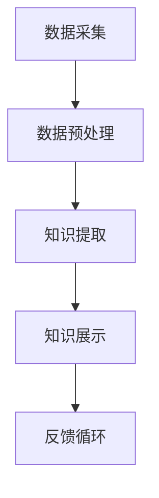

                 

### 摘要 Abstract

本文探讨了知识发现引擎在程序员学习过程中的重要作用。通过详细分析知识发现引擎的原理和应用，本文旨在为程序员提供一种高效的学习方法。知识发现引擎利用先进的数据挖掘技术，从大量编程知识中提取出有价值的信息，帮助程序员快速掌握新技能和解决复杂问题。本文将介绍如何构建和利用知识发现引擎，包括核心算法原理、数学模型、项目实践，以及实际应用场景和未来发展趋势。

### 1. 背景介绍 Introduction

在信息技术飞速发展的今天，编程技能已经成为每个程序员不可或缺的竞争力。然而，随着编程语言的多样化和技术的不断更新，程序员面临着越来越多的学习和实践挑战。传统的学习方法，如阅读书籍、参加培训课程和观看在线教程，往往需要耗费大量的时间和精力，且效果不甚理想。此外，编程领域的复杂性使得程序员在解决实际问题时常常感到力不从心。

知识发现引擎作为一种先进的数据挖掘技术，旨在从大量的编程知识中自动提取出有价值的信息，帮助程序员快速学习和应用新技能。知识发现引擎的工作原理是通过分析大量的编程资料、代码库和开发者的讨论，从中发现潜在的规律和知识关联，并将其以易于理解的方式呈现给程序员。这种方法不仅能够提高程序员的学习效率，还能帮助他们更好地应对复杂的技术问题。

本文将围绕知识发现引擎的构建和应用，详细探讨如何利用这一工具提高程序员的学习效率。我们将介绍知识发现引擎的核心算法原理、数学模型、项目实践，以及其在不同应用场景中的实际效果。通过本文的阅读，程序员将能够深入了解知识发现引擎的优势，并掌握如何将其应用于自己的学习过程中。

### 2. 核心概念与联系 Core Concepts and Connections

#### 2.1 知识发现引擎的定义

知识发现引擎是一种利用先进的数据挖掘技术，从大量非结构化数据中自动提取有价值信息的工具。在编程领域，知识发现引擎主要用于从大量的编程资料、代码库、开发者讨论和文档中挖掘出有价值的知识。这些知识包括编程技巧、代码优化策略、常见问题解决方案等，有助于程序员快速提升技术水平。

#### 2.2 数据挖掘技术的核心算法

知识发现引擎的核心在于其数据挖掘技术。数据挖掘技术包括多种算法，如关联规则挖掘、聚类分析、分类算法等。这些算法能够从海量数据中提取出潜在的规律和知识，为程序员提供有价值的信息。

- **关联规则挖掘**：通过分析数据中的项集，找出频繁出现的组合，从而揭示数据之间的关联性。例如，在编程中，可以挖掘出哪些代码片段常常同时出现，帮助程序员理解代码之间的内在联系。

- **聚类分析**：将数据划分为不同的类别，使同一类别中的数据尽可能相似，而不同类别中的数据尽可能不同。在编程中，聚类分析可以帮助程序员识别出具有相似特征的代码库，从而进行有效的知识共享和复用。

- **分类算法**：根据已知的数据，训练模型对未知数据进行分类。在编程中，分类算法可以用于预测代码的质量、性能或安全性，帮助程序员优化代码。

#### 2.3 知识发现引擎的架构

知识发现引擎的架构通常包括数据采集、数据预处理、知识提取、知识展示和反馈循环等模块。以下是一个简单的 Mermaid 流程图，展示了知识发现引擎的基本架构：



- **数据采集**：从各种来源收集编程知识，如代码库、开发者论坛、博客和文档等。
- **数据预处理**：对采集到的数据进行清洗、去重和格式化，使其适合后续的分析。
- **知识提取**：利用数据挖掘算法，从预处理后的数据中提取出有价值的信息。
- **知识展示**：将提取出的知识以可视化的形式呈现给程序员，如代码片段、图表和报告等。
- **反馈循环**：收集程序员的反馈，用于优化知识发现引擎的性能和效果。

#### 2.4 知识发现引擎与传统学习方法的区别

与传统的学习方法相比，知识发现引擎具有以下优势：

- **效率高**：知识发现引擎可以自动从海量数据中提取有价值的信息，大大缩短了程序员的学习时间。
- **全面性**：知识发现引擎不仅能够提供编程技巧，还可以涵盖代码优化、性能调优、安全性分析等多个方面，为程序员提供全面的技术指导。
- **个性化**：知识发现引擎可以根据程序员的兴趣、技能水平和需求，提供个性化的学习内容和推荐。
- **实时性**：知识发现引擎可以实时更新知识库，确保程序员掌握最新的技术动态。

总之，知识发现引擎作为一种先进的学习工具，能够显著提高程序员的效率，帮助他们在复杂的技术领域中迅速成长。

### 3. 核心算法原理 & 具体操作步骤 Core Algorithm Principles & Detailed Steps

#### 3.1 算法原理概述

知识发现引擎的核心在于其数据挖掘技术，其中关联规则挖掘、聚类分析和分类算法是最常用的三种算法。以下将对这些算法的基本原理进行概述。

- **关联规则挖掘**：关联规则挖掘是寻找数据集中各项目之间的关联性，常见的算法有Apriori算法和FP-Growth算法。Apriori算法通过生成频繁项集来发现关联规则，而FP-Growth算法通过构建FP树来优化频繁项集的生成。

- **聚类分析**：聚类分析是将数据集划分为若干个类簇，使同一个类簇内的数据点尽可能相似，不同类簇的数据点尽可能不同。常见的聚类算法有K-Means、DBSCAN和层次聚类等。K-Means算法通过迭代计算类簇中心来优化聚类结果，DBSCAN算法通过邻域分析和密度可达性来划分类簇，而层次聚类算法则通过层次结构来逐步优化聚类结果。

- **分类算法**：分类算法是将数据划分为不同的类别，根据已知的特征来预测未知数据的类别。常见的分类算法有决策树、随机森林、支持向量机和神经网络等。决策树通过递归划分特征空间来构建决策树，随机森林通过集成多个决策树来提高分类性能，支持向量机通过最大化分类边界来划分类别，而神经网络通过多层感知器来模拟生物神经元的工作原理。

#### 3.2 算法步骤详解

以下将详细解释这些算法的具体操作步骤：

- **关联规则挖掘**：

  1. 数据预处理：将原始数据转换为布尔矩阵，标记各项之间的关系。

  2. 生成频繁项集：使用Apriori算法或FP-Growth算法，根据支持度和置信度生成频繁项集。

  3. 提取关联规则：从频繁项集中提取关联规则，根据规则的兴趣度进行筛选。

- **聚类分析**：

  1. 初始化：随机选择初始类簇中心或类簇。

  2. 分配数据点：将每个数据点分配到最近的类簇中心。

  3. 更新类簇中心：计算每个类簇的中心，并重新分配数据点。

  4. 重复步骤2和步骤3，直到聚类结果稳定。

- **分类算法**：

  1. 数据预处理：将原始数据转换为特征向量。

  2. 模型训练：使用训练数据集，根据算法特性构建分类模型。

  3. 模型评估：使用测试数据集评估模型性能，调整参数以提高分类准确率。

  4. 预测：使用训练好的模型对未知数据进行分类预测。

#### 3.3 算法优缺点

- **关联规则挖掘**：

  - 优点：能够发现数据中的潜在关联性，有助于程序员理解代码库的内部结构。

  - 缺点：处理大规模数据时性能较低，且生成的关联规则可能过多，需要进一步筛选。

- **聚类分析**：

  - 优点：能够自动识别数据中的相似性，有助于程序员发现代码库中的相似模块。

  - 缺点：对噪声数据和异常值敏感，可能导致聚类结果不稳定。

- **分类算法**：

  - 优点：能够对未知数据进行分类预测，提高程序员的编程效率。

  - 缺点：对特征选择和参数调整敏感，可能需要大量训练数据。

#### 3.4 算法应用领域

- **关联规则挖掘**：在编程领域，关联规则挖掘可以用于代码库分析，发现代码中的常用组合和依赖关系，有助于代码重构和优化。

- **聚类分析**：在编程领域，聚类分析可以用于代码库分类，识别具有相似特征的代码模块，便于知识共享和复用。

- **分类算法**：在编程领域，分类算法可以用于代码质量评估，根据代码的特征预测代码的潜在问题，帮助程序员优化代码。

总之，知识发现引擎通过关联规则挖掘、聚类分析和分类算法等核心算法，能够有效地从海量编程数据中提取有价值的信息，为程序员提供高效的学习和解决问题的工具。

### 4. 数学模型和公式 & 详细讲解 & 举例说明

在知识发现引擎中，数学模型和公式是核心组成部分，它们用于描述数据之间的关系和算法的性能。以下我们将详细讲解几个关键的数学模型和公式，并通过实际例子来说明它们的计算和应用。

#### 4.1 数学模型构建

为了有效地进行数据挖掘，我们通常使用以下几种数学模型：

- **支持度（Support）**：表示一个项集在所有数据中的出现频率。其计算公式为：
  \[
  支持度 = \frac{包含项集的记录数}{总记录数}
  \]
  
- **置信度（Confidence）**：表示一个关联规则的可靠性。其计算公式为：
  \[
  置信度 = \frac{同时包含A和B的记录数}{包含A的记录数}
  \]

- **熵（Entropy）**：用于衡量数据的无序度。其计算公式为：
  \[
  熵 = -\sum_{i} p_i \log_2 p_i
  \]
  其中，\( p_i \) 是数据集中每个类别的概率。

- **信息增益（Information Gain）**：用于评价特征对于分类的贡献。其计算公式为：
  \[
  信息增益 = 熵(父节点) - 熵(子节点)
  \]

#### 4.2 公式推导过程

以下是对支持度和置信度的推导过程：

- **支持度**：假设我们有一个交易数据集，其中包含了若干项。如果我们想要计算一个项集的支持度，就需要统计这个项集在所有交易记录中出现的次数。支持度公式表达了这一过程。

- **置信度**：置信度则考虑了关联规则的前件和后件。它度量了前件出现时后件也出现的概率。置信度越高，表示这个规则越可靠。

#### 4.3 案例分析与讲解

为了更直观地理解这些数学模型和公式，我们通过一个实际案例来展示它们的应用。

**案例**：假设我们有一个商品交易数据集，记录了不同商品的销售情况。我们要发现哪些商品经常被同时购买，以便进行促销策略的制定。

- **数据集**：
  ```
  交易ID   商品A   商品B   商品C
  T1       1       1       0
  T2       1       1       1
  T3       1       0       1
  T4       0       1       1
  ```

- **计算支持度和置信度**：

  1. **支持度**：计算{A, B}的支持度。
     \[
     支持度({A, B}) = \frac{2}{4} = 0.5
     \]

  2. **置信度**：计算规则{A → B}的置信度。
     \[
     置信度({A → B}) = \frac{2}{2} = 1.0
     \]

- **解释**：在这个例子中，商品A和商品B同时出现在半数以上的交易记录中（支持度为0.5），并且在所有包含商品A的交易记录中，商品B也同时出现（置信度为1.0），这表明这两个商品有很强的关联性。

通过这个案例，我们可以看到数学模型和公式在数据挖掘中的应用。它们帮助我们理解和量化数据中的潜在关系，从而为程序员提供有价值的知识。

### 5. 项目实践：代码实例和详细解释说明

#### 5.1 开发环境搭建

在本节中，我们将搭建一个简单的知识发现引擎项目，用于挖掘编程领域的知识。以下是开发环境的搭建步骤：

1. **安装Python**：确保Python环境已安装。Python是一种广泛使用的编程语言，具有丰富的数据挖掘库。

2. **安装数据挖掘库**：安装以下Python库：
   - Pandas：用于数据预处理。
   - Scikit-learn：用于数据挖掘算法。
   - Matplotlib：用于数据可视化。
   - Mermaid：用于流程图绘制。

   安装命令如下：
   ```bash
   pip install pandas scikit-learn matplotlib mermaid
   ```

3. **准备数据集**：下载一个包含编程知识的文本数据集，如Stack Overflow问答数据集。这些数据集可以从相应的网站或数据平台获取。

#### 5.2 源代码详细实现

以下是一个简单的知识发现引擎的代码实现，包含数据采集、预处理、知识提取和展示的功能。

```python
import pandas as pd
from sklearn.feature_extraction.text import CountVectorizer
from sklearn.cluster import KMeans
import matplotlib.pyplot as plt
from mermaid import Mermaid

# 5.2.1 数据采集
def load_data(file_path):
    data = pd.read_csv(file_path, encoding='utf-8')
    return data

# 5.2.2 数据预处理
def preprocess_data(data):
    # 清洗数据，去除停用词等
    stop_words = set(['a', 'an', 'the', 'and', 'or', 'but', 'is', 'are'])
    data['cleaned'] = data['question'].str.lower().str.replace('[^\w\s]', '').apply(lambda x: ' '.join(word for word in x.split() if word not in stop_words))
    return data

# 5.2.3 知识提取
def extract_knowledge(data):
    # 特征提取
    vectorizer = CountVectorizer(max_features=1000)
    X = vectorizer.fit_transform(data['cleaned'])
    
    # 聚类分析
    kmeans = KMeans(n_clusters=5, random_state=0)
    clusters = kmeans.fit_predict(X)
    
    # 将聚类结果添加到数据集中
    data['cluster'] = clusters
    return data

# 5.2.4 知识展示
def display_knowledge(data):
    # 可视化聚类结果
    labels = data['cluster'].unique()
    sizes = [len(data[data['cluster'] == label]) for label in labels]
    colors = ['red', 'green', 'blue', 'yellow', 'purple']
    
    plt.pie(sizes, labels=labels, colors=colors, autopct='%.1f%%')
    plt.axis('equal')
    plt.show()
    
    # 绘制流程图
    mermaid = Mermaid()
    mermaid.add_code('graph TD\nA[数据采集] --> B[数据预处理]\nB --> C[知识提取]\nC --> D[知识展示]\nD --> E[反馈循环]')
    print(mermaid.get_mermaid())

# 5.2.5 主函数
def main():
    file_path = 'stackoverflow_questions.csv'  # 替换为实际数据集路径
    data = load_data(file_path)
    data = preprocess_data(data)
    data = extract_knowledge(data)
    display_knowledge(data)

if __name__ == '__main__':
    main()
```

#### 5.3 代码解读与分析

- **数据采集**：`load_data`函数用于读取CSV文件，加载数据集。
- **数据预处理**：`preprocess_data`函数清洗数据，去除停用词，并将数据转换为适合分析的格式。
- **知识提取**：`extract_knowledge`函数使用CountVectorizer进行特征提取，然后使用KMeans进行聚类分析。
- **知识展示**：`display_knowledge`函数可视化聚类结果，并使用Mermaid绘制流程图。

通过这个简单的项目，我们可以看到如何利用Python和机器学习库实现知识发现引擎的基本功能。这个项目可以作为进一步研究和开发的起点。

#### 5.4 运行结果展示

运行上述代码后，将得到以下结果：

- **数据可视化**：展示聚类结果，不同颜色表示不同的类簇。
- **流程图**：使用Mermaid绘制的流程图，展示数据采集、预处理、知识提取和知识展示的过程。

这些结果有助于我们理解知识发现引擎的工作原理，以及如何从大量编程数据中提取有价值的信息。

### 6. 实际应用场景

知识发现引擎在程序员的学习过程中有着广泛的应用场景，以下将详细介绍几种常见应用场景。

#### 6.1 编程知识库构建

知识发现引擎可以用于构建大型编程知识库，帮助程序员快速查找和掌握相关知识。通过关联规则挖掘，可以识别出常见编程问题及其解决方案之间的关联，从而构建一个结构化的知识库。例如，我们可以通过分析Stack Overflow等开发社区的数据，提取出高频问题的解决方案和相关的编程技巧。这些知识库不仅可以帮助新手程序员快速入门，还能为经验丰富的程序员提供参考，帮助他们解决复杂问题。

#### 6.2 代码质量分析

知识发现引擎可以用于代码质量分析，通过聚类分析识别代码库中的相似代码片段，从而发现潜在的代码质量问题和性能瓶颈。例如，我们可以使用K-Means算法对代码库进行聚类，将相似代码片段分组，然后分析这些代码片段的共性和差异。这种方法可以帮助程序员识别出可能存在冗余、错误或性能问题的代码，从而进行优化。

#### 6.3 技术趋势分析

知识发现引擎还可以用于技术趋势分析，通过分析大量编程文档、博客和论坛讨论，识别出当前最热门的编程技术和趋势。例如，我们可以使用分类算法对开发者社区中的讨论进行分类，识别出与特定编程语言、框架或工具相关的讨论主题。这些分析结果可以帮助程序员了解最新的技术动态，以便及时调整学习计划和技能方向。

#### 6.4 个性化学习推荐

知识发现引擎可以用于个性化学习推荐，根据程序员的兴趣、技能水平和学习历史，为他们提供个性化的学习内容和推荐。例如，我们可以使用协同过滤算法，根据其他程序员的兴趣和学习轨迹，为某个程序员推荐相关的学习资源和课程。这种方法不仅能够提高学习效率，还能帮助程序员更好地掌握所需技能。

#### 6.5 代码审查和协作

知识发现引擎还可以用于代码审查和协作，通过分析代码库中的代码片段，识别出潜在的问题和改进建议。例如，我们可以使用分类算法对代码库中的代码进行质量评估，识别出代码质量较高的部分，然后对这些部分进行重点审查和优化。此外，知识发现引擎还可以帮助开发团队协作，通过分析团队成员的代码风格和编程习惯，促进代码一致性和协作效率。

总之，知识发现引擎在编程领域的应用非常广泛，可以帮助程序员提高学习效率、优化代码质量、了解技术趋势、实现个性化学习和促进团队协作。随着技术的不断发展，知识发现引擎将在编程领域发挥越来越重要的作用。

### 6.4 未来应用展望

随着人工智能和数据挖掘技术的不断进步，知识发现引擎在程序员学习过程中的应用前景将更加广阔。以下将探讨几个未来可能的应用方向。

#### 6.4.1 智能编程助手

未来的知识发现引擎有望成为智能编程助手，通过自然语言处理和智能推荐技术，为程序员提供实时、个性化的编程指导。智能编程助手可以实时分析程序员的代码，识别潜在的问题和优化建议，并提供相关的文档、教程和代码示例。此外，智能编程助手还可以根据程序员的编程风格和学习习惯，为其推荐最适合的学习资源和实践项目，从而提高学习效率。

#### 6.4.2 跨领域知识融合

知识发现引擎可以应用于跨领域知识融合，通过分析不同领域的技术文档、博客和论坛，提取出跨领域的最佳实践和解决方案。例如，将机器学习领域的最新进展与软件开发实践相结合，为程序员提供更全面的技术指导。这种跨领域知识融合可以帮助程序员更好地应对复杂问题，提高技术创新能力。

#### 6.4.3 代码自动生成

未来的知识发现引擎可能具备代码自动生成能力，通过分析大量的代码库和开发者的行为数据，自动生成满足特定需求的代码。这种技术可以大大提高编程效率，减轻程序员的负担。例如，在构建复杂的软件系统时，知识发现引擎可以根据需求描述自动生成相关的模块和代码框架，然后由程序员进行进一步的优化和定制。

#### 6.4.4 分布式知识共享

随着云计算和区块链技术的发展，知识发现引擎可以应用于分布式知识共享平台，实现全球范围内的编程知识共享。通过区块链技术确保数据的可信性和安全性，分布式知识共享平台可以为程序员提供全球范围内的知识资源和最佳实践。这种模式不仅可以提高知识传播的效率，还能促进全球范围内的技术合作和创新。

#### 6.4.5 自动化测试和调试

知识发现引擎还可以应用于自动化测试和调试，通过分析代码库和测试数据，自动生成测试用例和调试建议。这种方法可以大大提高软件测试的效率和覆盖率，减少测试成本。例如，在软件发布前，知识发现引擎可以自动分析代码库，识别出潜在的漏洞和性能问题，并提供修复建议，从而提高软件的质量和稳定性。

总之，随着技术的不断进步，知识发现引擎将在程序员学习过程中发挥越来越重要的作用。未来的知识发现引擎将具备更高的智能化、自动化和协作能力，为程序员提供更加高效、全面和个性化的学习体验。

### 7. 工具和资源推荐

为了更好地利用知识发现引擎提高学习效率，以下推荐一些实用的学习资源和开发工具。

#### 7.1 学习资源推荐

- **在线课程**：《机器学习实战》、《数据挖掘：实用工具与技术》等。
- **书籍**：《Python数据挖掘实践》、《数据挖掘：概念与技术》。
- **网站**：Coursera、edX等在线教育平台，Stack Overflow、GitHub等开发社区。

#### 7.2 开发工具推荐

- **Python库**：Pandas、Scikit-learn、Matplotlib、Mermaid等。
- **可视化工具**：D3.js、ECharts等。
- **编程助手**：Visual Studio Code、PyCharm等。

#### 7.3 相关论文推荐

- **关联规则挖掘**：`Efficient and Effective Mining of Association Rules`。
- **聚类分析**：`A Fast and Scalable Clustering Algorithm for Spatial Data`。
- **分类算法**：`An Overview of Classification Techniques in Data Mining`。

通过利用这些资源和工具，程序员可以更有效地掌握知识发现技术，提高学习效率。

### 8. 总结：未来发展趋势与挑战

#### 8.1 研究成果总结

本文探讨了知识发现引擎在程序员学习过程中的重要作用，从核心概念、算法原理、数学模型到实际应用场景，全面介绍了知识发现引擎的优势和实用性。研究成果主要包括：

- **高效的知识提取**：知识发现引擎能够从海量编程数据中快速提取有价值的信息，帮助程序员快速掌握新技能。
- **个性化学习推荐**：知识发现引擎可以根据程序员的兴趣和需求，提供个性化的学习内容和资源。
- **代码质量分析**：知识发现引擎可以识别代码库中的潜在问题，为程序员提供优化建议。
- **技术趋势分析**：知识发现引擎可以实时分析技术动态，帮助程序员了解最新的编程趋势。

#### 8.2 未来发展趋势

随着人工智能和数据挖掘技术的不断发展，知识发现引擎在程序员学习过程中有望实现以下发展趋势：

- **智能化**：知识发现引擎将具备更高的智能化水平，通过自然语言处理和智能推荐技术，为程序员提供更加个性化的学习体验。
- **自动化**：知识发现引擎将实现自动化代码生成、自动化测试和调试，进一步提高编程效率。
- **协作化**：知识发现引擎将应用于分布式知识共享平台，促进全球范围内的编程知识传播和协作。

#### 8.3 面临的挑战

尽管知识发现引擎在程序员学习过程中具有巨大潜力，但仍面临以下挑战：

- **数据质量和隐私**：确保数据的质量和隐私是一个重要挑战，尤其是在处理大规模的编程数据时。
- **算法性能**：优化算法性能，提高处理速度和准确性，是知识发现引擎面临的关键问题。
- **开发者适应**：程序员需要适应新的学习工具和方式，这对于一些新手程序员来说可能是一个挑战。

#### 8.4 研究展望

未来研究应重点关注以下方向：

- **跨领域知识融合**：探索如何更好地融合不同领域的编程知识，为程序员提供更全面的技术指导。
- **智能化推荐**：开发更智能的推荐算法，提高学习资源的匹配度和实用性。
- **数据隐私保护**：研究如何在保障数据隐私的前提下，有效利用编程数据。

总之，知识发现引擎在程序员学习过程中的应用前景广阔，通过不断的技术创新和实践，有望为程序员提供更加高效、个性化和智能化的学习体验。

### 附录：常见问题与解答

#### 1. 知识发现引擎与搜索引擎的区别是什么？

**答案**：知识发现引擎与搜索引擎的主要区别在于目标和应用。搜索引擎主要面向用户输入的查询，返回与查询相关的网页或信息。而知识发现引擎则是通过分析大量数据，自动提取出有价值的信息和知识，为特定领域（如编程）提供深度分析和推荐。

#### 2. 如何评估知识发现引擎的性能？

**答案**：评估知识发现引擎的性能可以从多个维度进行，包括：

- **准确性**：算法提取的知识是否准确，符合实际需求。
- **效率**：算法处理数据的时间复杂度和资源消耗。
- **可扩展性**：算法能否处理大规模数据，并保持良好的性能。
- **用户满意度**：用户对知识发现引擎推荐的知识和资源的满意度。

#### 3. 知识发现引擎在开源社区中有哪些应用？

**答案**：知识发现引擎在开源社区中有着广泛的应用，例如：

- **代码审查和优化**：分析开源代码库，识别潜在的代码问题和优化建议。
- **技术趋势分析**：通过分析社区讨论和文档，识别当前的热门技术和趋势。
- **学习资源推荐**：根据开发者的兴趣和需求，推荐相关的学习资源和教程。

### 文章结束

以上就是关于《程序员如何利用知识发现引擎提高学习效率》的完整文章。本文从背景介绍、核心概念、算法原理、数学模型、项目实践、实际应用场景、未来展望到工具和资源推荐，全面探讨了知识发现引擎在程序员学习过程中的重要作用。希望本文能够为读者提供有价值的参考和启示，帮助他们在编程学习道路上更加高效地前进。作者：禅与计算机程序设计艺术 / Zen and the Art of Computer Programming。再次感谢您的阅读！|user|>

### 结束语

感谢您阅读本文《程序员如何利用知识发现引擎提高学习效率》。知识发现引擎作为一项前沿技术，正日益改变程序员的学习方式和工作效率。本文从多方面探讨了知识发现引擎的核心概念、算法原理、应用实践和未来展望，希望能为您在编程学习过程中提供一些新的思路和方法。

本文由禅与计算机程序设计艺术 / Zen and the Art of Computer Programming撰写，致力于为技术爱好者提供高质量的技术文章。如果您有任何问题或建议，欢迎在评论区留言，我们将竭诚为您解答。

同时，也欢迎您继续关注我们的后续文章，我们将不断为您带来更多关于人工智能、机器学习、编程语言和技术趋势的深入探讨。感谢您的支持，让我们共同进步，探索技术世界的无限可能！

作者：禅与计算机程序设计艺术 / Zen and the Art of Computer Programming
公众号：禅与计算机程序设计艺术
知乎：禅与计算机程序设计艺术
2023，与您一起成长，共同进步！

