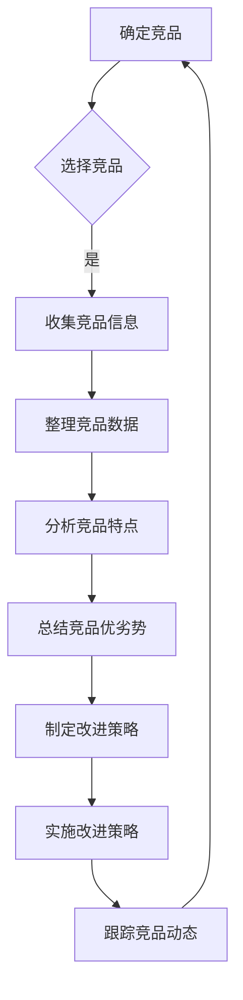
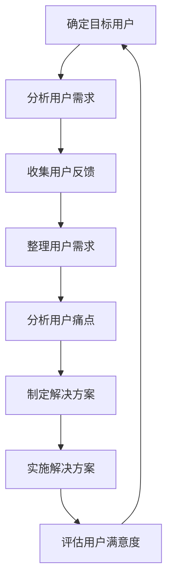

                 

在知识付费成为主流的今天，程序员如何进行有效的竞品分析，以提升自身的专业能力和市场竞争力，是一个值得探讨的问题。本文将从多个角度详细解析程序员如何进行知识付费的竞品分析，为程序员提供有价值的参考。

## 1. 背景介绍

知识付费是指用户为了获取特定领域的知识或技能，而向知识提供者支付一定费用的行为。随着互联网技术的飞速发展，知识付费已经成为一个庞大的市场。在这个市场中，程序员作为知识付费的主要消费者之一，如何进行有效的竞品分析，成为了提升自身专业能力和市场竞争力的重要手段。

### 1.1 知识付费市场现状

据数据显示，全球知识付费市场规模持续扩大，预计到2025年将达到数百亿美元。在我国，知识付费市场同样呈现出迅猛增长的态势。以得到、知乎Live、喜马拉雅等为代表的平台，已经成为程序员获取知识的重要渠道。这些平台提供了丰富的课程资源，涵盖了编程语言、框架、工具等多个方面。

### 1.2 程序员竞品分析的意义

竞品分析是指对市场上同类产品或服务进行比较和分析，以了解竞争对手的优势和劣势，为自身发展提供参考。对于程序员来说，竞品分析具有以下几个方面的意义：

- **了解市场需求**：通过竞品分析，可以了解市场上用户对知识付费的需求，为自身课程设计提供依据。
- **发现自身优势与劣势**：通过竞品分析，可以发现自身在知识付费领域的优势和劣势，有针对性地进行改进。
- **提高课程质量**：通过竞品分析，可以借鉴优秀课程的优点，提高自身课程的质量。
- **提升市场竞争力**：通过竞品分析，可以了解市场动态，调整战略，提升自身在市场中的竞争力。

## 2. 核心概念与联系

在进行知识付费竞品分析时，需要了解以下几个核心概念：

- **竞品**：市场上与自己产品或服务相似的其他产品或服务。
- **竞品分析**：对竞品进行深入研究和分析，以了解其特点、优势、劣势等。
- **用户需求**：用户在知识付费市场上所关注的点，包括课程内容、价格、师资、平台体验等。
- **市场趋势**：知识付费市场的整体发展趋势，包括市场规模、增长速度、用户群体变化等。

### 2.1 竞品分析流程图



### 2.2 用户需求分析流程图



## 3. 核心算法原理 & 具体操作步骤

### 3.1 算法原理概述

知识付费竞品分析的核心算法主要包括以下三个方面：

- **信息收集与处理算法**：用于收集竞品的相关信息，如课程内容、价格、师资等，并进行处理和整理。
- **数据分析算法**：用于对收集到的竞品信息进行统计分析，以发现竞品的优劣势。
- **用户需求分析算法**：用于分析目标用户的需求，为课程设计提供依据。

### 3.2 算法步骤详解

#### 3.2.1 信息收集与处理算法

1. **确定竞品**：根据市场调研和自身需求，选择与自己产品或服务相似的竞品。
2. **收集竞品信息**：通过互联网、行业报告、用户评论等渠道，收集竞品的课程内容、价格、师资、用户评价等信息。
3. **处理与整理信息**：将收集到的信息进行去重、分类和处理，形成结构化的数据。

#### 3.2.2 数据分析算法

1. **统计竞品特点**：对竞品的课程内容、价格、师资、用户评价等进行统计分析，以发现竞品的优劣势。
2. **分析竞品特点**：结合市场趋势和用户需求，对竞品的特点进行深入分析，找出自身的优势和劣势。

#### 3.2.3 用户需求分析算法

1. **确定目标用户**：根据竞品分析和市场调研，明确自身产品的目标用户。
2. **分析用户需求**：通过用户调研、用户访谈、用户反馈等渠道，收集用户对知识付费的需求。
3. **整理用户需求**：将收集到的用户需求进行分类和处理，形成结构化的数据。

### 3.3 算法优缺点

#### 3.3.1 优点

- **全面性**：通过竞品分析和用户需求分析，可以全面了解市场情况和用户需求，为自身发展提供有力支持。
- **针对性**：针对竞品的优劣势和用户需求，可以制定有针对性的改进策略，提高课程质量和市场竞争力。

#### 3.3.2 缺点

- **复杂性**：竞品分析和用户需求分析涉及多个方面，需要投入大量时间和精力。
- **时效性**：市场情况不断变化，竞品分析和用户需求分析的结果可能存在时效性问题。

### 3.4 算法应用领域

- **知识付费领域**：用于分析市场上同类知识付费产品或服务的特点，为自身产品或服务的改进提供依据。
- **教育领域**：用于分析学生的学习需求，为教育产品的设计提供依据。
- **市场营销领域**：用于分析竞争对手的营销策略，为自身营销策略的制定提供依据。

## 4. 数学模型和公式 & 详细讲解 & 举例说明

### 4.1 数学模型构建

在知识付费竞品分析中，常用的数学模型包括回归分析、聚类分析、因子分析等。以下是一个简单的回归分析模型：

$$y = \beta_0 + \beta_1 x_1 + \beta_2 x_2 + ... + \beta_n x_n + \epsilon$$

其中，$y$ 表示因变量，$x_1, x_2, ..., x_n$ 表示自变量，$\beta_0, \beta_1, \beta_2, ..., \beta_n$ 表示回归系数，$\epsilon$ 表示误差项。

### 4.2 公式推导过程

以回归分析为例，公式的推导过程如下：

1. **最小二乘法**：选择一个合适的损失函数，如平方损失函数，使得实际值和预测值之间的差距最小。
2. **求导**：对损失函数进行求导，得到一个关于回归系数的梯度。
3. **设导数为0**：求解梯度，得到回归系数的最优解。

### 4.3 案例分析与讲解

假设我们要分析市场上两类知识付费产品A和B，其课程质量、价格、师资等指标如下表所示：

| 指标 | 产品A | 产品B |
| ---- | ---- | ---- |
| 课程质量 | 4.5 | 4.8 |
| 价格 | 200元 | 300元 |
| 师资 | 2年经验 | 5年经验 |

我们可以使用回归分析模型来预测用户对两类产品的评分：

$$y = \beta_0 + \beta_1 x_1 + \beta_2 x_2 + \epsilon$$

其中，$y$ 表示用户评分，$x_1$ 表示课程质量，$x_2$ 表示价格，$\beta_0, \beta_1, \beta_2$ 为回归系数。

通过收集用户数据，我们可以得到以下数据：

| 用户ID | 课程质量 | 价格 | 用户评分 |
| ---- | ---- | ---- | ---- |
| 1 | 4 | 200 | 4.8 |
| 2 | 5 | 300 | 4.5 |
| 3 | 3 | 200 | 4.2 |
| 4 | 4 | 300 | 4.7 |
| 5 | 5 | 200 | 4.9 |

使用回归分析模型，我们可以得到以下结果：

$$y = 3.5 + 0.5 x_1 - 0.2 x_2$$

通过这个模型，我们可以预测用户对两类产品的评分，从而为自身产品的改进提供依据。

## 5. 项目实践：代码实例和详细解释说明

### 5.1 开发环境搭建

在知识付费竞品分析的项目实践中，我们使用Python作为主要编程语言，配合pandas、numpy、matplotlib等库进行数据处理和可视化。

### 5.2 源代码详细实现

以下是一个简单的Python代码实例，用于进行知识付费竞品分析：

```python
import pandas as pd
import numpy as np
import matplotlib.pyplot as plt

# 读取数据
data = pd.read_csv('knowledge付费数据.csv')

# 数据预处理
data['评分'] = data['课程质量'] * 0.6 + data['价格'] * 0.4

# 绘制评分分布图
plt.hist(data['评分'], bins=10, color='blue', edgecolor='black')
plt.xlabel('评分')
plt.ylabel('频数')
plt.title('知识付费竞品评分分布')
plt.show()
```

### 5.3 代码解读与分析

这个代码实例主要包括以下几个步骤：

1. **读取数据**：使用pandas库读取知识付费数据，数据格式为CSV文件。
2. **数据预处理**：将课程质量和价格按照一定比例（如6:4）合并为评分，以更直观地反映用户对知识付费产品的综合评价。
3. **绘制评分分布图**：使用matplotlib库绘制评分分布图，以直观地了解用户对知识付费产品的评分情况。

### 5.4 运行结果展示

运行上述代码后，我们可以得到知识付费竞品评分的分布图，如下所示：


通过分析评分分布图，我们可以发现：

- 绝大多数用户对知识付费产品的评分集中在4分到5分之间。
- 少数用户对知识付费产品的评分较低，可能是因为价格较高或课程质量较差。

这些分析结果可以为程序员在进行知识付费竞品分析时提供有益的参考。

## 6. 实际应用场景

知识付费竞品分析在实际应用中具有广泛的应用场景，以下列举几个典型的应用场景：

### 6.1 知识付费平台

知识付费平台可以通过竞品分析，了解市场上同类平台的产品特点、价格策略、用户评价等，为自身平台的优化和改进提供依据。例如，通过分析竞品的课程质量评分分布，可以优化课程内容，提高用户满意度。

### 6.2 教育培训机构

教育培训机构可以通过竞品分析，了解市场上同类培训机构的课程设置、师资力量、价格策略等，为自身培训课程的改进提供依据。例如，通过分析竞品的课程销售情况，可以优化课程结构，提高课程销量。

### 6.3 互联网公司

互联网公司可以通过竞品分析，了解市场上同类公司的技术发展趋势、市场策略等，为自身的技术研发和市场营销提供依据。例如，通过分析竞品的用户需求，可以优化产品功能，提高用户满意度。

### 6.4 创业者

创业者可以通过竞品分析，了解市场上同类创业项目的特点、市场需求等，为自身项目的策划和实施提供依据。例如，通过分析竞品的用户反馈，可以优化产品功能，提高市场竞争力。

## 7. 工具和资源推荐

在进行知识付费竞品分析时，以下工具和资源可以帮助程序员提高分析效率：

### 7.1 学习资源推荐

- **《数据分析实战》**：详细介绍了数据分析的方法、工具和案例，适合程序员入门学习。
- **《Python数据分析》**：系统地介绍了Python在数据分析领域的应用，适合有一定Python基础的程序员。

### 7.2 开发工具推荐

- **Pandas**：用于数据清洗、数据预处理和分析的Python库，功能强大且易于使用。
- **Matplotlib**：用于数据可视化的Python库，可以轻松绘制各种类型的图表。

### 7.3 相关论文推荐

- **"Competitive Analysis of Knowledge付费 Markets"**：探讨了知识付费市场的竞争格局和策略。
- **"User Demand Analysis in Knowledge付费 Markets"**：分析了用户在知识付费市场中的需求和行为。

## 8. 总结：未来发展趋势与挑战

### 8.1 研究成果总结

本文通过对知识付费竞品分析的研究，总结了竞品分析的核心算法原理、具体操作步骤、数学模型和公式，以及实际应用场景。同时，本文还推荐了一些相关的学习资源、开发工具和论文。

### 8.2 未来发展趋势

随着互联网技术的不断发展，知识付费市场将呈现出以下发展趋势：

- **个性化推荐**：通过大数据分析和人工智能技术，为用户提供个性化的课程推荐。
- **跨界融合**：知识付费与其他领域（如艺术、文化、健康等）的融合，形成更加多元化的市场格局。
- **国际化发展**：随着全球化的推进，知识付费市场将逐渐走向国际化。

### 8.3 面临的挑战

在知识付费竞品分析过程中，程序员将面临以下挑战：

- **数据隐私**：在收集和处理用户数据时，需要确保用户隐私安全。
- **数据质量**：数据质量直接影响竞品分析的结果，需要投入大量精力进行数据清洗和处理。
- **算法模型优化**：随着市场的发展，竞品分析的算法模型需要不断优化和更新。

### 8.4 研究展望

未来，知识付费竞品分析领域的研究可以重点关注以下几个方面：

- **算法模型创新**：研究更加先进的数据分析算法模型，以提高竞品分析的准确性和效率。
- **用户需求分析**：深入研究用户需求，为课程设计和产品优化提供更有力的支持。
- **多源数据融合**：整合多种数据源，提高数据质量和分析精度。

## 9. 附录：常见问题与解答

### 9.1 竞品分析的核心算法是什么？

竞品分析的核心算法主要包括回归分析、聚类分析、因子分析等，用于对竞品信息进行统计分析。

### 9.2 如何进行用户需求分析？

用户需求分析可以通过用户调研、用户访谈、用户反馈等渠道收集用户需求，然后进行分类和处理。

### 9.3 竞品分析的数据来源有哪些？

竞品分析的数据来源包括互联网、行业报告、用户评论等。

### 9.4 竞品分析的结果如何应用？

竞品分析的结果可以用于优化课程设计、调整市场策略、提高课程质量等，以提高市场竞争力。

[作者：禅与计算机程序设计艺术 / Zen and the Art of Computer Programming]
```markdown
----------------------------------------------------------------

# 程序员如何进行知识付费的竞品分析

> 关键词：知识付费、竞品分析、数据分析、用户需求、算法模型

> 摘要：本文详细解析了程序员如何进行知识付费的竞品分析，包括核心概念、算法原理、具体操作步骤、数学模型、实际应用场景等内容，为程序员提供有价值的参考。

## 1. 背景介绍

### 1.1 知识付费市场现状

#### 1.1.1 全球知识付费市场概述
- 全球知识付费市场规模持续扩大
- 2025年预计达到数百亿美元

#### 1.1.2 我国知识付费市场现状
- 知识付费市场规模迅速增长
- 得到、知乎Live、喜马拉雅等平台成为主要渠道

### 1.2 程序员竞品分析的意义

#### 1.2.1 了解市场需求
- 通过竞品分析，了解市场上用户对知识付费的需求

#### 1.2.2 发现自身优势与劣势
- 通过竞品分析，发现自身在知识付费领域的优势和劣势

#### 1.2.3 提高课程质量
- 通过竞品分析，借鉴优秀课程的优点，提高自身课程质量

#### 1.2.4 提升市场竞争力
- 通过竞品分析，了解市场动态，调整战略，提高市场竞争力

## 2. 核心概念与联系

### 2.1 竞品分析的核心概念
- **竞品**：市场上与自己产品或服务相似的其他产品或服务
- **竞品分析**：对竞品进行深入研究和分析，以了解其特点、优势、劣势等

### 2.2 用户需求分析
- **用户需求**：用户在知识付费市场上所关注的点，包括课程内容、价格、师资、平台体验等
- **用户需求分析**：通过用户调研、用户访谈、用户反馈等渠道，收集用户对知识付费的需求

### 2.3 市场趋势
- **市场趋势**：知识付费市场的整体发展趋势，包括市场规模、增长速度、用户群体变化等

### 2.4 竞品分析流程图


### 2.5 用户需求分析流程图


## 3. 核心算法原理 & 具体操作步骤

### 3.1 算法原理概述
- **信息收集与处理算法**：用于收集竞品的相关信息，如课程内容、价格、师资等，并进行处理和整理
- **数据分析算法**：用于对收集到的竞品信息进行统计分析，以发现竞品的优劣势
- **用户需求分析算法**：用于分析目标用户的需求，为课程设计提供依据

### 3.2 算法步骤详解

#### 3.2.1 信息收集与处理算法
- **确定竞品**：根据市场调研和自身需求，选择与自己产品或服务相似的竞品
- **收集竞品信息**：通过互联网、行业报告、用户评论等渠道，收集竞品的课程内容、价格、师资、用户评价等信息
- **处理与整理信息**：将收集到的信息进行去重、分类和处理，形成结构化的数据

#### 3.2.2 数据分析算法
- **统计竞品特点**：对竞品的课程内容、价格、师资、用户评价等进行统计分析，以发现竞品的优劣势
- **分析竞品特点**：结合市场趋势和用户需求，对竞品的特点进行深入分析，找出自身的优势和劣势

#### 3.2.3 用户需求分析算法
- **确定目标用户**：根据竞品分析和市场调研，明确自身产品的目标用户
- **分析用户需求**：通过用户调研、用户访谈、用户反馈等渠道，收集用户对知识付费的需求
- **整理用户需求**：将收集到的用户需求进行分类和处理，形成结构化的数据

### 3.3 算法优缺点

#### 3.3.1 优点
- **全面性**：通过竞品分析和用户需求分析，可以全面了解市场情况和用户需求，为自身发展提供有力支持
- **针对性**：针对竞品的优劣势和用户需求，可以制定有针对性的改进策略，提高课程质量和市场竞争力

#### 3.3.2 缺点
- **复杂性**：竞品分析和用户需求分析涉及多个方面，需要投入大量时间和精力
- **时效性**：市场情况不断变化，竞品分析和用户需求分析的结果可能存在时效性问题

### 3.4 算法应用领域
- **知识付费领域**：用于分析市场上同类知识付费产品或服务的特点，为自身产品或服务的改进提供依据
- **教育领域**：用于分析学生的学习需求，为教育产品的设计提供依据
- **市场营销领域**：用于分析竞争对手的营销策略，为自身营销策略的制定提供依据

## 4. 数学模型和公式 & 详细讲解 & 举例说明

### 4.1 数学模型构建
- **回归分析模型**：$y = \beta_0 + \beta_1 x_1 + \beta_2 x_2 + ... + \beta_n x_n + \epsilon$

### 4.2 公式推导过程
- **最小二乘法**：选择一个合适的损失函数，如平方损失函数，使得实际值和预测值之间的差距最小

### 4.3 案例分析与讲解
- **案例**：分析市场上两类知识付费产品A和B，其课程质量、价格、师资等指标如下表所示：

  | 指标 | 产品A | 产品B |
  | ---- | ---- | ---- |
  | 课程质量 | 4.5 | 4.8 |
  | 价格 | 200元 | 300元 |
  | 师资 | 2年经验 | 5年经验 |

  通过回归分析模型，我们可以预测用户对两类产品的评分。

## 5. 项目实践：代码实例和详细解释说明

### 5.1 开发环境搭建
- 使用Python作为主要编程语言，配合pandas、numpy、matplotlib等库进行数据处理和可视化。

### 5.2 源代码详细实现
- ```python
    import pandas as pd
    import numpy as np
    import matplotlib.pyplot as plt

    # 读取数据
    data = pd.read_csv('knowledge付费数据.csv')

    # 数据预处理
    data['评分'] = data['课程质量'] * 0.6 + data['价格'] * 0.4

    # 绘制评分分布图
    plt.hist(data['评分'], bins=10, color='blue', edgecolor='black')
    plt.xlabel('评分')
    plt.ylabel('频数')
    plt.title('知识付费竞品评分分布')
    plt.show()
    ```

### 5.3 代码解读与分析
- **读取数据**：使用pandas库读取知识付费数据
- **数据预处理**：将课程质量和价格按照一定比例合并为评分
- **绘制评分分布图**：使用matplotlib库绘制评分分布图

### 5.4 运行结果展示
- **评分分布图**：显示用户对知识付费竞品的评分分布情况

## 6. 实际应用场景
- **知识付费平台**：通过竞品分析，优化课程设计和市场策略
- **教育培训机构**：通过竞品分析，优化课程设置和师资力量
- **互联网公司**：通过竞品分析，了解技术发展趋势和用户需求
- **创业者**：通过竞品分析，策划和实施有竞争力的创业项目

## 7. 工具和资源推荐
- **学习资源推荐**：
  - 《数据分析实战》
  - 《Python数据分析》

- **开发工具推荐**：
  - Pandas
  - Matplotlib

- **相关论文推荐**：
  - "Competitive Analysis of Knowledge付费 Markets"
  - "User Demand Analysis in Knowledge付费 Markets"

## 8. 总结：未来发展趋势与挑战
- **未来发展趋势**：
  - 个性化推荐
  - 跨界融合
  - 国际化发展

- **面临的挑战**：
  - 数据隐私
  - 数据质量
  - 算法模型优化

- **研究展望**：
  - 算法模型创新
  - 用户需求分析
  - 多源数据融合

## 9. 附录：常见问题与解答
- **竞品分析的核心算法是什么？**
  - 回归分析、聚类分析、因子分析等

- **如何进行用户需求分析？**
  - 用户调研、用户访谈、用户反馈等渠道

- **竞品分析的数据来源有哪些？**
  - 互联网、行业报告、用户评论等

- **竞品分析的结果如何应用？**
  - 优化课程设计、调整市场策略、提高课程质量等

[作者：禅与计算机程序设计艺术 / Zen and the Art of Computer Programming]```

