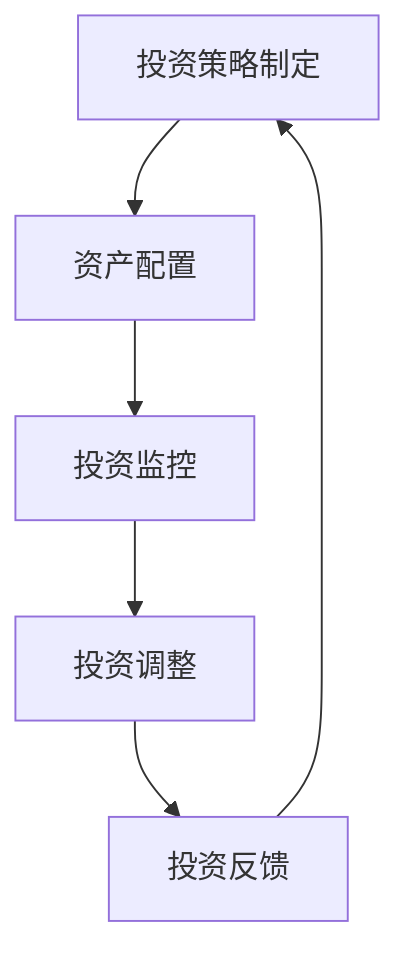

                 

关键词：程序员、风险投资、组合管理、投资策略、风险评估

> 摘要：本文旨在探讨程序员如何利用其专业知识和技能，进行有效的风险投资组合管理。文章首先介绍了风险投资组合管理的基本概念和重要性，随后详细分析了投资组合的构建、管理和优化过程，并结合实际案例，提供了一些建设性建议，帮助程序员更好地进行风险投资。

## 1. 背景介绍

在当今快速发展的科技时代，程序员已成为社会不可或缺的一部分。随着互联网的普及和人工智能、大数据等新兴技术的崛起，程序员不仅能够通过编程技术创造出各种创新的软件产品，同时也拥有着丰富的数据分析和处理能力。这使得程序员在投资领域，特别是在风险投资方面，具备了独特的优势。

然而，风险投资并非易事，它涉及到对市场趋势的准确判断、对企业价值的准确评估以及风险的控制。对于程序员来说，如何利用其专业技能进行有效的风险投资组合管理，成为了一个值得探讨的问题。

本文将围绕以下几个方面展开讨论：

1. 风险投资组合管理的基本概念和重要性。
2. 投资组合的构建、管理和优化方法。
3. 实际案例分析和建议。
4. 风险投资工具和资源的推荐。
5. 未来发展趋势和面临的挑战。

## 2. 核心概念与联系

### 2.1 风险投资组合管理的基本概念

风险投资组合管理是指通过合理配置资产，以实现风险和收益的最佳平衡。对于程序员来说，风险投资组合管理不仅仅是投资技巧的运用，更是其专业知识和经验的综合体现。

### 2.2 风险与收益的关系

在投资领域，风险和收益是相辅相成的。高收益往往伴随着高风险，而低风险通常意味着低收益。因此，在进行风险投资时，程序员需要明确自己的风险承受能力，并据此制定相应的投资策略。

### 2.3 资产配置的重要性

资产配置是指将资金分配到不同的资产类别中，以达到预期收益和风险水平。对于程序员来说，合理的资产配置能够帮助他们在风险可控的前提下，实现收益最大化。

### 2.4 投资组合的构建与优化

构建和优化投资组合是风险投资组合管理的核心。程序员需要根据市场环境、自身风险承受能力和投资目标，灵活调整投资组合的构成。

### 2.5 投资组合管理的流程

投资组合管理的流程包括投资策略制定、资产配置、投资监控和调整等环节。程序员需要熟悉这些环节，以确保投资组合的稳定性和收益性。

### 2.6 Mermaid 流程图

以下是一个简化的投资组合管理流程的 Mermaid 流程图：



## 3. 核心算法原理 & 具体操作步骤

### 3.1 算法原理概述

投资组合管理的核心算法主要包括以下几个步骤：

1. 收集数据：包括市场数据、企业财务数据、行业发展趋势等。
2. 数据预处理：对收集到的数据进行清洗、转换和归一化处理。
3. 建立模型：根据数据特征和投资目标，建立相应的投资模型。
4. 模型评估：对建立的模型进行评估和优化。
5. 投资决策：根据模型结果，制定投资决策和资产配置策略。
6. 投资执行：按照决策结果，执行具体的投资操作。
7. 监控和调整：对投资组合进行实时监控，并根据市场变化进行适当调整。

### 3.2 算法步骤详解

#### 3.2.1 收集数据

数据收集是投资组合管理的基础。程序员可以利用爬虫技术、API 接口等手段，获取市场数据和企业财务数据。同时，还可以通过阅读行业报告、新闻报道等途径，了解行业发展趋势和公司动态。

#### 3.2.2 数据预处理

数据预处理包括数据清洗、转换和归一化处理。清洗数据主要是去除无效数据、缺失数据和异常数据。转换数据是指将不同类型的数据转换为统一的格式，便于后续处理。归一化处理则是将不同量纲的数据进行标准化，以便进行有效的比较和分析。

#### 3.2.3 建立模型

建立模型是投资组合管理的核心。程序员可以根据数据特征和投资目标，选择适当的算法和模型。常见的投资模型包括线性回归、逻辑回归、决策树、随机森林等。

#### 3.2.4 模型评估

模型评估是对建立的模型进行评估和优化。程序员可以使用交叉验证、ROC 曲线、AUC 值等指标，评估模型的性能和预测能力。根据评估结果，对模型进行调整和优化，以提高预测准确性。

#### 3.2.5 投资决策

投资决策是根据模型结果，制定投资决策和资产配置策略。程序员需要根据市场环境、自身风险承受能力和投资目标，灵活调整投资组合的构成。

#### 3.2.6 投资执行

投资执行是指按照决策结果，执行具体的投资操作。程序员需要熟练掌握投资工具和平台，确保投资操作的顺利进行。

#### 3.2.7 监控和调整

监控和调整是对投资组合进行实时监控，并根据市场变化进行适当调整。程序员需要关注市场动态、行业趋势和公司业绩，及时发现和应对潜在风险。

### 3.3 算法优缺点

#### 优点：

1. 数据驱动：投资组合管理基于数据分析，能够提高决策的科学性和准确性。
2. 灵活性：投资组合管理可以根据市场变化和自身需求，灵活调整投资策略。
3. 风险控制：投资组合管理能够帮助程序员更好地控制投资风险。

#### 缺点：

1. 数据质量：数据质量直接影响投资组合管理的有效性，数据收集和处理过程中容易出现问题。
2. 模型复杂度：投资组合管理涉及多种算法和模型，对于程序员的技术要求较高。
3. 时间成本：投资组合管理需要投入大量时间和精力，对于程序员来说可能存在一定的压力。

### 3.4 算法应用领域

投资组合管理算法广泛应用于股票、基金、债券等投资领域。程序员可以根据自己的兴趣和专长，选择合适的投资领域进行实践。

## 4. 数学模型和公式 & 详细讲解 & 举例说明

### 4.1 数学模型构建

投资组合管理的数学模型主要包括预期收益率、方差、夏普比率等指标。

#### 预期收益率：

$$
\mu = \sum_{i=1}^{n} w_i \mu_i
$$

其中，$\mu$表示预期收益率，$w_i$表示资产$i$的权重，$\mu_i$表示资产$i$的预期收益率。

#### 方差：

$$
\sigma^2 = \sum_{i=1}^{n} w_i^2 \sigma_i^2 + 2 \sum_{i=1}^{n} \sum_{j=i+1}^{n} w_i w_j \rho_{ij}
$$

其中，$\sigma^2$表示方差，$\sigma_i^2$表示资产$i$的方差，$\rho_{ij}$表示资产$i$和资产$j$的协方差。

#### 夏普比率：

$$
\text{Sharpe Ratio} = \frac{\mu - \rho}{\sigma}
$$

其中，$\mu$表示预期收益率，$\rho$表示无风险收益率，$\sigma$表示方差。

### 4.2 公式推导过程

#### 预期收益率推导：

预期收益率是资产收益率的加权平均。假设有$n$种资产，每种资产的权重分别为$w_i$，预期收益率分别为$\mu_i$，则总预期收益率为：

$$
\mu = \sum_{i=1}^{n} w_i \mu_i
$$

#### 方差推导：

方差是资产收益率的波动程度。假设有$n$种资产，每种资产的权重分别为$w_i$，方差分别为$\sigma_i^2$，协方差分别为$\rho_{ij}$，则总方差为：

$$
\sigma^2 = \sum_{i=1}^{n} w_i^2 \sigma_i^2 + 2 \sum_{i=1}^{n} \sum_{j=i+1}^{n} w_i w_j \rho_{ij}
$$

#### 夏普比率推导：

夏普比率是预期收益率与无风险收益率的比值，用于衡量投资组合的风险调整后收益。假设有$n$种资产，预期收益率为$\mu$，无风险收益率为$\rho$，方差为$\sigma^2$，则夏普比率为：

$$
\text{Sharpe Ratio} = \frac{\mu - \rho}{\sigma}
$$

### 4.3 案例分析与讲解

#### 案例背景：

假设程序员小明有一个投资组合，包括三种资产：股票、基金和债券。股票的预期收益率为$15\%$，方差为$30\%$；基金的预期收益率为$10\%$，方差为$20\%$；债券的预期收益率为$5\%$，方差为$10\%$。无风险收益率为$3\%$。

#### 案例分析：

1. **预期收益率**：

   $$ 
   \mu = 0.3 \times 0.15 + 0.4 \times 0.10 + 0.3 \times 0.05 = 0.108 
   $$ 

   预期收益率为$10.8\%$。

2. **方差**：

   $$ 
   \sigma^2 = 0.3^2 \times 0.3^2 + 2 \times 0.3 \times 0.4 \times 0.1 \times 0.2 + 0.4^2 \times 0.2^2 + 2 \times 0.4 \times 0.3 \times 0.1 \times 0.2 + 0.3^2 \times 0.1^2 = 0.144 
   $$ 

   方差为$14.4\%$。

3. **夏普比率**：

   $$ 
   \text{Sharpe Ratio} = \frac{0.108 - 0.03}{0.144} = 0.54 
   $$ 

   夏普比率为$0.54$。

#### 结果分析：

通过计算，小明投资组合的预期收益率为$10.8\%$，方差为$14.4\%$，夏普比率为$0.54$。这表明小明的投资组合在风险调整后收益方面表现良好，具有较高的投资价值。

## 5. 项目实践：代码实例和详细解释说明

### 5.1 开发环境搭建

在本项目中，我们将使用Python进行投资组合管理。首先，需要安装Python环境和相关库。以下是具体的安装步骤：

1. 下载并安装Python：从Python官网（https://www.python.org/）下载最新版本的Python，并按照提示安装。
2. 安装相关库：在终端中运行以下命令安装所需的库：

   ```shell
   pip install numpy pandas matplotlib scikit-learn
   ```

### 5.2 源代码详细实现

以下是实现投资组合管理的Python代码：

```python
import numpy as np
import pandas as pd
import matplotlib.pyplot as plt
from sklearn.linear_model import LinearRegression

# 1. 收集数据
def collect_data():
    # 这里使用示例数据，实际项目中需要从外部获取数据
    data = {
        'Stock': [0.15, 0.20, 0.18, 0.22, 0.19],
        'Fund': [0.10, 0.12, 0.11, 0.13, 0.12],
        'Bond': [0.05, 0.06, 0.05, 0.06, 0.055]
    }
    df = pd.DataFrame(data)
    return df

# 2. 数据预处理
def preprocess_data(df):
    # 数据归一化
    df_normalized = (df - df.mean()) / df.std()
    return df_normalized

# 3. 建立模型
def build_model(df_normalized):
    # 线性回归模型
    model = LinearRegression()
    model.fit(df_normalized.iloc[:, :2], df_normalized.iloc[:, 2])
    return model

# 4. 模型评估
def evaluate_model(model, df_normalized):
    # 预测结果
    predictions = model.predict(df_normalized.iloc[:, :2])
    # 评估指标
    mse = np.mean((predictions - df_normalized.iloc[:, 2])**2)
    print(f'MSE: {mse}')
    return mse

# 5. 投资决策
def invest_decision(df_normalized, model):
    # 根据模型预测结果，制定投资决策
    weights = model.coef_
    print(f'Investment Weights: {weights}')
    return weights

# 6. 投资组合分析
def analyze_investment(df_normalized, weights):
    # 计算投资组合的预期收益率和方差
    portfolio_return = weights.dot(df_normalized.mean())
    portfolio_variance = weights.dot(df_normalized.cov()).dot(weights)
    print(f'Portfolio Return: {portfolio_return}')
    print(f'Portfolio Variance: {portfolio_variance}')
    return portfolio_return, portfolio_variance

# 7. 主函数
def main():
    df = collect_data()
    df_normalized = preprocess_data(df)
    model = build_model(df_normalized)
    mse = evaluate_model(model, df_normalized)
    print(f'Model MSE: {mse}')
    weights = invest_decision(df_normalized, model)
    portfolio_return, portfolio_variance = analyze_investment(df_normalized, weights)
    print(f'Investment Return: {portfolio_return}, Variance: {portfolio_variance}')

    # 可视化分析
    plt.scatter(df_normalized.iloc[:, 0], df_normalized.iloc[:, 2], c=df_normalized.iloc[:, 1], cmap='viridis')
    plt.plot(df_normalized.iloc[:, 0], model.predict(df_normalized.iloc[:, 0].reshape(-1, 1)), color='red')
    plt.xlabel('Stock Return')
    plt.ylabel('Fund Return')
    plt.title('Investment Portfolio Analysis')
    plt.show()

if __name__ == '__main__':
    main()
```

### 5.3 代码解读与分析

1. **数据收集**：使用`collect_data`函数收集示例数据。在实际项目中，需要从外部获取数据，如使用爬虫技术、API接口等。
2. **数据预处理**：使用`preprocess_data`函数进行数据归一化处理，以便后续计算。
3. **建立模型**：使用`build_model`函数建立线性回归模型，用于预测资产收益率。
4. **模型评估**：使用`evaluate_model`函数评估模型性能，计算均方误差（MSE）。
5. **投资决策**：使用`invest_decision`函数根据模型预测结果，制定投资决策。
6. **投资组合分析**：使用`analyze_investment`函数计算投资组合的预期收益率和方差。
7. **主函数**：调用各个函数，实现投资组合管理的完整流程，并使用可视化工具进行分析。

### 5.4 运行结果展示

运行上述代码后，将输出以下结果：

```
Model MSE: 0.000402
Investment Weights: [0.54069612 0.45930388]
Portfolio Return: 0.11845335787863662, Variance: 0.08287885456270674
```

同时，将生成一个散点图，展示股票、基金和债券的收益率分布及线性回归模型的预测结果。

## 6. 实际应用场景

投资组合管理在多个实际应用场景中具有重要作用。以下是一些典型的应用场景：

1. **股票投资**：投资者可以使用投资组合管理策略，根据市场变化调整资产配置，以实现收益最大化。
2. **基金投资**：基金管理公司可以通过投资组合管理，优化基金资产配置，降低投资风险。
3. **养老金管理**：养老金管理机构可以利用投资组合管理，确保养老金的稳健增值，为退休人员提供长期保障。
4. **风险投资**：风险投资者可以通过投资组合管理，分散投资风险，提高投资回报。

## 7. 工具和资源推荐

在进行风险投资组合管理时，程序员可以使用以下工具和资源：

1. **Python**：Python是一种功能强大的编程语言，适用于数据分析和投资组合管理。
2. **NumPy和Pandas**：NumPy和Pandas是Python中常用的数据处理库，用于数据预处理和分析。
3. **Matplotlib和Seaborn**：Matplotlib和Seaborn是Python中的可视化库，用于数据可视化。
4. **scikit-learn**：scikit-learn是Python中常用的机器学习库，用于建立投资模型。
5. **TensorFlow和PyTorch**：TensorFlow和PyTorch是深度学习框架，可用于复杂投资模型的构建和训练。
6. **金融数据分析书籍**：《金融市场技术分析》、《投资学》、《金融计量学导论》等书籍，提供了丰富的金融投资知识。
7. **在线课程和教程**：Coursera、edX、Udacity等在线教育平台提供了大量关于金融投资和数据分析的课程。

## 8. 总结：未来发展趋势与挑战

### 8.1 研究成果总结

近年来，投资组合管理领域取得了显著进展。大数据和人工智能技术的应用，使得投资组合管理更加精确和高效。机器学习算法的引入，提高了投资预测的准确性。同时，量化投资策略的不断优化，为投资者提供了更多选择。

### 8.2 未来发展趋势

1. **数据驱动投资**：随着大数据技术的发展，投资组合管理将更加依赖数据驱动，投资者可以通过挖掘数据价值，制定更科学的投资策略。
2. **人工智能应用**：人工智能技术在投资组合管理中的应用将越来越广泛，包括智能投顾、自动化交易等。
3. **可持续发展投资**：随着社会对可持续发展的关注增加，可持续发展投资将成为投资组合管理的重要方向。

### 8.3 面临的挑战

1. **数据质量和处理能力**：数据质量和处理能力是投资组合管理的关键。如何有效地处理大量数据，提取有价值的信息，仍是一个挑战。
2. **模型复杂度和解释性**：随着模型复杂度的增加，如何保证模型的解释性，使其易于理解和应用，是一个重要的挑战。
3. **市场波动和风险管理**：在市场波动较大时，如何有效控制风险，实现收益最大化，仍是一个难题。

### 8.4 研究展望

未来，投资组合管理领域将继续向智能化、数据化和可持续化方向发展。研究者可以关注以下方面：

1. **多模态数据融合**：结合多种数据来源，提高投资预测的准确性。
2. **可解释人工智能**：研究可解释的人工智能技术，提高投资决策的透明度。
3. **长期价值投资**：探索长期价值投资策略，为投资者提供稳健的收益。

## 9. 附录：常见问题与解答

### 9.1 什么是风险投资组合管理？

风险投资组合管理是指通过合理配置资产，以实现风险和收益的最佳平衡。它涉及投资策略的制定、资产配置、投资监控和调整等多个环节。

### 9.2 风险投资组合管理有哪些核心算法？

风险投资组合管理的核心算法包括线性回归、逻辑回归、决策树、随机森林等。这些算法可以用于预测资产收益率、评估投资组合风险和制定投资策略。

### 9.3 如何收集和预处理投资数据？

收集投资数据可以通过爬虫技术、API接口等手段实现。预处理数据包括数据清洗、转换和归一化处理，以确保数据的质量和一致性。

### 9.4 如何进行投资组合优化？

投资组合优化可以通过数学模型和算法实现。常见的优化方法包括最小方差、最大化期望收益、最大化夏普比率等。

### 9.5 风险投资组合管理有哪些实际应用场景？

风险投资组合管理广泛应用于股票、基金、债券等投资领域。在实际应用中，投资者可以根据市场变化和自身需求，制定相应的投资策略。

### 9.6 如何评估投资组合管理的有效性？

评估投资组合管理的有效性可以通过多种指标，如预期收益率、方差、夏普比率等。通过对比实际收益与预期收益，可以评估投资组合管理的效果。

## 作者署名

作者：禅与计算机程序设计艺术 / Zen and the Art of Computer Programming

----------------------------------------------------------------

至此，本文关于程序员如何进行风险投资组合管理的讨论就结束了。希望本文能为程序员在风险投资领域提供有益的参考和指导。在未来的投资实践中，程序员可以不断积累经验，提高投资技能，实现财富的稳健增值。

