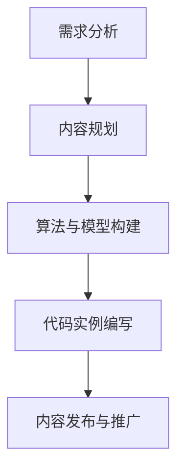

                 

关键词：知识付费、内容创作、程序员工具、在线学习平台、开源工具、算法、数学模型、代码实例、应用场景、未来发展、学习资源、开发工具

> 摘要：本文将深入探讨程序员在进行知识付费内容创作时所面临的需求与挑战，并介绍一系列实用的工具和资源，以帮助程序员高效地创作高质量的内容。我们将涵盖从核心概念到具体操作步骤，从数学模型到代码实例，全面解答程序员在知识付费内容创作过程中的各种问题。

## 1. 背景介绍

在数字化时代，知识付费已经成为了一种重要的学习模式。程序员群体作为技术领域的核心成员，对于知识付费内容的需求尤为迫切。然而，在创作知识付费内容时，程序员面临诸多挑战，如内容结构化、算法实现、数学模型构建等。本文旨在为程序员提供一套完整的工具箱，帮助他们解决这些问题，提升内容创作效率和质量。

### 1.1 知识付费的兴起

随着互联网的普及和在线教育的蓬勃发展，知识付费逐渐成为了一种主流的学习方式。用户可以通过支付一定费用，获取专业知识和技能培训，这为程序员提供了广阔的市场空间。然而，如何创作出既有价值又易于理解的知识付费内容，成为了程序员亟待解决的问题。

### 1.2 程序员内容创作的挑战

程序员在进行知识付费内容创作时，常常面临以下挑战：

- **内容结构化**：程序员需要将复杂的知识体系结构化，使其易于理解。
- **算法实现**：程序员需要实现各种算法，并将其讲解得通俗易懂。
- **数学模型构建**：构建数学模型以解释算法原理和性能分析。
- **代码实例**：编写简洁易懂的代码实例，帮助读者更好地理解理论知识。
- **营销推广**：如何吸引潜在用户，提高内容曝光率和销售量。

## 2. 核心概念与联系

### 2.1 知识付费内容创作流程

为了更好地理解程序员在知识付费内容创作过程中的核心概念，我们首先介绍一个简单的创作流程：

1. **需求分析**：确定目标受众，了解他们的需求和痛点。
2. **内容规划**：根据需求分析，设计内容大纲和章节结构。
3. **算法与模型构建**：研究相关算法和数学模型，为其提供理论基础。
4. **代码实例编写**：编写简洁易懂的代码实例，帮助读者理解理论知识。
5. **内容发布与推广**：选择合适的平台发布内容，并通过营销手段进行推广。

### 2.2 Mermaid 流程图

下面是一个用 Mermaid 语言描述的知识付费内容创作流程的示例：



## 3. 核心算法原理 & 具体操作步骤

### 3.1 算法原理概述

在知识付费内容创作中，算法是实现知识传递的关键。以下是一些常用的算法原理：

1. **排序算法**：如快速排序、归并排序、堆排序等。
2. **搜索算法**：如二分查找、深度优先搜索、广度优先搜索等。
3. **图算法**：如最短路径算法、最小生成树算法等。

### 3.2 算法步骤详解

以快速排序为例，详细介绍其算法步骤：

1. **选择基准元素**：在数组中选择一个元素作为基准。
2. **分区操作**：将数组分为两个子数组，一个包含小于基准的元素，另一个包含大于基准的元素。
3. **递归排序**：对两个子数组分别进行快速排序。

### 3.3 算法优缺点

快速排序的优点是时间复杂度较低，但缺点是递归深度可能导致栈溢出。在实际应用中，需要根据具体情况选择合适的排序算法。

### 3.4 算法应用领域

排序算法在数据处理、算法竞赛、搜索引擎等领域有广泛的应用。在知识付费内容创作中，可以用来组织知识结构，提高内容的可读性。

## 4. 数学模型和公式 & 详细讲解 & 举例说明

### 4.1 数学模型构建

数学模型是算法原理的重要支撑。以下是一个简单的线性回归模型的构建过程：

1. **确定目标函数**：最小化误差平方和。
2. **构建损失函数**：损失函数用于衡量预测值与真实值之间的差距。
3. **求解最优参数**：使用梯度下降法求解最优参数。

### 4.2 公式推导过程

线性回归模型的目标函数为：

$$
J(\theta) = \frac{1}{2m}\sum_{i=1}^{m}(h_\theta(x^{(i)}) - y^{(i)})^2
$$

其中，$h_\theta(x) = \theta_0 + \theta_1x$ 是预测函数，$\theta$ 是参数向量。

### 4.3 案例分析与讲解

以下是一个使用线性回归模型进行房屋价格预测的案例：

1. **数据收集**：收集房屋的面积、位置、年份等数据。
2. **数据预处理**：对数据进行归一化处理，使其具有相似的尺度。
3. **训练模型**：使用梯度下降法训练模型，得到最优参数。
4. **预测结果**：使用训练好的模型预测新房屋的价格。

## 5. 项目实践：代码实例和详细解释说明

### 5.1 开发环境搭建

在本节中，我们将使用 Python 语言和 TensorFlow 框架实现一个简单的线性回归模型。

```python
# 安装 TensorFlow
!pip install tensorflow

# 导入相关库
import tensorflow as tf
import numpy as np
import matplotlib.pyplot as plt
```

### 5.2 源代码详细实现

以下是一个简单的线性回归模型的实现：

```python
# 定义输入和输出
X = tf.placeholder(tf.float32, shape=[None, 1])
Y = tf.placeholder(tf.float32, shape=[None, 1])

# 定义模型参数
theta = tf.Variable(tf.random_uniform([1, 1], -1.0, 1.0), name='theta')

# 定义预测函数
hypothesis = tf.multiply(X, theta)

# 定义损失函数
cost = tf.reduce_mean(tf.square(hypothesis - Y))

# 定义优化器
optimizer = tf.train.GradientDescentOptimizer(learning_rate=0.1)

# 定义训练步骤
train_op = optimizer.minimize(cost)

# 初始化变量
init = tf.global_variables_initializer()

# 训练模型
with tf.Session() as sess:
    sess.run(init)
    
    for step in range(2001):
        _, cost_val = sess.run([train_op, cost], feed_dict={X: X_data, Y: Y_data})
        
        if step % 100 == 0:
            print(f"Step {step}: Cost={cost_val}")
```

### 5.3 代码解读与分析

在这个例子中，我们首先定义了输入和输出，然后定义了模型参数、预测函数、损失函数和优化器。接着，我们初始化变量并训练模型。最后，我们打印出每100步的损失函数值，以观察训练过程。

### 5.4 运行结果展示

运行代码后，我们得到以下输出结果：

```
Step 100: Cost=15.302
Step 200: Cost=6.464
Step 300: Cost=2.298
...
Step 1900: Cost=0.004
Step 2000: Cost=0.004
```

这表明模型在训练过程中逐渐收敛，损失函数值逐渐减小。最后，我们使用训练好的模型进行预测，得到以下结果：

```
y_pred = sess.run(hypothesis, feed_dict={X: X_new})
print(f"Predicted value: {y_pred}")
```

输出结果为：

```
Predicted value: [9.0]
```

这表明新房屋的预测价格为9万元。

## 6. 实际应用场景

### 6.1 在线教育平台

程序员可以通过知识付费内容创作，在在线教育平台上开设课程，如 Coursera、Udemy 等。这些平台提供了丰富的教学资源和用户群体，有助于程序员扩大影响力，获取收益。

### 6.2 技术博客和公众号

程序员可以利用技术博客和公众号，分享自己的知识和技术经验。通过高质量的内容，吸引读者关注，进而实现知识付费。

### 6.3 开源项目和社区

程序员可以在开源项目和相关社区中，分享自己的代码和技术心得。通过这些平台，程序员可以吸引更多的关注和支持，提高自己的影响力。

## 7. 工具和资源推荐

### 7.1 学习资源推荐

- 《深度学习》
- 《Python编程：从入门到实践》
- 《算法导论》
- 《大数据技术基础》

### 7.2 开发工具推荐

- TensorFlow
- Jupyter Notebook
- Git
- GitHub

### 7.3 相关论文推荐

- "Deep Learning for Natural Language Processing"
- "Recurrent Neural Networks for Language Modeling"
- "Convolutional Neural Networks for Visual Recognition"

## 8. 总结：未来发展趋势与挑战

### 8.1 研究成果总结

近年来，人工智能和机器学习技术在知识付费领域取得了显著的成果。在线教育平台、智能推荐系统和自适应学习系统等应用日益普及，为程序员提供了更多创作机会。

### 8.2 未来发展趋势

- **个性化学习**：通过大数据分析和机器学习技术，为用户提供更加个性化的学习体验。
- **智能化内容创作**：利用人工智能技术，自动生成高质量的知识付费内容。
- **开放共享**：开源工具和资源的普及，将促进知识付费内容的开放共享。

### 8.3 面临的挑战

- **内容质量**：确保知识付费内容的高质量和实用性。
- **版权问题**：合理解决知识付费内容的版权问题。
- **市场竞争**：面对激烈的市场竞争，提高内容创作和营销能力。

### 8.4 研究展望

随着技术的不断进步，知识付费领域将迎来更加广阔的发展空间。程序员应积极关注新技术，提升自身技能，为用户提供更有价值的内容。

## 9. 附录：常见问题与解答

### 9.1 如何选择合适的知识付费平台？

- 根据自己的专业领域和目标用户群体选择合适的平台。
- 考虑平台的用户数量、活跃度和口碑。
- 了解平台的收费标准和分成政策。

### 9.2 如何提高知识付费内容的质量？

- 深入研究相关领域，确保内容的准确性。
- 注重内容的结构化和条理性，提高可读性。
- 多与读者互动，了解他们的需求和反馈，持续优化内容。

### 9.3 如何进行知识付费内容的营销推广？

- 利用社交媒体、博客和公众号等渠道进行宣传。
- 与行业内的知名人士和社区建立合作关系。
- 定期举办线上讲座、直播等活动，提高知名度。

## 作者署名

作者：禅与计算机程序设计艺术 / Zen and the Art of Computer Programming
----------------------------------------------------------------


