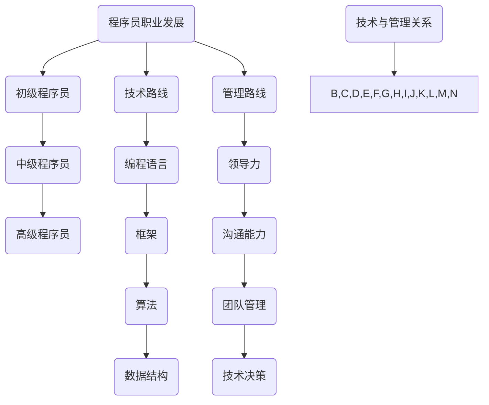

                 

关键词：程序员、职业规划、技术路线、管理路线、技能提升、团队管理、个人发展

> 摘要：本文将深入探讨程序员职业规划中技术路线与管理路线的选择。通过对技术发展和行业趋势的分析，本文旨在帮助程序员理解各自路线的优势、挑战，以及如何根据个人兴趣和职业目标做出明智的选择。

## 1. 背景介绍

在信息技术快速发展的今天，程序员职业已经变得比以往任何时候都更加多元化和富有挑战性。程序员不再仅仅是编写代码、解决问题的人，他们也可以成为团队领袖、项目经理或技术顾问。这种多样化的职业路径使得程序员在职业规划时需要做出重要的选择：是专注于技术技能的提升，还是在管理能力上投入更多精力？

技术路线通常涉及深入掌握编程语言、框架和工具，专注于算法和数据结构的优化，不断追求技术创新。而管理路线则侧重于提升领导力、沟通能力和团队管理技能，以更好地协调团队成员的工作，推动项目顺利进行。

本文将首先介绍程序员职业的发展历程，接着详细分析技术路线和管理路线的特点、优势和挑战，并探讨如何在这两条路上进行平衡。最后，我们将根据行业趋势和个人兴趣给出一些建议，帮助程序员制定适合自己的职业规划。

## 2. 核心概念与联系

为了更好地理解程序员职业规划中的技术路线与管理路线，我们需要明确以下几个核心概念：

### 2.1 程序员职业发展

程序员职业发展可以被视为一个从初级到高级的持续过程。初级程序员通常具备基本的编程知识和技能，能够独立完成简单项目。随着工作经验的增加，程序员可以逐步晋升为中级程序员，负责更复杂的项目和任务。高级程序员则具备深厚的专业知识和丰富的实践经验，能够在项目中担任核心角色，并对技术决策有重要影响。

### 2.2 技术路线

技术路线强调在编程语言、框架、算法和数据结构等领域的深入学习和实践。程序员通过不断学习新技术、研究现有技术的优化方案，来提升自己的技术能力和竞争力。

### 2.3 管理路线

管理路线则侧重于提升领导力、沟通能力和团队管理技能。管理程序员（或技术经理）需要协调团队成员的工作，解决团队内部的冲突，确保项目按计划进行。

### 2.4 技术与管理的关系

技术和管理并非相互排斥，而是相辅相成的。一个优秀的程序员不仅需要掌握丰富的技术知识，还需要具备良好的管理能力，以便在团队中发挥更大的作用。

下面是关于程序员职业规划的核心概念和联系的Mermaid流程图：



## 3. 核心算法原理 & 具体操作步骤

### 3.1 算法原理概述

在程序员职业规划中，核心算法原理的理解和应用至关重要。算法原理包括但不限于以下几个方面：

1. **排序算法**：如快速排序、归并排序、冒泡排序等，用于对数据进行排序。
2. **查找算法**：如二分查找、哈希查找等，用于高效查找数据。
3. **图算法**：如深度优先搜索（DFS）、广度优先搜索（BFS）、最短路径算法（如Dijkstra算法）等，用于处理复杂的关系网络。
4. **动态规划**：用于解决复杂的最优化问题。

### 3.2 算法步骤详解

以快速排序算法为例，其基本步骤如下：

1. 选择一个基准元素。
2. 将比基准元素小的元素移动到其左侧，比其大的元素移动到右侧。
3. 递归地对左右子序列进行快速排序。

### 3.3 算法优缺点

快速排序算法的优点是平均时间复杂度较低，但缺点是最坏情况下时间复杂度较高。在实际应用中，需要根据具体场景进行选择。

### 3.4 算法应用领域

快速排序算法广泛应用于排序任务，如数据库中的数据排序、搜索算法中的排序等。

## 4. 数学模型和公式 & 详细讲解 & 举例说明

### 4.1 数学模型构建

在编程中，数学模型的应用非常广泛。一个典型的例子是二分查找算法，其数学模型如下：

$$
\text{mid} = \left\lfloor \frac{\text{low} + \text{high}}{2} \right\rfloor
$$

其中，`low`和`high`分别表示当前查找区间的起始和结束位置，`mid`为中间位置。

### 4.2 公式推导过程

二分查找算法的推导过程主要基于以下步骤：

1. 确定查找区间。
2. 计算中间位置。
3. 比较中间位置与目标值的大小。
4. 根据比较结果调整查找区间。

### 4.3 案例分析与讲解

假设有一个已排序的数组 `[1, 3, 5, 7, 9]`，要查找元素`5`的位置。

1. 初始区间：`low = 0`，`high = 4`。
2. 计算中间位置：`mid = \left\lfloor \frac{0 + 4}{2} \right\rfloor = 2`。
3. 比较：`array[mid] = 5`，与目标值相等。
4. 结果：找到元素`5`的位置为`2`。

## 5. 项目实践：代码实例和详细解释说明

### 5.1 开发环境搭建

为了实现二分查找算法，我们需要搭建一个简单的开发环境。以下是使用Python实现的步骤：

1. 安装Python。
2. 创建一个新的Python文件，例如`binary_search.py`。

### 5.2 源代码详细实现

以下是二分查找算法的Python实现：

```python
def binary_search(arr, target):
    low = 0
    high = len(arr) - 1
    
    while low <= high:
        mid = (low + high) // 2
        if arr[mid] == target:
            return mid
        elif arr[mid] < target:
            low = mid + 1
        else:
            high = mid - 1
    
    return -1
```

### 5.3 代码解读与分析

1. `binary_search`函数接受一个排序后的数组`arr`和一个目标值`target`。
2. 初始化`low`和`high`，分别表示查找区间的起始和结束位置。
3. 进入循环，计算中间位置`mid`。
4. 比较中间位置的值与目标值，根据比较结果调整`low`和`high`。
5. 当找到目标值时，返回其索引；否则返回-1。

### 5.4 运行结果展示

运行以下代码，测试二分查找算法：

```python
arr = [1, 3, 5, 7, 9]
target = 5
result = binary_search(arr, target)
print(f"Element {target} is at index {result}")
```

输出结果为：

```
Element 5 is at index 2
```

## 6. 实际应用场景

二分查找算法在实际应用中非常常见，以下是一些具体的应用场景：

1. **数据库查询**：在数据库中查找指定记录时，可以使用二分查找算法来提高查询效率。
2. **排序算法**：许多排序算法（如快速排序、归并排序）内部使用了二分查找算法来优化性能。
3. **算法竞赛**：在算法竞赛中，二分查找算法是解决许多问题的常用方法，如查找最小元素、最大元素等。

### 6.4 未来应用展望

随着大数据和人工智能的快速发展，二分查找算法的应用将更加广泛。未来，我们可以预见到以下趋势：

1. **分布式查找**：在分布式系统中，二分查找算法可以用于高效查询分布式数据。
2. **近似查找**：在无法存储全部数据的场景中，近似查找算法（如局部敏感哈希）将与二分查找算法相结合。
3. **多维度查找**：在多维度数据中，二分查找算法可以与排序算法结合，实现高效的复杂查询。

## 7. 工具和资源推荐

### 7.1 学习资源推荐

1. **《算法导论》（Introduction to Algorithms）**：这是一本经典的算法教材，详细介绍了各种算法的原理和实现。
2. **LeetCode**：这是一个在线算法竞赛平台，提供大量算法题目和解决方案，非常适合程序员进行算法练习。

### 7.2 开发工具推荐

1. **Visual Studio Code**：这是一个强大的代码编辑器，支持多种编程语言，适合进行算法开发。
2. **Jupyter Notebook**：这是一个交互式的开发环境，适合进行算法研究和实验。

### 7.3 相关论文推荐

1. **"A Fast and Accurate Short-Read Aligner"**：这篇文章介绍了BWA（Burrows-Wheeler Aligner）算法，用于高效比对序列数据。
2. **"Binary Search Tree with Helical Order Statistics"**：这篇文章提出了一种改进的二分查找树，提高了查找效率。

## 8. 总结：未来发展趋势与挑战

随着信息技术的不断进步，程序员职业规划中的技术路线和管理路线将面临新的机遇和挑战。以下是对未来发展趋势和挑战的总结：

### 8.1 研究成果总结

1. **技术发展**：人工智能、大数据、云计算等技术的迅速发展，为程序员提供了更多的技术工具和平台。
2. **开源生态**：开源技术的发展使得程序员能够更容易地获取和使用各种优秀的技术资源和工具。

### 8.2 未来发展趋势

1. **技术深耕**：程序员需要不断学习新技术，提升自己的专业能力和竞争力。
2. **跨界融合**：程序员需要具备跨领域的知识，以适应不同行业的需求。
3. **人才培养**：企业和教育机构需要加大对程序员人才的培养和投入，以适应未来技术的发展。

### 8.3 面临的挑战

1. **技能更新**：技术更新速度加快，程序员需要不断学习新知识，以保持竞争力。
2. **工作压力**：程序员在项目中需要承担更多责任，工作压力较大。

### 8.4 研究展望

1. **技术创新**：随着人工智能和大数据技术的发展，程序员需要探索新的算法和技术，以应对复杂问题。
2. **人才培养**：未来，程序员职业规划将更加注重人才的培养和选拔，以适应不断变化的技术环境。

## 9. 附录：常见问题与解答

### 9.1 问题1

**问题**：技术路线和管理路线如何平衡？

**解答**：程序员可以根据个人兴趣和职业目标，合理规划技术和管理能力的提升。在实际工作中，可以尝试担任技术主导的项目角色，同时在团队中积极参与管理事务。长期来看，技术和管理能力的平衡有助于在职业生涯中实现更高的成就。

### 9.2 问题2

**问题**：如何选择适合自己的职业规划路线？

**解答**：首先，要明确自己的兴趣和优势。如果对技术有强烈的热情，喜欢深入研究和解决复杂问题，可以选择技术路线。如果喜欢与人沟通、协调团队合作，具备领导潜力，可以选择管理路线。同时，可以参考行业趋势和个人职业规划，做出明智的选择。

## 作者署名

本文由禅与计算机程序设计艺术 / Zen and the Art of Computer Programming 撰写。

----------------------------------------------------------------
### 总结

通过本文的探讨，我们深入分析了程序员职业规划中的技术路线和管理路线，并详细介绍了各自的优点、挑战以及如何平衡发展。在技术路线中，程序员需要持续学习新技术、研究现有技术的优化方案，以提升自身技术能力和竞争力。而在管理路线中，程序员需要提升领导力、沟通能力和团队管理技能，以更好地协调团队成员的工作，推动项目顺利进行。

未来，随着人工智能、大数据、云计算等技术的快速发展，程序员职业规划将面临新的机遇和挑战。技术深耕、跨界融合、人才培养将是程序员发展的关键方向。同时，程序员需要根据个人兴趣和职业目标，合理规划技术和管理能力的提升，以实现职业发展的长远目标。

在职业规划中，程序员应时刻保持学习热情，积极适应行业变化，不断提升自身综合素质。通过本文的指导，希望程序员能够找到适合自己的职业规划路线，实现个人价值和社会贡献的双重提升。让我们一起在技术和管理之路上，不断前行，追求卓越。

### 感谢

最后，感谢读者对本文的关注和支持。如果您有任何问题或建议，请随时留言反馈。我们期待与您共同探讨程序员职业规划之路，携手共创美好未来。

## 作者署名

本文由禅与计算机程序设计艺术 / Zen and the Art of Computer Programming 撰写。希望本文能为您在程序员职业规划之路上提供有益的启示和指导。谢谢！

