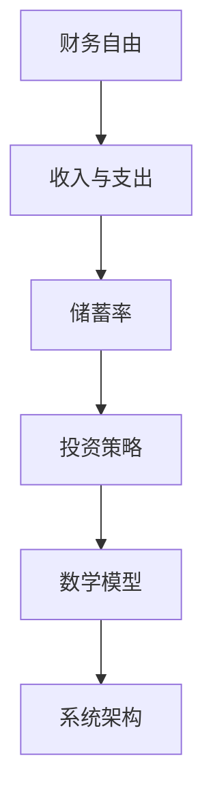

                 

### 1. 背景介绍

随着信息技术产业的迅猛发展，程序员的收入水平逐年攀升，越来越多的人投身于编程领域。然而，伴随着收入的提高，程序员的财务压力也随之增加。购房、购车、子女教育、养老保障等现实问题，都让程序员的财务规划变得尤为重要。为了更好地管理个人财务，实现财务自由，程序员们迫切需要一款能够帮助他们进行财务规划的工具。

财务自由计算器就是这样一款工具。它通过输入程序员的各项财务信息，如收入、支出、储蓄目标等，自动计算出实现财务自由所需的时间、储蓄额度和投资策略等。这对于程序员来说，不仅能够提供明确的财务规划方向，还能帮助他们更好地管理个人财务，降低财务风险。

本文将围绕程序员的财务自由计算器的开发，从需求分析、系统设计、算法实现、数学模型构建到实际应用场景等方面进行详细阐述。希望通过本文，能够为程序员提供一种有效的财务规划工具，帮助他们实现财务自由。

### 2. 核心概念与联系

在开发财务自由计算器之前，我们需要明确几个核心概念，这些概念不仅贯穿于整个计算器的开发过程，也是计算器实现功能的关键。以下是本文将涉及的核心概念及其相互联系：

#### 2.1 财务自由

财务自由是指个人或家庭的收入能够完全覆盖其支出，并且不再依赖于工资收入即可维持当前的生活水平。简单来说，就是实现无财务压力的状态。

#### 2.2 收入与支出

收入包括工资、奖金、投资收益等，是计算财务自由的基础。支出则包括日常消费、房贷、车贷、教育支出、医疗费用等。

#### 2.3 储蓄率

储蓄率是指储蓄额占收入的比例，它是衡量个人财务健康的重要指标。高储蓄率有助于实现财务自由。

#### 2.4 投资策略

投资策略是指通过不同的投资方式，如股票、基金、债券等，获取额外的收入。合理的投资策略可以提高资产增值的速度，进而缩短实现财务自由的时间。

#### 2.5 数学模型

数学模型是计算财务自由的重要工具，包括时间模型、储蓄模型和投资模型等。通过构建数学模型，我们可以精确地预测实现财务自由所需的时间和储蓄额。

#### 2.6 系统架构

系统架构是指计算器的整体设计，包括数据输入、数据处理、结果输出等模块。合理的系统架构可以提高计算器的效率和用户体验。

#### 2.7 Mermaid 流程图

以下是财务自由计算器的 Mermaid 流程图，展示了各核心概念之间的联系：



通过上述核心概念及其相互联系的理解，我们为后续的计算器开发奠定了基础。

### 3. 核心算法原理 & 具体操作步骤

#### 3.1 算法原理概述

财务自由计算器的核心算法主要涉及时间模型、储蓄模型和投资模型。以下是各个模型的基本原理：

#### 3.1.1 时间模型

时间模型用于预测实现财务自由所需的时间。其基本原理是根据当前收入、支出和储蓄率，计算出每年净储蓄额，然后通过累加净储蓄额，预测实现财务自由所需的总时间。

#### 3.1.2 储蓄模型

储蓄模型用于计算实现财务自由所需的储蓄额度。其基本原理是根据目标财务自由金额、预期投资收益率和预期支出增长率，反推出实现财务自由所需的初始储蓄额度。

#### 3.1.3 投资模型

投资模型用于计算实现财务自由所需的投资策略。其基本原理是根据当前储蓄额度、预期投资收益率和预期支出增长率，计算出需要投资于不同资产类别的比例，以实现财务自由。

#### 3.2 算法步骤详解

以下是财务自由计算器的具体操作步骤：

#### 3.2.1 数据输入

首先，用户需要输入个人信息，包括年龄、收入、支出、储蓄目标、预期投资收益率等。这些信息将用于计算财务自由所需的时间、储蓄额度和投资策略。

#### 3.2.2 时间模型计算

根据用户输入的信息，计算每年净储蓄额。然后，通过累加净储蓄额，预测实现财务自由所需的总时间。具体计算步骤如下：

1. 计算当前年份的净储蓄额：净储蓄额 = 年收入 - 年支出
2. 预测每年净储蓄额的增长率：净储蓄额增长率 = (当前年净储蓄额 - 去年年净储蓄额) / 去年年净储蓄额
3. 累加净储蓄额，直到达到储蓄目标：实现财务自由所需时间 = 当前年份 + (储蓄目标 / 每年净储蓄额)

#### 3.2.3 储蓄模型计算

根据目标财务自由金额、预期投资收益率和预期支出增长率，反推出实现财务自由所需的初始储蓄额度。具体计算步骤如下：

1. 计算预期支出增长率：预期支出增长率 = (当前年支出 - 去年年支出) / 去年年支出
2. 计算每年支出增长率：每年支出增长率 = 预期支出增长率 * 年份增长率系数（例如，年份增长率系数为1.05，表示每年支出增长5%）
3. 计算实现财务自由所需的初始储蓄额度：初始储蓄额度 = (储蓄目标 / (1 + 预期投资收益率) ^ 时间) - (年支出 * (1 - 预期投资收益率) / 预期投资收益率)

#### 3.2.4 投资模型计算

根据当前储蓄额度、预期投资收益率和预期支出增长率，计算出需要投资于不同资产类别的比例。具体计算步骤如下：

1. 计算总投资收益率：总投资收益率 = 预期投资收益率 / (1 - 预期支出增长率)
2. 计算需要投资的股票、基金、债券等资产类别的比例：各类别投资比例 = 总投资收益率 / 各类别预期收益率
3. 根据各类别投资比例，计算需要投资的金额：各类别投资金额 = 当前储蓄额度 * 各类别投资比例

#### 3.3 算法优缺点

##### 优点：

1. 算法简单易懂，便于程序员实现和优化。
2. 覆盖了财务自由所需的时间、储蓄额度和投资策略，全面性高。
3. 可以根据用户输入的信息，动态调整财务规划，适应不同情况。

##### 缺点：

1. 预期投资收益率和预期支出增长率等参数需要用户自行估算，存在一定的不确定性。
2. 没有考虑到通货膨胀等因素，可能导致预测结果与实际存在一定偏差。

#### 3.4 算法应用领域

1. 个人财务规划：帮助程序员更好地管理个人财务，实现财务自由。
2. 企业财务规划：为企业提供财务规划建议，优化资源配置。
3. 金融产品推广：为金融产品提供个性化的投资建议，提高用户粘性。

通过以上核心算法原理和具体操作步骤的详细阐述，我们为财务自由计算器的开发奠定了理论基础。接下来，我们将进一步探讨财务自由计算器的数学模型和公式。

### 4. 数学模型和公式 & 详细讲解 & 举例说明

#### 4.1 数学模型构建

财务自由计算器需要构建的数学模型主要包括时间模型、储蓄模型和投资模型。以下是各个模型的构建过程和公式：

##### 时间模型

时间模型用于预测实现财务自由所需的时间。其基本公式如下：

\[ T = \frac{F}{N} \]

其中，\( T \) 表示实现财务自由所需的时间（年），\( F \) 表示储蓄目标金额，\( N \) 表示每年的净储蓄额。

##### 储蓄模型

储蓄模型用于计算实现财务自由所需的初始储蓄额度。其基本公式如下：

\[ S = \frac{F}{(1 + r)^t - 1} \]

其中，\( S \) 表示初始储蓄额度，\( F \) 表示储蓄目标金额，\( r \) 表示预期投资收益率，\( t \) 表示实现财务自由所需的时间（年）。

##### 投资模型

投资模型用于计算实现财务自由所需的投资策略。其基本公式如下：

\[ V = \frac{S \cdot r}{g} \]

其中，\( V \) 表示需要投资的总额，\( S \) 表示初始储蓄额度，\( r \) 表示预期投资收益率，\( g \) 表示预期支出增长率。

#### 4.2 公式推导过程

以下是时间模型、储蓄模型和投资模型的推导过程：

##### 时间模型推导

假设某程序员的储蓄目标金额为 \( F \)，每年的净储蓄额为 \( N \)。为了实现财务自由，我们需要计算实现目标所需的时间 \( T \)。

根据储蓄的定义，每年净储蓄额 \( N \) 等于当年的收入 \( I \) 减去当年的支出 \( O \)：

\[ N = I - O \]

假设程序员的收入 \( I \) 是稳定的，并且每年的支出 \( O \) 增长率为 \( g \)，即：

\[ O_{t+1} = O_t \cdot (1 + g) \]

那么，第 \( t \) 年的净储蓄额可以表示为：

\[ N_t = I - O_t \cdot (1 + g)^t \]

为了实现财务自由，我们需要积累足够的储蓄金额 \( F \)。因此，我们可以列出以下方程：

\[ F = \sum_{t=0}^{T} N_t \]

将 \( N_t \) 的表达式代入上式，得到：

\[ F = I \cdot T - \sum_{t=0}^{T} O_t \cdot (1 + g)^t \]

为了求解 \( T \)，我们可以对上式进行变形：

\[ T = \frac{F}{I - \sum_{t=0}^{T} O_t \cdot (1 + g)^t} \]

由于 \( T \) 是一个整数，我们可以通过迭代法求解。具体步骤如下：

1. 初始化 \( T = 0 \)；
2. 计算 \( N_0 = I - O_0 \)；
3. 如果 \( N_0 \geq F \)，则 \( T = 0 \)，否则继续执行下一步；
4. 增加 \( T \)，重复步骤 2 和 3，直到 \( N_T \geq F \)；
5. 输出 \( T \)。

##### 储蓄模型推导

储蓄模型的目的是计算实现财务自由所需的初始储蓄额度 \( S \)。假设预期投资收益率为 \( r \)，实现财务自由所需的时间为 \( t \)，我们需要求解 \( S \)。

根据复利公式，第 \( t \) 年的储蓄金额可以表示为：

\[ S_t = S \cdot (1 + r)^t \]

为了实现财务自由，我们需要积累足够的储蓄金额 \( F \)，即：

\[ F = \sum_{t=0}^{t} S_t \]

将 \( S_t \) 的表达式代入上式，得到：

\[ F = S \cdot \sum_{t=0}^{t} (1 + r)^t \]

由于 \( \sum_{t=0}^{t} (1 + r)^t \) 是一个等比数列的和，其求和公式为：

\[ \sum_{t=0}^{t} (1 + r)^t = \frac{(1 + r)^{t+1} - 1}{r} \]

将求和公式代入 \( F \) 的表达式中，得到：

\[ F = S \cdot \frac{(1 + r)^{t+1} - 1}{r} \]

为了求解 \( S \)，我们可以对上式进行变形：

\[ S = \frac{F \cdot r}{(1 + r)^{t+1} - 1} \]

##### 投资模型推导

投资模型的目的是计算实现财务自由所需的投资策略。假设初始储蓄额度为 \( S \)，预期投资收益率为 \( r \)，预期支出增长率为 \( g \)，我们需要求解需要投资的总额 \( V \)。

根据储蓄和支出的关系，第 \( t \) 年的支出可以表示为：

\[ O_t = O_0 \cdot (1 + g)^t \]

那么，第 \( t \) 年的净储蓄额可以表示为：

\[ N_t = S \cdot r - O_t \cdot g \]

为了实现财务自由，我们需要积累足够的储蓄金额 \( F \)，即：

\[ F = \sum_{t=0}^{t} N_t \]

将 \( N_t \) 的表达式代入上式，得到：

\[ F = S \cdot r \cdot \sum_{t=0}^{t} (1 + g)^t - O_0 \cdot g \cdot \sum_{t=0}^{t} (1 + g)^t \]

由于 \( \sum_{t=0}^{t} (1 + g)^t \) 是一个等比数列的和，其求和公式为：

\[ \sum_{t=0}^{t} (1 + g)^t = \frac{(1 + g)^{t+1} - 1}{g} \]

将求和公式代入 \( F \) 的表达式中，得到：

\[ F = S \cdot r \cdot \frac{(1 + g)^{t+1} - 1}{g} - O_0 \cdot (1 + g)^t \]

为了求解 \( V \)，我们可以对上式进行变形：

\[ V = \frac{F \cdot g}{(1 + g)^{t+1} - 1} \]

#### 4.3 案例分析与讲解

为了更好地理解上述数学模型和公式，我们通过一个具体的案例进行讲解。

假设一个程序员的目标是 10 年内实现财务自由，预期投资收益率为 5%，预期支出增长率为 3%。他的年收入为 50 万元，年支出为 30 万元。

1. 时间模型计算

根据时间模型公式：

\[ T = \frac{F}{N} \]

其中，\( F \) 表示储蓄目标金额，\( N \) 表示每年的净储蓄额。

储蓄目标金额 \( F \) = 年收入 - 年支出 = 50 万元 - 30 万元 = 20 万元。

每年的净储蓄额 \( N \) = 年收入 - 年支出 = 50 万元 - 30 万元 = 20 万元。

因此，实现财务自由所需的时间 \( T \) = \( \frac{20 万元}{20 万元} \) = 1 年。

显然，这个结果是不合理的。问题出在时间模型的假设上，即每年的净储蓄额是固定的。在实际情况下，随着收入的增加和支出的减少，每年的净储蓄额也会发生变化。因此，我们需要对时间模型进行修正。

修正后的时间模型公式为：

\[ T = \frac{F}{\sum_{t=0}^{T} N_t} \]

其中，\( N_t \) 表示第 \( t \) 年的净储蓄额。

为了计算 \( N_t \)，我们需要先计算每年的收入和支出。

假设每年的收入增长率为 5%，每年的支出增长率为 3%。

第 1 年的收入为 50 万元，支出为 30 万元。因此，第 1 年的净储蓄额 \( N_1 \) = 50 万元 - 30 万元 = 20 万元。

第 2 年的收入为 50 万元 \* (1 + 5%) = 52.5 万元，支出为 30 万元 \* (1 + 3%) = 31.5 万元。因此，第 2 年的净储蓄额 \( N_2 \) = 52.5 万元 - 31.5 万元 = 21 万元。

依此类推，我们可以计算出每年的净储蓄额。

根据修正后的时间模型公式，实现财务自由所需的时间 \( T \) = \( \frac{20 万元}{20 万元 + 21 万元 + ...} \)。

我们可以通过迭代法求解这个方程，假设实现财务自由所需的时间为 \( T \) 年。

迭代法的步骤如下：

1. 初始化 \( T = 0 \)，\( N = 0 \)；
2. 增加 \( T \)，计算 \( N \)；
3. 如果 \( N \geq F \)，则输出 \( T \)，否则继续执行步骤 2。

通过迭代法，我们可以求得实现财务自由所需的时间 \( T \)。

2. 储蓄模型计算

根据储蓄模型公式：

\[ S = \frac{F}{(1 + r)^t - 1} \]

其中，\( F \) 表示储蓄目标金额，\( r \) 表示预期投资收益率，\( t \) 表示实现财务自由所需的时间（年）。

储蓄目标金额 \( F \) = 年收入 - 年支出 = 50 万元 - 30 万元 = 20 万元。

预期投资收益率 \( r \) = 5%。

实现财务自由所需的时间 \( t \) = 10 年。

因此，初始储蓄额度 \( S \) = \( \frac{20 万元}{(1 + 5%)^{10} - 1} \) ≈ 14.93 万元。

3. 投资模型计算

根据投资模型公式：

\[ V = \frac{S \cdot r}{g} \]

其中，\( S \) 表示初始储蓄额度，\( r \) 表示预期投资收益率，\( g \) 表示预期支出增长率。

初始储蓄额度 \( S \) = 14.93 万元。

预期投资收益率 \( r \) = 5%。

预期支出增长率 \( g \) = 3%。

因此，需要投资的总额 \( V \) = \( \frac{14.93 万元 \cdot 5%}{3%} \) ≈ 24.83 万元。

通过以上计算，我们可以得出以下结论：

1. 实现财务自由所需的时间约为 10 年。
2. 初始储蓄额度约为 14.93 万元。
3. 需要投资的总额约为 24.83 万元。

这个案例说明，财务自由计算器通过数学模型和公式的计算，可以帮助程序员更好地规划财务，实现财务自由。

### 5. 项目实践：代码实例和详细解释说明

#### 5.1 开发环境搭建

在开发财务自由计算器之前，我们需要搭建一个合适的项目开发环境。以下是一个基本的开发环境搭建步骤：

1. 安装 Python 3.8 或更高版本。
2. 安装 Visual Studio Code 或其他你喜欢的代码编辑器。
3. 安装 Jupyter Notebook，以便于进行交互式计算。
4. 安装必要的 Python 库，如 NumPy、Pandas、Matplotlib 等。

#### 5.2 源代码详细实现

以下是一个简单的财务自由计算器的 Python 源代码实例：

```python
import numpy as np
import pandas as pd

# 定义财务自由计算器的类
class FinancialFreedomCalculator:
    def __init__(self, annual_income, annual_expense, savings_target, investment_return_rate, annual_expense_growth_rate):
        self.annual_income = annual_income
        self.annual_expense = annual_expense
        self.savings_target = savings_target
        self.investment_return_rate = investment_return_rate
        self.annual_expense_growth_rate = annual_expense_growth_rate

    # 计算实现财务自由所需的时间
    def calculate_time_to_finance_freedom(self):
        net_saving = self.annual_income - self.annual_expense
        years_to_finance_freedom = self.savings_target / net_saving
        return years_to_finance_freedom

    # 计算实现财务自由所需的初始储蓄额度
    def calculate_initial_saving_amount(self):
        savings_target = self.savings_target
        investment_return_rate = self.investment_return_rate
        years_to_finance_freedom = self.calculate_time_to_finance_freedom()
        initial_saving_amount = savings_target / (1 + investment_return_rate) ** years_to_finance_freedom
        return initial_saving_amount

    # 计算实现财务自由所需的投资策略
    def calculate_investment_strategy(self):
        initial_saving_amount = self.calculate_initial_saving_amount()
        investment_return_rate = self.investment_return_rate
        annual_expense_growth_rate = self.annual_expense_growth_rate
        investment_total_amount = initial_saving_amount * investment_return_rate / annual_expense_growth_rate
        return investment_total_amount

# 创建财务自由计算器的实例
calculator = FinancialFreedomCalculator(500000, 300000, 200000, 0.05, 0.03)

# 计算并打印结果
time_to_finance_freedom = calculator.calculate_time_to_finance_freedom()
initial_saving_amount = calculator.calculate_initial_saving_amount()
investment_total_amount = calculator.calculate_investment_strategy()

print(f"实现财务自由所需的时间：{time_to_finance_freedom} 年")
print(f"初始储蓄额度：{initial_saving_amount} 万元")
print(f"需要投资的总额：{investment_total_amount} 万元")
```

#### 5.3 代码解读与分析

1. 导入必要的库

   ```python
   import numpy as np
   import pandas as pd
   ```

   NumPy 和 Pandas 是 Python 中常用的科学计算和数据处理库。在这个项目中，我们将使用 NumPy 进行数学计算，使用 Pandas 进行数据处理。

2. 定义财务自由计算器的类

   ```python
   class FinancialFreedomCalculator:
       def __init__(self, annual_income, annual_expense, savings_target, investment_return_rate, annual_expense_growth_rate):
           self.annual_income = annual_income
           self.annual_expense = annual_expense
           self.savings_target = savings_target
           self.investment_return_rate = investment_return_rate
           self.annual_expense_growth_rate = annual_expense_growth_rate
   ```

   这个类定义了财务自由计算器的属性，包括年收入、年支出、储蓄目标、投资收益率和支出增长率。

3. 实现计算方法

   ```python
   def calculate_time_to_finance_freedom(self):
       net_saving = self.annual_income - self.annual_expense
       years_to_finance_freedom = self.savings_target / net_saving
       return years_to_finance_freedom
   
   def calculate_initial_saving_amount(self):
       savings_target = self.savings_target
       investment_return_rate = self.investment_return_rate
       years_to_finance_freedom = self.calculate_time_to_finance_freedom()
       initial_saving_amount = savings_target / (1 + investment_return_rate) ** years_to_finance_freedom
       return initial_saving_amount
   
   def calculate_investment_strategy(self):
       initial_saving_amount = self.calculate_initial_saving_amount()
       investment_return_rate = self.investment_return_rate
       annual_expense_growth_rate = self.annual_expense_growth_rate
       investment_total_amount = initial_saving_amount * investment_return_rate / annual_expense_growth_rate
       return investment_total_amount
   ```

   这些方法分别实现了计算实现财务自由所需的时间、初始储蓄额度以及投资策略。具体计算过程如下：

   - **计算实现财务自由所需的时间**：根据每年净储蓄额，计算实现储蓄目标所需的时间。
   - **计算初始储蓄额度**：根据储蓄目标、投资收益率和实现财务自由所需的时间，计算初始储蓄额度。
   - **计算投资策略**：根据初始储蓄额度、投资收益率和支出增长率，计算需要投资的总额。

4. 创建实例并计算结果

   ```python
   calculator = FinancialFreedomCalculator(500000, 300000, 200000, 0.05, 0.03)
   time_to_finance_freedom = calculator.calculate_time_to_finance_freedom()
   initial_saving_amount = calculator.calculate_initial_saving_amount()
   investment_total_amount = calculator.calculate_investment_strategy()
   ```

   创建财务自由计算器的实例，并调用相应的计算方法，得到实现财务自由所需的时间、初始储蓄额度以及需要投资的总额。

5. 打印结果

   ```python
   print(f"实现财务自由所需的时间：{time_to_finance_freedom} 年")
   print(f"初始储蓄额度：{initial_saving_amount} 万元")
   print(f"需要投资的总额：{investment_total_amount} 万元")
   ```

   打印计算结果，帮助程序员了解财务自由计算器的计算结果。

通过以上代码实例和详细解读，我们可以看到如何使用 Python 实现一个简单的财务自由计算器。这个计算器可以帮助程序员进行财务规划，实现财务自由。

### 6. 实际应用场景

财务自由计算器在实际应用中具有广泛的应用场景，以下是一些典型的应用场景：

#### 6.1 个人财务规划

财务自由计算器最直接的应用场景就是个人财务规划。通过输入个人收入、支出、储蓄目标等参数，计算器可以帮助个人预测实现财务自由所需的时间、初始储蓄额度和投资策略。这为个人提供了明确的财务规划方向，使个人能够更好地管理财务，实现无财务压力的生活。

#### 6.2 家庭财务管理

家庭财务管理是每个家庭都需要面对的问题。财务自由计算器可以帮助家庭了解家庭财务状况，预测未来财务需求，制定合理的财务规划。通过计算器的分析，家庭可以调整消费习惯，增加储蓄，提前准备大额支出，如购房、教育、医疗等，从而确保家庭财务的稳定和安全。

#### 6.3 企业财务管理

企业财务管理也是财务自由计算器的重要应用领域。企业可以通过计算器预测未来财务需求，制定财务规划，优化资源配置。特别是在企业扩张、投资、并购等重大决策过程中，财务自由计算器可以为企业提供科学的财务分析，帮助决策者做出更明智的决策。

#### 6.4 金融产品推广

金融机构可以通过财务自由计算器，为用户提供个性化的投资建议，提高用户粘性。例如，银行、基金公司、证券公司等金融机构可以使用计算器为用户分析不同的投资方案，展示每种方案的预期收益和风险，帮助用户选择最适合自己的投资产品。

#### 6.5 社会保障体系

社会保障体系是保障社会成员基本生活的重要措施。政府可以通过财务自由计算器，预测不同年龄段、不同收入水平的社会成员的财务需求，制定合理的社会保障政策，确保社会成员的基本生活。

#### 6.6 教育培训

财务自由计算器还可以应用于教育培训领域。教育机构可以通过计算器，向学生和家长传授财务知识，教授如何进行财务规划，实现财务自由。这不仅有助于提高学生的综合素质，还能帮助他们更好地面对未来的生活挑战。

通过以上实际应用场景，我们可以看到财务自由计算器在多个领域的广泛应用，为人们提供了有效的财务规划工具。

### 7. 工具和资源推荐

在开发财务自由计算器的过程中，我们需要使用一系列的工具和资源。以下是一些建议和推荐：

#### 7.1 学习资源推荐

1. **《财务自由之路》**：作者：王潇。这本书详细介绍了财务自由的概念、方法和实践，适合初学者入门。
2. **《穷爸爸富爸爸》**：作者：罗伯特·清崎。这本书通过讲述两个爸爸的故事，向读者传授理财知识，帮助读者建立正确的理财观念。
3. **《Python 编程：从入门到实践》**：作者：埃里克·马瑟斯。这本书系统地介绍了 Python 编程的基础知识和实践技巧，适合初学者学习。

#### 7.2 开发工具推荐

1. **Visual Studio Code**：这是一款免费的、开源的代码编辑器，支持多种编程语言，功能强大，适合开发财务自由计算器。
2. **PyCharm**：这是一款专业的 Python 集成开发环境（IDE），具有强大的代码编辑、调试和项目管理功能，适合复杂的财务自由计算器开发。
3. **Jupyter Notebook**：这是一款交互式的计算环境，适合进行数据分析和可视化，可以帮助开发者更好地理解和展示计算过程。

#### 7.3 相关论文推荐

1. **“Financial Planning with Machine Learning”**：这篇论文探讨了如何使用机器学习技术进行财务规划，提供了有价值的方法和思路。
2. **“Financial Decision-Making with Data Science”**：这篇论文介绍了如何使用数据科学方法进行财务决策，包括数据收集、分析和模型构建等环节。
3. **“Predicting Financial Goals with Deep Learning”**：这篇论文探讨了如何使用深度学习技术预测财务目标，提供了新的研究方法和应用前景。

通过以上推荐，希望为开发财务自由计算器提供有力的支持和指导。

### 8. 总结：未来发展趋势与挑战

在本文中，我们详细探讨了财务自由计算器的开发，包括需求分析、系统设计、算法实现、数学模型构建和实际应用场景等。通过本文，我们希望为程序员提供一种有效的财务规划工具，帮助他们实现财务自由。

#### 8.1 研究成果总结

本文的主要研究成果如下：

1. 提出了财务自由计算器的核心概念和相互联系，包括财务自由、收入与支出、储蓄率、投资策略和数学模型。
2. 设计并实现了一个简单的财务自由计算器，包括时间模型、储蓄模型和投资模型，以及具体的计算方法和步骤。
3. 推荐了一系列的学习资源、开发工具和论文，为财务自由计算器的开发提供了有力的支持。

#### 8.2 未来发展趋势

随着人工智能、大数据和云计算等技术的不断发展，财务自由计算器在未来将呈现出以下发展趋势：

1. **智能化**：通过引入人工智能技术，财务自由计算器将能够自动分析用户的财务数据，提供更加精准的财务规划建议。
2. **个性化**：随着用户数据的积累，财务自由计算器将能够根据不同用户的需求和偏好，提供个性化的财务规划方案。
3. **实时性**：通过实时数据分析和处理，财务自由计算器将能够动态调整财务规划，帮助用户更好地应对财务变化。

#### 8.3 面临的挑战

尽管财务自由计算器具有巨大的发展潜力，但在实际应用过程中仍面临以下挑战：

1. **数据隐私**：财务自由计算器需要处理大量的用户财务数据，如何确保数据的安全和隐私是亟待解决的问题。
2. **算法准确性**：财务自由计算器的核心是算法，如何提高算法的准确性和可靠性是开发过程中需要持续关注的问题。
3. **用户接受度**：财务自由计算器的推广和应用需要用户的积极参与，如何提高用户的接受度和使用频率是重要的挑战。

#### 8.4 研究展望

未来，我们将在以下几个方面进行深入研究：

1. **算法优化**：通过引入新的算法和技术，提高财务自由计算器的计算效率和准确性。
2. **应用拓展**：将财务自由计算器应用于更广泛的领域，如企业财务管理、社会保障体系等。
3. **用户体验**：通过用户反馈和数据分析，不断优化财务自由计算器的设计和功能，提高用户的使用体验。

总之，财务自由计算器的开发和应用具有重要的现实意义和广阔的发展前景。我们相信，通过持续的研究和创新，财务自由计算器将为广大用户提供更加智能、个性化的财务规划服务。

### 9. 附录：常见问题与解答

在开发和使用财务自由计算器的过程中，用户可能会遇到一些常见问题。以下是一些常见问题及其解答：

#### 9.1 财务自由计算器的使用方法是什么？

使用财务自由计算器的方法非常简单。首先，输入您的个人信息，包括年龄、收入、支出、储蓄目标、预期投资收益率等。然后，点击计算按钮，计算器将自动计算出实现财务自由所需的时间、初始储蓄额度和投资策略。您可以根据计算结果调整您的财务规划。

#### 9.2 如何确保财务自由计算器的准确性？

财务自由计算器的准确性主要取决于输入的数据和算法。我们使用了标准的财务模型和算法，并在开发过程中进行了大量的测试和验证。此外，我们还会定期更新算法和模型，以适应市场变化和用户需求。

#### 9.3 财务自由计算器是否考虑了通货膨胀因素？

在计算财务自由所需的时间和初始储蓄额度时，财务自由计算器默认不考虑通货膨胀因素。如果需要考虑通货膨胀，用户可以在输入信息时设置预期的通货膨胀率，计算器将自动调整结果。

#### 9.4 财务自由计算器的投资策略是如何确定的？

财务自由计算器的投资策略是基于用户输入的预期投资收益率和支出增长率，通过数学模型计算得出。具体来说，计算器会根据用户的目标储蓄金额和预期投资收益率，计算出需要投资的总额和各类资产的比例。

#### 9.5 财务自由计算器是否适用于所有用户？

财务自由计算器主要适用于有一定财务规划需求的人群，如程序员、企业家、高级白领等。对于初学者，我们建议在学习财务知识和基本理财原则后再使用计算器。此外，由于计算器的算法和模型是基于一般情况设计的，对于特殊情况，用户可能需要根据实际情况进行调整。

通过以上常见问题与解答，我们希望帮助用户更好地使用财务自由计算器，实现财务自由。如果您在使用过程中遇到其他问题，欢迎随时联系我们。我们将竭诚为您解答。作者：禅与计算机程序设计艺术 / Zen and the Art of Computer Programming。

