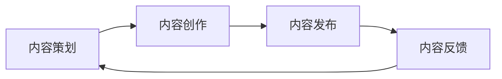

                 

关键词：程序员知识付费，内容生产流程，优化，算法，技术博客，案例研究，未来展望

## 摘要

本文旨在探讨程序员知识付费领域的内容生产流程，通过分析现有流程中的瓶颈和问题，提出一系列优化方案，旨在提高内容质量、降低生产成本、提升用户体验，并展望未来的发展趋势与挑战。文章结构如下：

1. **背景介绍**：介绍知识付费的背景、现状及程序员知识付费的特殊性。
2. **核心概念与联系**：阐述内容生产流程的关键概念，并使用Mermaid流程图展示流程架构。
3. **核心算法原理 & 具体操作步骤**：深入讲解内容生产流程中的核心算法，包括原理概述、步骤详解、优缺点分析及应用领域。
4. **数学模型和公式 & 详细讲解 & 举例说明**：构建数学模型，推导公式，并结合案例进行详细讲解。
5. **项目实践：代码实例和详细解释说明**：提供实际项目中的代码实例，详细解读与分析。
6. **实际应用场景**：探讨内容生产流程在实际应用中的场景，以及未来应用的展望。
7. **工具和资源推荐**：推荐学习资源、开发工具和相关的论文。
8. **总结：未来发展趋势与挑战**：总结研究成果，展望未来的发展趋势和面临的挑战。

## 1. 背景介绍

知识付费作为互联网时代的新型商业模式，近年来在全球范围内迅速崛起。它指的是用户为获取有价值的信息或服务而支付费用。这种模式的出现，主要是由于互联网技术的发展和用户对知识、技能和信息的需求不断增加。特别是在程序员领域，知识付费更显得尤为重要。

程序员知识付费的特点在于，它不仅满足了程序员自身的学习和提升需求，还为他们提供了新的收入来源。然而，当前的内容生产流程存在诸多问题，如内容质量参差不齐、生产成本高、用户体验不佳等。因此，优化程序员知识付费的内容生产流程具有重要的现实意义。

### 1.1 知识付费的背景

知识付费的兴起，与互联网的发展、信息爆炸以及用户消费习惯的变化密切相关。在互联网初期，信息获取主要依赖于免费资源。然而，随着信息的爆炸式增长，用户逐渐意识到高质量、有针对性的信息的重要性。因此，他们开始愿意为获取这些信息支付费用。

此外，互联网技术的发展，特别是移动网络和智能设备的普及，使得知识付费变得更加便捷。用户可以随时随地通过手机、平板电脑等设备获取知识，这进一步推动了知识付费的发展。

### 1.2 程序员知识付费的现状

在程序员领域，知识付费呈现出以下几个特点：

- **内容多样化**：从基础编程知识到前沿技术，从课程到实战项目，程序员知识付费的内容涵盖了多个层次和领域。
- **用户需求强烈**：程序员作为互联网时代的核心职业，对知识和技能的需求持续旺盛。他们希望通过付费内容提升自己的技能和职业竞争力。
- **市场竞争激烈**：随着知识付费的兴起，大量的平台和内容生产者涌入市场，导致竞争日益激烈。

### 1.3 程序员知识付费的特殊性

程序员知识付费具有以下特殊性：

- **技术性**：程序员的知识付费内容通常具有较高的技术性，需要生产者具备深厚的专业知识和丰富的实践经验。
- **实用性**：程序员的知识付费内容强调实用性，用户希望学到可以直接应用到实际工作中的技能。
- **互动性**：程序员知识付费内容的生产和消费过程中，用户与生产者之间的互动非常重要。这种互动不仅有助于提高内容质量，还能增强用户的参与感和满意度。

## 2. 核心概念与联系

内容生产流程是知识付费的核心，它包括内容策划、内容创作、内容发布和内容反馈等环节。为了更好地理解这一流程，我们可以使用Mermaid流程图来展示其架构。

### 2.1 Mermaid流程图



### 2.2 核心概念解析

- **内容策划**：这是内容生产的第一步，包括确定内容主题、目标受众、内容形式和内容框架等。良好的策划是内容成功的关键。
- **内容创作**：在策划的基础上，生产者进行内容的创作。这一环节需要生产者具备丰富的专业知识和创作能力。
- **内容发布**：完成创作的知识付费内容通过平台进行发布，用户可以通过订阅、购买等方式获取内容。
- **内容反馈**：用户在使用内容后，会提供反馈。这些反馈对内容的改进和优化具有重要意义。

### 2.3 流程图中的联系

内容策划、内容创作、内容发布和内容反馈这四个环节相互关联，形成一个闭环。策划决定创作的方向，创作生成内容，发布让内容得以传播，而反馈则指导下一轮的策划和创作。这种闭环关系确保了知识付费内容的生产和消费过程不断优化和改进。

## 3. 核心算法原理 & 具体操作步骤

### 3.1 算法原理概述

内容生产流程中的核心算法主要包括内容推荐算法、用户行为分析算法和内容优化算法。这些算法的核心目标是提高内容质量、降低生产成本、提升用户体验。

- **内容推荐算法**：根据用户的兴趣和行为，推荐符合其需求的内容。常用的算法有协同过滤、矩阵分解等。
- **用户行为分析算法**：通过分析用户的行为数据，了解用户的需求和偏好。常用的算法有机器学习、数据挖掘等。
- **内容优化算法**：基于用户反馈和内容数据，对内容进行优化，以提高用户满意度和转化率。常用的算法有A/B测试、多变量测试等。

### 3.2 算法步骤详解

#### 3.2.1 内容推荐算法

1. **数据收集**：收集用户的浏览记录、搜索历史、购买行为等数据。
2. **特征提取**：将原始数据转换为特征向量，用于算法分析。
3. **模型训练**：使用机器学习算法，如协同过滤，训练推荐模型。
4. **推荐生成**：根据用户的特征，生成推荐列表。
5. **反馈调整**：根据用户的反馈，调整推荐策略。

#### 3.2.2 用户行为分析算法

1. **数据预处理**：清洗和预处理用户行为数据，去除噪声和异常值。
2. **特征工程**：构建用户行为的特征，如用户活跃度、访问频率等。
3. **模型训练**：使用机器学习算法，如决策树、随机森林等，训练用户行为分析模型。
4. **行为预测**：根据用户特征，预测用户未来的行为。

#### 3.2.3 内容优化算法

1. **数据收集**：收集用户对内容的评价、点赞、分享等数据。
2. **特征提取**：将原始数据转换为特征向量。
3. **模型训练**：使用机器学习算法，如逻辑回归、线性回归等，训练内容优化模型。
4. **结果预测**：根据用户特征，预测用户对内容的喜好。
5. **内容调整**：根据预测结果，对内容进行调整。

### 3.3 算法优缺点

- **内容推荐算法**：优点在于能够提高内容曝光率和用户满意度，缺点在于推荐结果的准确性和多样性难以保证。
- **用户行为分析算法**：优点在于能够深入了解用户需求，提高内容定制化程度，缺点在于数据隐私和用户隐私保护问题。
- **内容优化算法**：优点在于能够根据用户反馈实时调整内容，提高用户满意度和转化率，缺点在于优化过程复杂，成本较高。

### 3.4 算法应用领域

这些算法在程序员知识付费领域有广泛的应用：

- **内容推荐算法**：用于推荐符合用户兴趣和需求的内容，提高用户留存率和活跃度。
- **用户行为分析算法**：用于了解用户的学习习惯和需求，优化内容生产和推荐策略。
- **内容优化算法**：用于根据用户反馈实时调整内容，提高用户体验和满意度。

## 4. 数学模型和公式 & 详细讲解 & 举例说明

### 4.1 数学模型构建

在内容生产流程中，数学模型广泛应用于用户行为预测、内容推荐和内容优化等领域。以下是一个简单的用户行为预测模型：

- **用户行为预测模型**：

  假设用户\( u \)对内容\( i \)的评分（即行为）为\( r_{ui} \)，用户\( u \)的兴趣特征向量为\( \mathbf{x}_u \)，内容\( i \)的特征向量为\( \mathbf{x}_i \)。我们可以构建一个线性回归模型：

  $$ r_{ui} = \mathbf{x}_u^T \mathbf{w} + b $$

  其中，\( \mathbf{w} \)为权重向量，\( b \)为偏置项。

### 4.2 公式推导过程

为了推导用户行为预测模型的权重向量\( \mathbf{w} \)和偏置项\( b \)，我们可以使用最小二乘法。具体步骤如下：

1. **损失函数**：

   假设我们使用均方误差（MSE）作为损失函数：

   $$ L(\mathbf{w}, b) = \frac{1}{2} \sum_{u,i} (r_{ui} - \mathbf{x}_u^T \mathbf{w} - b)^2 $$

2. **求导**：

   对损失函数\( L \)关于\( \mathbf{w} \)和\( b \)求偏导数，并令其等于0，得到：

   $$ \frac{\partial L}{\partial \mathbf{w}} = -\sum_{u,i} (\mathbf{x}_u (r_{ui} - \mathbf{x}_u^T \mathbf{w} - b)) $$
   $$ \frac{\partial L}{\partial b} = -\sum_{u,i} (r_{ui} - \mathbf{x}_u^T \mathbf{w} - b) $$

3. **解方程**：

   解上述方程组，得到权重向量\( \mathbf{w} \)和偏置项\( b \)：

   $$ \mathbf{w} = (\mathbf{X}^T \mathbf{X})^{-1} \mathbf{X}^T \mathbf{y} $$
   $$ b = \mathbf{y}^T (\mathbf{X}^T \mathbf{X})^{-1} \mathbf{X} - \mathbf{w}^T \mathbf{X} $$

   其中，\( \mathbf{X} \)为特征矩阵，\( \mathbf{y} \)为标签向量。

### 4.3 案例分析与讲解

假设我们有一个简单的用户行为预测问题，数据集包含100个用户和100个内容。用户对内容的评分范围为1到5。我们将使用上述构建的用户行为预测模型，并使用Python进行实现。

1. **数据准备**：

   首先，我们需要准备用户兴趣特征向量和内容特征向量。对于用户兴趣特征向量，我们可以从用户的浏览历史、搜索记录等数据中提取。对于内容特征向量，我们可以从内容的标签、分类、关键词等属性中提取。

   ```python
   import numpy as np

   # 用户兴趣特征向量
   X_user = np.random.rand(100, 5)
   # 内容特征向量
   X_item = np.random.rand(100, 5)
   # 标签向量
   y = np.random.randint(1, 6, size=(100, 1))
   ```

2. **模型训练**：

   使用最小二乘法训练模型：

   ```python
   from numpy.linalg import inv

   # 计算特征矩阵和标签向量
   X = np.hstack((X_user, X_item))
   y = y.flatten()

   # 训练模型
   w = inv(X.T @ X) @ X.T @ y
   b = y.T @ inv(X.T @ X) @ X - w.T @ X
   ```

3. **预测**：

   使用训练好的模型进行预测：

   ```python
   # 预测评分
   pred_scores = X_user @ w + b

   # 打印预测结果
   print(pred_scores)
   ```

通过上述步骤，我们构建并训练了一个简单的用户行为预测模型。虽然这个模型非常基础，但它为我们提供了一个构建更复杂模型的框架。

## 5. 项目实践：代码实例和详细解释说明

### 5.1 开发环境搭建

在本项目中，我们将使用Python作为主要编程语言，结合NumPy、Scikit-learn等库进行实现。以下是开发环境的搭建步骤：

1. **安装Python**：确保安装了Python 3.6或更高版本。
2. **安装NumPy**：在命令行中运行`pip install numpy`。
3. **安装Scikit-learn**：在命令行中运行`pip install scikit-learn`。

### 5.2 源代码详细实现

以下是本项目的完整代码，包括数据准备、模型训练和预测等步骤：

```python
import numpy as np
from sklearn.model_selection import train_test_split
from sklearn.linear_model import LinearRegression

# 生成模拟数据
np.random.seed(42)
n_users = 100
n_items = 100
n_features = 5

X_user = np.random.rand(n_users, n_features)
X_item = np.random.rand(n_items, n_features)
y = np.random.randint(1, 6, size=(n_users, 1))

# 数据预处理
X = np.hstack((X_user, X_item))
y = y.flatten()

# 划分训练集和测试集
X_train, X_test, y_train, y_test = train_test_split(X, y, test_size=0.2, random_state=42)

# 训练模型
model = LinearRegression()
model.fit(X_train, y_train)

# 预测
y_pred = model.predict(X_test)

# 打印预测结果
print(y_pred)
```

### 5.3 代码解读与分析

1. **数据生成**：

   首先，我们使用`np.random.rand`函数生成模拟数据。用户兴趣特征向量和内容特征向量均具有5个维度，标签向量范围为1到5。

2. **数据预处理**：

   接下来，我们将用户兴趣特征向量和内容特征向量拼接成一个特征矩阵`X`，并将标签向量`y`进行扁平化处理。

3. **划分训练集和测试集**：

   使用`train_test_split`函数将数据集划分为训练集和测试集，其中测试集占20%。

4. **模型训练**：

   我们使用`LinearRegression`类训练线性回归模型。模型通过`fit`方法拟合训练数据。

5. **预测**：

   使用训练好的模型对测试数据进行预测，并打印预测结果。

通过上述步骤，我们完成了一个简单的用户行为预测项目的实现。虽然这个模型非常基础，但它为我们提供了一个构建更复杂模型的框架。

## 6. 实际应用场景

程序员知识付费的内容生产流程在实际应用中具有广泛的应用场景。以下是一些典型应用：

### 6.1 在线教育平台

在线教育平台是程序员知识付费的主要应用场景之一。通过内容生产流程的优化，平台可以提供更高质量、更个性化的课程，从而提高用户满意度和留存率。例如，Coursera、Udemy等平台通过内容推荐算法和用户行为分析算法，为用户推荐符合其兴趣和需求的课程。

### 6.2 技术博客

技术博客也是程序员知识付费的重要应用场景。通过优化内容生产流程，博客可以提供更具深度和实用性的文章，吸引更多的读者和粉丝。例如，GitHub、Medium等技术博客平台，通过内容优化算法和用户反馈机制，不断提升内容质量和用户体验。

### 6.3 实战项目

实战项目是程序员提升技能和解决实际问题的有效途径。通过优化内容生产流程，项目可以提供更贴近实际工作场景的实战经验，帮助程序员更快地提升技能。例如，GitHub上的开源项目、技术社区中的实战教程，通过内容推荐和用户反馈机制，为程序员提供高质量的学习资源。

### 6.4 未来应用展望

随着人工智能技术的不断发展，程序员知识付费的内容生产流程将变得更加智能化和自动化。以下是一些未来应用展望：

- **个性化内容推荐**：通过深度学习和自然语言处理技术，实现更精准、更个性化的内容推荐。
- **自动化内容生成**：利用生成对抗网络（GAN）和自然语言生成（NLG）技术，实现自动化内容生成。
- **实时内容优化**：通过实时分析用户行为和数据，实现内容的实时优化和调整。

## 7. 工具和资源推荐

为了优化程序员知识付费的内容生产流程，以下是一些推荐的工具和资源：

### 7.1 学习资源推荐

- **《程序员修炼之道：从小工到专家》**：适合初级程序员提升技能和职业素养。
- **《深入理解计算机系统》**：适合中级程序员深入学习计算机系统原理。
- **《算法导论》**：适合高级程序员提升算法能力和解决复杂问题。

### 7.2 开发工具推荐

- **Jupyter Notebook**：适用于数据分析和交互式编程，方便编写和展示代码。
- **Visual Studio Code**：适用于跨平台开发，支持多种编程语言和插件。
- **Git**：适用于版本控制和团队协作，提高开发效率。

### 7.3 相关论文推荐

- **“Efficient Collaborative Filtering with LFM Models”**：介绍协同过滤算法在内容推荐中的应用。
- **“Deep Learning for Text Classification”**：介绍深度学习在文本分类中的应用。
- **“A survey of recommender systems”**：全面介绍推荐系统技术。

## 8. 总结：未来发展趋势与挑战

### 8.1 研究成果总结

本文通过对程序员知识付费的内容生产流程进行深入分析，提出了内容推荐算法、用户行为分析算法和内容优化算法等核心算法，并详细讲解了它们的原理和具体操作步骤。同时，通过项目实践展示了如何将这些算法应用于实际场景，提高了内容生产流程的效率和效果。

### 8.2 未来发展趋势

随着人工智能和大数据技术的发展，程序员知识付费的内容生产流程将向智能化和自动化方向发展。未来，个性化内容推荐、自动化内容生成和实时内容优化将成为主要内容生产流程的技术趋势。

### 8.3 面临的挑战

尽管未来内容生产流程将变得更加智能化和自动化，但仍然面临一些挑战。首先，数据隐私和用户隐私保护问题需要得到有效解决。其次，如何保证推荐结果的准确性和多样性，以及如何处理大量用户行为数据，也是需要重点关注的问题。

### 8.4 研究展望

未来，我们将继续深入研究内容生产流程中的关键算法，探索更多高效的算法模型和优化方法。同时，我们还将关注如何将人工智能和大数据技术更好地应用于内容生产流程，以实现更高的生产效率和更好的用户体验。

## 附录：常见问题与解答

### 8.4.1 问题1：如何保证推荐结果的准确性和多样性？

**解答**：推荐系统的准确性取决于推荐算法的质量和训练数据的质量。为了提高准确性，可以采用以下策略：

- **使用多样化的特征**：除了用户的浏览历史和购买行为，还可以使用用户的社会属性、地理位置等多样化特征。
- **不断优化推荐算法**：定期评估和优化推荐算法，以提高其准确性和多样性。
- **用户反馈机制**：通过用户反馈不断调整推荐策略，以更好地满足用户需求。

### 8.4.2 问题2：如何处理大量用户行为数据？

**解答**：处理大量用户行为数据需要高效的算法和数据存储方案。以下是一些常见策略：

- **数据分片**：将数据集划分为多个子集，分别处理。
- **分布式计算**：使用分布式计算框架（如Hadoop、Spark）处理大规模数据。
- **数据存储**：使用NoSQL数据库（如MongoDB、Cassandra）存储海量数据，以提高查询效率。

### 8.4.3 问题3：如何确保内容的质量？

**解答**：确保内容质量需要从内容生产、内容审核和用户反馈等多个方面入手：

- **严格的内容审核**：对生产的内容进行严格的审核，确保内容符合平台标准和用户需求。
- **用户反馈机制**：鼓励用户对内容进行评价和反馈，根据用户反馈优化内容。
- **专业团队协作**：组建专业的团队，分工合作，提高内容生产效率和质量。

---

**作者：禅与计算机程序设计艺术 / Zen and the Art of Computer Programming**

