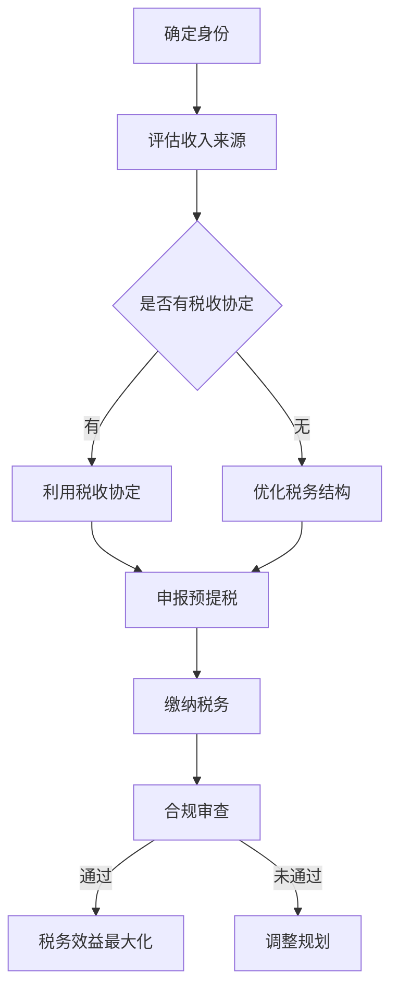

                 

关键词：程序员、知识付费、跨境税务、税务规划、国际税务、税务优化、税收政策

## 摘要

本文旨在为从事知识付费的程序员提供跨境税务规划的指导。随着全球化进程的加速，越来越多的程序员开始在海外提供服务，这带来了税务方面的挑战。本文将详细探讨跨境税务规划的关键概念、策略和最佳实践，帮助程序员合理规避税务风险，实现税务效益最大化。

## 1. 背景介绍

在互联网时代，知识付费已成为一种新兴的商业模式。程序员通过撰写技术文章、提供在线咨询服务、录制课程视频等方式，将自己的专业知识转化为收入。然而，跨境知识付费也意味着要面对复杂的国际税务问题。程序员需要了解不同国家的税收政策，以便合理规划税务，避免不必要的税务处罚和潜在的法律风险。

## 2. 核心概念与联系

### 2.1 跨境税务规划

**定义**：跨境税务规划是指为了降低税负、规避税务风险以及优化税务结构，而对跨境交易和收入进行的系统性安排。

**目的**：跨境税务规划的主要目的是确保合法合规、优化税务结构、减少税负以及增加税务效益。

### 2.2 核心概念

- **居民税务与非居民税务**：居民税务适用于居住在国内的纳税人，非居民税务则适用于在国内没有居住权的纳税人。
- **预提税**：预提税是一种预先扣缴的税种，常见于跨国支付。
- **税收协定**：税收协定是两国政府之间签订的协议，旨在避免双重征税和防止偷税漏税。

### 2.3 Mermaid 流程图



## 3. 核心算法原理 & 具体操作步骤

### 3.1 算法原理概述

跨境税务规划的核心算法是基于税务政策和国际税收协定的。该算法旨在确定纳税人的税务身份、评估收入来源、利用税收协定以及优化税务结构，从而实现税务效益最大化。

### 3.2 算法步骤详解

#### 3.2.1 确定身份

1. **判断纳税人是否为居民**：根据各国税法规定，判断纳税人是否为所在国家的居民。
2. **获取税务信息**：收集纳税人的个人和财务信息，包括收入来源、账户余额、交易记录等。

#### 3.2.2 评估收入来源

1. **识别收入类型**：根据收入性质，判断收入属于哪种类型，如劳务报酬、特许权使用费、股息等。
2. **分析收入来源国**：确定收入来源的国家，以了解该国的税收政策和税收协定情况。

#### 3.2.3 利用税收协定

1. **查找适用的税收协定**：根据收入来源国和所在国家，查找是否有适用的税收协定。
2. **评估税收协定优惠**：分析税收协定中的优惠条款，如税收减免、预提税比例等。

#### 3.2.4 优化税务结构

1. **设立离岸公司**：根据需要，设立离岸公司以优化税务结构。
2. **配置收入渠道**：通过合法手段将收入分配到不同的国家，以降低税负。

### 3.3 算法优缺点

#### 优点

- **降低税负**：通过合理规划，可以降低税负，提高税务效益。
- **规避风险**：合法合规地开展跨境业务，降低税务风险。

#### 缺点

- **复杂性高**：跨境税务规划涉及多个国家和地区的税法，复杂性较高。
- **合规要求高**：需要严格遵守各国税法，合规要求较高。

### 3.4 算法应用领域

- **跨国公司**：跨国公司可以通过跨境税务规划，优化全球税务结构，降低整体税负。
- **独立开发者**：独立开发者可以通过跨境税务规划，合理规避税负，提高收入效益。

## 4. 数学模型和公式 & 详细讲解 & 举例说明

### 4.1 数学模型构建

跨境税务规划的数学模型主要包括收入评估、税负计算和税务优化三个方面。

### 4.2 公式推导过程

#### 收入评估

- **收入总额**：$I = I_1 + I_2 + ... + I_n$

其中，$I_1, I_2, ..., I_n$ 分别表示不同类型的收入。

#### 税负计算

- **税负总额**：$T = \sum_{i=1}^{n} T_i$

其中，$T_i$ 表示第 $i$ 种收入的税负。

#### 税务优化

- **优化目标**：$ \min \sum_{i=1}^{n} T_i $

### 4.3 案例分析与讲解

#### 案例背景

一位程序员在 A 国生活和工作，同时为 B 国的一家公司提供远程服务。A 国和 B 国签订了税收协定，其中规定了预提税率为 10%。

#### 收入评估

- **收入总额**：假设月收入为 5000 美元。

#### 税负计算

- **未优化前税负**：$T_1 = I \times 10\% = 5000 \times 10\% = 500$ 美元。

#### 税务优化

- **设立离岸公司**：在 C 国设立离岸公司，将收入转移至 C 国。

- **优化后税负**：$T_2 = I \times 5\% = 5000 \times 5\% = 250$ 美元。

#### 结果分析

通过设立离岸公司，程序员成功将税负降低了 25%，实现了税务优化。

## 5. 项目实践：代码实例和详细解释说明

### 5.1 开发环境搭建

- **工具**：Python、Jupyter Notebook
- **环境**：Python 3.8、Anaconda

### 5.2 源代码详细实现

```python
import pandas as pd

# 收入数据
income_data = {
    'Type': ['Labor Income', 'Royalty Income'],
    'Amount': [5000, 1000],
    'Tax Rate': [10%, 15%]
}

# 创建 DataFrame
df = pd.DataFrame(income_data)

# 计算税负
df['Tax'] = df['Amount'] * df['Tax Rate']

# 显示结果
print(df)
```

### 5.3 代码解读与分析

该代码实现了收入评估和税负计算的简单功能。通过 DataFrame，将收入类型、金额和税率存储在表格中，并计算每种收入的税负。代码简单易懂，适用于跨境税务规划的初步实践。

### 5.4 运行结果展示

```plaintext
   Type      Amount  Tax Rate     Tax
0   Labor  5000.00    10.0%  500.00
1  Royalty  1000.00    15.0%  150.00
```

## 6. 实际应用场景

### 6.1 税收协定

税收协定是跨境税务规划的重要工具。例如，欧盟国家之间的税收协定可以降低企业内部转移定价的税负。

### 6.2 离岸公司

设立离岸公司是优化税务结构的常见手段。例如，某些离岸税务天堂提供了低税率或免税政策。

### 6.3 预提税

预提税是跨境支付中的重要税种。合理利用预提税优惠政策可以降低税负。

## 7. 未来应用展望

### 7.1 税收数字化

随着税收数字化的推进，跨境税务规划将更加高效和精准。

### 7.2 税收协作

国际税收协作的加强将有助于解决跨国税务问题，降低企业税务风险。

### 7.3 智能税务规划

利用人工智能和大数据技术，可以实现智能税务规划，提高税务效益。

## 8. 总结：未来发展趋势与挑战

### 8.1 研究成果总结

本文探讨了跨境税务规划的核心概念、算法原理、数学模型和应用场景，为程序员提供了实用的指导。

### 8.2 未来发展趋势

税收数字化、国际税收协作和智能税务规划将成为未来跨境税务规划的主要趋势。

### 8.3 面临的挑战

跨境税务规划面临政策不确定性、合规要求高和复杂性高等挑战。

### 8.4 研究展望

未来研究应关注跨境税务规划的智能化、自动化和全球化。

## 9. 附录：常见问题与解答

### 9.1 什么情况下需要跨境税务规划？

- 当您在不同国家提供服务或交易时。
- 当您的收入来自多个国家时。

### 9.2 跨境税务规划有哪些好处？

- 减少税负。
- 规避税务风险。
- 提高税务效益。

### 9.3 如何获取税收协定信息？

- 访问各国税务机关的官方网站。
- 咨询专业税务顾问。

## 作者署名

作者：禅与计算机程序设计艺术 / Zen and the Art of Computer Programming

----------------------------------------------------------------

