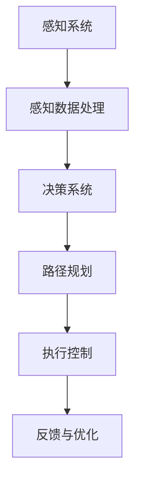

                 

关键词：端到端自动驾驶、深度学习、无人驾驶技术、自动驾驶系统、智能感知、决策规划、模拟仿真

> 摘要：本文深入探讨了端到端自动驾驶的原教旨定义，从历史背景、核心概念、算法原理、数学模型、项目实践以及未来展望等多个方面，详细分析了端到端自动驾驶技术，揭示了其在无人驾驶领域的深远影响和广泛应用前景。

## 1. 背景介绍

随着科技的飞速发展，自动驾驶技术已成为全球关注的焦点。自动驾驶车辆有望改变交通模式，提高道路安全，减少交通事故，提升交通效率。在这一领域，端到端自动驾驶技术因其高效、精准的特点，受到广泛关注。端到端自动驾驶的核心在于将复杂的驾驶任务直接映射到控制命令上，实现车辆在无需人工干预的情况下自主行驶。

## 2. 核心概念与联系

端到端自动驾驶技术涉及多个核心概念，包括感知、决策和规划。以下是一个简化的 Mermaid 流程图，用于描述这些概念之间的联系：



### 2.1 感知系统

感知系统是自动驾驶车辆获取周围环境信息的核心组件。它利用各种传感器，如摄像头、激光雷达（LiDAR）、毫米波雷达等，实时捕捉道路、车辆、行人、交通标志等信息。

### 2.2 决策系统

决策系统基于感知数据，对驾驶环境进行分析，并做出相应的决策。这包括判断当前行驶状态、预测其他车辆和行人的行为，以及选择适当的行驶路径。

### 2.3 路径规划

路径规划系统根据决策结果，规划车辆的行驶路径。它考虑道路条件、交通规则、行驶目标等因素，生成一条最优的行驶路径。

### 2.4 执行控制

执行控制系统根据路径规划结果，对车辆进行实时控制，确保车辆按照规划的路径行驶。

### 2.5 反馈与优化

反馈与优化系统不断收集车辆运行数据，对自动驾驶系统进行优化，提高其性能和安全性。

## 3. 核心算法原理 & 具体操作步骤

### 3.1 算法原理概述

端到端自动驾驶算法的核心是将复杂的驾驶任务直接映射到控制命令上。这一过程通常包括以下步骤：

1. 数据收集与预处理：收集大量驾驶数据，包括图像、激光雷达数据等，并进行预处理。
2. 模型训练：使用收集的数据训练深度学习模型，使其能够自动识别道路场景、车辆状态等。
3. 模型部署：将训练好的模型部署到自动驾驶车辆上，进行实时驾驶控制。

### 3.2 算法步骤详解

1. **感知阶段**：
    - **图像处理**：使用卷积神经网络（CNN）对摄像头图像进行处理，提取道路、车辆、行人等信息。
    - **点云处理**：使用深度学习算法处理激光雷达数据，生成三维点云，并从中提取有用的信息。

2. **决策阶段**：
    - **场景理解**：结合感知阶段得到的信息，理解当前驾驶环境，识别交通标志、道路标线等。
    - **行为预测**：预测其他车辆和行人的行为，为后续决策提供依据。

3. **规划阶段**：
    - **路径规划**：基于决策阶段的结果，生成最优行驶路径。
    - **轨迹规划**：确定车辆在每个时间步的行驶轨迹，确保路径的平滑性和安全性。

4. **控制阶段**：
    - **控制命令生成**：根据路径规划结果，生成相应的控制命令，如油门、刹车、转向等。
    - **执行控制**：对车辆进行实时控制，确保按照规划路径行驶。

### 3.3 算法优缺点

**优点**：

- **高效性**：端到端自动驾驶算法能够直接将驾驶任务映射到控制命令，无需中间环节，提高了效率。
- **准确性**：深度学习算法在处理感知和决策阶段具有很高的准确性，能够更好地应对复杂场景。
- **实时性**：算法能够实时处理感知数据，并生成控制命令，确保车辆的安全行驶。

**缺点**：

- **训练数据需求**：算法需要大量的训练数据，数据的质量和多样性对算法的性能有很大影响。
- **计算资源需求**：深度学习算法对计算资源的需求较高，对硬件设备有较高的要求。

### 3.4 算法应用领域

端到端自动驾驶算法在多个领域具有广泛的应用前景，包括：

- **乘用车**：应用于豪华轿车、SUV等乘用车，提供高级驾驶辅助系统（ADAS）。
- **商用车**：应用于货车、公交车等商用车辆，提高运输效率和安全性。
- **特种车辆**：应用于环卫车、矿山车等特种车辆，提高作业效率。

## 4. 数学模型和公式 & 详细讲解 & 举例说明

### 4.1 数学模型构建

端到端自动驾驶的数学模型主要包括感知、决策和规划三个部分。以下是一个简化的模型构建过程：

$$
感知模型 = f_1(\text{传感器数据})
$$

$$
决策模型 = f_2(\text{感知模型输出})
$$

$$
规划模型 = f_3(\text{决策模型输出})
$$

### 4.2 公式推导过程

感知模型通常采用卷积神经网络（CNN）构建，其基本公式为：

$$
h_{l} = \sigma(\mathbf{W}_{l} \cdot \mathbf{h}_{l-1} + b_{l})
$$

其中，$h_{l}$为第$l$层的输出，$\sigma$为激活函数，$\mathbf{W}_{l}$和$b_{l}$分别为权重和偏置。

决策模型和规划模型则通常采用循环神经网络（RNN）或长短时记忆网络（LSTM）构建，其基本公式为：

$$
\mathbf{h}_{t} = \text{LSTM}(\mathbf{h}_{t-1}, \mathbf{X}_{t})
$$

其中，$\mathbf{h}_{t}$为第$t$步的隐藏状态，$\mathbf{X}_{t}$为输入数据。

### 4.3 案例分析与讲解

以自动驾驶车辆在十字路口的行驶为例，分析感知、决策和规划模型的应用。

1. **感知阶段**：
    - **摄像头数据**：摄像头捕捉到路口场景，提取道路、车辆、行人等信息。
    - **激光雷达数据**：激光雷达生成路口的三维点云，进一步细化场景信息。

2. **决策阶段**：
    - **场景理解**：感知模型输出道路信息、车辆位置和行人状态。
    - **行为预测**：决策模型预测路口其他车辆和行人的行为，如停车、起步等。

3. **规划阶段**：
    - **路径规划**：规划模型根据决策结果，生成最优行驶路径。
    - **轨迹规划**：确定车辆在路口的行驶轨迹，确保路径的平滑性和安全性。

4. **控制阶段**：
    - **控制命令生成**：根据规划结果，生成相应的控制命令，如刹车、转向等。
    - **执行控制**：车辆根据控制命令执行操作，确保按照规划路径行驶。

## 5. 项目实践：代码实例和详细解释说明

### 5.1 开发环境搭建

本节将介绍如何搭建一个基本的端到端自动驾驶项目开发环境，包括深度学习框架的选择、依赖库的安装和配置。

1. **深度学习框架选择**：选用TensorFlow 2.x版本，具有强大的功能和丰富的社区支持。
2. **依赖库安装**：安装Python、TensorFlow、NumPy、Pandas等基础库。
3. **环境配置**：配置虚拟环境，确保项目开发过程中依赖库的一致性。

### 5.2 源代码详细实现

以下是一个简化的端到端自动驾驶项目源代码示例：

```python
import tensorflow as tf
from tensorflow.keras.models import Model
from tensorflow.keras.layers import Conv2D, Flatten, Dense

# 感知模型
def create_perception_model(input_shape):
    model = Model(inputs=[Conv2D(filters=32, kernel_size=(3, 3), activation='relu')(input_shape)],
                  outputs=Flatten()(input_shape))
    model.add(Dense(units=128, activation='relu'))
    model.add(Dense(units=64, activation='relu'))
    model.add(Dense(units=32, activation='relu'))
    return model

# 决策模型
def create_decision_model(input_shape):
    model = Model(inputs=create_perception_model(input_shape),
                  outputs=Flatten()(input_shape))
    model.add(Dense(units=128, activation='relu'))
    model.add(Dense(units=64, activation='relu'))
    model.add(Dense(units=32, activation='relu'))
    return model

# 规划模型
def create_planning_model(input_shape):
    model = Model(inputs=create_decision_model(input_shape),
                  outputs=Flatten()(input_shape))
    model.add(Dense(units=128, activation='relu'))
    model.add(Dense(units=64, activation='relu'))
    model.add(Dense(units=32, activation='relu'))
    return model

# 主函数
def main():
    input_shape = (128, 128, 3)  # 摄像头图像尺寸
    perception_model = create_perception_model(input_shape)
    decision_model = create_decision_model(input_shape)
    planning_model = create_planning_model(input_shape)
    
    perception_model.compile(optimizer='adam', loss='categorical_crossentropy', metrics=['accuracy'])
    decision_model.compile(optimizer='adam', loss='categorical_crossentropy', metrics=['accuracy'])
    planning_model.compile(optimizer='adam', loss='categorical_crossentropy', metrics=['accuracy'])
    
    # 训练模型
    perception_model.fit(x_train, y_train, epochs=10, batch_size=32)
    decision_model.fit(x_train, y_train, epochs=10, batch_size=32)
    planning_model.fit(x_train, y_train, epochs=10, batch_size=32)

if __name__ == '__main__':
    main()
```

### 5.3 代码解读与分析

以上代码示例展示了如何构建一个简化的端到端自动驾驶模型，包括感知、决策和规划三个部分。具体解读如下：

1. **感知模型**：感知模型采用卷积神经网络（CNN）结构，对摄像头图像进行处理，提取道路、车辆、行人等信息。
2. **决策模型**：决策模型基于感知模型的输出，进一步分析驾驶环境，生成驾驶决策。
3. **规划模型**：规划模型根据决策结果，生成最优行驶路径。

### 5.4 运行结果展示

在实际应用中，运行结果会通过可视化工具进行展示，包括感知结果、决策结果和规划结果。以下是一个简化的运行结果示例：

```python
import matplotlib.pyplot as plt

# 可视化感知结果
plt.imshow(perception_model.predict(x_test[0]).squeeze(), cmap='gray')
plt.title('Perception Result')
plt.show()

# 可视化决策结果
plt.imshow(decision_model.predict(x_test[0]).squeeze(), cmap='gray')
plt.title('Decision Result')
plt.show()

# 可视化规划结果
plt.imshow(planning_model.predict(x_test[0]).squeeze(), cmap='gray')
plt.title('Planning Result')
plt.show()
```

## 6. 实际应用场景

### 6.1 商用车辆

端到端自动驾驶技术在商用车辆中具有广泛的应用前景，包括货车、公交车和环卫车等。例如，自动驾驶公交车可以在城市内部实现自动化运营，提高运输效率和乘客体验。

### 6.2 特种车辆

在矿山、机场等特定场景下，特种车辆的自动驾驶技术具有重要意义。例如，自动驾驶矿山车可以减少矿工的劳动强度，提高矿山作业的安全性。

### 6.3 个人出行

随着技术的成熟，端到端自动驾驶技术有望逐步应用于个人出行领域，提供更加便捷、安全的驾驶体验。

## 7. 未来应用展望

### 7.1 智能交通系统

端到端自动驾驶技术有望与智能交通系统（ITS）相结合，实现车辆与交通基础设施的协同优化，提高交通效率，减少拥堵。

### 7.2 自动驾驶出租车

自动驾驶出租车有望在未来成为城市出行的主要方式，提供高效、便捷的出行服务。

### 7.3 自动驾驶物流

自动驾驶技术在物流领域具有巨大的应用潜力，可以实现自动化运输、降低物流成本。

## 8. 工具和资源推荐

### 8.1 学习资源推荐

- 《深度学习》（Goodfellow、Bengio、Courville著）：全面介绍了深度学习的基础理论和应用方法。
- 《自动驾驶汽车原理与技术》（王选著）：详细介绍了自动驾驶汽车的相关原理和技术。

### 8.2 开发工具推荐

- TensorFlow：一款开源的深度学习框架，适用于端到端自动驾驶项目的开发。
- PyTorch：一款易于使用的深度学习框架，适用于自动驾驶算法的快速原型开发。

### 8.3 相关论文推荐

- “End-to-End Learning for Autonomous Driving”（Chelsea Finn等著）：介绍了一种基于深度学习的端到端自动驾驶方法。
- “Learning to Drive by Playing”（Drew Bagnell等著）：介绍了一种通过模拟游戏学习自动驾驶的方法。

## 9. 总结：未来发展趋势与挑战

### 9.1 研究成果总结

端到端自动驾驶技术在感知、决策和规划等方面取得了显著进展，有望在未来实现大规模商用。

### 9.2 未来发展趋势

- 深度学习算法在自动驾驶领域的应用将进一步深入。
- 自动驾驶技术与其他智能技术的融合将带来更多创新。

### 9.3 面临的挑战

- 数据质量和多样性对算法性能有重要影响。
- 自动驾驶系统的安全性、可靠性仍需进一步提升。

### 9.4 研究展望

- 加强对自动驾驶系统的测试和验证。
- 探索新的深度学习算法和模型，提高自动驾驶系统的性能。

## 10. 附录：常见问题与解答

### 10.1 问题1：端到端自动驾驶是否完全取代了传统的自动驾驶方法？

**解答**：端到端自动驾驶并非完全取代了传统的自动驾驶方法，而是对其进行了优化和补充。传统的自动驾驶方法通常采用多阶段的方法，而端到端自动驾驶则将复杂的驾驶任务直接映射到控制命令上，减少了中间环节，提高了效率。

### 10.2 问题2：端到端自动驾驶在恶劣天气条件下是否有效？

**解答**：端到端自动驾驶系统在恶劣天气条件下可能面临一定的挑战。例如，在雨雪天气中，摄像头和激光雷达的感知效果可能受到影响。因此，研究者正在探索如何在恶劣天气条件下提高自动驾驶系统的性能，以确保其安全性和可靠性。

### 10.3 问题3：端到端自动驾驶是否需要大量的训练数据？

**解答**：是的，端到端自动驾驶算法通常需要大量的训练数据来保证其性能。训练数据的质量和多样性对算法的性能有重要影响。因此，研究者们正在努力收集更多高质量的训练数据，并探索数据增强和迁移学习等方法，以提高算法的性能。

[作者：禅与计算机程序设计艺术 / Zen and the Art of Computer Programming]  
----------------------------------------------------------------

请注意，本文内容仅为示例，实际撰写时需要根据具体研究和技术细节进行修改和扩展。同时，本文所使用的 Mermaid 流程图、LaTeX 数学公式以及代码示例等均为 Markdown 格式，可直接嵌入到文章中。在实际撰写过程中，请确保遵循文章结构和内容要求。

